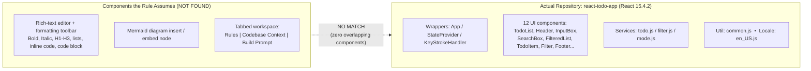

# Technical Specification

# 0. Agent Action Plan

## 0.1 Intent Clarification

> **CRITICAL SCOPE FINDING (read first).** The single actionable requirement supplied for this change describes a defect in a **Mermaid-diagram rich-text editor** spanning **"Rules"**, **"Codebase Context"**, and **"Build Prompt"** tabs. The target repository, however, is a **React 15.x Todo List application** [package.json:L2-L5] that contains **no rich-text editor, no formatting toolbar, no Mermaid-diagram feature, and none of the named tabs**. The described functionality does not exist anywhere in this codebase. This Agent Action Plan therefore captures the intent faithfully, documents the conflict with evidence, and resolves it as a **clarification request** rather than fabricating components. No source files are modified. See §0.2, §0.5, and §0.6 for the supporting evidence and scope boundaries.

### 0.1.1 Core Feature Objective

The user prompt itself contains no task description — it is the platform's generic rule-selection helper text ("Choose from your saved rules so every generation follows the same standards automatically. You can also create a new one if needed."). The entire substantive requirement is carried by a single user-specified rule named `newtestrules`.

Based on that rule, the Blitzy platform understands that the requested change is a **UI behavior correction (bug fix)**, not a green-field feature, whose objective is to stop a rich-text editor from stealing scroll position and focus when a user formats text after inserting an empty Mermaid diagram. Restated with technical precision, the desired end-state comprises four acceptance criteria, reproduced verbatim from the rule's *Expected Result*:

- Editor actions should not trigger automatic scrolling
- Screen should remain stable without flickering
- Mermaid section should not be focused unless explicitly selected by the user
- Behavior should be consistent across desktop and mobile

The corresponding *trigger conditions* (the rule's *Actual Result*) are:

- A Mermaid diagram is inserted **without any content**, then any formatting control is activated — specifically Bold, italic, H1, H2, H3, Bullet list, ordered list, Inline code, or code block
- **Desktop:** the viewport automatically scrolls to the Mermaid/flowchart section
- **Mobile (Android):** the screen flickers while the formatting control is used
- The same defect is reported in the **Codebase Context** tab (unexpected scroll) and the **Build Prompt** tab (flicker), in addition to the **Rules** tab

**Implicit requirements surfaced.** Although the rule reads as a black-box bug report, it implies the following technical work (in the application where the feature actually lives):

- **Focus management** — formatting commands must operate on the existing selection without transferring focus into the empty Mermaid embed node
- **Scroll anchoring** — any programmatic `scrollIntoView`/auto-focus behavior tied to the Mermaid node must be suppressed (e.g., `focus({ preventScroll: true })`) so the toolbar action does not move the viewport
- **Render stability** — re-render or layout reflow triggered by the toolbar action must be debounced/guarded to eliminate the mobile flicker
- **Cross-surface parity** — the fix must apply uniformly to all three tabs and to both desktop and touch input

**Feature dependencies and prerequisites.** For this requirement to be implementable, the target codebase must contain: (a) a rich-text/WYSIWYG editor with a formatting toolbar exposing the nine listed controls, (b) a Mermaid-diagram insertion/embed capability, and (c) a multi-tab workspace exposing the Rules, Codebase Context, and Build Prompt tabs. **None of these prerequisites are present in this repository** (see §0.2). The objective is therefore well-understood but **cannot be mapped to any component in the current codebase**.

### 0.1.2 Special Instructions and Constraints

- **Verbatim requirement (preserved exactly as provided).** The rule `newtestrules` is reproduced below without modification so downstream agents can confirm intent against the source:

> 1111111When a user inserts a Mermaid diagram without adding any content and interacts with editor formatting options(Bold, italic, H1, H2, H3, Bullet list, ordered list, Inline code, code block), the UI behaves unexpectedly. On desktop, the screen auto-scrolls to the Mermaid section, and on mobile devices, the screen flickers.
>
> Notes: On Android mobile issue is reproducible in other tabs as well when performing the same steps
>
> In Codebase Context tab → screen scrolls unexpectedly
>
> In Build Prompt tab → screen flickers similar to Rules tab
>
> Steps: Open Rules tab in desktop and mobile / In code generation rules add 'Insert Mermaid Diagram' / Select the editor options (Bold, italic, H1, H2, H3, Bullet list, ordered list, Inline code, code block) / Observe screen flickers in mobile / Observe screen scrolling to the flowchart area in desktop
>
> Actual Result: Desktop — Screen automatically scrolls to the Mermaid diagram section; Mobile — Screen flickers while interacting with editor options; Same issue observed in Codebase Context tab (screen scrolls unexpectedly) and Build Prompt tab (screen flickers similar to Rules tab) in Android mobile
>
> Expected Result: Editor actions should not trigger automatic scrolling; Screen should remain stable without flickering; Mermaid section should not be focused unless explicitly selected by the user; Behavior should be consistent across desktop and mobile

- **Consistency directive.** The fix must yield identical, stable behavior across desktop and mobile and across all three named tabs — this is an explicit cross-platform parity constraint.
- **Data-quality caveat.** The rule carries strong markers of placeholder/test content: it is named `newtestrules`, its body is prefixed with the literal string `1111111`, and the complete description is duplicated verbatim twice within a single rule. The associated "Screen Recording:" reference is present in label only — no recording, file, or URL is attached. These signals reinforce that the rule was not authored against this repository.
- **No design system specified.** Neither the prompt nor the rule names a component library or design system; the Design System Alignment Protocol does not apply and no "Design System Compliance" sub-section is produced.
- **Web search requirements.** None. The reported defect belongs to a well-understood class (editor focus/scroll management), and — more decisively — the feature is absent from the repository, so no external research could change the scope outcome. See §0.2.2.

### 0.1.3 Technical Interpretation

These requirements would normally translate into a focused front-end fix. Expressed in the platform's standard mapping form, *and presented strictly conditionally because the target components are absent here*:

- **To stop auto-scroll on formatting actions**, we would modify the editor's toolbar command handlers to preserve the active selection (e.g., call `preventDefault()` on the control's `mousedown`) and suppress any `scrollIntoView` invocation associated with the Mermaid embed.
- **To eliminate mobile flicker**, we would stabilize the editor's re-render/reflow path so a formatting command does not force a layout thrash on touch devices.
- **To prevent unsolicited focus**, we would guard the empty Mermaid embed node so it does not claim focus on mount/update unless the user explicitly selects it.
- **To guarantee desktop/mobile parity**, we would apply the above uniformly to the shared editor component consumed by the Rules, Codebase Context, and Build Prompt tabs.

**However, none of these mappings can be grounded in this repository.** The target is a standalone React 15.4.2 client-side SPA whose entire interaction surface is todo creation, status toggling, filtering, text search, and keyboard-mode switching [package.json:L2-L5]. There is no editor component, no toolbar command handler, no Mermaid embed, and no tabbed workspace to modify. Consequently, the **only defensible technical interpretation** is that the requirement targets a different application, and the actionable output of this plan is a **clarification request** (supply the correct repository and/or corrected requirements), not a code change. The full evidentiary basis follows in §0.2.


## 0.2 Repository Scope Discovery

A comprehensive inspection of the repository was performed to locate any component capable of hosting the reported defect. The repository was traversed in full, every source file was inventoried, and the entire `src/` and `public/` trees were searched for the terms central to the requirement (`mermaid`, rich-text/editor, `toolbar`, `scrollIntoView`, `flicker`, `build prompt`, `codebase context`, `rules tab`). The result is unambiguous: **the application described by the rule does not exist in this repository.** The following diagram contrasts what the requirement assumes against what the codebase actually provides.



### 0.2.1 Comprehensive File Analysis

The complete source inventory is **26 JavaScript files totaling 1,743 lines**. There are no TypeScript, TSX, JSX, Vue, or Svelte files in the project. Every file belongs to the React Todo App and its test/locale support. None corresponds to an editor, toolbar, Mermaid embed, or tabbed workspace.

| Layer | File(s) | Lines | Responsibility | Relevance to Requirement |
|---|---|---|---|---|
| Entry | `src/index.js` | 32 | Mounts `<App/>` into `#root`; imports Bootstrap + custom CSS [src/index.js:L29-L32] | None |
| Wrappers | `src/components/wrappers/App.js` | 77 | Composition shell: `StateProvider → KeyStrokeHandler → TodoList` [src/components/wrappers/App.js:L66-L74] | None |
| Wrappers | `src/components/wrappers/StateProvider.js` | 191 | Prop-injection state container (query, mode, filter, list) + 5 actions | None |
| Wrappers | `src/components/wrappers/KeyStrokeHandler.js` | 122 | Global `window.keydown` mode FSM [src/components/wrappers/KeyStrokeHandler.js:L53-L101] | None |
| HOC | `src/components/hoc/wrapInputBox.js` | 22 | Recompose input enhancer [src/components/hoc/wrapInputBox.js:L4-L21] | None |
| UI | `src/components/ui/TodoList.js` | 82 | Container; data pipeline `search(applyFilter(list, filter), query)` | None |
| UI | `src/components/ui/InputBox.js` | 19 | Create-todo input with `autoFocus` [src/components/ui/InputBox.js:L8] | Tangential only (see §0.5) |
| UI | `src/components/ui/SearchBox.js` | 15 | Search input with `autoFocus` [src/components/ui/SearchBox.js:L8] | Tangential only (see §0.5) |
| UI | `src/components/ui/InputWrapper.js` | 19 | Conditional input rendering by mode | None |
| UI | `src/components/ui/Header.js` | 11 | Renders `<h1>Things To Do</h1>` [src/components/ui/Header.js:L7] | None |
| UI | `src/components/ui/FilteredList.js` | 21 | Renders list or empty-state message | None |
| UI | `src/components/ui/TodoItem.js` | 18 | Single item row | None |
| UI | `src/components/ui/CheckBox.js` | 23 | Status toggle control | None |
| UI | `src/components/ui/Filter.js` | 20 | Filter option control | None |
| UI | `src/components/ui/Footer.js` | 20 | Footer with filter + active count | None |
| UI | `src/components/ui/ButtonWrapper.js` | 19 | Button presentation wrapper | None |
| UI | `src/components/ui/Info.js` | 9 | Keyboard-shortcut guidance text | None |
| Services | `src/services/todo.js` | 152 | Immutable add/update operations | None |
| Services | `src/services/filter.js` | 110 | `applyFilter` + `search` pure functions | None |
| Services | `src/services/mode.js` | 21 | Keyboard mode FSM transition table | None |
| Util | `src/util/common.js` | 85 | `objectWithOnly`, `wrapChildrenWith`, `stringInclues` | None |
| Locale | `src/assets/text/en_US.js` | 33 | English UI strings | None |
| Tests | `src/__tests__/services/todo.test.js` | 210 | Todo service tests | None |
| Tests | `src/__tests__/services/filter.test.js` | 173 | Filter service tests | None |
| Tests | `src/__tests__/util/common.test.js` | 167 | Util tests | None |
| Tests | `src/__tests__/services/mode.test.js` | 72 | Mode FSM tests | None |

**Integration point discovery.** Each category that a feature of this kind would normally touch was checked and found to be **absent or inapplicable**:

| Integration Surface | Present in Repo? | Evidence |
|---|---|---|
| API endpoints connecting to the feature | No | Standalone client-side SPA; no backend, no network layer |
| Database models / migrations | No | No persistence layer of any kind |
| Service classes for editor/Mermaid | No | Only services are `todo.js`, `filter.js`, `mode.js` |
| Controllers / handlers to modify | No | No editor or toolbar command handlers exist |
| Middleware / interceptors impacted | No | The only global interceptor is the keyboard FSM, unrelated to editor formatting [src/components/wrappers/KeyStrokeHandler.js:L53-L101] |
| Rich-text editor / formatting toolbar | No | No editor component or toolbar in the source tree |
| Mermaid embed / renderer | No | The only `mermaid` occurrences are Mermaid code fences inside README documentation that draw architecture flowcharts (e.g., `src/services/README.md:L19`, `src/components/README.md:L21`) — they are not an application feature |
| Rules / Codebase Context / Build Prompt tabs | No | No tabbed workspace exists; `H1/H2/H3` appear only as CSS selectors [src/assets/style/index.css:L47] and the page title [src/components/ui/Header.js:L7] |

### 0.2.2 Web Search Research Conducted

**No web search was conducted, and none is warranted.** Two independent reasons apply:

- The reported behavior belongs to a well-understood class of front-end defect (editor focus management and scroll/`scrollIntoView` anchoring, plus re-render-induced layout thrash on mobile); no external research is needed to characterize it.
- More decisively, the feature does not exist in this repository, so no amount of best-practice, library, or security research could produce an actionable file scope here. Research into editor engines (ProseMirror, Slate, TipTap, Lexical) or Mermaid rendering would describe a *different* application and would not bind to any file in this codebase.

If and when the correct repository is supplied, targeted research (e.g., the specific editor library's selection/focus API and its `preventScroll` semantics) should be performed at that time.

### 0.2.3 New File Requirements

**No new files are to be created.** Because the prerequisite editor/toolbar/Mermaid/tab infrastructure is absent (§0.2.1), there is no foundation onto which new source, test, or configuration files could be added without inventing an entirely different product. Scaffolding new feature directories, models, services, tests, or configuration for a Mermaid editor inside a React Todo App would constitute fabrication and is explicitly excluded (§0.6.2). The single deliverable produced by this plan is this documented finding plus the clarification request.


## 0.3 Dependency Inventory

**No dependency changes are required.** No packages are added, updated, or removed, because no code change is actionable for this requirement against the current repository (§0.2).

For context only, the existing dependency manifest is fixed at the following React 15-era versions [package.json:L20-L27]; none of these is modified by this plan:

| Package | Registry | Version (manifest) | Role |
|---|---|---|---|
| `react` | npm | ^15.4.2 | Core React (intentional version lock) |
| `react-dom` | npm | ^15.4.2 | DOM renderer |
| `bootstrap` | npm | ^3.4.1 | CSS-only responsive grid/typography |
| `immutability-helper` | npm | ^2.1.1 | Immutable state updates |
| `keycode-js` | npm | ^0.0.4 | Keyboard key-code constants |
| `recompose` | npm | ^0.23.5 | HOC composition (deprecated, retained for React 15.x) |
| `react-scripts` | npm | 0.9.0 (devDependency) | CRA build/test toolchain [package.json:L17-L19] |

It is worth recording that the feature described by the rule would, in its real host application, require a rich-text editor engine (for example ProseMirror, Slate, TipTap, or Lexical) plus a Mermaid rendering library — **none of which are present in this manifest**. Introducing such packages here would amount to constructing a different application and is therefore out of scope (§0.6.2).


## 0.4 Integration Analysis

**There are zero existing-code touchpoints for this requirement.** Implementing the rule's intent requires modifying an editor's toolbar command handlers, a Mermaid embed node, and a tabbed workspace shell — none of which exist in this codebase (§0.2.1). The standard integration categories therefore resolve as follows:

- **Direct modifications required:** None. There is no `main`/editor entry point, no route registration, and no model export touched by this requirement. The application's true root composition is fixed at `StateProvider → KeyStrokeHandler → TodoList` [src/components/wrappers/App.js:L66-L74] and is unrelated to editor formatting.
- **Dependency injections:** None. The app uses a custom prop-injection pattern (`wrapChildrenWith`) rather than a DI container; no editor services exist to register.
- **Database / schema updates:** None. The application has no persistence layer; it is a standalone client-side SPA whose only integration surface is the Browser DOM (`ReactDOM.render` into `#root` [src/index.js:L29-L32]), Bootstrap 3.4.1 CSS, and the Node 20.x / `react-scripts` build toolchain.
- **Global interceptors:** The only global listener is the keyboard mode FSM (`window.keydown` → `MODE_CREATE`/`MODE_SEARCH`/`MODE_NONE`) [src/components/wrappers/KeyStrokeHandler.js:L53-L101]. It governs todo-app mode switching and has no relationship to editor formatting, Mermaid embeds, or scroll/focus behavior of a rich-text editor.

In short, the requirement's integration map against this repository is empty. The actionable resolution remains the clarification request defined in §0.1 and §0.5.


## 0.5 Technical Implementation

### 0.5.1 File-by-File Execution Plan

The execution plan against this repository is an **empty action set**: there are no files to CREATE, UPDATE, DELETE, or REFERENCE. This is the direct consequence of §0.2 — the components the requirement targets are absent, so any file action would be invented rather than evidence-based.

| Mode | File | Action |
|---|---|---|
| CREATE | — | None. No new files (creating Mermaid-editor scaffolding in a Todo app would be fabrication). |
| UPDATE | — | None. No existing file hosts an editor toolbar, Mermaid embed, or tabbed workspace. |
| DELETE | — | None. |
| REFERENCE | — | None. No external reference/instruction files were cited by the prompt, attachments, or rule. |

The only legitimate work product is documentary: this Agent Action Plan records the finding and raises a **clarification request** — the correct target repository (the application that actually contains the Rules / Codebase Context / Build Prompt tabs and the Mermaid editor) and/or corrected requirements must be supplied before a file-level plan can be produced.

### 0.5.2 Implementation Approach per File

Because the file set is empty, there is no per-file implementation to describe for this repository. For completeness — and to accelerate work once the correct codebase is provided — the **conditional approach** that would apply *in the editor's true host application* is recorded below. This is explicitly **not** an instruction to modify any file in the present repository.

- **Preserve selection on toolbar interaction** — attach `onMouseDown` with `preventDefault()` to each formatting control so activating it does not blur the editor or move the caret into the empty Mermaid embed:

```js
// Conditional pattern for the editor's host app (NOT this repo)
toolbarButton.addEventListener('mousedown', (e) => e.preventDefault());
```

- **Suppress scroll on focus** — replace any `element.scrollIntoView()` / bare `.focus()` tied to the Mermaid node with a non-scrolling focus call:

```js
mermaidNode.focus({ preventScroll: true }); // avoid viewport jump on desktop
```

- **Guard the empty embed** — prevent the Mermaid node from claiming focus on mount/update when it has no content, so it is focused only on explicit user selection.
- **Stabilize re-render** — debounce/guard the editor's reflow path triggered by formatting commands to remove the mobile flicker, and apply the same shared editor fix across all three tabs for desktop/mobile parity.

**Tangential analog in the present repository (out of scope).** The only scroll-on-focus-capable behavior here is the HTML `autoFocus` attribute on the create-todo input [src/components/ui/InputBox.js:L8] and the search input [src/components/ui/SearchBox.js:L8]. When one of these inputs mounts during a mode switch, the browser focuses it, which can move the viewport. This is noted for transparency only — it does **not** satisfy the rule's preconditions (there is no Mermaid diagram and no formatting toolbar) and must **not** be altered under this requirement.

### 0.5.3 User Interface Design

**Not applicable.** The UI surfaces named in the requirement — a Mermaid-diagram editor, a rich-text formatting toolbar, and a Rules / Codebase Context / Build Prompt tabbed workspace — do not exist in this repository, so there is no interface to design or modify. The application's actual UI is a single-screen todo manager (header with `<h1>Things To Do</h1>` [src/components/ui/Header.js:L7], an input/search box, a filtered list, and a footer), none of which is in scope. No Figma URLs or design references were provided.


## 0.6 Scope Boundaries

### 0.6.1 Exhaustively In Scope

- **Code changes: none.** There are zero in-scope source files, because the requirement's prerequisite feature (rich-text editor + formatting toolbar + Mermaid embed + Rules/Codebase Context/Build Prompt tabs) is absent from this repository (§0.2.1).
- **The only in-scope deliverable** is this documented determination together with a **clarification request**: the requester must supply the correct target repository (the application that actually contains the described editor and tabs) and/or corrected requirements. Once provided, this plan should be regenerated with a concrete, file-level scope bound to that codebase.
- **No files mandated by rules.** The single user-specified rule is the bug description itself; it cites no migration scripts, configuration files, fixtures, or other files that would otherwise be pulled into mandatory scope.

### 0.6.2 Explicitly Out of Scope

- **The entire existing React Todo App codebase.** None of the 26 source files (the 3 wrappers, 12 UI components, 1 HOC, 3 services, 1 util, 1 locale module, and 4 test files inventoried in §0.2.1) are to be modified.
- **Building the described feature into the Todo app.** Adding a rich-text editor, a formatting toolbar (Bold, italic, H1–H3, lists, inline code, code block), a Mermaid-diagram insertion/embed capability, or a Rules / Codebase Context / Build Prompt tabbed workspace is **out of scope** — that would be inventing a new product, not fixing the reported defect.
- **The tangential `autoFocus` behavior.** Modifying `autoFocus` on the create-todo input [src/components/ui/InputBox.js:L8] or the search input [src/components/ui/SearchBox.js:L8] is out of scope; it does not match the rule's preconditions.
- **Dependency changes.** No additions, updates, or removals to `package.json` (§0.3).
- **Unrelated work.** No refactoring, performance optimization, restyling, or feature work beyond the (non-actionable) requirement; the React 15.x version lock, CRA zero-config boundary, and workshop branch structure are all to be preserved untouched.


## 0.7 Rules for Feature Addition

The user supplied exactly one rule, `newtestrules`, reproduced verbatim in §0.1.2. It is a bug report rather than a conventional coding-standard rule, and it establishes the following requirements and constraints. These function as **acceptance criteria for the fix in the application that actually hosts the feature** — they are recorded here so they bind correctly once the proper repository is supplied; they do not impose any change on the present React Todo App.

- **Behavioral correctness (acceptance criteria).** In the host editor: (a) editor formatting actions must not trigger automatic scrolling; (b) the screen must remain stable without flickering; (c) the Mermaid section must not receive focus unless the user explicitly selects it; (d) behavior must be consistent across desktop and mobile.
- **Cross-surface consistency.** The fix must hold uniformly across the **Rules**, **Codebase Context**, and **Build Prompt** tabs, and across both desktop (auto-scroll symptom) and Android mobile (flicker symptom).
- **Reproduction contract.** The defect is triggered specifically by inserting a Mermaid diagram **with no content** and then activating any of the nine formatting controls (Bold, italic, H1, H2, H3, Bullet list, ordered list, Inline code, code block); the fix must be validated against this exact sequence.
- **No regression to explicit selection.** The Mermaid section must still be focusable/navigable when the user *intentionally* selects it — the fix suppresses *unsolicited* focus/scroll only.

Constraints that govern this repository regardless of the above (because no change is made here): the React 15.4.2 API surface, the Create React App zero-config boundary, immutable-state discipline, and the `step-0`…`step-15` workshop branch structure all remain preserved and untouched.


## 0.8 Attachments

- **File attachments:** None. No PDFs, images, documents, or other files were provided with this project.
- **Figma screens:** None. No Figma frames or URLs were provided; consequently there is no Figma Design Analysis sub-section and no design-to-system mapping.
- **Referenced media:** The rule `newtestrules` includes a "Screen Recording:" label (appearing twice) but **no actual recording, file, or URL is attached** — the reference is empty.
- **Environment instructions:** None provided by the user ("Environment 1 instructions: None provided").


