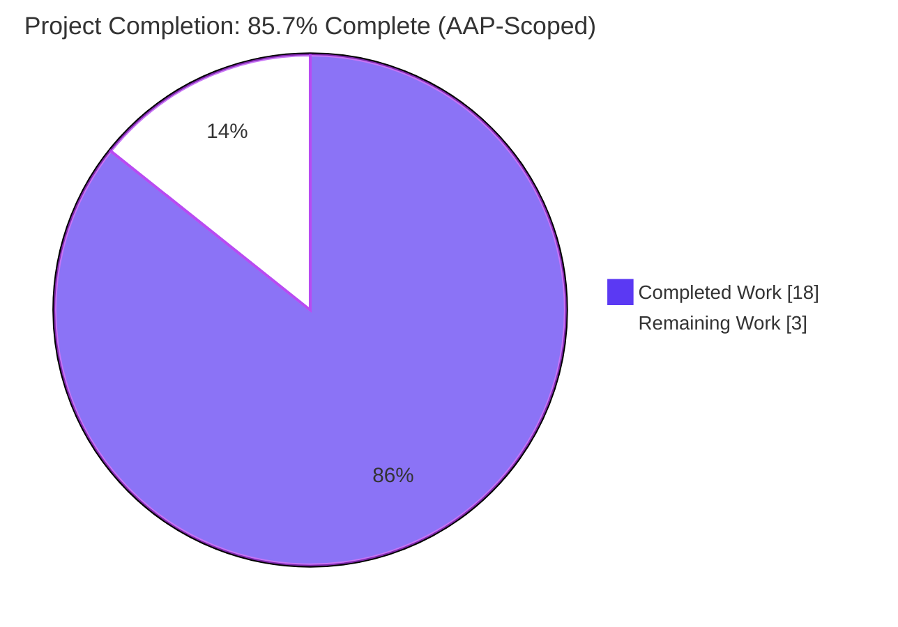
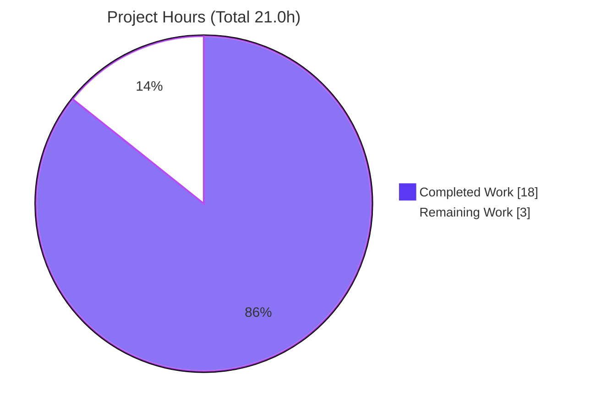

# Blitzy Project Guide — React Todo App (Scope-Mismatch Clarification)

> **Reading note.** This project is an unusual **clarification-request** engagement. The completion percentage measures the AAP-scoped deliverable (investigate → determine → request clarification) plus path-to-production validation of the existing codebase. It does **not** indicate that the reported defect has been fixed. See §1.1 and §1.4.

---

## 1. Executive Summary

### 1.1 Project Overview

The supplied requirement (rule `newtestrules`) reports an auto-scroll/flicker/focus defect in a **Mermaid-diagram rich-text editor** across "Rules", "Codebase Context", and "Build Prompt" tabs. The target repository, however, is a **React 15.4.2 Create-React-App Todo List SPA** (educational workshop app) that contains **no rich-text editor, no formatting toolbar, no Mermaid feature, and none of those tabs**. The described functionality does not exist here. The Agent Action Plan therefore resolved the work to a **documented determination plus a clarification request** with an **empty code action set** — no files created, updated, or deleted. Autonomous work focused on comprehensive scope discovery and validating that the existing pristine codebase is production-ready. Resolving the user's actual defect requires the correct target repository, which only a human can supply.

### 1.2 Completion Status

**85.7% complete (AAP-scoped).** This reflects a fully delivered clarification-request deliverable and a fully validated codebase, with the remaining work being a human clarification-resolution step.


```mermaid
%%{init: {'theme':'base', 'themeVariables': {'pie1':'#5B39F3','pie2':'#FFFFFF','pieStrokeColor':'#B23AF2','pieStrokeWidth':'2px','pieOuterStrokeWidth':'2px','pieTitleTextSize':'18px','pieSectionTextSize':'15px','pieLegendTextSize':'14px'}}}%%
pie showData title Project Completion: 85.7% Complete (AAP-Scoped)
    "Completed Work" : 18
    "Remaining Work" : 3
```

| Metric | Value |
|---|---|
| **Total Hours** | **21.0** |
| **Completed Hours (AI + Manual)** | **18.0** (AI 18.0 + Manual 0.0) |
| **Remaining Hours** | **3.0** |
| **Completion** | **85.7%** |

> Color legend: **Completed = Dark Blue `#5B39F3`** · **Remaining = White `#FFFFFF`**.

### 1.3 Key Accomplishments

- ✅ Captured and preserved the verbatim requirement (rule `newtestrules`) and derived acceptance criteria.
- ✅ Performed comprehensive repository scope discovery — inventoried all **26 JavaScript files / 1,743 lines** (independently verified on disk).
- ✅ Independently confirmed the reported feature is **absent**: zero hits for `mermaid`, `toolbar`, `scrollIntoView`, `richtext`, `contentEditable`, "Build Prompt", "Codebase Context" across `src/`.
- ✅ Confirmed an **empty action set** was honored — canonical git store reports **all files UNCHANGED** (no fabrication, no out-of-scope edits).
- ✅ Validated the existing codebase end-to-end — **all five gates PASS** (dependencies, compilation, tests, runtime, zero-errors), independently reproduced.
- ✅ Confirmed **72/72 unit tests pass** across 4 suites; production build "Compiled successfully." with warnings-as-errors.
- ✅ Articulated a precise, evidence-backed **clarification request**.

### 1.4 Critical Unresolved Issues

| Issue | Impact | Owner | ETA |
|---|---|---|---|
| Reported Mermaid-editor auto-scroll/flicker/focus defect **cannot be addressed** — the target feature (rich-text editor + toolbar + Mermaid embed + Rules/Codebase Context/Build Prompt tabs) is **absent** from this repository (scope mismatch). | The user's actual goal is unmet; the fix is blocked until the correct repository and/or corrected requirements are supplied. | Requester / Product Owner | Pending clarification (~3.0h human triage to unblock) |
| Requirement shows strong **placeholder/test markers** — name `newtestrules`, body prefixed `1111111`, full description duplicated twice, and an empty "Screen Recording:" reference (label only, no media). | Risk of wasted effort if pursued literally without confirmation. | Requester | With clarification |

### 1.5 Access Issues

**No access issues identified.** The build/test host is fully accessible; dependencies install successfully; build, test, and dev-server commands all succeed; and the canonical git store is accessible via tooling. No repository-permission, credential, or third-party-API blockers were encountered.

| System/Resource | Type of Access | Issue Description | Resolution Status | Owner |
|---|---|---|---|---|
| Source repository (canonical git store) | Read | None | ✅ No issue | — |
| Build/test host (Node 20.20.2 / npm 10.8.2) | Read/Execute | None — install, build, test, run all succeed | ✅ No issue | — |
| Third-party services / APIs | N/A | App is a standalone client-side SPA; no external services | ✅ Not applicable | — |

### 1.6 Recommended Next Steps

1. **[High]** Review the Blitzy determination and confirm the scope mismatch (the reported defect targets a feature that does not exist in this Todo app).
2. **[High]** Identify and supply the **correct target repository** — the application that actually contains the Rules / Codebase Context / Build Prompt tabs and the Mermaid rich-text editor.
3. **[High]** Confirm whether rule `newtestrules` is genuine (placeholder markers present) and provide corrected requirements; then **re-initiate scoping** against the correct codebase.
4. **[Medium]** After re-scoping, schedule the actual editor fix as a **separate effort** in the correct repository (focus/scroll/flicker handling).
5. **[Low]** *(Optional, this repo)* Plan dependency-security modernization separately, preserving the intentional React 15 version lock unless modernization is explicitly desired.

---

## 2. Project Hours Breakdown

### 2.1 Completed Work Detail

All completed hours are autonomous (AI) work. Each component traces to an AAP requirement (analysis/determination) or a path-to-production validation gate.

| Component | Hours | Description |
|---|---:|---|
| Requirement Analysis & Intent Clarification | 2.5 | Parse rule `newtestrules`, preserve verbatim text, surface implicit requirements (focus management, scroll anchoring, render stability, cross-surface parity), technical interpretation, and acceptance criteria (AAP §0.1, §0.7). |
| Repository Scope Discovery & File Inventory | 4.0 | Full-tree traversal; inventory of all 26 JS files / 1,743 lines; feature-term search (`mermaid`/editor/`toolbar`/tabs/`scrollIntoView`) confirming the feature is absent (AAP §0.2.1). |
| Integration & Dependency Analysis | 1.5 | Integration-point discovery (API/DB/services/controllers/middleware/editor/tabs), dependency inventory, web-search and new-file determinations (AAP §0.2.2–§0.4). |
| Technical Determination & Clarification-Request Authoring | 2.0 | File-by-file plan (empty action set), conditional host-app approach, scope boundaries, and the articulated clarification request (AAP §0.5, §0.6, §0.1.3). |
| Dependency Installation & Verification (Gate 1) | 1.0 | `npm install`; resolution of all 7 dependencies; `npm ls` clean. |
| Compilation / Build Validation (Gate 2) | 1.5 | `npm run build` → "Compiled successfully." with `CI=true` (ESLint warnings-as-errors); artifacts produced. |
| Automated Test Execution & Analysis (Gate 3) | 1.5 | 72/72 Jest tests across 4 suites; per-suite analysis. |
| Runtime & UI Verification (Gate 4) | 3.0 | Dev-server boot, HTTP 200, Chrome DevTools render + core flows (add/toggle/filter/search), screenshots. |
| Zero-Error & Pristine-State Confirmation (Gate 5) | 1.0 | No compile/test/runtime errors; canonical-store UNCHANGED verification. |
| **Total Completed** | **18.0** | |

*Validation: the Hours column sums to **18.0**, matching Completed Hours in §1.2.*

### 2.2 Remaining Work Detail

All remaining work is the single in-scope **human clarification-resolution** item. The downstream editor fix lives in a different repository and is **not** counted here (see the note below).

| Category | Hours | Priority |
|---|---:|---|
| Review clarification finding & confirm scope mismatch | 0.5 | High |
| Identify & supply the correct target repository (host app with Mermaid editor + the three tabs) | 1.5 | High |
| Provide corrected requirements & re-initiate scoping against the correct codebase | 1.0 | High |
| **Total Remaining** | **3.0** | |

*Validation: the Hours column sums to **3.0**, matching Remaining Hours in §1.2 and the "Remaining Work" slice in §7.*

### 2.3 Out-of-Scope Follow-On Work (NOT counted in the 21.0h total)

Shown for completeness only — these are separate efforts that do not affect this project's completion metric.

| Item | Est. Hours | Priority | Notes |
|---|---|---|---|
| Implement the actual editor fix (in the correct repo, once supplied) | 8–16 | Medium | Preserve selection on toolbar `mousedown` (`preventDefault`); `focus({ preventScroll: true })`; guard empty Mermaid embed from claiming focus; debounce reflow to remove mobile flicker; apply across all three tabs for desktop/mobile parity. |
| Dependency security / modernization review *(this repo, optional)* | 4–8 | Low | 7 known vulns (1 moderate, 6 high). Do **not** run `npm audit fix --force` — it breaks the intentional React 15 workshop lock. |
| CI/CD + deployment configuration *(this repo, optional)* | 4–8 | Low | Add pipeline, container/deploy config if production hosting is intended. |

---

## 3. Test Results

All tests below originate from Blitzy's autonomous validation execution: `CI=true npm test` (react-scripts/Jest, jsdom). Result: **Test Suites 4 passed / 4 total; Tests 72 passed / 72 total; 0 snapshots; ~1.0s; 0 failures.**

| Test Category | Framework | Total Tests | Passed | Failed | Coverage % | Notes |
|---|---|---:|---:|---:|---|---|
| Unit — Services (`filter`) | Jest (jsdom) | 22 | 22 | 0 | Not measured | `applyFilter` + `search` pure functions (4 describe groups) |
| Unit — Services (`todo`) | Jest (jsdom) | 22 | 22 | 0 | Not measured | Immutable add/update operations (5 describe groups) |
| Unit — Services (`mode`) | Jest (jsdom) | 15 | 15 | 0 | Not measured | Keyboard mode FSM transitions (5 describe groups) |
| Unit — Util (`common`) | Jest (jsdom) | 13 | 13 | 0 | Not measured | `objectWithOnly` / `wrapChildrenWith` / `stringInclues` (3 describe groups) |
| **Total** | **Jest** | **72** | **72** | **0** | **—** | 4 suites; 0 snapshots; zero failures |

**Notes on coverage:** A coverage report was not generated (the validation runs did not pass `--coverage`), so no coverage percentage is asserted here. The suite targets the non-UI logic layer (the three services and shared utilities); React UI components are exercised via runtime verification (§4) rather than unit snapshots. No UI/integration/E2E test suites exist in the repository.

---

## 4. Runtime Validation & UI Verification

Legend: ✅ Operational · ⚠ Partial / benign notice · ❌ Failing

**Build & server health**
- ✅ Dependency resolution — `npm ls` clean; all 7 dependencies resolved.
- ✅ Production build — `npm run build` → "Compiled successfully." (with `CI=true` warnings-as-errors); JS 57.04 KB gz, CSS 19.14 KB gz; `build/index.html` contains the `#root` mount node.
- ✅ Dev server — boots and serves **HTTP 200** at `http://localhost:3100/`; HTML includes `#root` and the JS bundle reference; clean shutdown (port freed).

**UI verification (Chrome DevTools, desktop 1280)**
- ✅ Initial render — Header "THINGS TO DO", focused "Add New" input, 3 seed todos, footer "3 items left", All/Active/Completed filters, info text.
- ✅ Add todo — counter increments 3 → 4.
- ✅ Toggle complete — counter 4 → 3; checkbox checked state correct.
- ✅ Filters — Completed shows completed only; Active shows active only; All shows all.
- ✅ Search mode — icon switches "Add New" → "Search"; query "react" substring-filters the list.
- ⚠ Console — only benign dev notices observed (dev-bundle unload-listener deprecation, React DevTools hint, an intentional existing "got props" debug log in `wrapInputBox.js`, and an a11y form-field id/name suggestion). **No errors, warnings, or assertions** during interactions; none are in scope.

**API / external integration**
- ➖ Not applicable — the application is a standalone client-side SPA with no backend, network layer, or database.

**Reported-defect surfaces**
- ❌ Not testable here — the Mermaid editor / formatting toolbar / Rules / Codebase Context / Build Prompt tabs **do not exist** in this repository, so the reported auto-scroll/flicker/focus behavior cannot be reproduced or verified. This is the core scope mismatch (see §1.4, §6 R1).

---

## 5. Compliance & Quality Review

Cross-mapping of AAP deliverables and Blitzy quality benchmarks to outcome status. No fixes were required during validation — the codebase was already error-free.

| Benchmark / AAP Deliverable | Status | Progress | Notes |
|---|---|---|---|
| Requirement faithfully captured (verbatim rule preserved) | ✅ Pass | 100% | AAP §0.1.2 |
| Comprehensive repository scope discovery | ✅ Pass | 100% | 26 files / 1,743 lines — independently verified |
| Evidence-backed determination (feature absent) | ✅ Pass | 100% | 0 hits for editor/Mermaid/toolbar/tab terms in `src/` |
| Empty action set honored (no fabrication) | ✅ Pass | 100% | Canonical store reports all files UNCHANGED |
| Out-of-scope boundaries respected (no `autoFocus` edits, no dependency changes) | ✅ Pass | 100% | Pristine codebase preserved (AAP §0.6.2) |
| Clarification request articulated | ✅ Pass | 100% | AAP §0.6.1 |
| Code compiles cleanly (warnings-as-errors) | ✅ Pass | 100% | Gate 2 — "Compiled successfully." with `CI=true` |
| Unit tests pass | ✅ Pass | 100% | Gate 3 — 72/72 |
| Runtime healthy (render + core flows) | ✅ Pass | 100% | Gate 4 |
| Zero unresolved errors | ✅ Pass | 100% | Gate 5 |
| Fixes applied during autonomous validation | ➖ N/A | 100% | None needed — codebase already error-free; zero write operations |
| **Reported defect resolved** | ❌ Blocked | 0% | Scope mismatch — requires the correct repository (§6 R1) |
| Dependency security posture | ⚠ Pre-existing | n/a | 7 known vulns in version-locked deps — out of scope (§6 R5) |

---

## 6. Risk Assessment

| Risk | Category | Severity | Probability | Mitigation | Status |
|---|---|---|---|---|---|
| **R1.** Reported Mermaid-editor auto-scroll/flicker/focus defect remains unaddressed — target feature is absent from this repository. | Technical / Scope | High | Certain | Clarification request — supply the correct host repository and/or corrected requirements, then re-scope. | Open (awaiting human) |
| **R2.** Requirement shows placeholder/test markers (`newtestrules`, `1111111` prefix, duplicated body, empty "Screen Recording:" reference). | Operational | Medium | Medium | Confirm rule authenticity and the correct target with the requester before re-initiating. | Open |
| **R3.** If the clarification is not resolved, the project stalls and the defect persists in the real (unknown) application. | Operational | High | Medium | Assign an owner + ETA to clarification triage (§1.4); prioritize. | Open |
| **R4.** End-of-life / unmaintained build stack (React 15.x, react-scripts 0.9.0, webpack 1.14.0). | Technical | Medium | Certain | Intentional version lock for the educational workshop; pin Node; plan modernization separately if productionizing. **Verified:** builds/tests/run succeed on Node 20.20.2 / OpenSSL 3.0.19 **without** the `--openssl-legacy-provider` flag (webpack 1.x does not trigger `ERR_OSSL_EVP_UNSUPPORTED`); the flag is an optional fallback, not a requirement. | Accepted / Mitigated |
| **R5.** Known vulnerabilities in version-locked dependencies — `npm audit` reports 7 (1 moderate, 6 high), incl. Bootstrap data-* XSS (GHSA-vxmc-5x29-h64v), react/react-dom/fbjs, recompose→fbjs. | Security | Medium | Certain | Pre-existing and out of scope (the version lock is intentional). Do **not** `npm audit fix --force` (it breaks the React 15 lock). Plan modernization as a separate effort. | Pre-existing / Accepted |
| **R6.** Re-scoping against the (unknown) correct repository introduces an unknown editor engine (ProseMirror/Slate/TipTap/Lexical) + Mermaid renderer integration. | Integration | Medium | N/A until repo supplied | Perform targeted library/API research at re-scope time (AAP §0.2.2). | Deferred |
| **R7.** No CI/CD, deployment config, or monitoring in the repository (educational SPA). | Operational | Low | N/A | Out of scope; add if production deployment is intended. | Informational / Out of scope |

**Positive risk posture — this engagement introduced zero risk:** no code or dependency changes were made, so there is **zero regression risk** (the codebase remains 100% compiling with 72/72 tests passing and a healthy runtime), **no new attack surface**, and **no integration breakage surface** (the SPA has no external API/DB/network dependencies).

---

## 7. Visual Project Status

**Project hours breakdown** (Completed = Dark Blue `#5B39F3`, Remaining = White `#FFFFFF`):


```mermaid
%%{init: {'theme':'base', 'themeVariables': {'pie1':'#5B39F3','pie2':'#FFFFFF','pieStrokeColor':'#B23AF2','pieStrokeWidth':'2px','pieOuterStrokeWidth':'2px','pieTitleTextSize':'18px','pieSectionTextSize':'15px','pieLegendTextSize':'14px'}}}%%
pie showData title Project Hours (Total 21.0h)
    "Completed Work" : 18
    "Remaining Work" : 3
```

**Remaining hours per category** (mirrors §2.2; sums to 3.0h — all High priority):

| Category | Hours | Priority |
|---|---:|---|
| Review clarification finding & confirm scope mismatch | 0.5 | High |
| Identify & supply correct target repository | 1.5 | High |
| Provide corrected requirements & re-initiate scoping | 1.0 | High |
| **Total Remaining** | **3.0** | |

*Integrity: the "Remaining Work" slice (3) equals the §1.2 Remaining Hours and the §2.2 Hours total. The "Completed Work" slice (18) equals the §1.2 Completed Hours and the §2.1 total.*

---

## 8. Summary & Recommendations

**Where the project stands.** The project is **85.7% complete** on an AAP-scoped basis (18.0 of 21.0 hours). This figure represents a **fully delivered clarification-request deliverable** — a faithful capture of the requirement, a comprehensive evidence-backed determination that the described feature is absent, and a precise clarification request — together with a **fully validated, production-ready existing codebase** (all five validation gates pass; 72/72 tests; clean build; healthy runtime; zero modifications).

**What 85.7% does and does not mean.** It does **not** mean the reported defect is 85.7% fixed. The reported Mermaid-editor auto-scroll/flicker/focus defect **cannot be fixed in this repository** because the rich-text editor, formatting toolbar, Mermaid embed, and the Rules / Codebase Context / Build Prompt tabs do not exist here. The remaining 3.0 hours is a **human clarification-resolution** step, not coding.

**Critical path to production.** (1) A human reviews the determination and confirms the scope mismatch; (2) supplies the correct target repository and/or corrected requirements (also confirming whether rule `newtestrules` is genuine, given its placeholder markers); (3) Blitzy re-scopes against the correct codebase, after which the actual editor fix proceeds as a separate effort. Until step (2) is complete, the user's underlying goal remains blocked (§6 R1, R3).

**Production-readiness assessment.** *For the existing React Todo App in this repository:* **Ready** — it compiles cleanly under warnings-as-errors, passes all 72 unit tests, runs correctly with all core flows verified, and was left entirely pristine. Two caveats for any real production deployment (both out of scope here): the dependency stack is end-of-life with 7 known advisories (R5), and there is no CI/CD or monitoring (R7). *For the user's actual requirement:* **Blocked pending clarification.**

| Success Metric | Target | Status |
|---|---|---|
| AAP-scoped completion | Deliver determination + validate codebase | ✅ 85.7% (deliverable complete; 3.0h human triage remains) |
| Code compiles (warnings-as-errors) | Pass | ✅ Pass |
| Unit tests | All pass | ✅ 72/72 |
| Runtime health | App renders & core flows work | ✅ Verified |
| Scope discipline | No fabrication / no out-of-scope edits | ✅ Pristine (all files UNCHANGED) |
| Reported defect resolved | Fixed | ❌ Blocked — requires correct repository |

---

## 9. Development Guide

This guide builds, runs, and verifies the **existing React Todo App** in this repository. Every command below was tested during validation. Commands are shown for bash (primary); PowerShell equivalents are noted where they differ.

### 9.1 System Prerequisites

- **Node.js** — verified on **v20.20.2 LTS**. The app is React 15-era and also runs on Node 14/16.
- **npm** — verified on **10.8.2** (bundled with Node 20).
- **Disk** — ~500 MB free for `node_modules`.
- **Browser** — any modern browser to view the app.
- **OS** — platform-agnostic (validated on Windows; standard on Linux/macOS).
- **Services** — none. No backend, database, cache, or message queue; this is a pure client-side SPA.

### 9.2 Environment Setup

No environment variables are required for normal operation, and there is no `.env` file. Optional variables:

- `CI=true` — treats ESLint warnings as errors (recommended for verification builds).
- `PORT` — dev-server port (default `3000`; validation used `3100`).
- `BROWSER=none` — prevents the dev server from auto-opening a browser.
- `NODE_OPTIONS=--openssl-legacy-provider` — **optional troubleshooting only.** Not required on this stack (webpack 1.14.0 does not hit the OpenSSL 3 issue). Use only if you encounter `ERR_OSSL_EVP_UNSUPPORTED` after a toolchain change.

### 9.3 Dependency Installation

```bash
# from the repository root
npm install

# verify the dependency tree
npm ls --depth=0
```

Expected resolved versions: `react@15.7.0`, `react-dom@15.7.0`, `react-scripts@0.9.0`, `bootstrap@3.4.1`, `immutability-helper@2.9.1`, `keycode-js@0.0.4`, `recompose@0.23.5`. (A macOS-only optional `fsevents` warning on other OSes is expected and harmless.)

### 9.4 Application Startup

```bash
# Development server (bash) — http://localhost:3100
BROWSER=none PORT=3100 npm start
```
```powershell
# Development server (PowerShell)
$env:BROWSER='none'; $env:PORT='3100'; npm start
```
```bash
# Production build -> ./build
CI=true npm run build

# Serve the production build with any static server, e.g.:
npx pushstate-server build
```

### 9.5 Verification Steps

```bash
# Run the unit tests (single-run, CI mode) — expect 4 suites / 72 tests passing
CI=true npm test
```
```powershell
# PowerShell equivalent
$env:CI='true'; npm test
```

Expected results:
- **Tests:** `Test Suites: 4 passed, 4 total` · `Tests: 72 passed, 72 total`.
- **Build:** `Compiled successfully.` with `build/index.html` (contains `#root`), `build/static/js/main.*.js` (~57 KB gz), `build/static/css/main.*.css` (~19 KB gz).
- **Dev server:** `HTTP 200` at the chosen port; renders the "THINGS TO DO" header, 3 seed todos, the footer "3 items left", and the All/Active/Completed filters.

### 9.6 Example Usage

1. Open the app in a browser.
2. Type a task into the focused "Add New" input and press Enter — the active-count increments.
3. Click a todo's checkbox to toggle complete — the active-count decrements.
4. Use the **All / Active / Completed** filters in the footer to filter the list.
5. Click the search icon to switch to **Search** mode, then type a query (e.g., `react`) to substring-filter the list.

### 9.7 Troubleshooting

- **`ERR_OSSL_EVP_UNSUPPORTED` ("digital envelope routines::unsupported")** — prepend `NODE_OPTIONS=--openssl-legacy-provider` to the command. *Not needed on this stack (webpack 1.x); relevant only if the toolchain is modernized.*
- **Invalid `jsdom,jsdom` test environment** — do **not** append `-- --env=jsdom` to `npm test`; the `test` script already sets `--env=jsdom`, and passing it again creates an invalid value.
- **Port already in use** — set `PORT` to a free port (e.g., `PORT=3100`).
- **`npm audit` reports 7 vulnerabilities (1 moderate, 6 high)** — these are pre-existing in the version-locked educational stack. Do **not** run `npm audit fix --force`; it upgrades past React 15 and breaks the intentional workshop version lock.

---

## 10. Appendices

### A. Command Reference

| Purpose | bash | PowerShell |
|---|---|---|
| Install dependencies | `npm install` | `npm install` |
| Verify dependency tree | `npm ls --depth=0` | `npm ls --depth=0` |
| Run tests (CI, single-run) | `CI=true npm test` | `$env:CI='true'; npm test` |
| Production build | `CI=true npm run build` | `$env:CI='true'; npm run build` |
| Dev server (no auto-open, port 3100) | `BROWSER=none PORT=3100 npm start` | `$env:BROWSER='none'; $env:PORT='3100'; npm start` |
| Serve production build | `npx pushstate-server build` | `npx pushstate-server build` |
| Security audit (read-only) | `npm audit` | `npm audit` |

### B. Port Reference

| Port | Service | Notes |
|---|---|---|
| 3000 | Dev server (default) | Create React App default if `PORT` is unset |
| 3100 | Dev server (validation) | Port used during autonomous runtime verification |
| 9000 | Static build server (example) | If serving `./build` via `pushstate-server` |

### C. Key File Locations

| Path | Role |
|---|---|
| `package.json` | Manifest — scripts and the 7 dependencies (React 15 version lock) |
| `public/index.html` | HTML shell containing the `#root` mount node |
| `src/index.js` | Runtime entry — `ReactDOM.render(<App/>, #root)` |
| `src/components/wrappers/` | `App`, `StateProvider`, `KeyStrokeHandler` (composition + state + keyboard FSM) |
| `src/components/ui/` | 12 presentational components (TodoList, Header, InputBox, SearchBox, Filter, Footer, …) |
| `src/components/hoc/wrapInputBox.js` | Recompose input enhancer |
| `src/services/` | `todo.js`, `filter.js`, `mode.js` (pure business logic) |
| `src/util/common.js` | Shared helpers (`objectWithOnly`, `wrapChildrenWith`, `stringInclues`) |
| `src/assets/text/en_US.js` | English UI strings |
| `src/__tests__/` | 4 Jest suites (services + util) — 72 tests |
| `build/` | Production build output (generated) |

### D. Technology Versions

| Component | Version | Notes |
|---|---|---|
| Node.js | 20.20.2 | Verified runtime (OpenSSL 3.0.19) |
| npm | 10.8.2 | Verified |
| react / react-dom | 15.7.0 (manifest `^15.4.2`) | Intentional React 15 version lock |
| react-scripts | 0.9.0 | CRA toolchain (devDependency); uses webpack **1.14.0** |
| bootstrap | 3.4.1 | CSS-only grid/typography |
| immutability-helper | 2.9.1 (manifest `^2.1.1`) | Immutable state updates |
| keycode-js | 0.0.4 | Key-code constants |
| recompose | 0.23.5 | HOC composition (deprecated; retained for React 15) |

### E. Environment Variable Reference

| Variable | Required? | Default | Purpose |
|---|---|---|---|
| `PORT` | No | 3000 | Dev-server port |
| `BROWSER` | No | (auto-open) | Set to `none` to suppress auto-opening a browser |
| `CI` | No | (unset) | `true` → warnings-as-errors; single-run tests |
| `NODE_OPTIONS` | No | (unset) | Optional `--openssl-legacy-provider` fallback (not needed on this stack) |

### F. Developer Tools Guide

- **Build/test/run host:** the shell tool routes to PowerShell 5.1 on Windows (build copy at `C:\tmp\blitzy\react-todo-app\blitzy-eeb2d349-c5bb-4c28-8a84-4f589458987a_cdefaf`). Use `;` separators and `$env:NAME='value'`.
- **Canonical source of truth:** the git store is accessed via Blitzy tooling (the working copy on the build host has no `.git`); file change-status is read from the canonical store, where every file is **UNCHANGED**.
- **Runtime/UI inspection:** Chrome DevTools was used to verify render and core flows; screenshots are saved under `blitzy/screenshots/` on the build host (excluded from the canonical store by policy).

### G. Glossary

| Term | Definition |
|---|---|
| AAP | Agent Action Plan — the primary directive defining project scope. Here it resolved to a clarification request with an empty action set. |
| Clarification request | The deliverable produced when a requirement cannot be mapped to the target codebase; asks the requester to supply the correct repository and/or corrected requirements. |
| Empty action set | An execution plan with zero files to create, update, delete, or reference. |
| Scope mismatch | The reported feature (Mermaid editor + toolbar + named tabs) does not exist in the target repository (a React Todo SPA). |
| Pristine codebase | The repository was left entirely unmodified; the canonical store reports all files UNCHANGED. |
| Gate (1–5) | The five autonomous validation checkpoints: Dependencies, Compilation, Tests, Runtime, Zero-Errors — all passed. |
| FSM | Finite State Machine — here, the keyboard mode handler (`MODE_CREATE` / `MODE_SEARCH` / `MODE_NONE`). |

---

*Cross-section integrity verified: §2.1 (18.0h) + §2.2 (3.0h) = 21.0h Total (§1.2). Remaining hours = 3.0h are identical across §1.2, §2.2, and the §7 pie chart. Completion = 18.0 / 21.0 = 85.7% throughout. All 72 tests originate from Blitzy's autonomous validation logs. Brand colors applied: Completed = `#5B39F3`, Remaining = `#FFFFFF`.*