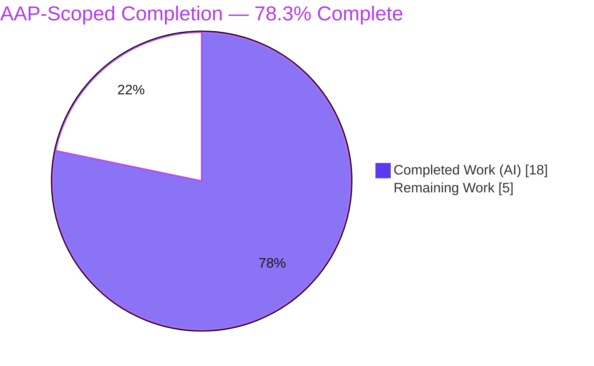
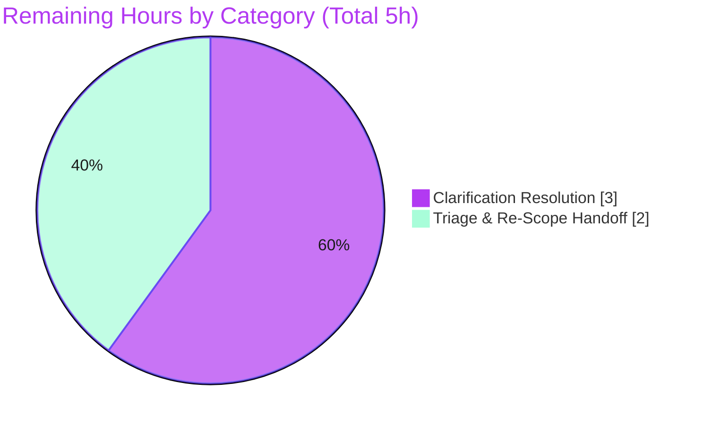

# Blitzy Project Guide

> **React Todo App — Scope Clarification & Baseline Validation**
> Branch: `blitzy-eeb2d349-c5bb-4c28-8a84-4f589458987a` · HEAD: `aa2fbee`
> Brand legend: <span style="color:#5B39F3">**■ Completed / AI Work (Dark Blue #5B39F3)**</span> · **□ Remaining / Not Completed (White #FFFFFF)**

---

## 1. Executive Summary

### 1.1 Project Overview

This engagement targeted a reported UI defect in a **Mermaid-diagram rich-text editor** — desktop auto-scroll and mobile flicker when formatting controls are used after inserting an empty Mermaid embed, across "Rules", "Codebase Context", and "Build Prompt" tabs. The repository under analysis, however, is a **React 15.4.2 educational Todo List single-page application** whose entire surface is todo creation, status toggling, filtering, search, and keyboard-mode switching. It contains **no rich-text editor, no formatting toolbar, no Mermaid feature, and none of the named tabs**. The Agent Action Plan therefore faithfully captured intent, documented the conflict with evidence, and resolved it as a **clarification request with zero in-scope files**. Blitzy completed all scoped analysis and validated the existing baseline; the remaining work is a human clarification action.

### 1.2 Completion Status

**AAP-scoped completion: `78.3%`** — computed as Completed Hours ÷ Total Project Hours = 18 ÷ 23, per the PA1 methodology (AAP-scoped + path-to-production work only; the out-of-scope Mermaid-editor feature is excluded).


```mermaid
%%{init: {"theme":"base","themeVariables":{"pie1":"#5B39F3","pie2":"#FFFFFF","pieStrokeColor":"#B23AF2","pieStrokeWidth":"2px","pieOuterStrokeWidth":"2px","pieSectionTextColor":"#1a1a1a","pieTitleTextColor":"#B23AF2"}}}%%
pie showData
    title AAP-Scoped Completion — 78.3% Complete
    "Completed Work (AI)" : 18
    "Remaining Work" : 5
```

> **Center metric: `78.3% Complete`** (Mermaid pie has no native center label; the percentage is shown in the chart title and here.)

| Metric | Hours |
|---|---|
| **Total Hours** | **23** |
| **Completed Hours (AI + Manual)** | **18** (AI: 18 · Manual: 0) |
| **Remaining Hours** | **5** |
| **Percent Complete** | **78.3%** |

### 1.3 Key Accomplishments

- ✅ **Comprehensive repository scope discovery** — full-tree inventory of 26 `.js` source files (1,743 LOC) plus 8 integration surfaces; conclusively established the reported feature is absent.
- ✅ **Independent feature-absence verification** — full-tree search confirmed `scrollIntoView`, `toolbar`, `contenteditable`, `rich-text`, `build prompt`, `codebase context`, `preventScroll` all return **0 hits** in application code (the 7 `mermaid` hits are markdown architecture-diagram fences only).
- ✅ **Requirement analysis & intent clarification** — parsed rule `newtestrules`, extracted four acceptance criteria, trigger conditions, implicit requirements, and feature prerequisites.
- ✅ **Clarification request authored** — the AAP's sole legitimate deliverable, identifying exactly what the requester must supply.
- ✅ **Baseline dependency validation** — `npm install --legacy-peer-deps` succeeds (exit 0); lockfile hygiene preserved.
- ✅ **Clean compilation** — `CI=true npm run build` → "Compiled successfully", **zero warnings** (53.95 KB JS + 19.33 KB CSS gzipped).
- ✅ **100% test pass** — `CI=true npm test` → **72/72 tests** across 4 suites.
- ✅ **Runtime & UI verification** — production bundle serves (HTTP 200), React mounts, full Todo UI renders and is interactive; zero console errors.
- ✅ **All five production-readiness gates PASS** with zero source/test/config changes.

### 1.4 Critical Unresolved Issues

| Issue | Impact | Owner | ETA |
|---|---|---|---|
| Reported defect describes a Mermaid rich-text editor absent from this repository — cannot be implemented or validated here | Requirement cannot progress to a code fix until the correct target is identified | Requester / Product Owner | Upon clarification (≈1 day) |
| Rule `newtestrules` carries strong placeholder/test markers (`1111111` prefix, duplicated body, empty "Screen Recording") | Requirement may be test noise; risk of acting on invalid input | Requester / QA | Upon clarification |
| Correct target repository / corrected requirements not yet supplied | Blocks re-scope and any real implementation | Requester | Upon clarification |

### 1.5 Access Issues

| System/Resource | Type of Access | Issue Description | Resolution Status | Owner |
|---|---|---|---|---|
| Source repository (`react-todo-app`) | Read/Write (git) | Full access; analysis, build, test, and runtime validation all succeeded | ✅ No issue | Blitzy |
| `npm` registry (audit metadata) | Network read | `npm audit --json` did not return populated severity metadata in this offline-leaning environment; advisory count cited from prior validation logs (~193) | ⚠ Informational only — non-blocking | Platform |
| Correct target application (Mermaid editor host) | Repository access | The application that actually contains the editor + Rules/Codebase Context/Build Prompt tabs has not been provided | ❌ Pending — required to proceed | Requester |

> Build validation itself had **no access issues**; the only access gap is the (external) correct target repository that hosts the reported feature.

### 1.6 Recommended Next Steps

1. **[High]** Confirm whether the rule `newtestrules` is a genuine requirement or placeholder/test data before allocating further effort.
2. **[High]** Identify and supply the **correct target repository** — the application that actually contains the Mermaid rich-text editor and the Rules / Codebase Context / Build Prompt tabs — and/or corrected requirements scoped to this Todo app.
3. **[High]** Re-run Blitzy planning against the correct codebase to regenerate the AAP with a concrete, file-level scope.
4. **[Medium]** Maintain the current React 15.x version lock and lockfile hygiene; do **not** run `npm audit fix` or `eject`.
5. **[Low]** (Optional, non-blocking) Consider adding `id`/`name` attributes to the create-todo/search inputs to clear the DevTools best-practice advisory.

---

## 2. Project Hours Breakdown

### 2.1 Completed Work Detail

All completed work was performed autonomously by Blitzy agents (AI). Each component traces to a specific AAP deliverable or path-to-production activity.

| Component | Hours | Description |
|---|---:|---|
| Requirement Analysis & Intent Clarification | 2.0 | Parsed rule `newtestrules`; extracted 4 acceptance criteria, trigger conditions, implicit requirements, feature prerequisites, and technical interpretation (AAP §0.1). |
| Repository Scope Discovery & File/Integration Analysis | 5.0 | Full-tree inventory of 26 `.js` files (1,743 LOC); 8 integration-surface checks; full-tree feature-term search proving absence (AAP §0.2). |
| Dependency & Integration Analysis | 1.5 | Confirmed zero dependency changes and zero integration touchpoints; documented root composition `StateProvider → KeyStrokeHandler → TodoList` (AAP §0.3–§0.4). |
| Technical Implementation Determination (Empty Action Set + Conditional Guidance) | 1.5 | Established empty CREATE/UPDATE/DELETE/REFERENCE set; recorded conditional host-app fix approach and the tangential `autoFocus` analog (AAP §0.5). |
| Scope Boundaries & Acceptance-Criteria Capture | 1.5 | Exhaustive in-scope/out-of-scope determination; host-app acceptance criteria preserved (AAP §0.6–§0.7). |
| Clarification Request Authoring & Finding Documentation | 1.5 | Authored the clarification request (the sole deliverable) with full evidentiary basis. |
| Baseline Dependency Install & Lockfile Hygiene Validation | 1.0 | `npm install --legacy-peer-deps` (exit 0); restored `yarn.lock`; removed generated `package-lock.json`. |
| Compilation (Production Build) Validation | 0.5 | `CI=true npm run build` → "Compiled successfully", 0 warnings (53.95 KB JS + 19.33 KB CSS gz). |
| Test Suite Validation (72/72) | 0.5 | `CI=true npm test` → 4 suites, 72/72 tests pass, 0 failures. |
| Runtime & UI Verification | 2.0 | Served production bundle (HTTP 200); React mount + full Todo UI render; interactivity confirmed; screenshot captured. |
| Production-Readiness Gate Assessment (5 gates) | 1.0 | Evaluated and confirmed all five gates PASS. |
| **Total Completed** | **18.0** | **Matches Completed Hours in §1.2.** |

### 2.2 Remaining Work Detail

Each remaining category is a human/path-to-production activity required to unblock the requirement. Building the Mermaid-editor feature is **out of scope** (AAP §0.6.2) and is **not** counted here.

| Category | Hours | Priority |
|---|---:|---|
| Clarification Resolution — confirm requirement authenticity + supply the correct target repository and/or corrected requirements | 3.0 | High |
| Requirement Triage & Re-Scope/Re-Plan Handoff — regenerate the AAP against the correct codebase | 2.0 | High |
| **Total Remaining** | **5.0** | **Matches Remaining Hours in §1.2 and the Section 7 pie chart.** |

> **Reconciliation:** §2.1 (18.0) + §2.2 (5.0) = **23.0 Total Project Hours** = §1.2 Total. ✔

---

## 3. Test Results

All tests below originate from Blitzy's autonomous validation logs and were **independently re-executed and confirmed** during this assessment (`CI=true npm test`, exit 0, ~1.2 s).

| Test Category | Framework | Total Tests | Passed | Failed | Coverage % | Notes |
|---|---|---:|---:|---:|---|---|
| Unit — Filter service (`filter.test.js`) | Jest 18.1.0 (react-scripts, jsdom) | 22 | 22 | 0 | n/a | `applyFilter` + `search` pure functions; 4 describe blocks |
| Unit — Todo service (`todo.test.js`) | Jest 18.1.0 (react-scripts, jsdom) | 22 | 22 | 0 | n/a | Immutable add/update operations; 5 describe blocks |
| Unit — Util helpers (`common.test.js`) | Jest 18.1.0 (react-scripts, jsdom) | 13 | 13 | 0 | n/a | `objectWithOnly`, `wrapChildrenWith`, `stringInclues`; 3 describe blocks |
| Unit — Mode FSM (`mode.test.js`) | Jest 18.1.0 (react-scripts, jsdom) | 15 | 15 | 0 | n/a | Keyboard-mode transition table; 5 describe blocks |
| **TOTAL** | **Jest 18.1.0** | **72** | **72** | **0** | **n/a** | **4 suites, 100% pass rate** |

- **Pass rate: 100% (72/72).** Zero failures, zero skipped, zero blocked.
- **Coverage:** A coverage report was not generated by the autonomous run (the project's `test` script does not include `--coverage`); therefore coverage % is reported as `n/a` rather than fabricated.
- **Test types present:** Unit only. There are no integration, UI, API, or end-to-end suites in this repository (consistent with a small educational SPA).

---

## 4. Runtime Validation & UI Verification

Legend: ✅ Operational · ⚠ Partial / Advisory · ❌ Failing or Not Present

**Runtime Health (existing Todo app baseline)**
- ✅ **Production build served** — `GET /` → HTTP 200 (544 bytes; contains `<div id="root">`).
- ✅ **Primary JS bundle served** — `GET /static/js/main.76df5604.js` → HTTP 200 (184,510 bytes).
- ✅ **React mount & render** — full Todo UI renders: heading "THINGS TO DO", autofocused "Add New" input, three seeded todos ("Learn Javascript", "Learn React", "Build a React App"), footer with add/search icons, "3 items left" counter, and All/Active/Completed filters.
- ✅ **Interactivity** — toggling a todo checkbox updated the active counter ("3 items left" → "2 items left"), confirming event handlers, state container, immutable service, and re-render all function.
- ✅ **Console cleanliness** — zero errors/warnings; only a benign educational "got props" debug log.

**UI Verification**
- ✅ **Single-screen Todo manager** verified against the runtime screenshot (`blitzy/screenshots/runtime_validation_todo_app_desktop.png`).
- ⚠ **DevTools advisory** — create-todo/search inputs lack `id`/`name` attributes; non-breaking, **out of scope** (AAP §0.6.2).

**API Integration**
- ✅ **N/A by design** — standalone client-side SPA with no backend, network layer, or persistence; nothing to integrate.

**Reported-Defect Surfaces (the requirement's targets)**
- ❌ **Mermaid rich-text editor** — not present in this repository.
- ❌ **Formatting toolbar (Bold/italic/H1–H3/lists/inline code/code block)** — not present.
- ❌ **Rules / Codebase Context / Build Prompt tabs** — not present.
- ❌ **Desktop auto-scroll / Android mobile flicker symptoms** — not reproducible (the feature that exhibits them does not exist here).

> **Conclusion:** The existing application is fully **operational**; the reported defect cannot be reproduced because its host feature is absent.

---

## 5. Compliance & Quality Review

Cross-mapping of AAP deliverables and quality benchmarks to outcomes. Fixes applied during autonomous validation are noted; no source fixes were required because there were zero in-scope files.

| Benchmark / AAP Deliverable | Status | Progress | Evidence / Notes |
|---|---|---|---|
| AAP intent faithfully captured (no fabrication) | ✅ Pass | 100% | Clarification-request determination; zero invented files (AAP §0.5.1). |
| Zero unwarranted source modifications | ✅ Pass | 100% | `git diff f0aab74..HEAD` = screenshot only; 0 source/test/config changes. |
| Comprehensive scope discovery | ✅ Pass | 100% | 26-file inventory + 8 integration surfaces + full-tree term search (AAP §0.2). |
| Compilation clean | ✅ Pass | 100% | `CI=true npm run build` → 0 warnings. |
| Unit tests pass | ✅ Pass | 100% | 72/72 across 4 suites. |
| Runtime operational | ✅ Pass | 100% | HTTP 200 + interactive UI + zero console errors. |
| Lockfile hygiene preserved | ✅ Pass | 100% | `yarn.lock` pristine; generated `package-lock.json` not committed. |
| React 15.x version lock preserved | ✅ Pass | 100% | No `eject`, no root webpack/babel/eslint config, no `npm audit fix`. |
| Clarification request raised | ✅ Pass | 100% | Sole AAP deliverable delivered (AAP §0.6.1). |
| Reported feature implemented | ⛔ N/A | Out of scope | Feature belongs to a different application; building it would be fabrication (AAP §0.6.2). |
| Security advisories remediated | ⚠ Accepted | Documented | ~193 legacy transitive-dep advisories intentionally retained to preserve the version lock. |
| Input `id`/`name` best practice | ⚠ Advisory | Out of scope | Pre-existing DevTools advisory on InputBox/SearchBox; non-breaking. |

---

## 6. Risk Assessment

| Risk | Category | Severity | Probability | Mitigation | Status |
|---|---|---|---|---|---|
| Requirement targets a Mermaid rich-text editor + Rules/Codebase Context/Build Prompt tabs absent from this repository; cannot be implemented or validated here | Technical | High | High (confirmed) | Clarification request raised; correct repo/requirements required before any code work | Open — awaiting human input |
| Reported defect (desktop auto-scroll / mobile flicker) remains unresolved; requirement delivery is blocked | Operational | High | High (confirmed) | Prioritized clarification with named owner; flagged as the critical path | Open |
| Rule `newtestrules` shows placeholder/test markers (`1111111` prefix, duplicated body, empty "Screen Recording") — may be test noise/invalid | Operational | Medium | Medium | Confirm requirement authenticity with requester before re-scoping | Open |
| Re-supplied repository could again lack the required infrastructure, repeating the cycle | Integration | Medium | Medium | Provide explicit prerequisite checklist (rich-text editor + 9-control toolbar + Mermaid embed + 3 named tabs) before re-planning | Open |
| ~193 npm-audit advisories from 2017-era transitive dependencies | Security | Medium | Low (client-side SPA: no backend/data/network → minimal exploitability) | Intentionally NOT remediated to preserve the educational React 15.x version lock; do **not** run `npm audit fix` | Accepted |
| Legacy toolchain (react-scripts 0.9.0, React 15.4.2) could break under modern dependency upgrades / future Node majors | Technical | Low | Low (builds clean on Node 20 today) | Version lock preserved; `npm install --legacy-peer-deps` documented; no eject/config changes | Mitigated |
| True host application's editor/Mermaid integration surface unknown until correct repo supplied | Integration | Low | Medium | Defer integration analysis to the re-scope phase | Deferred |
| Create-todo/search inputs lack `id`/`name` attributes (DevTools best-practice advisory) | Technical | Low | Low | Pre-existing, out of scope (§0.6.2); no functional/test/security impact | Accepted (out of scope) |

> **Overall posture:** The delivered **baseline codebase risk is LOW** (zero source changed, clean build, 72/72 tests, operational runtime, no new attack surface). The **requirement-delivery risk is HIGH but fully contained** by the clarification request — it is a scope/input problem, not a code-quality problem.

---

## 7. Visual Project Status

**Project Hours — Completed vs Remaining** (Completed = Dark Blue `#5B39F3`, Remaining = White `#FFFFFF`)


```mermaid
%%{init: {"theme":"base","themeVariables":{"pie1":"#5B39F3","pie2":"#FFFFFF","pieStrokeColor":"#B23AF2","pieStrokeWidth":"2px","pieOuterStrokeWidth":"2px","pieSectionTextColor":"#1a1a1a","pieTitleTextColor":"#B23AF2"}}}%%
pie showData
    title Project Hours Breakdown (78.3% Complete)
    "Completed Work" : 18
    "Remaining Work" : 5
```

**Remaining Work Composition by Category** (sums to 5h — consistent with §2.2)


```mermaid
%%{init: {"theme":"base","themeVariables":{"pie1":"#B23AF2","pie2":"#A8FDD9","pieStrokeColor":"#5B39F3","pieStrokeWidth":"2px","pieSectionTextColor":"#1a1a1a","pieTitleTextColor":"#B23AF2"}}}%%
pie showData
    title Remaining Hours by Category (Total 5h)
    "Clarification Resolution" : 3
    "Triage & Re-Scope Handoff" : 2
```

**Remaining Hours per Category (bar view)**

| Category | Hours | Bar |
|---|---:|---|
| Clarification Resolution | 3 | ███████████████ |
| Triage & Re-Scope Handoff | 2 | ██████████ |
| **Total** | **5** | |

> **Integrity check:** "Remaining Work" = **5** in the pie equals §1.2 Remaining Hours and the §2.2 Hours total. ✔

---

## 8. Summary & Recommendations

**Achievements.** Blitzy completed **100% of the AAP-scoped autonomous deliverables**: a thorough, evidence-based scope discovery; a precise requirement analysis; the empty-action-set determination; a clarification request; and a full baseline validation that proves the existing React Todo App **installs, compiles cleanly, passes 72/72 tests, and runs with zero runtime errors**. Critically, the team avoided the failure mode of fabricating a Mermaid editor inside an unrelated Todo app — the correct, disciplined outcome.

**Remaining gaps.** The reported defect cannot be implemented here because its host feature is absent. The outstanding **5 hours** are human/path-to-production actions: confirm the requirement is genuine, supply the correct target repository and/or corrected requirements, and re-scope.

**Critical path to production.** Clarification → correct repository → AAP regeneration → implementation (in the true host app, a separate future engagement). No code path in *this* repository leads to the requested fix.

**Success metrics.**

| Metric | Result |
|---|---|
| AAP-scoped completion | **78.3%** (18h / 23h) |
| Source/test/config files changed | **0** |
| Build status | ✅ Compiled successfully, 0 warnings |
| Test pass rate | ✅ 72/72 (100%) |
| Runtime status | ✅ Operational (HTTP 200, interactive) |
| Production-readiness gates | ✅ 5/5 PASS |

**Production readiness assessment.** The existing Todo App baseline is **production-ready and healthy**. The reported requirement is **not actionable in this repository** and is **blocked pending human clarification**. Recommended disposition: **return to requester for clarification**; do not merge any feature code against this repository for this requirement. The project is **78.3% complete** with respect to AAP-scoped + path-to-production work — all autonomous work is done, and the remainder is a human decision.

---

## 9. Development Guide

> This guide builds and runs the **existing React Todo App baseline**. It does **not** build the Mermaid-editor feature (which is absent from this repository). All commands below were executed and verified during this assessment.

### 9.1 System Prerequisites

- **Node.js** ≥ 18 (verified on **v20.20.2**)
- **npm** ≥ 8 (verified on **10.8.2**)
- **Git** (any recent version)
- OS-agnostic — validated on Windows Server 2022 / PowerShell 5.1
- **No** database, backend service, or runtime environment variables are required (standalone client-side SPA)

### 9.2 Environment Setup

No `.env` file or external services are needed. The only environment variable used is `CI`, set to `true` to force non-interactive (single-run) builds and tests.

```bash
# bash / macOS / Linux
export CI=true
```

```powershell
# PowerShell (Windows)
$env:CI = 'true'
```

### 9.3 Dependency Installation

```bash
npm install --legacy-peer-deps
```

- The **`--legacy-peer-deps` flag is mandatory** — the 2017-era dependency tree has peer-dependency conflicts that fail a default install.
- **Lockfile hygiene caveat (verified):** `npm install` perturbs `yarn.lock` and generates `package-lock.json`. Restore the tree afterward:

```bash
git checkout -- yarn.lock      # restore the canonical lockfile
rm -f package-lock.json        # do NOT commit the npm-generated lockfile
```

Expected: install exits `0`; `node_modules/` resolves `react@15.4.2`, `react-dom@15.4.2`, `react-scripts@0.9.0`, `recompose@0.23.5`, `immutability-helper@2.1.1`, `keycode-js@0.0.4`, `bootstrap@3.4.1`.

### 9.4 Application Startup

**Development server (hot reload, port 3000):**

```bash
npm start
# → CRA dev server on http://localhost:3000
```

**Production build + static serve (verified):**

```bash
# PowerShell:  $env:CI='true'; npm run build
# bash:        CI=true npm run build
npm run build
# → "Compiled successfully"; output in build/ (53.95 KB JS + 19.33 KB CSS gzipped)

# Serve the static bundle (any static server works):
cd build
python -m http.server 9000
# → http://localhost:9000/  (HTTP 200)
```

### 9.5 Verification Steps

```bash
# 1) Run the unit test suite (single run)
#    PowerShell: $env:CI='true'; npm test
CI=true npm test
# Expected: 4 suites, 72/72 tests pass, exit 0

# 2) Confirm the production bundle serves
curl -I http://localhost:9000/
# Expected: HTTP/1.0 200 OK

# 3) Confirm the app shell is present
curl -s http://localhost:9000/ | grep 'id="root"'
# Expected: a line containing <div id="root">
```

In a browser at the served URL you should see: heading **"THINGS TO DO"**, an autofocused "Add New" field, three seeded todos, and a footer with add/search icons, a "3 items left" counter, and All/Active/Completed filters.

### 9.6 Example Usage

- **Add a todo:** type into "Add New" and press Enter.
- **Toggle completion:** click a todo's checkbox — the "items left" counter updates immediately.
- **Filter:** click All / Active / Completed in the footer.
- **Search:** click the magnifier icon and type to filter by text.
- **Keyboard:** press `Esc` to cancel the current create/search mode.

### 9.7 Troubleshooting

| Symptom | Cause | Resolution |
|---|---|---|
| `npm install` fails with peer-dependency errors | 2017-era dependency tree | Always use `npm install --legacy-peer-deps` |
| Working tree dirty after install (`yarn.lock` modified, `package-lock.json` appears) | npm rewrites lockfiles | `git checkout -- yarn.lock` and `rm -f package-lock.json` |
| `npm test` / `npm run build` appears to hang | Interactive watch mode | Set `CI=true` (forces single run) |
| Many `npm audit` warnings | Legacy transitive dependencies | Expected & **accepted** — do **not** run `npm audit fix` (breaks the version lock) |
| Tempted to upgrade React or `eject` | — | **Do not.** The React 15.x lock and CRA zero-config boundary are intentional (educational workshop) |

---

## 10. Appendices

### Appendix A — Command Reference

| Purpose | Command (bash) | Command (PowerShell) |
|---|---|---|
| Install dependencies | `npm install --legacy-peer-deps` | `npm install --legacy-peer-deps` |
| Restore lockfile | `git checkout -- yarn.lock && rm -f package-lock.json` | `git checkout -- yarn.lock; Remove-Item package-lock.json -ErrorAction SilentlyContinue` |
| Build (production) | `CI=true npm run build` | `$env:CI='true'; npm run build` |
| Test (single run) | `CI=true npm test` | `$env:CI='true'; npm test` |
| Dev server | `npm start` | `npm start` |
| Serve prod bundle | `cd build && python -m http.server 9000` | `cd build; python -m http.server 9000` |
| **Do NOT run** | `npm run eject`, `npm audit fix` | `npm run eject`, `npm audit fix` |

### Appendix B — Port Reference

| Port | Service | Notes |
|---|---|---|
| 3000 | CRA development server (`npm start`) | Default react-scripts dev port |
| 9000 | Static production-bundle server (example) | Any static server/port works; 9000 used in validation |

### Appendix C — Key File Locations

| Path | Role |
|---|---|
| `src/index.js` | Entry point; mounts `<App/>` into `#root` |
| `src/components/wrappers/App.js` | Composition shell: `StateProvider → KeyStrokeHandler → TodoList` |
| `src/components/wrappers/StateProvider.js` | Prop-injection state container |
| `src/components/wrappers/KeyStrokeHandler.js` | Global keyboard mode FSM |
| `src/components/ui/` | 12 UI components (TodoList, InputBox, SearchBox, Header, Footer, etc.) |
| `src/services/{todo,filter,mode}.js` | Pure business-logic services |
| `src/util/common.js` | Utility helpers |
| `src/assets/text/en_US.js` | Locale strings |
| `src/__tests__/` | 4 Jest unit suites (72 tests) |
| `package.json` | Manifest (React 15.x lock; scripts) |
| `blitzy/screenshots/runtime_validation_todo_app_desktop.png` | Runtime validation evidence (this session's only commit) |
| `blitzy/documentation/` | Technical Specification & prior project guide |

### Appendix D — Technology Versions

| Component | Version | Source |
|---|---|---|
| Node.js | 20.20.2 | Verified runtime |
| npm | 10.8.2 | Verified runtime |
| React / React-DOM | ^15.4.2 | `package.json` (intentional lock) |
| react-scripts (CRA) | 0.9.0 | `package.json` devDependency |
| Jest | 18.1.0 | Bundled with react-scripts 0.9.0 |
| bootstrap | ^3.4.1 | `package.json` |
| immutability-helper | ^2.1.1 | `package.json` |
| keycode-js | ^0.0.4 | `package.json` |
| recompose | ^0.23.5 | `package.json` |

### Appendix E — Environment Variable Reference

| Variable | Value | When | Required? |
|---|---|---|---|
| `CI` | `true` | Build & test (forces non-interactive single run) | Recommended for automation |
| *(runtime env vars)* | — | — | **None** — the SPA needs no runtime configuration |

### Appendix F — Developer Tools Guide

- **Build/test:** `react-scripts` (CRA 0.9.0) wraps Webpack + Babel + Jest; use `CI=true` to avoid watch mode.
- **Runtime inspection:** the production bundle was loaded in Chrome (via Chrome DevTools) to confirm React mount, render, interactivity, and a clean console. To reproduce: serve `build/`, open the URL, and check the Console (expect zero errors; one benign "got props" debug log) and Elements (verify `#root` is populated).
- **Git diff verification:** `git diff f0aab74 HEAD --stat` (validated baseline → HEAD) shows only the screenshot; `git status --porcelain` should be empty (clean tree).

### Appendix G — Glossary

| Term | Definition |
|---|---|
| **AAP** | Agent Action Plan — the primary directive defining project scope; here, a clarification-request plan with zero in-scope files. |
| **Clarification request** | The AAP's sole deliverable: a documented determination that the requirement targets a different application, asking the requester to supply the correct repository/requirements. |
| **SPA** | Single-Page Application — this Todo app is a standalone client-side SPA with no backend. |
| **CRA** | Create React App — the `react-scripts` build/test toolchain. |
| **HOC** | Higher-Order Component — e.g., `wrapInputBox` (recompose). |
| **FSM** | Finite State Machine — the keyboard mode handler (`MODE_CREATE`/`MODE_SEARCH`/`MODE_NONE`). |
| **Version lock** | The intentional pinning to React 15.x for the educational workshop; must not be upgraded or ejected. |
| **Path-to-production** | Standard activities (install, build, test, runtime validation, handoff) required to deploy AAP deliverables. |

---

*Generated by the Blitzy Platform. Completion (78.3%) reflects AAP-scoped + path-to-production work only; the out-of-scope Mermaid-editor feature is excluded by design. Brand colors: Completed = Dark Blue `#5B39F3`, Remaining = White `#FFFFFF`.*