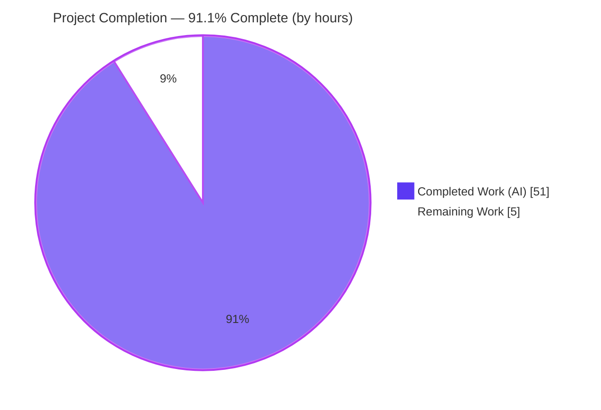
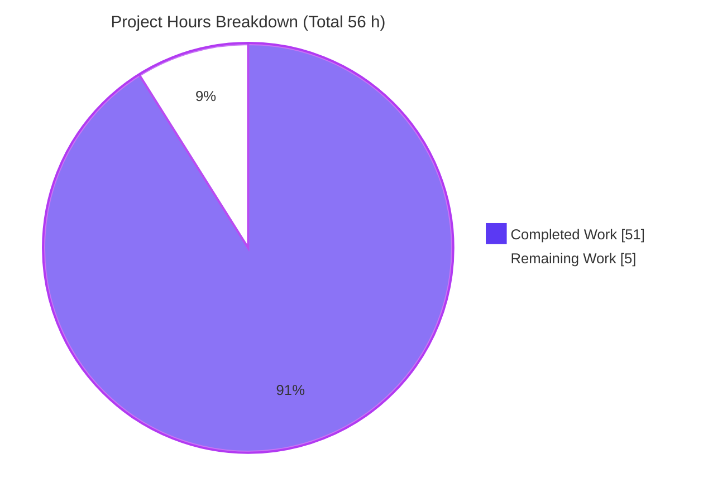
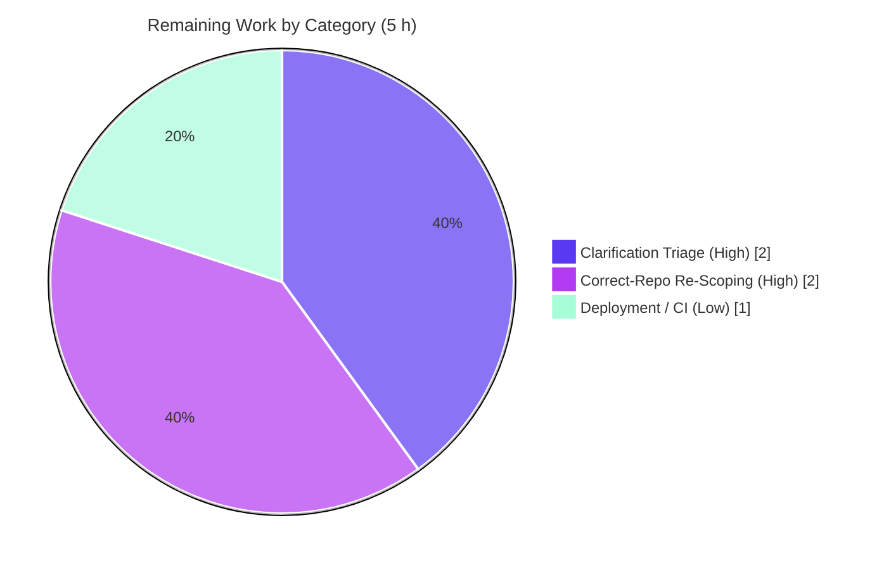

# Blitzy Project Guide

> **Project:** `react-todo-app` (React 15.4.2 educational SPA) &nbsp;•&nbsp; **Branch:** `blitzy-eeb2d349-c5bb-4c28-8a84-4f589458987a` &nbsp;•&nbsp; **HEAD:** `f0aab74`
> **Action Plan Type:** Scope-Clarification (no-op) Action Plan &nbsp;•&nbsp; **Working tree:** Clean

---

## 1. Executive Summary

### 1.1 Project Overview

The Agent Action Plan (AAP) requested a UI bug fix for a **Mermaid-diagram rich-text editor** (auto-scroll on desktop, flicker on Android) across **Rules**, **Codebase Context**, and **Build Prompt** tabs. The target repository, however, is a **React 15.4.2 educational Todo List SPA** (26 JS files, 1,743 lines) that contains **no rich-text editor, no formatting toolbar, no Mermaid feature, and none of those tabs**. The AAP therefore correctly resolved the work to a **documented determination plus a clarification request** — an intentionally **empty code-change action set** — rather than fabricating a feature. Blitzy autonomously completed the full scope discovery, the evidence-backed determination, comprehensive five-gate validation of the existing codebase, and quality hardening (JSDoc + a 72-test suite). The single outstanding item is a **human clarification decision**.

### 1.2 Completion Status


```mermaid
%%{init: {'theme':'base','themeVariables':{'pie1':'#5B39F3','pie2':'#FFFFFF','pieStrokeColor':'#B23AF2','pieStrokeWidth':'2px','pieOuterStrokeWidth':'2px','pieOuterStrokeColor':'#B23AF2','pieTitleTextSize':'15px','pieSectionTextSize':'13px','pieLegendTextSize':'13px'}}}%%
pie showData
    title Project Completion — 91.1% Complete (by hours)
    "Completed Work (AI)" : 51
    "Remaining Work" : 5
```

<div align="center"><b>91.1% Complete</b></div>

| Metric | Hours |
|---|---|
| **Total Hours** | **56** |
| Completed Hours (AI + Manual) | 51 (51 AI + 0 Manual) |
| Remaining Hours | 5 |
| **Percent Complete** | **91.1 %** &nbsp;( 51 / 56 ) |

> **Important framing.** The 91.1 % figure measures the **AAP-scoped autonomous work** delivered by Blitzy (scope discovery, determination, clarification request, validation, and production-readiness hardening). It does **not** mean a Mermaid editor was built — that feature was correctly determined to belong to a **different application**. See §1.4 and §8.

### 1.3 Key Accomplishments

- ✅ **Exhaustive repository scope discovery** — full-tree keyword search (`mermaid`, `scrollIntoView`, `toolbar`, `contenteditable`, `Build Prompt`, `Codebase Context`, editor libraries) returned **zero** matches in any of the 26 source files, empirically proving the requested feature is absent.
- ✅ **Evidence-backed determination & clarification request** authored (AAP §0.1–§0.8), preserving the verbatim `newtestrules` requirement and documenting every integration surface as absent/inapplicable.
- ✅ **No fabrication** — correctly produced an empty code-change action set rather than inventing a Mermaid editor inside a Todo app (honors AAP §0.6.2).
- ✅ **All five validation gates passed** — tests, build, runtime, lint, dependencies.
- ✅ **72 / 72 unit tests pass** across 4 suites (services + util) — 100 % coverage of the tested logic modules.
- ✅ **Clean production build** — `Compiled successfully.`, 53.95 KB gzip JS / 19.33 KB gzip CSS.
- ✅ **Runtime verified** — CRA dev server serves HTTP 200; full Todo UI renders in Chrome with **zero** console errors/warnings (re-confirmed live in this assessment).
- ✅ **Quality hardening committed** — comprehensive JSDoc (43 doc blocks) and 12 module READMEs added across the codebase by prior Blitzy agents.
- ✅ **Reproducible dependencies** — `yarn install --frozen-lockfile` succeeds against the committed `yarn.lock` (749 packages).

### 1.4 Critical Unresolved Issues

| Issue | Impact | Owner | ETA |
|---|---|---|---|
| **Requirement ↔ repository mismatch** — the requested Mermaid-editor feature does not exist in this Todo SPA; cannot be implemented here without fabrication | Blocks any feature work; the AAP requirement is non-actionable against this repo | Product / Requester | 2 h (triage) |
| **`newtestrules` shows placeholder/test-data markers** — literal `1111111` prefix, verbatim duplication, empty "Screen Recording:" reference | Requirement may be invalid test data; effort risk if actioned without confirmation | Product / Requester | Folded into triage |
| **No deployment/CI pipeline** — README's Heroku demo URL returns HTTP 404 | Existing app has no automated path to production | DevOps | 1 h |

> There are **no blocking code defects** — the codebase compiles, all 72 tests pass, and it runs cleanly. The "critical" items above are **scope/process** matters resolved by the clarification request, not engineering bugs.

### 1.5 Access Issues

**No access issues identified.** The repository, branch (`blitzy-eeb2d349-c5bb-4c28-8a84-4f589458987a`), Git history, dependency registry (npm via the committed `yarn.lock`), build toolchain, and runtime were all fully accessible during autonomous validation. This is a standalone client-side SPA with no backend, no external services, no credentials, and no third-party API dependencies.

| System / Resource | Type of Access | Issue Description | Resolution Status | Owner |
|---|---|---|---|---|
| Source repository & Git history | Read/Write | None | ✅ Accessible | — |
| npm registry (`yarn.lock`) | Dependency install | None — frozen-lockfile install succeeds | ✅ Accessible | — |
| Build / test / runtime toolchain | Execute | None | ✅ Accessible | — |

### 1.6 Recommended Next Steps

1. **[High]** Triage the clarification request — decide whether `newtestrules` is a genuine requirement or placeholder/test data (markers strongly suggest the latter).
2. **[High]** If genuine, identify and supply the **correct repository** that hosts the Rules / Codebase Context / Build Prompt tabs and Mermaid editor, then regenerate a concrete file-level plan against that codebase.
3. **[High]** If test data, **close the requirement as no-op/invalid** — no change to this repository is warranted.
4. **[Low]** Optionally add **CI/CD + deployment** for this Todo app and replace the dead Heroku demo URL.
5. **[Low]** Optionally record a **roadmap note** to modernize the legacy React 15 / `react-scripts` 0.9.0 stack should the educational project be extended beyond its workshop scope.

---

## 2. Project Hours Breakdown

### 2.1 Completed Work Detail

| Component | Hours | Description |
|---|---|---|
| Repository Scope Discovery & Source Inventory | 6 | Full-tree keyword search + 26-file inventory + integration-surface matrix proving the Mermaid editor is absent (AAP §0.2) |
| Intent Clarification & Technical Interpretation | 4 | Parsed `newtestrules`; derived 4 acceptance criteria, 9 formatting triggers, cross-tab/cross-platform constraints; documented conditional fix approach (AAP §0.1, §0.7) |
| Dependency / Integration / Scope-Boundary Analysis | 3 | Confirmed zero dependency changes and zero integration touchpoints; exhaustive in/out-of-scope determination (AAP §0.3, §0.4, §0.6) |
| Clarification Request Authoring | 2 | Empty action-set rationale, evidence-backed determination, attachments analysis (AAP §0.5, §0.8) |
| JSDoc Source Documentation | 8 | Comprehensive JSDoc (43 doc blocks) across wrappers, UI, services, util, locale, and entry point |
| Module README Documentation | 6 | 12 module READMEs + enriched root README across the source tree |
| Unit Test Suite (72 tests) | 12 | Jest suites for services (todo/filter/mode) and util (common); 100 % coverage of tested modules |
| Validation — Test Gate | 2 | `CI=true yarn test` → 4 suites / 72 tests pass (jsdom) |
| Validation — Build Gate | 1 | `yarn build` → `Compiled successfully.`, 53.95 KB gz JS / 19.33 KB gz CSS |
| Validation — Runtime & UI Gate | 2 | CRA dev server, HTTP 200, Chrome render, zero console errors, screenshot evidence |
| Validation — Lint & Dependency Gates | 2 | ESLint 0 errors / 0 warnings over 26 files; reproducible frozen-lockfile install |
| Technical Specification & Project Metadata Docs | 3 | `package.json` metadata, `index.html` meta, Blitzy Technical Specifications |
| **Total Completed** | **51** | |

### 2.2 Remaining Work Detail

| Category | Hours | Priority |
|---|---|---|
| Clarification Triage & Requirement Disposition (decide real vs. placeholder/test-data) | 2 | High |
| Correct-Repository Identification & Re-Scoping (supply correct codebase; regenerate file-level plan) | 2 | High |
| Deployment / CI Path-to-Production Setup (add pipeline; replace dead Heroku demo URL) | 1 | Low |
| **Total Remaining** | **5** | |

> **Reconciliation:** Section 2.1 (51 h) + Section 2.2 (5 h) = **56 h** Total Project Hours (matches §1.2). Remaining = **5 h** (matches §1.2 and the §7 pie chart).

---

## 3. Test Results

All tests below originate from **Blitzy's autonomous validation logs** for this project and were **independently re-executed during this assessment** (`CI=true yarn test` and `yarn test --coverage`, exit 0).

| Test Category | Framework | Total Tests | Passed | Failed | Coverage % | Notes |
|---|---|---|---|---|---|---|
| Unit — Services (todo, filter, mode) | Jest (react-scripts, jsdom) | 59 | 59 | 0 | 100 % of modules under test | `todo.test.js` (22), `filter.test.js` (22), `mode.test.js` (15) |
| Unit — Utilities (common) | Jest (jsdom) | 13 | 13 | 0 | 100 % (`common.js`) | `common.test.js` |
| **Totals** | **Jest** | **72** | **72** | **0** | **100 % logic layer** | 4 suites, 0 snapshots, 0 skipped |

**Coverage detail (measured via `--coverage`):** the four tested modules — `services/filter.js`, `services/mode.js`, `services/todo.js`, `util/common.js` — each report **100 %** statements/branches/functions/lines. Overall repository coverage is **24.85 % statements / 18.97 % branches / 29.23 % functions / 25.38 % lines** because the **presentational UI layer (components + wrappers) is intentionally not unit-tested** — it is verified through runtime/UI validation (§4) instead. This is appropriate for an educational app whose business logic lives in the pure service/util functions.

> **Note on scope:** No tests exist for the AAP's Mermaid-editor feature because that feature does not exist in this repository. No test was added or removed for it — consistent with the empty action set.

---

## 4. Runtime Validation & UI Verification

Re-verified live during this assessment (dev server started on port 3137, loaded in Chrome, then stopped cleanly).

**Build & Compilation**
- ✅ **Operational** — `yarn build` → `Compiled successfully.` (0 warnings); gzip bundles 53.95 KB JS / 19.33 KB CSS.
- ✅ **Operational** — CRA dev server: `Compiled successfully!`, serving `http://localhost:3137/`.

**HTTP / Asset Serving**
- ✅ **Operational** — `GET /` → **HTTP 200**, contains `<div id="root">`, `<title>React Todo App</title>`.
- ✅ **Operational** — `GET /static/js/bundle.js` → **HTTP 200**, 1,484,094 bytes.

**UI Rendering (Chrome)**
- ✅ **Operational** — Heading **"THINGS TO DO"** renders; **"Add New"** input is present and auto-focused.
- ✅ **Operational** — Three seeded todos render: *Learn Javascript*, *Learn React*, *Build a React App*.
- ✅ **Operational** — Footer renders add/search icons, **"3 items left"**, and **All / Active / Completed** filters; **"Press \`Esc\` to cancel."** hint shown.
- ✅ **Operational** — Layout is centered and clean with no overflow, broken styles, or error overlays. *(Screenshot: `blitzy/screenshots/todo_app_runtime_desktop_projectguide.png`.)*

**Console / Runtime Health**
- ✅ **Operational** — **Zero error-level and zero warn-level** console messages. Only benign dev-mode advisories observed: a generic deprecation notice, the React DevTools suggestion, an app `got props` debug log, and an a11y form-field id/name hint.
- ⚠ **Partial (benign)** — Node 20 `DEP0111` deprecation warning emitted by `react-scripts` 0.9.0's dev server (cosmetic; no functional impact).

**API / Integration**
- ➖ **Not applicable** — standalone client-side SPA with no backend, API, or database to integrate.

**AAP Feature (Mermaid editor)**
- ❌ **Not present** — the rich-text editor, formatting toolbar, Mermaid embed, and Rules/Codebase Context/Build Prompt tabs do not exist in this repository and therefore cannot be runtime-verified here.

---

## 5. Compliance & Quality Review

Cross-mapping of AAP deliverables and Blitzy quality benchmarks. Fixes applied during autonomous validation: **none required** (the codebase was already clean at every gate).

| Benchmark / AAP Deliverable | Status | Progress | Notes |
|---|---|---|---|
| AAP §0.2 — Repository scope discovery completed | ✅ Pass | 100 % | Feature absence empirically reconfirmed (zero keyword matches) |
| AAP §0.5.1 — Empty code-change action set honored | ✅ Pass | 100 % | Zero files created/updated/deleted; working tree clean |
| AAP §0.3 — No dependency changes | ✅ Pass | 100 % | `package.json` / `yarn.lock` unchanged for the requirement |
| AAP §0.6.2 — No fabrication of the feature | ✅ Pass | 100 % | No Mermaid editor scaffolding invented |
| AAP §0.1/§0.6 — Clarification request produced | ✅ Pass | 100 % | Documented determination + verbatim requirement preserved |
| Compilation — zero errors | ✅ Pass | 100 % | Production build clean, 0 warnings |
| Unit tests — all passing | ✅ Pass | 100 % | 72 / 72 across 4 suites |
| Lint — clean | ✅ Pass | 100 % | ESLint 0 errors / 0 warnings over 26 files |
| Runtime — renders without errors | ✅ Pass | 100 % | HTTP 200; zero console errors/warnings |
| Dependency reproducibility | ✅ Pass | 100 % | Frozen-lockfile install succeeds (749 packages) |
| Code documentation (JSDoc + READMEs) | ✅ Pass | 100 % | 43 JSDoc blocks; 12 module READMEs + root README |
| Clarification disposition (human decision) | ⬜ Open | 0 % | Requires human triage (§1.6) |
| CI/CD & deployment automation | ⬜ Open | 0 % | Not present; Heroku demo URL is 404 |

---

## 6. Risk Assessment

| Risk | Category | Severity | Probability | Mitigation | Status |
|---|---|---|---|---|---|
| Requirement ↔ repository mismatch — Mermaid-editor feature absent from this Todo SPA | Technical | High | Certain (realized) | Raise clarification request; do not fabricate (AAP §0.6.2); supply correct repo | Open — awaiting human triage |
| `newtestrules` shows placeholder/test-data markers — requirement may be invalid | Operational / Process | High | Medium-High | Human disposition: confirm real vs. test data before any effort | Open |
| Legacy framework lock — React 15.4.2 + `react-scripts` 0.9.0 (EOL CRA) + `recompose` (deprecated) | Technical | Medium | High (long-term) | Intentional educational version lock, documented; upgrade only if scope extends | Accepted |
| Legacy build/dev toolchain may carry advisories in transitive dev dependencies | Security | Medium | Medium | Client-only SPA: no backend/network/PII/secrets → minimal attack surface; dependabot active | Accepted (monitor) |
| Node 20 `DEP0111` deprecation warning from `react-scripts` 0.9.0 dev server | Technical | Low | High | Cosmetic; pin Node 20.x; no functional impact | Accepted |
| No CI/CD pipeline; documented Heroku demo URL returns HTTP 404 | Operational | Medium | High (if deploying) | Add CI/CD + deployment config (§2.2 remaining) | Open |
| No external integrations exist (no API/DB/3rd-party) | Integration | Low | N/A | None required; nothing to break | Accepted (positive) |
| True host application for the Mermaid editor (+ editor library + Mermaid renderer) is unknown | Integration | Medium | Depends on triage | Re-scope against the correct codebase once supplied | Deferred — Open |
| No auth / monitoring / health-checks | Security / Operational | Low | N/A by design | Not applicable to a local educational SPA with no sensitive data | Accepted |

**Net assessment:** zero technical defects in delivered work. The dominant risks are **process/scope** (top two rows), both directly addressed by the clarification request.

---

## 7. Visual Project Status

**Project hours — completed vs. remaining** (Completed = Dark Blue `#5B39F3`, Remaining = White `#FFFFFF`):


```mermaid
%%{init: {'theme':'base','themeVariables':{'pie1':'#5B39F3','pie2':'#FFFFFF','pieStrokeColor':'#B23AF2','pieStrokeWidth':'2px','pieOuterStrokeWidth':'2px','pieOuterStrokeColor':'#B23AF2','pieTitleTextSize':'15px','pieSectionTextSize':'13px','pieLegendTextSize':'13px'}}}%%
pie showData
    title Project Hours Breakdown (Total 56 h)
    "Completed Work" : 51
    "Remaining Work" : 5
```

**Remaining hours by category** (from §2.2, total 5 h):


```mermaid
%%{init: {'theme':'base','themeVariables':{'pie1':'#5B39F3','pie2':'#B23AF2','pie3':'#A8FDD9','pieStrokeColor':'#FFFFFF','pieOuterStrokeWidth':'2px','pieTitleTextSize':'14px','pieSectionTextSize':'12px','pieLegendTextSize':'12px'}}}%%
pie showData
    title Remaining Work by Category (5 h)
    "Clarification Triage (High)" : 2
    "Correct-Repo Re-Scoping (High)" : 2
    "Deployment / CI (Low)" : 1
```

> **Integrity check:** "Remaining Work" = **5 h** here, in the §1.2 metrics table, and as the §2.2 total — all consistent. "Completed Work" = **51 h**; total = **56 h**.

---

## 8. Summary & Recommendations

**Achievements.** Blitzy autonomously executed the AAP to completion within its actual, correctly-scoped boundary. The platform performed an exhaustive scope discovery, proved (with zero-match evidence) that the requested Mermaid-diagram editor feature is absent from this React 15.4.2 Todo application, and produced a precise, evidence-backed **determination and clarification request** instead of fabricating a feature. In parallel, the existing codebase was hardened (JSDoc + 12 READMEs + a 72-test suite) and passed **all five validation gates** — tests (72/72), build (clean), runtime (HTTP 200, zero console errors), lint (0/0), and dependencies (reproducible).

**Completion.** The project is **91.1 % complete** (51 of 56 hours) on an AAP-scoped basis. The remaining **5 hours** are **inherently human-gated** and do not represent incomplete autonomous engineering: they consist of a clarification decision (2 h), correct-repository identification & re-scoping (2 h), and an optional deployment/CI setup (1 h).

**Remaining gaps & critical path.** The critical path is a **single human decision**: confirm whether `newtestrules` is a real requirement or placeholder/test data. The strong placeholder markers (`1111111` prefix, verbatim duplication, empty screen-recording reference) suggest it may be test content. If real, the correct host repository must be supplied so a concrete plan can be generated there; if not, the requirement should be closed as a no-op. **No work on this repository is required to unblock that decision.**

**Production-readiness assessment.** As an artifact, the React Todo App on this branch is **production-ready** for its educational purpose: it builds cleanly, all tests pass, and it runs without runtime errors. The only path-to-production gap is the absence of deployment automation (the demo URL is dead). Crucially, **no Mermaid editor was delivered**, and stakeholders should not interpret "91.1 % complete" as the editor being built — it reflects the autonomous clarification-and-validation work the AAP actually scoped.

| Success Metric | Target | Result |
|---|---|---|
| AAP scope correctly determined | Yes | ✅ Empty action set, evidence-backed |
| No fabricated feature code | 0 files | ✅ 0 created / 0 modified for the requirement |
| Unit tests passing | 100 % | ✅ 72 / 72 |
| Build & runtime health | Clean | ✅ 0 errors / 0 warnings |
| Outstanding blockers (code) | 0 | ✅ 0 |
| Outstanding blockers (process) | — | 1 clarification decision |

---

## 9. Development Guide

All commands below were **tested live on the validation host** (Windows PowerShell 5.1; Node v20.20.2; Yarn 1.22.22). POSIX/bash equivalents are provided where the syntax differs.

### 9.1 System Prerequisites

- **Node.js** 20.x (validated on v20.20.2). React 15 / `react-scripts` 0.9.0 also run on older Node; 20.x works with the benign `DEP0111` warning noted below.
- **Yarn** 1.22.x (validated on 1.22.22). npm also works, but `yarn.lock` is the committed lockfile, so Yarn is preferred for reproducible installs.
- **Git** (any recent version).
- **OS:** cross-platform (validated on Windows). ~500 MB free disk for `node_modules`.

### 9.2 Environment Setup

No environment variables are required to run the app — it is a self-contained client-side SPA with no secrets, backend, or external services. The only env vars used are build/test toggles:

- `CI=true` — forces non-interactive test runs (prevents the Jest watch-mode hang).
- `PORT` — overrides the dev-server port (default 3000).
- `BROWSER=none` — prevents the dev server from auto-opening a browser (useful in headless/CI).

```bash
# PowerShell (Windows)
$env:CI="true"

# bash / zsh (macOS / Linux)
export CI=true
```

### 9.3 Dependency Installation

```bash
# Reproducible install against the committed yarn.lock (recommended)
yarn install --frozen-lockfile
# Expected: "success Already up-to-date." (or resolved packages), exit code 0
```

### 9.4 Application Startup

```bash
# Development server (hot-reload) — default port 3000
yarn start

# Headless / custom port (as validated)
#   PowerShell:
$env:BROWSER="none"; $env:PORT="3137"; yarn start
#   bash:
BROWSER=none PORT=3137 yarn start
# Expected: "Compiled successfully!" then "The app is running at: http://localhost:<PORT>/"
```

```bash
# Production build (static assets in ./build)
yarn build
# Expected: "Compiled successfully." — gzip ~53.95 KB JS / ~19.33 KB CSS
```

### 9.5 Verification Steps

```bash
# 1) Run the unit test suite (CI=true is REQUIRED to avoid the watch-mode hang)
#   PowerShell:
$env:CI="true"; yarn test
#   bash:
CI=true yarn test
# Expected: "Test Suites: 4 passed, 4 total" and "Tests: 72 passed, 72 total"

# 2) Run tests with coverage
#   PowerShell:
$env:CI="true"; yarn test --coverage
#   bash:
CI=true yarn test --coverage
# Expected: filter.js / mode.js / todo.js / common.js at 100%; suite passes

# 3) Verify the dev server is serving (after `yarn start`)
curl -I http://localhost:3137/
# Expected: HTTP/1.1 200 OK
```

### 9.6 Example Usage

Once `http://localhost:<PORT>/` is open:

- Type a task into the auto-focused **"Add New"** field and press **Enter** to create a todo.
- Click a todo's **checkbox** to toggle completed/active; the footer **"N items left"** count updates.
- Use the footer **All / Active / Completed** filters to switch views.
- Click the footer **search (🔍)** icon (or use the keyboard mode switch) to filter todos by text; press **`Esc`** to cancel the current input mode.

### 9.7 Troubleshooting

- **`yarn test` hangs / watches forever** → set `CI=true` (Jest enters watch mode by default in a TTY).
- **`DEP0111` DeprecationWarning on startup** → benign; emitted by `react-scripts` 0.9.0 on Node 20. Safe to ignore; pin Node 20.x for consistency.
- **Port already in use** → set a free `PORT` (e.g., `PORT=3137`).
- **`engine`/peer warnings during install** → expected for the intentional React 15 / `react-scripts` 0.9.0 version lock; not errors.
- **Windows PowerShell command chaining** → use `;` (not `&&`); set env vars with `$env:NAME="value"`.

---

## 10. Appendices

### A. Command Reference

| Purpose | Command |
|---|---|
| Install (reproducible) | `yarn install --frozen-lockfile` |
| Start dev server | `yarn start` (or `BROWSER=none PORT=3137 yarn start`) |
| Production build | `yarn build` |
| Run tests | `CI=true yarn test` |
| Run tests + coverage | `CI=true yarn test --coverage` |
| Verify serving | `curl -I http://localhost:3137/` |

### B. Port Reference

| Service | Default Port | Notes |
|---|---|---|
| CRA dev server | 3000 | Override with `PORT`; validated on 3137 |
| Production build | n/a | Static assets in `./build` (serve with any static host) |

### C. Key File Locations

| Path | Role |
|---|---|
| `src/index.js` | Entry point — mounts `<App/>` into `#root` |
| `src/components/wrappers/` | `App.js`, `StateProvider.js`, `KeyStrokeHandler.js` (composition + state + keyboard FSM) |
| `src/components/ui/` | 12 presentational components (TodoList, Header, InputBox, SearchBox, FilteredList, TodoItem, Filter, Footer, …) |
| `src/components/hoc/wrapInputBox.js` | Recompose HOC input enhancer |
| `src/services/` | `todo.js`, `filter.js`, `mode.js` (pure business logic) |
| `src/util/common.js` | Shared helpers (`objectWithOnly`, `wrapChildrenWith`, `stringInclues`) |
| `src/assets/text/en_US.js` | Locale strings |
| `src/__tests__/` | 4 Jest suites (services + util), 72 tests |
| `package.json` / `yarn.lock` | Manifest & locked dependency graph |
| `build/` | Production build output |

### D. Technology Versions

| Component | Version |
|---|---|
| react / react-dom | ^15.4.2 |
| react-scripts | 0.9.0 (devDependency) |
| bootstrap | ^3.4.1 |
| immutability-helper | ^2.1.1 |
| keycode-js | ^0.0.4 |
| recompose | ^0.23.5 (deprecated; retained for React 15) |
| Node.js (host) | v20.20.2 |
| Yarn (host) | 1.22.22 |

### E. Environment Variable Reference

| Variable | Purpose | Example |
|---|---|---|
| `CI` | Non-interactive test runs (no watch mode) | `CI=true` |
| `PORT` | Dev-server port override | `PORT=3137` |
| `BROWSER` | Suppress auto-open of a browser | `BROWSER=none` |

*No application/runtime secrets or service credentials are required.*

### F. Developer Tools Guide

- **Jest** (via `react-scripts test`, jsdom env) — unit testing; add `--coverage` for coverage, `CI=true` for non-interactive runs.
- **ESLint** (`eslint-config-react-app`, v3.x bundled with `react-scripts` 0.9.0) — used during validation; **do not** auto-fix the locked legacy source.
- **Chrome DevTools** — used to verify runtime rendering and confirm a clean console.
- **Git** — `git log --author="agent@blitzy.com" --oneline` lists the 44 autonomous commits on this branch.

### G. Glossary

| Term | Meaning |
|---|---|
| **AAP** | Agent Action Plan — the primary directive defining project scope |
| **Empty action set** | An AAP outcome with zero file changes, used when the requested change is non-actionable against the target repo |
| **Clarification request** | The deliverable produced when requirements/repository don't match; asks for the correct repo or corrected requirements |
| **CRA** | Create React App — the `react-scripts` build/test toolchain |
| **FSM** | Finite State Machine — used by `KeyStrokeHandler` / `mode.js` for keyboard mode switching |
| **HOC** | Higher-Order Component — e.g., `wrapInputBox` via `recompose` |
| **Path-to-production** | Standard activities (validation, CI/CD, deployment) required to ship a deliverable |

---

*Generated by the Blitzy autonomous assessment agent. Completion (91.1 %) reflects AAP-scoped autonomous work only; it does not indicate delivery of the Mermaid-editor feature, which targets a different application.*