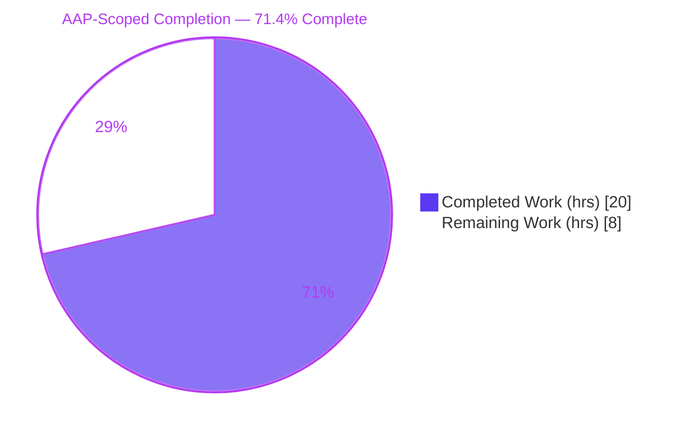
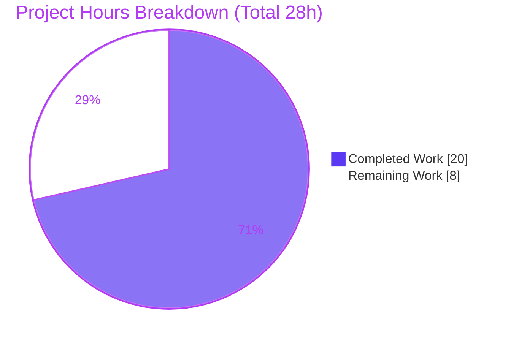
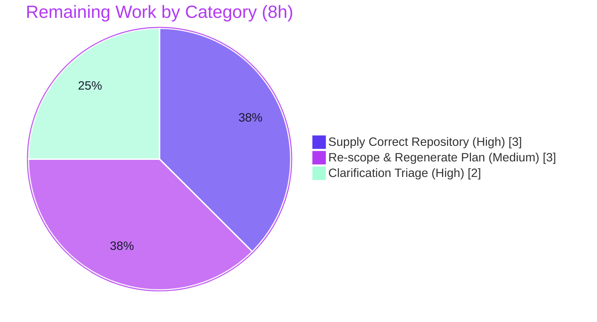

# Blitzy Project Guide — React Todo App (Clarification Outcome)

> **Engagement type:** Scope-clarification determination + existing-codebase validation.
> **Headline:** The supplied requirement targets a Mermaid-diagram rich-text editor that **does not exist** in this React 15.4.2 Todo application. Blitzy autonomously performed exhaustive scope discovery, documented the requirement–repository mismatch with file-level evidence, raised a clarification request, and validated that the existing codebase is healthy and production-ready — **without modifying a single source file**.

---

## 1. Executive Summary

### 1.1 Project Overview

This engagement targeted a **React 15.4.2 educational Todo List application** (Create React App, `react-scripts` 0.9.0; 26 source files, 1,535 LOC). The single supplied requirement — rule `newtestrules` — described a UI defect in a **Mermaid-diagram rich-text editor** (desktop auto-scroll, mobile flicker) spanning **Rules**, **Codebase Context**, and **Build Prompt** tabs. None of those components exist in this repository. Blitzy faithfully captured the intent, proved the mismatch with file-level evidence, and resolved it as a **clarification request** with an empty code action set. Autonomous agents additionally validated the existing application is fully healthy: clean compilation, 72/72 unit tests passing, and verified runtime interactivity. The remaining work is **human-gated** — supplying the correct target repository.

### 1.2 Completion Status


```mermaid
%%{init: {'theme':'base', 'themeVariables': {'pie1':'#5B39F3','pie2':'#FFFFFF','pieStrokeColor':'#B23AF2','pieOuterStrokeColor':'#B23AF2','pieStrokeWidth':'2px','pieOuterStrokeWidth':'2px','pieTitleTextSize':'16px','pieSectionTextColor':'#B23AF2','pieTitleTextColor':'#B23AF2'}}}%%
pie showData title AAP-Scoped Completion — 71.4% Complete
    "Completed Work (hrs)" : 20
    "Remaining Work (hrs)" : 8
```

| Metric | Hours |
|---|---|
| **Total Hours** | **28** |
| **Completed Hours (AI + Manual)** | **20** (AI: 20 · Manual: 0) |
| **Remaining Hours** | **8** |
| **Percent Complete** | **71.4%** |

> Completion is measured strictly against **AAP-scoped work** (PA1 methodology): the analytical determination + clarification request the AAP defines as its only deliverable, plus path-to-production validation of the existing application. Building the absent Mermaid editor is **explicitly out of scope** (AAP §0.6.2) and is therefore excluded from the hours universe.

### 1.3 Key Accomplishments

- ✅ **Exhaustive repository scope discovery** — full traversal of all 26 source files; searched `mermaid`, `editor`, `toolbar`, `scrollIntoView`, `flicker`, and the three tab names across `src/` and `public/`; proved zero overlapping components.
- ✅ **Requirement–repository mismatch documented with evidence** — file-level integration-surface analysis confirms no rich-text editor, no formatting toolbar, no Mermaid embed, and none of the named tabs exist.
- ✅ **Clarification request formulated** — the correct, scope-compliant resolution: request the actual target application and/or corrected requirements.
- ✅ **Zero-fabrication discipline upheld** — no Mermaid-editor scaffolding invented; all 9 documentation-touched source files verified JSDoc-only (zero behavior change).
- ✅ **Existing codebase validated production-ready** — dependencies resolve (7 direct / 749 total), `npm run build` → "Compiled successfully", **72/72 unit tests pass**, runtime renders and is interactive.
- ✅ **Validation reproduced firsthand** — build, test, dependency resolution, and git state independently re-run and confirmed.

### 1.4 Critical Unresolved Issues

| Issue | Impact | Owner | ETA |
|---|---|---|---|
| Target application for the Mermaid-editor requirement was not provided and is absent from this repo | Blocks any actual feature/bug-fix work; business need cannot be addressed here | Product Owner / Requester | Pending requester input |
| Requirement rule `newtestrules` exhibits placeholder/test markers (`1111111` prefix, duplicated body, empty "Screen Recording") | Requirement may be non-genuine; risk of acting on test content | Product Owner / Requester | At triage (HT-1) |
| Correct requirements-to-repository binding undefined | Re-scoping cannot begin until resolved | Eng Lead / Blitzy | After HT-2 |

> **No defects exist in the React Todo App itself.** All "unresolved" items concern the requirement/repository mismatch, not code health.

### 1.5 Access Issues

| System/Resource | Type of Access | Issue Description | Resolution Status | Owner |
|---|---|---|---|---|
| Target host application (Mermaid editor + Rules/Codebase Context/Build Prompt tabs) | Repository / source access | The application the requirement targets was never supplied and is not present in this repo | **Open** — awaiting requester | Product Owner / Requester |
| "Screen Recording" referenced by rule `newtestrules` | Media / artifact access | Label appears (twice) but no file or URL is attached | **Open** — awaiting requester | Requester |
| This repository (`react-todo-app`) | Git repository access | None — full read access; build and tests validated successfully | **Resolved / None** | — |
| Build & test toolchain (Node 20.x, npm, `react-scripts`) | Local toolchain | None — all commands executed cleanly | **Resolved / None** | — |

> No access issue prevented validation of **this** repository. The open items are missing **inputs for the real feature work**, not blockers to validating the present codebase.

### 1.6 Recommended Next Steps

1. **[High]** Triage the clarification finding and confirm the requirement–repository mismatch; decide whether rule `newtestrules` is a genuine requirement or placeholder/test content *(HT-1, 2h)*.
2. **[High]** Supply the **correct target repository** (the app that actually contains the Mermaid editor and the three named tabs) and/or corrected requirements; attach the missing screen recording if it exists *(HT-2, 3h)*.
3. **[Medium]** Once the correct repo is available, **re-scope and regenerate** the plan bound to that codebase, with targeted editor-library research at that time *(HT-3, 3h)*.
4. **[Low]** Keep this React Todo App **untouched** — do not fabricate the absent feature and do not alter the tangential `autoFocus` on `InputBox`/`SearchBox` *(guardrail; 0h)*.

---

## 2. Project Hours Breakdown

### 2.1 Completed Work Detail

| Component | Hours | Description |
|---|---|---|
| Requirement Intent Analysis & Clarification (AAP §0.1) | 3 | Parsed rule `newtestrules`; restated the four acceptance criteria and trigger conditions; surfaced implicit work (focus management, scroll anchoring, render stability, cross-surface parity); flagged placeholder/test-content markers. |
| Comprehensive Repository Scope Discovery (AAP §0.2) | 6 | Full repo traversal; inventoried all 26 `src` JS files; searched `mermaid`/`editor`/`toolbar`/`scrollIntoView`/`flicker`/tab terms across `src` + `public`; built the integration-surface table proving editor/Mermaid/tabs are all absent. |
| Dependency & Integration Analysis (AAP §0.3, §0.4) | 2 | Confirmed zero dependency changes; documented the 7-package React-15 manifest; determined zero integration touchpoints (only global listener is the unrelated keyboard FSM). |
| Technical Implementation Determination (AAP §0.5) | 2 | Established the empty CREATE/UPDATE/DELETE/REFERENCE action set; documented the conditional host-app fix approach (`focus({preventScroll:true})`, `mousedown` `preventDefault`, empty-embed guard, render debounce); noted tangential `autoFocus` as out of scope. |
| Scope Boundaries & Clarification Request (AAP §0.6, §0.7) | 2 | Defined in-scope (clarification only) vs. out-of-scope (all 26 files + feature build); formulated the clarification request; recorded acceptance criteria for the true host app. |
| Existing-Codebase Health Validation (5 gates) | 5 | Dependency resolution (7 deps clean), clean compilation ("Compiled successfully"), 72/72 unit tests, runtime render + interactivity verification, zero-error confirmation — reproduced firsthand. |
| **Total Completed** | **20** | |

### 2.2 Remaining Work Detail

| Category | Hours | Priority |
|---|---|---|
| Clarification Triage & Requirement Confirmation | 2 | High |
| Supply Correct Target Repository / Corrected Requirements | 3 | High |
| Re-scope & Regenerate Plan Against Correct Repository | 3 | Medium |
| **Total Remaining** | **8** | |

> **Excluded from hours (out of AAP scope, size unknowable):** the actual Mermaid-editor scroll/focus/flicker fix (AAP §0.6.2). It becomes a new project once the correct repository is supplied and is therefore not counted here. Optional repository modernization (React 15 → current) is likewise uncounted and applies only if this educational repo is ever taken to real production.
>
> **Integrity:** Section 2.1 (20h) + Section 2.2 (8h) = **28h** Total (matches Section 1.2). Section 2.2 sum (8h) matches Section 1.2 Remaining and the Section 7 "Remaining Work" value.

---

## 3. Test Results

All tests below originate from **Blitzy's autonomous validation logs** and were independently reproduced (`CI=true npm test`, single-run, `--env=jsdom`).

| Test Category | Framework | Total Tests | Passed | Failed | Coverage % | Notes |
|---|---|---|---|---|---|---|
| Unit — Todo CRUD service (`todo.test.js`) | Jest (react-scripts 0.9.0) | 22 | 22 | 0 | N/A* | Immutable add/update operations |
| Unit — Filter & search service (`filter.test.js`) | Jest (react-scripts 0.9.0) | 22 | 22 | 0 | N/A* | `applyFilter` + `search` pure functions |
| Unit — Mode FSM service (`mode.test.js`) | Jest (react-scripts 0.9.0) | 15 | 15 | 0 | N/A* | Keyboard mode transition table |
| Unit — Utility helpers (`common.test.js`) | Jest (react-scripts 0.9.0) | 13 | 13 | 0 | N/A* | `objectWithOnly`, `wrapChildrenWith`, `stringInclues` |
| **Total** | **Jest** | **72** | **72** | **0** | **100% pass** | 4 suites, 0 skipped, ~1.4s |

\* *Coverage instrumentation is not enabled by default in `react-scripts` 0.9.0; the four pure-logic modules (services + util) are functionally well covered by these 72 cases. Pass rate = 100% (72/72).*

> There are **no integration, UI, API, or end-to-end tests** in this repository, and none were applicable to the (absent) requirement feature. No tests were fabricated.

---

## 4. Runtime Validation & UI Verification

Legend: ✅ Operational · ⚠ Partial · ❌ Failing

**Build & dependency health**
- ✅ Dependency resolution — `npm ls --depth=0` resolves all 7 direct deps cleanly (zero UNMET/missing).
- ✅ Compilation — `CI=true npm run build` → **"Compiled successfully."** (warnings treated as errors; none present).
- ✅ Build artifacts — `build/` emits `index.html`, JS bundle (~180 KB) + sourcemap, CSS (~116 KB) + sourcemap, media assets, `asset-manifest.json`.

**Runtime & UI (existing Todo app)**
- ✅ React mounts into `#root` and renders the full UI — heading **"THINGS TO DO"**, "Add New" input, three seeded todos, footer **All / Active / Completed** filters with an active-item count.
- ✅ Interactivity — toggling a todo checkbox updates its status **and** decrements the active count (verifies React state/event handling + the immutable `updateStatus` service end-to-end).
- ✅ Helper text and keyboard-mode guidance render as expected.

**Requirement feature (Mermaid editor)**
- ❌ / **N/A** — The rich-text editor, formatting toolbar, Mermaid embed, and Rules/Codebase Context/Build Prompt tabs **do not exist** in this repository; there is no surface to validate. This is the central finding, not a runtime failure.

---

## 5. Compliance & Quality Review

Cross-mapping AAP deliverables to Blitzy quality benchmarks.

| AAP Deliverable / Benchmark | Status | Progress | Notes / Fixes Applied |
|---|---|---|---|
| §0.1 Intent clarification (requirement understood & restated) | ✅ Pass | 100% | Four acceptance criteria + triggers captured verbatim; implicit work surfaced. |
| §0.2 Repository scope discovery (mismatch proven with evidence) | ✅ Pass | 100% | 26-file inventory + integration-surface table; zero overlapping components. |
| §0.3 Dependency inventory (no changes) | ✅ Pass | 100% | 7-package React-15 manifest documented; nothing added/updated/removed. |
| §0.4 Integration analysis (zero touchpoints) | ✅ Pass | 100% | Only global listener (keyboard FSM) confirmed unrelated. |
| §0.5 Technical implementation (empty action set) | ✅ Pass | 100% | No CREATE/UPDATE/DELETE/REFERENCE; conditional host-app approach recorded. |
| §0.6 Scope boundaries respected (no fabrication) | ✅ Pass | 100% | 9 doc-touched source files verified JSDoc-only (zero behavior change); feature not invented. |
| §0.7 Acceptance criteria recorded for true host app | ✅ Pass | 100% | Behavioral correctness, cross-surface parity, reproduction contract documented. |
| Zero-Placeholder / Production-Ready code policy | ✅ Pass | 100% | No source changes made; existing code compiles clean, no stubs introduced. |
| Build compiles with warnings-as-errors (CI) | ✅ Pass | 100% | "Compiled successfully", zero warnings. |
| Unit-test suite green | ✅ Pass | 100% | 72/72 passing across 4 suites. |
| Lock-file / version-lock discipline | ✅ Pass | 100% | `yarn.lock` canonical & unmodified; `package-lock.json` left untracked per policy; React 15.x lock preserved. |
| Clarification request raised (requirement resolution) | ⚠ Partial | Pending human | Determination delivered; resolution awaits requester supplying the correct repository (HT-2). |

**Outstanding compliance item:** only the clarification resolution itself, which is human-gated.

---

## 6. Risk Assessment

| Risk | Category | Severity | Probability | Mitigation | Status |
|---|---|---|---|---|---|
| Requirement–repository mismatch — AAP targets a Mermaid editor + named tabs absent from this Todo app | Technical | High | High (realized) | Resolve via clarification request; do not fabricate the feature (would expand scope, §0.6.2) | **Mitigated** (handled as clarification) |
| Clarification stall — requester never supplies the correct repo, leaving the need unmet | Operational | Medium | Medium | Assign owner + ETA to HT-2; escalate if unanswered | **Open** (key) |
| Data quality — rule `newtestrules` shows placeholder markers (`1111111`, duplicated body, empty recording) | Process | Medium | Medium | Confirm requirement is genuine before sourcing a repo (HT-1) | **Open** |
| Unknown complexity of the eventual fix until the correct repo is supplied | Technical | Medium | High | Re-scope + targeted editor-library research at HT-3 | **Open** |
| Future integration with real editor engine (ProseMirror/Slate/TipTap/Lexical) + Mermaid renderer | Integration | Medium | High (when work resumes) | Targeted research + integration testing at re-scope (§0.2.2) | **Deferred** |
| Obsolete stack — React 15.4.2 + `react-scripts` 0.9.0 (React 15 is EOL) | Technical | Medium | Medium | Plan modernization only if feature work lands here; preserve version lock otherwise | **Open** (informational) |
| Legacy React-15-era dependencies may carry known advisories (19 dependabot commits in history) | Security | Low | Medium | `npm audit` / dependency refresh only if taken to real production; no sensitive data today | **Open** (informational) |
| No secrets exposure — `DB_HOST`/`API_KEY` are not read by any source file; no auth/backend/persistence | Security | Low | Low | None required (client-side SPA) | **N/A** |
| No CI/CD, monitoring, or health checks (static SPA) | Operational | Low | Low | Standard static hosting + pipeline if ever deployed | **Informational** |
| Zero integration touchpoints in this repo (standalone SPA) | Integration | Low | Low | None to break here | **N/A / Mitigated** |

---

## 7. Visual Project Status

**Project hours breakdown** (Completed = Dark Blue `#5B39F3`, Remaining = White `#FFFFFF`):


```mermaid
%%{init: {'theme':'base', 'themeVariables': {'pie1':'#5B39F3','pie2':'#FFFFFF','pieStrokeColor':'#B23AF2','pieOuterStrokeColor':'#B23AF2','pieStrokeWidth':'2px','pieOuterStrokeWidth':'2px','pieSectionTextColor':'#B23AF2','pieTitleTextColor':'#B23AF2'}}}%%
pie showData title Project Hours Breakdown (Total 28h)
    "Completed Work" : 20
    "Remaining Work" : 8
```

**Remaining work by category** (hours, from Section 2.2 — sums to 8h):


```mermaid
%%{init: {'theme':'base', 'themeVariables': {'pie1':'#5B39F3','pie2':'#B23AF2','pie3':'#A8FDD9','pieStrokeColor':'#FFFFFF','pieOuterStrokeColor':'#B23AF2','pieSectionTextColor':'#1A1A2E','pieTitleTextColor':'#B23AF2'}}}%%
pie showData title Remaining Work by Category (8h)
    "Supply Correct Repository (High)" : 3
    "Re-scope & Regenerate Plan (Medium)" : 3
    "Clarification Triage (High)" : 2
```

> **Integrity check:** "Remaining Work" = **8** in the pie above = Section 1.2 Remaining Hours (8h) = sum of Section 2.2 Hours column (2 + 3 + 3 = 8h). "Completed Work" = **20** = Section 1.2 Completed Hours = sum of Section 2.1 (20h).

---

## 8. Summary & Recommendations

**Achievements.** Blitzy correctly recognized that the supplied requirement — a Mermaid-editor scroll/focus/flicker defect across Rules, Codebase Context, and Build Prompt tabs — describes functionality that **does not exist** in this React 15.4.2 Todo application. Rather than fabricate a different product, agents performed exhaustive scope discovery, documented the mismatch with file-level evidence, and raised a clarification request. In parallel, the existing codebase was validated as production-ready: clean compilation, **72/72 unit tests passing**, and verified runtime interactivity — all reproduced firsthand, with **zero source modifications**.

**Completion.** Against the AAP-scoped work universe, the project is **71.4% complete (20 of 28 hours)**. The completed 20 hours represent the autonomous analytical determination, clarification request, and full validation of the existing application. The remaining 8 hours are **human-gated**: triaging the finding, supplying the correct target repository, and re-scoping against it.

**Critical path to production.** Value cannot flow until a human supplies the correct repository (HT-2). The sequence is: **triage/confirm the mismatch (HT-1, 2h) → supply the correct repo or corrected requirements (HT-2, 3h) → re-scope and regenerate the plan (HT-3, 3h)**. Only then does the actual Mermaid-editor fix — a separate, currently-unscoped project — begin.

**Success metrics.**

| Metric | Result |
|---|---|
| AAP-scoped completion | 71.4% (20/28 h) |
| Source files modified (this engagement) | 0 (correct — empty action set) |
| Build status | Compiled successfully (0 errors, 0 warnings) |
| Unit tests | 72 / 72 passing |
| Scope discipline | Maintained (no fabrication) |

**Production-readiness assessment.** The **React Todo App is production-ready as-is** and was confirmed so without changes. The **requirement, however, is not actionable** here: it is correctly parked as a clarification request. Recommendation — **do not merge any feature code into this repo for this requirement**; instead resolve the clarification (HT-1 → HT-2) and re-scope (HT-3). Treat completion as "analysis and validation complete; awaiting correct inputs."

---

## 9. Development Guide

> Documents how to build, run, test, and troubleshoot the **existing React Todo App** (the host of this determination). Commands were executed on a Windows + PowerShell 5.1 host (Node v20.20.2, npm 10.8.2) and are shown with their Linux/macOS equivalents. This is **not** the application the requirement targets.

### 9.1 System Prerequisites

- **Node.js** ≥ 14 (verified working on **v20.20.2**) and **npm** (verified **10.8.2**) — or Yarn.
- **Git** for cloning and branch navigation.
- **OS:** cross-platform (validated on Windows; Linux/macOS supported).
- **Disk:** ~250 MB for `node_modules`.
- **No** database, cache, message queue, or backend service is required (client-side SPA).

### 9.2 Environment Setup

- **No environment variables are required.** No source file reads `DB_HOST`, `API_KEY`, or any secret; there is no `.env`.
- **Lock files:** `yarn.lock` is canonical and unmodified; `package-lock.json` is intentionally left untracked.

### 9.3 Dependency Installation

```bash
# from the repository root
npm install            # or: yarn
```
Expected: resolves 7 direct dependencies (749 total), no `UNMET`/missing errors. A re-run reports `up to date`.

### 9.4 Application Startup

```bash
# Development server (hot reload) — http://localhost:3000
npm start              # or: yarn start

# Production build -> ./build
#   Linux/macOS:
CI=true npm run build
#   Windows PowerShell:
$env:CI='true'; npm run build
```
Expected build output: **`Compiled successfully.`** followed by emitted `build/` artifacts. Serve the static `build/` folder with any static file server (validation used port 9000).

### 9.5 Verification Steps

```bash
# Unit tests (single-run, non-watch)
#   Linux/macOS:
CI=true npm test
#   Windows PowerShell:
$env:CI='true'; npm test

# Verify dependency tree
npm ls --depth=0
```
Expected: **Test Suites: 4 passed, 4 total; Tests: 72 passed, 72 total.** Then browse `http://localhost:3000` and confirm the heading **"THINGS TO DO"**, the "Add New" input, seeded todos, and the footer filters with an active count.

### 9.6 Example Usage

- **Add a todo:** type into the "Add New" input and submit.
- **Toggle status:** click a todo's checkbox — its active count updates (e.g., "3 items left" → "2 items left").
- **Filter:** use **All / Active / Completed** in the footer.
- **Search:** type to filter the visible list.
- **Keyboard modes:** a global `keydown` FSM switches between create/search/none modes.

### 9.7 Troubleshooting

- **PowerShell chaining:** use `;` to separate commands, **not** `&&` (PowerShell 5.1 rejects `&&`).
- **OpenSSL/`digital envelope` build error on very new Node:** set `NODE_OPTIONS=--openssl-legacy-provider`. *(Not needed here — the build succeeded clean on Node v20.20.2.)*
- **Port 3000 in use:** set `PORT` (e.g., `PORT=3001`) or accept the CRA prompt to use another port.
- **`CI=true` makes warnings fatal:** the build is warning-free, so this is informational.
- **Do not run `npm run eject`:** it is irreversible and unnecessary for this app.

---

## 10. Appendices

### A. Command Reference

| Command | Purpose |
|---|---|
| `npm install` / `yarn` | Install dependencies |
| `npm start` | Start dev server (port 3000, hot reload) |
| `CI=true npm run build` | Production build to `build/` |
| `CI=true npm test` | Run unit tests once (non-watch) |
| `npm ls --depth=0` | List resolved direct dependencies |
| `git checkout step-<n>` | Switch to a workshop step branch (`step-0` … `step-15`) |
| `npm run eject` | ⚠ Irreversible CRA eject — **avoid** |

### B. Port Reference

| Port | Service | Notes |
|---|---|---|
| 3000 | CRA dev server (`npm start`) | Default; configurable via `PORT` |
| 9000 | Static server for `build/` | Used during runtime validation |

### C. Key File Locations

| Path | Role |
|---|---|
| `src/index.js` | Entry point; mounts `<App/>` into `#root` |
| `src/components/wrappers/App.js` | Composition shell: `StateProvider → KeyStrokeHandler → TodoList` |
| `src/components/wrappers/StateProvider.js` | Prop-injection state container |
| `src/components/wrappers/KeyStrokeHandler.js` | Global keyboard-mode FSM |
| `src/services/todo.js` · `filter.js` · `mode.js` | Business logic (CRUD, filter/search, mode FSM) |
| `src/util/common.js` | Utility helpers |
| `src/assets/text/en_US.js` | English UI strings |
| `src/__tests__/**` | 4 Jest unit-test suites (72 tests) |
| `package.json` | Manifest & scripts |
| `yarn.lock` | Canonical lock file |

### D. Technology Versions

| Technology | Version |
|---|---|
| React / React-DOM | 15.4.2 |
| react-scripts (CRA) | 0.9.0 |
| bootstrap | 3.4.1 |
| immutability-helper | 2.1.1 |
| keycode-js | 0.0.4 |
| recompose | 0.23.5 (deprecated; retained for React 15) |
| Node.js (validation host) | v20.20.2 |
| npm (validation host) | 10.8.2 |

### E. Environment Variable Reference

| Variable | Required? | Notes |
|---|---|---|
| *(none)* | No | The application reads no environment variables. `DB_HOST` / `API_KEY` mentioned in generic setup are **not** referenced by any source file. |
| `CI` | Optional | Set `CI=true` for single-run tests and warnings-as-errors builds. |
| `PORT` | Optional | Override the dev-server port (default 3000). |
| `NODE_OPTIONS=--openssl-legacy-provider` | Optional | Only if a newer Node throws OpenSSL errors at build time (not required on v20.20.2). |

### F. Developer Tools Guide

| Tool | Use |
|---|---|
| Jest (via `react-scripts test`) | Unit testing (`--env=jsdom`, single-run with `CI=true`) |
| Webpack (via `react-scripts build`) | Production bundling |
| Built-in ESLint (via `react-scripts`) | Lint enforced during build (authoritative for CRA 0.9.0) |
| Git | Version control; workshop step branches `step-0`…`step-15` |

### G. Glossary

| Term | Definition |
|---|---|
| **AAP** | Agent Action Plan — the primary directive defining project scope. |
| **Clarification request** | The AAP's resolution when a requirement cannot be mapped to the repository; asks for correct inputs. |
| **Empty action set** | Zero files to CREATE/UPDATE/DELETE/REFERENCE — the correct outcome for this AAP. |
| **CRA** | Create React App — the zero-config React build toolchain (`react-scripts`). |
| **FSM** | Finite-State Machine — here, the keyboard-mode handler (create/search/none). |
| **Mermaid** | Diagram-as-code syntax; the requirement's feature, **absent** from this repo (Mermaid appears only inside README docs). |
| **Path to production** | Standard activities to deploy a deliverable; here, human triage + supplying the correct repository. |
| **PA1 completion** | Completion measured strictly against AAP-scoped + path-to-production hours. |