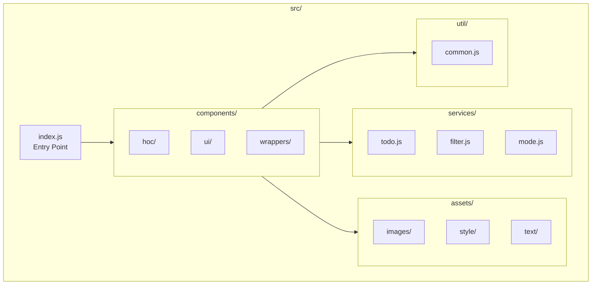

# Technical Specification

# 0. Agent Action Plan

## 0.1 Intent Clarification

### 0.1.1 Core Documentation Objective

Based on the provided requirements, the Blitzy platform understands that the documentation objective is to **create module-wise README files throughout the React Todo App codebase that provide clear onboarding paths for new developers**. The primary intent is to improve code discoverability and comprehension by adding focused documentation at the module level, with cross-references back to the main README.md.

**Request Category**: Create new documentation  
**Documentation Type**: Module README files for developer onboarding

**Requirement Breakdown with Enhanced Clarity**:

| Requirement | Interpretation | Implementation Approach |
|------------|----------------|------------------------|
| "Add module wise readme files" | Create README.md files within each logical module directory | One README per major folder under `src/` |
| "Reference those back to main readme files" | Include navigation links connecting module docs to root README | Add consistent link headers in each module README |
| "Make it easy for new developers to onboard" | Provide clear explanations of purpose, APIs, and usage patterns | Focus on "what", "why", and "how to use" for each module |
| "Clear and concise English" | Avoid jargon, use direct language, keep paragraphs focused | Write at a level accessible to junior developers |
| "Simple and neutral language" | Avoid opinionated statements, remain factual | Document behavior without prescribing patterns |

**Inferred Documentation Needs**:

Based on the repository analysis, the following implicit documentation requirements are identified:

- **Module Overview Documentation**: Each folder lacks contextual README explaining its role
- **Component API Documentation**: UI components have props interfaces that need documentation
- **Service Contract Documentation**: Service modules (todo.js, filter.js, mode.js) export public APIs requiring usage examples
- **Utility Documentation**: The util/common.js module has helper functions used across the codebase
- **Asset Documentation**: Assets folder contains icons, styles, and locale constants that need explanation
- **Navigation Structure**: New developers need a clear path from main README to module-specific documentation

### 0.1.2 Special Instructions and Constraints

**User Directives Captured**:

- Use clear and concise English
- Employ simple and neutral language
- Create module-wise README files (one per major module)
- Reference module READMEs back to the main README
- Focus on new developer onboarding ease

**Style Preferences**:

| Aspect | Directive |
|--------|-----------|
| Tone | Neutral, instructional, welcoming to newcomers |
| Structure | Organized by module purpose, API, and usage |
| Depth | Sufficient for understanding without overwhelming |
| Format | Markdown with consistent heading hierarchy |

**Template Requirements**: No specific template provided by user. Documentation will follow the existing README.md style and standard React project documentation patterns.

### 0.1.3 Technical Interpretation

These documentation requirements translate to the following technical documentation strategy:

| Goal | Action | Target Files |
|------|--------|-------------|
| Document the services layer | Create a README explaining todo, filter, and mode services | `src/services/README.md` |
| Document the component layer | Create a README explaining component organization and patterns | `src/components/README.md` |
| Document UI components | Create a README listing all presentational components | `src/components/ui/README.md` |
| Document wrapper components | Create a README for state and event handling | `src/components/wrappers/README.md` |
| Document HOC patterns | Create a README for the higher-order component | `src/components/hoc/README.md` |
| Document utilities | Create a README for common helper functions | `src/util/README.md` |
| Document assets | Create a README for static assets structure | `src/assets/README.md` |
| Document the src root | Create a README providing navigation overview | `src/README.md` |
| Update main README | Add section referencing new module documentation | `README.md` |

### 0.1.4 Inferred Documentation Needs

Based on comprehensive codebase analysis, the following documentation gaps require attention:

**Code Structure Gaps**:

- `src/` lacks an entry-point README explaining the folder structure
- `src/services/` contains three service modules with no documentation on their contracts
- `src/components/` has complex organization (hoc, ui, wrappers) without navigational guidance
- `src/util/` exports utility functions that are used across the codebase without documentation
- `src/assets/` contains organized sub-folders for images, styles, and text with no explanation

**Onboarding Path Gaps**:

- No clear guidance on where to start when exploring the codebase
- No documentation linking component hierarchy to data flow
- No explanation of the application architecture patterns used
- Missing keyboard shortcut documentation for the application functionality

**Developer Experience Gaps**:

- New developers cannot quickly understand the purpose of each folder
- The relationship between services, components, and utilities is not documented
- Props interfaces for components are only discoverable by reading source code


## 0.2 Documentation Discovery and Analysis

### 0.2.1 Existing Documentation Infrastructure Assessment

Repository analysis reveals a minimal documentation structure with documentation coverage limited to the root-level README only.

**Search Patterns Employed**:

| Pattern | Results Found |
|---------|---------------|
| `README*` | 1 file: `./README.md` |
| `docs/**` | No docs directory exists |
| `*.md` in subdirectories | No markdown files found |
| `*.mdx` | No MDX files found |
| `*.rst` | No RST files found |

**Current Documentation Inventory**:

| File | Location | Purpose | Content Summary |
|------|----------|---------|-----------------|
| README.md | Root | Project overview and setup | Contains project description, clone instructions, install/run commands, and 16-step branch history |

**Documentation Generator Analysis**:

| Configuration File | Status | Notes |
|-------------------|--------|-------|
| mkdocs.yml | Not present | No MkDocs configuration |
| docusaurus.config.js | Not present | No Docusaurus setup |
| sphinx/conf.py | Not present | No Sphinx documentation |
| .readthedocs.yml | Not present | No ReadTheDocs integration |
| jsdoc.json | Not present | No JSDoc configuration |

**Repository Analysis Findings**: Repository analysis reveals a minimal documentation structure with a single root README.md file covering project setup, demo links, and development step branches. No module-level documentation exists within the `src/` directory structure.

### 0.2.2 Repository Code Analysis for Documentation

**Search Patterns Used for Code to Document**:

| Pattern | Target | Files Found |
|---------|--------|-------------|
| `src/services/*.js` | Service layer APIs | 3 files (mode.js, filter.js, todo.js) |
| `src/components/**/*.js` | React components | 16 files across 3 subdirectories |
| `src/util/*.js` | Utility modules | 1 file (common.js) |
| `src/assets/**/*` | Static assets | 4 files (2 SVGs, 1 CSS, 1 JS) |
| `src/index.js` | Application entry | 1 file |

**Key Directories Examined**:

```
src/
├── index.js                    # Application entry point
├── assets/                     # Static resources (0 README)
│   ├── images/                 # SVG icons: add.svg, search.svg
│   ├── style/                  # Global CSS: index.css
│   └── text/                   # Locale constants: en_US.js
├── components/                 # React component layer (0 README)
│   ├── hoc/                    # Higher-order component: wrapInputBox.js
│   ├── ui/                     # 12 presentational components
│   └── wrappers/               # 3 state/event wrapper components
├── services/                   # Business logic layer (0 README)
│   ├── filter.js               # List filtering and search
│   ├── mode.js                 # UI mode state management
│   └── todo.js                 # Todo item CRUD operations
└── util/                       # Shared utilities (0 README)
    └── common.js               # Object/React/string helpers
```

**Related Documentation Found**:

| Source | Location | Documentation Value |
|--------|----------|---------------------|
| JSDoc comments | `src/services/todo.js` | Partial function documentation |
| JSDoc comments | `src/util/common.js` | Function documentation present |
| Inline comments | `src/services/todo.js` | Counter logic explanation |
| Import statements | All files | Dependency relationships |

### 0.2.3 Web Search Research Conducted

**Research Areas Investigated**:

| Topic | Key Findings |
|-------|--------------|
| Module README best practices for React | Place README.md files adjacent to module code; document component interfaces, props, and usage examples |
| Documentation structure conventions | Use consistent heading hierarchy; include purpose, API, examples, and related files |
| Developer onboarding documentation | Start with "what" and "why" before diving into "how"; provide navigation links |
| Markdown formatting for code documentation | Use code blocks with language tags, tables for prop documentation |

**Best Practices Adopted**:

- Create README.md files in each major folder to provide contextual documentation
- Include a consistent structure: Overview, Contents, API/Interface, Usage Examples, Related Links
- Reference back to parent documentation for navigation context
- Keep documentation focused and scannable with tables and lists
- Use simple language accessible to developers of all experience levels


## 0.3 Documentation Scope Analysis

### 0.3.1 Code-to-Documentation Mapping

**Modules Requiring Documentation**:

#### Services Module (`src/services/`)

| Service File | Public APIs | Current Documentation | Documentation Needed |
|-------------|-------------|----------------------|---------------------|
| `todo.js` | `getAll()`, `getItemById()`, `updateStatus()`, `addToList()` | JSDoc comments (partial) | API reference, usage examples, data structure |
| `filter.js` | `FILTER_ALL`, `FILTER_ACTIVE`, `FILTER_COMPLETED`, `applyFilter()`, `search()`, `getOptions()` | None | Constants documentation, function reference, examples |
| `mode.js` | `MODE_NONE`, `MODE_SEARCH`, `MODE_CREATE`, `getNextModeByKey()` | None | State machine documentation, keyboard mapping |

#### Components Module (`src/components/`)

**UI Components (`src/components/ui/`)**:

| Component File | Props Interface | Current Documentation | Documentation Needed |
|---------------|-----------------|----------------------|---------------------|
| `TodoList.js` | `data`, `actions` | None | Main container overview, prop drilling diagram |
| `Header.js` | `addNew`, `mode`, `query`, `setSearchQuery` | None | Layout purpose, children composition |
| `Footer.js` | `activeItemCount`, `filter`, `changeFilter`, `mode`, `changeMode` | None | Footer layout, item count display |
| `FilteredList.js` | `items`, `changeStatus` | None | List rendering, empty state handling |
| `TodoItem.js` | `data`, `changeStatus` | None | Item rendering, status toggle |
| `CheckBox.js` | `checked`, `onChange` | None | Controlled checkbox pattern |
| `InputBox.js` | Enhanced by HOC | None | Input handling, HOC integration |
| `InputWrapper.js` | `mode`, `addNew`, `query`, `setSearchQuery` | None | Conditional input routing |
| `SearchBox.js` | `query`, `setSearchQuery` | None | Search input control |
| `Filter.js` | `filter`, `changeFilter` | None | Filter toggle buttons |
| `ButtonWrapper.js` | `mode`, `changeMode` | None | Mode toggle buttons |
| `Info.js` | `mode` | None | Keyboard shortcut hints |

**Wrapper Components (`src/components/wrappers/`)**:

| Component File | Purpose | Current Documentation | Documentation Needed |
|---------------|---------|----------------------|---------------------|
| `App.js` | Application root composition | None | Entry point, provider nesting |
| `StateProvider.js` | Centralized state container | None | State shape, action methods, child injection |
| `KeyStrokeHandler.js` | Global keyboard listener | None | Event handling, mode transitions |

**HOC Module (`src/components/hoc/`)**:

| File | Injected Props | Current Documentation | Documentation Needed |
|------|---------------|----------------------|---------------------|
| `wrapInputBox.js` | `value`, `setValue`, `handleChange`, `handleKeyUp` | None | HOC pattern, prop injection, usage example |

#### Utilities Module (`src/util/`)

| File | Exported Functions | Current Documentation | Documentation Needed |
|------|-------------------|----------------------|---------------------|
| `common.js` | `objectWithOnly()`, `wrapChildrenWith()`, `stringInclues()` | JSDoc comments | Usage context, integration points |

#### Assets Module (`src/assets/`)

| Subfolder | Contents | Current Documentation | Documentation Needed |
|-----------|----------|----------------------|---------------------|
| `images/` | `add.svg`, `search.svg` | None | Icon usage, sizing, styling |
| `style/` | `index.css` | None | CSS class reference, layout structure |
| `text/` | `en_US.js` | None | Locale constants, internationalization notes |

### 0.3.2 Documentation Gap Analysis

Given the requirements and repository analysis, documentation gaps include:

**Undocumented Module Structures**:

| Module Path | Gap Description | Priority |
|-------------|-----------------|----------|
| `src/` | No overview README exists | High |
| `src/services/` | No README explaining service contracts | High |
| `src/components/` | No README explaining component organization | High |
| `src/components/ui/` | No README listing UI components | Medium |
| `src/components/wrappers/` | No README for state management | High |
| `src/components/hoc/` | No README for HOC pattern | Medium |
| `src/util/` | No README for utility functions | Medium |
| `src/assets/` | No README for assets organization | Low |

**Missing Documentation Types**:

| Documentation Type | Current Coverage | Required Actions |
|--------------------|------------------|------------------|
| Module overviews | 0% | Create 8 new README files |
| API references | Partial JSDoc | Consolidate in README files |
| Usage examples | 0% | Add code snippets in each README |
| Navigation links | 0% | Add cross-references in all READMEs |
| Architecture diagrams | 0% | Add Mermaid diagrams where helpful |

**Navigation Gap**: Currently no way to navigate from the main README.md to module-specific documentation. New developers must explore folders blindly to understand the codebase structure.


## 0.4 Documentation Implementation Design

### 0.4.1 Documentation Structure Planning

**Documentation Hierarchy**:

```
react-todo-app/
├── README.md                           # Root (UPDATE: add module navigation section)
└── src/
    ├── README.md                       # NEW: Source overview and navigation
    ├── assets/
    │   └── README.md                   # NEW: Assets documentation
    ├── components/
    │   ├── README.md                   # NEW: Components layer overview
    │   ├── hoc/
    │   │   └── README.md               # NEW: HOC pattern documentation
    │   ├── ui/
    │   │   └── README.md               # NEW: UI components catalog
    │   └── wrappers/
    │       └── README.md               # NEW: State/event wrapper documentation
    ├── services/
    │   └── README.md                   # NEW: Services layer documentation
    └── util/
        └── README.md                   # NEW: Utilities documentation
```

### 0.4.2 Content Generation Strategy

**Information Extraction Approach**:

| Source | Extraction Method | Documentation Target |
|--------|-------------------|---------------------|
| JSDoc comments | Extract from `todo.js`, `common.js` | API reference sections |
| Export statements | Analyze all module exports | Public interface lists |
| Import statements | Trace dependencies | Related files sections |
| Component props | Extract from destructuring patterns | Props tables |
| Constants | Extract from constant declarations | Configuration sections |

**README Template Structure for Each Module**:

Each module README follows a consistent structure with: Module Name heading, one-line purpose description, navigation links to parent and main README, an Overview section with 2-3 explanatory sentences, a Contents list, an API/Interface section with tables or lists, a Usage section with code examples, and a Related section with links to related modules.

### 0.4.3 Documentation Standards

**Markdown Formatting Rules**:

| Element | Standard | Example |
|---------|----------|---------|
| Module title | H1 with module name | `# Services` |
| Navigation links | Blockquote at top | `> Back to [src](../README.md)` |
| Section headings | H2 for main sections | `## Overview` |
| Sub-sections | H3 for sub-divisions | `### todo.js` |
| Code examples | Fenced blocks with language | Triple backticks with `javascript` |
| Tables | Pipe-delimited | `\| Column \| Data \|` |
| File references | Inline code | Backtick-wrapped `filename.js` |

**Source Citation Pattern**:

Each documented API or feature will reference its source file using the format:
- For functions: `Source: src/services/todo.js:getAll()`
- For constants: `Source: src/services/filter.js:FILTER_ALL`
- For components: `Source: src/components/ui/TodoList.js`

### 0.4.4 Diagram and Visual Strategy

**Mermaid Diagrams to Include**:

| Location | Diagram Type | Purpose |
|----------|-------------|---------|
| `src/README.md` | Flowchart | Show folder structure and navigation |
| `src/components/README.md` | Flowchart | Component hierarchy and data flow |
| `src/services/README.md` | Flowchart | Service module relationships |
| `src/components/wrappers/README.md` | Sequence diagram | State provider data flow |

**Example Diagram Structure (for src/README.md)**:



### 0.4.5 Cross-Reference Strategy

**Navigation Link Pattern**:

Each module README will include:

- **Header navigation**: Links to parent and root README
- **Related modules**: Links to dependent/dependency modules
- **Footer navigation**: Optional "See also" section

**Example Navigation Block Format**:

Navigation blockquote with back arrow to parent README and link to Main README at repository root.

**Inter-module References**:

| From Module | References To |
|-------------|---------------|
| `src/components/` | `src/services/`, `src/util/`, `src/assets/` |
| `src/components/ui/` | `src/components/hoc/`, `src/services/` |
| `src/components/wrappers/` | `src/services/`, `src/util/` |
| `src/services/` | `src/util/` |


## 0.5 Documentation File Transformation Mapping

### 0.5.1 File-by-File Documentation Plan

**Documentation Transformation Map**:

| Target Documentation File | Transformation | Source Code/Docs | Content/Changes |
|---------------------------|----------------|------------------|-----------------|
| `README.md` | UPDATE | `README.md` | Add "Module Documentation" section with links to all module READMEs |
| `src/README.md` | CREATE | `src/index.js`, `src/*/` | Source overview, folder structure diagram, entry point explanation, navigation to all submodules |
| `src/services/README.md` | CREATE | `src/services/*.js` | Service layer overview, API documentation for todo.js, filter.js, mode.js with constants and functions |
| `src/components/README.md` | CREATE | `src/components/*/` | Components layer overview, organization explanation, component hierarchy diagram, links to hoc/ui/wrappers |
| `src/components/ui/README.md` | CREATE | `src/components/ui/*.js` | UI components catalog, props tables for all 12 presentational components |
| `src/components/wrappers/README.md` | CREATE | `src/components/wrappers/*.js` | State management documentation, App composition, StateProvider state shape, KeyStrokeHandler events |
| `src/components/hoc/README.md` | CREATE | `src/components/hoc/wrapInputBox.js` | HOC pattern explanation, injected props, usage example with InputBox |
| `src/util/README.md` | CREATE | `src/util/common.js` | Utility functions documentation, objectWithOnly, wrapChildrenWith, stringInclues usage |
| `src/assets/README.md` | CREATE | `src/assets/*/` | Assets structure, images (SVG icons), styles (global CSS), text (locale constants) |

### 0.5.2 New Documentation Files Detail

#### File: `src/README.md`

| Attribute | Value |
|-----------|-------|
| Type | Module Overview |
| Source Code | `src/index.js`, `src/*/` |
| Sections | Overview, Folder Structure, Entry Point, Navigation |
| Diagrams | Mermaid flowchart showing folder relationships |
| Key Citations | `src/index.js`, all first-level subdirectories |

#### File: `src/services/README.md`

| Attribute | Value |
|-----------|-------|
| Type | API Reference |
| Source Code | `src/services/todo.js`, `src/services/filter.js`, `src/services/mode.js` |
| Sections | Overview, todo.js API, filter.js API, mode.js API, Usage Examples |
| Diagrams | Service relationship diagram |
| Key Citations | All three service files |

**Documented APIs**:
- `todo.js`: `getAll()`, `getItemById(itemId)`, `updateStatus(items, itemId, completed)`, `addToList(list, data)`
- `filter.js`: `FILTER_ALL`, `FILTER_ACTIVE`, `FILTER_COMPLETED`, `applyFilter(list, filter)`, `search(list, query)`, `getOptions()`
- `mode.js`: `MODE_NONE`, `MODE_SEARCH`, `MODE_CREATE`, `getNextModeByKey(current, keyPressed)`

#### File: `src/components/README.md`

| Attribute | Value |
|-----------|-------|
| Type | Module Overview |
| Source Code | `src/components/*/` |
| Sections | Overview, Organization, Component Hierarchy, Navigation |
| Diagrams | Component layer hierarchy flowchart |
| Key Citations | All three component subdirectories |

#### File: `src/components/ui/README.md`

| Attribute | Value |
|-----------|-------|
| Type | Component Catalog |
| Source Code | `src/components/ui/*.js` (12 files) |
| Sections | Overview, Component List with Props, Usage Patterns |
| Diagrams | None (table-based) |
| Key Citations | All 12 UI component files |

**Components Documented**:
- `TodoList.js` - Main container
- `Header.js` - App title and input wrapper
- `Footer.js` - Filter and mode controls
- `FilteredList.js` - Todo items container
- `TodoItem.js` - Individual todo item
- `CheckBox.js` - Checkbox control
- `InputBox.js` - New todo input
- `InputWrapper.js` - Input mode router
- `SearchBox.js` - Search input
- `Filter.js` - Filter buttons
- `ButtonWrapper.js` - Mode buttons
- `Info.js` - Keyboard shortcut hints

#### File: `src/components/wrappers/README.md`

| Attribute | Value |
|-----------|-------|
| Type | Architecture Documentation |
| Source Code | `src/components/wrappers/App.js`, `StateProvider.js`, `KeyStrokeHandler.js` |
| Sections | Overview, App.js, StateProvider (state shape, actions), KeyStrokeHandler |
| Diagrams | State flow sequence diagram |
| Key Citations | All three wrapper files |

#### File: `src/components/hoc/README.md`

| Attribute | Value |
|-----------|-------|
| Type | Pattern Documentation |
| Source Code | `src/components/hoc/wrapInputBox.js` |
| Sections | Overview, What is an HOC, Injected Props, Usage Example |
| Diagrams | None |
| Key Citations | `wrapInputBox.js`, `InputBox.js` |

#### File: `src/util/README.md`

| Attribute | Value |
|-----------|-------|
| Type | API Reference |
| Source Code | `src/util/common.js` |
| Sections | Overview, Functions, Usage Examples |
| Diagrams | None |
| Key Citations | `common.js` |

**Functions Documented**:
- `objectWithOnly(object, attrs)` - Extract and bind subset of object methods
- `wrapChildrenWith(children, props)` - Clone React children with additional props
- `stringInclues(str, substr)` - Substring search utility

#### File: `src/assets/README.md`

| Attribute | Value |
|-----------|-------|
| Type | Asset Documentation |
| Source Code | `src/assets/images/*`, `src/assets/style/*`, `src/assets/text/*` |
| Sections | Overview, Images, Styles, Text/Locale |
| Diagrams | None |
| Key Citations | All asset files |

### 0.5.3 Documentation Files to Update

## `README.md` (Root)

**Changes Required**:
- Add new section "Module Documentation" after "Steps" section
- Include navigation links to all new module READMEs
- Provide brief descriptions of each module's purpose

**New Section Content Outline**:
- Section heading: `## Module Documentation`
- Introduction paragraph explaining module-level docs
- Table or list with links to each module README
- Brief one-line descriptions for each module

### 0.5.4 Complete File List Summary

| File Path | Action | Priority |
|-----------|--------|----------|
| `README.md` | UPDATE | High |
| `src/README.md` | CREATE | High |
| `src/services/README.md` | CREATE | High |
| `src/components/README.md` | CREATE | High |
| `src/components/ui/README.md` | CREATE | Medium |
| `src/components/wrappers/README.md` | CREATE | High |
| `src/components/hoc/README.md` | CREATE | Medium |
| `src/util/README.md` | CREATE | Medium |
| `src/assets/README.md` | CREATE | Low |

**Total Documentation Files**: 9 (1 update, 8 new)


## 0.6 Dependency Inventory

### 0.6.1 Documentation Dependencies

This documentation effort uses Markdown as the native documentation format, requiring no additional documentation generation tools. The project does not currently have any documentation build infrastructure.

**Documentation Tool Requirements**:

| Registry | Package Name | Version | Purpose | Required |
|----------|--------------|---------|---------|----------|
| N/A | Markdown | Native | Documentation format (GitHub-rendered) | Built-in |
| N/A | Mermaid | GitHub-native | Diagram rendering in Markdown | Built-in |

**Note**: GitHub natively renders Markdown files and Mermaid diagrams, eliminating the need for additional documentation generation tools. The documentation will be viewable directly in the GitHub repository interface.

### 0.6.2 Project Runtime Dependencies

For reference, the project uses the following runtime dependencies that may be documented:

| Registry | Package Name | Version | Purpose |
|----------|--------------|---------|---------|
| npm | react | ^15.4.2 | UI component library |
| npm | react-dom | ^15.4.2 | React DOM renderer |
| npm | bootstrap | ^3.4.1 | CSS framework for styling |
| npm | recompose | ^0.23.5 | Higher-order component utilities |
| npm | keycode-js | ^0.0.4 | Keyboard event constants |
| npm | immutability-helper | ^2.1.1 | Immutable state updates |
| npm | react-scripts | 0.9.0 | Create React App build tooling (dev) |

*Source: `package.json`*

### 0.6.3 Documentation Reference Updates

**Main README Link Updates Required**:

After creating the module READMEs, the root `README.md` needs to be updated with links to the new documentation files:

| Link Target | Link Text | Section |
|-------------|-----------|---------|
| `src/README.md` | Source Code | Module Documentation |
| `src/services/README.md` | Services | Module Documentation |
| `src/components/README.md` | Components | Module Documentation |
| `src/util/README.md` | Utilities | Module Documentation |
| `src/assets/README.md` | Assets | Module Documentation |

**Internal Cross-Reference Links**:

| From File | Link To | Purpose |
|-----------|---------|---------|
| `src/README.md` | `../README.md` | Back to main README |
| `src/services/README.md` | `../README.md` | Back to src README |
| `src/services/README.md` | `../../README.md` | Back to main README |
| `src/components/README.md` | `../README.md` | Back to src README |
| `src/components/ui/README.md` | `../README.md` | Back to components README |
| `src/components/wrappers/README.md` | `../README.md` | Back to components README |
| `src/components/hoc/README.md` | `../README.md` | Back to components README |
| `src/util/README.md` | `../README.md` | Back to src README |
| `src/assets/README.md` | `../README.md` | Back to src README |


## 0.7 Coverage and Quality Targets

### 0.7.1 Documentation Coverage Metrics

**Current Coverage Analysis**:

| Category | Items | Documented | Coverage |
|----------|-------|------------|----------|
| Modules with README | 8 folders | 0 | 0% |
| Service APIs | 10 exports | 2 (JSDoc) | 20% |
| UI Components | 12 files | 0 | 0% |
| Wrapper Components | 3 files | 0 | 0% |
| Utility Functions | 3 functions | 3 (JSDoc) | 100% |
| Asset Folders | 3 folders | 0 | 0% |

**Target Coverage**: 100% module-level README coverage

**Coverage Goals by Module**:

| Module | Current | Target | Gap to Close |
|--------|---------|--------|--------------|
| `src/` | 0% | 100% | Create README with folder overview |
| `src/services/` | 20% | 100% | Create README documenting all 10 exports |
| `src/components/` | 0% | 100% | Create README with organization guide |
| `src/components/ui/` | 0% | 100% | Create README cataloging 12 components |
| `src/components/wrappers/` | 0% | 100% | Create README for 3 wrapper components |
| `src/components/hoc/` | 0% | 100% | Create README for HOC pattern |
| `src/util/` | 100% (JSDoc) | 100% | Create README consolidating JSDoc |
| `src/assets/` | 0% | 100% | Create README for asset structure |

### 0.7.2 Documentation Quality Criteria

**Completeness Requirements**:

| Requirement | Standard |
|-------------|----------|
| Module overview | Every README has an Overview section explaining purpose |
| Contents list | Every README lists its files/subdirectories |
| Navigation | Every README has links to parent and root README |
| API documentation | All public exports have descriptions |
| Usage context | Readers understand when/why to use each module |

**Accuracy Validation**:

| Validation Check | Method |
|-----------------|--------|
| File references | Verify all referenced files exist |
| Link validity | Ensure all internal links resolve correctly |
| Export accuracy | Cross-check documented exports against source code |
| Props accuracy | Verify component props match actual implementations |

**Clarity Standards**:

| Standard | Implementation |
|----------|----------------|
| Simple language | Avoid jargon; use plain English |
| Neutral tone | Factual descriptions without opinions |
| Accessible depth | Understandable by junior developers |
| Scannable format | Use tables, lists, and clear headings |
| Consistent terminology | Use same terms across all READMEs |

**Maintainability Requirements**:

| Requirement | Implementation |
|-------------|----------------|
| Source citations | Reference source files for traceability |
| Consistent structure | All READMEs follow the same template |
| Minimal duplication | Link to other READMEs instead of repeating content |
| Future-proof | Document patterns, not just current implementation |

### 0.7.3 Example and Diagram Requirements

**Minimum Content Requirements per README**:

| README | Examples Required | Diagrams Required |
|--------|------------------|-------------------|
| `src/README.md` | 0 | 1 (folder structure) |
| `src/services/README.md` | 3 (one per service) | 1 (service relationships) |
| `src/components/README.md` | 0 | 1 (component hierarchy) |
| `src/components/ui/README.md` | 1-2 (usage patterns) | 0 |
| `src/components/wrappers/README.md` | 1 (state usage) | 1 (data flow) |
| `src/components/hoc/README.md` | 1 (HOC usage) | 0 |
| `src/util/README.md` | 3 (one per function) | 0 |
| `src/assets/README.md` | 0 | 0 |

**Diagram Standards**:

| Diagram Type | When to Use | Format |
|--------------|-------------|--------|
| Flowchart | Folder structures, hierarchies | Mermaid `flowchart TB` |
| Sequence diagram | Data flow, event handling | Mermaid `sequenceDiagram` |
| State diagram | Mode transitions | Mermaid `stateDiagram-v2` |

### 0.7.4 Quality Checklist

Before documentation is complete, verify:

- [ ] Every module folder has a README.md
- [ ] All README files follow the consistent template structure
- [ ] Navigation links work correctly (parent + root)
- [ ] All public APIs are documented with descriptions
- [ ] Code examples use correct import paths
- [ ] Mermaid diagrams render correctly
- [ ] Language is clear, simple, and neutral
- [ ] No jargon or unexplained technical terms
- [ ] Cross-references between related modules exist
- [ ] Root README links to all module READMEs


## 0.8 Scope Boundaries

### 0.8.1 Exhaustively In Scope

**New Documentation Files**:

| File Path | Type | Priority |
|-----------|------|----------|
| `src/README.md` | Module overview | High |
| `src/services/README.md` | API reference | High |
| `src/components/README.md` | Module overview | High |
| `src/components/ui/README.md` | Component catalog | Medium |
| `src/components/wrappers/README.md` | Architecture docs | High |
| `src/components/hoc/README.md` | Pattern docs | Medium |
| `src/util/README.md` | API reference | Medium |
| `src/assets/README.md` | Asset docs | Low |

**Documentation File Updates**:

| File Path | Change Type | Priority |
|-----------|-------------|----------|
| `README.md` | Add module navigation section | High |

**Documentation Content Scope**:

| Content Type | In Scope |
|--------------|----------|
| Module overview descriptions | Yes |
| Folder structure explanations | Yes |
| Public API documentation | Yes |
| Component props documentation | Yes |
| Usage examples (brief) | Yes |
| Navigation links | Yes |
| Mermaid diagrams | Yes |
| Source file citations | Yes |

### 0.8.2 Explicitly Out of Scope

**Source Code Modifications**:

| Item | Reason |
|------|--------|
| Adding JSDoc comments to source files | Not requested; documentation is in README files only |
| Modifying component implementations | Documentation task only |
| Adding TypeScript types | Not a documentation task |
| Fixing known bugs | Outside documentation scope |
| Code refactoring | Outside documentation scope |

**Test File Modifications**:

| Item | Reason |
|------|--------|
| Adding test documentation | No tests exist in repository |
| Creating test README files | No tests folder to document |

**Infrastructure Changes**:

| Item | Reason |
|------|--------|
| Adding documentation generators (MkDocs, Docusaurus) | Not requested; using native Markdown |
| CI/CD documentation pipeline | Not requested |
| Documentation hosting setup | Not requested |
| Automated documentation validation | Not requested |

**Content Exclusions**:

| Item | Reason |
|------|--------|
| API documentation website | Not requested; using inline README files |
| User-facing application documentation | Project is for developers/learners |
| Deployment documentation | Outside scope of module READMEs |
| Contributing guidelines | Not requested |
| Code of conduct | Not requested |
| Changelog maintenance | Not requested |

**Explicitly Excluded Paths**:

| Path | Reason |
|------|--------|
| `public/` | Static HTML; not a module requiring documentation |
| `node_modules/` | Third-party dependencies |
| `.editorconfig` | Configuration file; self-explanatory |
| `package.json` | Standard npm manifest |

### 0.8.3 Scope Summary

| Category | Count | Action |
|----------|-------|--------|
| README files to CREATE | 8 | New module documentation |
| README files to UPDATE | 1 | Root navigation update |
| Source files to MODIFY | 0 | No code changes |
| Test files to MODIFY | 0 | No test changes |
| Config files to MODIFY | 0 | No config changes |

**Total Documentation Deliverables**: 9 files (8 new + 1 updated)


## 0.9 Execution Parameters

### 0.9.1 Documentation-Specific Instructions

**Documentation Format**: Markdown (`.md` files) with GitHub-native Mermaid diagram support

**Documentation Build Command**: Not applicable - documentation is rendered natively by GitHub

**Documentation Preview Command**: 
- View directly on GitHub repository
- Local preview with any Markdown viewer or VS Code preview

**Diagram Generation**: Mermaid diagrams embedded directly in Markdown using fenced code blocks with `mermaid` language tag

**Documentation Deployment**: Automatic via GitHub repository - no deployment steps required

### 0.9.2 Writing Guidelines

**Default Documentation Standards**:

| Guideline | Standard |
|-----------|----------|
| Format | Markdown with consistent heading hierarchy |
| Diagrams | Mermaid flowcharts and sequence diagrams |
| Language | Clear and concise English |
| Tone | Simple and neutral |
| Citations | Source file references for traceability |

**Heading Hierarchy**:

| Level | Usage |
|-------|-------|
| H1 (`#`) | Module name only |
| H2 (`##`) | Main sections (Overview, API, Usage, etc.) |
| H3 (`###`) | Sub-sections (individual files, functions) |
| H4 (`####`) | Detailed breakdowns (rarely needed) |

**Code Block Standards**:

| Content Type | Language Tag |
|--------------|--------------|
| JavaScript code | `javascript` |
| JSX code | `jsx` |
| File paths | `text` or inline code |
| Shell commands | `bash` |
| Diagrams | `mermaid` |

### 0.9.3 File Naming Conventions

| Convention | Standard |
|------------|----------|
| Documentation files | `README.md` (uppercase) |
| Location | In the folder being documented |
| One README per folder | Each module folder gets exactly one README |

### 0.9.4 Validation Requirements

**Manual Validation Checklist**:

- Verify all internal links resolve correctly
- Confirm Mermaid diagrams render in GitHub preview
- Check that all referenced source files exist
- Validate that documented exports match actual code
- Ensure consistent terminology across all READMEs

**Link Validation Pattern**:

All relative links should follow the pattern:
- Parent directory: `../README.md`
- Sibling directory: `../sibling/README.md`
- Root README: `../../README.md` (from nested folders)

### 0.9.5 Environment Setup Reference

**Project Setup Commands** (from user instructions):

| Command | Purpose |
|---------|---------|
| `npm i --legacy-peer-deps` | Install dependencies |
| `npm run start` | Run development server |
| `npm run build` | Build production bundle |

**Node.js Environment**: Node 20.x (current environment)

**Note**: Documentation creation does not require running the application. The project environment is set up for reference when verifying source code accuracy.


## 0.10 Special Instructions for Documentation

### 0.10.1 User-Specified Directives

The following special instructions were explicitly provided by the user and must be followed:

| Directive | Implementation |
|-----------|----------------|
| "Add only module wise readme files" | Create README.md files in each module folder, not a centralized docs directory |
| "Reference those back to main readme files" | Include navigation links in every README pointing to parent and root README |
| "Make it easy for new developers to onboard" | Write documentation that explains "what" and "why" before "how"; use progressive disclosure |
| "Use clear and concise English" | Avoid complex sentences; one idea per sentence; no unnecessary words |
| "Simple and neutral language" | Avoid jargon; remain factual; do not prescribe patterns beyond what exists |

### 0.10.2 Documentation Style Guidelines

**Language Requirements**:

| Requirement | Example |
|-------------|---------|
| Clear | "This module handles todo item operations" instead of "This module is responsible for the orchestration of todo item lifecycle management" |
| Concise | "Returns a list of todo items" instead of "This function is used to retrieve and return a complete list of all todo items" |
| Simple | "The component shows a checkbox" instead of "The component renders a controlled checkbox input element" |
| Neutral | "The function filters items" instead of "This elegant function efficiently filters items" |

**Formatting Consistency**:

| Element | Format |
|---------|--------|
| File names | Inline code: `` `filename.js` `` |
| Function names | Inline code with parentheses: `` `functionName()` `` |
| Constants | Inline code, uppercase: `` `CONSTANT_NAME` `` |
| Props | Inline code: `` `propName` `` |
| Paths | Inline code: `` `src/services/` `` |

### 0.10.3 Navigation Pattern

**Standard Navigation Block** (include at top of every module README):

Every README must begin with a navigation blockquote containing:
- Back arrow (←) with link to parent README
- Pipe separator
- Link to Main README at repository root

**Example for `src/services/README.md`**:
- Link to `../README.md` (src README)
- Link to `../../README.md` (root README)

### 0.10.4 Content Priority

**Information Hierarchy for Onboarding**:

| Priority | Content Type | Purpose |
|----------|--------------|---------|
| 1 | Overview | Immediate understanding of module purpose |
| 2 | Contents | Quick scan of what's inside |
| 3 | Key concepts | Essential knowledge for working with module |
| 4 | API/Interface | Reference for using the module |
| 5 | Examples | Practical usage patterns |
| 6 | Related links | Further exploration |

### 0.10.5 Onboarding Focus

**New Developer Journey**:

Documentation should support this reading path:

1. **Start at root README** → Learn what the project is
2. **Navigate to `src/README.md`** → Understand source organization
3. **Choose a module** → Based on interest or task
4. **Read module README** → Understand module purpose and contents
5. **Explore specific files** → With context from README

**Questions Each README Should Answer**:

| Question | Section |
|----------|---------|
| What is this module for? | Overview |
| What files are in here? | Contents |
| What does each file do? | Contents or API section |
| How do I use this module? | Usage or API section |
| What other modules relate to this? | Related section |
| How do I get back to see the big picture? | Navigation links |

### 0.10.6 Constraints Summary

| Constraint | Reason |
|------------|--------|
| No source code modifications | Documentation-only task |
| README files only | User specified "readme files" |
| Module-wise organization | User specified "module wise" |
| Cross-referencing required | User specified "reference back to main" |
| Onboarding focus | User specified "easy for new developers" |
| Language simplicity | User specified "clear and concise", "simple and neutral" |


