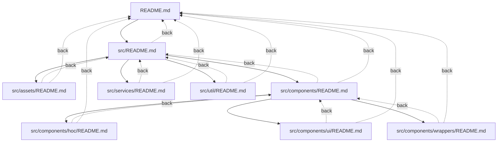
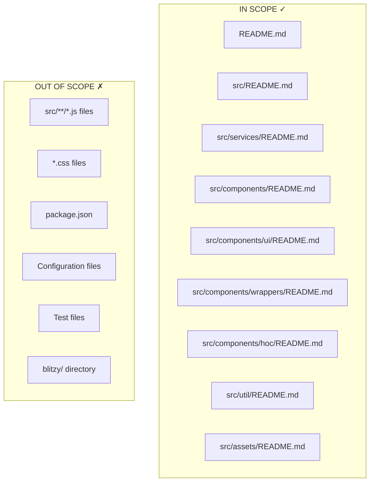

# Technical Specification

# 0. Agent Action Plan

## 0.1 Intent Clarification

### 0.1.1 Core Documentation Objective

Based on the provided requirements, the Blitzy platform understands that the documentation objective is to **improve the existing module-level README files** throughout the React Todo App repository, ensuring each module's documentation is enhanced with simple language and a natural conversational tone that facilitates easy onboarding for new developers.

**Request Categorization:** Update existing documentation (improvement/enhancement)

**Documentation Type:** Module-level README files with cross-references to main README

**Documented Requirements:**
- Improve README documentation for each module in the codebase
- Use simple language that is easy to understand
- Maintain a natural, conversational tone throughout
- Ensure all module READMEs reference back to the main README.md
- Focus on easy onboarding for new developers joining the project

**Implicit Documentation Needs Identified:**
- Ensure consistent navigation patterns across all module READMEs
- Simplify technical jargon in API descriptions and usage examples
- Add welcoming language for newcomers
- Verify all existing cross-references work correctly
- Improve readability of code examples with clearer explanations
- Add "Getting Started" tips where appropriate
- Ensure the documentation flow guides developers from main README through each module naturally

### 0.1.2 Special Instructions and Constraints

**User-Specified Directives:**
- "Use simple language" - Avoid overly technical jargon; explain concepts plainly
- "Natural tone of language" - Write conversationally as if guiding a colleague
- "Easy onboarding" - Documentation should help new developers understand the codebase quickly
- "Reference it back to main readme file" - All module READMEs must link back to the root README.md

**Template Requirements:**
- Follow the existing README structure patterns already established in the repository
- Maintain the navigation blockquote pattern: `> ← Back to [Parent](../README.md) | [Main README](../../README.md)`
- Preserve Mermaid diagrams where they add value
- Keep tables for API references and component catalogs

**Style Preferences:**
- **Tone:** Friendly, approachable, and welcoming
- **Structure:** Progressive disclosure (simple overview first, then details)
- **Depth:** Comprehensive enough for onboarding but not overwhelming
- **Format:** Markdown with consistent heading hierarchy

### 0.1.3 Technical Interpretation

These documentation requirements translate to the following technical documentation strategy:

- To **improve onboarding experience**, we will update all nine existing module README files with simpler language, friendlier tone, and clearer explanations
- To **enable natural navigation**, we will verify and enhance all back-reference links to main README.md
- To **improve readability**, we will simplify code examples and add contextual explanations
- To **maintain consistency**, we will ensure all READMEs follow the established template pattern
- To **enhance discoverability**, we will improve the Module Documentation table in the main README.md

### 0.1.4 Inferred Documentation Needs

Based on repository analysis:

| Module | Current Status | Improvement Opportunity |
|--------|---------------|------------------------|
| `src/README.md` | Well-structured with Mermaid diagram | Simplify technical language, add welcoming introduction |
| `src/services/README.md` | Comprehensive API docs | Make function descriptions more conversational |
| `src/components/README.md` | Good hierarchy diagram | Add friendlier overview, simplify data flow explanation |
| `src/components/ui/README.md` | Detailed prop tables | Add usage context, simplify technical terminology |
| `src/components/wrappers/README.md` | Complete state/action docs | Make state management concepts more accessible |
| `src/components/hoc/README.md` | HOC pattern explained | Demystify HOC concept for beginners |
| `src/util/README.md` | Function API documented | Add real-world context for each utility |
| `src/assets/README.md` | Asset catalog complete | Simplify CSS and locale explanations |
| `README.md` (main) | Setup and steps complete | Enhance Module Documentation section with warmer introduction |

Based on user journey: "New developers need a clear path from cloning the repo → understanding the structure → diving into specific modules → making contributions"


## 0.2 Documentation Discovery and Analysis

### 0.2.1 Existing Documentation Infrastructure Assessment

Repository analysis reveals a **well-established documentation structure** with 9 module-level README files organized hierarchically throughout the `src/` directory.

**Documentation Files Discovered:**

| Path | Purpose | Status |
|------|---------|--------|
| `README.md` | Project root - setup instructions, step-by-step branches, module index | EXISTS |
| `src/README.md` | Source directory overview, entry point documentation | EXISTS |
| `src/services/README.md` | Business logic services (todo, filter, mode) documentation | EXISTS |
| `src/components/README.md` | Component hierarchy overview with data flow explanation | EXISTS |
| `src/components/ui/README.md` | Presentational components catalog with props | EXISTS |
| `src/components/wrappers/README.md` | State management and event handling docs | EXISTS |
| `src/components/hoc/README.md` | Higher-order component pattern documentation | EXISTS |
| `src/util/README.md` | Utility functions documentation | EXISTS |
| `src/assets/README.md` | Static assets (images, styles, locale) docs | EXISTS |

**Current Documentation Framework:**
- Format: Markdown (`.md`)
- Diagram Tool: Mermaid (embedded in markdown)
- No external documentation generator (MkDocs, Docusaurus, etc.)
- Documentation rendered directly by GitHub

**Navigation Pattern Established:**

The following blockquote pattern is consistently used across all module READMEs:

`> ← Back to [Parent](../README.md) | [Main README](../../README.md)`

### 0.2.2 Repository Code Analysis for Documentation

**Search Patterns Used:**
- Documentation files: `**/README.md`
- Source modules: `src/**/*.js`
- Assets: `src/assets/**/*`

**Key Directories Examined:**

| Directory | Files | Documentation Need |
|-----------|-------|-------------------|
| `src/` | `index.js` | Entry point - covered in src/README.md |
| `src/services/` | `todo.js`, `filter.js`, `mode.js` | Business logic - well documented |
| `src/components/ui/` | 12 React components | Component catalog - documented with props |
| `src/components/wrappers/` | `App.js`, `StateProvider.js`, `KeyStrokeHandler.js` | State management - documented |
| `src/components/hoc/` | `wrapInputBox.js` | HOC pattern - documented |
| `src/util/` | `common.js` | Utility functions - documented |
| `src/assets/` | images, styles, text | Static resources - documented |

**Related Documentation Found:**
- `blitzy/documentation/Project Guide.md` - Sprint documentation (89% completion reported)
- `blitzy/documentation/Technical Specifications.md` - Requirements specification

### 0.2.3 Documentation Quality Assessment

**Strengths Identified:**
- Consistent navigation blockquotes linking back to parent and main README
- Mermaid diagrams for folder structure and component hierarchy
- API tables with parameters, return types, and descriptions
- Usage examples with code snippets
- Related links section in each README

**Areas for Improvement:**
- **Language complexity** - Some descriptions use technical jargon
- **Tone** - Currently neutral/formal; could be more welcoming
- **Onboarding focus** - Documentation is reference-style; could add more guidance
- **Accessibility** - Some concepts assume prior React knowledge

### 0.2.4 Web Search Research Findings

Best practices for module-level README documentation for onboarding:

- Hierarchy of README files across folder structure is a common and recommended practice
- Root README should link to each module-level README for easy navigation
- Well-documented projects reduce the learning curve for newcomers
- Tables of contents provide a bird's-eye view of content

**Recommendations Applied:**
- Maintain hierarchical README structure with clear parent-child links
- Use simple, question-based headings where appropriate
- Provide quick-start context before deep technical details
- Include progressive disclosure (simple → complex)


## 0.3 Documentation Scope Analysis

### 0.3.1 Code-to-Documentation Mapping

**Modules Requiring Documentation Updates:**

| Module Path | Current Doc | Improvement Focus |
|-------------|-------------|-------------------|
| `README.md` | Complete | Enhance Module Documentation section with warmer onboarding language |
| `src/README.md` | Complete | Simplify overview, add beginner-friendly introduction |
| `src/services/README.md` | Complete | Make API descriptions more conversational |
| `src/components/README.md` | Complete | Simplify component hierarchy explanation |
| `src/components/ui/README.md` | Complete | Add contextual usage tips, simplify props descriptions |
| `src/components/wrappers/README.md` | Complete | Demystify state management concepts |
| `src/components/hoc/README.md` | Complete | Explain HOC pattern in plain language |
| `src/util/README.md` | Complete | Add real-world context for utilities |
| `src/assets/README.md` | Complete | Simplify asset management explanations |

**Services Documentation Analysis:**

| Service File | Public APIs | Documentation Status | Improvement Needed |
|--------------|-------------|---------------------|-------------------|
| `src/services/todo.js` | `getAll()`, `getItemById()`, `updateStatus()`, `addToList()` | Documented with tables | Simplify parameter descriptions |
| `src/services/filter.js` | `applyFilter()`, `search()`, `getOptions()` | Documented with constants | Add plain-English explanations |
| `src/services/mode.js` | `getNextModeByKey()` | State diagram included | Simplify keyboard mapping table |

**Components Documentation Analysis:**

| Component Layer | Files | Current Coverage | Improvement Focus |
|-----------------|-------|-----------------|-------------------|
| UI Components | 12 files | Props table complete | Add "when to use" context |
| Wrappers | 3 files | State/actions documented | Explain state flow simply |
| HOC | 1 file | Pattern explained | Make HOC concept accessible |

### 0.3.2 Documentation Gap Analysis

Given the requirements and repository analysis, documentation gaps include:

**Tone and Accessibility Gaps:**
- Current language is technically accurate but formal
- Assumes familiarity with React patterns (HOC, state management)
- Missing "welcome" or "getting started" context in module READMEs
- Code examples lack beginner-friendly explanations

**Navigation Gaps:**
- All back-references exist but could be more prominent
- Main README Module Documentation table could be more inviting
- No suggested reading order for newcomers

**Content Gaps:**
- No "Why does this exist?" explanations for modules
- Missing "Quick Start" tips per module
- No troubleshooting hints for common confusion points

### 0.3.3 Module-by-Module Update Plan

**README.md (Main):**
- Add welcoming introduction to Module Documentation section
- Include suggested reading order for new developers
- Enhance module descriptions with friendlier language

**src/README.md:**
- Add "What you'll find here" introduction
- Simplify the "Entry Point" explanation
- Make the Modules table more inviting

**src/services/README.md:**
- Add "What are Services?" beginner section
- Simplify function parameter descriptions
- Add "When would I use this?" context

**src/components/README.md:**
- Add "How Components Work Together" overview
- Simplify the Data Flow explanation
- Make the organization description more accessible

**src/components/ui/README.md:**
- Add "What are UI Components?" introduction
- Simplify props descriptions with plain language
- Include "Getting Started" usage tips

**src/components/wrappers/README.md:**
- Add "What are Wrapper Components?" section
- Explain state management in simple terms
- Demystify the StateProvider pattern

**src/components/hoc/README.md:**
- Add "What is a Higher-Order Component?" introduction
- Explain the pattern with everyday analogies
- Simplify the compose pattern explanation

**src/util/README.md:**
- Add "What are Utilities?" introduction
- Explain each function with real-world context
- Clarify the intentional typo (`stringInclues`)

**src/assets/README.md:**
- Add "What's in the Assets folder?" introduction
- Simplify the CSS class explanations
- Make locale constants easier to understand


## 0.4 Documentation Implementation Design

### 0.4.1 Documentation Structure Planning

The existing documentation hierarchy will be preserved and enhanced:

```
project-root/
├── README.md                          (enhanced Module Documentation section)
└── src/
    ├── README.md                      (improved overview with welcoming tone)
    ├── assets/
    │   └── README.md                  (simplified asset explanations)
    ├── components/
    │   ├── README.md                  (accessible component overview)
    │   ├── hoc/
    │   │   └── README.md              (demystified HOC pattern)
    │   ├── ui/
    │   │   └── README.md              (friendlier component catalog)
    │   └── wrappers/
    │       └── README.md              (simplified state management docs)
    ├── services/
    │   └── README.md                  (conversational API documentation)
    └── util/
        └── README.md                  (plain-language utility docs)
```

### 0.4.2 Content Generation Strategy

**Information Extraction Approach:**
- Review existing README content and identify technical jargon to simplify
- Analyze code comments and function signatures for context
- Extract example patterns from existing code snippets
- Reference test patterns for real-world usage examples

**Template Application:**

Each module README will follow this enhanced structure:

1. **Navigation Blockquote** - Back links to parent and main README
2. **Friendly Introduction** - "What you'll find here" or "What is this?"
3. **Overview** - Simplified explanation of the module's purpose
4. **Contents Table** - Clear listing of files and their purposes
5. **Detailed Sections** - API references with simplified descriptions
6. **Usage Examples** - Code snippets with beginner-friendly comments
7. **Related Links** - Clear navigation to connected modules

**Documentation Standards:**
- Heading hierarchy: `#` for title, `##` for sections, `###` for sub-sections
- Mermaid diagrams preserved with simplified annotations
- Code examples with inline comments explaining key points
- Tables for structured API information
- Consistent terminology using plain English

### 0.4.3 Tone and Language Guidelines

**Writing Style:**
- Use "you" and "we" to create a conversational feel
- Prefer active voice over passive voice
- Explain WHY before HOW
- Avoid or define technical jargon on first use
- Use everyday analogies where helpful

**Example Transformations:**

| Current (Formal) | Improved (Friendly) |
|------------------|---------------------|
| "This module exports three utility functions" | "You'll find three handy helper functions here" |
| "The HOC enhances input components" | "This helper wraps your input to handle typing and Enter key presses automatically" |
| "Implements a state machine for mode transitions" | "Think of this like a light switch that remembers what mode you're in" |
| "Receives data and callbacks through props" | "Gets the information and actions it needs passed down from its parent" |

### 0.4.4 Diagram and Visual Strategy

**Existing Mermaid Diagrams to Preserve:**
- Folder structure flowchart in `src/README.md`
- Component hierarchy in `src/components/README.md`
- Service relationships in `src/services/README.md`
- State diagram in `src/services/README.md` (mode transitions)
- State flow sequence in `src/components/wrappers/README.md`

**Diagram Enhancement:**
- Add simplified labels where technical terms appear
- Ensure diagram annotations use plain language
- Preserve existing structural diagrams (well-received)

### 0.4.5 Cross-Reference Strategy

**Primary Navigation Pattern:**

All module READMEs include:
- Link back to immediate parent README
- Link back to main project README

**Enhanced Navigation:**
- Main README will suggest a reading order
- Related sections in each README will guide to next logical module
- "Where to go next" suggestions at the end of key sections

**Link Map:**


```mermaid
flowchart TD
    MAIN[README.md] --> SRC[src/README.md]
    SRC --> ASSETS[src/assets/README.md]
    SRC --> COMP[src/components/README.md]
    SRC --> SERV[src/services/README.md]
    SRC --> UTIL[src/util/README.md]
    COMP --> HOC[src/components/hoc/README.md]
    COMP --> UI[src/components/ui/README.md]
    COMP --> WRAP[src/components/wrappers/README.md]
    
    ASSETS -.->|back| SRC
    COMP -.->|back| SRC
    SERV -.->|back| SRC
    UTIL -.->|back| SRC
    HOC -.->|back| COMP
    UI -.->|back| COMP
    WRAP -.->|back| COMP
    
    SRC -.->|back| MAIN
    ASSETS -.->|back| MAIN
    COMP -.->|back| MAIN
    SERV -.->|back| MAIN
    UTIL -.->|back| MAIN
    HOC -.->|back| MAIN
    UI -.->|back| MAIN
    WRAP -.->|back| MAIN
```


## 0.5 Documentation File Transformation Mapping

### 0.5.1 File-by-File Documentation Plan

**Documentation Transformation Modes:**
- **UPDATE** - Improve existing documentation with simpler language and friendlier tone
- **REFERENCE** - Use as style guide for consistency

| Target Documentation File | Transformation | Source | Content/Changes |
|---------------------------|----------------|--------|-----------------|
| `README.md` | UPDATE | `README.md` | Enhance Module Documentation section with welcoming intro, add suggested reading order, improve module descriptions |
| `src/README.md` | UPDATE | `src/README.md` | Add friendly introduction, simplify entry point explanation, make modules table more inviting |
| `src/services/README.md` | UPDATE | `src/services/README.md` | Add "What are Services?" section, simplify API descriptions, add "When to use" context |
| `src/components/README.md` | UPDATE | `src/components/README.md` | Add accessible overview, simplify data flow explanation, improve organization descriptions |
| `src/components/ui/README.md` | UPDATE | `src/components/ui/README.md` | Add introduction, simplify props descriptions, include usage tips |
| `src/components/wrappers/README.md` | UPDATE | `src/components/wrappers/README.md` | Explain state management simply, demystify StateProvider, add beginner context |
| `src/components/hoc/README.md` | UPDATE | `src/components/hoc/README.md` | Add plain-English HOC explanation, use everyday analogies, simplify compose pattern |
| `src/util/README.md` | UPDATE | `src/util/README.md` | Add utilities introduction, explain functions in context, clarify naming |
| `src/assets/README.md` | UPDATE | `src/assets/README.md` | Add friendly introduction, simplify CSS explanations, clarify locale constants |

### 0.5.2 Documentation Files Update Detail

**README.md (Main Project README):**
- **Current:** Module Documentation table with technical descriptions
- **Enhancement:** Add welcoming introduction, suggested reading order, and friendlier descriptions

Sections to Update:
- Add paragraph before Module Documentation table with welcoming message
- Add "Where to Start" guidance for new developers
- Simplify module descriptions in the table

Source Citations: `README.md:51-67`

---

**src/README.md (Source Overview):**
- **Current:** Technical overview with entry point details
- **Enhancement:** Add "What you'll find here" intro, simplify technical language

Sections to Update:
- Add welcoming introduction after title
- Simplify "Entry Point" section with friendlier language
- Make Modules table descriptions more accessible

Source Citations: `src/README.md:1-85`

---

**src/services/README.md:**
- **Current:** Comprehensive API reference with tables
- **Enhancement:** Add beginner context, simplify descriptions

Sections to Update:
- Add "What are Services?" introduction
- Simplify function descriptions in API tables
- Add "When would I use this?" tips
- Make code examples more beginner-friendly

Source Citations: `src/services/README.md:1-216`

---

**src/components/README.md:**
- **Current:** Component hierarchy with Mermaid diagram
- **Enhancement:** Add accessible introduction, simplify data flow

Sections to Update:
- Add "How do the components work together?" introduction
- Simplify Data Flow section for beginners
- Make organization descriptions friendlier

Source Citations: `src/components/README.md:1-148`

---

**src/components/ui/README.md:**
- **Current:** Detailed component catalog with props
- **Enhancement:** Add context, simplify terminology

Sections to Update:
- Add "What are UI Components?" introduction
- Simplify props descriptions in Component Catalog
- Add usage context for each pattern section

Source Citations: `src/components/ui/README.md:1-95`

---

**src/components/wrappers/README.md:**
- **Current:** State management and event docs
- **Enhancement:** Demystify concepts for newcomers

Sections to Update:
- Add "What are Wrapper Components?" introduction
- Simplify state management explanations
- Make StateProvider and KeyStrokeHandler descriptions accessible

Source Citations: `src/components/wrappers/README.md:1-150`

---

**src/components/hoc/README.md:**
- **Current:** HOC pattern with recompose details
- **Enhancement:** Explain pattern in plain language

Sections to Update:
- Add plain-English "What is a Higher-Order Component?" section
- Use everyday analogies for the wrapper pattern
- Simplify the compose function explanation

Source Citations: `src/components/hoc/README.md:1-105`

---

**src/util/README.md:**
- **Current:** Utility function documentation
- **Enhancement:** Add context and clarify naming

Sections to Update:
- Add "What are Utilities?" friendly introduction
- Explain each function with real-world context
- Add note explaining the `stringInclues` typo upfront

Source Citations: `src/util/README.md:1-115`

---

**src/assets/README.md:**
- **Current:** Asset catalog with detailed structure
- **Enhancement:** Simplify explanations

Sections to Update:
- Add "What's in the Assets folder?" introduction
- Simplify CSS class descriptions
- Make locale constants easier to understand

Source Citations: `src/assets/README.md:1-104`

### 0.5.3 Cross-Documentation Dependencies

**Shared Patterns:**
- Navigation blockquote format: `> ← Back to [Parent](path) | [Main README](path)`
- Section heading style: `## Section Name`
- Table format for APIs, props, and file listings

**Navigation Links Requiring Verification:**
- All 8 module READMEs link back to main README.md
- All nested READMEs link to immediate parent
- Related sections cross-link to sibling modules

**Main README Module Table Update:**
- Add welcoming paragraph before the table
- Update descriptions to be more inviting
- Ensure all module links are functional


## 0.6 Dependency Inventory

### 0.6.1 Documentation Dependencies

No external documentation tools are required for this documentation improvement task. The repository uses native Markdown rendered by GitHub.

**Documentation Tools (Already Configured):**

| Registry | Package Name | Version | Purpose |
|----------|--------------|---------|---------|
| Native | Markdown | N/A | Documentation format (GitHub-flavored) |
| Native | Mermaid | N/A | Diagrams embedded in Markdown (GitHub renders natively) |

**Project Dependencies (For Context):**

| Registry | Package Name | Version | Documentation Impact |
|----------|--------------|---------|---------------------|
| npm | react | ^15.4.2 | Referenced in component documentation |
| npm | react-dom | ^15.4.2 | Referenced in entry point documentation |
| npm | react-scripts | 0.9.0 | Build system referenced in README |
| npm | bootstrap | ^3.4.1 | CSS framework mentioned in assets docs |
| npm | recompose | ^0.23.5 | Referenced in HOC documentation |
| npm | keycode-js | ^0.0.4 | Referenced in mode service docs |
| npm | immutability-helper | ^2.1.1 | Referenced in todo service docs |

### 0.6.2 Documentation Reference Updates

**Internal Link Verification Required:**

| Documentation File | Links to Verify |
|--------------------|-----------------|
| `README.md` | 8 module README links in Module Documentation table |
| `src/README.md` | 4 module links + 1 parent link |
| `src/services/README.md` | 3 related links + 2 navigation links |
| `src/components/README.md` | 6 related links + 2 navigation links |
| `src/components/ui/README.md` | 2 related links + 2 navigation links |
| `src/components/wrappers/README.md` | 4 related links + 2 navigation links |
| `src/components/hoc/README.md` | 3 related links + 2 navigation links |
| `src/util/README.md` | 3 related links + 2 navigation links |
| `src/assets/README.md` | 2 related links + 2 navigation links |

**Link Pattern Consistency:**

All links use relative paths, which is the correct pattern for GitHub-rendered documentation:
- Parent links: `../README.md`
- Main README: `../../README.md` (varies by depth)
- Sibling modules: `../sibling/README.md`

### 0.6.3 Build and Runtime Dependencies

**For Documentation Verification:**

| Command | Purpose | Expected Output |
|---------|---------|-----------------|
| `npm install --legacy-peer-deps` | Install project dependencies | ~842 packages installed |
| `npm run build` | Verify project builds | Build folder created successfully |
| `npm start` | Run development server | App available at localhost:3000 |

**No Documentation Build Required:**
- Documentation is pure Markdown
- Rendered automatically by GitHub
- No static site generator or build step needed


## 0.7 Coverage and Quality Targets

### 0.7.1 Documentation Coverage Metrics

**Current Coverage Analysis:**

| Coverage Category | Current | Target | Status |
|-------------------|---------|--------|--------|
| Module READMEs present | 9/9 (100%) | 9/9 (100%) | ✓ Complete |
| Back-references to main README | 9/9 (100%) | 9/9 (100%) | ✓ Complete |
| Mermaid diagrams | 4 diagrams | 4 diagrams | ✓ Complete |
| API documentation | 100% | 100% | ✓ Complete |
| Simple language usage | ~40% | 100% | Needs improvement |
| Friendly tone | ~30% | 100% | Needs improvement |
| Onboarding guidance | ~20% | 100% | Needs improvement |

**Coverage Gaps to Address:**

| Module | Current Friendliness | Target | Improvement Area |
|--------|---------------------|--------|------------------|
| `README.md` | 60% | 100% | Add welcoming introduction, reading order |
| `src/README.md` | 50% | 100% | Simplify technical overview |
| `src/services/README.md` | 40% | 100% | Conversational API descriptions |
| `src/components/README.md` | 45% | 100% | Accessible hierarchy explanation |
| `src/components/ui/README.md` | 40% | 100% | Beginner-friendly props docs |
| `src/components/wrappers/README.md` | 35% | 100% | Demystify state management |
| `src/components/hoc/README.md` | 30% | 100% | Plain-language HOC explanation |
| `src/util/README.md` | 50% | 100% | Context for utilities |
| `src/assets/README.md` | 55% | 100% | Simpler asset explanations |

### 0.7.2 Documentation Quality Criteria

**Completeness Requirements:**
- Every README has a welcoming introduction
- All technical terms are explained in simple language
- All API references include "when to use" context
- All code examples have beginner-friendly comments
- All navigation links work correctly
- Reading flow guides developers naturally through modules

**Accuracy Validation:**
- All code examples must reflect actual codebase
- All file paths must be accurate
- All API signatures must match source code
- All diagrams must reflect current architecture
- All relative links must resolve correctly

**Clarity Standards:**
- Use "you" and "we" for conversational tone
- Prefer active voice over passive
- Explain "why" before "how"
- Define technical terms on first use
- Use everyday analogies for complex concepts
- Keep sentences concise and direct

**Maintainability:**
- Follow consistent template structure
- Use relative links for portability
- Keep Mermaid diagrams simple and labeled
- Include source file references for traceability

### 0.7.3 Example and Diagram Requirements

**Example Requirements:**

| Module | Current Examples | Enhancement Needed |
|--------|------------------|-------------------|
| `src/services/README.md` | API usage examples | Add inline comments explaining each line |
| `src/components/ui/README.md` | Props spreading, HOC, rendering | Add "why we do this" explanations |
| `src/components/wrappers/README.md` | State flow, nested components | Simplify with beginner context |
| `src/components/hoc/README.md` | Compose pattern example | Add step-by-step explanation |
| `src/util/README.md` | Function usage examples | Add real-world use case context |

**Diagram Requirements:**

| Diagram | Location | Enhancement |
|---------|----------|-------------|
| Folder structure flowchart | `src/README.md` | Preserve as-is (clear) |
| Component hierarchy | `src/components/README.md` | Preserve, simplify annotations |
| Service relationships | `src/services/README.md` | Preserve, add legend if needed |
| Mode state diagram | `src/services/README.md` | Preserve (excellent visualization) |
| State flow sequence | `src/components/wrappers/README.md` | Preserve, simplify labels |

### 0.7.4 Quality Validation Checklist

- [ ] All 9 README files updated with friendly tone
- [ ] All introductions added and welcoming
- [ ] All technical jargon simplified or explained
- [ ] All navigation links verified working
- [ ] All code examples have explanatory comments
- [ ] All API descriptions are conversational
- [ ] Main README has suggested reading order
- [ ] Diagrams preserved with clear labels
- [ ] Consistent template structure across all files
- [ ] Project builds successfully after changes


## 0.8 Scope Boundaries

### 0.8.1 Exhaustively In Scope

**Documentation Files to Update:**
- `README.md` - Main project README
- `src/README.md` - Source directory overview
- `src/services/README.md` - Business logic services documentation
- `src/components/README.md` - Component hierarchy overview
- `src/components/ui/README.md` - UI components catalog
- `src/components/wrappers/README.md` - State management documentation
- `src/components/hoc/README.md` - Higher-order component documentation
- `src/util/README.md` - Utilities documentation
- `src/assets/README.md` - Assets documentation

**Documentation Improvements In Scope:**
- Adding welcoming introductions to all module READMEs
- Simplifying technical language throughout
- Converting formal tone to conversational tone
- Adding "what is this?" context for each module
- Improving navigation with suggested reading order
- Enhancing code examples with beginner-friendly comments
- Verifying and maintaining back-references to main README
- Preserving and potentially simplifying Mermaid diagram labels

**Content Types In Scope:**
- README.md files only
- Markdown formatting
- Mermaid diagram annotations
- Navigation blockquotes
- Code example comments
- Table descriptions
- Section headings and content

### 0.8.2 Explicitly Out of Scope

**Source Code Modifications:**
- No changes to JavaScript source files (`*.js`)
- No changes to CSS stylesheets
- No changes to SVG assets
- No changes to locale files
- No modifications to `package.json`
- No modifications to configuration files

**Test Files:**
- No test file modifications
- No test documentation additions

**New Documentation:**
- No creation of new README files (all modules already have READMEs)
- No addition of new documentation formats (e.g., JSDoc, TypeDoc)
- No external documentation site setup (MkDocs, Docusaurus)

**Infrastructure:**
- No CI/CD documentation pipeline setup
- No documentation deployment configuration
- No automated documentation generation

**Explicitly Excluded:**
- `blitzy/` directory - Sprint documentation (separate from module docs)
- `public/` directory - No documentation updates needed
- `node_modules/` - Third-party packages
- Source code comments or docstrings
- Any files not ending in `.md`

### 0.8.3 Scope Summary Diagram


```mermaid
flowchart TB
    subgraph InScope["IN SCOPE ✓"]
        README[README.md]
        SRCREADME[src/README.md]
        SERVREADME[src/services/README.md]
        COMPREADME[src/components/README.md]
        UIREADME[src/components/ui/README.md]
        WRAPREADME[src/components/wrappers/README.md]
        HOCREADME[src/components/hoc/README.md]
        UTILREADME[src/util/README.md]
        ASSETREADME[src/assets/README.md]
    end
    
    subgraph OutOfScope["OUT OF SCOPE ✗"]
        SRCFILES[src/**/*.js files]
        CSSFILES[*.css files]
        PKGJSON[package.json]
        CONFIGS[Configuration files]
        TESTS[Test files]
        BLITZY[blitzy/ directory]
    end
```

### 0.8.4 Boundary Validation

| Item | In Scope? | Reason |
|------|-----------|--------|
| `README.md` content updates | ✓ Yes | Module documentation improvement |
| `src/services/*.js` modifications | ✗ No | Source code not in scope |
| Adding JSDoc comments | ✗ No | Source code comments not requested |
| Creating `docs/` folder | ✗ No | No new structure requested |
| Updating Mermaid diagrams | ✓ Yes | Annotation improvements only |
| Adding new README files | ✗ No | All modules already documented |
| Improving navigation links | ✓ Yes | Referenced in requirements |
| Changing `package.json` scripts | ✗ No | Build configuration not in scope |
| Adding documentation tests | ✗ No | Not requested |


## 0.9 Execution Parameters

### 0.9.1 Documentation-Specific Instructions

**Documentation Format:**
- Format: Markdown (GitHub-flavored)
- Extension: `.md`
- Encoding: UTF-8
- Line endings: LF (Unix-style per `.editorconfig`)

**Build Commands:**

| Command | Purpose | Notes |
|---------|---------|-------|
| `npm install --legacy-peer-deps` | Install dependencies | Required for project verification |
| `npm run build` | Build production bundle | Verifies project integrity |
| `npm start` | Start development server | For manual testing |

**Documentation Validation Commands:**

| Validation | Command/Method | Purpose |
|------------|----------------|---------|
| Link verification | Manual review | Ensure all relative links resolve |
| Markdown syntax | GitHub preview | Verify rendering on GitHub |
| Mermaid diagrams | GitHub preview | Confirm diagrams render correctly |
| Build verification | `npm run build` | Ensure docs don't break build |

### 0.9.2 Style Guide Requirements

**Heading Hierarchy:**
- `#` - README title only
- `##` - Main sections
- `###` - Sub-sections
- `####` - Details (used sparingly)

**Navigation Blockquote Format:**
```
> ← Back to [Parent Title](../README.md) | [Main README](../../README.md)
```

**Code Block Format:**
- Use fenced code blocks with language identifier
- Include inline comments for explanation
- Keep examples concise (2-10 lines)

**Table Format:**
- Use standard Markdown tables
- Include header row with column names
- Align pipes for readability

**Link Format:**
- Use relative paths for internal links
- Use descriptive link text (not "click here")
- Ensure consistent capitalization in link text

### 0.9.3 Writing Guidelines

**Tone Transformation Rules:**

| From (Formal) | To (Friendly) |
|---------------|---------------|
| "This module provides..." | "Here you'll find..." |
| "It is recommended to..." | "We suggest..." |
| "The following functions are exported..." | "You can use these functions..." |
| "Users should note that..." | "Keep in mind that..." |
| "See below for details" | "Let's look at the details" |

**Jargon Simplification:**

| Technical Term | Plain English |
|----------------|---------------|
| "Higher-Order Component" | "A helper that wraps your component to add extra features" |
| "State management" | "Keeping track of your app's data" |
| "Props" | "The information a component receives from its parent" |
| "Render" | "Display on screen" |
| "Side effects" | "Actions that affect things outside the function" |

### 0.9.4 Citation Requirements

**Source File References:**
- Reference source files when documenting APIs
- Format: `Source: src/path/to/file.js`
- Include in Related section or inline

**Example with Citation:**

> The `getAll()` function returns the initial todo list.
> 
> Source: `src/services/todo.js`

### 0.9.5 Verification Steps

**Pre-Submission Checklist:**
1. Run `npm install --legacy-peer-deps` - Must complete without errors
2. Run `npm run build` - Must complete successfully
3. Preview all README files in GitHub or markdown viewer
4. Click-test all navigation links
5. Verify all Mermaid diagrams render
6. Confirm consistent tone across all files
7. Validate no broken relative links

**Success Criteria:**
- All 9 README files updated
- All navigation links functional
- All content uses simple, conversational language
- All modules reference back to main README
- Project builds without errors


## 0.10 Special Instructions for Documentation

### 0.10.1 User-Specified Requirements

Based on the provided requirements, the following special instructions apply:

**Language and Tone:**
- **"Use simple language"** - All documentation must be written in plain English, avoiding technical jargon or explaining it when first used
- **"Natural tone of language"** - Write as if explaining to a colleague in conversation, using "you" and "we"
- **"Easy onboarding"** - Focus on helping new developers understand the codebase quickly

**Navigation:**
- **"Reference it back to main readme file"** - Every module README must include navigation back to the root README.md
- Maintain the existing blockquote navigation pattern at the top of each README

### 0.10.2 Critical Implementation Guidelines

**Preserve What Works:**
- Keep all existing Mermaid diagrams (they're well-designed)
- Preserve the navigation blockquote pattern
- Maintain the table structures for APIs and components
- Keep the Related sections at the end of each README

**Enhance for Accessibility:**
- Add friendly introductions to every README
- Explain "what" and "why" before "how"
- Include context for who would use each module
- Add inline comments to code examples

**Consistency Rules:**
- Use the same greeting style in all introductions
- Follow consistent heading hierarchy
- Maintain parallel structure in similar sections
- Use the same terminology for the same concepts

### 0.10.3 Onboarding Focus Areas

**For New Developers:**
- Main README: Add "Where to Start" guidance
- Each module README: Add "What you'll find here" intro
- Services: Explain when each function is useful
- Components: Clarify the component hierarchy simply
- HOC: Demystify the pattern with analogies
- Utilities: Provide real-world context

**Progressive Disclosure:**
1. Start with simple overview (what is this?)
2. Move to structure (what's inside?)
3. Then details (how does it work?)
4. End with connections (where to go next?)

### 0.10.4 Quality Assurance Directives

**Before Finalizing Each README:**
- [ ] Introduction is welcoming and clear
- [ ] Technical terms are explained simply
- [ ] Code examples have helpful comments
- [ ] Navigation links work correctly
- [ ] Tone is conversational throughout
- [ ] Content flows logically
- [ ] No leftover formal language

**Final Verification:**
- [ ] All 9 README files pass quality check
- [ ] Main README has clear module guidance
- [ ] Back-references are consistent
- [ ] Project builds successfully
- [ ] Documentation tells a cohesive story

### 0.10.5 Specific Update Priorities

**High Priority (Core Onboarding Path):**
1. `README.md` - First impression for new developers
2. `src/README.md` - Entry to source code understanding
3. `src/components/README.md` - Key to understanding UI layer
4. `src/services/README.md` - Business logic entry point

**Medium Priority (Deeper Understanding):**
5. `src/components/wrappers/README.md` - State management clarity
6. `src/components/ui/README.md` - Component catalog access
7. `src/components/hoc/README.md` - Advanced pattern understanding

**Standard Priority (Supporting Documentation):**
8. `src/util/README.md` - Helper functions context
9. `src/assets/README.md` - Asset organization clarity

### 0.10.6 Example Transformations

**Main README Enhancement Example:**

Current Module Documentation section leads with a table. Enhanced version adds:

> **Module Documentation**
> 
> Ready to explore the codebase? We've documented each part of the app to help you find your way around. Start with the Source Code overview, then dive into whichever area interests you most.
> 
> **Suggested reading order for newcomers:**
> 1. Start with [Source Code](src/README.md) for the big picture
> 2. Explore [Components](src/components/README.md) to see how the UI is built
> 3. Check out [Services](src/services/README.md) for the business logic

**Module Introduction Example:**

Current `src/services/README.md` starts with technical description. Enhanced version:

> # Services
> 
> > ← Back to [src](../README.md) | [Main README](../../README.md)
> 
> ## What You'll Find Here
> 
> This is where the app's brain lives! Services handle all the logic that isn't about how things look on screen. Think of them as helpful assistants that manage your todo items, filter your lists, and remember what mode you're in.
> 
> You don't need to know React to understand these files—they're just plain JavaScript doing useful work.


