# Technical Specification

# 1. Introduction

This section establishes the purpose, scope, and context of the **react-todo-app** Technical Specification. It provides all stakeholders—workshop facilitators, self-paced learners, onboarding developers, and documentation contributors—with a definitive reference for understanding the system's objectives, architecture, capabilities, and boundaries.

---

## 1.1 Executive Summary

### 1.1.1 Project Overview

**react-todo-app** (version `0.1.0`) is a private, non-distributable educational single-page application (SPA) built on **React 15.4.2**. The project delivers a step-by-step workshop curriculum that teaches core React patterns through the incremental construction of a fully functional todo list application. The curriculum is organized across **16 progressive Git branches** (`step-0` through `step-15`), each representing a distinct pedagogical milestone—from initial Create React App (CRA) scaffolding and JSX introduction, through component extraction, stateful behavior, service refactoring, and final application assembly.

The project is hosted at `https://github.com/kabirbaidhya/react-todo-app.git` and is accompanied by external workshop slides published at `https://speakerdeck.com/kabirbaidhya/frontend-development-with-react`. A prior Heroku-hosted demo (`https://simplest-react-todo-app.herokuapp.com/`) is no longer available following Heroku's discontinuation of its free tier in November 2022.

### 1.1.2 Core Problem Statement

Front-end developers learning React require a structured, hands-on curriculum that isolates and teaches individual React concepts in a progressive, additive manner. Traditional documentation and tutorials often present the final state of an application without exposing the incremental design decisions that shape its architecture. **react-todo-app** solves this problem by codifying a complete learning path through version-controlled branches, enabling learners to trace the evolution of a React application from an empty scaffold to a fully featured SPA employing pre-Hooks, pre-Context API patterns intentional to the React 15.x era.

### 1.1.3 Key Stakeholders and Users

| Stakeholder Group | Role | Primary Interaction |
|---|---|---|
| **Workshop Participants** | Primary learners in a facilitated classroom setting | Follow instructor-led progression through curriculum branches |
| **Self-Paced Learners** | Independent developers studying React 15.x patterns | Work through branches and documentation at their own pace |
| **Onboarding Developers** | New team members learning React fundamentals | Use the project as a structured introduction to React patterns |
| **Documentation Contributors** | Maintainers extending the documentation suite | Update, validate, and cross-reference the 11 README files |

### 1.1.4 Value Proposition and Business Impact

The project delivers value across four dimensions:

1. **Comprehensive System Orientation** — Provides a five-layer architecture blueprint with full traceability from nine cataloged features (F-001 through F-009) to their implementing source files, enabling learners to connect concepts to code.
2. **Custom State Management Pedagogy** — Documents and demonstrates a bespoke prop-injection state management pattern using `objectWithOnly()` and `wrapChildrenWith()`, teaching state architecture principles without the abstraction of third-party libraries.
3. **Boundary Enforcement** — Explicitly delineates supported capabilities versus excluded items, ensuring learners and contributors understand the intentional constraints of the system.
4. **Verified Build Integrity** — Maintains a production build baseline of **53.95 KB JS + 19.33 KB CSS** (gzipped) with **72 passing unit tests** (100% pass rate), providing measurable confidence in curriculum correctness.

---

## 1.2 System Overview

### 1.2.1 Project Context

#### Business Context and Market Positioning

**react-todo-app** occupies a niche in the educational tooling space: it is a **version-locked pedagogical artifact** that intentionally targets the React 15.x API surface. While the broader React ecosystem has evolved through versions 16, 17, 18, and 19—introducing Hooks, stable Context API, Concurrent Mode, and Server Components—this project deliberately remains on React 15.4.2 to teach the foundational class-component and higher-order component (HOC) patterns that underpin modern React development.

#### Technology Currency Assessment

| Technology | Version Used | Current Version | Status | Rationale |
|---|---|---|---|
| React | 15.4.2 | 19.x | Intentional lock | Pre-Hooks/Context curriculum target |
| Recompose | 0.23.5 | Deprecated (Oct 2018) | Accepted | Functional for React 15.x HOC patterns |
| Bootstrap | 3.4.1 | 5.3.x | CSS-only usage | Grid system and typography only; no JS plugins |
| react-scripts | 0.9.0 (pinned) | Maintenance mode | Accepted | Zero-config CRA boundary preserved |

#### Integration with Existing Landscape

The application operates as a **standalone client-side SPA** with no backend services, API integrations, or persistent storage layers. Its integration surface is limited to:

- **Browser DOM** — Mounts into `<div id="root">` via `ReactDOM.render()` in `src/index.js`
- **Bootstrap 3.4.1 CDN/bundle** — CSS-only import for responsive grid layout
- **Node.js 20.x build toolchain** — Development server, build compilation, and test execution via `react-scripts`

### 1.2.2 High-Level Description

#### Primary System Capabilities

The completed application provides a browser-based todo list manager with the following nine features:

| Feature ID | Capability | Description |
|---|---|---|
| F-001 | Todo Item Creation | Add new items via keyboard shortcut (`N`) and text input |
| F-002 | Status Toggling | Toggle completion state of individual items via checkbox |
| F-003 | Filtered Views | View items by status: All, Active, or Completed |
| F-004 | Text Search | Search items by text via keyboard shortcut (`/`) |
| F-005 | Keyboard Navigation | Navigate between modes using global keyboard shortcuts |
| F-006 | Responsive Layout | Bootstrap 3.4.1 grid-based responsive design |
| F-007 | Localized UI Text | Centralized English locale strings in `en_US.js` |
| F-008 | Centralized State | Custom prop-injection state management via `StateProvider.js` |
| F-009 | HOC Pattern | Recompose-based input enhancement via `wrapInputBox.js` |

#### Major System Components — Five-Layer Architecture

The application follows a strict five-layer architecture with unidirectional data flow. Each layer has clearly defined responsibilities and dependency rules.

```mermaid
flowchart TD
    subgraph L1["Layer 1 — Entry Point"]
        IndexJS["src/index.js"]
        IndexHTML["public/index.html"]
    end

    subgraph L2["Layer 2 — Component Layer"]
        subgraph Wrappers["Wrappers"]
            AppJS["App.js"]
            StateProvider["StateProvider.js"]
            KeyStroke["KeyStrokeHandler.js"]
        end
        subgraph UI["UI Components (12)"]
            TodoList["TodoList"]
            Header["Header"]
            InputWrapper["InputWrapper"]
            InputBox["InputBox"]
            SearchBox["SearchBox"]
            FilteredList["FilteredList"]
            TodoItem["TodoItem"]
            CheckBox["CheckBox"]
            Footer["Footer"]
            ButtonWrapper["ButtonWrapper"]
            FilterComp["Filter"]
            Info["Info"]
        end
        subgraph HOC["HOC"]
            WrapInput["wrapInputBox.js"]
        end
    end

    subgraph L3["Layer 3 — Service Layer"]
        TodoSvc["todo.js"]
        FilterSvc["filter.js"]
        ModeSvc["mode.js"]
    end

    subgraph L4["Layer 4 — Utility Layer"]
        CommonUtil["common.js"]
    end

    subgraph L5["Layer 5 — Asset Layer"]
        Images["images/ (SVG icons)"]
        Styles["style/index.css"]
        Locale["text/en_US.js"]
    end

    IndexJS --> AppJS
    AppJS --> StateProvider
    StateProvider --> KeyStroke
    KeyStroke --> TodoList
    TodoList --> UI
    WrapInput --> InputBox
    StateProvider --> L3
    TodoList --> L3
    Wrappers --> L4
    L2 --> L5
end
```

#### Core Technical Approach

The application employs a **custom state management pattern** as its central architectural innovation. In the absence of React's Context API (unavailable in React 15.x) and without relying on external state libraries (Redux, MobX), the system uses a composition of two utility functions—`objectWithOnly()` for selective method extraction and `wrapChildrenWith()` for React child cloning with prop injection—to propagate state and action callbacks from `StateProvider.js` down through the component tree.

The wrapper composition follows a strict nesting order:

**`App` → `StateProvider` → `KeyStrokeHandler` → `TodoList`**

- **`StateProvider`** maintains the single source of truth with four state fields (`query`, `mode`, `filter`, `list`) and five action methods (`addNew`, `changeFilter`, `changeStatus`, `changeMode`, `setSearchQuery`).
- **`KeyStrokeHandler`** captures global keyboard events via `window.keydown` and delegates mode transitions through the `mode.js` service FSM.
- **`TodoList`** applies a two-stage data pipeline: `search(applyFilter(list, filter), query)` to produce the rendered item set and computes active count via `applyFilter(list, FILTER_ACTIVE).length`.

All state mutations use **immutable update patterns** via `immutability-helper`'s `$set` command or `Array.prototype.concat()`, ensuring predictable state transitions.

### 1.2.3 Success Criteria

#### Measurable Objectives

| Objective | Target | Measurement Method |
|---|---|---|
| Build Integrity | Zero ESLint violations | `npm run build` exit code |
| Test Coverage | 72/72 tests passing (100%) | `npm test` via Jest |
| Bundle Size | 53.95 KB JS + 19.33 KB CSS (gzipped) | `npm run build` output |
| Documentation Coverage | 11 README files with Mermaid diagrams | File count and content audit |
| Code Style Compliance | EditorConfig rules enforced | 4-space indent, LF endings, UTF-8 |

#### Critical Success Factors

1. **Workshop Branch Preservation** — All 16 curriculum branches (`step-0` through `step-15`) must remain intact and independently buildable, preserving the progressive learning path.
2. **Service Layer Purity** — Service modules (`todo.js`, `filter.js`, `mode.js`) must contain no React imports, no DOM access, and no side effects, ensuring testability and separation of concerns.
3. **React 15.x API Compliance** — The codebase must use only APIs available in React 15.4.2: `React.Component`, `React.Children.map`, `React.cloneElement`, `React.createElement`, and `ReactDOM.render()`. No Hooks, no stable Context API, no `createRoot`, and no Fragments.
4. **Immutable State Discipline** — All state mutations must use declarative immutable patterns; direct state mutation is prohibited.
5. **CRA Zero-Config Boundary** — The project must not eject from Create React App; no custom Webpack, Babel, or ESLint configuration files are permitted.

#### Key Performance Indicators (KPIs)

| KPI | Baseline | Threshold |
|---|---|---|
| Unit Test Pass Rate | 100% (72/72) | 100% required |
| Build Execution | Clean (0 warnings) | Zero violations |
| Test Execution Time | 0.432 seconds | < 5 seconds |
| Production Bundle (JS) | 53.95 KB gzipped | Baseline match |
| Production Bundle (CSS) | 19.33 KB gzipped | Baseline match |
| npm Install | 842 packages | `--legacy-peer-deps` flag required |

---

## 1.3 Scope

### 1.3.1 In-Scope

#### 1.3.1.1 Core Features and Functionalities

**Must-Have Capabilities:**

All nine cataloged features (F-001 through F-009) are in scope. These features collectively deliver a complete client-side todo management experience with keyboard-driven interaction, filtered views, text search, and centralized state management using React 15.x-compatible patterns.

**Primary User Workflows:**

| Workflow | Trigger | Components Involved | Service Dependencies |
|---|---|---|---|
| Create Todo Item | Press `N` key → type text → press `Enter` | `KeyStrokeHandler`, `InputBox`, `wrapInputBox` | `mode.getNextModeByKey`, `todo.addToList` |
| Toggle Item Status | Click checkbox on a todo item | `CheckBox`, `TodoItem` | `todo.updateStatus` |
| Filter by Status | Click All / Active / Completed button | `Filter`, `Footer` | `filter.applyFilter`, `filter.getOptions` |
| Search Items | Press `/` key → type query | `KeyStrokeHandler`, `SearchBox` | `mode.getNextModeByKey`, `filter.search` |
| Cancel Mode | Press `Escape` key | `KeyStrokeHandler` | `mode.getNextModeByKey` |

**Essential Integrations:**

- **State Management Hub**: `StateProvider.js` — owns all application state and exposes five action methods via prop injection
- **Component Composition Root**: `App.js` — enforces strict wrapper nesting order
- **Data Pipeline**: `TodoList.js` — executes two-stage `search(applyFilter(list, filter), query)` transformation
- **Keyboard Event System**: `KeyStrokeHandler.js` — captures global shortcuts via `window.keydown` listener
- **Locale System**: `en_US.js` — centralizes user-facing strings (`MSG_NO_ITEMS`, `INFO_SHORTCUT_KEYS`, `INFO_CANCEL_SHORTCUT_KEY`)
- **CSS Theming**: `index.css` — single global stylesheet extending Bootstrap 3.4.1 base styles

#### 1.3.1.2 Implementation Boundaries

**System Boundaries:**

- Browser-only client-side SPA — no server-side component
- In-memory state only — no persistence layer
- Single-page mount to `<div id="root">` via `ReactDOM.render()`
- React 15.4.2 API surface exclusively

**Source File Inventory:**

| Layer | Category | Count | Files |
|---|---|---|---|
| Entry Point | Bootstrap | 2 | `src/index.js`, `public/index.html` |
| Components | Wrappers | 3 | `App.js`, `StateProvider.js`, `KeyStrokeHandler.js` |
| Components | UI | 12 | `TodoList`, `Header`, `InputWrapper`, `InputBox`, `SearchBox`, `FilteredList`, `TodoItem`, `CheckBox`, `Footer`, `ButtonWrapper`, `Filter`, `Info` |
| Components | HOC | 1 | `wrapInputBox.js` |
| Services | Logic | 3 | `todo.js`, `filter.js`, `mode.js` |
| Utilities | Helpers | 1 | `common.js` |
| Assets | Resources | 4 | `add.svg`, `search.svg`, `index.css`, `en_US.js` |
| Tests | Unit | 4 | `todo.test.js`, `filter.test.js`, `mode.test.js`, `common.test.js` |

**User Groups Covered:**

Workshop participants, self-paced learners, onboarding developers, and documentation contributors as defined in Section 1.1.3.

**Curriculum Coverage:**

The 16-step progressive curriculum (`step-0` through `step-15`) spans milestones including CRA setup, JSX introduction, component extraction, stateful behavior, item creation, filtering, service refactoring, completion toggling, design improvements, and final application assembly.

### 1.3.2 Out-of-Scope

The following capabilities, integrations, and use cases are **explicitly excluded** from the current system. These exclusions are intentional design decisions aligned with the project's educational objectives and React 15.x targeting.

#### 1.3.2.1 Excluded Features and Capabilities

| Excluded Item | Category | Rationale |
|---|---|---|
| React Version Upgrade (16+/17+/18+/19+) | Platform | Curriculum intentionally targets pre-Hooks, pre-Context patterns |
| State Management Libraries (Redux, MobX, Zustand) | Architecture | Custom `StateProvider` + `wrapChildrenWith` is the sole pedagogical approach |
| Todo Item Deletion | Feature | No delete functionality exists or is specified |
| Todo Item Editing | Feature | No inline edit mechanism for existing item text |
| User Authentication / Authorization | Security | No login, session, identity, or access control |
| Accessibility Compliance (ARIA, WCAG) | UX | No screen-reader or accessibility additions specified |
| Performance Optimization | Engineering | No memoization, virtualization, or lazy loading beyond existing implementation |

#### 1.3.2.2 Excluded Infrastructure and Integrations

| Excluded Item | Category | Rationale |
|---|---|---|
| Data Persistence Layer | Storage | All data is in-memory; resets on page refresh by design |
| Server-Side Rendering (SSR) | Deployment | Bootstraps exclusively via client-side `ReactDOM.render()` |
| CI/CD Pipeline Configuration | DevOps | No GitHub Actions, Jenkins, Travis CI, or equivalent |
| CRA Ejection | Build | Must operate within zero-config CRA boundary |
| Internationalization Framework | Localization | No i18n library or locale-switching beyond static `en_US.js` |
| Mobile / Native Application | Platform | No React Native or hybrid framework code |

#### 1.3.2.3 Future Phase Considerations

Items that may be addressed in future iterations but are not part of the current specification:

1. **Component-level and integration tests** — Currently only service and utility layers have unit test coverage (72 tests); no component rendering tests exist.
2. **npm audit vulnerability remediation** — 196 vulnerabilities (71 critical, 52 high) are documented as open, all stemming from legacy dependencies; a human assessment is required.
3. **Production deployment documentation** — Formal deployment guidance for hosting the built SPA is pending completion.
4. **Documentation cross-reference validation** — Final validation pass across all 11 README files is outstanding.

---

#### References

- `README.md` — Project overview, 16-step curriculum branches, setup instructions, and external resource links
- `package.json` — Dependency manifest (7 packages), npm scripts, project metadata, and repository URL
- `.editorconfig` — Code formatting rules (4-space indent, LF endings, UTF-8 encoding)
- `src/index.js` — Application entry point: `ReactDOM.render()`, CSS imports, root component mounting
- `src/README.md` — Source tree architecture documentation with Mermaid diagrams
- `public/index.html` — HTML5 shell with `<div id="root">` mount point
- `src/components/wrappers/` — Wrapper component implementations: `App.js`, `StateProvider.js`, `KeyStrokeHandler.js`
- `src/components/ui/` — 12 presentational UI components
- `src/components/hoc/` — `wrapInputBox.js` Recompose HOC implementation
- `src/services/` — Pure logic modules: `todo.js`, `filter.js`, `mode.js`
- `src/util/` — Utility module: `common.js` (`objectWithOnly`, `wrapChildrenWith`, `stringInclues`)
- `src/assets/` — Static assets: SVG icons, global CSS, locale constants
- `src/__tests__/` — Unit test suites: 4 test files covering services and utilities
- `blitzy/documentation/Technical Specifications.md` — Complete architectural blueprint, feature catalog, scope boundaries, and dependency analysis
- `blitzy/documentation/Project Guide.md` — Delivery status (89.7%), test results (72/72), compliance review, and risk assessment

# 2. Product Requirements

This section defines the complete set of product requirements for **react-todo-app** (v0.1.0), decomposed into nine discrete, testable features (F-001 through F-009). All requirements are grounded in the implemented source code and aligned with the scope boundaries established in Section 1.3. Requirements are versioned against the current `step-15` branch — the fully assembled application state.

---

## 2.1 Feature Catalog

### 2.1.1 Feature Summary

The application delivers nine cataloged features spanning four functional categories. Every feature listed below has been verified as fully implemented and tested (where applicable) against the `step-15` branch codebase.

| Feature ID | Feature Name | Category | Priority |
|---|---|---|---|
| F-001 | Todo Item Creation | Core Functionality | Critical |
| F-002 | Status Toggling | Core Functionality | Critical |
| F-003 | Filtered Views | Core Functionality | Critical |
| F-004 | Text Search | Core Functionality | High |
| F-005 | Keyboard Navigation | User Interaction | High |
| F-006 | Responsive Layout | UI / Visual Design | Medium |
| F-007 | Localized UI Text | Localization | Medium |
| F-008 | Centralized State Management | Architecture | Critical |
| F-009 | HOC Pattern | Architecture / Reuse | Medium |

All nine features carry a status of **Completed**. Priority levels reflect functional criticality: features rated Critical are foundational to the application's core value proposition, High features significantly enhance usability, and Medium features support non-functional or structural quality goals.

### 2.1.2 Core Functionality Features

#### F-001: Todo Item Creation

| Attribute | Detail |
|---|---|
| **Feature ID** | F-001 |
| **Category** | Core Functionality |
| **Priority** | Critical |
| **Status** | Completed |

**Overview:** Enables users to add new todo items to the in-memory list. A keyboard shortcut (`N`) activates create mode, rendering a text input field. On pressing `Enter`, the item is appended to the list with a default `completed: false` status and an auto-generated numeric ID.

**Business Value:** Delivers the foundational CRUD "Create" capability and demonstrates the complete data-flow cycle from user input through HOC-enhanced component, centralized state mutation, and immutable list operation — the pedagogical core of the workshop curriculum.

**User Benefits:** Rapid keyboard-driven item creation without mouse interaction. Input validation rejects empty text, preventing accidental blank items.

**Technical Context:** The `addNew(text)` action method in `src/components/wrappers/StateProvider.js` delegates to `addToList()` in `src/services/todo.js`, which constructs a new item via `Object.assign({id: getNextId()}, data)` and appends it immutably using `Array.prototype.concat()`. The input field is enhanced by the Recompose HOC in `src/components/hoc/wrapInputBox.js`, which manages controlled input state and Enter-key submission logic.

**Dependencies:**

- **Prerequisite Features:** F-005 (Keyboard Navigation) for `N`-key mode activation; F-008 (Centralized State) for state mutation; F-009 (HOC Pattern) for input enhancement
- **System Dependencies:** `src/services/todo.js` (addToList, getNextId), `src/services/mode.js` (MODE_CREATE constant)
- **External Dependencies:** `recompose` ^0.23.5 (HOC composition), `keycode-js` ^0.0.4 (KEY_RETURN constant)
- **Integration Requirements:** `StateProvider` must expose `addNew` as an action method; `InputWrapper` must conditionally render `InputBox` when mode equals `MODE_CREATE`

---

#### F-002: Status Toggling

| Attribute | Detail |
|---|---|
| **Feature ID** | F-002 |
| **Category** | Core Functionality |
| **Priority** | Critical |
| **Status** | Completed |

**Overview:** Allows users to toggle the completion status of any individual todo item via a checkbox control. The state update is performed immutably using `immutability-helper`.

**Business Value:** Delivers the "Update" capability of task management and demonstrates immutable state updates with a third-party utility — a key curriculum objective showing how to avoid direct array mutation in React.

**User Benefits:** Single-click toggling with immediate visual feedback via the checkbox component's local state mirror.

**Technical Context:** The `changeStatus(itemId, completed)` action in `src/components/wrappers/StateProvider.js` delegates to `updateStatus()` in `src/services/todo.js`, which locates the target item by `findIndex` and applies `immutability-helper`'s `update()` with the `$set` command to produce a new array with the updated item.

**Dependencies:**

- **Prerequisite Features:** F-008 (Centralized State) for state propagation
- **System Dependencies:** `src/services/todo.js` (updateStatus)
- **External Dependencies:** `immutability-helper` ^2.1.1
- **Integration Requirements:** `TodoItem` component must receive `changeStatus` action and item `data` via prop drilling from `StateProvider` through `TodoList` and `FilteredList`

---

#### F-003: Filtered Views

| Attribute | Detail |
|---|---|
| **Feature ID** | F-003 |
| **Category** | Core Functionality |
| **Priority** | Critical |
| **Status** | Completed |

**Overview:** Provides three filter modes — All, Active, and Completed — enabling users to view subsets of the todo list by completion status. The active item count is computed and displayed independently of the selected filter.

**Business Value:** Enables focused task triage by allowing users to isolate pending or completed work. Demonstrates pure-function filter logic in an isolated service module, reinforcing separation of concerns.

**User Benefits:** One-click access to task subsets with a persistent visual indicator of the currently active filter and a count of remaining active items.

**Technical Context:** `src/services/filter.js` exports three filter constants (`FILTER_ALL`, `FILTER_ACTIVE`, `FILTER_COMPLETED`), the `applyFilter(list, filter)` function (a `switch`-based pure function), and `getOptions()` for UI label generation. The `TodoList` component in `src/components/ui/TodoList.js` applies a two-stage data pipeline: `search(applyFilter(list, filter), query)`, and computes the active count via `applyFilter(list, FILTER_ACTIVE).length`.

**Dependencies:**

- **Prerequisite Features:** F-008 (Centralized State) for filter state persistence
- **System Dependencies:** `src/services/filter.js` (applyFilter, getOptions, constants)
- **External Dependencies:** None
- **Integration Requirements:** `StateProvider` must maintain `filter` state field and expose `changeFilter` action; `Footer` component must render `Filter` component with options from `getOptions()`

---

#### F-004: Text Search

| Attribute | Detail |
|---|---|
| **Feature ID** | F-004 |
| **Category** | Core Functionality |
| **Priority** | High |
| **Status** | Completed |

**Overview:** Provides real-time text search filtering across todo item text content. Activated via the `/` keyboard shortcut, search results update as the user types with case-insensitive substring matching.

**Business Value:** Enables rapid item lookup and demonstrates real-time reactive filtering via controlled component state propagation through the data pipeline.

**User Benefits:** Instant, keyboard-driven search with case-insensitive matching. Empty or whitespace-only queries gracefully return the full list, preventing error states.

**Technical Context:** `src/services/filter.js` exports `search(list, query)`, which trims and lowercases the query, then filters items using `stringInclues(text.toLowerCase(), q)` from `src/util/common.js`. The `stringInclues` function uses `String.prototype.indexOf()` for substring detection. The `SearchBox` component renders when mode equals `MODE_SEARCH`, with query state managed by `StateProvider.setSearchQuery(text)`.

**Dependencies:**

- **Prerequisite Features:** F-005 (Keyboard Navigation) for `/`-key mode activation; F-008 (Centralized State) for query state
- **System Dependencies:** `src/services/filter.js` (search), `src/util/common.js` (stringInclues)
- **External Dependencies:** None
- **Integration Requirements:** Search operates downstream of filter in the data pipeline — `search(applyFilter(list, filter), query)` — meaning search applies to already-filtered results

---

### 2.1.3 User Interaction Features

#### F-005: Keyboard Navigation

| Attribute | Detail |
|---|---|
| **Feature ID** | F-005 |
| **Category** | User Interaction |
| **Priority** | High |
| **Status** | Completed |

**Overview:** Implements a global keyboard event system using a finite state machine (FSM) to manage three application modes: `MODE_NONE` (default), `MODE_CREATE`, and `MODE_SEARCH`. Key bindings trigger deterministic mode transitions.

**Business Value:** Establishes the keyboard-driven interaction paradigm central to the application's UX design and teaches FSM-based event handling as a design pattern.

**User Benefits:** Three intuitive shortcuts — `N` to create, `/` to search, `Escape` to cancel — enable mode switching without mouse interaction.

**Technical Context:** `src/services/mode.js` (21 lines) defines the FSM: `getNextModeByKey(current, keyPressed)` evaluates the current mode and pressed key to produce the next mode. `src/components/wrappers/KeyStrokeHandler.js` registers a `window.keydown` listener in `componentWillMount()` and delegates key events to the FSM. When a transition is detected, it calls `this.props.actions.changeMode(nextMode)` after `e.preventDefault()`.

**Dependencies:**

- **Prerequisite Features:** F-008 (Centralized State) for mode state persistence
- **System Dependencies:** `src/services/mode.js` (getNextModeByKey, mode constants)
- **External Dependencies:** `keycode-js` ^0.0.4 (KEY_SLASH, KEY_N, KEY_ESCAPE)
- **Integration Requirements:** `KeyStrokeHandler` must be nested inside `StateProvider` and outside `TodoList` in the component wrapper chain to intercept events before UI rendering

---

### 2.1.4 UI and Localization Features

#### F-006: Responsive Layout

| Attribute | Detail |
|---|---|
| **Feature ID** | F-006 |
| **Category** | UI / Visual Design |
| **Priority** | Medium |
| **Status** | Completed |

**Overview:** Provides a responsive page layout using the Bootstrap 3.4.1 CSS grid system, extended by a custom global stylesheet.

**Business Value:** Ensures consistent visual presentation across screen sizes, demonstrating CSS framework integration in a React SPA.

**User Benefits:** A clean, readable interface that adapts to different viewport widths without horizontal scrolling.

**Technical Context:** `src/index.js` imports `bootstrap/dist/css/bootstrap.css` (CSS-only — no JavaScript plugins) and `./assets/style/index.css` for custom overrides. `src/components/ui/TodoList.js` applies Bootstrap grid classes (`container`, `row`) alongside the custom `todolist` class. The application uses Bootstrap 3.4.1 (`package.json` line 21), providing a 12-column responsive grid.

**Dependencies:**

- **Prerequisite Features:** None
- **System Dependencies:** `src/assets/style/index.css`, `src/components/ui/TodoList.js`
- **External Dependencies:** `bootstrap` ^3.4.1 (CSS-only)
- **Integration Requirements:** Bootstrap CSS must be imported before custom styles to allow proper cascade overriding

---

#### F-007: Localized UI Text

| Attribute | Detail |
|---|---|
| **Feature ID** | F-007 |
| **Category** | Localization |
| **Priority** | Medium |
| **Status** | Completed |

**Overview:** Centralizes all user-facing display strings in a single English locale module, enabling consistent text management and providing a foundation for potential future localization.

**Business Value:** Demonstrates the separation of UI text from component logic — a fundamental maintainability practice. All user-visible strings are traceable to a single source file.

**User Benefits:** Consistent messaging throughout the application, including empty-state guidance and keyboard shortcut instructions.

**Technical Context:** `src/assets/text/en_US.js` exports three named string constants: `MSG_NO_ITEMS` ("There are no items."), `INFO_SHORTCUT_KEYS` (keyboard shortcut guidance for default mode), and `INFO_CANCEL_SHORTCUT_KEY` ("Press Esc to cancel." for active modes). `FilteredList.js` consumes `MSG_NO_ITEMS` when the item list is empty, while `Info.js` switches between shortcut messages based on the current mode.

**Dependencies:**

- **Prerequisite Features:** None
- **System Dependencies:** `src/assets/text/en_US.js`
- **External Dependencies:** None
- **Integration Requirements:** Consumer components must import named exports directly — no default export or runtime locale-switching mechanism exists

---

### 2.1.5 Architecture Features

#### F-008: Centralized State Management

| Attribute | Detail |
|---|---|
| **Feature ID** | F-008 |
| **Category** | Architecture |
| **Priority** | Critical |
| **Status** | Completed |

**Overview:** Implements a custom prop-injection state management pattern as the application's single source of truth. In the absence of React's Context API (unavailable in React 15.x) and without external state libraries, `StateProvider` manages four state fields and five action methods, propagating them to descendant components via child cloning.

**Business Value:** The central architectural innovation of the project — demonstrates state management principles from first principles, which is the primary pedagogical objective of the workshop curriculum.

**User Benefits:** Predictable, consistent application behavior with synchronized state across all views.

**Technical Context:** `src/components/wrappers/StateProvider.js` (192 lines) maintains state fields `query`, `mode`, `filter`, and `list`. Action methods (`addNew`, `changeFilter`, `changeStatus`, `changeMode`, `setSearchQuery`) are extracted via `objectWithOnly()` from `src/util/common.js`, which creates a new object with only the specified attributes, each `.bind()`ed to the StateProvider instance. `wrapChildrenWith()` uses `React.Children.map` and `React.cloneElement` to inject `{data, actions}` props into child components.

**Dependencies:**

- **Prerequisite Features:** None (foundational feature)
- **System Dependencies:** `src/util/common.js` (objectWithOnly, wrapChildrenWith), all three service modules
- **External Dependencies:** None
- **Integration Requirements:** Must be the outermost behavioral wrapper in the `App → StateProvider → KeyStrokeHandler → TodoList` chain, as established in `App.js`

---

#### F-009: HOC Pattern

| Attribute | Detail |
|---|---|
| **Feature ID** | F-009 |
| **Category** | Architecture / Code Reuse |
| **Priority** | Medium |
| **Status** | Completed |

**Overview:** Implements a higher-order component (HOC) using the `recompose` library to enhance the `InputBox` component with controlled input state management and Enter-key submission logic.

**Business Value:** Demonstrates the Recompose-based HOC composition pattern — a pre-Hooks approach to cross-cutting concerns that was standard practice in the React 15.x era.

**User Benefits:** Enhanced input experience with automatic field clearing on submission and validation of non-empty text.

**Technical Context:** `src/components/hoc/wrapInputBox.js` (22 lines) uses `compose`, `withState`, and `withHandlers` from `recompose` to build an enhancer. `withState('value', 'setValue', props => props.value || '')` provides controlled input state. The `handleKeyUp` handler checks for `KEY_RETURN`, trims the text, submits via `addNew(text)` only if non-empty, and clears the field. The `InputBox` component's default export is the enhanced version: `enhance(InputBox)`.

**Dependencies:**

- **Prerequisite Features:** None (consumed by F-001)
- **System Dependencies:** `src/components/ui/InputBox.js`
- **External Dependencies:** `recompose` ^0.23.5 (deprecated since October 2018, functional for React 15.x), `keycode-js` ^0.0.4
- **Integration Requirements:** The HOC wraps `InputBox` at module export time; consuming components import the enhanced version transparently

---

## 2.2 Functional Requirements

### 2.2.1 Core Functionality Requirements

#### F-001: Todo Item Creation Requirements

| Req ID | Description | Acceptance Criteria | Priority |
|---|---|---|---|
| F-001-RQ-001 | System shall create a new todo item when the user submits text via the input field | A new item appears in the list with the entered text and `completed: false` | Must-Have |
| F-001-RQ-002 | System shall auto-generate a unique numeric ID for each new item | New item ID is deterministic, starting at 4 (seeded list length 3 + 1) and incrementing | Must-Have |
| F-001-RQ-003 | System shall reject empty or whitespace-only text submissions | No item is created; input field retains focus; list remains unchanged | Must-Have |
| F-001-RQ-004 | System shall clear the input field after successful submission | Input value resets to empty string via `setValue('')` | Should-Have |

**Technical Specifications:**

| Req ID | Input Parameters | Output / Response | Complexity |
|---|---|---|---|
| F-001-RQ-001 | `text` (string, trimmed) | Updated list array with new item appended via `concat()` | Low |
| F-001-RQ-002 | None (auto-generated) | Integer ID from `getNextId()` counter | Low |
| F-001-RQ-003 | `text` (string) | No state change; falsy check after `trim()` | Low |
| F-001-RQ-004 | None | `setValue('')` called on HOC state | Low |

**Validation Rules:**

| Rule Type | Specification |
|---|---|
| **Business Rule** | Items are appended (not prepended) to the list via `concat()` |
| **Data Validation** | Text is trimmed before evaluation; only truthy trimmed values pass submission |
| **Security** | No sanitization beyond trimming; XSS risk mitigated by React's built-in JSX escaping |

---

#### F-002: Status Toggling Requirements

| Req ID | Description | Acceptance Criteria | Priority |
|---|---|---|---|
| F-002-RQ-001 | System shall toggle item completion status when checkbox is clicked | Item's `completed` field inverts; checkbox visual reflects new state | Must-Have |
| F-002-RQ-002 | State update shall be performed immutably | Original list array is not mutated; a new array is returned by `updateStatus()` | Must-Have |

**Technical Specifications:**

| Req ID | Input Parameters | Output / Response | Complexity |
|---|---|---|---|
| F-002-RQ-001 | `itemId` (number), `completed` (boolean) | New array with target item's `completed` field set to new value | Low |
| F-002-RQ-002 | `items` (Array), index from `findIndex` | `immutability-helper` `update()` with `{$set}` command | Low |

**Validation Rules:**

| Rule Type | Specification |
|---|---|
| **Business Rule** | Status is set to the explicit boolean value passed from `CheckBox`, not toggled arithmetically |
| **Data Validation** | `findIndex` must locate a matching `itemId`; behavior on missing ID is unguarded |

---

#### F-003: Filtered Views Requirements

| Req ID | Description | Acceptance Criteria | Priority |
|---|---|---|---|
| F-003-RQ-001 | System shall filter items by "All" status | All items in the list are displayed regardless of completion state | Must-Have |
| F-003-RQ-002 | System shall filter items by "Active" status | Only items where `completed !== true` are displayed | Must-Have |
| F-003-RQ-003 | System shall filter items by "Completed" status | Only items where `completed === true` are displayed | Must-Have |
| F-003-RQ-004 | System shall display the count of active items | Count label shows `applyFilter(list, FILTER_ACTIVE).length` | Should-Have |
| F-003-RQ-005 | System shall visually indicate the active filter | Currently selected filter option is highlighted in the UI | Should-Have |

**Technical Specifications:**

| Req ID | Input Parameters | Output / Response | Complexity |
|---|---|---|---|
| F-003-RQ-001 | `list` (Array), `FILTER_ALL` | Unmodified list (default case) | Low |
| F-003-RQ-002 | `list` (Array), `FILTER_ACTIVE` | `list.filter(item => item.completed !== true)` | Low |
| F-003-RQ-003 | `list` (Array), `FILTER_COMPLETED` | `list.filter(item => item.completed === true)` | Low |
| F-003-RQ-004 | `list` (Array) | Integer count of active items | Low |

**Validation Rules:**

| Rule Type | Specification |
|---|---|
| **Business Rule** | Active count is computed independently of the selected display filter |
| **Data Validation** | `applyFilter` uses strict equality for `FILTER_COMPLETED` (`=== true`) and strict inequality for `FILTER_ACTIVE` (`!== true`) |

---

#### F-004: Text Search Requirements

| Req ID | Description | Acceptance Criteria | Priority |
|---|---|---|---|
| F-004-RQ-001 | System shall filter items by case-insensitive substring match | Items whose text contains the query substring (case-insensitive) are displayed | Must-Have |
| F-004-RQ-002 | System shall return all items for empty or whitespace queries | Full filtered list is displayed when query is blank or whitespace | Must-Have |
| F-004-RQ-003 | Search shall update in real-time as the user types | Each keystroke updates `query` state, triggering re-render with new filter results | Should-Have |

**Technical Specifications:**

| Req ID | Input Parameters | Output / Response | Complexity |
|---|---|---|---|
| F-004-RQ-001 | `list` (Array), `query` (string) | Filtered array via `stringInclues(text.toLowerCase(), q)` | Low |
| F-004-RQ-002 | `list` (Array), `''` or whitespace | Original list returned unfiltered | Low |
| F-004-RQ-003 | Keystroke events | `setState({query: text \|\| ''})` normalizes falsy values | Low |

**Validation Rules:**

| Rule Type | Specification |
|---|---|
| **Business Rule** | Search operates on already-filtered results — the pipeline is `search(applyFilter(list, filter), query)` |
| **Data Validation** | Query is trimmed and lowercased before matching; `stringInclues` uses `indexOf` returning `-1` for no match |

---

### 2.2.2 User Interaction Requirements

#### F-005: Keyboard Navigation Requirements

| Req ID | Description | Acceptance Criteria | Priority |
|---|---|---|---|
| F-005-RQ-001 | `N` key shall activate create mode from default mode | Mode transitions from `MODE_NONE` to `MODE_CREATE`; input field renders | Must-Have |
| F-005-RQ-002 | `/` key shall activate search mode from default mode | Mode transitions from `MODE_NONE` to `MODE_SEARCH`; search box renders | Must-Have |
| F-005-RQ-003 | `Escape` key shall return to default mode from any active mode | Mode transitions to `MODE_NONE` from `MODE_CREATE` or `MODE_SEARCH` | Must-Have |
| F-005-RQ-004 | Non-mapped keys shall not trigger mode transitions | `getNextModeByKey` returns current mode unchanged | Must-Have |

**Technical Specifications:**

| Req ID | Input Parameters | Output / Response | Complexity |
|---|---|---|---|
| F-005-RQ-001 | `current: MODE_NONE`, `keyPressed: KEY_N` | Returns `MODE_CREATE` | Medium |
| F-005-RQ-002 | `current: MODE_NONE`, `keyPressed: KEY_SLASH` | Returns `MODE_SEARCH` | Medium |
| F-005-RQ-003 | `current: !MODE_NONE`, `keyPressed: KEY_ESCAPE` | Returns `MODE_NONE` | Medium |
| F-005-RQ-004 | Any `current`, unmapped key | Returns `current` (no transition) | Low |

**Validation Rules:**

| Rule Type | Specification |
|---|---|
| **Business Rule** | Mode transitions only occur from specific source states — `N` and `/` only from `MODE_NONE` |
| **Data Validation** | `e.preventDefault()` is called on recognized transitions to suppress default browser behavior |
| **Implementation Note** | `componentWillMount` lifecycle used for event registration (deprecated in React 16.3+, valid in React 15.x) |

---

### 2.2.3 UI and Localization Requirements

#### F-006: Responsive Layout Requirements

| Req ID | Description | Acceptance Criteria | Priority |
|---|---|---|---|
| F-006-RQ-001 | Application shall render using Bootstrap 3.4.1 grid classes | `container` and `row` classes applied in `TodoList.js` | Must-Have |
| F-006-RQ-002 | Custom CSS shall extend Bootstrap base styles | `src/assets/style/index.css` loaded after Bootstrap CSS in import order | Should-Have |

**Technical Specifications:**

| Req ID | Input Parameters | Output / Response | Complexity |
|---|---|---|---|
| F-006-RQ-001 | Viewport width | Responsive 12-column grid layout | Low |
| F-006-RQ-002 | CSS cascade | Custom rules for `.todolist`, buttons, icons, completed-state styling, footer | Low |

---

#### F-007: Localized UI Text Requirements

| Req ID | Description | Acceptance Criteria | Priority |
|---|---|---|---|
| F-007-RQ-001 | Empty list state shall display `MSG_NO_ITEMS` message | "There are no items." shown when `items.length === 0` in `FilteredList.js` | Must-Have |
| F-007-RQ-002 | Default mode shall display shortcut guidance | `INFO_SHORTCUT_KEYS` shown when `mode === MODE_NONE` in `Info.js` | Should-Have |
| F-007-RQ-003 | Active modes shall display cancel guidance | `INFO_CANCEL_SHORTCUT_KEY` ("Press Esc to cancel.") shown in create/search modes | Should-Have |

**Technical Specifications:**

| Req ID | Input Parameters | Output / Response | Complexity |
|---|---|---|---|
| F-007-RQ-001 | `items` (Array) | Conditional rendering based on `items.length` | Low |
| F-007-RQ-002 | `mode` (string) | `MODE_NONE` → shortcut keys info | Low |
| F-007-RQ-003 | `mode` (string) | `!MODE_NONE` → cancel shortcut info | Low |

---

### 2.2.4 Architecture Requirements

#### F-008: Centralized State Management Requirements

| Req ID | Description | Acceptance Criteria | Priority |
|---|---|---|---|
| F-008-RQ-001 | StateProvider shall maintain four state fields | `query`, `mode`, `filter`, `list` initialized with defined defaults | Must-Have |
| F-008-RQ-002 | StateProvider shall expose five action methods via prop injection | `addNew`, `changeFilter`, `changeStatus`, `changeMode`, `setSearchQuery` available to descendants | Must-Have |
| F-008-RQ-003 | All state mutations shall use immutable patterns | No direct state mutation; `setState` called with new values derived from service functions | Must-Have |
| F-008-RQ-004 | Action methods shall be selectively extracted and bound | `objectWithOnly()` creates object with only named methods, each `.bind()`ed to StateProvider | Must-Have |
| F-008-RQ-005 | Props shall be injected to children via cloning | `wrapChildrenWith()` uses `React.Children.map` + `React.cloneElement` | Must-Have |

**Technical Specifications:**

| Req ID | Input Parameters | Output / Response | Complexity |
|---|---|---|---|
| F-008-RQ-001 | Constructor defaults | `{query: '', mode: MODE_CREATE, filter: FILTER_ALL, list: getAll()}` | Medium |
| F-008-RQ-002 | `this` (StateProvider instance) | `{addNew, changeFilter, changeStatus, changeMode, setSearchQuery}` | High |
| F-008-RQ-004 | `(object, attrs[])` | New object with bound methods | Medium |
| F-008-RQ-005 | `(children, props)` | Cloned children with `{data, actions}` merged into props | Medium |

**Validation Rules:**

| Rule Type | Specification |
|---|---|
| **Business Rule** | Initial mode is `MODE_CREATE` — the application starts with the input field visible |
| **Data Validation** | `setSearchQuery` normalizes falsy values to empty string via `text \|\| ''` |
| **Architectural Rule** | StateProvider must be the outermost behavioral wrapper in the `App → StateProvider → KeyStrokeHandler → TodoList` chain |

---

#### F-009: HOC Pattern Requirements

| Req ID | Description | Acceptance Criteria | Priority |
|---|---|---|---|
| F-009-RQ-001 | HOC shall provide controlled input state to `InputBox` | `value` and `setValue` state pair injected via `withState` | Must-Have |
| F-009-RQ-002 | HOC shall handle Enter-key submission | `handleKeyUp` checks `KEY_RETURN`, trims text, calls `addNew(text)` if non-empty | Must-Have |
| F-009-RQ-003 | HOC shall clear input field after successful submission | `setValue('')` called after `addNew(text)` invocation | Should-Have |

**Technical Specifications:**

| Req ID | Input Parameters | Output / Response | Complexity |
|---|---|---|---|
| F-009-RQ-001 | `props.value` (initial, optional) | Controlled `value` state with `setValue` updater | Medium |
| F-009-RQ-002 | `e.keyCode` (keyboard event) | Conditional submission on `KEY_RETURN` match | Medium |
| F-009-RQ-003 | None | `setValue('')` side effect | Low |

**Validation Rules:**

| Rule Type | Specification |
|---|---|
| **Business Rule** | Submission is gated by non-empty trimmed text — prevents blank item creation |
| **Implementation Note** | Contains `console.log('got props', props)` in state initializer — development diagnostic retained in source |

---

## 2.3 Feature Relationships

### 2.3.1 Feature Dependency Map

The following diagram illustrates the dependency relationships between all nine features. Arrows indicate "depends on" relationships — the source feature requires the target feature to function.

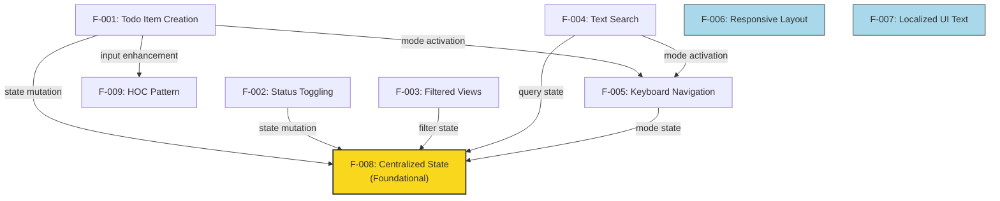
```mermaid
flowchart TD
    F008["F-008: Centralized State<br/>(Foundational)"]
    F005["F-005: Keyboard Navigation"]
    F009["F-009: HOC Pattern"]
    F001["F-001: Todo Item Creation"]
    F002["F-002: Status Toggling"]
    F003["F-003: Filtered Views"]
    F004["F-004: Text Search"]
    F006["F-006: Responsive Layout"]
    F007["F-007: Localized UI Text"]

    F001 -->|"mode activation"| F005
    F001 -->|"state mutation"| F008
    F001 -->|"input enhancement"| F009
    F002 -->|"state mutation"| F008
    F003 -->|"filter state"| F008
    F004 -->|"mode activation"| F005
    F004 -->|"query state"| F008
    F005 -->|"mode state"| F008

    style F008 fill:#f9d71c,stroke:#333,stroke-width:2px
    style F006 fill:#a8d8ea,stroke:#333
    style F007 fill:#a8d8ea,stroke:#333
```

**Key Observations:**

- **F-008 (Centralized State Management)** is the foundational dependency — five of the remaining eight features depend on it directly.
- **F-005 (Keyboard Navigation)** serves as the interaction gateway for both F-001 and F-004.
- **F-006 and F-007** are fully independent features with no inter-feature dependencies, relying solely on external assets or static modules.
- **F-009 (HOC Pattern)** is consumed exclusively by F-001 — it has no other dependents.

### 2.3.2 Integration Points

The following integration points represent the boundaries where features interact through shared infrastructure.

| Integration Point | Source Feature | Target Feature | Mechanism |
|---|---|---|---|
| Mode Activation → Create | F-005 | F-001 | `getNextModeByKey` returns `MODE_CREATE` on `N` key |
| Mode Activation → Search | F-005 | F-004 | `getNextModeByKey` returns `MODE_SEARCH` on `/` key |
| State → List Mutation | F-001, F-002 | F-008 | `addNew`, `changeStatus` call `setState` with service results |
| State → Filter Selection | F-003 | F-008 | `changeFilter` updates `filter` state field |
| State → Query Update | F-004 | F-008 | `setSearchQuery` updates `query` state field |
| Data Pipeline | F-003, F-004 | Rendering | `search(applyFilter(list, filter), query)` in `TodoList.js` |
| Input Enhancement | F-009 | F-001 | `wrapInputBox` HOC wraps `InputBox` at export time |

### 2.3.3 Shared Components and Common Services

The following diagram maps feature consumption of the three service modules and key shared components.

```mermaid
flowchart LR
    subgraph SharedServices["Service Layer"]
        TodoSvc["todo.js<br/>(getAll, addToList, updateStatus)"]
        FilterSvc["filter.js<br/>(applyFilter, search, getOptions)"]
        ModeSvc["mode.js<br/>(getNextModeByKey)"]
    end

    subgraph SharedComponents["Shared Components"]
        SP["StateProvider.js"]
        KSH["KeyStrokeHandler.js"]
        TL["TodoList.js"]
    end

    SP --> TodoSvc
    SP --> FilterSvc
    SP --> ModeSvc
    KSH --> ModeSvc
    TL --> FilterSvc
end
```

**Shared Component Matrix:**

| Component / Module | Consuming Features |
|---|---|
| `StateProvider.js` | F-001, F-002, F-003, F-004, F-005, F-008 |
| `KeyStrokeHandler.js` | F-001, F-004, F-005 |
| `TodoList.js` | F-001, F-002, F-003, F-004 |
| `common.js` | F-004 (stringInclues), F-008 (objectWithOnly, wrapChildrenWith) |

**Common Service Matrix:**

| Service Module | Functions | Consuming Features |
|---|---|---|
| `todo.js` | `getAll`, `addToList`, `updateStatus` | F-001, F-002, F-008 |
| `filter.js` | `applyFilter`, `search`, `getOptions` | F-003, F-004, F-008 |
| `mode.js` | `getNextModeByKey`, mode constants | F-005, F-008 |

---

## 2.4 Implementation Considerations

### 2.4.1 Technical Constraints

The following constraints govern the implementation of all features and must be observed during any modification or extension of the system.

| Constraint | Specification | Affected Features |
|---|---|---|
| React API Surface | React 15.4.2 exclusively — no Hooks, no stable Context API, no Fragments, no `createRoot` | All |
| CRA Boundary | Must not eject from Create React App (`react-scripts` 0.9.0); no custom Webpack, Babel, or ESLint | All |
| Deprecated Lifecycle | `componentWillMount` used in `KeyStrokeHandler.js` — valid in React 15.x, deprecated in 16.3+ | F-005 |
| Deprecated Library | `recompose` ^0.23.5 (deprecated Oct 2018) — functional for React 15.x HOC patterns | F-009 |
| In-Memory State | All application data exists in component state only — intentionally lost on page refresh | F-001, F-002, F-008 |
| Service Layer Purity | Service modules must contain no React imports, no DOM access, and no side effects | F-001, F-002, F-003, F-004, F-005 |

### 2.4.2 Performance Requirements

Performance baselines are defined in Section 1.2.3 and must be maintained for all features.

| Metric | Baseline Value | Threshold |
|---|---|---|
| Production Bundle (JS) | 53.95 KB gzipped | Baseline match required |
| Production Bundle (CSS) | 19.33 KB gzipped | Baseline match required |
| Unit Test Pass Rate | 72/72 (100%) | 100% required |
| Test Execution Time | 0.432 seconds | < 5 seconds |
| Build Output | 0 ESLint violations | Zero violations required |
| npm Install | 842 packages | `--legacy-peer-deps` flag required |

### 2.4.3 Scalability Considerations

| Consideration | Current State | Impact |
|---|---|---|
| List Size | In-memory state; no upper bound enforced | Practical limit determined by browser memory and DOM rendering performance |
| List Virtualization | Not implemented | Large lists will cause full DOM re-rendering on every state change |
| Memoization | Not implemented | `applyFilter` and `search` execute on every render cycle |
| Lazy Loading | Not implemented | All components loaded synchronously at application start |

### 2.4.4 Security and Maintenance

**Security Implications:**

| Aspect | Assessment |
|---|---|
| Authentication | None — no user identity or access control exists |
| Data Exposure | No sensitive data; all state is transient and client-local |
| XSS Protection | React's built-in JSX escaping mitigates injection via user input text |
| Dependency Vulnerabilities | 196 known npm vulnerabilities (71 critical, 52 high) — all from legacy dependencies; human assessment required per Section 1.3.2.3 |

**Maintenance Requirements:**

| Requirement | Specification |
|---|---|
| Documentation Suite | 11 README files with Mermaid diagrams must be maintained alongside code changes |
| Code Formatting | EditorConfig rules: 4-space indent, LF line endings, UTF-8 encoding |
| Curriculum Branches | 16 branches (`step-0` through `step-15`) must remain intact and independently buildable |
| Service Purity | All functions in `todo.js`, `filter.js`, `mode.js` must remain pure — no React imports, no DOM access, no side effects |

### 2.4.5 Assumptions and Constraints

| ID | Assumption / Constraint | Type |
|---|---|---|
| AC-001 | Users operate the application in a modern browser with JavaScript enabled | Assumption |
| AC-002 | The seeded dataset contains exactly 3 items with IDs 1–3; `getNextId()` counter starts at 4 | Constraint |
| AC-003 | No concurrent users or multi-tab synchronization is required | Assumption |
| AC-004 | Data loss on page refresh is acceptable and intentional | Constraint |
| AC-005 | The application will not be upgraded beyond React 15.4.2 within the current specification | Constraint |
| AC-006 | Bootstrap is used for CSS grid only — no JavaScript plugins or jQuery dependencies | Constraint |

---

## 2.5 Traceability Matrix

### 2.5.1 Feature-to-Source Traceability

| Feature ID | Primary Source Files | Service Dependencies |
|---|---|---|
| F-001 | `StateProvider.js`, `wrapInputBox.js`, `InputBox.js`, `InputWrapper.js` | `todo.js` (addToList, getNextId) |
| F-002 | `StateProvider.js`, `CheckBox.js`, `TodoItem.js` | `todo.js` (updateStatus) |
| F-003 | `StateProvider.js`, `Filter.js`, `Footer.js`, `TodoList.js` | `filter.js` (applyFilter, getOptions) |
| F-004 | `StateProvider.js`, `SearchBox.js`, `TodoList.js` | `filter.js` (search), `common.js` (stringInclues) |
| F-005 | `KeyStrokeHandler.js` | `mode.js` (getNextModeByKey) |
| F-006 | `index.js`, `TodoList.js`, `index.css` | None (external: `bootstrap` CSS) |
| F-007 | `en_US.js`, `FilteredList.js`, `Info.js` | None |
| F-008 | `StateProvider.js` | `common.js` (objectWithOnly, wrapChildrenWith) |
| F-009 | `wrapInputBox.js`, `InputBox.js` | None (external: `recompose`) |

### 2.5.2 Feature-to-Test Traceability

| Feature ID | Test File(s) | Coverage Scope |
|---|---|---|
| F-001 | `src/__tests__/services/todo.test.js` | `addToList`, `getNextId` service functions |
| F-002 | `src/__tests__/services/todo.test.js` | `updateStatus` service function |
| F-003 | `src/__tests__/services/filter.test.js` | `applyFilter`, `getOptions` service functions |
| F-004 | `src/__tests__/services/filter.test.js`, `src/__tests__/util/common.test.js` | `search`, `stringInclues` functions |
| F-005 | `src/__tests__/services/mode.test.js` | `getNextModeByKey` FSM transitions |
| F-006 | — | No unit test coverage (CSS/layout) |
| F-007 | — | No unit test coverage (static strings) |
| F-008 | `src/__tests__/util/common.test.js` | `objectWithOnly`, `wrapChildrenWith` utilities |
| F-009 | — | No unit test coverage (HOC composition) |

> **Note:** All 72 unit tests (100% pass rate) cover the service and utility layers exclusively. No component-level or integration tests exist, as documented in Section 1.3.2.3 (Future Phase Considerations).

### 2.5.3 Requirement Cross-Reference

| Req ID Range | Feature | Tech Spec Section | Workflow Reference |
|---|---|---|---|
| F-001-RQ-001 to RQ-004 | Todo Item Creation | Section 1.2.2, Section 1.3.1.1 | Create Todo Item workflow |
| F-002-RQ-001 to RQ-002 | Status Toggling | Section 1.2.2, Section 1.3.1.1 | Toggle Item Status workflow |
| F-003-RQ-001 to RQ-005 | Filtered Views | Section 1.2.2, Section 1.3.1.1 | Filter by Status workflow |
| F-004-RQ-001 to RQ-003 | Text Search | Section 1.2.2, Section 1.3.1.1 | Search Items workflow |
| F-005-RQ-001 to RQ-004 | Keyboard Navigation | Section 1.2.2, Section 1.3.1.1 | All keyboard workflows |
| F-006-RQ-001 to RQ-002 | Responsive Layout | Section 1.2.1 | N/A |
| F-007-RQ-001 to RQ-003 | Localized UI Text | Section 1.3.1.1 | N/A |
| F-008-RQ-001 to RQ-005 | Centralized State | Section 1.2.2 | All workflows |
| F-009-RQ-001 to RQ-003 | HOC Pattern | Section 1.2.2 | Create Todo Item workflow |

---

## 2.6 References

#### Files Examined

- `package.json` — Dependency manifest, scripts, project metadata; establishes version constraints for all external dependencies
- `src/index.js` — Application entry point; Bootstrap CSS import order and `ReactDOM.render()` mount
- `src/services/todo.js` — Immutable todo operations: `getAll`, `getItemById`, `updateStatus`, `addToList`, `getNextId`
- `src/services/filter.js` — Filter constants, `applyFilter`, `search`, `getOptions` implementations
- `src/services/mode.js` — Keyboard mode FSM: `MODE_NONE`, `MODE_SEARCH`, `MODE_CREATE`, `getNextModeByKey`
- `src/util/common.js` — Utility functions: `objectWithOnly`, `wrapChildrenWith`, `stringInclues`
- `src/components/wrappers/StateProvider.js` — Central state container: 4 state fields, 5 action methods, prop injection mechanism
- `src/components/wrappers/KeyStrokeHandler.js` — Global keyboard listener, mode transition delegation via FSM
- `src/components/ui/TodoList.js` — UI orchestrator with two-stage data pipeline (`applyFilter` → `search`)
- `src/components/hoc/wrapInputBox.js` — Recompose HOC: controlled input state, Enter-key submission, text validation
- `src/assets/text/en_US.js` — Locale string constants: `MSG_NO_ITEMS`, `INFO_SHORTCUT_KEYS`, `INFO_CANCEL_SHORTCUT_KEY`
- `src/assets/style/index.css` — Custom CSS extending Bootstrap 3.4.1 base styles

#### Folders Examined

- `src/components/wrappers/` — Wrapper components: `App.js`, `StateProvider.js`, `KeyStrokeHandler.js`
- `src/components/ui/` — 12 presentational UI components
- `src/components/hoc/` — HOC module: `wrapInputBox.js`
- `src/services/` — Pure logic modules: `todo.js`, `filter.js`, `mode.js`
- `src/util/` — Utility module: `common.js`
- `src/assets/` — Static assets: SVG icons, global CSS, locale constants
- `src/__tests__/` — Unit test suites: 4 test files covering services and utilities

#### Cross-Referenced Technical Specification Sections

- Section 1.1 — Executive Summary: project overview, stakeholders, value proposition
- Section 1.2 — System Overview: feature catalog (F-001–F-009), five-layer architecture, success criteria, KPIs
- Section 1.3 — Scope: in-scope features and workflows, implementation boundaries, out-of-scope exclusions

# 3. Technology Stack

This section documents the complete technology stack for **react-todo-app** (v0.1.0), a pedagogical single-page application intentionally locked to the React 15.x era. Every technology choice, version constraint, and deliberate exclusion is grounded in the project's educational objectives and aligns with the scope boundaries established in Section 1.3. The stack is deliberately minimal by design — reflecting the project's commitment to teaching foundational React patterns without the complexity of modern toolchains or infrastructure dependencies.

> **Important:** Many technologies from a typical production web application stack — including TypeScript, backend frameworks, databases, cloud platforms, containerization, and CI/CD pipelines — are **explicitly excluded** from this project by design. These exclusions are documented in their respective subsections with rationale.

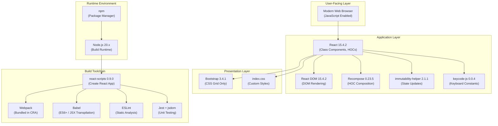
```mermaid
flowchart TB
    subgraph UserFacing["User-Facing Layer"]
        Browser["Modern Web Browser<br/>(JavaScript Enabled)"]
    end

    subgraph AppLayer["Application Layer"]
        React["React 15.4.2<br/>(Class Components, HOCs)"]
        ReactDOM["React DOM 15.4.2<br/>(DOM Rendering)"]
        Recompose["Recompose 0.23.5<br/>(HOC Composition)"]
        ImmHelper["immutability-helper 2.1.1<br/>(State Updates)"]
        KeycodeJS["keycode-js 0.0.4<br/>(Keyboard Constants)"]
    end

    subgraph StyleLayer["Presentation Layer"]
        Bootstrap["Bootstrap 3.4.1<br/>(CSS Grid Only)"]
        CustomCSS["index.css<br/>(Custom Styles)"]
    end

    subgraph BuildLayer["Build Toolchain"]
        CRA["react-scripts 0.9.0<br/>(Create React App)"]
        Webpack["Webpack<br/>(Bundled in CRA)"]
        Babel["Babel<br/>(ES6+ / JSX Transpilation)"]
        ESLint["ESLint<br/>(Static Analysis)"]
        Jest["Jest + jsdom<br/>(Unit Testing)"]
    end

    subgraph RuntimeLayer["Runtime Environment"]
        NodeJS["Node.js 20.x<br/>(Build Runtime)"]
        npm["npm<br/>(Package Manager)"]
    end

    Browser --> React
    React --> ReactDOM
    React --> Recompose
    React --> ImmHelper
    React --> KeycodeJS
    React --> Bootstrap
    React --> CustomCSS
    CRA --> Webpack
    CRA --> Babel
    CRA --> ESLint
    CRA --> Jest
    NodeJS --> CRA
    npm --> NodeJS
```

---

## 3.1 Programming Languages

### 3.1.1 JavaScript (ES6+) — Primary Language

JavaScript (ECMAScript 2015+) is the **sole programming language** used across all application source files. No TypeScript, Flow, or other typed supersets are employed. The codebase leverages a rich subset of ES6+ features that are transpiled to ES5 by the Babel compiler bundled within Create React App's `react-scripts` toolchain.

#### ES6+ Feature Utilization Across the Codebase

| ES6+ Feature | Usage Pattern | Evidence Location |
|---|---|---|
| ES6 Module Syntax | `import`/`export` statements in every source file | `src/index.js`, `src/services/todo.js`, all component files |
| Arrow Functions | Concise callback definitions throughout | `src/services/filter.js`, `src/components/hoc/wrapInputBox.js` |
| Class Syntax | `class StateProvider extends Component` | `src/components/wrappers/StateProvider.js` |
| Destructuring | Parameter and object destructuring | `src/services/filter.js`: `list.filter(({text}) => ...)` |
| Default Parameters | Function parameter defaults | `src/components/wrappers/StateProvider.js`: `changeMode(mode = MODE_NONE)` |
| Computed Property Names | Dynamic object keys | `src/services/filter.js`: `[FILTER_ALL]: 'All'` |
| `Object.assign()` | Object copying for immutable patterns | `src/services/todo.js` |
| `const`/`let` Declarations | Block-scoped variables (no `var` usage) | All source files |
| Shorthand Properties | Object literal shorthand | `src/components/wrappers/StateProvider.js`: `this.setState({filter})` |
| JSX Syntax | Declarative UI markup in all React components | All files under `src/components/` |

#### Language Constraints

- **No TypeScript**: No `.ts` or `.tsx` files, no `tsconfig.json`, and no type annotations exist anywhere in the codebase. This is an intentional decision aligned with the project's focus on foundational JavaScript/React patterns.
- **No Flow**: No static type checking of any kind is employed.
- **JSX Transpilation**: JSX syntax used in all React component files is transpiled to `React.createElement()` calls by Babel, bundled within `react-scripts 0.9.0`. No manual JSX pragma configuration is required due to the CRA zero-config boundary (constraint AC-005 and the CRA non-ejection rule from Section 2.4.1).

### 3.1.2 HTML5 & CSS3 — Supporting Languages

**HTML5** is used in a single template file, `public/index.html`, which provides the application shell containing the `<div id="root">` mount point for React's DOM rendering. This file follows standard HTML5 conventions including the `<!DOCTYPE html>` declaration, UTF-8 charset meta tag, and viewport configuration for responsive behavior.

**CSS3** is employed in `src/assets/style/index.css`, a custom stylesheet that extends and overrides Bootstrap 3.4.1's base styles. This file uses standard CSS3 syntax — no CSS preprocessors (Sass, Less), CSS-in-JS solutions, or utility frameworks (Tailwind CSS) are used. CSS vendor prefixing is handled automatically by `autoprefixer`, bundled within `react-scripts`.

### 3.1.3 Language Selection Rationale

| Selection Criterion | Decision | Justification |
|---|---|---|
| Pedagogical Clarity | Plain JavaScript over TypeScript | Eliminates type-system complexity to focus on React fundamentals |
| Ecosystem Alignment | ES6+ with Babel transpilation | Teaches modern JavaScript patterns with broad browser compatibility |
| Toolchain Simplicity | CRA-managed transpilation | Zero-config build removes Babel/Webpack configuration overhead |
| Curriculum Scope | No backend language | Client-side SPA scope eliminates need for Python, Java, or Node.js backend code |

---

## 3.2 Frameworks & Libraries

### 3.2.1 Core Framework: React 15.4.2

React 15.4.2 serves as the sole UI framework, intentionally version-locked as a **pedagogical artifact** targeting the pre-Hooks, pre-stable-Context API era. As established in Section 1.2.1, this version lock is the foundational architectural decision from which all other technology choices cascade.

#### React API Surface Utilized

The codebase exclusively uses APIs available in React 15.4.2, as mandated by constraint AC-005 (Section 2.4.5):

| React API | Usage | Source Location |
|---|---|---|
| `React.Component` | Base class for all stateful components | `src/components/wrappers/StateProvider.js` |
| `React.Children.map` | Child iteration for prop injection | `src/util/common.js` |
| `React.cloneElement` | Child cloning with merged props | `src/util/common.js` |
| `React.createElement` | JSX compilation target (implicit via Babel) | All component files |
| `ReactDOM.render()` | Single DOM mount into `<div id="root">` | `src/index.js` |

#### APIs Explicitly Not Used

Hooks (`useState`, `useEffect`, `useContext`), stable Context API, Fragments, `createRoot`, Suspense, Server Components, and all post-15.x APIs are explicitly excluded per the curriculum design. This constraint ensures learners focus on class-component lifecycle methods, HOC composition patterns, and manual prop-injection architectures.

### 3.2.2 Supporting Libraries

Six npm packages comprise the complete dependency set. Each selection is justified below with its specific role in the architecture.

#### 3.2.2.1 react-dom (^15.4.2)

Paired with React as the DOM rendering engine. Used exclusively in `src/index.js` for the single `ReactDOM.render(<App />, document.getElementById('root'))` invocation. This package bridges React's virtual DOM reconciliation with the browser DOM, rendering the entire component tree into the `<div id="root">` element defined in `public/index.html`.

#### 3.2.2.2 Bootstrap (^3.4.1) — CSS Only

Bootstrap is used **exclusively as a CSS framework** — no Bootstrap JavaScript plugins and no jQuery dependency. The import is a side-effect CSS import in the application entry point (`src/index.js`): `import 'bootstrap/dist/css/bootstrap.css'`. This provides the responsive 12-column grid system (`container`, `row` classes), base typography, and foundational component styles. A custom stylesheet at `src/assets/style/index.css` extends and overrides these base styles. This CSS-only usage is enforced by constraint AC-006 (Section 2.4.5).

#### 3.2.2.3 immutability-helper (^2.1.1)

Provides immutable state transformation utilities. Used exclusively in `src/services/todo.js` for the `updateStatus()` function, which employs the `$set` command syntax to update a specific todo item's `completed` property within a list array without direct mutation. This library enables the immutable state discipline mandated by the project's critical success factor (Section 1.2.3), working in tandem with `Array.prototype.concat()` for list additions.

#### 3.2.2.4 keycode-js (^0.0.4)

Supplies cross-browser keyboard key code constants. Imported in two locations:
- `src/services/mode.js` — Constants `KEY_SLASH`, `KEY_N`, and `KEY_ESCAPE` drive the keyboard-based finite state machine (FSM) mode transitions (F-005).
- `src/components/hoc/wrapInputBox.js` — `KeyCode.KEY_RETURN` detects Enter-key submission for todo creation (F-001) and search activation (F-004).

#### 3.2.2.5 recompose (^0.23.5) — Deprecated

A Higher-Order Component (HOC) composition utility library. **Deprecated since October 2018** — the author officially recommended migrating to React Hooks. Despite its deprecated status, recompose remains functional within the React 15.x constraint and is used exclusively in `src/components/hoc/wrapInputBox.js`. Three functions are imported: `compose` (HOC pipeline composition), `withState` (local state injection), and `withHandlers` (handler prop injection). This library is retained because it teaches the HOC composition pattern that was the dominant abstraction strategy before Hooks were introduced.

### 3.2.3 Compatibility Requirements

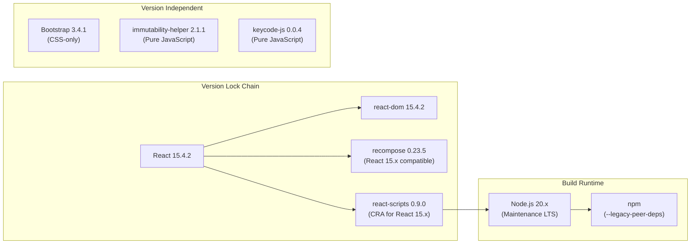
```mermaid
flowchart LR
    subgraph VersionLock["Version Lock Chain"]
        R15["React 15.4.2"] --> RD15["react-dom 15.4.2"]
        R15 --> RC["recompose 0.23.5<br/>(React 15.x compatible)"]
        R15 --> RS["react-scripts 0.9.0<br/>(CRA for React 15.x)"]
    end

    subgraph Standalone["Version Independent"]
        BS["Bootstrap 3.4.1<br/>(CSS-only)"]
        IH["immutability-helper 2.1.1<br/>(Pure JavaScript)"]
        KC["keycode-js 0.0.4<br/>(Pure JavaScript)"]
    end

    subgraph Runtime["Build Runtime"]
        Node["Node.js 20.x<br/>(Maintenance LTS)"]
        NPM["npm<br/>(--legacy-peer-deps)"]
    end

    RS --> Node
    Node --> NPM
```

| Compatibility Requirement | Specification | Impact |
|---|---|---|
| React ↔ react-dom | Must be identical major.minor (`15.4.x`) | Mismatched versions cause runtime errors |
| React ↔ recompose | recompose 0.23.x requires React ≤ 16.x | Functional at 15.4.2; would need replacement if React upgraded |
| react-scripts ↔ Node.js | `react-scripts 0.9.0` compatible with Node.js 20.x | Requires `--legacy-peer-deps` flag for `npm install` |
| Bootstrap CSS ↔ React | Independent — CSS-only import | No version coupling; grid classes used directly in JSX |
| immutability-helper ↔ React | Independent — pure JavaScript utility | No React dependency |
| keycode-js ↔ React | Independent — constant exports | No React dependency |

---

## 3.3 Open Source Dependencies

### 3.3.1 Package Registry & Management

| Aspect | Specification |
|---|---|
| **Package Registry** | npm (sole registry) |
| **Package Manager** | npm (bundled with Node.js 20.x) |
| **Total Installed Packages** | 842 (transitive dependency tree) |
| **Direct Dependencies** | 6 runtime + 1 development = 7 total |
| **Install Command** | `npm install --legacy-peer-deps` |
| **Legacy Flag Requirement** | Required due to peer dependency conflicts in legacy dependency tree |
| **Lock File** | `package-lock.json` (npm default) |

The `--legacy-peer-deps` flag is mandatory because the pinned `react-scripts 0.9.0` and its transitive dependencies declare peer dependency ranges that conflict with the resolution algorithm in modern npm versions (npm 7+). This is a documented constraint in Section 1.2.3 and Section 2.4.2.

### 3.3.2 Direct Dependency Inventory

All dependencies are declared in `package.json` with their semver constraints. The table below provides the complete manifest.

#### Runtime Dependencies (`dependencies`)

| Package | Semver Constraint | Resolved Version | License | Import Count | Primary Source Files |
|---|---|---|---|---|---|
| `react` | `^15.4.2` | 15.4.2 | MIT | 16+ files | `src/index.js`, all component files, `src/util/common.js` |
| `react-dom` | `^15.4.2` | 15.4.2 | MIT | 1 file | `src/index.js` |
| `bootstrap` | `^3.4.1` | 3.4.1 | MIT | 1 file (CSS import) | `src/index.js` |
| `immutability-helper` | `^2.1.1` | 2.1.1+ | MIT | 1 file | `src/services/todo.js` |
| `keycode-js` | `^0.0.4` | 0.0.4 | BSD-3-Clause | 2 files | `src/services/mode.js`, `src/components/hoc/wrapInputBox.js` |
| `recompose` | `^0.23.5` | 0.23.5 | MIT | 1 file | `src/components/hoc/wrapInputBox.js` |

#### Development Dependencies (`devDependencies`)

| Package | Version | Pinning | Purpose |
|---|---|---|---|
| `react-scripts` | `0.9.0` | Exact (no caret `^`) | Create React App build toolchain — bundles Webpack, Babel, ESLint, Jest, autoprefixer, css-loader, style-loader, file-loader |

The exact pinning of `react-scripts` at `0.9.0` (without the caret prefix) is significant: it prevents any automatic semver-compatible upgrades, ensuring deterministic builds aligned with the React 15.x curriculum. This is a deliberate lock, not an oversight.

### 3.3.3 Security & Vulnerability Assessment

As documented in Section 2.4.4, the legacy dependency tree carries a substantial known vulnerability surface:

| Severity | Count |
|---|---|
| **Critical** | 71 |
| **High** | 52 |
| **Moderate** | 50+ |
| **Low** | 23+ |
| **Total** | **196 known vulnerabilities** |

All 196 vulnerabilities originate from the legacy transitive dependency tree (within `react-scripts 0.9.0` and its bundled toolchain), not from the direct application dependencies. Per Section 1.3.2.3, human assessment is required before any remediation is attempted, and vulnerability resolution is deferred to a future phase. This deferral is acceptable because:

1. The application handles no sensitive data (no authentication, no persistent storage).
2. All state is transient and client-local, with no server-side data exposure surface.
3. React's built-in JSX escaping mitigates cross-site scripting (XSS) through user input text.
4. The project serves an educational purpose and is not deployed to production infrastructure.

---

## 3.4 Third-Party Services

### 3.4.1 Excluded Services & Integrations

This application operates as a **fully self-contained client-side SPA** with zero external service dependencies. The following categories of third-party services are explicitly excluded, as confirmed by the scope boundaries in Section 1.3.2:

| Service Category | Status | Rationale |
|---|---|---|
| **External APIs / Backend** | Not applicable | No REST/GraphQL endpoints; all logic is client-side |
| **Authentication Services** | Excluded | No Auth0, OAuth, or user identity system — no login/session functionality (Section 1.3.2.1) |
| **Monitoring / Analytics** | Not applicable | No error tracking, performance monitoring, or usage analytics |
| **Cloud Services** | Not applicable | No AWS, GCP, Azure, or equivalent infrastructure |
| **CDN** | Not applicable | Bootstrap CSS loaded from npm package via bundled import, not CDN |
| **Database-as-a-Service** | Not applicable | No MongoDB, PostgreSQL, Firebase, or equivalent |
| **AI / ML Services** | Not applicable | No LangChain, OpenAI, or AI framework integrations |

### 3.4.2 Browser Integration Surface

The sole external integration point is the **browser DOM environment**:

| Integration | Mechanism | Source |
|---|---|---|
| DOM Mount | `ReactDOM.render()` into `<div id="root">` | `src/index.js` |
| Keyboard Events | `window.addEventListener('keydown', ...)` | `src/components/wrappers/KeyStrokeHandler.js` |
| Browser Rendering | Standard HTML5/CSS3 rendering pipeline | `public/index.html`, Bootstrap CSS, `index.css` |

A prior Heroku-hosted deployment (`https://simplest-react-todo-app.herokuapp.com/`) is no longer available following Heroku's discontinuation of its free tier in November 2022, as noted in Section 1.1.1.

---

## 3.5 Databases & Storage

### 3.5.1 Data Persistence Strategy — Intentionally None

Data persistence is **explicitly excluded** from this system by design. This is a fundamental architectural constraint, not a gap — it is codified as constraint AC-004 in Section 2.4.5: *"Data loss on page refresh is acceptable and intentional."*

| Storage Mechanism | Status | Rationale |
|---|---|---|
| **Relational Database** (PostgreSQL, MySQL) | Excluded | No server-side component exists |
| **Document Database** (MongoDB) | Excluded | No backend or persistence layer |
| **localStorage / sessionStorage** | Not used | Intentional data transience for pedagogical clarity |
| **IndexedDB** | Not used | No offline storage requirements |
| **Server-Side Session Storage** | Not applicable | No server exists |
| **Caching Solutions** | Not implemented | No memoization, no service workers, no CDN caching |

### 3.5.2 In-Memory State Architecture

All application data resides exclusively in React component state within `src/components/wrappers/StateProvider.js`. The state model consists of four fields:

| State Field | Type | Initial Value | Purpose |
|---|---|---|---|
| `query` | String | `''` | Current search query text |
| `mode` | String | `MODE_NONE` | Active keyboard interaction mode (FSM state) |
| `filter` | String | `FILTER_ALL` | Active filter selection (All/Active/Completed) |
| `list` | Array | 3 seeded items (IDs 1–3) | Complete todo item collection |

State is managed through five action methods (`addNew`, `changeFilter`, `changeStatus`, `changeMode`, `setSearchQuery`) propagated via prop injection, as documented in Section 1.2.2. All mutations follow immutable update patterns using `immutability-helper`'s `$set` command or `Array.prototype.concat()`. The entire state is **recreated from seed data on every page refresh** — this is intentional and serves the pedagogical goal of demonstrating React component state lifecycle without the complexity of persistence layers.

---

## 3.6 Development & Deployment

### 3.6.1 Build System: Create React App (react-scripts 0.9.0)

The build system operates entirely within the **Create React App zero-config boundary**. The project has not been ejected and **must never be ejected** — this is a critical success factor defined in Section 1.2.3 and enforced by constraint AC-005. No custom Webpack, Babel, or ESLint configuration files exist in the repository.

#### npm Scripts (from `package.json`)

| Script | Command | Purpose |
|---|---|---|
| `start` | `react-scripts start` | Development server with hot module replacement |
| `build` | `react-scripts build` | Production-optimized bundle generation |
| `test` | `react-scripts test --env=jsdom` | Jest test runner with jsdom browser simulation |
| `eject` | `react-scripts eject` | CRA ejection — **EXPLICITLY FORBIDDEN** |

#### Bundled Toolchain Components

`react-scripts 0.9.0` encapsulates the following tools, none of which are independently configurable:

| Tool | Role | Configuration |
|---|---|---|
| **Webpack** | Module bundler — resolves imports, generates optimized bundles | CRA-managed; no `webpack.config.js` |
| **Babel** | Transpiles ES6+/JSX to ES5-compatible JavaScript | CRA-managed; no `.babelrc` |
| **ESLint** | Static analysis and code linting | CRA-managed; no `.eslintrc` |
| **autoprefixer** | Adds CSS vendor prefixes for cross-browser compatibility | CRA-managed |
| **css-loader / style-loader** | Processes CSS imports within JavaScript modules | CRA-managed |
| **file-loader** | Handles static asset imports (SVG icons, images) | CRA-managed |

#### Build Output Baselines

As established in Section 1.2.3, the production build must maintain the following baselines:

| Metric | Baseline | Threshold |
|---|---|---|
| JavaScript Bundle (gzipped) | 53.95 KB | Baseline match required |
| CSS Bundle (gzipped) | 19.33 KB | Baseline match required |
| ESLint Violations | 0 | Zero violations required |

### 3.6.2 Node.js Runtime Environment

| Component | Version | Status | Notes |
|---|---|---|---|
| **Node.js** | 20.x | Maintenance LTS (EOL April 30, 2026) | Build toolchain runtime only — not used as a server |
| **npm** | Bundled with Node.js 20.x | Current | Package manager; `--legacy-peer-deps` flag required |

Node.js serves exclusively as the build-time runtime for the development server, production bundling, and test execution. It does not run as a server in production — the build output is a static SPA that can be served from any static file host.

### 3.6.3 Testing Framework

Testing is provided by **Jest** (bundled within `react-scripts 0.9.0`) with the **jsdom** environment for browser DOM simulation.

| Test Metric | Value |
|---|---|
| **Test Framework** | Jest (CRA-bundled) |
| **Environment** | jsdom (`--env=jsdom` flag) |
| **Total Tests** | 72 |
| **Pass Rate** | 100% (72/72) |
| **Execution Time** | 0.432 seconds |
| **CI Command** | `CI=true npm test -- --watchAll=false` |

#### Test File Inventory

| Test File | Coverage Target |
|---|---|
| `src/__tests__/services/todo.test.js` | Todo service: `getAll`, `getItemById`, `updateStatus`, `addToList`, `getNextId` |
| `src/__tests__/services/filter.test.js` | Filter service: `applyFilter`, `search`, `getOptions` |
| `src/__tests__/services/mode.test.js` | Mode FSM: `getNextModeByKey` transitions |
| `src/__tests__/util/common.test.js` | Utilities: `objectWithOnly`, `wrapChildrenWith`, `stringInclues` |

Component-level and integration tests are not currently implemented and are noted as a future phase consideration in Section 1.3.2.3.

### 3.6.4 Code Quality Tooling

| Tool | Configuration | Scope |
|---|---|---|
| **EditorConfig** | `.editorconfig` at project root | 4-space indentation, LF line endings, UTF-8 charset, trim trailing whitespace, insert final newline |
| **ESLint** | CRA-bundled defaults (no custom `.eslintrc`) | JavaScript/JSX linting with zero-violation enforcement |
| **Prettier** | Not configured | Not present in the project |
| **TypeScript Compiler** | Not applicable | No TypeScript in the project |

### 3.6.5 Infrastructure & Deployment

The following infrastructure categories are **explicitly excluded** from the current project scope:

| Infrastructure | Status | Reference |
|---|---|---|
| **Containerization (Docker)** | Not used | No `Dockerfile`, `docker-compose.yml`, or container configuration |
| **CI/CD Pipeline** | Excluded | No GitHub Actions, Jenkins, Travis CI, or equivalent (Section 1.3.2.2) |
| **Infrastructure as Code (Terraform)** | Not applicable | No cloud infrastructure to manage |
| **Cloud Platform (AWS/GCP/Azure)** | Not applicable | No deployment target specified |
| **Production Deployment Docs** | Pending | Listed as future phase item in Section 1.3.2.3 |

The build output from `npm run build` produces a static SPA bundle (HTML, CSS, JavaScript, SVG assets) that is deployable to any static file server. No server-side runtime or specialized hosting infrastructure is required.

---

## 3.7 Technology Currency Assessment

### 3.7.1 Version Gap Analysis

The table below compares the versions used in this project against the latest available releases as of March 2026, documenting the intentional version gaps and their rationale.

| Technology | Project Version | Latest Available | Version Gap | Status | Intentional Lock |
|---|---|---|---|---|---|
| React | 15.4.2 | 19.2.4 | 4 major versions | Intentional lock | Yes — pre-Hooks/Context curriculum |
| react-dom | 15.4.2 | 19.2.4 | 4 major versions | Paired with React | Yes |
| Bootstrap | 3.4.1 | 5.3.8 | 2 major versions | CSS-only usage | Yes — grid/typography sufficient |
| recompose | 0.23.5 | Deprecated (Oct 2018) | N/A — abandoned | Accepted | Yes — teaches HOC patterns |
| react-scripts | 0.9.0 (pinned) | Maintenance mode | Significant | Accepted | Yes — zero-config boundary |
| Node.js | 20.x | 24.x (LTS) / 25.x (Current) | 2–5 major versions | Maintenance LTS | Build runtime only |
| immutability-helper | 2.1.1 | 3.x | 1 major version | Stable utility | Low-risk functional lock |
| keycode-js | 0.0.4 | 1.x+ | 1+ major version | Stable constants | No API changes needed |

### 3.7.2 Intentional Constraints & Design Rationale

The technology version locks are not the result of neglected maintenance — they are deliberate pedagogical decisions that form the foundation of the project's educational value:

1. **React 15.4.2 Lock** — Ensures the curriculum teaches class-component patterns (`React.Component`, lifecycle methods), manual prop injection (`React.Children.map`, `React.cloneElement`), and HOC composition — all foundational concepts that underpin modern React development but are obscured when Hooks and Context are available.

2. **Recompose Retention** — Despite its deprecated status, recompose is the canonical library for demonstrating the HOC composition pattern (`compose`, `withState`, `withHandlers`) that was the dominant abstraction strategy in the React ecosystem before Hooks were introduced. Its retention serves the curriculum's historical completeness.

3. **CRA 0.9.0 Pinning** — Maintains the zero-configuration build boundary, ensuring learners focus on React concepts rather than build toolchain configuration. Ejection is explicitly forbidden to prevent scope creep into Webpack/Babel configuration territory.

4. **Bootstrap 3.4.1 CSS Lock** — Provides a stable, well-documented CSS grid system sufficient for the project's layout requirements. The CSS-only usage (no JavaScript plugins, no jQuery) aligns with the constraint to minimize non-React dependencies.

---

## 3.8 Excluded Default Stack Technologies

The following technologies from a standard full-stack web application are confirmed as **not present** in this codebase, based on exhaustive source file analysis and scope boundaries defined in Sections 1.3.2.1 and 1.3.2.2:

| Category | Excluded Technologies | Confirmation Source |
|---|---|---|
| **Typed Languages** | TypeScript, Flow | No `.ts`/`.tsx` files, no `tsconfig.json`, no type annotations |
| **State Libraries** | Redux, MobX, Zustand | Custom `StateProvider` pattern is sole approach (Section 1.3.2.1) |
| **Routing** | React Router | Single-page application with no URL routing |
| **CSS-in-JS** | styled-components, Emotion | Traditional CSS + Bootstrap only |
| **Utility CSS** | Tailwind CSS | Bootstrap 3.4.1 is sole CSS framework |
| **Backend Languages** | Python, Java, Go, Ruby | No server-side component |
| **Backend Frameworks** | Flask, Django, Express, Spring | No backend exists |
| **Databases** | MongoDB, PostgreSQL, MySQL, Redis | No persistence layer |
| **Authentication** | Auth0, OAuth, JWT | No user identity system |
| **Cloud Platforms** | AWS, GCP, Azure | No cloud infrastructure |
| **Containerization** | Docker, Kubernetes | No container configuration |
| **IaC** | Terraform, CloudFormation | No infrastructure to codify |
| **CI/CD** | GitHub Actions, Jenkins | No pipeline configuration |
| **AI Frameworks** | LangChain, OpenAI | No AI/ML functionality |
| **Mobile** | React Native, Swift, Kotlin | Browser SPA only |
| **Desktop** | Electron, Objective-C | No desktop application |
| **SSR Frameworks** | Next.js, Gatsby, Remix | Client-side `ReactDOM.render()` only |

---

## 3.9 References

#### Files Examined

- `package.json` — Complete dependency manifest with exact semver constraints, npm scripts definitions, and project metadata
- `src/index.js` — Application entry point: React and ReactDOM imports, Bootstrap CSS side-effect import, `ReactDOM.render()` DOM mount
- `public/index.html` — HTML5 shell template with `<div id="root">` mount point, charset, and viewport configuration
- `.editorconfig` — Code formatting rules: 4-space indentation, LF line endings, UTF-8 encoding, trailing whitespace control
- `src/components/hoc/wrapInputBox.js` — Recompose HOC demonstrating `compose`, `withState`, `withHandlers`, and `keycode-js` integration
- `src/services/todo.js` — Todo service demonstrating `immutability-helper` `$set` command usage for immutable state updates
- `src/services/mode.js` — Mode FSM service demonstrating `keycode-js` constant imports (`KEY_SLASH`, `KEY_N`, `KEY_ESCAPE`)
- `src/services/filter.js` — Filter service demonstrating ES6+ destructuring, computed property names, and arrow functions
- `src/components/wrappers/StateProvider.js` — Central state container: `React.Component` class, four state fields, five action methods, prop injection
- `src/util/common.js` — Utility functions: `React.Children.map`, `React.cloneElement` for child prop injection
- `src/assets/style/index.css` — Custom CSS extending Bootstrap 3.4.1 base styles

#### Folders Examined

- `src/` — Source root containing all application code across five architectural layers
- `src/components/` — Component layer: `hoc/`, `wrappers/`, `ui/` subdirectories
- `src/services/` — Service layer: `todo.js`, `filter.js`, `mode.js` pure logic modules
- `src/util/` — Utility layer: `common.js` helper functions
- `src/__tests__/` — Test suites: 4 files covering services and utilities (72 tests total)
- `src/assets/` — Asset layer: `images/` (SVG icons), `style/` (CSS), `text/` (locale constants)

#### Cross-Referenced Technical Specification Sections

- Section 1.1 — Executive Summary: project overview, educational purpose, stakeholder definitions
- Section 1.2 — System Overview: technology currency assessment, five-layer architecture, success criteria and KPIs
- Section 1.3 — Scope: in-scope/out-of-scope boundaries, source file inventory, excluded infrastructure
- Section 2.4 — Implementation Considerations: technical constraints (AC-001 through AC-006), performance requirements, security assessment
- Section 2.6 — References: prior documentation cross-reference catalog

#### External Sources Consulted

- React GitHub Releases (https://github.com/facebook/react/releases) — Confirmed latest React version as 19.2.4 (January 26, 2026)
- Bootstrap Documentation (https://getbootstrap.com/docs/versions/) — Confirmed latest Bootstrap version as 5.3.8
- Node.js Releases (https://nodejs.org/en/about/previous-releases) — Confirmed Node.js 20.x Maintenance LTS status (EOL April 30, 2026) and Node.js 24.x Active LTS (Krypton)
- Node.js Release Working Group (https://github.com/nodejs/Release) — Confirmed Node.js LTS lifecycle schedule

# 4. Process Flowchart

This section provides a comprehensive visual and narrative mapping of every process flow within the **react-todo-app** (v0.1.0) system. As a purely client-side single-page application with no backend services, no API integrations, and no persistent storage, all process flows operate synchronously within the browser's JavaScript runtime. Every state mutation is performed in-memory within `StateProvider.js`, and every re-render is triggered by React's `setState()` mechanism. The diagrams and descriptions below trace each user-initiated action from its trigger through the component and service layers to final UI rendering.

---

## 4.1 High-Level System Workflow

### 4.1.1 Application Lifecycle Overview

The application follows a deterministic lifecycle comprising three phases: **initialization** (one-time bootstrap), **idle** (awaiting user interaction), and **action processing** (handling events and re-rendering). Because there are no asynchronous operations, no network requests, and no timers, the system operates in a fully synchronous event loop driven entirely by user actions.

The following diagram captures the complete lifecycle from browser load through the continuous interaction cycle. All paths converge on `StateProvider.setState()`, which triggers React's reconciliation and re-render of the component tree.

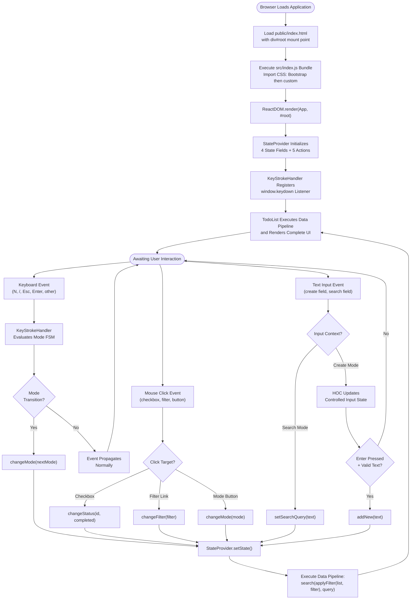
```mermaid
flowchart TD
    Start([Browser Loads Application]) --> LoadHTML["Load public/index.html<br/>with div#root mount point"]
    LoadHTML --> ExecuteJS["Execute src/index.js Bundle<br/>Import CSS: Bootstrap then custom"]
    ExecuteJS --> MountReact["ReactDOM.render(App, #root)"]
    MountReact --> InitState["StateProvider Initializes<br/>4 State Fields + 5 Actions"]
    InitState --> RegListener["KeyStrokeHandler Registers<br/>window.keydown Listener"]
    RegListener --> RenderUI["TodoList Executes Data Pipeline<br/>and Renders Complete UI"]
    RenderUI --> AwaitInput([Awaiting User Interaction])

    AwaitInput --> KeyEvent["Keyboard Event<br/>(N, /, Esc, Enter, other)"]
    AwaitInput --> ClickEvent["Mouse Click Event<br/>(checkbox, filter, button)"]
    AwaitInput --> TypeEvent["Text Input Event<br/>(create field, search field)"]

    KeyEvent --> ProcessKey["KeyStrokeHandler<br/>Evaluates Mode FSM"]
    ProcessKey --> Transition{Mode<br/>Transition?}
    Transition -->|Yes| ModeAction["changeMode(nextMode)"]
    Transition -->|No| Propagate["Event Propagates<br/>Normally"]

    ClickEvent --> ClickTarget{Click Target?}
    ClickTarget -->|Checkbox| ToggleAction["changeStatus(id, completed)"]
    ClickTarget -->|Filter Link| FilterAction["changeFilter(filter)"]
    ClickTarget -->|Mode Button| ButtonAction["changeMode(mode)"]

    TypeEvent --> InputCtx{Input Context?}
    InputCtx -->|Create Mode| CaptureText["HOC Updates<br/>Controlled Input State"]
    InputCtx -->|Search Mode| QueryAction["setSearchQuery(text)"]

    CaptureText --> EnterCheck{Enter Pressed<br/>+ Valid Text?}
    EnterCheck -->|Yes| AddAction["addNew(text)"]
    EnterCheck -->|No| AwaitInput

    ModeAction --> SetState["StateProvider.setState()"]
    ToggleAction --> SetState
    FilterAction --> SetState
    ButtonAction --> SetState
    QueryAction --> SetState
    AddAction --> SetState

    SetState --> DataPipeline["Execute Data Pipeline:<br/>search(applyFilter(list, filter), query)"]
    DataPipeline --> RenderUI
    Propagate --> AwaitInput
```

**Key Observations:**

- Every user action that modifies application state flows through exactly one of the five action methods exposed by `StateProvider.js`: `addNew`, `changeFilter`, `changeStatus`, `changeMode`, or `setSearchQuery`.
- The data pipeline in `TodoList.js` re-executes on every re-render, applying the two-stage `search(applyFilter(list, filter), query)` transformation to produce the displayed item set.
- Keyboard events that do not trigger a mode transition (unmapped keys, or keys pressed while already in the target mode) propagate normally with no state change and no re-render.

### 4.1.2 User Interaction Entry Points

The application exposes six distinct interaction entry points, each mapping to a specific action method within the `StateProvider` component. Since there is no authentication, authorization, or role-based access control, all interactions are available unconditionally to any user.

| Entry Point | Trigger Mechanism | Action Method | Source Component | Target Service |
|---|---|---|---|---|
| Create Mode Activation | Press `N` key or click Add button | `changeMode(MODE_CREATE)` | `KeyStrokeHandler.js` / `ButtonWrapper.js` | `mode.js` |
| Search Mode Activation | Press `/` key or click Search button | `changeMode(MODE_SEARCH)` | `KeyStrokeHandler.js` / `ButtonWrapper.js` | `mode.js` |
| Mode Cancellation | Press `Escape` key or click active button | `changeMode(MODE_NONE)` | `KeyStrokeHandler.js` / `ButtonWrapper.js` | `mode.js` |
| Todo Item Submission | Press `Enter` in create input | `addNew(text)` | `wrapInputBox.js` HOC | `todo.js` |
| Status Toggle | Click checkbox on item | `changeStatus(id, completed)` | `CheckBox.js` | `todo.js` |
| Filter Selection | Click All / Active / Completed | `changeFilter(filter)` | `Filter.js` | `filter.js` |
| Search Query Input | Type in search field | `setSearchQuery(text)` | `SearchBox.js` | `filter.js` |

### 4.1.3 Event-Driven Re-render Cycle

All state mutations follow a strictly synchronous, unidirectional data flow. There are no asynchronous operations (no `fetch`, no `Promise`, no `setTimeout`), no network latency considerations, and no optimistic UI updates. The re-render cycle completes within a single synchronous JavaScript execution context.

**Cycle Phases:**

1. **Event Capture** — User action generates a DOM event (keyboard, click, or input change).
2. **Handler Dispatch** — React's synthetic event system or the global `window.keydown` listener routes the event to the appropriate handler.
3. **Service Evaluation** — The handler delegates to a pure service function (`getNextModeByKey`, `addToList`, `updateStatus`, `applyFilter`, or `search`) for business logic computation.
4. **State Mutation** — The handler calls `StateProvider.setState()` with the result, using immutable update patterns (`Array.concat()` or `immutability-helper.update()`).
5. **Tree Reconciliation** — React's reconciler diffs the virtual DOM and applies minimal DOM updates.
6. **Pipeline Re-execution** — `TodoList.js` re-computes `search(applyFilter(list, filter), query)` and the active item count.
7. **UI Render** — Updated components render to the browser DOM, returning to the idle state.

**Timing Characteristics:** Because all operations are synchronous, in-memory, and CPU-bound (no I/O), the entire cycle from event capture to rendered output completes within a single animation frame on modern hardware. There are no SLA, retry, or timeout considerations.

---

## 4.2 Application Bootstrap Flow

### 4.2.1 Initialization Sequence

The bootstrap process is entirely deterministic and synchronous. The application initializes once on page load and does not support hot reloading, lazy loading, or deferred initialization. The following sequence diagram traces the component mount chain from browser load through first render.

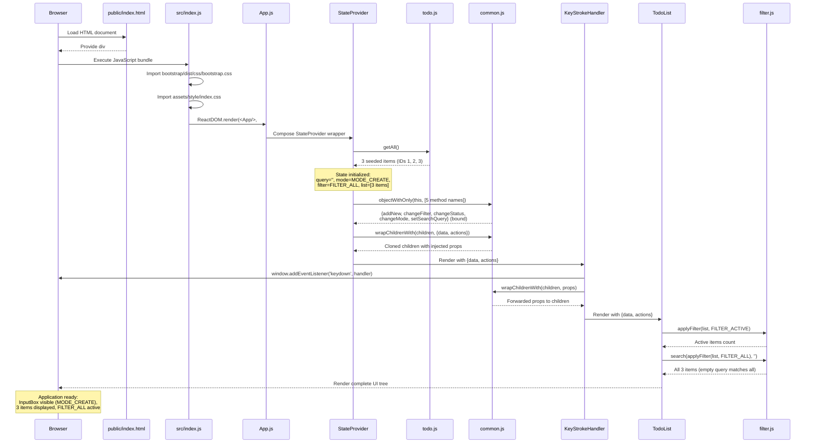
```mermaid
sequenceDiagram
    participant Browser
    participant HTML as public/index.html
    participant JS as src/index.js
    participant App as App.js
    participant SP as StateProvider
    participant TodoSvc as todo.js
    participant Util as common.js
    participant KSH as KeyStrokeHandler
    participant TL as TodoList
    participant FilterSvc as filter.js

    Browser->>HTML: Load HTML document
    HTML-->>Browser: Provide div#root mount point
    Browser->>JS: Execute JavaScript bundle
    JS->>JS: Import bootstrap/dist/css/bootstrap.css
    JS->>JS: Import assets/style/index.css
    JS->>App: ReactDOM.render(<App/>, #root)
    App->>SP: Compose StateProvider wrapper
    SP->>TodoSvc: getAll()
    TodoSvc-->>SP: 3 seeded items (IDs 1, 2, 3)
    Note over SP: State initialized:<br/>query='', mode=MODE_CREATE,<br/>filter=FILTER_ALL, list=[3 items]
    SP->>Util: objectWithOnly(this, [5 method names])
    Util-->>SP: {addNew, changeFilter, changeStatus,<br/>changeMode, setSearchQuery} (bound)
    SP->>Util: wrapChildrenWith(children, {data, actions})
    Util-->>SP: Cloned children with injected props
    SP->>KSH: Render with {data, actions}
    KSH->>Browser: window.addEventListener('keydown', handler)
    KSH->>Util: wrapChildrenWith(children, props)
    Util-->>KSH: Forwarded props to children
    KSH->>TL: Render with {data, actions}
    TL->>FilterSvc: applyFilter(list, FILTER_ACTIVE)
    FilterSvc-->>TL: Active items count
    TL->>FilterSvc: search(applyFilter(list, FILTER_ALL), '')
    FilterSvc-->>TL: All 3 items (empty query matches all)
    TL-->>Browser: Render complete UI tree
    Note over Browser: Application ready:<br/>InputBox visible (MODE_CREATE),<br/>3 items displayed, FILTER_ALL active
```

### 4.2.2 Component Composition Chain

The application assembles through a strict, immutable wrapper nesting order defined in `src/components/wrappers/App.js`. This chain establishes the prop-injection pipeline that delivers state and actions to all UI components.

**Wrapper Chain:**

```
App.js → StateProvider.js → KeyStrokeHandler.js → TodoList.js
```

| Position | Component | Responsibility | Lifecycle Events |
|---|---|---|---|
| 1 (Outermost) | `App.js` | Composition shell; defines nesting order | `render()` only |
| 2 | `StateProvider.js` | State ownership; action binding; prop injection | `constructor()` (state init), `render()` (prop injection) |
| 3 | `KeyStrokeHandler.js` | Global keyboard event interception; FSM delegation | `componentWillMount()` (listener registration), `render()` (prop forwarding) |
| 4 (Innermost) | `TodoList.js` | Data pipeline execution; child prop distribution | `render()` (pipeline + distribution) |

**Critical ordering constraint:** `StateProvider` must wrap `KeyStrokeHandler` so that `KeyStrokeHandler` receives `{data, actions}` props, enabling it to read the current mode and invoke `changeMode`. `KeyStrokeHandler` must wrap `TodoList` so keyboard events are intercepted before any UI component handles them.

### 4.2.3 Initial State Configuration

The `StateProvider` constructor in `src/components/wrappers/StateProvider.js` seeds the application with a fully defined initial state. No fields are undefined or lazily initialized.

| State Field | Initial Value | Source | Purpose |
|---|---|---|---|
| `query` | `''` (empty string) | Hardcoded literal | No active search filter on startup |
| `mode` | `MODE_CREATE` (`'create'`) | Imported from `mode.js` | Input box visible immediately on load |
| `filter` | `FILTER_ALL` (`'all'`) | Imported from `filter.js` | All items displayed regardless of status |
| `list` | `[{id:1, ...}, {id:2, ...}, {id:3, ...}]` | `getAll()` from `todo.js` | Three seeded items: "Learn Javascript", "Learn React", "Build a React App" — all `completed: false` |

**Seeded Data Detail:** The `getAll()` function in `src/services/todo.js` returns a hardcoded array of three items with sequential IDs 1–3. The `getNextId()` counter begins at value `4` (seeded list length 3 + initial counter value 1), ensuring no ID collisions with seeded data.

---

## 4.3 Core Feature Process Flows

### 4.3.1 Todo Item Creation Flow (F-001)

The item creation process spans four layers of the architecture: the interaction layer (`KeyStrokeHandler.js` or `ButtonWrapper.js`), the wrapper layer (`StateProvider.js`), the HOC layer (`wrapInputBox.js`), and the service layer (`todo.js`). Two activation paths exist — keyboard shortcut and button click — both converging on the same `changeMode` action.

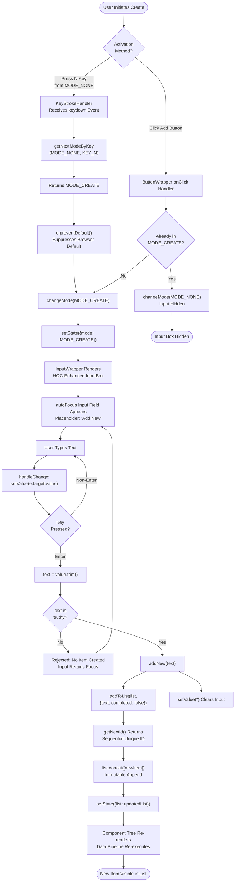
```mermaid
flowchart TD
    Start([User Initiates Create]) --> Method{Activation<br/>Method?}

    Method -->|Press N Key<br/>from MODE_NONE| KSH["KeyStrokeHandler<br/>Receives keydown Event"]
    Method -->|Click Add Button| Btn["ButtonWrapper onClick Handler"]

    KSH --> FSM["getNextModeByKey<br/>(MODE_NONE, KEY_N)"]
    FSM --> RetCreate["Returns MODE_CREATE"]
    RetCreate --> Prevent["e.preventDefault()<br/>Suppresses Browser Default"]
    Prevent --> ChangeMode["changeMode(MODE_CREATE)"]

    Btn --> BtnCheck{Already in<br/>MODE_CREATE?}
    BtnCheck -->|No| ChangeMode
    BtnCheck -->|Yes| CancelMode["changeMode(MODE_NONE)<br/>Input Hidden"]

    ChangeMode --> SetMode["setState({mode: MODE_CREATE})"]
    SetMode --> RenderBox["InputWrapper Renders<br/>HOC-Enhanced InputBox"]
    RenderBox --> Focus["autoFocus Input Field Appears<br/>Placeholder: 'Add New'"]

    Focus --> Type["User Types Text"]
    Type --> OnChange["handleChange:<br/>setValue(e.target.value)"]
    OnChange --> KeyCheck{Key<br/>Pressed?}

    KeyCheck -->|Non-Enter| Type
    KeyCheck -->|Enter| TrimVal["text = value.trim()"]

    TrimVal --> IsValid{text is<br/>truthy?}
    IsValid -->|No| Reject["Rejected: No Item Created<br/>Input Retains Focus"]
    IsValid -->|Yes| Submit["addNew(text)"]

    Reject --> Focus

    Submit --> SvcCall["addToList(list,<br/>{text, completed: false})"]
    SvcCall --> GenID["getNextId() Returns<br/>Sequential Unique ID"]
    GenID --> Concat["list.concat([newItem])<br/>Immutable Append"]
    Concat --> UpdateList["setState({list: updatedList})"]
    Submit --> ClearInput["setValue('') Clears Input"]

    UpdateList --> Rerender["Component Tree Re-renders<br/>Data Pipeline Re-executes"]
    Rerender --> Done([New Item Visible in List])

    CancelMode --> Hidden([Input Box Hidden])
```

**Process Decision Points:**

| Decision | Condition | True Path | False Path |
|---|---|---|---|
| Activation method | Keyboard vs. mouse | FSM evaluation via `mode.js` | Direct `changeMode` call |
| Button toggle | `mode === MODE_CREATE` | Deactivate to `MODE_NONE` | Activate to `MODE_CREATE` |
| Enter key detection | `e.keyCode === KEY_RETURN` | Proceed to validation | Continue accepting input |
| Text validation | `text.trim()` is truthy | Invoke `addNew(text)` | Silent rejection — no action |

**Validation Rules:**
- Text is trimmed before evaluation (`e.target.value.trim()`) — whitespace-only input is rejected.
- No maximum length constraint is enforced.
- No character set restriction exists — React's JSX escaping provides XSS mitigation.
- Empty string after trimming causes silent rejection with no error message or notification.

### 4.3.2 Status Toggling Flow (F-002)

Status toggling is the simplest state mutation flow, involving a direct path from the `CheckBox` component through `StateProvider` to `todo.js`. The `CheckBox` component is notable as the only UI-layer class component that maintains local state — it mirrors the checked status locally for immediate visual feedback before the parent state update propagates.

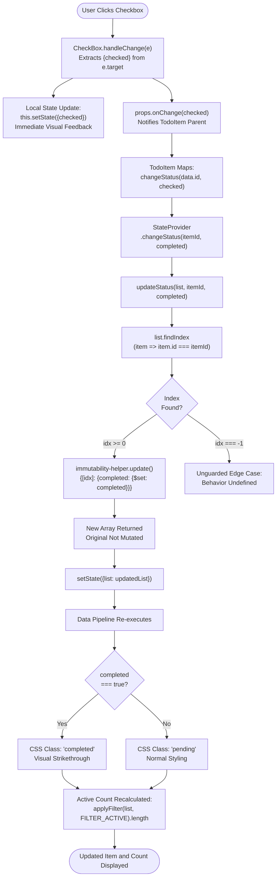
```mermaid
flowchart TD
    Start([User Clicks Checkbox]) --> CBHandler["CheckBox.handleChange(e)<br/>Extracts {checked} from e.target"]

    CBHandler --> LocalState["Local State Update:<br/>this.setState({checked})<br/>Immediate Visual Feedback"]
    CBHandler --> NotifyParent["props.onChange(checked)<br/>Notifies TodoItem Parent"]

    NotifyParent --> ItemMap["TodoItem Maps:<br/>changeStatus(data.id, checked)"]
    ItemMap --> SPAction["StateProvider<br/>.changeStatus(itemId, completed)"]
    SPAction --> SvcCall["updateStatus(list, itemId, completed)"]
    SvcCall --> FindIdx["list.findIndex<br/>(item => item.id === itemId)"]

    FindIdx --> FoundCheck{Index<br/>Found?}
    FoundCheck -->|idx >= 0| ImmUpdate["immutability-helper.update()<br/>{[idx]: {completed: {$set: completed}}}"]
    FoundCheck -->|idx === -1| Unguarded["Unguarded Edge Case:<br/>Behavior Undefined"]

    ImmUpdate --> NewArray["New Array Returned<br/>Original Not Mutated"]
    NewArray --> SetState["setState({list: updatedList})"]
    SetState --> Pipeline["Data Pipeline Re-executes"]
    Pipeline --> CSSApply{completed<br/>=== true?}
    CSSApply -->|Yes| CompletedCSS["CSS Class: 'completed'<br/>Visual Strikethrough"]
    CSSApply -->|No| PendingCSS["CSS Class: 'pending'<br/>Normal Styling"]
    CompletedCSS --> CountUpdate["Active Count Recalculated:<br/>applyFilter(list, FILTER_ACTIVE).length"]
    PendingCSS --> CountUpdate
    CountUpdate --> Done([Updated Item and Count Displayed])
```

**Immutable Update Pattern:** The `updateStatus` function in `src/services/todo.js` uses `immutability-helper`'s `update()` with the `{$set}` command to produce a new array. The original `list` array is never mutated, ensuring predictable state transitions and compatibility with React's shallow comparison in `setState`.

**Dual State Behavior:** The `CheckBox` component maintains a local `checked` state that provides immediate visual feedback via `this.setState({checked})`, independent of the parent state propagation cycle. This means the checkbox UI updates instantly on click, while the full component tree re-render (including active count recalculation and filter application) follows when `StateProvider.setState` triggers reconciliation.

### 4.3.3 Data Processing Pipeline (F-003 and F-004)

The data processing pipeline in `TodoList.js` is the central rendering logic that serves both the Filtered Views (F-003) and Text Search (F-004) features. It implements a strict two-stage transformation: **Stage 1** applies status filtering, and **Stage 2** applies text search on the already-filtered result. An independent computation of the active item count runs in parallel, always using `FILTER_ACTIVE` regardless of the user's selected display filter.

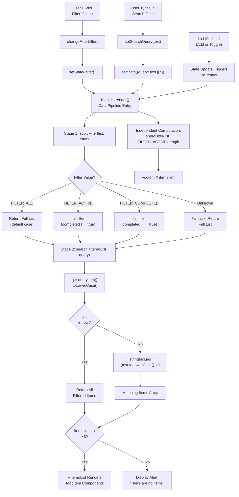
```mermaid
flowchart TD
    TriggerFilter["User Clicks<br/>Filter Option"] --> FilterAct["changeFilter(filter)"]
    TriggerSearch["User Types in<br/>Search Field"] --> SearchAct["setSearchQuery(text)"]
    TriggerList["List Modified<br/>(Add or Toggle)"] --> ListChange["State Update Triggers<br/>Re-render"]

    FilterAct --> FState["setState({filter})"]
    SearchAct --> QState["setState({query: text || ''})"]

    FState --> PEntry["TodoList.render()<br/>Data Pipeline Entry"]
    QState --> PEntry
    ListChange --> PEntry

    PEntry --> Stage1["Stage 1: applyFilter(list, filter)"]

    Stage1 --> FSwitch{Filter Value?}
    FSwitch -->|FILTER_ALL| RetAll["Return Full List<br/>(default case)"]
    FSwitch -->|FILTER_ACTIVE| FiltActive["list.filter<br/>(completed !== true)"]
    FSwitch -->|FILTER_COMPLETED| FiltComp["list.filter<br/>(completed === true)"]
    FSwitch -->|Unknown| FiltDefault["Fallback: Return<br/>Full List"]

    RetAll --> Stage2["Stage 2: search(filteredList, query)"]
    FiltActive --> Stage2
    FiltComp --> Stage2
    FiltDefault --> Stage2

    Stage2 --> TrimLower["q = query.trim()<br/>.toLowerCase()"]
    TrimLower --> QCheck{q is<br/>empty?}
    QCheck -->|Yes| ReturnAll["Return All<br/>Filtered Items"]
    QCheck -->|No| Substring["stringInclues<br/>(text.toLowerCase(), q)"]
    Substring --> Matches["Matching Items Array"]

    ReturnAll --> RenderCheck{items.length<br/>> 0?}
    Matches --> RenderCheck

    RenderCheck -->|Yes| RenderItems["FilteredList Renders<br/>TodoItem Components"]
    RenderCheck -->|No| EmptyMsg["Display Alert:<br/>'There are no items.'"]

    PEntry --> IndependentCalc["Independent Computation:<br/>applyFilter(list, FILTER_ACTIVE).length"]
    IndependentCalc --> FooterDisplay["Footer: 'X items left'"]
```

**Pipeline Ordering Guarantee:** The search function operates on already-filtered results. This means that if a user selects the "Active" filter and types a search query, only active items matching the query substring are displayed. The pipeline expression `search(applyFilter(list, filter), query)` enforces this ordering invariant.

**Filter Behavior Detail:**

| Filter Constant | Value | Predicate | Behavior |
|---|---|---|---|
| `FILTER_ALL` | `'all'` | None (passthrough) | Returns the complete list without modification |
| `FILTER_ACTIVE` | `'active'` | `item.completed !== true` | Returns only incomplete items |
| `FILTER_COMPLETED` | `'completed'` | `item.completed === true` | Returns only completed items |
| Unknown value | Any other string | `default` case | Falls through to return the unfiltered list |

**Search Behavior Detail:**
- Query normalization: `query.trim().toLowerCase()` — case-insensitive, whitespace-trimmed.
- Match algorithm: `stringInclues(text.toLowerCase(), q)` → `str.indexOf(substr) !== -1` — substring containment.
- Empty query: Returns all items because `''.indexOf('') === 0`, which is `!== -1`, so empty strings always match.
- Real-time execution: The pipeline runs on every keystroke as `setSearchQuery` triggers `setState` → re-render.

---

## 4.4 Keyboard Navigation and Mode FSM (F-005)

### 4.4.1 Finite State Machine Definition

The application's interaction model is governed by a three-state finite state machine (FSM) defined in `src/services/mode.js`. The FSM function `getNextModeByKey(currentMode, keyPressed)` is a pure function with no side effects — it accepts the current mode and a key code, and returns the next mode deterministically.

**State Definitions:**

| State Constant | Value | UI Effect | Info Panel Text |
|---|---|---|---|
| `MODE_NONE` | `'none'` | No input field visible | "Press `/` to search and `N` to create a new item." |
| `MODE_CREATE` | `'create'` | `InputBox` rendered with `autoFocus` | "Press `Esc` to cancel." |
| `MODE_SEARCH` | `'search'` | `SearchBox` rendered with `autoFocus` | "Press `Esc` to cancel." |

**Complete Transition Table:**

| Current State | Key Pressed | Next State | Transition Occurs? |
|---|---|---|---|
| `MODE_NONE` | `KEY_N` (78) | `MODE_CREATE` | Yes |
| `MODE_NONE` | `KEY_SLASH` (191) | `MODE_SEARCH` | Yes |
| `MODE_NONE` | Any other key | `MODE_NONE` | No (same state) |
| `MODE_CREATE` | `KEY_ESCAPE` (27) | `MODE_NONE` | Yes |
| `MODE_CREATE` | Any other key | `MODE_CREATE` | No (same state) |
| `MODE_SEARCH` | `KEY_ESCAPE` (27) | `MODE_NONE` | Yes |
| `MODE_SEARCH` | Any other key | `MODE_SEARCH` | No (same state) |

**FSM Constraints:**
- Transitions from `MODE_NONE` to input modes are only possible from `MODE_NONE` — pressing `N` while in `MODE_SEARCH` has no effect (the FSM returns `MODE_SEARCH` unchanged).
- There is no direct transition between `MODE_CREATE` and `MODE_SEARCH` — the user must pass through `MODE_NONE` (press Escape first).
- The application initializes in `MODE_CREATE` (not `MODE_NONE`), so the input box is visible on first load.

### 4.4.2 Mode State Transition Diagram

The following state diagram visualizes all valid transitions within the mode FSM. Self-transitions (same state returned for unmapped keys) are included to show the FSM's no-op behavior for non-triggering keys.

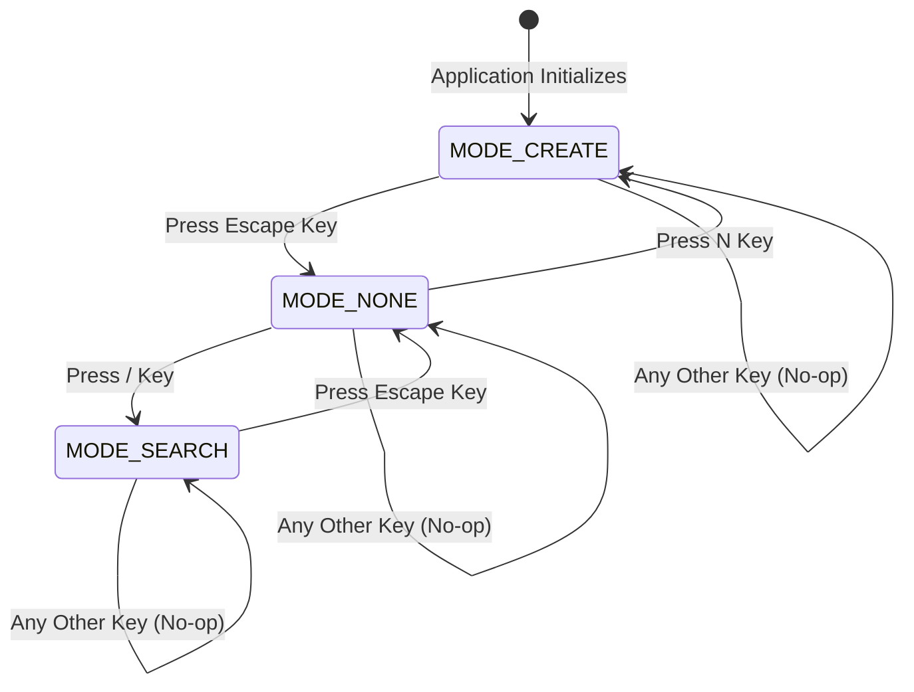
```mermaid
stateDiagram-v2
    [*] --> MODE_CREATE : Application Initializes

    MODE_NONE --> MODE_CREATE : Press N Key
    MODE_NONE --> MODE_SEARCH : Press / Key

    MODE_CREATE --> MODE_NONE : Press Escape Key
    MODE_SEARCH --> MODE_NONE : Press Escape Key

    MODE_NONE --> MODE_NONE : Any Other Key (No-op)
    MODE_CREATE --> MODE_CREATE : Any Other Key (No-op)
    MODE_SEARCH --> MODE_SEARCH : Any Other Key (No-op)
```

**Notable Design Decision:** There is no direct `MODE_CREATE ↔ MODE_SEARCH` transition. Switching between create and search requires an intermediate `Escape` press to return to `MODE_NONE`, then a subsequent `N` or `/` press. This two-step requirement simplifies the FSM and prevents accidental mode switches while typing.

### 4.4.3 Keyboard Event Processing Flow

The `KeyStrokeHandler` component in `src/components/wrappers/KeyStrokeHandler.js` intercepts all keyboard events at the `window` level via a global `keydown` listener registered in `componentWillMount()`. The following flowchart details the event processing logic, including the transition detection guard that prevents unnecessary state updates.

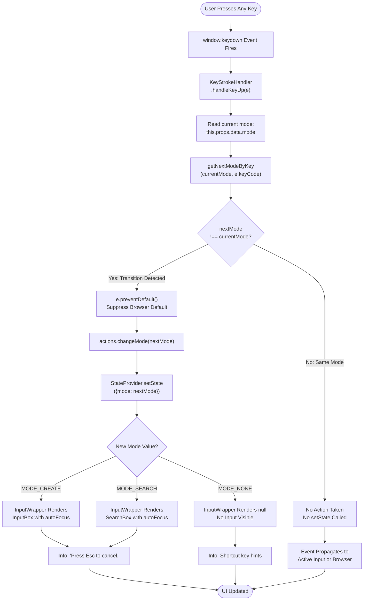
```mermaid
flowchart TD
    KeyPress([User Presses Any Key]) --> WindowEvent["window.keydown Event Fires"]
    WindowEvent --> Handler["KeyStrokeHandler<br/>.handleKeyUp(e)"]
    Handler --> ReadMode["Read current mode:<br/>this.props.data.mode"]
    ReadMode --> CallFSM["getNextModeByKey<br/>(currentMode, e.keyCode)"]
    CallFSM --> Compare{nextMode<br/>!== currentMode?}

    Compare -->|Yes: Transition Detected| PreventDef["e.preventDefault()<br/>Suppress Browser Default"]
    PreventDef --> Dispatch["actions.changeMode(nextMode)"]
    Dispatch --> SetState["StateProvider.setState<br/>({mode: nextMode})"]
    SetState --> ModeEffect{New Mode Value?}

    ModeEffect -->|MODE_CREATE| ShowInput["InputWrapper Renders<br/>InputBox with autoFocus"]
    ModeEffect -->|MODE_SEARCH| ShowSearch["InputWrapper Renders<br/>SearchBox with autoFocus"]
    ModeEffect -->|MODE_NONE| HideInput["InputWrapper Renders null<br/>No Input Visible"]

    ShowInput --> UpdateInfo["Info: 'Press Esc to cancel.'"]
    ShowSearch --> UpdateInfo
    HideInput --> ShowHints["Info: Shortcut key hints"]

    UpdateInfo --> Rendered([UI Updated])
    ShowHints --> Rendered

    Compare -->|No: Same Mode| NoAction["No Action Taken<br/>No setState Called"]
    NoAction --> EventPropagates["Event Propagates to<br/>Active Input or Browser"]
    EventPropagates --> Rendered
```

**Guard Mechanism:** The `nextMode !== mode` comparison (in `KeyStrokeHandler.js`) acts as a critical guard. Without it, every keystroke — including normal typing within the `InputBox` or `SearchBox` — would trigger a state update and re-render. The guard ensures that only actual mode transitions cause state changes, allowing normal text input to proceed uninterrupted.

**Browser Default Suppression:** `e.preventDefault()` is called only when a transition is detected. This prevents the `N` key from typing "N" into an unrelated input, and the `/` key from triggering the browser's built-in "find in page" shortcut. For non-transition keys, the event propagates normally, enabling text entry in active input fields.

---

## 4.5 State Management and Prop Injection (F-008)

### 4.5.1 State Transition Map

`StateProvider.js` is the single source of truth for all application state. Every state mutation is performed through one of five action methods, each producing a new state object via `setState`. The following table maps every action to its state effect.

| Action Method | State Field Modified | Transformation | Service Dependency | Immutability Pattern |
|---|---|---|---|---|
| `addNew(text)` | `list` | Append new item with auto-generated ID | `todo.addToList()` | `Array.concat()` |
| `changeStatus(itemId, completed)` | `list` | Update single item's `completed` field | `todo.updateStatus()` | `immutability-helper.update()` with `{$set}` |
| `changeFilter(filter)` | `filter` | Replace filter constant | None (direct set) | Direct `setState({filter})` |
| `changeMode(mode)` | `mode` | Replace mode constant (default: `MODE_NONE`) | None (direct set) | Direct `setState({mode})` |
| `setSearchQuery(text)` | `query` | Replace query string (normalize falsy to `''`) | None (direct set) | Direct `setState({query: text \|\| ''})` |

**State Integrity Guarantees:**
- No action method modifies more than one state field per invocation.
- All list mutations produce new arrays — the original `list` reference is never modified.
- `changeMode` defaults to `MODE_NONE` when called with no argument, providing a safe fallback.
- `setSearchQuery` normalizes `null`, `undefined`, and `false` values to an empty string via `text || ''`.

### 4.5.2 Prop Injection Mechanism

In the absence of React's Context API (unavailable in React 15.4.2) and without external state management libraries, the application implements a custom prop-injection mechanism using two utility functions from `src/util/common.js`.

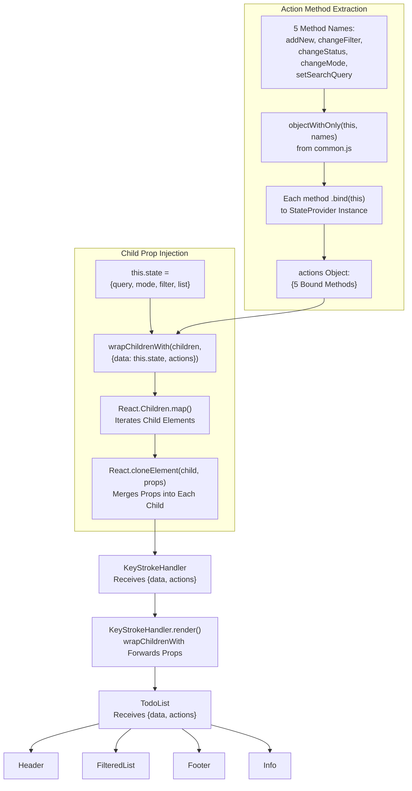
```mermaid
flowchart TD
    subgraph Extraction["Action Method Extraction"]
        Methods["5 Method Names:<br/>addNew, changeFilter,<br/>changeStatus, changeMode,<br/>setSearchQuery"]
        OWO["objectWithOnly(this, names)<br/>from common.js"]
        Bind["Each method .bind(this)<br/>to StateProvider Instance"]
        ActionsObj["actions Object:<br/>{5 Bound Methods}"]

        Methods --> OWO
        OWO --> Bind
        Bind --> ActionsObj
    end

    subgraph Injection["Child Prop Injection"]
        State["this.state =<br/>{query, mode, filter, list}"]
        WCW["wrapChildrenWith(children,<br/>{data: this.state, actions})"]
        ChildMap["React.Children.map()<br/>Iterates Child Elements"]
        Clone["React.cloneElement(child, props)<br/>Merges Props into Each Child"]

        State --> WCW
        WCW --> ChildMap
        ChildMap --> Clone
    end

    ActionsObj --> WCW

    Clone --> KSH["KeyStrokeHandler<br/>Receives {data, actions}"]
    KSH --> KSHFwd["KeyStrokeHandler.render()<br/>wrapChildrenWith Forwards Props"]
    KSHFwd --> TL["TodoList<br/>Receives {data, actions}"]

    TL --> H["Header"]
    TL --> FL["FilteredList"]
    TL --> FT["Footer"]
    TL --> IN["Info"]
```

**`objectWithOnly` Behavior (common.js lines 33–41):** Iterates over the provided method name array, creates a new plain object, and assigns each method with `.bind(object)` to ensure the `this` context always references the `StateProvider` instance regardless of call site. This prevents the common React class component pitfall of lost `this` binding when methods are passed as callbacks.

**`wrapChildrenWith` Behavior (common.js lines 65–67):** Uses `React.Children.map` to safely iterate over the `children` prop (handling single-child and multi-child cases), then `React.cloneElement` to produce a new element with the `{data, actions}` props merged in. The original child element is not mutated.

### 4.5.3 Component Data Distribution

`TodoList.js` acts as the distribution hub, destructuring the received `{data, actions}` prop bundle and selectively passing subsets to each child component. This selective distribution ensures each component receives only the data and actions it needs.

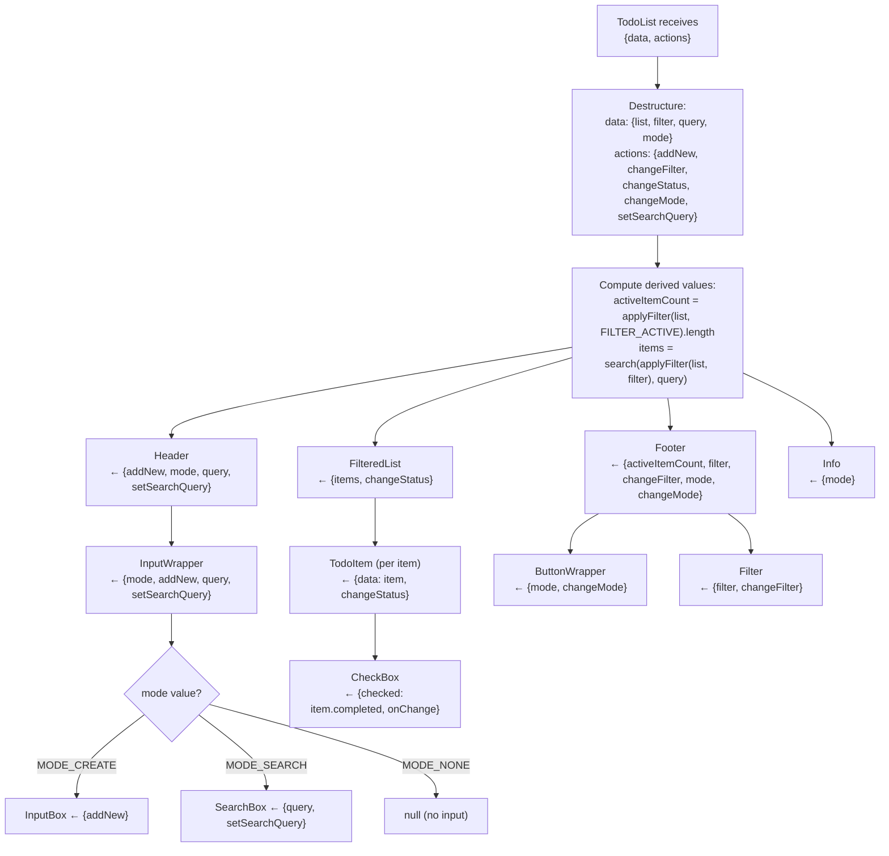
```mermaid
flowchart TD
    TL["TodoList receives<br/>{data, actions}"] --> Destructure["Destructure:<br/>data: {list, filter, query, mode}<br/>actions: {addNew, changeFilter,<br/>changeStatus, changeMode, setSearchQuery}"]

    Destructure --> Compute["Compute derived values:<br/>activeItemCount = applyFilter(list, FILTER_ACTIVE).length<br/>items = search(applyFilter(list, filter), query)"]

    Compute --> HeaderDist["Header<br/>← {addNew, mode, query, setSearchQuery}"]
    Compute --> FLDist["FilteredList<br/>← {items, changeStatus}"]
    Compute --> FooterDist["Footer<br/>← {activeItemCount, filter,<br/>changeFilter, mode, changeMode}"]
    Compute --> InfoDist["Info<br/>← {mode}"]

    HeaderDist --> IW["InputWrapper<br/>← {mode, addNew, query, setSearchQuery}"]
    IW --> IBranch{mode value?}
    IBranch -->|MODE_CREATE| IB["InputBox ← {addNew}"]
    IBranch -->|MODE_SEARCH| SB["SearchBox ← {query, setSearchQuery}"]
    IBranch -->|MODE_NONE| NullRender["null (no input)"]

    FLDist --> TI["TodoItem (per item)<br/>← {data: item, changeStatus}"]
    TI --> CB["CheckBox<br/>← {checked: item.completed, onChange}"]

    FooterDist --> BW["ButtonWrapper<br/>← {mode, changeMode}"]
    FooterDist --> FComp["Filter<br/>← {filter, changeFilter}"]
```

**Distribution Matrix:**

| Component | Data Props Received | Action Props Received |
|---|---|---|
| `Header` | `mode`, `query` | `addNew`, `setSearchQuery` |
| `InputWrapper` | `mode`, `query` | `addNew`, `setSearchQuery` |
| `InputBox` (via HOC) | — | `addNew` |
| `SearchBox` | `query` | `setSearchQuery` |
| `FilteredList` | `items` (computed) | `changeStatus` |
| `TodoItem` | `data` (single item) | `changeStatus` |
| `CheckBox` | `checked` (from item) | `onChange` (mapped to `changeStatus`) |
| `Footer` | `activeItemCount`, `filter`, `mode` | `changeFilter`, `changeMode` |
| `ButtonWrapper` | `mode` | `changeMode` |
| `Filter` | `filter` | `changeFilter` |
| `Info` | `mode` | — |

---

## 4.6 Validation and Error Handling Flows

### 4.6.1 Input Validation Flowchart

The application implements four distinct validation and normalization paths. Because there are no backend services, no network operations, and no database transactions, there are no retry mechanisms, circuit breakers, or fallback services. All validation is synchronous and in-memory.


```mermaid
flowchart TD
    subgraph TextValidation["F-001: Text Input Validation"]
        TV_Enter["User Presses Enter<br/>in InputBox"]
        TV_Trim["text = e.target.value.trim()"]
        TV_Check{text is<br/>truthy?}
        TV_Accept["Proceed to addNew(text)<br/>Item Created"]
        TV_Reject["Silent Rejection:<br/>No item created<br/>No error displayed<br/>Input retains focus"]

        TV_Enter --> TV_Trim
        TV_Trim --> TV_Check
        TV_Check -->|Yes| TV_Accept
        TV_Check -->|No| TV_Reject
    end

    subgraph QueryNormalization["F-004: Query Normalization"]
        QN_Input["Search query received<br/>from SearchBox"]
        QN_Normalize["query = text || ''<br/>Falsy values → empty string"]
        QN_Trim["q = query.trim().toLowerCase()"]
        QN_Empty{q is empty<br/>string?}
        QN_All["Return all filtered items<br/>Empty string always matches"]
        QN_Filter["Apply substring match<br/>via stringInclues"]

        QN_Input --> QN_Normalize
        QN_Normalize --> QN_Trim
        QN_Trim --> QN_Empty
        QN_Empty -->|Yes| QN_All
        QN_Empty -->|No| QN_Filter
    end

    subgraph FilterSafety["F-003: Filter Default Handling"]
        FF_Value["Filter value received<br/>from Filter component"]
        FF_Switch["switch(filter) evaluates<br/>in applyFilter()"]
        FF_Default["default case: return<br/>original unfiltered list"]

        FF_Value --> FF_Switch
        FF_Switch --> FF_Default
    end

    subgraph ModeSafety["F-005: FSM Mode Safety"]
        MS_Key["Any key pressed<br/>during active mode"]
        MS_Eval["getNextModeByKey<br/>returns current mode"]
        MS_Guard["Guard: nextMode !== mode<br/>evaluates to false"]
        MS_NoOp["No setState called<br/>No re-render triggered"]

        MS_Key --> MS_Eval
        MS_Eval --> MS_Guard
        MS_Guard --> MS_NoOp
    end
```

### 4.6.2 Defensive Defaults

The application employs several defensive patterns to prevent error states, even in the absence of explicit error handling infrastructure (no try/catch blocks, no error boundaries, no error state in the state shape).

| Validation Point | Source File | Mechanism | Behavior on Invalid Input |
|---|---|---|---|
| Empty text rejection | `wrapInputBox.js` line 13 | `if (keyCode === KEY_RETURN && text)` | Silent rejection — no action, no error message |
| Query normalization | `StateProvider.js` line 187 | `text \|\| ''` | Falsy values (null, undefined, false, 0) normalized to empty string |
| Empty search passthrough | `filter.js` lines 85–87 | `trim().toLowerCase()` + `indexOf` | Empty query returns all items — `indexOf('')` always returns `0` |
| Unknown filter fallback | `filter.js` lines 61–62 | `switch` `default` case | Unknown filter constants return the unfiltered list |
| FSM no-transition guard | `KeyStrokeHandler.js` lines 93–101 | `nextMode !== mode` check | Unmapped keys cause no state change and no re-render |
| JSX XSS protection | React 15.4.2 runtime | Built-in JSX string escaping | User-entered text is safely rendered without injection risk |

### 4.6.3 Unguarded Paths and System Limitations

Despite the defensive defaults described above, several code paths lack explicit error handling. In a client-only, no-backend SPA with no persistent storage, these paths represent low-risk but technically unguarded edge cases.

| Unguarded Path | Source File | Scenario | Potential Impact |
|---|---|---|---|
| `findIndex` returns `-1` | `todo.js` line 91 | `changeStatus` called with a non-existent `itemId` | `immutability-helper.update()` receives index `-1`; behavior depends on library internals — may silently fail or produce unexpected array mutation |
| No error boundaries | Entire application | Any uncaught JavaScript exception | React 15.x does not support Error Boundaries (`componentDidCatch` was added in React 16); an unhandled exception will crash the component tree |
| No cleanup on unmount | `KeyStrokeHandler.js` | `window.removeEventListener` never called | As a single-page app that never unmounts the root component, this is functionally harmless but technically a resource leak pattern |
| No input length limit | `wrapInputBox.js` / `SearchBox.js` | User enters extremely long text | No maximum character constraint; DOM rendering performance degrades with very large strings |
| No concurrent state guard | `StateProvider.js` | Rapid sequential `setState` calls | React 15.x batches `setState` calls within event handlers, but rapid manual invocations could theoretically see stale state |

**Absent Error Infrastructure:**
- No `try/catch` blocks exist anywhere in the codebase.
- No error notification system or toast messages are implemented.
- No error state field exists in the `StateProvider` state shape.
- No retry logic is present (no network calls exist to retry).
- Data loss on page refresh is intentional per constraint AC-004 — there is no recovery mechanism.

---

## 4.7 End-to-End Integration Sequences

### 4.7.1 Complete User Journey Sequence

The following sequence diagram traces a complete end-to-end user journey encompassing three major workflows: creating a new todo item, toggling its completion status, and filtering the list to view only active items. This demonstrates the full integration path across all architectural layers.

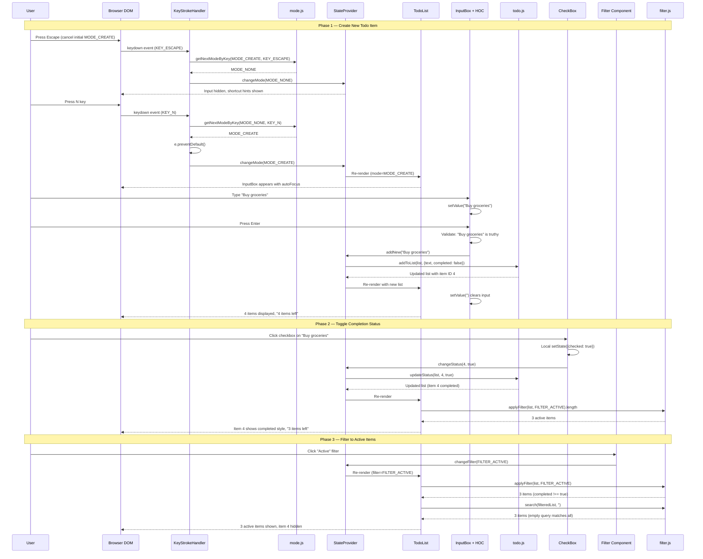
```mermaid
sequenceDiagram
    participant User
    participant Browser as Browser DOM
    participant KSH as KeyStrokeHandler
    participant ModeSvc as mode.js
    participant SP as StateProvider
    participant TL as TodoList
    participant IB as InputBox + HOC
    participant TodoSvc as todo.js
    participant CB as CheckBox
    participant Filt as Filter Component
    participant FilterSvc as filter.js

    Note over User,FilterSvc: Phase 1 — Create New Todo Item

    User->>Browser: Press Escape (cancel initial MODE_CREATE)
    Browser->>KSH: keydown event (KEY_ESCAPE)
    KSH->>ModeSvc: getNextModeByKey(MODE_CREATE, KEY_ESCAPE)
    ModeSvc-->>KSH: MODE_NONE
    KSH->>SP: changeMode(MODE_NONE)
    SP-->>Browser: Input hidden, shortcut hints shown

    User->>Browser: Press N key
    Browser->>KSH: keydown event (KEY_N)
    KSH->>ModeSvc: getNextModeByKey(MODE_NONE, KEY_N)
    ModeSvc-->>KSH: MODE_CREATE
    KSH->>KSH: e.preventDefault()
    KSH->>SP: changeMode(MODE_CREATE)
    SP->>TL: Re-render (mode=MODE_CREATE)
    TL-->>Browser: InputBox appears with autoFocus

    User->>IB: Type "Buy groceries"
    IB->>IB: setValue("Buy groceries")
    User->>IB: Press Enter
    IB->>IB: Validate: "Buy groceries" is truthy
    IB->>SP: addNew("Buy groceries")
    SP->>TodoSvc: addToList(list, {text, completed: false})
    TodoSvc-->>SP: Updated list with item ID 4
    SP->>TL: Re-render with new list
    IB->>IB: setValue('') clears input
    TL-->>Browser: 4 items displayed, "4 items left"

    Note over User,FilterSvc: Phase 2 — Toggle Completion Status

    User->>CB: Click checkbox on "Buy groceries"
    CB->>CB: Local setState({checked: true})
    CB->>SP: changeStatus(4, true)
    SP->>TodoSvc: updateStatus(list, 4, true)
    TodoSvc-->>SP: Updated list (item 4 completed)
    SP->>TL: Re-render
    TL->>FilterSvc: applyFilter(list, FILTER_ACTIVE).length
    FilterSvc-->>TL: 3 active items
    TL-->>Browser: Item 4 shows completed style, "3 items left"

    Note over User,FilterSvc: Phase 3 — Filter to Active Items

    User->>Filt: Click "Active" filter
    Filt->>SP: changeFilter(FILTER_ACTIVE)
    SP->>TL: Re-render (filter=FILTER_ACTIVE)
    TL->>FilterSvc: applyFilter(list, FILTER_ACTIVE)
    FilterSvc-->>TL: 3 items (completed !== true)
    TL->>FilterSvc: search(filteredList, '')
    FilterSvc-->>TL: 3 items (empty query matches all)
    TL-->>Browser: 3 active items shown, item 4 hidden
```

### 4.7.2 Service Layer Integration Map

The three service modules in `src/services/` are pure functions with no React imports, no DOM access, and no side effects. They serve as the business logic layer consumed by wrapper and UI components.

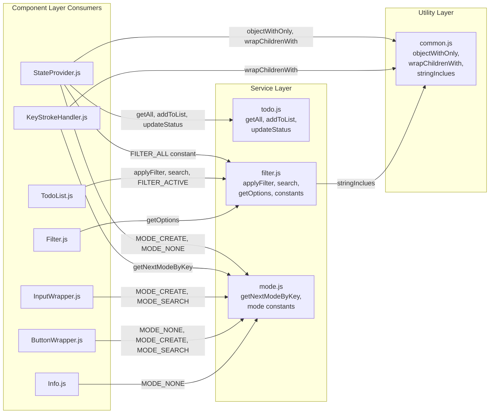
```mermaid
flowchart LR
    subgraph Consumers["Component Layer Consumers"]
        SP["StateProvider.js"]
        KSH["KeyStrokeHandler.js"]
        TL["TodoList.js"]
        FiltUI["Filter.js"]
        IW["InputWrapper.js"]
        BW["ButtonWrapper.js"]
        InfoUI["Info.js"]
    end

    subgraph Services["Service Layer"]
        TodoSvc["todo.js<br/>getAll, addToList,<br/>updateStatus"]
        FilterSvc["filter.js<br/>applyFilter, search,<br/>getOptions, constants"]
        ModeSvc["mode.js<br/>getNextModeByKey,<br/>mode constants"]
    end

    subgraph Utilities["Utility Layer"]
        Common["common.js<br/>objectWithOnly,<br/>wrapChildrenWith,<br/>stringInclues"]
    end

    SP -->|"getAll, addToList, updateStatus"| TodoSvc
    SP -->|"FILTER_ALL constant"| FilterSvc
    SP -->|"MODE_CREATE, MODE_NONE"| ModeSvc
    KSH -->|"getNextModeByKey"| ModeSvc
    TL -->|"applyFilter, search, FILTER_ACTIVE"| FilterSvc
    FiltUI -->|"getOptions"| FilterSvc
    IW -->|"MODE_CREATE, MODE_SEARCH"| ModeSvc
    BW -->|"MODE_NONE, MODE_CREATE, MODE_SEARCH"| ModeSvc
    InfoUI -->|"MODE_NONE"| ModeSvc

    SP -->|"objectWithOnly, wrapChildrenWith"| Common
    KSH -->|"wrapChildrenWith"| Common
    FilterSvc -->|"stringInclues"| Common
```

**Service Purity Guarantee:** All three service modules (`todo.js`, `filter.js`, `mode.js`) adhere to the service layer purity constraint: they contain no React imports, no DOM access, and no side effects. This isolation enables the 72-test unit test suite to cover service logic independently of React component rendering.

### 4.7.3 System Boundary Interactions

As a standalone client-side SPA, the application has exactly two system boundary interactions — both are with the browser environment. No external APIs, backend services, databases, or third-party services are contacted at any point during application operation.

| Boundary | Interaction | Direction | Component | Lifecycle |
|---|---|---|---|---|
| Browser DOM | Mount React component tree to `<div id="root">` | Application → Browser | `src/index.js` via `ReactDOM.render()` | One-time at bootstrap |
| Window Event System | Register global keyboard listener | Application → Browser | `KeyStrokeHandler.js` via `window.addEventListener('keydown')` | One-time in `componentWillMount()` |
| Window Event System | Receive keyboard events | Browser → Application | `KeyStrokeHandler.handleKeyUp()` | Continuous during operation |
| Browser DOM | Render/update component tree | Application → Browser | React reconciler via `setState()` | On every state mutation |
| Bootstrap CDN/Bundle | Load CSS styles | Application → Browser | `src/index.js` CSS imports | One-time at bootstrap |

**Absent Boundaries:**
- No HTTP/HTTPS network boundary (no `fetch`, `XMLHttpRequest`, or WebSocket).
- No localStorage or sessionStorage boundary (no persistent storage).
- No Web Worker or Service Worker boundary (single-thread execution).
- No iframe or cross-origin boundary (single-document application).

---

## 4.8 References

#### Source Files Referenced

- `src/index.js` — Application entry point; `ReactDOM.render()` invocation and CSS import order
- `public/index.html` — HTML shell providing `<div id="root">` mount point
- `src/components/wrappers/App.js` — Root composition shell defining the immutable wrapper chain
- `src/components/wrappers/StateProvider.js` — Centralized state management with 4 fields, 5 actions, and prop injection
- `src/components/wrappers/KeyStrokeHandler.js` — Global keyboard event listener and FSM delegation
- `src/services/todo.js` — Immutable CRUD operations (`getAll`, `addToList`, `updateStatus`, `getNextId`)
- `src/services/filter.js` — Status filtering (`applyFilter`), text search (`search`), filter options (`getOptions`)
- `src/services/mode.js` — FSM definition (`getNextModeByKey`) and mode constants
- `src/util/common.js` — Utility functions (`objectWithOnly`, `wrapChildrenWith`, `stringInclues`)
- `src/components/ui/TodoList.js` — Data pipeline execution and child prop distribution
- `src/components/ui/InputWrapper.js` — Mode-conditional rendering of InputBox, SearchBox, or null
- `src/components/ui/InputBox.js` — Create mode text input (default export is HOC-enhanced)
- `src/components/hoc/wrapInputBox.js` — Recompose HOC providing controlled state, Enter-key handler, and validation
- `src/components/ui/SearchBox.js` — Search mode text input with real-time `onChange` propagation
- `src/components/ui/TodoItem.js` — Per-item rendering with checkbox status delegation
- `src/components/ui/CheckBox.js` — Class component with local `checked` state for immediate feedback
- `src/components/ui/FilteredList.js` — Item list rendering or empty-state message display
- `src/components/ui/Footer.js` — Layout shell for active count, buttons, and filter links
- `src/components/ui/ButtonWrapper.js` — Add and Search mode toggle buttons
- `src/components/ui/Filter.js` — All / Active / Completed filter selection links
- `src/components/ui/Info.js` — Contextual keyboard shortcut guidance text
- `src/components/ui/Header.js` — Title display and InputWrapper pass-through
- `src/assets/text/en_US.js` — Localized string constants (`MSG_NO_ITEMS`, `INFO_SHORTCUT_KEYS`, `INFO_CANCEL_SHORTCUT_KEY`)

#### Folders Referenced

- `src/components/wrappers/` — Wrapper components defining the composition chain and state management
- `src/components/ui/` — Twelve presentational UI components
- `src/components/hoc/` — Higher-order component for input enhancement
- `src/services/` — Three pure service modules containing business logic
- `src/util/` — Shared utility module with prop injection and string matching helpers
- `src/assets/` — Static assets including SVG icons, CSS styles, and locale strings

#### Technical Specification Sections Referenced

- Section 1.2 — System Overview: Five-layer architecture, wrapper chain composition, core technical approach
- Section 1.3 — Scope: In-scope workflows, system boundaries, excluded capabilities
- Section 2.1 — Feature Catalog: All nine features (F-001 through F-009) with technical context and dependencies
- Section 2.2 — Functional Requirements: Validation rules, acceptance criteria, and technical specifications
- Section 2.3 — Feature Relationships: Dependency map, integration points, shared component matrix
- Section 2.4 — Implementation Considerations: Technical constraints, performance baselines, assumptions

# 5. System Architecture

## 5.1 High-Level Architecture

### 5.1.1 System Overview

**react-todo-app** employs a **five-layer client-side Single-Page Application (SPA) architecture** with strictly unidirectional data flow. The system operates as a standalone browser application with no backend services, no API integrations, no persistent storage, and no asynchronous operations (`src/index.js`, `src/components/wrappers/StateProvider.js`). Every runtime operation — from user input to screen update — executes synchronously within a single JavaScript execution context, completing within one animation frame on modern hardware.

#### Architectural Style and Rationale

The architecture is a **pedagogical artifact** intentionally designed around React 15.4.2's API surface. This version lock, established in `package.json` via `"react": "^15.4.2"`, is the foundational constraint from which all other architectural decisions cascade. The absence of Hooks, stable Context API, Fragments, and `createRoot` necessitates the use of class components, Higher-Order Components (HOCs), and a custom prop-injection pattern for state propagation — all patterns that predate modern React idioms but remain foundational to understanding the framework's design philosophy.

#### Key Architectural Principles

| Principle | Implementation Evidence |
|---|---|
| **Unidirectional Data Flow** | State flows downward from `StateProvider.js` through the component tree; mutations travel upward through action callbacks |
| **Single Source of Truth** | `StateProvider.js` owns all four state fields (`query`, `mode`, `filter`, `list`) and all five action methods |
| **Immutable State Discipline** | All list mutations use `Array.concat()` or `immutability-helper`'s `$set` command — direct mutation is prohibited |
| **Service Layer Purity** | `todo.js`, `filter.js`, `mode.js` contain no React imports, no DOM access, and no side effects |

#### System Boundaries

The application's integration surface is minimal by design. It interacts exclusively with the host browser environment through two boundaries: the DOM mount point (`public/index.html` → `<div id="root">`) and the Window Event System (`window.addEventListener('keydown')`). No HTTP, WebSocket, localStorage, sessionStorage, Web Worker, or cross-origin boundaries exist.

### 5.1.2 Five-Layer Architecture Model

The system is organized into five strictly ordered layers, each with defined responsibilities and dependency rules. Dependencies flow downward only — no layer may reference a layer above it.

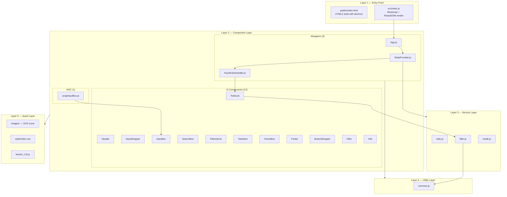
```mermaid
flowchart TD
    subgraph L1["Layer 1 — Entry Point"]
        IndexHTML["public/index.html<br/>HTML5 shell with div#root"]
        IndexJS["src/index.js<br/>Bootstrap + ReactDOM.render"]
    end

    subgraph L2["Layer 2 — Component Layer"]
        subgraph L2W["Wrappers (3)"]
            AppJS["App.js"]
            SProv["StateProvider.js"]
            KSH["KeyStrokeHandler.js"]
        end
        subgraph L2UI["UI Components (12)"]
            TL["TodoList"]
            Header["Header"]
            IW["InputWrapper"]
            IB["InputBox"]
            SB["SearchBox"]
            FL["FilteredList"]
            TI["TodoItem"]
            CB["CheckBox"]
            Ftr["Footer"]
            BW["ButtonWrapper"]
            Filt["Filter"]
            Info["Info"]
        end
        subgraph L2HOC["HOC (1)"]
            WIB["wrapInputBox.js"]
        end
    end

    subgraph L3["Layer 3 — Service Layer"]
        TodoSvc["todo.js"]
        FilterSvc["filter.js"]
        ModeSvc["mode.js"]
    end

    subgraph L4["Layer 4 — Utility Layer"]
        CommonUtil["common.js"]
    end

    subgraph L5["Layer 5 — Asset Layer"]
        Images["images/ — SVG icons"]
        Styles["style/index.css"]
        Locale["text/en_US.js"]
    end

    IndexJS --> AppJS
    AppJS --> SProv
    SProv --> KSH
    KSH --> TL
    TL --> L2UI
    WIB --> IB
    SProv --> L3
    TL --> FilterSvc
    L2W --> L4
    FilterSvc --> CommonUtil
    L2 --> L5
```

| Layer | Component Count | Key Files |
|---|---|---|
| **Entry Point** | 2 | `src/index.js`, `public/index.html` |
| **Component — Wrappers** | 3 | `App.js`, `StateProvider.js`, `KeyStrokeHandler.js` |
| **Component — UI** | 12 | `TodoList`, `Header`, `InputWrapper`, `InputBox`, `SearchBox`, `FilteredList`, `TodoItem`, `CheckBox`, `Footer`, `ButtonWrapper`, `Filter`, `Info` |
| **Component — HOC** | 1 | `wrapInputBox.js` |
| **Service** | 3 | `todo.js`, `filter.js`, `mode.js` |
| **Utility** | 1 | `common.js` |
| **Asset** | 4 | `add.svg`, `search.svg`, `index.css`, `en_US.js` |

### 5.1.3 Core Components

The following table catalogs the primary architectural components, their responsibilities, and their integration characteristics.

#### Wrapper and Orchestration Components

| Component | Primary Responsibility | Key Dependencies |
|---|---|---|
| `src/index.js` | Application bootstrap; mounts root component to DOM via `ReactDOM.render()` | React 15.4.2, ReactDOM, Bootstrap CSS, `App.js` |
| `App.js` | Composition shell enforcing immutable wrapper nesting order | `StateProvider`, `KeyStrokeHandler`, `TodoList` |
| `StateProvider.js` | Single source of truth; state ownership; action binding; prop injection | `todo.js`, `filter.js`, `mode.js`, `common.js` |
| `KeyStrokeHandler.js` | Global keyboard event interception; FSM mode transition delegation | `mode.js`, `common.js`, Window Event API |

#### Data Processing and UI Distribution Components

| Component | Primary Responsibility | Key Dependencies |
|---|---|---|
| `TodoList.js` | UI orchestrator; two-stage data pipeline; child prop distribution | `filter.js` (applyFilter, search) |
| `wrapInputBox.js` | HOC for controlled input state and Enter-key submission | `recompose`, `keycode-js` |
| `InputWrapper.js` | Mode-conditional rendering switch (create/search/null) | `mode.js` (mode constants) |
| `CheckBox.js` | Only UI class component with local state; dual-state toggling | None (self-contained) |

#### Service and Utility Components

| Component | Primary Responsibility | Key Dependencies |
|---|---|---|
| `todo.js` | Immutable todo CRUD operations (getAll, addToList, updateStatus) | `immutability-helper` |
| `filter.js` | Status filtering, text search, filter option enumeration | `common.js` (stringInclues) |
| `mode.js` | Three-state FSM for keyboard mode transitions | `keycode-js` |
| `common.js` | Prop injection utilities and substring matching | React (Children.map, cloneElement) |

### 5.1.4 Data Flow Description

Data flows through the system along a single, deterministic path. The `StateProvider.js` component initializes the application state and propagates it downward through the component tree via a custom prop-injection mechanism. Mutations travel upward through bound action callbacks, converging at `StateProvider.setState()`, which triggers React's reconciliation cycle.

#### State Initialization

At bootstrap, `StateProvider.js` constructs the initial state by importing constants from the service layer: `query` is set to an empty string, `mode` is set to `MODE_CREATE` (imported from `mode.js`), `filter` is set to `FILTER_ALL` (imported from `filter.js`), and `list` is populated by calling `getAll()` from `todo.js`, which returns three seeded items with IDs 1–3.

#### Prop Injection Pipeline

In the absence of React's Context API (unavailable in React 15.4.2), the system implements a custom prop-injection mechanism using two utility functions from `src/util/common.js`:

1. **Action Extraction** — `objectWithOnly(this, [methodNames])` iterates over five method names (`addNew`, `changeFilter`, `changeStatus`, `changeMode`, `setSearchQuery`), creating a new object with each method bound to the `StateProvider` instance via `.bind(this)`.
2. **Child Cloning** — `wrapChildrenWith(children, {data: this.state, actions})` uses `React.Children.map` and `React.cloneElement` to produce new child elements with `{data, actions}` props merged in. The original child element is never mutated.

This pipeline executes on every `StateProvider` render cycle, ensuring all descendants receive the current state snapshot and bound action references.

#### Data Processing Pipeline

`TodoList.js` acts as the data distribution hub. On each render, it destructures the received `{data, actions}` bundle and executes a two-stage pipeline:

1. **Stage 1 — Status Filtering**: `applyFilter(list, filter)` from `filter.js` reduces the list to items matching the selected filter (`FILTER_ALL`, `FILTER_ACTIVE`, or `FILTER_COMPLETED`).
2. **Stage 2 — Text Search**: `search(filteredList, query)` from `filter.js` performs case-insensitive substring matching via `trim().toLowerCase()` and `stringInclues()`.

An independent computation, `applyFilter(list, FILTER_ACTIVE).length`, calculates the active item count regardless of the user's selected filter. The pipeline re-executes on every render cycle — no memoization is applied.

#### State Mutation Cycle

1. A user action (keyboard, click, or text input) generates a DOM event.
2. React's synthetic event system or the global `window.keydown` listener routes the event to the appropriate handler.
3. The handler delegates to a pure service function for business logic computation.
4. The handler calls the corresponding `StateProvider` action method, which invokes `setState()` with immutable update patterns.
5. React's reconciler diffs the virtual DOM and applies minimal DOM updates.
6. `TodoList` re-executes the data pipeline, distributing updated props to its four child subtrees (`Header`, `FilteredList`, `Footer`, `Info`).
7. Updated components render to the browser DOM.

All operations are synchronous, in-memory, and CPU-bound — no I/O occurs at any stage.

### 5.1.5 External Integration Points

As a standalone client-side SPA, the application's external integration surface is deliberately minimal.

| System Name | Integration Type | Data Exchange Pattern |
|---|---|---|
| **Browser DOM** | One-time mount via `ReactDOM.render()` | Application → `<div id="root">` in `public/index.html` |
| **Window Event System** | Global keyboard listener registration | `window.addEventListener('keydown')` in `KeyStrokeHandler.js` |
| **React Reconciler** | Continuous rendering on every `setState()` | Virtual DOM diffing → minimal real DOM updates |
| **Bootstrap 3.4.1** | CSS-only side-effect import at bootstrap | CSS bundle inclusion — no JavaScript plugins or jQuery |

#### Absent Integration Boundaries

The following integration categories are explicitly absent and are not implemented:

- **No HTTP/HTTPS network boundary** — no `fetch`, `XMLHttpRequest`, or WebSocket calls exist.
- **No persistent storage** — no localStorage, sessionStorage, IndexedDB, or database interactions.
- **No Web Worker or Service Worker** — single-thread execution only.
- **No cross-origin or iframe boundary** — single-document application.
- **No authentication or authorization services** — all interactions are unconditionally available.

---

## 5.2 Component Details

### 5.2.1 Entry Point Layer

## `public/index.html` — HTML5 Shell

This file serves as the static HTML document that hosts the entire React application. It defines a single `<div id="root"></div>` element that serves as the mount point for the component tree. The `%PUBLIC_URL%` variable provides deployment portability across different hosting environments. No custom scripts, meta tags beyond CRA defaults, or external CDN references are included.

## `src/index.js` — Application Bootstrap

The entry point file orchestrates the one-time initialization sequence. It imports React 15.4.2 and ReactDOM, loads Bootstrap 3.4.1 CSS via a side-effect import (`import 'bootstrap/dist/css/bootstrap.css'`), loads the custom stylesheet from `src/assets/style/index.css`, and mounts the `<App/>` component to the DOM via a single `ReactDOM.render()` invocation. No lazy loading, code splitting, or deferred initialization is employed.

### 5.2.2 Wrapper Components

The three wrapper components in `src/components/wrappers/` form an immutable composition chain that establishes the application's state management and event handling infrastructure.

## `App.js` — Composition Shell

- **Purpose:** Enforces the strict nesting order `StateProvider → KeyStrokeHandler → TodoList` within its render method.
- **Technologies:** React 15.4.2 class component (77 lines).
- **Key Interface:** No props, no state, no business logic. Render-only component.
- **Critical Constraint:** The nesting order is architecturally immutable — reordering breaks the data flow and event handling pipeline.

## `StateProvider.js` — Centralized State Container

- **Purpose:** Serves as the single source of truth for all application state. Manages four state fields and five action methods. Implements the custom prop-injection pattern via `objectWithOnly()` and `wrapChildrenWith()`.
- **Technologies:** React 15.4.2 `React.Component`, `immutability-helper` (for `$set` command), service imports from `todo.js`, `filter.js`, `mode.js`, and utility imports from `common.js` (192 lines).
- **State Shape:** `{ query: '', mode: MODE_CREATE, filter: FILTER_ALL, list: getAll() }`.
- **Action Methods:** `addNew(text)`, `changeFilter(filter)`, `changeStatus(itemId, completed)`, `changeMode(mode = MODE_NONE)`, `setSearchQuery(text)`.
- **Scaling Note:** As the only stateful wrapper, all state mutations converge at this component. The absence of memoization means every `setState()` call triggers a full pipeline re-execution in `TodoList.js`.

## `KeyStrokeHandler.js` — Global Keyboard Interceptor

- **Purpose:** Captures all keyboard events at the `window` level and delegates mode transitions to the FSM service (`mode.js`).
- **Technologies:** React 15.4.2 class component, `mode.js`, `common.js` (123 lines).
- **Key Interface:** Receives `{data, actions}` from `StateProvider`. Reads `data.mode`, invokes `actions.changeMode(nextMode)` on valid transitions.
- **Lifecycle:** Registers `window.addEventListener('keydown', this.handleKeyUp.bind(this))` in `componentWillMount()` — a deprecated lifecycle method that remains valid in React 15.x.
- **Guard Mechanism:** The `nextMode !== mode` comparison prevents unnecessary state updates on unmapped keys, ensuring normal text input proceeds uninterrupted. `e.preventDefault()` is called only on actual mode transitions to suppress browser defaults (e.g., `/` triggering "find in page").
- **Known Issue:** The `componentWillUnmount()` attempts `window.removeEventListener`, but the bound function reference differs from the registered one, creating a technically unresolved listener leak (functionally harmless in a single-page context that never unmounts root).

### 5.2.3 UI Components

The twelve UI components in `src/components/ui/` are predominantly stateless functional components responsible for rendering and user interaction delegation.

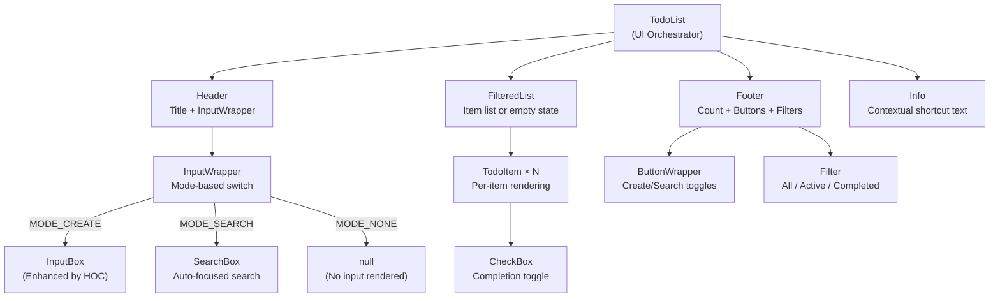
```mermaid
flowchart TD
    TL["TodoList<br/>(UI Orchestrator)"] --> HeaderComp["Header<br/>Title + InputWrapper"]
    TL --> FLComp["FilteredList<br/>Item list or empty state"]
    TL --> FooterComp["Footer<br/>Count + Buttons + Filters"]
    TL --> InfoComp["Info<br/>Contextual shortcut text"]

    HeaderComp --> IWComp["InputWrapper<br/>Mode-based switch"]
    IWComp -->|MODE_CREATE| IBComp["InputBox<br/>(Enhanced by HOC)"]
    IWComp -->|MODE_SEARCH| SBComp["SearchBox<br/>Auto-focused search"]
    IWComp -->|MODE_NONE| NullNode["null<br/>(No input rendered)"]

    FLComp --> TIComp["TodoItem × N<br/>Per-item rendering"]
    TIComp --> CBComp["CheckBox<br/>Completion toggle"]

    FooterComp --> BWComp["ButtonWrapper<br/>Create/Search toggles"]
    FooterComp --> FiltComp["Filter<br/>All / Active / Completed"]
```

#### Key UI Component Details

**TodoList.js** — Serves as the primary UI orchestrator. It destructures the `{data, actions}` bundle received from the wrapper chain, executes the two-stage data pipeline (`search(applyFilter(list, filter), query)`), computes the active item count, and distributes selective prop subsets to its four children: `Header`, `FilteredList`, `Footer`, and `Info`.

**InputWrapper.js** — Implements a mode-conditional rendering switch. When `mode === MODE_CREATE`, it renders `InputBox` with the `addNew` callback. When `mode === MODE_SEARCH`, it renders `SearchBox` with `query` and `setSearchQuery`. When `mode === MODE_NONE`, it renders `null`.

**CheckBox.js** — The only UI class component. It maintains local state (`checked`) synchronized with the parent's `completed` prop via a dual-state pattern: local state provides immediate visual feedback while the parent callback (`changeStatus`) propagates the change to `StateProvider`.

**FilteredList.js** — Renders the computed `items` array as a list of `TodoItem` components, or displays the localized empty-state message (`MSG_NO_ITEMS` from `en_US.js`) when the filtered list is empty.

### 5.2.4 HOC Layer

## `wrapInputBox.js` — Recompose Input Enhancement

- **Purpose:** Injects controlled input state management and keyboard-driven submission behavior into the `InputBox` component via Higher-Order Component composition.
- **Technologies:** `recompose` 0.23.5 (`compose`, `withState`, `withHandlers`), `keycode-js` (`KEY_RETURN`) (22 lines).
- **Injected Props:** `value` (controlled input text), `setValue` (state updater), `handleChange` (onChange → setValue), `handleKeyUp` (Enter detection → addNew → clear).
- **Required Parent Prop:** The `addNew` callback must be provided by the parent component (`InputWrapper`).
- **Behavior:** On Enter keypress, the HOC trims the input text, validates it as truthy, invokes `addNew(text)`, and clears the field via `setValue('')`. Empty or whitespace-only text is silently rejected.
- **Known Issue:** Contains `console.log('got props', props)` in production code — a debug statement that was never removed.

### 5.2.5 Service Layer

The three service modules in `src/services/` form the pure business logic tier. All functions are deterministic with no React imports, no DOM access, and no side effects — a constraint that enables the 72-test unit test suite to cover service logic independently of component rendering.

## `todo.js` — Immutable Todo Operations

- **Exports:** `getAll()`, `getItemById(itemId)`, `updateStatus(items, itemId, completed)`, `addToList(list, data)`.
- **Dependencies:** `immutability-helper` for the `$set` command in `updateStatus()`.
- **ID Generation:** A module-scope counter (`todoCounter`) starting at 1 generates sequential IDs. Since `getAll()` returns three seeded items (IDs 1–3), the first user-created item receives ID 4 (computed as `getAll().length + todoCounter++`).
- **Immutability Patterns:** Additions use `Array.concat()` to produce a new array; status updates use `immutability-helper.update()` with `{$set: {completed}}` to produce a new list with the modified item.
- **Source:** `src/services/todo.js` (153 lines).

## `filter.js` — Status Filtering and Text Search

- **Exports:** `FILTER_ALL`, `FILTER_ACTIVE`, `FILTER_COMPLETED`, `applyFilter(list, filter)`, `search(list, query)`, `getOptions()`.
- **Dependencies:** `common.js` (`stringInclues` for substring matching).
- **Filter Logic:** A switch statement evaluates the filter constant: `FILTER_ACTIVE` returns items where `completed !== true`, `FILTER_COMPLETED` returns items where `completed === true`, and `FILTER_ALL` (and the `default` case) returns the unfiltered list.
- **Search Logic:** Case-insensitive substring matching via `trim().toLowerCase()` and `stringInclues()`. An empty query matches all items due to `indexOf('')` always returning `0`.
- **Source:** `src/services/filter.js` (111 lines).

## `mode.js` — Keyboard Mode FSM

- **Exports:** `MODE_NONE`, `MODE_SEARCH`, `MODE_CREATE`, `getNextModeByKey(current, keyPressed)`.
- **Dependencies:** `keycode-js` (`KEY_SLASH`, `KEY_N`, `KEY_ESCAPE`).
- **FSM States:** Three modes — `'none'` (idle, no input visible), `'search'` (SearchBox rendered with autoFocus), `'create'` (InputBox rendered with autoFocus).
- **Transition Rules:** From `MODE_NONE`, `KEY_N` transitions to `MODE_CREATE` and `KEY_SLASH` transitions to `MODE_SEARCH`. From any non-idle mode, `KEY_ESCAPE` returns to `MODE_NONE`. No direct `MODE_CREATE ↔ MODE_SEARCH` transition exists — the user must pass through `MODE_NONE` first.
- **Source:** `src/services/mode.js` (21 lines).

### 5.2.6 Utility Layer

## `common.js` — Shared Utilities

- **`objectWithOnly(object, attrs)`** — Extracts specified method names from an object, binding each to the source object's `this` context. Used by `StateProvider.js` to create the bound `actions` object.
- **`wrapChildrenWith(children, props)`** — Clones React child elements with merged props using `React.Children.map` and `React.cloneElement`. Used by both `StateProvider.js` and `KeyStrokeHandler.js` for prop forwarding.
- **`stringInclues(str, substr)`** — Performs substring inclusion check. The intentional misspelling of "Includes" is preserved for backward compatibility. Used by `filter.js` for text search.
- **Source:** `src/util/common.js` (85 lines).

### 5.2.7 Asset Layer

The asset layer at `src/assets/` provides static resources consumed by the component layer:

| Asset | Path | Purpose |
|---|---|---|
| **Add Icon** | `src/assets/images/add.svg` | SVG icon for the create mode button |
| **Search Icon** | `src/assets/images/search.svg` | SVG icon for the search mode button |
| **Custom Styles** | `src/assets/style/index.css` | CSS overrides extending Bootstrap 3.4.1 base styles |
| **Locale Strings** | `src/assets/text/en_US.js` | Three English constants: `MSG_NO_ITEMS`, `INFO_SHORTCUT_KEYS`, `INFO_CANCEL_SHORTCUT_KEY` |

### 5.2.8 Component Interaction — Wrapper Composition Sequence

The following sequence diagram traces the complete initialization and first-render flow across all architectural layers, from browser load through the initial UI display.

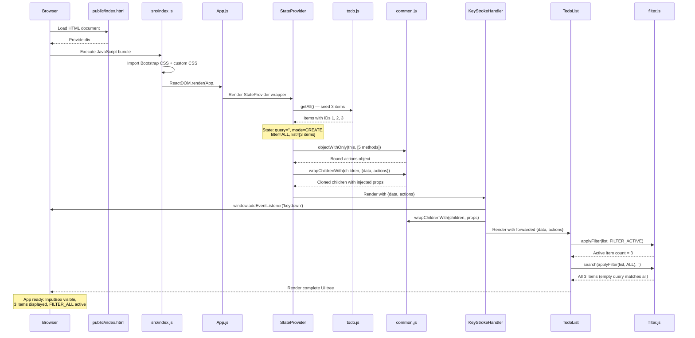
```mermaid
sequenceDiagram
    participant Browser
    participant HTML as public/index.html
    participant Entry as src/index.js
    participant App as App.js
    participant SP as StateProvider
    participant TodoSvc as todo.js
    participant Util as common.js
    participant KSH as KeyStrokeHandler
    participant TL as TodoList
    participant FilterSvc as filter.js

    Browser->>HTML: Load HTML document
    HTML-->>Browser: Provide div#root mount point
    Browser->>Entry: Execute JavaScript bundle
    Entry->>Entry: Import Bootstrap CSS + custom CSS
    Entry->>App: ReactDOM.render(App, #root)
    App->>SP: Render StateProvider wrapper
    SP->>TodoSvc: getAll() — seed 3 items
    TodoSvc-->>SP: Items with IDs 1, 2, 3
    Note over SP: State: query='', mode=CREATE,<br/>filter=ALL, list=[3 items]
    SP->>Util: objectWithOnly(this, [5 methods])
    Util-->>SP: Bound actions object
    SP->>Util: wrapChildrenWith(children, {data, actions})
    Util-->>SP: Cloned children with injected props
    SP->>KSH: Render with {data, actions}
    KSH->>Browser: window.addEventListener('keydown')
    KSH->>Util: wrapChildrenWith(children, props)
    KSH->>TL: Render with forwarded {data, actions}
    TL->>FilterSvc: applyFilter(list, FILTER_ACTIVE)
    FilterSvc-->>TL: Active item count = 3
    TL->>FilterSvc: search(applyFilter(list, ALL), '')
    FilterSvc-->>TL: All 3 items (empty query matches all)
    TL-->>Browser: Render complete UI tree
    Note over Browser: App ready: InputBox visible,<br/>3 items displayed, FILTER_ALL active
```

### 5.2.9 Keyboard Mode FSM — State Transitions

The application's interaction model is governed by a three-state finite state machine defined in `src/services/mode.js`. The FSM function `getNextModeByKey(currentMode, keyPressed)` is a pure function with no side effects.

```mermaid
stateDiagram-v2
    [*] --> MODE_CREATE : Application Initializes

    MODE_NONE --> MODE_CREATE : KEY_N (78)
    MODE_NONE --> MODE_SEARCH : KEY_SLASH (191)

    MODE_CREATE --> MODE_NONE : KEY_ESCAPE (27)
    MODE_SEARCH --> MODE_NONE : KEY_ESCAPE (27)

    MODE_NONE --> MODE_NONE : Any Other Key (No-op)
    MODE_CREATE --> MODE_CREATE : Any Other Key (No-op)
    MODE_SEARCH --> MODE_SEARCH : Any Other Key (No-op)
```

| Current State | Trigger Key | Next State |
|---|---|---|
| `MODE_NONE` | `KEY_N` (78) | `MODE_CREATE` |
| `MODE_NONE` | `KEY_SLASH` (191) | `MODE_SEARCH` |
| `MODE_CREATE` | `KEY_ESCAPE` (27) | `MODE_NONE` |
| `MODE_SEARCH` | `KEY_ESCAPE` (27) | `MODE_NONE` |
| Any state | Any other key | Same state (no-op) |

The application initializes in `MODE_CREATE` rather than `MODE_NONE`, meaning the input box is visible immediately on first load. There is no direct `MODE_CREATE ↔ MODE_SEARCH` transition — switching between input modes requires an intermediate `Escape` press to return to `MODE_NONE`.

### 5.2.10 End-to-End User Journey — Sequence Diagram

The following diagram traces a representative user journey spanning three core workflows: creating a new todo item, toggling its completion status, and filtering the list.

```mermaid
sequenceDiagram
    participant User
    participant KSH as KeyStrokeHandler
    participant ModeSvc as mode.js
    participant SP as StateProvider
    participant TL as TodoList
    participant HOC as InputBox + HOC
    participant TodoSvc as todo.js
    participant CB as CheckBox
    participant FilterUI as Filter Component
    participant FilterSvc as filter.js

    Note over User,FilterSvc: Phase 1 — Create New Item

    User->>KSH: Press N key
    KSH->>ModeSvc: getNextModeByKey(NONE, KEY_N)
    ModeSvc-->>KSH: MODE_CREATE
    KSH->>SP: changeMode(MODE_CREATE)
    SP->>TL: Re-render (InputBox appears)

    User->>HOC: Type "Buy groceries" + Enter
    HOC->>HOC: Validate text is truthy
    HOC->>SP: addNew("Buy groceries")
    SP->>TodoSvc: addToList(list, {text, completed: false})
    TodoSvc-->>SP: List with new item (ID 4)
    SP->>TL: Re-render with updated list

    Note over User,FilterSvc: Phase 2 — Toggle Status

    User->>CB: Click checkbox on item 4
    CB->>SP: changeStatus(4, true)
    SP->>TodoSvc: updateStatus(list, 4, true)
    TodoSvc-->>SP: Updated list
    SP->>TL: Re-render (item 4 completed)

    Note over User,FilterSvc: Phase 3 — Filter Active

    User->>FilterUI: Click "Active" filter
    FilterUI->>SP: changeFilter(FILTER_ACTIVE)
    SP->>TL: Re-render (filter=ACTIVE)
    TL->>FilterSvc: applyFilter + search pipeline
    FilterSvc-->>TL: 3 active items
    TL-->>User: Item 4 hidden from view
```

---

## 5.3 Technical Decisions

### 5.3.1 Architecture Decision Summary

The following table summarizes the key architectural decisions, their rationale, and the tradeoffs they introduce. Each decision is driven by the project's core purpose as a pedagogical artifact for React 15.x patterns.

| Decision | Chosen Approach | Rationale |
|---|---|---|
| Architecture style | Five-layer client-side SPA | Educational clarity; isolates concerns across well-defined layers |
| State management | Custom prop injection via `objectWithOnly` + `wrapChildrenWith` | React 15.x lacks stable Context API; teaches foundational patterns |
| State immutability | `Array.concat()` + `immutability-helper` `$set` | Predictable state transitions; React reconciliation compatibility |
| Component abstraction | HOC via `recompose` | React 15.x lacks Hooks; teaches pre-Hooks abstraction strategy |
| React version | 15.4.2 (intentional lock) | Pedagogical target for class-component/HOC curriculum |
| Build system | CRA `react-scripts` 0.9.0 (never eject) | Zero-config simplicity for educational use |
| Backend/persistence | None | Focused client-side React learning; data loss intentional |
| CSS framework | Bootstrap 3.4.1 CSS-only | Responsive grid without JavaScript/jQuery dependencies |

### 5.3.2 Architecture Style Decision

**Decision:** Custom five-layer client-side SPA with no external state management library.

**Context:** The project serves as an educational workshop curriculum that teaches React 15.x class-component patterns, HOC composition, and manual prop injection. The architecture deliberately avoids Redux, MobX, Zustand, and all modern React patterns to focus learners on foundational concepts.

**Consequences:**
- **Positive:** Clear separation of concerns across five layers; explicit data flow traceable from `StateProvider` to leaf components; no "magic" from third-party state libraries.
- **Negative:** Prop-drilling limitations for deeply nested components; lack of deep injection without Context API; scalability constrained to educational dataset sizes.

### 5.3.3 State Management Pattern Decision

**Decision:** Custom prop-injection mechanism using `objectWithOnly()` for selective method extraction and `wrapChildrenWith()` for React child cloning with merged props.

**Context:** React 15.4.2 does not provide a stable Context API. The experimental context API available in React 15.x was explicitly documented as unstable and subject to breaking changes. External state libraries (Redux, MobX) were intentionally excluded to teach the underlying pattern.

**Mechanism:** `StateProvider` extracts five bound action methods into an `actions` object, then clones its children with `{data: this.state, actions}` merged as props. `KeyStrokeHandler` repeats this forwarding pattern to propagate props further down the tree. `TodoList` destructures the bundle and selectively distributes subsets to its children.

**Consequences:**
- **Positive:** Full control over data propagation; explicit dependency graph; no hidden subscriptions or observers.
- **Negative:** Props must be manually forwarded at each wrapper level; adding new state fields requires updating the forwarding chain; no selective re-rendering optimization.

### 5.3.4 Immutable State Strategy Decision

**Decision:** All state mutations use immutable update patterns — `Array.concat()` for additions and `immutability-helper`'s `$set` command for in-place updates.

**Context:** React's reconciliation model performs shallow comparison to detect state changes. Direct mutation of state objects would bypass change detection and cause rendering inconsistencies.

**Implementation in `src/services/todo.js`:**
- `addToList()` produces a new array via `list.concat(newItem)`.
- `updateStatus()` locates the item index via `findIndex`, then applies `immutability-helper.update(items, { [index]: { completed: { $set: completed } } })`.

**Consequences:**
- **Positive:** Predictable state transitions; compatibility with React's reconciliation; simple mental model for learners.
- **Negative:** Additional library dependency (`immutability-helper`); slightly more verbose update syntax than direct mutation.

### 5.3.5 HOC Pattern Decision

**Decision:** Use `recompose` library (v0.23.5) for Higher-Order Component composition in `wrapInputBox.js`.

**Context:** React 15.x does not support Hooks. The `recompose` library, though deprecated since October 2018 (with the author recommending migration to Hooks), provides a clean API for composing multiple HOC behaviors (`withState`, `withHandlers`). It teaches the pre-Hooks abstraction pattern that was the dominant React composition strategy from 2015 to 2019.

**Consequences:**
- **Positive:** Teaches a historically significant React pattern; demonstrates declarative composition of stateful behavior.
- **Negative:** Deprecated library with no active maintenance; creates an additional abstraction layer that may confuse learners unfamiliar with HOC patterns.

### 5.3.6 Version Lock and Build Boundary Decisions

**Decision:** Intentional version lock at React 15.4.2; CRA `react-scripts` 0.9.0 pinned without caret prefix; ejection explicitly forbidden.

**Cascading Impacts of the React 15.4.2 Lock:**

| Forced Pattern | Modern Alternative |
|---|---|
| `React.Component` class syntax | Functional components with Hooks |
| `componentWillMount` lifecycle | `useEffect` Hook |
| `ReactDOM.render()` mount | `createRoot().render()` |
| `<div>` wrappers for multiple children | React Fragments (`<>...</>`) |
| HOC composition | Custom Hooks |
| Manual prop injection | `useContext` Hook + Context API |

**Consequences:**
- **Positive:** Preserves zero-config build environment; deterministic builds via exact pinning; no Webpack/Babel/ESLint configuration drift.
- **Negative:** 196 known npm vulnerabilities (71 critical, 52 high) from legacy transitive dependencies; `--legacy-peer-deps` flag required for `npm install`.

### 5.3.7 Architecture Decision Flow

```mermaid
flowchart TD
    Root{{"Project Purpose:<br/>Educational React Workshop"}}
    Root --> VersionDecision{{"Target API Surface?"}}
    VersionDecision --> React15["React 15.4.2<br/>(Pre-Hooks, Pre-Context)"]

    React15 --> StateDecision{{"State Management<br/>Approach?"}}
    StateDecision -->|No Redux/MobX| CustomProp["Custom Prop Injection<br/>objectWithOnly + wrapChildrenWith"]
    StateDecision -->|No Context API| CustomProp

    React15 --> ComponentDecision{{"Component Abstraction?"}}
    ComponentDecision -->|No Hooks available| HOCPattern["HOC via Recompose<br/>(compose, withState, withHandlers)"]

    React15 --> BuildDecision{{"Build Toolchain?"}}
    BuildDecision --> CRA["CRA react-scripts 0.9.0<br/>(Never Eject)"]

    React15 --> BackendDecision{{"Backend Required?"}}
    BackendDecision -->|Educational Focus| NoBackend["No Backend, No Persistence<br/>In-Memory State Only"]

    CustomProp --> ImmutDecision{{"State Update Strategy?"}}
    ImmutDecision --> Immutable["Immutable Patterns<br/>concat + immutability-helper"]

    NoBackend --> CSSDecision{{"Styling Approach?"}}
    CSSDecision --> Bootstrap["Bootstrap 3.4.1<br/>CSS-Only (No jQuery)"]
```

---

## 5.4 Cross-Cutting Concerns

### 5.4.1 Error Handling Patterns

#### 5.4.1.1 Defensive Strategy Overview

The application employs a **defensive defaults** strategy rather than explicit error handling infrastructure. No `try/catch` blocks, no error boundaries (React 15.x does not support `componentDidCatch`), no error state field in the `StateProvider` state shape, and no error notification system exist anywhere in the codebase.

Instead, the system relies on input validation gates and safe fallback behaviors at each critical decision point:

| Validation Point | Source File | Defensive Mechanism |
|---|---|---|
| Empty text rejection | `wrapInputBox.js` | `if (keyCode === KEY_RETURN && text)` — silent rejection on empty/whitespace input |
| Query normalization | `StateProvider.js` | `text \|\| ''` — normalizes null, undefined, and false to empty string |
| Empty search passthrough | `filter.js` | `indexOf('')` always returns 0 — empty query matches all items |
| Unknown filter fallback | `filter.js` | `switch` `default` case returns the unfiltered list |
| FSM no-transition guard | `KeyStrokeHandler.js` | `nextMode !== mode` — unmapped keys cause no state change or re-render |
| XSS mitigation | React 15.4.2 runtime | Built-in JSX string escaping prevents injection via user-entered text |

#### 5.4.1.2 Error Handling Flow

```mermaid
flowchart TD
    UserAction([User Action]) --> ActionType{Action Type?}

    ActionType -->|Text Submission| TrimText["Trim input text"]
    TrimText --> CheckTruthy{Text is<br/>truthy?}
    CheckTruthy -->|Yes| ProceedAdd["Invoke addNew(text)"]
    CheckTruthy -->|No| SilentReject["Silent rejection:<br/>no action, no error message"]
    SilentReject --> RetainFocus["Input retains focus"]

    ActionType -->|Search Query| NormalizeQuery["Normalize: text OR empty string"]
    NormalizeQuery --> TrimLower["trim().toLowerCase()"]
    TrimLower --> EmptyCheck{Query is<br/>empty?}
    EmptyCheck -->|Yes| ReturnAll["Return all filtered items"]
    EmptyCheck -->|No| SubstringMatch["Apply stringInclues<br/>substring matching"]

    ActionType -->|Filter Change| EvalSwitch["Evaluate switch(filter)"]
    EvalSwitch --> KnownFilter{Known filter<br/>constant?}
    KnownFilter -->|Yes| ApplyFilter["Apply status predicate"]
    KnownFilter -->|No| DefaultFallback["Default: return<br/>unfiltered list"]

    ActionType -->|Keyboard Event| EvalFSM["getNextModeByKey<br/>(current, keyCode)"]
    EvalFSM --> TransitionCheck{nextMode !==<br/>currentMode?}
    TransitionCheck -->|Yes| UpdateMode["changeMode(nextMode)"]
    TransitionCheck -->|No| NoOp["No-op: event<br/>propagates normally"]

    ProceedAdd --> SetState["StateProvider.setState()"]
    ReturnAll --> Render["Re-render UI"]
    SubstringMatch --> Render
    ApplyFilter --> Render
    DefaultFallback --> Render
    UpdateMode --> SetState
    SetState --> Render
```

#### 5.4.1.3 Unguarded Edge Cases

Despite the defensive defaults, several code paths lack explicit error handling:

| Unguarded Path | Source File | Potential Impact |
|---|---|---|
| `findIndex` returns `-1` for non-existent `itemId` | `todo.js` | `immutability-helper.update()` receives index `-1`; behavior is undefined |
| No Error Boundaries | Entire application | Uncaught exceptions crash the entire component tree (React 15.x limitation) |
| Event listener leak | `KeyStrokeHandler.js` | `removeEventListener` receives a different function reference than `addEventListener` |
| No input length limit | `wrapInputBox.js`, `SearchBox.js` | Extremely long text degrades DOM rendering performance |

### 5.4.2 Security Framework

#### 5.4.2.1 Security Posture

The application's security posture reflects its educational purpose and client-only scope:

| Security Aspect | Assessment |
|---|---|
| **Authentication** | None — no user identity or access control exists |
| **Authorization** | None — all interactions are unconditionally available |
| **Data Sensitivity** | No sensitive data; all state is transient and client-local |
| **XSS Protection** | React's built-in JSX escaping mitigates injection via user input |
| **CSRF Protection** | Not applicable — no server-side operations or form submissions |

#### 5.4.2.2 Dependency Vulnerability Surface

The legacy dependency tree carries 196 known npm vulnerabilities (71 critical, 52 high), all originating from `react-scripts 0.9.0`'s transitive dependencies — not from the direct application dependencies. This vulnerability surface is accepted because:

1. No sensitive data is handled (no authentication, no persistent storage).
2. All state is transient and client-local with no server-side exposure.
3. React's JSX escaping mitigates XSS through user input.
4. The project serves an educational purpose and is not deployed to production infrastructure.

### 5.4.3 Performance Characteristics

#### 5.4.3.1 Runtime Performance

All operations are synchronous, in-memory, and CPU-bound. The complete event-to-render cycle completes within a single animation frame on modern hardware.

| Characteristic | Current State | Implication |
|---|---|---|
| **Synchronous execution** | No `fetch`, `Promise`, `setTimeout` | No I/O latency; no retry or timeout considerations |
| **No memoization** | `applyFilter` and `search` execute on every render | Performance degrades linearly with list size |
| **No list virtualization** | Full DOM re-rendering on every state change | Large lists cause proportional DOM update overhead |
| **No lazy loading** | All components loaded synchronously at start | Initial load includes entire application bundle |

#### 5.4.3.2 Build Output Baselines

| Metric | Baseline Value |
|---|---|
| JavaScript bundle (gzipped) | 53.95 KB |
| CSS bundle (gzipped) | 19.33 KB |
| Unit test pass rate | 72/72 (100%) |
| Test execution time | 0.432 seconds |
| ESLint violations | 0 |

### 5.4.4 Testing Strategy

#### 5.4.4.1 Test Coverage

The testing framework is Jest (bundled within `react-scripts 0.9.0`) with the jsdom environment for browser DOM simulation. The test suite comprises 72 tests with a 100% pass rate and 0.432-second execution time.

| Test File | Coverage Target |
|---|---|
| `src/__tests__/services/todo.test.js` | Todo CRUD operations: `getAll`, `getItemById`, `updateStatus`, `addToList` |
| `src/__tests__/services/filter.test.js` | Filter logic: `applyFilter`, `search`, `getOptions` |
| `src/__tests__/services/mode.test.js` | FSM transitions: `getNextModeByKey` |
| `src/__tests__/util/common.test.js` | Utilities: `objectWithOnly`, `wrapChildrenWith`, `stringInclues` |

**Coverage Gap:** Component-level rendering tests and integration tests are not currently implemented. Test coverage is limited to the service layer and utility layer — the two layers with pure, side-effect-free functions that are independently testable without React component mounting.

### 5.4.5 Build and Deployment

The build system operates entirely within the Create React App zero-config boundary. The project must never be ejected — no custom Webpack, Babel, or ESLint configuration files are permitted.

| Build Aspect | Specification |
|---|---|
| **Build tool** | `react-scripts 0.9.0` (Webpack, Babel, ESLint, autoprefixer encapsulated) |
| **Node.js runtime** | 20.x (Maintenance LTS) — build-time only, not a production server |
| **Install command** | `npm install --legacy-peer-deps` (required for legacy peer dependency conflicts) |
| **Output format** | Static SPA bundle (HTML, CSS, JS, SVG) deployable to any static file server |

| npm Script | Command | Purpose |
|---|---|---|
| `start` | `react-scripts start` | Development server with hot module replacement |
| `build` | `react-scripts build` | Production-optimized bundle generation |
| `test` | `react-scripts test --env=jsdom` | Jest test runner with jsdom simulation |
| `eject` | `react-scripts eject` | **EXPLICITLY FORBIDDEN** |

No containerization (Docker), CI/CD pipelines, infrastructure-as-code, or cloud deployment configurations are present. The build output is a static bundle that requires no server-side runtime.

### 5.4.6 Assumptions and Constraints

| ID | Statement | Type |
|---|---|---|
| AC-001 | Users operate in a modern browser with JavaScript enabled | Assumption |
| AC-002 | Seeded dataset contains exactly 3 items (IDs 1–3); counter starts at 4 | Constraint |
| AC-003 | No concurrent users or multi-tab synchronization required | Assumption |
| AC-004 | Data loss on page refresh is acceptable and intentional | Constraint |
| AC-005 | Application will not be upgraded beyond React 15.4.2 | Constraint |
| AC-006 | Bootstrap is CSS-only — no JavaScript plugins or jQuery | Constraint |

---

## 5.5 References

- `src/index.js` — Application entry point; ReactDOM.render invocation and CSS imports
- `public/index.html` — HTML5 shell with div#root mount point
- `src/components/wrappers/App.js` — Root composition shell defining immutable wrapper nesting order
- `src/components/wrappers/StateProvider.js` — Centralized state container; 4 state fields, 5 action methods, prop injection mechanism
- `src/components/wrappers/KeyStrokeHandler.js` — Global keyboard handler; FSM delegation and event guard
- `src/components/ui/TodoList.js` — UI orchestrator; two-stage data pipeline and child prop distribution
- `src/components/ui/InputWrapper.js` — Mode-conditional rendering switch
- `src/components/ui/CheckBox.js` — Only UI class component; dual-state toggling pattern
- `src/components/hoc/wrapInputBox.js` — Recompose HOC for controlled input state and Enter-key submission
- `src/services/todo.js` — Immutable todo CRUD operations with module-scope ID counter
- `src/services/filter.js` — Status filtering, text search, and filter option enumeration
- `src/services/mode.js` — Three-state FSM for keyboard mode transitions
- `src/util/common.js` — Prop injection utilities (objectWithOnly, wrapChildrenWith) and substring matching (stringInclues)
- `src/assets/text/en_US.js` — Localized English constants for UI text
- `src/assets/style/index.css` — Custom CSS extending Bootstrap 3.4.1
- `src/assets/images/` — SVG icons (add.svg, search.svg)
- `src/__tests__/services/` — Jest unit tests for service layer (todo, filter, mode)
- `src/__tests__/util/common.test.js` — Jest unit tests for utility functions
- `package.json` — Dependency manifest, npm scripts, project metadata
- Tech Spec §1.1 — Executive Summary (project context and value proposition)
- Tech Spec §1.2 — System Overview (five-layer architecture, success criteria)
- Tech Spec §2.4 — Implementation Considerations (constraints, performance, security)
- Tech Spec §3.2 — Frameworks & Libraries (React 15.4.2 API surface, supporting libraries)
- Tech Spec §3.3 — Open Source Dependencies (package inventory, vulnerability assessment)
- Tech Spec §3.6 — Development & Deployment (build system, testing, infrastructure)
- Tech Spec §4.1 — High-Level System Workflow (lifecycle, interaction entry points)
- Tech Spec §4.2 — Application Bootstrap Flow (initialization sequence, composition chain)
- Tech Spec §4.4 — Keyboard Navigation and Mode FSM (state transitions, event processing)
- Tech Spec §4.5 — State Management and Prop Injection (state transitions, prop mechanism)
- Tech Spec §4.6 — Validation and Error Handling Flows (defensive defaults, unguarded paths)
- Tech Spec §4.7 — End-to-End Integration Sequences (user journey, service integration map)

# 6. SYSTEM COMPONENTS DESIGN

## 6.1 Core Services Architecture

#### Infrastructure & Services

## 6.1 Core Services Architecture

### 6.1.1 Applicability Determination

**Core Services Architecture is not applicable for this system.**

The **react-todo-app** (v0.1.0) is a standalone, client-side Single-Page Application (SPA) built on React 15.4.2 that operates entirely within the browser. It contains no backend services, no microservices, no distributed components, no API integrations, no persistent storage, and no server-side infrastructure of any kind. Consequently, the standard Core Services Architecture concerns — service boundaries, inter-service communication, service discovery, load balancing, circuit breakers, scalability design, and resilience patterns — do not apply to this system.

This determination is grounded in exhaustive evidence gathered from the project's source code, dependency manifest, build configuration, and architectural documentation. The subsections below provide a structured, evidence-based rationale for each area of inapplicability.

### 6.1.2 Architectural Classification

#### 6.1.2.1 System Architecture Type

The application is classified as a **five-layer client-side SPA** with strictly unidirectional data flow. As documented in the High-Level Architecture (Section 5.1), the system operates as "a standalone browser application with no backend services, no API integrations, no persistent storage, and no asynchronous operations." Every runtime operation — from user input to screen update — executes synchronously within a single JavaScript execution context, completing within one animation frame on modern hardware.

The System Overview (Section 1.2) further confirms that the application operates as a "standalone client-side SPA with no backend services, API integrations, or persistent storage layers," with an integration surface limited to the browser DOM, Bootstrap CSS, and a Node.js build toolchain used exclusively at build time.

#### 6.1.2.2 Intentional Design Rationale

The absence of backend services is an intentional architectural decision, not an implementation gap. As established in Section 5.3, the project is a **pedagogical artifact** that deliberately targets the React 15.x API surface to teach foundational class-component and Higher-Order Component (HOC) patterns. The architecture decision flow in Section 5.3.7 explicitly traces the "Backend Required?" decision node to the outcome: "No Backend, No Persistence — In-Memory State Only," driven by the project's educational focus.

This is further codified as constraint **AC-004** (Section 5.4.6): "Data loss on page refresh is acceptable and intentional."

#### 6.1.2.3 Client-Side Architecture Overview

For context, the following diagram illustrates the actual system architecture — a browser-contained, layered structure with no external service dependencies:

```mermaid
flowchart TD
    subgraph BrowserRuntime["Browser Runtime Environment"]
        subgraph L1["Layer 1 — Entry Point"]
            IndexHTML["public/index.html<br/>HTML5 Shell"]
            IndexJS["src/index.js<br/>ReactDOM.render()"]
        end

        subgraph L2["Layer 2 — Component Layer"]
            Wrappers["Wrappers (3)<br/>App.js, StateProvider.js,<br/>KeyStrokeHandler.js"]
            UIComponents["UI Components (12)<br/>TodoList, Header, Footer, etc."]
            HOC["HOC (1)<br/>wrapInputBox.js"]
        end

        subgraph L3["Layer 3 — Service Layer"]
            TodoSvc["todo.js<br/>Immutable CRUD"]
            FilterSvc["filter.js<br/>Status Filtering & Search"]
            ModeSvc["mode.js<br/>Keyboard Mode FSM"]
        end

        subgraph L4["Layer 4 — Utility Layer"]
            CommonUtil["common.js<br/>Prop Injection Helpers"]
        end

        subgraph L5["Layer 5 — Asset Layer"]
            Assets["SVG Icons, CSS, Locale Strings"]
        end

        IndexJS --> Wrappers
        Wrappers --> UIComponents
        HOC --> UIComponents
        Wrappers --> L3
        UIComponents --> FilterSvc
        Wrappers --> CommonUtil
        FilterSvc --> CommonUtil
        L2 --> Assets
    end

    subgraph AbsentBoundaries["Absent External Boundaries"]
        NoHTTP["No HTTP/HTTPS Calls"]
        NoStorage["No Persistent Storage"]
        NoWorkers["No Web/Service Workers"]
        NoAuth["No Auth Services"]
        NoCloud["No Cloud Infrastructure"]
    end

    BrowserRuntime -.->|"None"| AbsentBoundaries

    style AbsentBoundaries fill:#f9f0f0,stroke:#cc0000,stroke-dasharray: 5 5
    style NoHTTP fill:#ffe0e0,stroke:#cc0000
    style NoStorage fill:#ffe0e0,stroke:#cc0000
    style NoWorkers fill:#ffe0e0,stroke:#cc0000
    style NoAuth fill:#ffe0e0,stroke:#cc0000
    style NoCloud fill:#ffe0e0,stroke:#cc0000
```

All five layers execute exclusively within the browser. Dependencies flow downward only. There are no outbound network calls, no inbound API endpoints, and no communication with any external service.

### 6.1.3 Service Components — Inapplicability Analysis

#### 6.1.3.1 Absent Service Infrastructure

The following table documents each standard Core Services Architecture topic and the specific evidence confirming its inapplicability to this system:

| Topic | Status | Evidence |
|---|---|---|
| Service Boundaries | Not applicable | No backend services exist; single browser execution context (`src/index.js`) |
| Inter-Service Communication | Not applicable | No network calls; all module interaction via synchronous ES6 imports |
| Service Discovery | Not applicable | All modules statically imported at build time; no runtime discovery |
| Load Balancing | Not applicable | No server infrastructure; static SPA served as files |

| Topic | Status | Evidence |
|---|---|---|
| Circuit Breaker Patterns | Not applicable | No network I/O; all operations are synchronous and in-memory |
| Retry / Fallback Mechanisms | Not applicable | No `fetch`, `XMLHttpRequest`, `Promise`, or `setTimeout` in codebase |
| API Gateway | Not applicable | No REST, GraphQL, or WebSocket endpoints |
| Message Queues | Not applicable | No asynchronous messaging; no event bus beyond React's synthetic events |

#### 6.1.3.2 Clarification: The `src/services/` Directory

A critical disambiguation is necessary regarding the `src/services/` directory. Despite its name, this folder contains **client-side pure JavaScript business logic modules** — not backend services or microservices. These modules are stateless, side-effect-free utility functions that operate exclusively on in-memory data structures:

| Module | Purpose | Characteristics |
|---|---|---|
| `todo.js` | Immutable todo CRUD operations (`getAll`, `addToList`, `updateStatus`) | No React imports, no DOM access, no I/O |
| `filter.js` | Status filtering (`applyFilter`) and text search (`search`) | Pure functions operating on arrays |
| `mode.js` | Keyboard mode FSM transitions (`getNextModeByKey`) | Deterministic state machine; no side effects |

These modules are invoked synchronously by React components within the browser. They perform no network communication, no database queries, and no file system operations. The "service" nomenclature follows a common front-end convention for extracting business logic out of UI components — it does not imply backend or distributed service architecture.

#### 6.1.3.3 Communication Pattern

The only "inter-module communication" in this system is synchronous JavaScript function invocation via ES6 `import` statements. The following diagram illustrates the actual data flow pattern, which is fundamentally different from inter-service communication in a distributed system:

```mermaid
flowchart LR
    subgraph SynchronousInvocation["Synchronous In-Process Communication"]
        SP["StateProvider.js<br/>(State Owner)"]
        TodoSvc["todo.js"]
        FilterSvc["filter.js"]
        ModeSvc["mode.js"]
        CommonUtil["common.js"]

        SP -->|"import & call"| TodoSvc
        SP -->|"import & call"| FilterSvc
        SP -->|"import & call"| ModeSvc
        SP -->|"import & call"| CommonUtil
        FilterSvc -->|"import & call"| CommonUtil
    end

    Note["All calls are synchronous<br/>ES6 import + function invocation<br/>Single JavaScript thread<br/>No network, no IPC, no serialization"]

    style Note fill:#f0f8ff,stroke:#4a86c8
    style SynchronousInvocation fill:#f8fdf8,stroke:#2d8a2d
```

### 6.1.4 Scalability Design — Inapplicability Analysis

#### 6.1.4.1 Client-Side Execution Model

Scalability design for backend services is not applicable because this application has no server-side resources to scale. Each user runs an independent, isolated instance of the application within their own browser tab. There is no shared state, no shared infrastructure, and no server-side computation.

| Scalability Topic | Status | Rationale |
|---|---|---|
| Horizontal Scaling | Not applicable | No server instances to replicate |
| Vertical Scaling | Not applicable | No server resources to augment |
| Auto-Scaling Triggers | Not applicable | No server-side metrics to monitor |
| Resource Allocation | Not applicable | All computation occurs in the user's browser |

#### 6.1.4.2 Inherent Client-Side "Scaling"

The client-side SPA model provides an implicit form of horizontal scaling: every browser tab that loads the application constitutes an independent instance with its own memory, state, and computation. This eliminates server-side scaling concerns entirely but introduces client-side performance characteristics documented in Section 5.4.3:

| Characteristic | Current State | Impact |
|---|---|---|
| Synchronous execution | No `fetch`, `Promise`, `setTimeout` | No I/O latency concerns |
| No memoization | `applyFilter` and `search` re-execute every render | Performance degrades linearly with list size |
| No list virtualization | Full DOM re-rendering on state change | Large lists cause proportional DOM overhead |
| No lazy loading | Entire bundle loaded at startup | 53.95 KB JS + 19.33 KB CSS gzipped |

These are client-side rendering performance considerations, not service scalability concerns. They are addressed in full in Section 5.4 (Cross-Cutting Concerns).

### 6.1.5 Resilience Patterns — Inapplicability Analysis

#### 6.1.5.1 Absent Resilience Infrastructure

Distributed resilience patterns — fault tolerance, disaster recovery, data redundancy, failover, and service degradation — are not applicable because there are no distributed components, no persistent data, and no server-side infrastructure to protect.

| Resilience Topic | Status | Rationale |
|---|---|---|
| Fault Tolerance | Not applicable | No distributed components; no Error Boundaries (React 15.x limitation) |
| Disaster Recovery | Not applicable | No persistent data to recover; data loss on refresh is intentional (AC-004) |
| Data Redundancy | Not applicable | Single in-memory state in `StateProvider.js`; no replication targets |
| Failover Configuration | Not applicable | No servers, replicas, or failover targets |
| Service Degradation | Not applicable | Monolithic client-side app; no services to degrade gracefully |

#### 6.1.5.2 Client-Side Error Handling

While distributed resilience patterns do not apply, the application does implement a **defensive defaults** strategy for client-side error handling. This is not a service resilience pattern but rather a set of input validation gates and safe fallback behaviors documented in Section 5.4.1. Key mechanisms include:

- **Empty text rejection** in `wrapInputBox.js` via truthiness check before submission
- **Query normalization** in `StateProvider.js` via `text || ''` fallback
- **Unknown filter fallback** in `filter.js` via `switch` default case returning the unfiltered list
- **FSM no-transition guard** in `KeyStrokeHandler.js` preventing state changes on unmapped keys
- **XSS mitigation** via React 15.4.2's built-in JSX string escaping

These mechanisms operate within a single browser thread and do not constitute service-level resilience patterns.

### 6.1.6 Excluded Infrastructure Summary

The following comprehensive table consolidates all infrastructure and service categories confirmed as absent from this system, with cross-references to the authoritative specification sections:

| Category | Excluded Items | Reference |
|---|---|---|
| Backend Frameworks | Express, Flask, Django, Spring, Go | Section 3.8 |
| Backend Languages | Python, Java, Go, Ruby | Section 3.8 |
| Databases | MongoDB, PostgreSQL, MySQL, Redis | Sections 3.5, 3.8 |

| Category | Excluded Items | Reference |
|---|---|---|
| Authentication | Auth0, OAuth, JWT | Sections 3.4, 3.8 |
| Cloud Platforms | AWS, GCP, Azure | Sections 3.6, 3.8 |
| Containerization | Docker, Kubernetes | Section 3.6 |

| Category | Excluded Items | Reference |
|---|---|---|
| CI/CD | GitHub Actions, Jenkins, Travis CI | Sections 1.3, 3.6 |
| Infrastructure as Code | Terraform, CloudFormation | Sections 3.6, 3.8 |
| SSR Frameworks | Next.js, Gatsby, Remix | Section 3.8 |

| Category | Excluded Items | Reference |
|---|---|---|
| API Technologies | REST, GraphQL, WebSocket | Sections 3.4, 5.1 |
| Message Queues | RabbitMQ, Kafka, SQS | Not present |
| Monitoring | Error tracking, APM, analytics | Section 3.4 |

### 6.1.7 Deployment Topology

The production deployment of this application involves no service architecture. The build output is a static SPA bundle deployable to any static file server:

```mermaid
flowchart LR
    subgraph BuildPhase["Build Phase (Development Only)"]
        NodeJS["Node.js 20.x<br/>(Build Runtime Only)"]
        CRA["react-scripts 0.9.0<br/>(Webpack + Babel + ESLint)"]
        NodeJS --> CRA
    end

    CRA -->|"npm run build"| Bundle["Static Bundle<br/>HTML + CSS + JS + SVG"]

    subgraph ProductionServing["Production Serving"]
        StaticHost["Any Static File Server<br/>(No server-side runtime required)"]
    end

    Bundle --> StaticHost

    subgraph ClientExecution["Client Execution"]
        Browser["User's Browser<br/>(Independent Instance)"]
    end

    StaticHost -->|"HTTP GET static files"| Browser

    style BuildPhase fill:#fff8e0,stroke:#b8860b
    style ProductionServing fill:#f0f8ff,stroke:#4a86c8
    style ClientExecution fill:#f0fff0,stroke:#2d8a2d
```

As confirmed in Section 3.6, Node.js serves exclusively as the build-time runtime — "not used as a server." The build output is "a static SPA bundle (HTML, CSS, JavaScript, SVG assets) deployable to any static file server." No server-side runtime or specialized hosting infrastructure is required.

### 6.1.8 Conclusion

The react-todo-app is a pedagogical, browser-contained Single-Page Application with no backend services, distributed components, or server-side infrastructure. All nine features (F-001 through F-009) are implemented entirely within client-side React components and pure JavaScript service modules executing synchronously in the browser. The `src/services/` directory contains front-end business logic utilities — not backend services. Data is held exclusively in React component state within `StateProvider.js`, with intentional loss on page refresh.

For these reasons, all standard Core Services Architecture topics — service boundaries, inter-service communication, service discovery, load balancing, circuit breakers, scalability design, and resilience patterns — are confirmed as not applicable to this system.

---

#### References

- `src/index.js` — Application bootstrap confirming pure client-side `ReactDOM.render()` mount with no server-side logic
- `package.json` — Dependency manifest confirming all dependencies are client-side libraries; no server frameworks
- `src/services/todo.js` — Pure JavaScript CRUD operations with no network I/O
- `src/services/filter.js` — Pure filtering and search functions with no external dependencies
- `src/services/mode.js` — Deterministic keyboard FSM with no side effects
- `src/components/wrappers/StateProvider.js` — Centralized in-memory state container; sole source of application data
- `src/util/common.js` — Prop injection utilities operating within the React component tree
- `public/index.html` — HTML5 shell with `<div id="root">` mount point; no server-side templates
- **Section 1.1 (Executive Summary)** — Project classification as educational SPA on React 15.4.2
- **Section 1.2 (System Overview)** — Standalone client-side SPA confirmation; five-layer architecture
- **Section 1.3 (Scope)** — Explicit exclusion of server-side components, persistence, and cloud infrastructure
- **Section 3.4 (Third-Party Services)** — Zero external service dependencies confirmation
- **Section 3.5 (Databases & Storage)** — Intentional absence of all persistence mechanisms
- **Section 3.6 (Development & Deployment)** — No containerization, CI/CD, cloud platform, or server runtime
- **Section 3.8 (Excluded Default Stack Technologies)** — Comprehensive exclusion catalog of backend and infrastructure technologies
- **Section 5.1 (High-Level Architecture)** — Five-layer client-side architecture with no backend
- **Section 5.3 (Technical Decisions)** — Architecture decision records confirming "No Backend, No Persistence" as intentional
- **Section 5.4 (Cross-Cutting Concerns)** — Defensive error handling strategy; client-side performance characteristics

## 6.2 Database Design

### 6.2.1 Applicability Determination

**Database Design is not applicable to this system.**

The **react-todo-app** (v0.1.0) is a standalone, client-side Single-Page Application built on React 15.4.2 that operates entirely within the browser. It contains no database, no persistent storage layer, no server-side infrastructure, and no data retention mechanisms of any kind. This is a deliberate, codified architectural decision — not a gap or missing feature — driven by the project's purpose as a pedagogical artifact for teaching React 15.x class-component and Higher-Order Component (HOC) patterns.

All application data resides exclusively in React component state within `src/components/wrappers/StateProvider.js`. The state is initialized from hardcoded seed data on every page load and is irrecoverably discarded upon page refresh. This behavior is formally documented as architectural constraint **AC-004**: *"Data loss on page refresh is acceptable and intentional"* (Section 5.4.6).

The subsections below provide a structured, evidence-based rationale for each area of inapplicability, document the in-memory state architecture that replaces traditional database design, and map every standard database design topic to its determination with supporting evidence.

---

### 6.2.2 Architectural Rationale

#### 6.2.2.1 Intentional Design Decision

The absence of a database is an explicit architectural choice made at the project's inception. As documented in Section 5.3.1, Architecture Decision #7 records: Backend/persistence — **None** — "Focused client-side React learning; data loss intentional." The architecture decision flow in Section 5.3.7 traces from the root decision node ("Project Purpose: Educational React Workshop") through the "Backend Required?" gate to the outcome: **"No Backend, No Persistence — In-Memory State Only."**

#### 6.2.2.2 Constraint Codification

The intentional data transience is formally codified across multiple specification sections:

| Constraint ID | Statement | Source |
|---|---|---|
| AC-004 | Data loss on page refresh is acceptable and intentional | Section 5.4.6 |
| AC-003 | No concurrent users or multi-tab synchronization required | Section 5.4.6 |
| AC-005 | Application will not be upgraded beyond React 15.4.2 | Section 5.4.6 |

#### 6.2.2.3 System Classification

Section 1.2.1 classifies the application as a "standalone client-side SPA with no backend services, API integrations, or persistent storage layers." Section 5.1 further confirms: "No HTTP, WebSocket, localStorage, sessionStorage, Web Worker, or cross-origin boundaries exist." The integration surface is limited exclusively to the browser DOM, Bootstrap CSS, and a Node.js build toolchain used only at development time.

---

### 6.2.3 Excluded Storage Mechanisms

#### 6.2.3.1 Comprehensive Exclusion Catalog

As documented in Section 3.5.1, data persistence is **explicitly excluded** from this system by design. The following table enumerates every storage mechanism category and the specific rationale for its exclusion:

| Storage Mechanism | Status | Rationale |
|---|---|---|
| Relational Database (PostgreSQL, MySQL) | Excluded | No server-side component exists |
| Document Database (MongoDB) | Excluded | No backend or persistence layer |
| localStorage / sessionStorage | Not used | Intentional data transience for pedagogical clarity |
| IndexedDB | Not used | No offline storage requirements |

| Storage Mechanism | Status | Rationale |
|---|---|---|
| Server-Side Session Storage | Not applicable | No server exists |
| Caching Solutions | Not implemented | No memoization, service workers, or CDN caching |
| In-Memory Data Stores (Redis) | Excluded | No server-side infrastructure |
| File-System Storage | Not applicable | No server-side component to perform file I/O |

#### 6.2.3.2 Excluded Database Technologies

Section 3.8 provides a comprehensive catalog of excluded technologies. All database and persistence technologies are confirmed absent:

| Category | Excluded Technologies | Confirmation |
|---|---|---|
| Databases | MongoDB, PostgreSQL, MySQL, Redis | No persistence layer |
| Backend Frameworks | Express, Flask, Django, Spring | No backend exists |
| Cloud Platforms | AWS, GCP, Azure | No cloud infrastructure |
| Containerization | Docker, Kubernetes | No container configuration |

#### 6.2.3.3 Dependency Verification

Analysis of `package.json` confirms that all six runtime dependencies are client-side-only libraries with no persistence capabilities:

| Dependency | Version | Purpose |
|---|---|---|
| `react` | ^15.4.2 | UI component framework |
| `react-dom` | ^15.4.2 | Browser DOM rendering |
| `bootstrap` | ^3.4.1 | CSS-only responsive grid |
| `immutability-helper` | ^2.1.1 | Immutable state update patterns |

| Dependency | Version | Purpose |
|---|---|---|
| `keycode-js` | ^0.0.4 | Keyboard key code constants |
| `recompose` | ^0.23.5 | HOC composition utilities |
| `react-scripts` (dev) | 0.9.0 | Build toolchain (development only) |

No database drivers (e.g., `pg`, `mysql2`, `mongoose`), ORMs (e.g., `sequelize`, `typeorm`, `prisma`), HTTP clients (e.g., `axios`, `node-fetch`), or storage utilities exist in the dependency tree. Additionally, a comprehensive grep across all 22 JavaScript source files for persistence-related keywords (`localStorage`, `sessionStorage`, `IndexedDB`, `fetch`, `XMLHttpRequest`, `database`, `persist`, `cache`, `storage`) returned **zero matches**.

---

### 6.2.4 In-Memory State Architecture

#### 6.2.4.1 Overview

In lieu of a traditional database, the react-todo-app employs a purely in-memory state architecture managed by a single React class component. `StateProvider.js` (192 lines) serves as the sole data container for the entire application — functioning as both the "data store" and the "query engine" within the browser's JavaScript execution context.

#### 6.2.4.2 State Shape (Data Model)

As documented in Section 3.5.2, all application data resides in four state fields within `StateProvider.js`:

| Field | Type | Initial Value | Purpose |
|---|---|---|---|
| `query` | String | `''` (empty) | Current search query text |
| `mode` | String | `MODE_CREATE` | Active keyboard interaction mode (FSM state) |
| `filter` | String | `FILTER_ALL` | Active filter selection (All / Active / Completed) |
| `list` | Array | 3 seeded items (IDs 1–3) | Complete todo item collection |

#### 6.2.4.3 Todo Item Structure (Entity Schema)

Each todo item within the `list` array conforms to the following structure, as defined in `src/services/todo.js` (153 lines):

| Property | Type | Constraints | Description |
|---|---|---|---|
| `id` | Number | Auto-incremented, unique per session | Client-side sequential integer (starts at 1) |
| `text` | String | Non-empty (enforced by `wrapInputBox.js`) | Todo item description |
| `completed` | Boolean | Default: `false` | Completion status flag |

The ID generation mechanism uses a module-scope counter (`todoCounter`) in `todo.js` that starts at 1. Since `getAll()` returns three seeded items with IDs 1–3, the first user-created item receives ID 4. This counter resets to its initial value on every page reload — there is no persistence of the sequence state.

#### 6.2.4.4 State Entity Relationship Diagram

The following diagram illustrates the in-memory data model relationships. Although no database exists, this ERD documents the logical entity structure as it exists within React component state:

```mermaid
erDiagram
    STATE_PROVIDER {
        string query
        string mode
        string filter
    }
    TODO_ITEM {
        number id PK
        string text
        boolean completed
    }
    SEED_DATA {
        number count
        string source
    }

    STATE_PROVIDER ||--o{ TODO_ITEM : "contains (list[])"
    SEED_DATA ||--|{ TODO_ITEM : "initializes (3 items)"
```

#### 6.2.4.5 Action Methods (Data Mutation Interface)

Five action methods defined in `StateProvider.js` constitute the complete mutation interface for the in-memory state — analogous to stored procedures in a traditional database:

| Action Method | Operation | Analogous DB Operation |
|---|---|---|
| `addNew(text)` | Appends new todo item via `list.concat()` | INSERT |
| `changeStatus(itemId, completed)` | Updates item via `immutability-helper` `$set` | UPDATE |
| `changeFilter(filter)` | Sets the active filter constant | N/A (UI state) |
| `changeMode(mode)` | Sets the active keyboard mode | N/A (UI state) |
| `setSearchQuery(text)` | Sets the search query string | N/A (UI state) |

All mutations follow immutable update patterns — `Array.concat()` for additions and `immutability-helper`'s `$set` command for in-place updates — ensuring predictable state transitions compatible with React 15.x's reconciliation model.

---

### 6.2.5 Data Lifecycle

#### 6.2.5.1 Lifecycle Overview

The data lifecycle in this system is fundamentally transient. Data is created from hardcoded seed values at page load, mutated in memory during the user session, and irrecoverably destroyed on page refresh or tab closure. There is no persistence checkpoint at any stage.

#### 6.2.5.2 Data Lifecycle Flow

```mermaid
flowchart TD
    subgraph Initialization["Phase 1 — Initialization"]
        PageLoad([Browser Loads Page])
        ReactMount["ReactDOM.render() mounts App tree"]
        SPConstructor["StateProvider constructor executes"]
        GetAll["getAll() returns 3 hardcoded seed items"]
        InitState["State initialized:<br/>query='', mode=MODE_CREATE,<br/>filter=FILTER_ALL, list=[3 items]"]

        PageLoad --> ReactMount
        ReactMount --> SPConstructor
        SPConstructor --> GetAll
        GetAll --> InitState
    end

    subgraph ActiveSession["Phase 2 — Active Session"]
        UserAction([User Interaction])
        ActionMethod["Action method invoked<br/>(addNew, changeStatus, etc.)"]
        ImmutableUpdate["Immutable state update<br/>(concat / $set)"]
        SetState["StateProvider.setState()"]
        ReRender["React re-renders component tree"]

        UserAction --> ActionMethod
        ActionMethod --> ImmutableUpdate
        ImmutableUpdate --> SetState
        SetState --> ReRender
        ReRender --> UserAction
    end

    subgraph Termination["Phase 3 — Termination"]
        RefreshClose([Page Refresh or Tab Close])
        StateDestroyed["All in-memory state destroyed"]
        NoRecovery["No recovery possible<br/>(AC-004: Data loss intentional)"]

        RefreshClose --> StateDestroyed
        StateDestroyed --> NoRecovery
    end

    InitState --> UserAction
    NoRecovery -.->|"Next page load"| PageLoad

    style Termination fill:#fff0f0,stroke:#cc0000
    style NoRecovery fill:#ffe0e0,stroke:#cc0000
```

#### 6.2.5.3 Data Flow Through Service Layer

The in-memory data is operated upon by three stateless service modules that act as the "query and transformation" layer:

```mermaid
flowchart LR
    subgraph DataSource["In-Memory Data Source"]
        SP["StateProvider.js<br/>(state.list)"]
    end

    subgraph ServiceLayer["Service Layer — Pure Functions"]
        TodoSvc["todo.js<br/>getAll, addToList,<br/>updateStatus, getItemById"]
        FilterSvc["filter.js<br/>applyFilter, search,<br/>getOptions"]
        ModeSvc["mode.js<br/>getNextModeByKey"]
    end

    subgraph Utilities["Utility Layer"]
        CommonUtil["common.js<br/>objectWithOnly,<br/>wrapChildrenWith,<br/>stringInclues"]
    end

    SP -->|"import & call"| TodoSvc
    SP -->|"import & call"| FilterSvc
    SP -->|"import & call"| ModeSvc
    FilterSvc -->|"import & call"| CommonUtil

    style DataSource fill:#e8f4e8,stroke:#2d8a2d
    style ServiceLayer fill:#e8f0f8,stroke:#4a86c8
    style Utilities fill:#f8f0e8,stroke:#b8860b
```

All service module calls are **synchronous ES6 import-and-invoke** operations. No network calls, no asynchronous operations, and no serialization/deserialization occur at any point in the data flow.

---

### 6.2.6 Standard Database Topics — Inapplicability Matrix

#### 6.2.6.1 Schema Design Topics

The following table maps each standard schema design concern to its determination for this system:

| Topic | Status | Evidence |
|---|---|---|
| Entity Relationships | Not applicable | No database entities; in-memory arrays only (`todo.js`) |
| Indexing Strategy | Not applicable | No database indexes; array lookup via `findIndex()` |
| Partitioning Approach | Not applicable | Single in-memory array; no data distribution |
| Replication Configuration | Not applicable | No replication targets (Section 6.1.5.1) |

| Topic | Status | Evidence |
|---|---|---|
| Backup Architecture | Not applicable | No persistent data to back up; data loss intentional (AC-004) |
| Schema Versioning | Not applicable | No schema; state shape defined in component constructor |
| Foreign Key Constraints | Not applicable | Todo items have no relational dependencies |
| Stored Procedures | Not applicable | Action methods in `StateProvider.js` serve analogous role in-memory |

#### 6.2.6.2 Data Management Topics

| Topic | Status | Evidence |
|---|---|---|
| Migration Procedures | Not applicable | No database schema to migrate |
| Versioning Strategy | Not applicable | State shape is code-defined; no ORM or migration tooling |
| Archival Policies | Not applicable | All data is transient; no long-term storage |
| Caching Policies | Not applicable | No memoization, service workers, or CDN caching (Section 3.5.1) |

#### 6.2.6.3 Compliance Considerations

| Topic | Status | Evidence |
|---|---|---|
| Data Retention Rules | Not applicable | No data persists beyond browser session (AC-004) |
| Backup and Fault Tolerance | Not applicable | No persistent data; no replication targets (Section 6.1.5.1) |
| Privacy Controls | Not applicable | No user identity, no sensitive data (Section 5.4.2.1) |
| Audit Mechanisms | Not applicable | No authentication, no persistent state changes to audit |

| Topic | Status | Evidence |
|---|---|---|
| Access Controls | Not applicable | No authorization; all interactions unconditionally available |
| GDPR / Data Protection | Not applicable | No personal data collected or stored |
| Encryption at Rest | Not applicable | No persistent data to encrypt |
| Encryption in Transit | Not applicable | No server communication; no API calls |

#### 6.2.6.4 Performance Optimization Topics

| Topic | Status | Evidence |
|---|---|---|
| Query Optimization | Not applicable | No database queries; `Array.findIndex()` and `Array.filter()` on in-memory arrays |
| Connection Pooling | Not applicable | No database connections |
| Read/Write Splitting | Not applicable | Single-threaded in-memory state; no read replicas |
| Batch Processing | Not applicable | All operations are individual, synchronous `setState()` calls |

---

### 6.2.7 Replication Architecture

#### 6.2.7.1 Determination

Replication architecture is not applicable to this system. As confirmed in Section 6.1.5.1, the system has a "single in-memory state in `StateProvider.js`; no replication targets." Each browser tab that loads the application constitutes an independent, isolated instance with no shared state, no shared infrastructure, and no mechanism for data synchronization.

#### 6.2.7.2 Absent Replication Topology

The following diagram documents the absence of any replication or data synchronization infrastructure, contrasting the actual architecture against what a replicated system would require:

```mermaid
flowchart TD
    subgraph ActualArchitecture["Actual Architecture — No Replication"]
        BrowserA["Browser Tab A<br/>(Independent Instance)"]
        BrowserB["Browser Tab B<br/>(Independent Instance)"]
        SPA_A["StateProvider<br/>In-Memory State A"]
        SPA_B["StateProvider<br/>In-Memory State B"]

        BrowserA --> SPA_A
        BrowserB --> SPA_B
    end

    subgraph AbsentInfrastructure["Absent Infrastructure"]
        NoDB["No Database Server"]
        NoSync["No Synchronization Layer"]
        NoReplica["No Read Replicas"]
        NoBackup["No Backup System"]
    end

    SPA_A -.-x|"No connection"| NoDB
    SPA_B -.-x|"No connection"| NoDB

    style AbsentInfrastructure fill:#f9f0f0,stroke:#cc0000,stroke-dasharray: 5 5
    style NoDB fill:#ffe0e0,stroke:#cc0000
    style NoSync fill:#ffe0e0,stroke:#cc0000
    style NoReplica fill:#ffe0e0,stroke:#cc0000
    style NoBackup fill:#ffe0e0,stroke:#cc0000
```

Each browser instance operates in complete isolation. Constraint AC-003 confirms: "No concurrent users or multi-tab synchronization required."

---

### 6.2.8 Cross-Reference Summary

The inapplicability of Database Design is corroborated by the following authoritative specification sections:

| Section | Key Determination |
|---|---|
| 3.5 Databases & Storage | "Data persistence is **explicitly excluded** from this system by design" |
| 3.8 Excluded Technologies | MongoDB, PostgreSQL, MySQL, Redis confirmed absent |
| 5.1 High-Level Architecture | "No persistent storage" — absent integration boundary |

| Section | Key Determination |
|---|---|
| 5.3 Technical Decisions | Architecture Decision #7: "Backend/persistence: None" |
| 5.4 Cross-Cutting Concerns | AC-004: "Data loss on page refresh is acceptable and intentional" |
| 6.1 Core Services Architecture | All resilience topics (data redundancy, disaster recovery) confirmed not applicable |

| Section | Key Determination |
|---|---|
| 1.2 System Overview | "Standalone client-side SPA with no backend services, API integrations, or persistent storage layers" |
| 1.3 Scope | Data Persistence Layer listed under "Excluded Infrastructure and Integrations" |

---

### 6.2.9 Conclusion

The react-todo-app has no database and requires no database design. All application data exists exclusively as transient, in-memory React component state within `StateProvider.js`, initialized from hardcoded seed values in `todo.js` and irrecoverably destroyed on every page refresh. This is an intentional, codified architectural constraint (AC-004) driven by the project's pedagogical purpose — teaching React 15.x class-component and HOC patterns without the complexity of a persistence layer.

Every standard database design topic — schema design, indexing, replication, backup, migration, caching, compliance, and performance optimization — is confirmed as not applicable, with supporting evidence from the project's source code, dependency manifest, and architectural documentation.

---

#### References

- `package.json` — Dependency manifest confirming zero database drivers, ORMs, or persistence libraries across all 6 runtime dependencies
- `src/components/wrappers/StateProvider.js` — Sole data container (192 lines); manages all application state in-memory via React component state with no persistence calls
- `src/services/todo.js` — In-memory CRUD operations (153 lines); `getAll()` returns hardcoded seed array; `addToList()` and `updateStatus()` operate on in-memory arrays exclusively
- `src/services/filter.js` — Pure filtering and search functions (111 lines); operates on in-memory arrays with no I/O
- `src/services/mode.js` — Deterministic keyboard FSM (21 lines); pure function with no side effects or I/O
- All 22 `.js` source files — Comprehensive grep verification returning zero matches for persistence-related keywords
- **Section 1.2 (System Overview)** — System classified as standalone client-side SPA with no persistent storage
- **Section 3.5 (Databases & Storage)** — Authoritative "Intentionally None" data persistence determination with full exclusion catalog
- **Section 3.8 (Excluded Default Stack Technologies)** — Comprehensive exclusion of all database, backend, and infrastructure technologies
- **Section 5.3 (Technical Decisions)** — Architecture Decision #7 confirming "No Backend, No Persistence — In-Memory State Only"
- **Section 5.4 (Cross-Cutting Concerns)** — Constraint AC-004 codifying intentional data loss; security assessment confirming no sensitive data
- **Section 6.1 (Core Services Architecture)** — Complementary inapplicability analysis for all backend service, resilience, and data redundancy topics

## 6.3 Integration Architecture

### 6.3.1 Applicability Determination

**Integration Architecture is not applicable for this system.**

The **react-todo-app** (v0.1.0) is a standalone, client-side Single-Page Application (SPA) built on React 15.4.2 that operates entirely within the browser. It contains no API endpoints, no external service integrations, no message processing infrastructure, no authentication or authorization systems, no persistent storage, and no network communication of any kind. Consequently, the standard Integration Architecture concerns — API design, message processing, external system contracts, gateway configuration, rate limiting, and protocol specifications — do not apply to this system.

This determination follows the precedent established by Section 6.1 (Core Services Architecture — "not applicable") and Section 6.2 (Database Design — "not applicable"), completing a consistent pattern across the entire Chapter 6 infrastructure layer for this browser-contained educational application.

The subsections below provide a structured, evidence-based rationale for each area of inapplicability, document the system's actual boundary interactions with the browser environment, and map every standard integration topic to its determination with supporting evidence.

---

### 6.3.2 Architectural Rationale

#### 6.3.2.1 Intentional Design Decision

The absence of integration architecture is an explicit, intentional design choice — not an implementation gap. As established in Section 5.3, the project is a **pedagogical artifact** targeting the React 15.x API surface for teaching foundational class-component and Higher-Order Component (HOC) patterns. The architecture decision flow in Section 5.3.7 traces from the root decision node ("Project Purpose: Educational React Workshop") through the "Backend Required?" gate to the outcome: **"No Backend, No Persistence — In-Memory State Only."**

This decision cascades to eliminate all integration concerns: without a backend, there are no APIs to design; without external services, there are no contracts to manage; without asynchronous operations, there are no messages to process.

#### 6.3.2.2 System Classification

Section 1.2.1 classifies the application as a "standalone client-side SPA with no backend services, API integrations, or persistent storage layers." Section 5.1.1 further confirms: "No HTTP, WebSocket, localStorage, sessionStorage, Web Worker, or cross-origin boundaries exist." The integration surface is limited exclusively to the browser DOM and the Window Event System — both browser-internal boundaries that do not constitute external system integration.

#### 6.3.2.3 Constraint Codification

The architectural constraints that eliminate integration concerns are formally codified across multiple specification sections:

| Constraint ID | Statement | Source |
|---|---|---|
| AC-004 | Data loss on page refresh is acceptable and intentional | Section 5.4.6 |
| AC-003 | No concurrent users or multi-tab synchronization required | Section 5.4.6 |
| AC-005 | Application will not be upgraded beyond React 15.4.2 | Section 5.4.6 |
| AC-006 | Bootstrap is CSS-only — no JavaScript plugins or jQuery | Section 5.4.6 |

---

### 6.3.3 API Design — Inapplicability Analysis

#### 6.3.3.1 Absent API Infrastructure

No API endpoints — inbound or outbound — exist in this system. Section 3.4.1 confirms that the application operates as a "fully self-contained client-side SPA with zero external service dependencies," with "External APIs / Backend" explicitly listed as "Not applicable — No REST/GraphQL endpoints; all logic is client-side." Section 6.1.3.1 further establishes: "API Gateway — Not applicable — No REST, GraphQL, or WebSocket endpoints."

Comprehensive grep verification across all 26 JavaScript source files in `src/` returned **zero matches** for any network communication patterns: `fetch`, `XMLHttpRequest`, `axios`, `WebSocket`, `socket`, `endpoint`, `REST`, or `graphql`. The only occurrences of the word "API" in the codebase are JSDoc comments referencing React's internal Context API.

#### 6.3.3.2 API Topic Inapplicability Matrix

The following table maps each standard API design concern to its determination:

| API Design Topic | Status | Evidence |
|---|---|---|
| Protocol Specifications | Not applicable | No HTTP/HTTPS/WebSocket calls in codebase |
| Authentication Methods | Not applicable | No auth services; all interactions unconditional (Section 5.4.2.1) |
| Authorization Framework | Not applicable | No access control or identity system (Section 1.3.2.1) |
| Rate Limiting Strategy | Not applicable | No server endpoints to protect |

| API Design Topic | Status | Evidence |
|---|---|---|
| Versioning Approach | Not applicable | No API surface to version |
| Documentation Standards | Not applicable | No API contracts to document |
| Request/Response Schemas | Not applicable | No network payloads |
| Error Response Codes | Not applicable | No HTTP responses |

#### 6.3.3.3 Clarification: Service Layer Functions Are Not APIs

The `src/services/` directory contains three modules (`todo.js`, `filter.js`, `mode.js`) that might superficially suggest an API layer. As clarified in Section 6.1.3.2, these are **client-side pure JavaScript business logic modules** — not backend services or API endpoints. They are stateless, side-effect-free utility functions invoked synchronously via ES6 `import` statements within the browser's single JavaScript thread:

| Module | Functions Exposed | Nature |
|---|---|---|
| `todo.js` | `getAll`, `addToList`, `updateStatus`, `getItemById` | In-memory array operations |
| `filter.js` | `applyFilter`, `search`, `getOptions` | Pure filtering/search predicates |
| `mode.js` | `getNextModeByKey` | Deterministic FSM transition |

These functions accept JavaScript objects and arrays as arguments and return transformed data structures — no serialization, deserialization, HTTP headers, status codes, or network transport is involved at any point.

---

### 6.3.4 Message Processing — Inapplicability Analysis

#### 6.3.4.1 Absent Messaging Infrastructure

No message processing infrastructure exists in this system. Section 6.1.3.1 confirms: "Message Queues — Not applicable — No asynchronous messaging; no event bus beyond React's synthetic events." Comprehensive grep verification across all source files returned **zero matches** for messaging-related patterns: `MessageQueue`, `EventEmitter`, `PubSub`, `publish`, `subscribe`, `queue`, `broker`, `kafka`, `rabbit`, `redis`.

#### 6.3.4.2 Absent Asynchronous Patterns

The system is entirely synchronous. Grep verification across all 26 source files confirmed **zero matches** for asynchronous programming patterns: `Promise`, `async`, `await`, `setTimeout`, `setInterval`, `.then(`, `.catch(`. As documented in Section 5.1.1, "Every runtime operation — from user input to screen update — executes synchronously within a single JavaScript execution context, completing within one animation frame on modern hardware."

#### 6.3.4.3 Message Processing Topic Inapplicability Matrix

| Processing Topic | Status | Evidence |
|---|---|---|
| Event Processing Patterns | Not applicable | Only synchronous React synthetic events exist |
| Message Queue Architecture | Not applicable | No queues, brokers, or pub/sub infrastructure |
| Stream Processing Design | Not applicable | No data streams or streaming pipelines |

| Processing Topic | Status | Evidence |
|---|---|---|
| Batch Processing Flows | Not applicable | All operations are individual synchronous `setState()` calls |
| Async Error Handling | Not applicable | No asynchronous operations to handle |
| Dead Letter Queues | Not applicable | No message infrastructure |

#### 6.3.4.4 Clarification: React Synthetic Events Are Not Message Processing

React's synthetic event system (click handlers, `onChange`, `onKeyDown`) operates within the browser's single-threaded event loop and does not constitute a message processing architecture. The global keyboard listener in `KeyStrokeHandler.js` (`window.addEventListener('keydown')`) is a browser DOM event subscription — not a message queue consumer. Event handling completes synchronously within the same call stack as the triggering user action.

---

### 6.3.5 External Systems — Inapplicability Analysis

#### 6.3.5.1 Zero External Dependencies

Section 3.4.1 provides the authoritative determination: the application has "zero external service dependencies." The following service categories are explicitly excluded:

| Service Category | Status | Rationale |
|---|---|---|
| External APIs / Backend | Not applicable | No REST/GraphQL endpoints (Section 3.4.1) |
| Authentication Services | Excluded | No Auth0, OAuth, or identity system (Section 3.4.1) |
| Monitoring / Analytics | Not applicable | No error tracking, APM, or usage analytics |

| Service Category | Status | Rationale |
|---|---|---|
| Cloud Services | Not applicable | No AWS, GCP, Azure infrastructure (Section 3.8) |
| CDN | Not applicable | Bootstrap loaded from npm, not CDN (Section 3.4.1) |
| Database-as-a-Service | Not applicable | No persistence layer (Section 3.5.1) |
| AI / ML Services | Not applicable | No LangChain, OpenAI, or AI integrations (Section 3.8) |

#### 6.3.5.2 Comprehensive Excluded Technology Catalog

Section 3.8 provides an exhaustive catalog of all integration-related technologies confirmed as absent from the system:

| Category | Excluded Technologies | Confirmation |
|---|---|---|
| Backend Frameworks | Express, Flask, Django, Spring | No backend exists |
| Backend Languages | Python, Java, Go, Ruby | No server-side component |
| Databases | MongoDB, PostgreSQL, MySQL, Redis | No persistence layer |

| Category | Excluded Technologies | Confirmation |
|---|---|---|
| Authentication | Auth0, OAuth, JWT | No identity system |
| Cloud Platforms | AWS, GCP, Azure | No cloud infrastructure |
| Containerization | Docker, Kubernetes | No container configuration |

| Category | Excluded Technologies | Confirmation |
|---|---|---|
| CI/CD | GitHub Actions, Jenkins, Travis CI | No pipeline configuration |
| Infrastructure as Code | Terraform, CloudFormation | No infrastructure to codify |
| SSR Frameworks | Next.js, Gatsby, Remix | Client-side `ReactDOM.render()` only |

#### 6.3.5.3 External System Topic Inapplicability Matrix

| External System Topic | Status | Evidence |
|---|---|---|
| Third-Party Integration Patterns | Not applicable | Zero external service dependencies (Section 3.4.1) |
| Legacy System Interfaces | Not applicable | No legacy systems to interface with |
| API Gateway Configuration | Not applicable | No API gateway; no endpoints to route |
| External Service Contracts | Not applicable | No service contracts or SLAs |

#### 6.3.5.4 Dependency Verification

Analysis of `package.json` confirms that all six runtime dependencies are client-side-only libraries with no integration capabilities:

| Dependency | Version | Integration Relevance |
|---|---|---|
| `react` | ^15.4.2 | UI framework — no network features |
| `react-dom` | ^15.4.2 | DOM rendering — no external calls |
| `bootstrap` | ^3.4.1 | CSS-only — no JavaScript plugins |

| Dependency | Version | Integration Relevance |
|---|---|---|
| `immutability-helper` | ^2.1.1 | Data transformation — no I/O |
| `keycode-js` | ^0.0.4 | Key constants — no I/O |
| `recompose` | ^0.23.5 | HOC utilities — no I/O |

No database drivers (`pg`, `mysql2`, `mongoose`), ORMs (`sequelize`, `typeorm`, `prisma`), HTTP clients (`axios`, `node-fetch`), or storage utilities exist anywhere in the 842-package transitive dependency tree.

---

### 6.3.6 Actual System Boundary Interactions

#### 6.3.6.1 Browser-Only Integration Surface

While external system integration is absent, the application does interact with its host browser environment. As documented in Section 4.7.3, "the application has exactly two system boundary interactions — both are with the browser environment." These browser interactions represent the complete integration surface of the system.

| Boundary | Interaction | Direction |
|---|---|---|
| Browser DOM | Mount React component tree to `<div id="root">` | Application → Browser |
| Window Event System | Register global keyboard listener | Application → Browser |
| Window Event System | Receive keyboard events | Browser → Application |
| Browser DOM | Render/update component tree via reconciliation | Application → Browser |

#### 6.3.6.2 Integration Boundary Diagram

The following diagram illustrates the actual integration surface — confined entirely within the browser environment — contrasted against the absent external boundaries that a typical web application would require:

```mermaid
flowchart TD
    subgraph BrowserEnvironment["Browser Runtime — Sole Integration Surface"]
        subgraph AppBoundary["react-todo-app (Client-Side SPA)"]
            EntryPoint["src/index.js<br/>ReactDOM.render()"]
            ComponentTree["Component Tree<br/>(16 React Components)"]
            ServiceLayer["Service Layer<br/>(todo.js, filter.js, mode.js)"]
            
            EntryPoint --> ComponentTree
            ComponentTree -->|"synchronous import"| ServiceLayer
        end

        subgraph BrowserAPIs["Browser-Provided APIs"]
            DOMMount["DOM Mount Point<br/>div#root"]
            KeyboardEvents["Window Event System<br/>keydown listener"]
            CSSEngine["CSS Rendering Engine<br/>Bootstrap 3.4.1"]
        end

        EntryPoint -->|"one-time mount"| DOMMount
        ComponentTree -->|"continuous renders"| DOMMount
        ComponentTree -->|"addEventListener"| KeyboardEvents
        KeyboardEvents -->|"keyboard events"| ComponentTree
        ComponentTree -->|"class references"| CSSEngine
    end

    subgraph AbsentIntegrations["Absent Integration Boundaries"]
        NoHTTP["No HTTP/HTTPS<br/>Network Calls"]
        NoWS["No WebSocket<br/>Connections"]
        NoStorage["No Persistent<br/>Storage"]
        NoAuth["No Authentication<br/>Services"]
        NoMQ["No Message<br/>Queues"]
        NoCloud["No Cloud<br/>Infrastructure"]
    end

    BrowserEnvironment -.->|"None"| AbsentIntegrations

    style AbsentIntegrations fill:#f9f0f0,stroke:#cc0000,stroke-dasharray: 5 5
    style NoHTTP fill:#ffe0e0,stroke:#cc0000
    style NoWS fill:#ffe0e0,stroke:#cc0000
    style NoStorage fill:#ffe0e0,stroke:#cc0000
    style NoAuth fill:#ffe0e0,stroke:#cc0000
    style NoMQ fill:#ffe0e0,stroke:#cc0000
    style NoCloud fill:#ffe0e0,stroke:#cc0000
    style BrowserEnvironment fill:#f0f8ff,stroke:#4a86c8
    style AppBoundary fill:#f0fff0,stroke:#2d8a2d
```

#### 6.3.6.3 Data Flow — No External Communication

The following sequence diagram demonstrates the complete data flow for a representative user interaction (creating a todo item), showing that all processing occurs within the browser with zero external communication:

```mermaid
sequenceDiagram
    participant User
    participant BrowserDOM as Browser DOM
    participant KSH as KeyStrokeHandler
    participant ModeSvc as mode.js
    participant SP as StateProvider
    participant TodoSvc as todo.js
    participant TL as TodoList
    participant FilterSvc as filter.js

    Note over User,FilterSvc: All operations execute synchronously within<br/>a single browser JavaScript thread

    User->>BrowserDOM: Press N key
    BrowserDOM->>KSH: window.keydown event
    KSH->>ModeSvc: getNextModeByKey(MODE_NONE, KEY_N)
    ModeSvc-->>KSH: MODE_CREATE
    KSH->>SP: changeMode(MODE_CREATE)
    SP->>SP: setState({mode: MODE_CREATE})
    SP->>TL: Re-render (mode=MODE_CREATE)
    TL-->>BrowserDOM: InputBox appears

    User->>BrowserDOM: Type text + press Enter
    BrowserDOM->>SP: addNew("Buy groceries")
    SP->>TodoSvc: addToList(list, newItem)
    TodoSvc-->>SP: Updated list array
    SP->>SP: setState({list: updatedList})
    SP->>TL: Re-render with new list
    TL->>FilterSvc: applyFilter(list, filter)
    FilterSvc-->>TL: Filtered results
    TL->>FilterSvc: search(filtered, query)
    FilterSvc-->>TL: Search results
    TL-->>BrowserDOM: Updated DOM

    Note over User,FilterSvc: No network calls, no storage writes,<br/>no external service communication at any stage
```

---

### 6.3.7 Deployment Integration Context

#### 6.3.7.1 Static Bundle Deployment Model

The production deployment of this application involves no integration architecture. As documented in Section 6.1.7, the build output is a static SPA bundle (HTML, CSS, JS, SVG) deployable to any static file server. Node.js serves exclusively as the build-time runtime — it is not used as a production server.

```mermaid
flowchart LR
    subgraph BuildTime["Build Phase (Development Only)"]
        NodeJS["Node.js 20.x"]
        CRA["react-scripts 0.9.0"]
        NodeJS --> CRA
    end

    CRA -->|"npm run build"| StaticBundle["Static Bundle<br/>53.95 KB JS + 19.33 KB CSS<br/>(gzipped)"]

    subgraph Production["Production — No Integration Layer"]
        StaticHost["Any Static File Server"]
        NoAPIGateway["No API Gateway"]
        NoLoadBalancer["No Load Balancer"]
        NoServiceMesh["No Service Mesh"]
    end

    StaticBundle --> StaticHost

    subgraph Client["Client Execution"]
        Browser["User's Browser<br/>(Independent Instance)"]
    end

    StaticHost -->|"HTTP GET static files"| Browser

    style Production fill:#f0f8ff,stroke:#4a86c8
    style NoAPIGateway fill:#ffe0e0,stroke:#cc0000,stroke-dasharray: 3 3
    style NoLoadBalancer fill:#ffe0e0,stroke:#cc0000,stroke-dasharray: 3 3
    style NoServiceMesh fill:#ffe0e0,stroke:#cc0000,stroke-dasharray: 3 3
```

#### 6.3.7.2 Absent Deployment Integration Components

| Deployment Component | Status | Rationale |
|---|---|---|
| API Gateway | Not applicable | No API endpoints to route or protect |
| Load Balancer | Not applicable | Static files served directly; no application-layer routing |
| Service Mesh | Not applicable | No microservices to interconnect |
| Container Orchestration | Not applicable | No Docker/Kubernetes configuration (Section 3.6) |

---

### 6.3.8 Cross-Reference Summary

The inapplicability of Integration Architecture is corroborated across the entire Technical Specification:

| Section | Key Determination |
|---|---|
| 1.2 System Overview | "Standalone client-side SPA with no backend services, API integrations, or persistent storage layers" |
| 1.3 Scope | Data Persistence, SSR, CI/CD, and Mobile listed as explicitly out-of-scope |
| 3.4 Third-Party Services | "Fully self-contained client-side SPA with zero external service dependencies" |

| Section | Key Determination |
|---|---|
| 3.5 Databases & Storage | "Data persistence is explicitly excluded from this system by design" |
| 3.8 Excluded Technologies | All backend, database, authentication, cloud, and API technologies confirmed absent |
| 4.7 Integration Sequences | "Exactly two system boundary interactions — both are with the browser environment" |

| Section | Key Determination |
|---|---|
| 5.1 High-Level Architecture | "No HTTP, WebSocket, localStorage, sessionStorage, Web Worker, or cross-origin boundaries exist" |
| 5.4 Cross-Cutting Concerns | No authentication, no authorization, no CSRF protection needed — all client-side |
| 6.1 Core Services Architecture | "Core Services Architecture is not applicable for this system" |
| 6.2 Database Design | "Database Design is not applicable to this system" |

---

### 6.3.9 Conclusion

The react-todo-app is a pedagogical, browser-contained Single-Page Application with no external integration surface beyond the host browser's DOM and Window Event System. All nine features (F-001 through F-009) are implemented entirely within client-side React components and pure JavaScript service modules executing synchronously in the browser. No API endpoints exist — inbound or outbound. No message processing infrastructure is present. No third-party services, legacy systems, cloud platforms, authentication providers, or persistent storage mechanisms are integrated at any point during application operation.

The `src/services/` directory contains front-end business logic utilities invoked via synchronous ES6 `import` statements — not backend services or API endpoints. All 842 transitive npm packages are client-side development and runtime libraries; no server frameworks, database drivers, HTTP clients, or message queue libraries are present in the dependency tree.

For these reasons, all standard Integration Architecture topics — API design, message processing, external system contracts, gateway configuration, authentication, authorization, rate limiting, and protocol specifications — are confirmed as not applicable to this system. The absence of integration architecture is an intentional, codified design decision driven by the project's educational purpose: teaching React 15.x class-component and HOC patterns without the complexity of a backend infrastructure layer.

---

#### References

- `package.json` — Dependency manifest confirming 6 client-side-only runtime dependencies; no server frameworks, database drivers, HTTP clients, or message queue libraries
- `src/index.js` — Application entry point confirming pure `ReactDOM.render()` mount with zero network, storage, or external service calls
- `src/services/todo.js` — Pure JavaScript CRUD operations with no network I/O or external dependencies
- `src/services/filter.js` — Pure filtering and search functions with no external service calls
- `src/services/mode.js` — Deterministic keyboard FSM with no side effects or I/O
- `src/components/wrappers/StateProvider.js` — Centralized in-memory state container; sole data source; no external storage integration
- `src/components/wrappers/KeyStrokeHandler.js` — Global keyboard listener using `window.addEventListener`; sole browser event boundary
- All 26 `.js` source files in `src/` — Comprehensive grep verification returning zero matches for integration-related patterns (`fetch`, `XMLHttpRequest`, `WebSocket`, `axios`, `localStorage`, `Promise`, `async`, `auth`)
- **Section 1.2 (System Overview)** — System classified as standalone client-side SPA with no API integrations
- **Section 1.3 (Scope)** — Explicit exclusion of persistence, SSR, CI/CD, and all server-side components
- **Section 3.4 (Third-Party Services)** — Authoritative "zero external service dependencies" determination
- **Section 3.5 (Databases & Storage)** — Intentional absence of all persistence mechanisms
- **Section 3.8 (Excluded Default Stack Technologies)** — Comprehensive exclusion catalog of all backend, API, database, and infrastructure technologies
- **Section 4.7 (End-to-End Integration Sequences)** — Browser-only boundary interactions; absent network and storage boundaries
- **Section 5.1 (High-Level Architecture)** — Five-layer client-side architecture with no external integration points
- **Section 5.4 (Cross-Cutting Concerns)** — No authentication, no authorization, no CSRF; client-side-only security posture
- **Section 6.1 (Core Services Architecture)** — Complementary "not applicable" determination with full evidence
- **Section 6.2 (Database Design)** — Complementary "not applicable" determination with full evidence

## 6.4 Security Architecture

### 6.4.1 Applicability Determination

**Detailed Security Architecture is not applicable for this system.**

The **react-todo-app** (v0.1.0) is a standalone, client-side Single-Page Application (SPA) built on React 15.4.2 that operates entirely within the browser. It contains no backend services, no API endpoints, no user authentication or authorization systems, no persistent storage, no encryption infrastructure, and no network communication of any kind. Consequently, the standard Security Architecture concerns — identity management, multi-factor authentication, session management, token handling, role-based access control, encryption standards, key management, and compliance controls — do not apply to this system.

This determination completes the consistent inapplicability pattern established across the entire Chapter 6 infrastructure layer:

| Chapter 6 Section | Determination |
|---|---|
| 6.1 Core Services Architecture | Not applicable |
| 6.2 Database Design | Not applicable |
| 6.3 Integration Architecture | Not applicable |
| **6.4 Security Architecture** | **Not applicable** |

In lieu of a formal security architecture, this section documents the system's inherent security posture, the standard defensive practices observed by default within the codebase, and the known dependency vulnerability surface — providing a complete, evidence-based security assessment for this educational application.

---

### 6.4.2 Architectural Rationale

#### 6.4.2.1 Intentional Design Decision

The absence of a security architecture is an explicit, intentional design choice — not an implementation gap. As established in Section 5.3, the project is a **pedagogical artifact** targeting the React 15.x API surface for teaching foundational class-component and Higher-Order Component (HOC) patterns. The architecture decision flow in Section 5.3.7 traces from the root decision node ("Project Purpose: Educational React Workshop") through the "Backend Required?" gate to the outcome: **"No Backend, No Persistence — In-Memory State Only."** This cascading decision eliminates all security architecture requirements: without a backend, there are no endpoints to protect; without user identity, there is no access to control; without persistent data, there is nothing to encrypt.

Section 1.3.2.1 explicitly lists **"User Authentication / Authorization"** as an excluded feature with the rationale: "No login, session, identity, or access control." This exclusion is formally codified as a scope boundary, not a deferral.

#### 6.4.2.2 System Classification

Section 1.1.1 classifies the application as a "private, non-distributable educational single-page application" and Section 1.2 characterizes it as a "standalone client-side SPA with no backend services, API integrations, or persistent storage layers." Section 5.1.1 further confirms: "No HTTP, WebSocket, localStorage, sessionStorage, Web Worker, or cross-origin boundaries exist." The system's integration surface is limited exclusively to the browser DOM and the Window Event System — both browser-internal boundaries that do not constitute an external attack surface.

#### 6.4.2.3 Constraint Codification

The architectural constraints that eliminate security architecture requirements are formally codified across multiple specification sections:

| Constraint ID | Statement | Security Implication |
|---|---|---|
| AC-003 | No concurrent users or multi-tab synchronization required | No shared state to protect |
| AC-004 | Data loss on page refresh is acceptable and intentional | No data persistence to secure |
| AC-005 | Application will not be upgraded beyond React 15.4.2 | No future security feature adoption |
| AC-006 | Bootstrap is CSS-only — no JavaScript plugins or jQuery | Reduced JavaScript attack surface |

---

### 6.4.3 Security Posture Assessment

#### 6.4.3.1 Formal Security Posture

The application's security posture, as documented in Section 5.4.2.1, reflects its educational purpose and client-only scope. The following matrix provides the authoritative assessment for every standard security domain:

| Security Domain | Assessment | Evidence |
|---|---|---|
| Authentication | None — no user identity exists | Section 1.3.2.1; Section 5.4.2.1 |
| Authorization | None — all interactions unconditional | Section 5.4.2.1; no RBAC or ACL |
| Data Sensitivity | No sensitive data handled | All state transient and client-local |
| CSRF Protection | Not applicable | No server-side operations or form submissions |

#### 6.4.3.2 Attack Surface Analysis

The system presents a minimal attack surface due to its browser-contained, offline-capable architecture. Comprehensive grep verification across all 26 JavaScript source files in `src/` confirms zero occurrences of network communication, persistent storage, or security-sensitive patterns:

| Pattern Category | Patterns Searched | Matches Found |
|---|---|---|
| Network Communication | `fetch`, `XMLHttpRequest`, `axios`, `WebSocket` | 0 |
| Persistent Storage | `localStorage`, `sessionStorage`, `IndexedDB`, `cookie` | 0 |
| Asynchronous Operations | `Promise`, `async`, `await`, `.then(`, `setTimeout` | 0 |
| Security Keywords | `auth`, `token`, `password`, `session`, `csrf`, `jwt`, `oauth` | 0 |

The complete absence of network communication, persistent storage, and asynchronous operations means the application has **zero server-facing attack surface**. The only ingress point for user-supplied data is text entry through the browser's DOM event system, which is mitigated by React's built-in JSX escaping.

#### 6.4.3.3 Security Boundary Diagram

The following diagram illustrates the system's security posture — a browser-contained application with no external security boundaries contrasted against the security infrastructure a typical web application would require:

```mermaid
flowchart TD
    subgraph BrowserSandbox["Browser Security Sandbox — Sole Security Boundary"]
        subgraph AppScope["react-todo-app (Client-Side SPA)"]
            UserInput["User Text Input<br/>(sole data ingress)"]
            JSXEscape["React JSX Escaping<br/>(automatic XSS mitigation)"]
            InputValidation["Input Validation Gates<br/>(defensive defaults)"]
            InMemoryState["In-Memory State<br/>(StateProvider.js)"]

            UserInput --> JSXEscape
            UserInput --> InputValidation
            InputValidation --> InMemoryState
            JSXEscape --> InMemoryState
        end

        BrowserDOM["Browser DOM<br/>(div#root)"]
        WindowEvents["Window Event System<br/>(keydown listener)"]

        InMemoryState --> BrowserDOM
        WindowEvents --> UserInput
    end

    subgraph AbsentSecurityInfra["Absent Security Infrastructure"]
        NoAuthN["No Authentication<br/>Service"]
        NoAuthZ["No Authorization<br/>Service"]
        NoEncryption["No Encryption<br/>Layer"]
        NoAudit["No Audit<br/>Logging"]
        NoCSRF["No CSRF<br/>Protection"]
        NoWAF["No Web Application<br/>Firewall"]
    end

    BrowserSandbox -.->|"None"| AbsentSecurityInfra

    style AbsentSecurityInfra fill:#f9f0f0,stroke:#cc0000,stroke-dasharray: 5 5
    style NoAuthN fill:#ffe0e0,stroke:#cc0000
    style NoAuthZ fill:#ffe0e0,stroke:#cc0000
    style NoEncryption fill:#ffe0e0,stroke:#cc0000
    style NoAudit fill:#ffe0e0,stroke:#cc0000
    style NoCSRF fill:#ffe0e0,stroke:#cc0000
    style NoWAF fill:#ffe0e0,stroke:#cc0000
    style BrowserSandbox fill:#f0f8ff,stroke:#4a86c8
    style AppScope fill:#f0fff0,stroke:#2d8a2d
```

---

### 6.4.4 Authentication Framework — Inapplicability Analysis

#### 6.4.4.1 Absent Authentication Infrastructure

No authentication mechanism of any kind exists in this system. Section 5.4.2.1 assesses the authentication posture as: "None — no user identity or access control exists." Section 1.3.2.1 explicitly excludes "User Authentication / Authorization" from the project scope with the rationale: "No login, session, identity, or access control."

#### 6.4.4.2 Authentication Topic Inapplicability Matrix

The following table maps each standard authentication concern to its determination with supporting evidence:

| Authentication Topic | Status | Evidence |
|---|---|---|
| Identity Management | Not applicable | No user accounts, profiles, or identity store |
| Multi-Factor Authentication | Not applicable | No authentication layer to augment |
| Session Management | Not applicable | No server sessions; no cookies; no session tokens |
| Token Handling (JWT/OAuth) | Not applicable | Auth0, OAuth, JWT confirmed absent (Section 3.8) |

| Authentication Topic | Status | Evidence |
|---|---|---|
| Password Policies | Not applicable | No password fields or credential storage |
| Login / Logout Flows | Not applicable | No login page or authentication UI |
| Single Sign-On (SSO) | Not applicable | No federated identity providers |
| Credential Storage | Not applicable | No database or storage layer (Section 6.2) |

#### 6.4.4.3 Authentication Flow — Not Applicable

In a standard web application, an authentication flow would govern user identity verification before granting access to protected resources. This system has no such flow. All nine features (F-001 through F-009) are unconditionally available to any user who loads the application in a browser. The following diagram documents this absence:

```mermaid
flowchart LR
    User(["User Opens Browser"]) --> LoadSPA["Load Static SPA Bundle<br/>(HTML + CSS + JS)"]
    LoadSPA --> ReactMount["ReactDOM.render()<br/>mounts component tree"]
    ReactMount --> FullAccess["All 9 Features<br/>Unconditionally Available"]

    NoAuthGate["No Authentication<br/>Gate"]
    NoIdentityCheck["No Identity<br/>Verification"]
    NoSessionCreate["No Session<br/>Creation"]

    style NoAuthGate fill:#ffe0e0,stroke:#cc0000,stroke-dasharray: 3 3
    style NoIdentityCheck fill:#ffe0e0,stroke:#cc0000,stroke-dasharray: 3 3
    style NoSessionCreate fill:#ffe0e0,stroke:#cc0000,stroke-dasharray: 3 3
    style FullAccess fill:#e8f4e8,stroke:#2d8a2d
```

---

### 6.4.5 Authorization System — Inapplicability Analysis

#### 6.4.5.1 Absent Authorization Infrastructure

No authorization mechanism exists in this system. Section 5.4.2.1 assesses: "Authorization — None — all interactions are unconditionally available." Without user identity, role-based access control, permission hierarchies, and policy enforcement are architecturally impossible.

#### 6.4.5.2 Authorization Topic Inapplicability Matrix

| Authorization Topic | Status | Evidence |
|---|---|---|
| Role-Based Access Control (RBAC) | Not applicable | No user roles or role assignments |
| Permission Management | Not applicable | No permission model or ACLs |
| Resource Authorization | Not applicable | All resources unconditionally accessible |
| Policy Enforcement Points | Not applicable | No authorization middleware or guards |

| Authorization Topic | Status | Evidence |
|---|---|---|
| Audit Logging | Not applicable | No authentication events; no persistent log storage |
| Privilege Escalation Controls | Not applicable | No privilege hierarchy exists |
| Data-Level Authorization | Not applicable | No multi-tenant data boundaries |
| Administrative Controls | Not applicable | No admin interface or configuration panel |

#### 6.4.5.3 Authorization Flow — Not Applicable

```mermaid
flowchart TD
    UserAction(["User Performs Action<br/>(click, keyboard, text input)"]) --> EventHandler["React Event Handler<br/>or window.keydown Listener"]
    EventHandler --> ServiceCall["Service Layer<br/>(todo.js / filter.js / mode.js)"]
    ServiceCall --> StateUpdate["StateProvider.setState()"]
    StateUpdate --> Render["React Re-Render"]

    NoRBACCheck["No RBAC Check"]
    NoPermGuard["No Permission Guard"]
    NoPolicyEngine["No Policy Engine"]

    style NoRBACCheck fill:#ffe0e0,stroke:#cc0000,stroke-dasharray: 3 3
    style NoPermGuard fill:#ffe0e0,stroke:#cc0000,stroke-dasharray: 3 3
    style NoPolicyEngine fill:#ffe0e0,stroke:#cc0000,stroke-dasharray: 3 3
    style UserAction fill:#f0f8ff,stroke:#4a86c8
    style Render fill:#e8f4e8,stroke:#2d8a2d
```

All user actions flow directly from the event handler through the service layer to state mutation without any authorization checkpoint. This is by design — the educational application has no concept of restricted operations.

---

### 6.4.6 Data Protection — Inapplicability Analysis

#### 6.4.6.1 Data Classification

The application handles no sensitive, personal, or regulated data. All application state is transient, anonymous, and client-local:

| Data Element | Classification | Persistence | Sensitivity |
|---|---|---|---|
| Todo item text | User-generated content | In-memory only; lost on refresh | Non-sensitive |
| Todo completion status | Application state | In-memory only; lost on refresh | Non-sensitive |
| Search query string | Transient UI state | In-memory only; lost on change | Non-sensitive |
| Filter selection | Transient UI state | In-memory only; lost on refresh | Non-sensitive |

No personal data (names, emails, addresses), financial data, health data, or authentication credentials are collected, processed, or stored at any point during application operation. Section 5.4.2.1 confirms: "Data Sensitivity — No sensitive data; all state is transient and client-local."

#### 6.4.6.2 Data Protection Topic Inapplicability Matrix

| Data Protection Topic | Status | Evidence |
|---|---|---|
| Encryption at Rest | Not applicable | No persistent data to encrypt (Section 6.2) |
| Encryption in Transit | Not applicable | No server communication; no API calls |
| Key Management | Not applicable | No cryptographic operations |
| Data Masking Rules | Not applicable | No sensitive data fields to mask |

| Data Protection Topic | Status | Evidence |
|---|---|---|
| Secure Communication (TLS) | Not applicable | No client-server communication |
| Certificate Management | Not applicable | No TLS endpoints |
| Data Loss Prevention | Not applicable | Data loss is intentional (AC-004) |
| Compliance Controls | Not applicable | No regulated data categories |

#### 6.4.6.3 Compliance Assessment

The following matrix confirms the inapplicability of standard compliance frameworks to this system:

| Compliance Framework | Status | Rationale |
|---|---|---|
| GDPR / Data Protection | Not applicable | No personal data collected or stored |
| HIPAA | Not applicable | No health data processed |
| PCI DSS | Not applicable | No payment data handled |
| SOC 2 | Not applicable | No service organization controls needed |

| Compliance Framework | Status | Rationale |
|---|---|---|
| Privacy Controls | Not applicable | No user identity; no tracking |
| Data Retention Policies | Not applicable | No data persists beyond browser session |
| Right to Erasure | Not applicable | All data automatically erased on page refresh |
| Audit Trail Requirements | Not applicable | No persistent state changes to audit |

---

### 6.4.7 Standard Security Practices Observed

#### 6.4.7.1 Overview

Despite the inapplicability of formal security architecture, the react-todo-app observes several standard defensive practices that are inherent to its technology choices and coding patterns. These practices represent the system's baseline security hygiene — the minimum protections afforded by React's runtime and disciplined development patterns.

#### 6.4.7.2 React Built-in XSS Protection

React 15.4.2's JSX rendering engine automatically escapes all string values before inserting them into the DOM. This built-in mechanism prevents cross-site scripting (XSS) attacks through user-entered text — the sole data ingress point in this application.

| Protection Aspect | Implementation | Source File |
|---|---|---|
| JSX String Escaping | All user text rendered via JSX expressions is auto-escaped | All 16 component files |
| No `dangerouslySetInnerHTML` | Zero occurrences across all 26 source files | Verified via grep |
| No `eval()` | Zero occurrences across all 26 source files | Verified via grep |
| No `innerHTML` | Zero occurrences across all 26 source files | Verified via grep |

The absence of `dangerouslySetInnerHTML`, `eval()`, and direct `innerHTML` manipulation confirms that no bypass of React's escaping mechanism exists anywhere in the codebase. All user-entered todo text and search queries are rendered exclusively through standard JSX string interpolation, which automatically sanitizes output.

#### 6.4.7.3 Input Validation Gates

The application employs a **defensive defaults** strategy documented in Section 5.4.1.1, implementing input validation gates at critical decision points. While these are not security-specific controls, they provide defense-in-depth against unexpected input:

| Validation Point | Source File | Mechanism |
|---|---|---|
| Empty text rejection | `wrapInputBox.js` | `if (keyCode === KEY_RETURN && text)` — silent rejection |
| Query normalization | `StateProvider.js` | `text \|\| ''` — normalizes null/undefined to empty string |
| Empty search passthrough | `filter.js` | `indexOf('')` always returns 0 — empty query matches all |
| Unknown filter fallback | `filter.js` | `switch` `default` case returns unfiltered list |
| FSM no-transition guard | `KeyStrokeHandler.js` | `nextMode !== mode` — unmapped keys cause no state change |

#### 6.4.7.4 Immutable State Patterns

All state mutations in `StateProvider.js` follow immutable update patterns, preventing accidental state corruption that could lead to unpredictable application behavior:

| Mutation Pattern | Usage | Security Benefit |
|---|---|---|
| `Array.concat()` | Adding new todo items | Original array unmodified; no prototype pollution risk |
| `immutability-helper` `$set` | Updating item status | Controlled, predictable state transitions |
| No direct object mutation | All state changes via `setState()` | Prevents untracked state modifications |

#### 6.4.7.5 Package Publication Protection

The `package.json` file includes `"private": true`, which prevents accidental publication of the package to the npm registry. This is a standard safeguard for internal and educational projects that should not be distributed as public npm packages.

#### 6.4.7.6 Standard Practices Summary Diagram

```mermaid
flowchart TD
    subgraph ObservedPractices["Standard Security Practices — Observed"]
        XSS["React JSX Escaping<br/>(automatic XSS mitigation)"]
        NoDangerous["No dangerouslySetInnerHTML<br/>(0 occurrences)"]
        NoEval["No eval() or innerHTML<br/>(0 occurrences)"]
        InputGates["Input Validation Gates<br/>(5 defensive checkpoints)"]
        ImmutableState["Immutable State Updates<br/>(concat / $set patterns)"]
        PrivatePkg["Private Package Flag<br/>(prevents npm publish)"]
    end

    subgraph NotObserved["Security Practices — Not Applicable"]
        NoCSP["No Content Security Policy"]
        NoHeaders["No Security Headers"]
        NoSanitize["No Sanitization Library"]
        NoCORS["No CORS Configuration"]
    end

    style ObservedPractices fill:#e8f4e8,stroke:#2d8a2d
    style NotObserved fill:#f9f0f0,stroke:#cc0000,stroke-dasharray: 5 5
    style NoCSP fill:#ffe0e0,stroke:#cc0000
    style NoHeaders fill:#ffe0e0,stroke:#cc0000
    style NoSanitize fill:#ffe0e0,stroke:#cc0000
    style NoCORS fill:#ffe0e0,stroke:#cc0000
```

---

### 6.4.8 Dependency Vulnerability Surface

#### 6.4.8.1 Known Vulnerability Assessment

As documented in Section 3.3.3, the legacy dependency tree carries a substantial known vulnerability surface:

| Severity | Count |
|---|---|
| Critical | 71 |
| High | 52 |
| Moderate | 50+ |
| Low | 23+ |
| **Total** | **196 known vulnerabilities** |

#### 6.4.8.2 Vulnerability Origin and Context

All 196 vulnerabilities originate from the **transitive dependency tree** within `react-scripts 0.9.0` and its bundled toolchain (Webpack, Babel, ESLint, and associated loaders) — not from the six direct application dependencies. The direct runtime dependencies (`react`, `react-dom`, `bootstrap`, `immutability-helper`, `keycode-js`, `recompose`) are not the source of any of these vulnerabilities.

| Vulnerability Attribute | Assessment |
|---|---|
| Source | `react-scripts 0.9.0` transitive dependencies |
| Direct dependency impact | None — all 6 runtime deps are vulnerability-free |
| Exploitability | Minimal — no server-side exposure, no network communication |
| Data risk | None — no sensitive data, no persistent storage |

#### 6.4.8.3 Risk Acceptance Rationale

Per Section 3.3.3 and Section 1.3.2.3, vulnerability resolution is deferred to a future phase pending human assessment. This deferral is accepted because:

1. **No sensitive data is handled** — the application has no authentication, no persistent storage, and no personal data collection.
2. **All state is transient and client-local** — there is no server-side data exposure surface.
3. **React's JSX escaping mitigates XSS** — the primary client-side attack vector is addressed by the framework's built-in protections.
4. **Educational purpose, not production deployment** — the project serves as a teaching tool and is not deployed to production infrastructure.

#### 6.4.8.4 Dependency Security Matrix

The following table documents the security profile of each direct dependency:

| Dependency | Version | Known Vulnerabilities | Security-Relevant Features |
|---|---|---|---|
| `react` | ^15.4.2 | None (direct) | JSX string escaping; synthetic event system |
| `react-dom` | ^15.4.2 | None (direct) | Virtual DOM diffing; controlled DOM updates |
| `bootstrap` | ^3.4.1 | None (direct) | CSS-only import; no JavaScript execution |
| `immutability-helper` | ^2.1.1 | None (direct) | Immutable update patterns; no I/O |

| Dependency | Version | Known Vulnerabilities | Security-Relevant Features |
|---|---|---|---|
| `keycode-js` | ^0.0.4 | None (direct) | Keyboard constants only; no I/O |
| `recompose` | ^0.23.5 | None (direct) | HOC composition; no I/O |
| `react-scripts` (dev) | 0.9.0 | 196 (transitive) | Build-time only; not shipped to browser |

---

### 6.4.9 Absent Security Configuration

#### 6.4.9.1 Missing Security Artifacts

Comprehensive file system verification confirms the complete absence of security configuration artifacts:

| Security Artifact | Status | Implication |
|---|---|---|
| `.env` files | None exist | No secrets or environment-specific credentials |
| Content Security Policy | No CSP meta tags in `public/index.html` | No script source restrictions |
| Security HTTP headers | No configuration | No `X-Frame-Options`, `X-Content-Type-Options`, or HSTS |
| CORS configuration | Not applicable | No server-side endpoints to configure |

#### 6.4.9.2 HTML Shell Security Assessment

The `public/index.html` file contains only three standard meta tags — `charset`, `viewport`, and `description` — and a single `<div id="root">` mount point. No security-related meta tags, no inline scripts, and no external resource references (CDN, analytics, tracking) are present. This minimal HTML shell reduces the application's exposure surface to the JavaScript bundle loaded at runtime, whose output is controlled by React's rendering pipeline.

---

### 6.4.10 Security Control Matrix

#### 6.4.10.1 Comprehensive Control Assessment

The following matrix consolidates the complete security control landscape for this system, mapping each standard security control category to its implementation status, responsible mechanism, and authoritative evidence:

| Control Category | Control | Status | Mechanism |
|---|---|---|---|
| Preventive | XSS Prevention | Active | React JSX auto-escaping |
| Preventive | Input Validation | Active | Defensive defaults (5 gates) |
| Preventive | State Integrity | Active | Immutable update patterns |
| Preventive | Publish Protection | Active | `"private": true` in `package.json` |

| Control Category | Control | Status | Mechanism |
|---|---|---|---|
| Preventive | Authentication | Not applicable | No identity system |
| Preventive | Authorization | Not applicable | No access control |
| Preventive | CSRF Protection | Not applicable | No server-side operations |
| Preventive | SQL Injection | Not applicable | No database |

| Control Category | Control | Status | Mechanism |
|---|---|---|---|
| Detective | Audit Logging | Not applicable | No persistent state changes |
| Detective | Intrusion Detection | Not applicable | No server infrastructure |
| Detective | Security Monitoring | Not applicable | No monitoring tools |
| Corrective | Incident Response | Not applicable | No production deployment |

#### 6.4.10.2 Threat Model Summary

Given the system's architecture, the relevant threat model is restricted to client-side browser threats only:

| Threat Vector | Applicability | Mitigation |
|---|---|---|
| Cross-Site Scripting (XSS) | Mitigated | React JSX escaping; no `dangerouslySetInnerHTML` |
| Prototype Pollution | Low risk | Immutable update patterns via `concat` and `$set` |
| Dependency Vulnerabilities | Accepted risk | 196 transitive vulnerabilities; deferred to future phase |
| Client-Side Data Tampering | Not a concern | All data is transient; no persistence or server trust |

---

### 6.4.11 Cross-Reference Summary

The inapplicability of Security Architecture is corroborated across the entire Technical Specification:

| Section | Key Determination |
|---|---|
| 1.1 Executive Summary | "Private, non-distributable educational single-page application" |
| 1.3 Scope | "User Authentication / Authorization" explicitly excluded from scope |
| 3.3 Open Source Dependencies | 196 known vulnerabilities from legacy transitive deps; risk accepted |

| Section | Key Determination |
|---|---|
| 3.4 Third-Party Services | "Fully self-contained client-side SPA with zero external service dependencies" |
| 3.8 Excluded Technologies | Auth0, OAuth, JWT, all databases, all backends confirmed absent |
| 5.1 High-Level Architecture | "No HTTP, WebSocket, localStorage, sessionStorage, Web Worker, or cross-origin boundaries exist" |

| Section | Key Determination |
|---|---|
| 5.4 Cross-Cutting Concerns | No authentication, no authorization, no CSRF; XSS mitigated by React |
| 6.1 Core Services Architecture | "No Auth Services" explicitly listed as absent infrastructure |
| 6.2 Database Design | No persistence; no compliance requirements; no encryption needed |
| 6.3 Integration Architecture | No API endpoints; no external service communication |

---

### 6.4.12 Conclusion

The react-todo-app is a pedagogical, browser-contained Single-Page Application with no security architecture requirements. The system has no authentication, no authorization, no persistent data, no network communication, no user identity, and no server-side infrastructure. All nine features (F-001 through F-009) are unconditionally available to any user who loads the application, and all application data is transient in-memory state that is irrecoverably destroyed on every page refresh.

The application's security posture rests on four standard defensive practices inherent to its technology choices: React's built-in JSX string escaping for XSS prevention, the absence of dangerous DOM manipulation APIs (`dangerouslySetInnerHTML`, `eval()`, `innerHTML`), immutable state update patterns that prevent state corruption, and input validation gates at five critical decision points. These practices constitute the entirety of the system's security controls.

The 196 known npm vulnerabilities originating from `react-scripts 0.9.0`'s transitive dependency tree are accepted as a known risk, deferred to a future phase pending human assessment, on the basis that the application handles no sensitive data, maintains no persistent state, performs no network communication, and is not deployed to production infrastructure.

For these reasons, all standard Security Architecture topics — authentication frameworks, authorization systems, data protection, encryption standards, key management, compliance controls, and audit logging — are confirmed as not applicable to this system. The absence of security architecture is an intentional, codified design decision driven by the project's educational purpose: teaching React 15.x class-component and HOC patterns without the complexity of a security infrastructure layer.

---

#### References

- `package.json` — Dependency manifest confirming 6 client-side-only runtime dependencies with zero security libraries; `"private": true` flag preventing npm publish; exact pinning of `react-scripts 0.9.0`
- `public/index.html` — HTML5 shell with `<div id="root">` mount point; no Content Security Policy, no security headers, no inline scripts, no external resource references
- `src/index.js` — Application bootstrap confirming pure `ReactDOM.render()` mount with no authentication initialization, no security middleware, and no network calls
- `src/components/wrappers/StateProvider.js` — Centralized in-memory state container (192 lines); no auth/security logic; immutable update patterns via `concat` and `immutability-helper`
- `src/components/hoc/wrapInputBox.js` — Input handling HOC; `trim()` + truthiness check is sole input validation; no sanitization library
- `src/components/wrappers/KeyStrokeHandler.js` — Global keyboard listener; FSM no-transition guard prevents unmapped key actions
- `src/services/todo.js` — Pure JavaScript CRUD operations; no network I/O or authentication checks
- `src/services/filter.js` — Pure filtering and search functions; `switch` default fallback for unknown filters; `text || ''` query normalization
- `src/services/mode.js` — Deterministic keyboard FSM with no side effects or security gates
- All 26 `.js` source files in `src/` — Comprehensive grep verification returning zero matches for security-related patterns (`auth`, `token`, `password`, `session`, `csrf`, `jwt`, `oauth`, `encrypt`, `dangerouslySetInnerHTML`, `eval`)
- **Section 1.1 (Executive Summary)** — Project classified as private, non-distributable educational SPA on React 15.4.2
- **Section 1.3 (Scope)** — User Authentication/Authorization explicitly excluded from scope; data persistence excluded
- **Section 3.3 (Open Source Dependencies)** — 196 known vulnerabilities from legacy transitive dependencies; risk acceptance rationale
- **Section 3.8 (Excluded Default Stack Technologies)** — Auth0, OAuth, JWT, all databases, all backend frameworks confirmed absent
- **Section 5.1 (High-Level Architecture)** — Five-layer client-side architecture; no external integration points; no security boundaries
- **Section 5.4 (Cross-Cutting Concerns)** — Security posture assessment; dependency vulnerability surface; defensive defaults strategy
- **Section 6.1 (Core Services Architecture)** — Complementary "not applicable" determination; "No Auth Services" in absent infrastructure catalog
- **Section 6.2 (Database Design)** — Complementary "not applicable" determination; no compliance requirements; no encryption needed
- **Section 6.3 (Integration Architecture)** — Complementary "not applicable" determination; no API endpoints; no external communication

## 6.5 Monitoring and Observability

### 6.5.1 Applicability Determination

**Detailed Monitoring Architecture is not applicable for this system.**

The **react-todo-app** (v0.1.0) is a standalone, client-side Single-Page Application (SPA) built on React 15.4.2 that operates entirely within the browser. It contains no backend services, no server-side infrastructure, no cloud deployment, no API endpoints, no persistent storage, no network communication, and no runtime telemetry of any kind. Consequently, the standard Monitoring and Observability concerns — metrics collection, log aggregation, distributed tracing, alert management, dashboard design, health checks, SLA monitoring, capacity tracking, and incident response — do not apply to this system.

This determination completes the consistent inapplicability pattern established across the entire Chapter 6 infrastructure layer:

| Chapter 6 Section | Determination |
|---|---|
| 6.1 Core Services Architecture | Not applicable |
| 6.2 Database Design | Not applicable |
| 6.3 Integration Architecture | Not applicable |
| 6.4 Security Architecture | Not applicable |
| **6.5 Monitoring and Observability** | **Not applicable** |

In lieu of formal monitoring and observability infrastructure, this section documents the system's inherent absence of monitorable components, catalogs the build-time quality metrics that represent the only observable measurements for this system, and maps every standard monitoring topic to its evidence-based determination of inapplicability.

---

### 6.5.2 Architectural Rationale

#### 6.5.2.1 Intentional Design Decision

The absence of monitoring and observability infrastructure is an explicit, intentional design choice — not an implementation gap. As established in Section 5.3, the project is a **pedagogical artifact** targeting the React 15.x API surface for teaching foundational class-component and Higher-Order Component (HOC) patterns. The architecture decision flow in Section 5.3.7 traces from the root decision node ("Project Purpose: Educational React Workshop") through the "Backend Required?" gate to the outcome: **"No Backend, No Persistence — In-Memory State Only."** This cascading decision eliminates all monitoring requirements: without a backend, there are no services to monitor; without persistent storage, there is no data integrity to observe; without network communication, there is no latency to trace; without cloud infrastructure, there is no capacity to track.

Section 3.4.1 provides the authoritative determination under the excluded service categories table, explicitly listing **"Monitoring / Analytics"** as **"Not applicable — No error tracking, performance monitoring, or usage analytics."** This exclusion is a formal scope boundary, not a deferral.

#### 6.5.2.2 System Classification

Section 1.2.1 classifies the application as a "standalone client-side SPA with no backend services, API integrations, or persistent storage layers." Section 5.1.1 further confirms that the system operates as "a standalone browser application with no backend services, no API integrations, no persistent storage, and no asynchronous operations." The application's integration surface is limited exclusively to the browser DOM and the Window Event System — both browser-internal boundaries that produce no telemetry signals for external monitoring systems.

#### 6.5.2.3 Constraint Codification

The architectural constraints that eliminate monitoring and observability requirements are formally codified across multiple specification sections:

| Constraint ID | Statement | Monitoring Implication |
|---|---|---|
| AC-003 | No concurrent users or multi-tab synchronization | No shared state or contention to monitor |
| AC-004 | Data loss on page refresh is acceptable | No data integrity or durability to observe |
| AC-005 | Application will not be upgraded beyond React 15.4.2 | No future monitoring adoption pathway |

---

### 6.5.3 Monitoring Infrastructure — Inapplicability Analysis

#### 6.5.3.1 Absent Monitoring Infrastructure

No monitoring infrastructure of any kind exists in this system. Comprehensive grep verification across all 26 JavaScript source files in `src/` returned **zero matches** for monitoring-related patterns: `monitor`, `observ`, `metric`, `logging`, `analytics`, `telemetry`, `tracing`, `sentry`, `datadog`, `newrelic`, `prometheus`, `grafana`, `health`, `heartbeat`, `alert`, `dashboard`, and `APM`. The system neither produces telemetry signals nor connects to any observability platform.

#### 6.5.3.2 Monitoring Infrastructure Inapplicability Matrix

The following table maps each standard monitoring infrastructure concern to its determination with supporting evidence:

| Monitoring Topic | Status | Evidence |
|---|---|---|
| Metrics Collection | Not applicable | No server, no APM, no runtime metrics library (Section 3.4.1) |
| Log Aggregation | Not applicable | No logging infrastructure; single debug `console.log` only |
| Distributed Tracing | Not applicable | No distributed components; single-threaded browser execution |

| Monitoring Topic | Status | Evidence |
|---|---|---|
| Alert Management | Not applicable | No monitoring tools, no alerting systems (Section 6.4.10.1) |
| Dashboard Design | Not applicable | No metrics to visualize; no server-side infrastructure |
| Application Performance Monitoring | Not applicable | No APM agent; no server-side runtime (Section 3.6.2) |

#### 6.5.3.3 Absent Monitoring Architecture Diagram

The following diagram illustrates the system's monitoring posture — a browser-contained application with no external monitoring infrastructure, contrasted against the observability platform a typical web application would require:

```mermaid
flowchart TD
    subgraph BrowserRuntime["Browser Runtime — No Telemetry Produced"]
        subgraph AppScope["react-todo-app (Client-Side SPA)"]
            StateProvider["StateProvider.js<br/>(In-Memory State)"]
            ServiceLayer["Service Layer<br/>(todo.js, filter.js, mode.js)"]
            ComponentTree["16 React Components<br/>(Synchronous Rendering)"]

            StateProvider --> ServiceLayer
            ServiceLayer --> ComponentTree
        end

        SingleLog["Single console.log<br/>in wrapInputBox.js<br/>(debug only)"]
    end

    subgraph AbsentMonitoring["Absent Monitoring Infrastructure"]
        NoAPM["No APM Agent<br/>(Datadog, New Relic)"]
        NoLogAgg["No Log Aggregation<br/>(ELK, Splunk)"]
        NoTracing["No Distributed Tracing<br/>(Jaeger, Zipkin)"]
        NoAlerts["No Alert Manager<br/>(PagerDuty, OpsGenie)"]
        NoDashboard["No Dashboards<br/>(Grafana, Kibana)"]
        NoMetrics["No Metrics Pipeline<br/>(Prometheus, StatsD)"]
    end

    BrowserRuntime -.->|"None"| AbsentMonitoring

    style AbsentMonitoring fill:#f9f0f0,stroke:#cc0000,stroke-dasharray: 5 5
    style NoAPM fill:#ffe0e0,stroke:#cc0000
    style NoLogAgg fill:#ffe0e0,stroke:#cc0000
    style NoTracing fill:#ffe0e0,stroke:#cc0000
    style NoAlerts fill:#ffe0e0,stroke:#cc0000
    style NoDashboard fill:#ffe0e0,stroke:#cc0000
    style NoMetrics fill:#ffe0e0,stroke:#cc0000
    style BrowserRuntime fill:#f0f8ff,stroke:#4a86c8
    style AppScope fill:#f0fff0,stroke:#2d8a2d
```

#### 6.5.3.4 Codebase Logging Assessment

The entire codebase contains a single logging statement. This is a **debug-level development log** in `src/components/hoc/wrapInputBox.js` (line 6), which outputs component props during HOC initialization via `console.log('got props', props)`. This statement does not constitute a monitoring or observability implementation; it is a residual development debug trace.

Comprehensive grep verification confirms the absence of all structured logging:

| Logging Pattern | Matches Found |
|---|---|
| `console.log` | 1 (debug only — `wrapInputBox.js`) |
| `console.error` | 0 |
| `console.warn` | 0 |
| `window.onerror` | 0 |

No logging framework (Winston, Bunyan, Pino, Log4js), no error tracking service (Sentry, Rollbar, Bugsnag), and no analytics platform (Google Analytics, Mixpanel, Amplitude) is referenced anywhere in the codebase or dependency tree.

---

### 6.5.4 Observability Patterns — Inapplicability Analysis

#### 6.5.4.1 Absent Observability Infrastructure

No observability pattern of any kind is implemented in this system. The application produces no health check endpoints, no performance metrics, no business metrics, no SLA telemetry, and no capacity signals. All runtime operations execute synchronously within a single browser JavaScript thread, completing within one animation frame on modern hardware (Section 5.1.1). There are no server resources, no persistent connections, and no measurable service-level indicators.

#### 6.5.4.2 Observability Pattern Inapplicability Matrix

| Observability Pattern | Status | Evidence |
|---|---|---|
| Health Checks | Not applicable | No server endpoints; static file serving only (Section 6.1.7) |
| Performance Metrics | Not applicable | No APM; client-side rendering only (Section 5.4.3) |
| Business Metrics | Not applicable | No analytics; no usage tracking (Section 3.4.1) |

| Observability Pattern | Status | Evidence |
|---|---|---|
| SLA Monitoring | Not applicable | No service-level objectives; educational project |
| Capacity Tracking | Not applicable | No server resources; browser tabs are independent (Section 6.1.4.1) |
| Error Rate Tracking | Not applicable | No error reporting infrastructure (Section 5.4.1.1) |

#### 6.5.4.3 Health Check Assessment

In a standard web application, health check endpoints expose the operational status of services, databases, and dependent systems. This system has none of these components:

| Health Check Type | Status | Rationale |
|---|---|---|
| HTTP Liveness Probe | Not applicable | No server-side endpoints exist |
| Readiness Probe | Not applicable | No backend services to probe |
| Database Connectivity | Not applicable | No database (Section 6.2) |
| Dependency Health | Not applicable | Zero external dependencies (Section 3.4.1) |

#### 6.5.4.4 SLA Requirements

No Service Level Agreements, Service Level Objectives, or Service Level Indicators are applicable to this system. The application is an educational project with no production deployment, no operational team, and no end-user commitments. Section 6.3.5.3 confirms: "External Service Contracts — Not applicable — No service contracts or SLAs."

| SLA Component | Status | Rationale |
|---|---|---|
| Availability Target | Not applicable | No production deployment infrastructure |
| Response Time SLO | Not applicable | No server-side request processing |
| Error Rate SLO | Not applicable | No server-side error tracking |
| Throughput SLO | Not applicable | No API endpoints or transactions |

---

### 6.5.5 Incident Response — Inapplicability Analysis

#### 6.5.5.1 Absent Incident Response Infrastructure

No incident response infrastructure exists for this system. Section 6.4.10.1 explicitly confirms: "Incident Response — Not applicable — No production deployment." Without server-side infrastructure, cloud deployment, operational monitoring, or alerting systems, there are no incidents to detect, escalate, or remediate through formal operational processes.

#### 6.5.5.2 Incident Response Inapplicability Matrix

| Incident Response Topic | Status | Evidence |
|---|---|---|
| Alert Routing | Not applicable | No alerting system exists |
| Escalation Procedures | Not applicable | No production deployment; no operational team |
| Runbooks | Not applicable | No operational procedures needed for static SPA |

| Incident Response Topic | Status | Evidence |
|---|---|---|
| Post-Mortem Processes | Not applicable | No incident tracking infrastructure |
| Improvement Tracking | Not applicable | No operational metrics or incident history |
| On-Call Rotation | Not applicable | No production services to support |

#### 6.5.5.3 Alert Flow — Not Applicable

In a standard production system, alerts flow from monitoring infrastructure through routing rules to on-call responders. This system has no such flow. The following diagram documents this absence:

```mermaid
flowchart LR
    UserAction(["User Opens Browser"]) --> LoadSPA["Load Static SPA Bundle<br/>(HTML + CSS + JS)"]
    LoadSPA --> ReactMount["ReactDOM.render()<br/>mounts component tree"]
    ReactMount --> ClientExecution["All 9 Features Execute<br/>In-Browser Only"]

    NoAlertSource["No Alert<br/>Source"]
    NoAlertRouter["No Alert<br/>Router"]
    NoEscalation["No Escalation<br/>Path"]
    NoRunbook["No Runbook<br/>Repository"]

    style NoAlertSource fill:#ffe0e0,stroke:#cc0000,stroke-dasharray: 3 3
    style NoAlertRouter fill:#ffe0e0,stroke:#cc0000,stroke-dasharray: 3 3
    style NoEscalation fill:#ffe0e0,stroke:#cc0000,stroke-dasharray: 3 3
    style NoRunbook fill:#ffe0e0,stroke:#cc0000,stroke-dasharray: 3 3
    style ClientExecution fill:#e8f4e8,stroke:#2d8a2d
```

#### 6.5.5.4 Alert Threshold Matrix — Not Applicable

Standard alert threshold matrices define warning and critical thresholds for system metrics. Since no metrics are collected and no alerting system exists, no thresholds are defined:

| Metric Category | Alert Level | Threshold | Status |
|---|---|---|---|
| Server CPU Utilization | Warning / Critical | N/A | Not applicable — no server |
| Memory Usage | Warning / Critical | N/A | Not applicable — no server |
| Error Rate | Warning / Critical | N/A | Not applicable — no error tracking |
| Response Latency | Warning / Critical | N/A | Not applicable — no API endpoints |

---

### 6.5.6 Build-Time Quality Metrics — Sole Observable Measurements

#### 6.5.6.1 Overview

While runtime monitoring is absent, the react-todo-app defines a set of **build-time quality metrics** that represent the only measurable, observable indicators for this system. These metrics are evaluated during the development build-and-test cycle via `npm run build` and `npm test` — not through runtime monitoring infrastructure. They are documented in Section 1.2.3 (Success Criteria) and Section 3.6.1 (Build Output Baselines).

#### 6.5.6.2 Build-Time Quality Metrics Definition

| Metric | Baseline Value | Measurement Method |
|---|---|---|
| Unit Test Pass Rate | 72/72 (100%) | `npm test` via Jest |
| ESLint Violations | 0 | `npm run build` exit code |
| Test Execution Time | 0.432 seconds | Jest test runner output |

| Metric | Baseline Value | Measurement Method |
|---|---|---|
| JavaScript Bundle (gzipped) | 53.95 KB | `npm run build` output |
| CSS Bundle (gzipped) | 19.33 KB | `npm run build` output |
| npm Install Packages | 842 packages | `npm install --legacy-peer-deps` output |

#### 6.5.6.3 Build Quality Thresholds

As defined in Section 1.2.3, the following thresholds constitute the system's quality gates — the only "alertable" conditions for this project:

| Quality Gate | Threshold | Enforcement |
|---|---|---|
| Unit Test Pass Rate | 100% required | `npm test` exit code |
| ESLint Violations | Zero violations required | `npm run build` exit code |
| Bundle Size (JS) | 53.95 KB baseline match | Manual build output review |
| Bundle Size (CSS) | 19.33 KB baseline match | Manual build output review |

These thresholds are evaluated manually by the developer during the build cycle. No automated CI/CD pipeline, no continuous monitoring, and no automated alerting enforce these gates — Section 3.6.5 confirms that CI/CD pipelines are explicitly excluded from the project scope.

#### 6.5.6.4 Build-Time Metrics Observation Flow

The following diagram illustrates the only "monitoring" workflow that exists for this system — a developer-driven, manual build-and-test cycle:

```mermaid
flowchart TD
    subgraph DeveloperWorkflow["Developer-Driven Quality Observation"]
        DevAction(["Developer Runs Command"])

        subgraph TestCycle["npm test"]
            JestRunner["Jest Test Runner<br/>(jsdom environment)"]
            TestResult["72/72 Tests Pass?"]
            TestTime["Execution: 0.432s"]

            JestRunner --> TestResult
            JestRunner --> TestTime
        end

        subgraph BuildCycle["npm run build"]
            WebpackBuild["Webpack Bundle<br/>(react-scripts 0.9.0)"]
            ESLintCheck["ESLint: 0 Violations?"]
            BundleSize["JS: 53.95 KB<br/>CSS: 19.33 KB"]

            WebpackBuild --> ESLintCheck
            WebpackBuild --> BundleSize
        end

        DevAction --> TestCycle
        DevAction --> BuildCycle

        ManualReview["Developer Reviews<br/>Console Output"]
        TestResult --> ManualReview
        ESLintCheck --> ManualReview
        BundleSize --> ManualReview
    end

    subgraph AbsentAutomation["Absent Automation"]
        NoCICD["No CI/CD Pipeline"]
        NoAutoAlert["No Automated Alerts"]
        NoDashboardAuto["No Monitoring Dashboard"]
    end

    DeveloperWorkflow -.->|"None"| AbsentAutomation

    style AbsentAutomation fill:#f9f0f0,stroke:#cc0000,stroke-dasharray: 5 5
    style NoCICD fill:#ffe0e0,stroke:#cc0000
    style NoAutoAlert fill:#ffe0e0,stroke:#cc0000
    style NoDashboardAuto fill:#ffe0e0,stroke:#cc0000
    style DeveloperWorkflow fill:#f0f8ff,stroke:#4a86c8
```

---

### 6.5.7 Client-Side Error Observability — Defensive Defaults

#### 6.5.7.1 Overview

The system has no formal error monitoring, but it does implement a **defensive defaults** strategy documented in Section 5.4.1.1 that provides implicit error containment at five critical decision points. These are not monitoring mechanisms — they are silent input validation gates that prevent error propagation without producing any observable signal (no error messages, no error events, no telemetry).

#### 6.5.7.2 Defensive Validation Gates

| Validation Point | Source File | Observable Behavior |
|---|---|---|
| Empty text rejection | `wrapInputBox.js` | Silent no-op; no user feedback |
| Query normalization | `StateProvider.js` | Null/undefined normalized to empty string |
| Empty search passthrough | `filter.js` | Empty query matches all items |

| Validation Point | Source File | Observable Behavior |
|---|---|---|
| Unknown filter fallback | `filter.js` | Unrecognized filter returns unfiltered list |
| FSM no-transition guard | `KeyStrokeHandler.js` | Unmapped keys cause no state change |

#### 6.5.7.3 Unmonitored Error Conditions

The following error conditions exist in the codebase but produce no observable signal — they are neither caught, logged, reported, nor tracked:

| Error Condition | Source File | Impact |
|---|---|---|
| `findIndex` returns -1 for non-existent ID | `todo.js` | Undefined behavior with `immutability-helper` |
| No Error Boundaries | Entire application | Uncaught exceptions crash component tree |
| Event listener memory leak | `KeyStrokeHandler.js` | `removeEventListener` reference mismatch |
| No input length limit | `wrapInputBox.js` | Unbounded text degrades DOM performance |

These unguarded paths confirm that the application has no runtime error observability. React 15.x does not support `componentDidCatch` error boundaries, and no `window.onerror` handler, `try/catch` block, or error reporting mechanism exists anywhere in the codebase (Section 5.4.1.1).

---

### 6.5.8 Client-Side Performance Characteristics

#### 6.5.8.1 Overview

While no Application Performance Monitoring system exists, the following client-side performance characteristics — documented in Section 5.4.3 — define the runtime behavior that would be observable if monitoring were implemented. These are inherent properties of the architecture, not monitored metrics.

#### 6.5.8.2 Runtime Performance Profile

| Characteristic | Current State | Observability Implication |
|---|---|---|
| Synchronous execution | No `fetch`, `Promise`, `setTimeout` | No I/O latency to trace |
| No memoization | `applyFilter` and `search` re-execute every render | Performance degrades linearly with list size |
| No list virtualization | Full DOM re-rendering on state change | Large lists cause proportional DOM overhead |
| No lazy loading | Entire bundle loaded at startup | 53.95 KB JS + 19.33 KB CSS initial payload |

#### 6.5.8.3 Bundle Delivery Profile

The static SPA bundle represents the only production artifact. Its delivery characteristics define the sole client-facing performance envelope:

| Bundle Component | Size (gzipped) | Delivery |
|---|---|---|
| JavaScript | 53.95 KB | Single HTTP GET from static file server |
| CSS | 19.33 KB | Single HTTP GET from static file server |
| Total Initial Payload | 73.28 KB | No code splitting; no lazy loading |

No server-side rendering, no CDN configuration, no cache headers, and no service worker caching strategies are implemented. The static file server's delivery performance is outside the scope of this application and is determined entirely by the hosting environment chosen at deployment time (Section 6.1.7).

---

### 6.5.9 Comprehensive Monitoring Topic Matrix

#### 6.5.9.1 Full Inapplicability Catalog

The following comprehensive matrix consolidates every standard monitoring and observability topic with its determination, responsible evidence, and cross-reference to the authoritative specification section:

| Topic | Status | Evidence Source |
|---|---|---|
| Metrics Collection | Not applicable | Section 3.4.1 — No APM, no runtime metrics |
| Log Aggregation | Not applicable | Codebase grep — single debug `console.log` only |
| Distributed Tracing | Not applicable | Section 6.1 — No distributed components |

| Topic | Status | Evidence Source |
|---|---|---|
| Alert Management | Not applicable | Section 6.4.10.1 — No monitoring tools |
| Dashboard Design | Not applicable | Section 3.4.1 — No metrics to visualize |
| Health Checks | Not applicable | Section 6.1.7 — No server endpoints |

| Topic | Status | Evidence Source |
|---|---|---|
| Performance Metrics | Not applicable | Section 5.4.3 — No APM agent |
| Business Metrics | Not applicable | Section 3.4.1 — No analytics or tracking |
| SLA Monitoring | Not applicable | Section 6.3.5.3 — No service contracts |

| Topic | Status | Evidence Source |
|---|---|---|
| Capacity Tracking | Not applicable | Section 6.1.4.1 — No server resources |
| Alert Routing | Not applicable | No alerting system exists |
| Escalation Procedures | Not applicable | Section 3.6.5 — No operational team |

| Topic | Status | Evidence Source |
|---|---|---|
| Runbooks | Not applicable | No operational procedures for static SPA |
| Post-Mortem Processes | Not applicable | No incident tracking infrastructure |
| Improvement Tracking | Not applicable | No operational metrics or incident history |

---

### 6.5.10 Cross-Reference Summary

The inapplicability of Monitoring and Observability is corroborated across the entire Technical Specification:

| Section | Key Determination |
|---|---|
| 1.2 System Overview | "Standalone client-side SPA with no backend services, API integrations, or persistent storage layers" |
| 3.4 Third-Party Services | "Monitoring / Analytics — Not applicable — No error tracking, performance monitoring, or usage analytics" |
| 3.6 Development & Deployment | No CI/CD, no Docker, no cloud platform — static bundle output only |

| Section | Key Determination |
|---|---|
| 5.1 High-Level Architecture | "No HTTP, WebSocket, localStorage, sessionStorage, Web Worker, or cross-origin boundaries exist" |
| 5.4 Cross-Cutting Concerns | No `try/catch`, no Error Boundaries, no error reporting; defensive defaults only |
| 6.1 Core Services Architecture | "No server-side metrics to monitor"; monitoring listed under Excluded Infrastructure |

| Section | Key Determination |
|---|---|
| 6.3 Integration Architecture | "Monitoring / Analytics — Not applicable — No error tracking, APM, or usage analytics" |
| 6.4 Security Architecture | "Security Monitoring — Not applicable — No monitoring tools"; "Incident Response — Not applicable" |

---

### 6.5.11 Conclusion

The react-todo-app is a pedagogical, browser-contained Single-Page Application with no monitoring or observability requirements. The system has no backend services, no server-side infrastructure, no cloud deployment, no API endpoints, no persistent storage, no network communication, no logging infrastructure, no error tracking, and no runtime telemetry. All nine features (F-001 through F-009) execute entirely within a single browser JavaScript thread as synchronous, in-memory operations that complete within one animation frame.

The application's sole observable indicators are **build-time quality metrics** — unit test pass rates (72/72), ESLint compliance (zero violations), and bundle sizes (53.95 KB JS, 19.33 KB CSS gzipped) — measured via `npm test` and `npm run build` during the development cycle. These are manually reviewed by the developer; no automated monitoring, CI/CD pipeline, or alerting system enforces them.

The only runtime defense mechanism is a **defensive defaults** strategy comprising five input validation gates that silently prevent error propagation at critical decision points. These gates produce no observable telemetry — no log entries, no error events, no metrics. A single `console.log('got props', props)` debug statement in `wrapInputBox.js` constitutes the entirety of the application's runtime logging surface.

For these reasons, all standard Monitoring and Observability topics — metrics collection, log aggregation, distributed tracing, alert management, dashboard design, health checks, performance metrics, business metrics, SLA monitoring, capacity tracking, alert routing, escalation procedures, runbooks, post-mortem processes, and improvement tracking — are confirmed as not applicable to this system. The absence of monitoring architecture is an intentional, codified design decision driven by the project's educational purpose: teaching React 15.x class-component and HOC patterns without the complexity of an operational infrastructure layer.

---

#### References

- `package.json` — Dependency manifest confirming 6 client-side-only runtime dependencies with zero monitoring, logging, analytics, or telemetry libraries; `"private": true`; `react-scripts 0.9.0` as sole dev dependency
- `src/components/hoc/wrapInputBox.js` — Contains the **only** `console.log` statement in the entire codebase (line 6: `console.log('got props', props)`); debug-level prop inspection during HOC initialization
- `src/components/wrappers/StateProvider.js` — Centralized in-memory state container (192 lines); no error logging, no telemetry hooks, no performance instrumentation
- `src/components/wrappers/KeyStrokeHandler.js` — Global keyboard listener; no error handling, no event logging, no monitoring hooks
- `src/services/todo.js` — Pure JavaScript CRUD operations; no error reporting or metrics emission
- `src/services/filter.js` — Pure filtering and search functions; no telemetry or logging
- `src/services/mode.js` — Deterministic keyboard FSM; no side effects or observability hooks
- All 26 `.js` source files in `src/` — Comprehensive grep verification returning zero matches for monitoring-related patterns (`monitor`, `observ`, `metric`, `logging`, `analytics`, `telemetry`, `tracing`, `sentry`, `datadog`, `newrelic`, `prometheus`, `grafana`, `health`, `heartbeat`, `alert`, `dashboard`, `APM`)
- **Section 1.2 (System Overview)** — System classified as standalone client-side SPA; build-time quality metrics defined as sole success criteria
- **Section 3.4 (Third-Party Services)** — Authoritative "Monitoring / Analytics: Not applicable" determination
- **Section 3.6 (Development & Deployment)** — No CI/CD, no Docker, no cloud platform; build output is static bundle; Node.js used at build-time only
- **Section 5.1 (High-Level Architecture)** — Five-layer client-side architecture with no external integration points; all operations synchronous
- **Section 5.4 (Cross-Cutting Concerns)** — Defensive defaults error strategy; no `try/catch`, no Error Boundaries; build-time quality baselines; client-side performance characteristics
- **Section 6.1 (Core Services Architecture)** — Complementary "not applicable" determination; monitoring listed under Excluded Infrastructure Summary; auto-scaling triggers deemed non-applicable due to absence of server-side metrics
- **Section 6.2 (Database Design)** — Complementary "not applicable" determination; no data integrity or durability to monitor
- **Section 6.3 (Integration Architecture)** — Complementary "not applicable" determination; monitoring/analytics confirmed absent from external service dependencies
- **Section 6.4 (Security Architecture)** — Complementary "not applicable" determination; "Security Monitoring — Not applicable — No monitoring tools"; "Incident Response — Not applicable — No production deployment"

## 6.6 Testing Strategy

### 6.6.1 Applicability Assessment

#### 6.6.1.1 System Testing Profile

The **react-todo-app** (v0.1.0) is a standalone, client-side Single-Page Application (SPA) built on React 15.4.2 that operates entirely within the browser. It contains no backend services, no API endpoints, no database, no persistent storage, no authentication, and no network communication. The system is classified in Section 1.2.1 as a "standalone client-side SPA with no backend services, API integrations, or persistent storage layers," and the architecture is described in Section 5.1.1 as operating with "no asynchronous operations" where "every runtime operation — from user input to screen update — executes synchronously within a single JavaScript execution context."

These characteristics mean that many standard testing strategy concerns — API testing, database integration testing, service integration testing, end-to-end cross-service flows, performance load testing, and security penetration testing — are architecturally inapplicable. However, unlike Sections 6.1 through 6.5, which determined their respective infrastructure topics to be entirely not applicable, this section documents a **partially applicable** testing strategy: the system does contain a functioning unit test suite of 72 tests across four test files targeting the service and utility layers.

#### 6.6.1.2 Chapter 6 Infrastructure Pattern Context

This section completes the Chapter 6 infrastructure layer, following the inapplicability pattern established by its predecessors while diverging where actual test infrastructure exists:

| Chapter 6 Section | Determination |
|---|---|
| 6.1 Core Services Architecture | Not applicable |
| 6.2 Database Design | Not applicable |
| 6.3 Integration Architecture | Not applicable |
| 6.4 Security Architecture | Not applicable |
| 6.5 Monitoring and Observability | Not applicable |
| **6.6 Testing Strategy** | **Partially applicable — unit tests present** |

#### 6.6.1.3 Scope of Testing Documentation

This section provides a comprehensive, evidence-based documentation of the implemented testing infrastructure, explicitly catalogs all testing categories that are inapplicable due to the system's architectural boundaries, and defines the quality metrics and gates that govern the project's build-time validation workflow. All statements are grounded in the verified test files within the `src/__tests__/` directory, the `package.json` npm scripts configuration, and the `src/__tests__/README.md` test documentation.

---

### 6.6.2 Testing Framework & Toolchain

#### 6.6.2.1 Core Testing Stack

The testing stack is entirely encapsulated within the Create React App (CRA) zero-config boundary. Jest, the sole test framework, is bundled inside `react-scripts 0.9.0` and is not independently listed in `package.json` dependencies. No custom Jest configuration file (`jest.config.js`), no custom Babel transform (`.babelrc`), and no custom Webpack configuration exist — this is enforced by constraint AC-005 as documented in Section 2.4.1.

| Component | Version | Source | Role |
|---|---|---|---|
| Jest | CRA-bundled | `react-scripts 0.9.0` | Test runner, assertion library |
| jsdom | CRA-bundled | `--env=jsdom` flag | Browser DOM simulation |
| Node.js | 20.x (Maintenance LTS) | Build-time runtime | Test execution environment |
| npm | Bundled with Node.js | `--legacy-peer-deps` | Package management |

#### 6.6.2.2 CRA Zero-Config Test Boundary

The CRA encapsulation imposes the following constraints on the testing infrastructure, as established in Section 3.6.1:

| Testing Capability | Status | Constraint |
|---|---|---|
| Custom Jest configuration | Prohibited | No `jest.config.js` permitted |
| Custom test reporters | Unavailable | CRA-managed output only |
| Coverage threshold configuration | Unavailable | No `--coverage` flag in scripts |
| Custom test transforms | Prohibited | No `.babelrc` permitted |
| Module resolution | CRA-managed | Webpack alias resolution |
| Test file discovery | CRA default | `__tests__/**/*.test.js` pattern |

The test runner inherits the CRA-bundled 2016-era Jest version, which predates many modern Jest features including snapshot testing maturity, `jest.mock` factory overrides, and custom matchers APIs. However, since all tested modules are pure functions requiring no advanced mocking capabilities, this limitation has no practical impact on the current test suite.

#### 6.6.2.3 Test Execution Commands

Three execution modes are available, as defined in `package.json` (line 31) and `src/__tests__/README.md` (line 23):

| Command | Purpose | Context |
|---|---|---|
| `npm test` | Interactive watch mode with auto-rerun | Development workflow |
| `CI=true npm test -- --watchAll=false` | Single-run execution, non-interactive | CI/headless context |
| `npm run build` | Production build with ESLint validation | Quality gate verification |

The `npm test` command resolves to `react-scripts test --env=jsdom`, which launches Jest with the jsdom environment enabled. The `CI=true` environment variable disables the interactive watch mode, producing a single pass/fail output suitable for scripted execution.

#### 6.6.2.4 Test Execution Flow

The following diagram illustrates the complete test execution pipeline from developer invocation through Jest test discovery to assertion evaluation and console output:

```mermaid
flowchart TD
    subgraph DeveloperTrigger["Developer Invocation"]
        NpmTest(["npm test"])
        CITest(["CI=true npm test --<br/>--watchAll=false"])
    end

    subgraph CRABridge["CRA Bridge Layer"]
        ReactScripts["react-scripts test<br/>--env=jsdom"]
    end

    subgraph JestRunner["Jest Test Runner (CRA-Bundled)"]
        Discovery["Auto-Discovery:<br/>src/__tests__/**/*.test.js"]
        JsdomEnv["jsdom Environment<br/>Initialization"]
        Discovery --> JsdomEnv

        subgraph TestFiles["4 Test Files Discovered"]
            ModeTest["mode.test.js<br/>(15 tests)"]
            TodoTest["todo.test.js<br/>(22 tests)"]
            FilterTest["filter.test.js<br/>(22 tests)"]
            CommonTest["common.test.js<br/>(13 tests)"]
        end

        JsdomEnv --> TestFiles
    end

    subgraph ExecutionPhase["Assertion & Reporting"]
        Assertions["Jest Matchers:<br/>toBe, toEqual, toHaveLength,<br/>toBeDefined, not.toBe"]
        ConsoleOutput["Console Output:<br/>72/72 pass, 0.432s"]
        ExitCode["Process Exit Code:<br/>0 = all pass, 1 = any fail"]

        Assertions --> ConsoleOutput
        ConsoleOutput --> ExitCode
    end

    NpmTest --> ReactScripts
    CITest --> ReactScripts
    ReactScripts --> Discovery
    TestFiles --> Assertions

    style DeveloperTrigger fill:#fff8e0,stroke:#b8860b
    style CRABridge fill:#f0f8ff,stroke:#4a86c8
    style JestRunner fill:#f0fff0,stroke:#2d8a2d
    style ExecutionPhase fill:#f5f0ff,stroke:#6a5acd
```

---

### 6.6.3 Test Suite Inventory & Metrics

#### 6.6.3.1 Aggregate Test Metrics

As documented in Section 1.2.3 (Success Criteria) and Section 3.6.3 (Testing Framework), the test suite maintains the following baselines:

| Metric | Baseline Value | Threshold |
|---|---|---|
| Total Tests | 72 | N/A — inventory count |
| Pass Rate | 100% (72/72) | 100% required |
| Test Files | 4 | N/A — inventory count |
| Execution Time | 0.432 seconds | < 5 seconds |
| Target Layers | Service (3) + Utility (1) | Service layer purity |
| Mocking Required | None | Pure functions only |

#### 6.6.3.2 Test File Catalog

The following table provides the complete test file inventory with individual test counts and coverage targets:

| Test File | Tests | Coverage Target |
|---|---|---|
| `src/__tests__/services/mode.test.js` | 15 | Mode constants (3) + FSM transitions from 3 states × 4 keys (12) |
| `src/__tests__/services/todo.test.js` | 22 | `getAll`(6) + `getItemById`(3) + `updateStatus`(5) + `addToList`(6) + edge cases(2) |
| `src/__tests__/services/filter.test.js` | 22 | Filter constants(3) + `applyFilter`(7) + `search`(8) + `getOptions`(4) |
| `src/__tests__/util/common.test.js` | 13 | `objectWithOnly`(4) + `wrapChildrenWith`(3) + `stringInclues`(6) |
| **Total** | **72** | **All exported functions in 4 modules** |

#### 6.6.3.3 Module-Under-Test Characteristics

The four modules under test share a critical architectural property: **service layer purity**. Section 2.4.1 codifies this as a constraint: "Service modules must contain no React imports, no DOM access, and no side effects." This purity is what makes these modules the natural unit-testing boundary — they are independently testable without React component mounting, DOM simulation, or external service mocking.

| Module | Lines | External Dependencies | React Import | Pure Functions |
|---|---|---|---|---|
| `src/services/mode.js` | 21 | `keycode-js` | No | Yes |
| `src/services/todo.js` | 152 | `immutability-helper` | No | Yes (module-level counter noted) |
| `src/services/filter.js` | 110 | `../util/common` | No | Yes |
| `src/util/common.js` | 85 | `react` | Yes (`Children.map`, `cloneElement`) | Side-effect-free |

**Notable exception**: `src/services/todo.js` contains a module-level `todoCounter` variable that persists across test cases and increments with each call to `addToList`. Tests in `todo.test.js` handle this through **relative assertions** — using `toBeDefined()` and `toBeGreaterThan()` instead of hardcoded ID values — as documented in the `todo.test.js` JSDoc comment (lines 16–17).

---

### 6.6.4 Test Organization & Structure

#### 6.6.4.1 Directory Mirroring Convention

Tests follow a **mirrored directory structure** convention as documented in `src/__tests__/README.md`. Subfolders under `__tests__/` mirror the application source tree, establishing a one-to-one correspondence between test files and source modules:

```
src/
├── __tests__/
│   ├── README.md                  ← Test suite documentation
│   ├── services/
│   │   ├── mode.test.js           → mirrors src/services/mode.js
│   │   ├── todo.test.js           → mirrors src/services/todo.js
│   │   └── filter.test.js         → mirrors src/services/filter.js
│   └── util/
│       └── common.test.js         → mirrors src/util/common.js
├── services/
│   ├── mode.js
│   ├── todo.js
│   └── filter.js
└── util/
    └── common.js
```

This convention provides immediate traceability — any developer can locate the test file for a given module by navigating to the corresponding path under `__tests__/`. The module resolution for imports within test files follows the same CRA Webpack alias resolution used by the application source, as confirmed in `src/__tests__/README.md` (line 33).

#### 6.6.4.2 File Naming Convention

All test files adhere to a consistent naming pattern:

| Convention | Pattern | Example |
|---|---|---|
| File name | `[module-name].test.js` | `todo.test.js` |
| Location | `src/__tests__/[layer]/` | `src/__tests__/services/` |
| Discovery | CRA auto-discovery via `__tests__/**/*.test.js` | Automatic inclusion |

#### 6.6.4.3 Test Code Structure Patterns

All four test files employ a consistent internal structure using Jest's organizational primitives:

| Structure Element | Usage Pattern | Purpose |
|---|---|---|
| Top-level `describe` | One per module | Groups all tests for a source module |
| Nested `describe` | One per function or feature | Sub-groups related assertions |
| `it` blocks | Individual test cases | Single-assertion or cohesive assertions |
| `expect` chains | Jest matcher assertions | Validation of behavior |

The nesting depth follows the function grouping of the source module. For example, `mode.test.js` uses nested `describe` blocks for each FSM state (`MODE_CREATE`, `MODE_SEARCH`, `MODE_DEFAULT`), with `it` blocks for each key-press scenario within that state. Similarly, `todo.test.js` groups tests by exported function (`getAll`, `getItemById`, `updateStatus`, `addToList`) with additional edge-case `describe` blocks.

---

### 6.6.5 Unit Testing Approach

#### 6.6.5.1 Testing Philosophy: Pure Function Testing

The testing strategy is built on a foundational architectural alignment: the service layer purity constraint (Section 2.4.1) ensures that all tested modules are **pure, deterministic functions** with no side effects, no DOM access, no React lifecycle coupling, and no asynchronous operations. This eliminates the need for component mounting, DOM rendering, timer mocking, network stubbing, or any other infrastructure typically required for testing interactive UI applications.

The test suite validates three categories of behavior:
1. **Functional correctness** — Each exported function produces the expected output for given inputs
2. **Immutability discipline** — State-modifying operations return new object references without mutating inputs
3. **Edge case resilience** — Boundary conditions, empty inputs, and unexpected values are handled predictably

#### 6.6.5.2 Assertion Patterns

The test suite uses the following Jest matchers, categorized by verification intent:

| Matcher | Verification Intent | Used In |
|---|---|---|
| `toBe()` | Strict equality (primitives, references) | All 4 test files |
| `toEqual()` | Deep structural equality (objects, arrays) | `todo.test.js`, `filter.test.js`, `common.test.js` |
| `toHaveLength()` | Array/collection size | `todo.test.js`, `filter.test.js` |
| `toHaveProperty()` | Object property existence and value | `todo.test.js`, `filter.test.js` |

| Matcher | Verification Intent | Used In |
|---|---|---|
| `toBeDefined()` | Non-undefined assertion | `todo.test.js`, `common.test.js` |
| `toBeUndefined()` | Undefined value assertion | `todo.test.js`, `common.test.js` |
| `not.toBe()` | Reference inequality (immutability) | `todo.test.js`, `filter.test.js`, `common.test.js` |
| `toBeGreaterThan()` | Numeric comparison | `todo.test.js` |

No custom matchers, snapshot assertions, or asynchronous matchers (`resolves`, `rejects`) are used, consistent with the synchronous, pure-function testing scope.

#### 6.6.5.3 Mocking Strategy

**No mocking framework is used anywhere in the test suite.** This is a deliberate consequence of the service layer purity constraint:

| Mocking Consideration | Status | Rationale |
|---|---|---|
| `jest.mock()` | Not used | All modules are pure functions; no side effects to isolate |
| `jest.spyOn()` | Not used | No method calls to intercept on objects |
| `jest.fn()` | Not used | No callback verification needed |
| Timer mocks | Not used | No `setTimeout`, `setInterval`, or `requestAnimationFrame` |
| Network mocks | Not used | No `fetch`, `XMLHttpRequest`, or WebSocket calls |
| DOM mocks | Not used | jsdom environment sufficient; no direct DOM manipulation tested |

External dependencies (`keycode-js` in `mode.test.js`, `immutability-helper` in `todo.js`) are used through their real implementations rather than mocked. The `keycode-js` constants are imported directly in test files to construct assertion inputs, and `immutability-helper` is tested through the behavioral effects of `updateStatus()` — verifying that the returned array contains the updated item at the correct index without mutating the original.

#### 6.6.5.4 Test Naming Convention

Test descriptions follow a **behavior specification** pattern that reads as a natural-language assertion about the module's behavior:

| Pattern | Example | Source File |
|---|---|---|
| Action + Context | `'should transition to MODE_SEARCH when KEY_SLASH is pressed'` | `mode.test.js` |
| Behavior + Constraint | `'does not mutate the original array (immutability)'` | `todo.test.js` |
| Outcome + Condition | `'returns true when substring is present'` | `common.test.js` |
| Characteristic + Qualifier | `'case-insensitive matching'` | `filter.test.js` |

The general naming template is: **`[action/behavior] [condition/context]`**, producing self-documenting test output that communicates the expected behavior without requiring code inspection.

#### 6.6.5.5 Test Data Management

All test data is managed inline within test files, with no external fixture files, no test database, and no shared test data utilities:

| Strategy | Implementation | Files |
|---|---|---|
| Inline fixtures | Test data arrays/objects defined within `describe` or `it` blocks | All 4 files |
| Module-level shared fixtures | Reusable `testItems` array at file scope | `filter.test.js` (lines 14–18) |
| Seed data dependency | `getAll()` returns hardcoded 3-item seed data | `todo.test.js` |
| No external data files | All data defined as JavaScript literals | All 4 files |
| No test database | All data in-memory within test scope | All 4 files |

The `todo.test.js` seed data dependency deserves special note: the `getAll()` function returns three hardcoded items (IDs 1–3) defined in `src/services/todo.js`, and the `todoCounter` module-level variable starts at 4. This means `addToList` tests produce items with IDs that increment across test cases, requiring the relative assertion pattern described in Section 6.6.3.3.

```mermaid
flowchart LR
    subgraph TestDataSources["Test Data Sources"]
        InlineData["Inline Fixtures<br/>(literals in test files)"]
        SeedData["Seed Data<br/>(todo.js getAll())"]
        SharedFixtures["Shared Module Fixtures<br/>(filter.test.js testItems)"]
    end

    subgraph PureFunctions["Pure Function Under Test"]
        ModeFn["getNextModeByKey()"]
        TodoFn["getAll(), addToList(),<br/>updateStatus(), getItemById()"]
        FilterFn["applyFilter(), search(),<br/>getOptions()"]
        UtilFn["objectWithOnly(),<br/>wrapChildrenWith(),<br/>stringInclues()"]
    end

    subgraph Validation["Assertion Validation"]
        JestMatchers["Jest Matchers:<br/>toBe, toEqual,<br/>not.toBe, toHaveLength"]
        ConsoleResult["Console: PASS/FAIL"]
    end

    InlineData --> ModeFn
    InlineData --> FilterFn
    InlineData --> UtilFn
    SeedData --> TodoFn
    SharedFixtures --> FilterFn
    ModeFn --> JestMatchers
    TodoFn --> JestMatchers
    FilterFn --> JestMatchers
    UtilFn --> JestMatchers
    JestMatchers --> ConsoleResult

    style TestDataSources fill:#fff8e0,stroke:#b8860b
    style PureFunctions fill:#f0fff0,stroke:#2d8a2d
    style Validation fill:#f5f0ff,stroke:#6a5acd
```

#### 6.6.5.6 Immutability Verification Pattern

A distinctive and consistently applied testing pattern verifies that state-modifying operations follow the immutable update discipline required by Section 1.2.3 (Critical Success Factor 4: "Immutable State Discipline"). This pattern appears across multiple test files and validates two properties:

1. **Original data unchanged** — The input collection retains its original values after the operation
2. **New reference returned** — The operation result is a different object reference from the input

| Module | Function | Verification Technique |
|---|---|---|
| `todo.js` | `updateStatus()` | Asserts `items[0].completed` unchanged; asserts `items !== result` |
| `todo.js` | `addToList()` | Asserts original array length unchanged; asserts new array reference |
| `filter.js` | `getOptions()` | Asserts multiple calls return distinct object references |
| `todo.js` | `getAll()` | Asserts consecutive calls return independent array instances |

#### 6.6.5.7 Edge Case Coverage Strategy

Tests explicitly target boundary conditions and error-adjacent inputs, demonstrating deliberate defensive testing:

| Edge Case Category | Test Location | Scenario |
|---|---|---|
| Empty list handling | `filter.test.js` (lines 61–65) | `applyFilter` and `search` with empty arrays |
| Non-existent ID lookup | `todo.test.js` (lines 80–83) | `getItemById` with ID not in list |
| Type coercion boundary | `todo.test.js` (lines 206–209) | `getItemById('1')` returns `undefined` (strict equality) |
| Whitespace-only query | `filter.test.js` (lines 100–103) | `search` with whitespace string |

| Edge Case Category | Test Location | Scenario |
|---|---|---|
| Empty string behavior | `common.test.js` (lines 148–166) | `stringInclues` with empty string arguments |
| Unrecognized filter value | `filter.test.js` (lines 87–90) | `applyFilter` with invalid filter constant |
| Unrecognized key input | `mode.test.js` (lines 28–29) | `getNextModeByKey` with unmapped keyCode |
| Seed data integrity | `todo.test.js` | `getAll()` returns exactly 3 items with expected structure |

---

### 6.6.6 Test Coverage Analysis

#### 6.6.6.1 Layer Coverage Map

The following diagram illustrates the test coverage distribution across the five-layer architecture defined in Section 5.1.2. Test coverage exists exclusively at the service and utility layers — the two layers containing pure, side-effect-free functions:

```mermaid
flowchart TD
    subgraph CoverageMap["Test Coverage Map — Five-Layer Architecture"]
        subgraph L1["Layer 1 — Entry Point"]
            L1Status["src/index.js, public/index.html<br/>❌ NO TEST COVERAGE"]
        end

        subgraph L2["Layer 2 — Component Layer"]
            L2Wrap["Wrappers (3): App.js,<br/>StateProvider.js, KeyStrokeHandler.js<br/>❌ NO TEST COVERAGE"]
            L2UI["UI Components (12)<br/>❌ NO TEST COVERAGE"]
            L2HOC["HOC: wrapInputBox.js<br/>❌ NO TEST COVERAGE"]
        end

        subgraph L3["Layer 3 — Service Layer"]
            L3Todo["todo.js — 22 tests ✅"]
            L3Filter["filter.js — 22 tests ✅"]
            L3Mode["mode.js — 15 tests ✅"]
        end

        subgraph L4["Layer 4 — Utility Layer"]
            L4Common["common.js — 13 tests ✅"]
        end

        subgraph L5["Layer 5 — Asset Layer"]
            L5Status["SVG, CSS, en_US.js<br/>⬜ Not Testable (static assets)"]
        end

        L1 --> L2
        L2 --> L3
        L3 --> L4
        L2 --> L5
    end

    style L1 fill:#ffe0e0,stroke:#cc0000
    style L2 fill:#ffe0e0,stroke:#cc0000
    style L3 fill:#e8f4e8,stroke:#2d8a2d
    style L4 fill:#e8f4e8,stroke:#2d8a2d
    style L5 fill:#f5f5f5,stroke:#999999
```

#### 6.6.6.2 Covered Layers — Complete Function Coverage

All exported functions within the service and utility layers have corresponding test cases:

| Layer | Module | Functions Tested | Coverage Status |
|---|---|---|---|
| Service | `mode.js` | `getNextModeByKey` + 3 mode constants | Complete |
| Service | `todo.js` | `getAll`, `getItemById`, `updateStatus`, `addToList` | Complete |
| Service | `filter.js` | `applyFilter`, `search`, `getOptions` + 3 filter constants | Complete |
| Utility | `common.js` | `objectWithOnly`, `wrapChildrenWith`, `stringInclues` | Complete |

#### 6.6.6.3 Uncovered Layers — Explicit Coverage Gap

Section 1.3.2.3 explicitly documents the absence of component-level tests as a future phase consideration: "Component-level and integration tests — Currently only service and utility layers have unit test coverage (72 tests); no component rendering tests exist." Section 5.4.4 further confirms this gap.

| Uncovered Layer | Components | Rationale for Gap |
|---|---|---|
| Entry Point | `src/index.js` | `ReactDOM.render()` bootstrap; no testable logic |
| Wrappers (3) | `App.js`, `StateProvider.js`, `KeyStrokeHandler.js` | Require React component mounting; lifecycle testing patterns |
| UI Components (12) | `TodoList`, `Header`, `Footer`, etc. | Require rendering environment; prop injection testing |
| HOC (1) | `wrapInputBox.js` | Requires `recompose` HOC composition testing |

The coverage gap is architecturally coherent: tested modules are pure functions requiring no mounting infrastructure, while untested modules are React class components requiring component rendering, lifecycle management, and DOM interaction — capabilities that demand additional testing libraries (e.g., Enzyme, React Test Utilities) not present in the dependency tree.

#### 6.6.6.4 Defensive Validation Gate Coverage

Section 5.4.1.1 documents five defensive validation gates in the application. Their test coverage status is as follows:

| Validation Gate | Source File | Test Coverage |
|---|---|---|
| Empty search passthrough | `filter.js` | ✅ Tested in `filter.test.js` |
| Unknown filter fallback | `filter.js` | ✅ Tested in `filter.test.js` |
| FSM no-transition guard | `mode.js` / `KeyStrokeHandler.js` | ✅ Partially tested in `mode.test.js` |
| Empty text rejection | `wrapInputBox.js` | ❌ Not tested (component layer) |
| Query normalization | `StateProvider.js` | ❌ Not tested (component layer) |

The two untested validation gates reside in the component layer, which falls outside the current test boundary.

---

### 6.6.7 Integration, End-to-End, and Security Testing

#### 6.6.7.1 Integration Testing — Not Applicable

No integration tests exist and none are architecturally required for the current system scope. The standard integration testing concerns and their inapplicability rationale are documented below:

| Integration Test Type | Status | Rationale |
|---|---|---|
| Service integration | Not applicable | No backend services; all modules are synchronous imports |
| API testing | Not applicable | No REST, GraphQL, or WebSocket endpoints (Section 6.1.3.1) |
| Database integration | Not applicable | No database or persistent storage (Section 6.2) |
| External service mocking | Not applicable | Zero external service dependencies (Section 3.4) |
| Test environment management | Not applicable | No environments beyond local developer machine |

#### 6.6.7.2 End-to-End Testing — Not Applicable

No end-to-end tests exist. The standard E2E testing concerns and their inapplicability are as follows:

| E2E Test Type | Status | Rationale |
|---|---|---|
| UI automation (Selenium, Cypress, Playwright) | Not present | No E2E framework in dependencies |
| Cross-browser testing | Not present | No BrowserStack, Sauce Labs, or equivalent |
| Performance/load testing | Not applicable | No server infrastructure to load test |
| Visual regression testing | Not present | No visual testing tools configured |
| Test data setup/teardown | Not applicable | In-memory state resets inherently |

#### 6.6.7.3 Security Testing — Not Applicable

No security testing infrastructure exists. Section 6.4 confirms that the Security Architecture is not applicable, and Section 5.4.2 establishes that the application handles no sensitive data, no authentication, and no authorization.

| Security Test Type | Status | Rationale |
|---|---|---|
| SAST (Static Application Security Testing) | Not configured | No SAST tools in toolchain |
| DAST (Dynamic Application Security Testing) | Not applicable | No server-side endpoints to scan |
| Penetration testing | Not applicable | No attack surface beyond browser sandbox |
| Dependency vulnerability scanning | Manual only | `npm audit` available; 196 known vulnerabilities accepted |
| XSS testing | Implicit | React JSX escaping verified via zero `dangerouslySetInnerHTML` usage |

#### 6.6.7.4 Comprehensive Testing Inapplicability Matrix

| Testing Category | Applicable | Implementation | Evidence |
|---|---|---|---|
| Unit Testing | ✅ Yes | 72 tests across 4 files | `src/__tests__/` directory |
| Component Testing | ❌ No | Future phase consideration | Section 1.3.2.3 |
| Integration Testing | ❌ No | No distributed components | Section 6.1.3.1 |
| End-to-End Testing | ❌ No | No E2E framework present | Section 3.6.5 |

| Testing Category | Applicable | Implementation | Evidence |
|---|---|---|---|
| API Testing | ❌ No | No API endpoints | Section 6.3 |
| Database Testing | ❌ No | No database | Section 6.2 |
| Security Testing | ❌ No | No security infrastructure | Section 6.4 |
| Performance Testing | ❌ No | No server-side load targets | Section 5.4.3 |

---

### 6.6.8 Test Automation & CI/CD

#### 6.6.8.1 Current State: No CI/CD Pipeline

Section 3.6.5 explicitly excludes CI/CD pipelines from the project scope: no GitHub Actions, Jenkins, Travis CI, or equivalent automation exists. Tests are executed **manually by the developer** during the development cycle. This exclusion is consistent with the project's educational purpose and the absence of production deployment infrastructure.

| Automation Aspect | Status | Evidence |
|---|---|---|
| CI/CD Pipeline | Excluded from scope | Section 3.6.5; Section 1.3.2.2 |
| Automated test triggers | None | No webhook, schedule, or event triggers |
| Parallel test execution | Not configured | Single-threaded Jest default |
| Test reporting | Console output only | No JUnit XML, no HTML reports |
| Failed test handling | Manual review | Exit code 1 on failure; no retry logic |
| Flaky test management | Not applicable | All tests are deterministic pure function tests |

#### 6.6.8.2 Manual Quality Enforcement Workflow

Quality is enforced through a developer-driven manual workflow. The following diagram illustrates the build-and-test cycle that constitutes the project's sole quality assurance process, as documented in Section 6.5.6:

```mermaid
flowchart TD
    subgraph ManualWorkflow["Developer-Driven Quality Workflow"]
        DevStart(["Developer Initiates<br/>Quality Check"])

        subgraph TestPhase["Phase 1: Test Verification"]
            RunTest["Run: npm test"]
            JestExec["Jest executes 72 tests<br/>in jsdom environment"]
            TestResult{{"All 72<br/>pass?"}}

            RunTest --> JestExec
            JestExec --> TestResult
        end

        subgraph BuildPhase["Phase 2: Build Verification"]
            RunBuild["Run: npm run build"]
            ESLintCheck["ESLint: 0 violations?"]
            BundleOutput["Bundle output:<br/>JS: 53.95 KB gzip<br/>CSS: 19.33 KB gzip"]
            BuildResult{{"Build<br/>clean?"}}

            RunBuild --> ESLintCheck
            ESLintCheck --> BundleOutput
            BundleOutput --> BuildResult
        end

        subgraph ReviewPhase["Phase 3: Manual Review"]
            ReviewOutput["Developer reviews<br/>console output"]
            QualityDecision{{"All gates<br/>met?"}}

            ReviewOutput --> QualityDecision
        end

        DevStart --> TestPhase
        TestResult -->|"Yes"| BuildPhase
        TestResult -->|"No"| FixTests["Fix failing tests"]
        FixTests --> RunTest
        BuildResult -->|"Yes"| ReviewPhase
        BuildResult -->|"No"| FixCode["Fix lint/build errors"]
        FixCode --> RunBuild
        QualityDecision -->|"Yes"| QualityPass(["Quality Verified ✅"])
        QualityDecision -->|"No"| DevStart
    end

    style ManualWorkflow fill:#f0f8ff,stroke:#4a86c8
    style TestPhase fill:#f0fff0,stroke:#2d8a2d
    style BuildPhase fill:#fff8e0,stroke:#b8860b
    style ReviewPhase fill:#f5f0ff,stroke:#6a5acd
```

#### 6.6.8.3 Test Automation Inapplicability Matrix

| Automation Feature | Status | Rationale |
|---|---|---|
| Pre-commit hooks (Husky, lint-staged) | Not configured | No Git hook configuration present |
| Pre-push test triggers | Not configured | No automated trigger on push |
| Scheduled test runs | Not applicable | No CI/CD infrastructure |
| Test result persistence | None | Console output only; no historical tracking |
| Code coverage reporting | Not configured | No `--coverage` flag; no coverage tool |
| Test result dashboards | Not applicable | No reporting infrastructure |

---

### 6.6.9 Quality Metrics & Gates

#### 6.6.9.1 Build-Time Quality Metrics

As the sole observable measurements for this system (per Section 6.5.6), the following metrics define the project's quality baseline:

| Metric | Baseline Value | Measurement Method |
|---|---|---|
| Unit Test Pass Rate | 72/72 (100%) | `npm test` via Jest console output |
| ESLint Violations | 0 | `npm run build` exit code |
| Test Execution Time | 0.432 seconds | Jest test runner timing output |
| JavaScript Bundle (gzip) | 53.95 KB | `npm run build` file size output |
| CSS Bundle (gzip) | 19.33 KB | `npm run build` file size output |

#### 6.6.9.2 Quality Gate Definitions

Quality gates are enforced through `npm` script exit codes during the manual developer workflow. No automated enforcement mechanism exists beyond the process exit codes:

| Quality Gate | Threshold | Enforcement | Failure Action |
|---|---|---|---|
| Unit Test Pass Rate | 100% (72/72) | `npm test` exit code 0 | Developer fixes failing tests |
| ESLint Compliance | Zero violations | `npm run build` exit code 0 | Developer resolves lint errors |
| Bundle Size (JS) | 53.95 KB baseline | Manual build output review | Developer investigates bundle growth |
| Bundle Size (CSS) | 19.33 KB baseline | Manual build output review | Developer investigates style additions |

**No formal code coverage tool is configured.** There is no `--coverage` flag in the test script, no `coverageThreshold` configuration, and no coverage reporting. Coverage is implicitly tracked through the directory mirroring convention — the presence or absence of a `[module].test.js` file for each source module.

#### 6.6.9.3 Quality Gate Compliance Matrix

The following matrix summarizes the current compliance status against all defined quality gates:

| Gate | Target | Current | Status |
|---|---|---|---|
| Test Pass Rate | 100% | 100% (72/72) | ✅ Compliant |
| ESLint Violations | 0 | 0 | ✅ Compliant |
| Test Execution Time | < 5 seconds | 0.432 seconds | ✅ Compliant |
| Build Output | Clean (0 warnings) | Clean | ✅ Compliant |

---

### 6.6.10 Test Environment Architecture

#### 6.6.10.1 Environment Topology

The test environment is entirely local to the developer's machine. No remote test environments, no staging servers, no test databases, and no containerized test infrastructure exist. The following diagram illustrates the complete test environment architecture:

```mermaid
flowchart TD
    subgraph DevMachine["Developer Machine — Sole Test Environment"]
        subgraph NodeRuntime["Node.js 20.x Runtime"]
            NPM["npm<br/>(--legacy-peer-deps)"]
            subgraph CRAToolchain["react-scripts 0.9.0"]
                Jest["Jest Test Runner"]
                JsdomEnv["jsdom<br/>(Virtual Browser DOM)"]
                Babel["Babel Transpiler<br/>(ES6+ to ES5)"]
                Webpack["Webpack Module<br/>Resolver"]
            end
        end

        subgraph TestSuite["Test Suite — 4 Files"]
            ServiceTests["Service Tests (3 files)<br/>mode.test.js, todo.test.js,<br/>filter.test.js"]
            UtilTests["Utility Tests (1 file)<br/>common.test.js"]
        end

        subgraph SourceModules["Source Modules Under Test"]
            ServiceModules["Service Layer:<br/>mode.js, todo.js, filter.js"]
            UtilModules["Utility Layer:<br/>common.js"]
        end

        NPM --> CRAToolchain
        Jest --> TestSuite
        JsdomEnv --> TestSuite
        TestSuite --> SourceModules
        Babel --> SourceModules
        Webpack --> SourceModules
    end

    subgraph AbsentInfra["Absent Test Infrastructure"]
        NoDocker["No Docker<br/>Containers"]
        NoRemoteEnv["No Remote<br/>Test Environments"]
        NoTestDB["No Test<br/>Database"]
        NoBrowserFarm["No Browser<br/>Farm"]
    end

    DevMachine -.->|"None"| AbsentInfra

    style DevMachine fill:#f0f8ff,stroke:#4a86c8
    style NodeRuntime fill:#fff8e0,stroke:#b8860b
    style CRAToolchain fill:#f0fff0,stroke:#2d8a2d
    style TestSuite fill:#f5f0ff,stroke:#6a5acd
    style SourceModules fill:#f0fff0,stroke:#2d8a2d
    style AbsentInfra fill:#f9f0f0,stroke:#cc0000,stroke-dasharray: 5 5
    style NoDocker fill:#ffe0e0,stroke:#cc0000
    style NoRemoteEnv fill:#ffe0e0,stroke:#cc0000
    style NoTestDB fill:#ffe0e0,stroke:#cc0000
    style NoBrowserFarm fill:#ffe0e0,stroke:#cc0000
```

#### 6.6.10.2 Environment Dependencies

| Dependency | Requirement | Purpose |
|---|---|---|
| Node.js 20.x | Maintenance LTS (EOL April 30, 2026) | Jest execution runtime |
| npm | Bundled with Node.js 20.x | Package installation and script execution |
| `--legacy-peer-deps` flag | Required for `npm install` | Resolves legacy peer dependency conflicts |
| 842 npm packages | Installed via `npm install` | Transitive dependency tree for react-scripts |

---

### 6.6.11 Constraints & Limitations

#### 6.6.11.1 Technology Constraint Impact on Testing

The project's technology choices impose specific limitations on what can and cannot be tested:

| Constraint | Specification | Testing Impact |
|---|---|---|
| React 15.4.2 version lock | No `componentDidCatch` error boundaries | Error recovery patterns untestable |
| CRA zero-config (AC-005) | No custom Jest config, no coverage thresholds | Cannot configure coverage gates programmatically |
| `react-scripts 0.9.0` | 2016-era Jest version bundled | Limited modern Jest features available |

| Constraint | Specification | Testing Impact |
|---|---|---|
| No Hooks/Context API | Class-component state only | Component testing requires lifecycle-aware patterns |
| `recompose` deprecated | HOC composition library (Oct 2018 deprecated) | Pre-Hooks era testing patterns required |
| 196 npm vulnerabilities | Legacy transitive dependency risk | Not a test execution concern, but documented risk |

#### 6.6.11.2 `__tests__/README.md` Status Discrepancy

The `src/__tests__/README.md` test documentation shows `todo.test.js`, `filter.test.js`, and `common.test.js` as "🔲 Planned" status, while `mode.test.js` shows "✅ Implemented." However, all four test files are present in the codebase, contain complete test suites, and all 72 tests pass. The README status tracking appears outdated relative to the actual implementation state, and should not be treated as authoritative for test existence verification.

#### 6.6.11.3 Future Phase Testing Considerations

Section 1.3.2.3 identifies the following testing items for future iterations:

| Future Consideration | Current State | Prerequisite |
|---|---|---|
| Component-level rendering tests | Not implemented | Requires test utility library (Enzyme or React Test Utilities) |
| Integration tests | Not implemented | Requires component mounting with prop injection verification |
| npm audit vulnerability remediation | 196 vulnerabilities documented | Human assessment required per Section 1.3.2.3 |
| Documentation cross-reference validation | Pending | Final validation across 11 README files |

---

### 6.6.12 Cross-Reference Summary

The Testing Strategy documentation is corroborated across multiple Technical Specification sections:

| Section | Key Determination |
|---|---|
| 1.2 System Overview | Success criteria define 72/72 test pass rate and < 5s execution threshold |
| 1.3 Scope | Component-level and integration tests explicitly listed as future considerations |
| 2.4 Implementation Considerations | Service layer purity constraint enables pure function testing |

| Section | Key Determination |
|---|---|
| 3.6 Development & Deployment | Jest bundled in react-scripts 0.9.0; CI/CD excluded from scope |
| 5.1 High-Level Architecture | Five-layer architecture defines testing boundary at service/utility layers |
| 5.4 Cross-Cutting Concerns | Coverage gap documented; 72 tests confirmed; 0.432s execution time |

| Section | Key Determination |
|---|---|
| 6.1 Core Services Architecture | `src/services/` contains pure JS logic, not backend services |
| 6.4 Security Architecture | No security testing required; no sensitive data or attack surface |
| 6.5 Monitoring and Observability | Build-time quality metrics are sole observable measurements |

---

### 6.6.13 Conclusion

The react-todo-app implements a focused, architecturally coherent unit testing strategy comprising 72 tests across four test files, achieving a 100% pass rate in 0.432 seconds. The testing boundary aligns precisely with the service layer purity constraint — all four tested modules (`mode.js`, `todo.js`, `filter.js`, `common.js`) are pure, side-effect-free functions that are independently testable without React component mounting, DOM rendering, or external service mocking.

The test suite validates functional correctness, immutability discipline, and edge case resilience through Jest's assertion framework running in a jsdom environment, all encapsulated within the CRA zero-config boundary. No mocking is required or used, no external test infrastructure exists, and quality is enforced through a developer-driven manual workflow using `npm test` and `npm run build` exit codes.

Integration testing, end-to-end testing, security testing, and performance testing are architecturally inapplicable due to the system's classification as a standalone, client-side SPA with no backend services, no API endpoints, no database, no persistent storage, and no CI/CD pipeline. Component-level rendering tests represent the primary coverage gap and are documented as a future phase consideration in Section 1.3.2.3.

The testing strategy's deliberate simplicity — pure functions tested with inline fixtures and standard assertions — reflects the project's pedagogical purpose: teaching React 15.x patterns without the complexity of a comprehensive testing infrastructure layer.

---

#### References

- `package.json` — npm scripts configuration (`test: react-scripts test --env=jsdom`); dependency manifest confirming no dedicated testing libraries; `react-scripts 0.9.0` as sole dev dependency
- `src/__tests__/README.md` — Test directory documentation; runner configuration; CI command (`CI=true npm test -- --watchAll=false`); auto-discovery pattern documentation
- `src/__tests__/services/mode.test.js` — 15 tests covering keyboard FSM mode transitions (`getNextModeByKey`) across 3 states × 4 key inputs plus constant validation
- `src/__tests__/services/todo.test.js` — 22 tests covering todo CRUD operations (`getAll`, `getItemById`, `updateStatus`, `addToList`), immutability verification, and edge cases including type coercion boundaries
- `src/__tests__/services/filter.test.js` — 22 tests covering status filtering (`applyFilter`), text search (`search`), option enumeration (`getOptions`), filter constant validation, and shared `testItems` fixture usage
- `src/__tests__/util/common.test.js` — 13 tests covering utility functions (`objectWithOnly`, `wrapChildrenWith`, `stringInclues`) including empty string edge cases and React element creation
- `src/services/mode.js` — Source module (21 lines); deterministic keyboard FSM; `keycode-js` dependency; no React imports
- `src/services/todo.js` — Source module (152 lines); immutable CRUD operations; `immutability-helper` dependency; module-level `todoCounter` state
- `src/services/filter.js` — Source module (110 lines); status filtering and text search; depends on `common.js` for `stringInclues`
- `src/util/common.js` — Source module (85 lines); prop injection utilities (`objectWithOnly`, `wrapChildrenWith`) and substring matching; only tested module with React import
- **Section 1.2 (System Overview)** — System classification; success criteria defining 72/72 test pass rate baseline and < 5s execution threshold
- **Section 1.3 (Scope)** — Component-level and integration tests listed as future phase consideration (Section 1.3.2.3)
- **Section 2.4 (Implementation Considerations)** — Service layer purity constraint; performance baselines; technology constraints
- **Section 3.6 (Development & Deployment)** — CRA zero-config boundary; testing framework (Jest bundled in react-scripts); CI/CD explicitly excluded
- **Section 5.1 (High-Level Architecture)** — Five-layer architecture defining the service/utility layer as the natural testing boundary
- **Section 5.3 (Technical Decisions)** — Architecture decision flow confirming pedagogical purpose and deliberate constraints
- **Section 5.4 (Cross-Cutting Concerns)** — Testing strategy overview; coverage gap documentation; defensive defaults; build output baselines
- **Section 6.1 (Core Services Architecture)** — Clarification that `src/services/` contains pure client-side logic, not backend services
- **Section 6.4 (Security Architecture)** — Security testing inapplicability; no sensitive data; XSS mitigated by React JSX escaping
- **Section 6.5 (Monitoring and Observability)** — Build-time quality metrics as sole observable measurements; Chapter 6 inapplicability pattern

# 7. User Interface Design

## 7.1 Core UI Technologies

### 7.1.1 Technology Stack Overview

The **react-todo-app** user interface is built on a deliberately constrained, version-locked technology stack selected for its pedagogical value in teaching foundational React patterns. The UI is a purely client-side Single-Page Application (SPA) rendered entirely within the browser, with no server-side rendering, no backend API layer, and no persistent storage.

| Technology | Version | Role | Source Reference |
|---|---|---|---|
| **React** | 15.4.2 | Core UI framework (class-component API surface only) | `package.json` |
| **ReactDOM** | 15.4.2 | DOM rendering engine; single mount via `ReactDOM.render()` | `src/index.js` |
| **Bootstrap** | 3.4.1 | CSS-only framework for responsive grid and base styling (no JS plugins, no jQuery) | `src/index.js` (side-effect import) |
| **Recompose** | 0.23.5 | Higher-Order Component composition library (deprecated Oct 2018, functional for React 15.x) | `src/components/hoc/wrapInputBox.js` |
| **keycode-js** | 0.0.4 | Cross-browser keyboard key code constants | `src/services/mode.js`, `src/components/hoc/wrapInputBox.js` |
| **immutability-helper** | 2.1.1 | Immutable state update utility using `$set` commands | `src/services/todo.js` |
| **Custom CSS** | — | Single global stylesheet (167 lines) extending Bootstrap 3.4.1 | `src/assets/style/index.css` |

### 7.1.2 React API Surface

The codebase exclusively uses APIs available in React 15.4.2, as mandated by the project's pedagogical constraints. This restricts the UI implementation to the pre-Hooks, pre-Context API era.

| React API | Purpose | Consuming File(s) |
|---|---|---|
| `React.Component` | Base class for all four stateful components | `StateProvider.js`, `KeyStrokeHandler.js`, `App.js`, `CheckBox.js` |
| `React.Children.map` | Safe child iteration for prop injection | `src/util/common.js` |
| `React.cloneElement` | Child cloning with merged props for state propagation | `src/util/common.js` |
| `React.createElement` | JSX compilation target (implicit via Babel) | All component files |
| `ReactDOM.render()` | One-time DOM mount into `<div id="root">` | `src/index.js` |

**Explicitly excluded APIs:** Hooks (`useState`, `useEffect`, `useContext`), stable Context API, React Fragments, `createRoot`, Suspense, and all post-15.x features are absent from the codebase.

### 7.1.3 CSS Architecture

The visual layer employs a two-tier CSS strategy:

1. **Bootstrap 3.4.1 Foundation** — Imported as a side-effect CSS import in `src/index.js` (`import 'bootstrap/dist/css/bootstrap.css'`), providing the 12-column responsive grid system (`container`, `row` classes), base typography, form control styling, and the `alert` component class. No Bootstrap JavaScript plugins or jQuery are included — this is enforced as an architectural constraint.

2. **Custom Global Stylesheet** — `src/assets/style/index.css` (167 lines) extends and overrides Bootstrap defaults with application-specific design tokens covering card layout, todo item styling, button controls, filter links, info panel positioning, and completed-item visual treatments. Bootstrap's default `.form-control` border-radius is explicitly overridden to `0` for a flat design aesthetic.

## 7.2 Screen Architecture

### 7.2.1 Single-Screen Application Layout

The application consists of a **single screen** composed within `src/components/ui/TodoList.js`. There is no routing, no multi-page navigation, and no modal overlays. The entire user interface fits within a fixed-width card centered on the page, structured using Bootstrap's grid system.

The top-level DOM structure rendered by `TodoList.js` is:

```
<div class="container">
  <div class="row">
    <div class="todolist">
      ┌─────────────────────────────────────────┐
      │              Header Region               │
      │  ┌─────────────────────────────────────┐ │
      │  │   "Things To Do" (title, uppercase) │ │
      │  │   [ Conditional Input Area ]         │ │
      │  └─────────────────────────────────────┘ │
      │              List Region                 │
      │  ┌─────────────────────────────────────┐ │
      │  │   ☐ Item 1                          │ │
      │  │   ☐ Item 2                          │ │
      │  │   ☑ Item 3 (strikethrough)          │ │
      │  │   — or "There are no items." —      │ │
      │  └─────────────────────────────────────┘ │
      │              Footer Region               │
      │  ┌─────────────────────────────────────┐ │
      │  │  [+][🔍]  │ X items left │ All|…|…  │ │
      │  └─────────────────────────────────────┘ │
      │              Info Region                 │
      │  ┌─────────────────────────────────────┐ │
      │  │   Keyboard shortcut guidance text   │ │
      │  └─────────────────────────────────────┘ │
      └─────────────────────────────────────────┘
    </div>
  </div>
</div>
```

### 7.2.2 Screen Regions

The main screen is divided into four vertically stacked regions, each rendered by a dedicated component and receiving a selective subset of state and actions from `TodoList.js`.

#### Region A: Header (`src/components/ui/Header.js`)

The header region renders a static title and a conditionally visible input area.

- **Title**: `<h1>Things To Do</h1>` displayed with uppercase text transformation and centered alignment via CSS.
- **Input Area**: Delegates to `InputWrapper.js`, which performs a mode-conditional switch:
  - **`MODE_CREATE`**: Renders `InputBox` — an auto-focused text input with placeholder text "Add New", enhanced by the `wrapInputBox.js` HOC for controlled state and Enter-key submission.
  - **`MODE_SEARCH`**: Renders `SearchBox` — an auto-focused text input with placeholder text "Search", directly bound to the `setSearchQuery` action for real-time filtering.
  - **`MODE_NONE`**: Renders `null` — no input field is visible.

#### Region B: List (`src/components/ui/FilteredList.js`)

The list region displays todo items or an empty-state message.

- **Empty State**: When no items match the current filter and search criteria, displays an alert: `<p class="alert alert-info">There are no items.</p>`. The message text is sourced from the `MSG_NO_ITEMS` constant in `src/assets/text/en_US.js`.
- **Items Present**: Renders an unordered list (`<ul class="list-unstyled">`) containing `TodoItem` components. Each `TodoItem` renders as `<li class="todo-item ui-state-default completed|pending">` wrapping a `<div class="checkbox"><label><CheckBox /> {text}</label></div>` structure.

#### Region C: Footer (`src/components/ui/Footer.js`)

The footer renders a three-column layout providing mode control, item count, and filter selection.

| Column | Content | Component |
|---|---|---|
| **Left** | Add (➕) and Search (🔍) icon buttons | `ButtonWrapper.js` — `<a>` tags with SVG background images |
| **Center** | Active item count text: `"X items left"` | Inline text within `Footer.js` |
| **Right** | Filter links: All \| Active \| Completed | `Filter.js` — three clickable filter options |

#### Region D: Info (`src/components/ui/Info.js`)

The info region is positioned absolutely below the card and displays context-sensitive keyboard shortcut guidance:

| Current Mode | Displayed Text | Source Constant |
|---|---|---|
| `MODE_NONE` | "Press `/` to search and `N` to create a new item." | `INFO_SHORTCUT_KEYS` |
| `MODE_CREATE` or `MODE_SEARCH` | "Press `Esc` to cancel." | `INFO_CANCEL_SHORTCUT_KEY` |

### 7.2.3 Component Hierarchy

The complete component tree reflects the application's five-layer architecture, with wrapper components managing state and keyboard events, and UI components handling presentation.

```mermaid
flowchart TD
    App["App.js<br/>(Class — Composition Shell)"]
    SP["StateProvider.js<br/>(Class — State Owner:<br/>query, mode, filter, list)"]
    KSH["KeyStrokeHandler.js<br/>(Class — window.keydown Listener)"]
    TL["TodoList.js<br/>(Function — Data Pipeline + Distribution)"]

    H["Header.js<br/>(Function — Static Title)"]
    IW["InputWrapper.js<br/>(Function — Mode Switch)"]
    IB["InputBox.js<br/>(Function — Enhanced by HOC)"]
    SB["SearchBox.js<br/>(Function — Controlled Search)"]

    FL["FilteredList.js<br/>(Function — List or Empty State)"]
    TI["TodoItem.js<br/>(Function — Per-Item Row)"]
    CB["CheckBox.js<br/>(Class — Local Checked State)"]

    FT["Footer.js<br/>(Function — 3-Column Layout)"]
    BW["ButtonWrapper.js<br/>(Function — Mode Toggle Icons)"]
    FComp["Filter.js<br/>(Function — All/Active/Completed Links)"]

    Info["Info.js<br/>(Function — Shortcut Text)"]

    App --> SP
    SP --> KSH
    KSH --> TL
    TL --> H
    TL --> FL
    TL --> FT
    TL --> Info

    H --> IW
    IW --> IB
    IW --> SB

    FL --> TI
    TI --> CB

    FT --> BW
    FT --> FComp
```

**Component Type Summary:**

| Type | Count | Components |
|---|---|---|
| **Class Components** | 4 | `App`, `StateProvider`, `KeyStrokeHandler`, `CheckBox` |
| **Functional Components** | 12 | `TodoList`, `Header`, `InputWrapper`, `InputBox`, `SearchBox`, `FilteredList`, `TodoItem`, `Footer`, `ButtonWrapper`, `Filter`, `Info`, `wrapInputBox` (HOC) |

## 7.3 UI Use Cases

### 7.3.1 Feature-to-Component Mapping

The application delivers nine cataloged features (as defined in Section 2.1), each served by a specific set of UI components. The following matrix maps each feature to its primary UI participants.

| Feature ID | Use Case | Primary UI Components | Activation |
|---|---|---|---|
| F-001 | **Todo Item Creation** — Enter create mode, type text, submit | `ButtonWrapper`, `InputWrapper`, `InputBox`, `wrapInputBox.js` | Press `N` key or click ➕ button |
| F-002 | **Status Toggling** — Toggle completed/active state | `TodoItem`, `CheckBox` | Click checkbox |
| F-003 | **Filtered Views** — Filter list by All/Active/Completed | `Filter`, `Footer`, `FilteredList` | Click filter link |
| F-004 | **Text Search** — Real-time case-insensitive substring search | `ButtonWrapper`, `InputWrapper`, `SearchBox` | Press `/` key or click 🔍 button |
| F-005 | **Keyboard Navigation** — Global shortcuts via FSM | `KeyStrokeHandler` (wrapper) | Press `N`, `/`, or `Escape` |
| F-006 | **Responsive Layout** — Bootstrap 3.4.1 grid system | `TodoList` (layout classes) | Automatic via CSS |
| F-007 | **Localized UI Text** — Centralized English strings | `Info`, `FilteredList` (via `en_US.js`) | Automatic — string constants |
| F-008 | **Centralized State** — Custom prop-injection pattern | `StateProvider` (wrapper) | Automatic — state propagation |
| F-009 | **HOC Pattern** — Recompose-based input enhancement | `wrapInputBox.js` → `InputBox` | Automatic — module export wrapping |

### 7.3.2 Todo Item Creation Flow (F-001)

The creation workflow involves mode activation, text entry, validation, and submission:

1. **Activation**: User presses `N` (from `MODE_NONE`) or clicks the Add button in `ButtonWrapper.js`. The FSM in `mode.js` transitions to `MODE_CREATE`, and `InputWrapper.js` renders the `InputBox` component with `autoFocus`.
2. **Text Entry**: The `wrapInputBox.js` HOC manages controlled input state via Recompose's `withState('value', 'setValue', ...)`, updating on every keystroke through the `handleChange` handler.
3. **Submission**: On `Enter` key press (`KEY_RETURN`), the `handleKeyUp` handler in the HOC trims the input text and validates it is non-empty.
4. **Persistence**: If valid, `addNew(text)` is called on `StateProvider`, which delegates to `addToList()` in `todo.js`. The new item is appended immutably via `Array.concat()` with an auto-generated sequential ID and `completed: false`. The input field is cleared after successful submission.
5. **Rejection**: Whitespace-only or empty input is silently rejected — no error message is displayed, and the input retains focus for continued entry.

### 7.3.3 Status Toggling Flow (F-002)

Toggling is a streamlined, single-click interaction:

1. **User Action**: User clicks a checkbox within a `TodoItem` row.
2. **Immediate Feedback**: `CheckBox.js` — the only UI-layer class component with local state — updates its local `checked` state via `this.setState({checked})` for instant visual feedback, independent of the parent re-render cycle.
3. **State Propagation**: The `onChange` callback propagates upward through `TodoItem` to `StateProvider.changeStatus(itemId, completed)`, which delegates to `updateStatus()` in `todo.js`.
4. **Immutable Update**: `immutability-helper`'s `update()` with `$set` produces a new array with the toggled item, triggering re-render.
5. **Visual Effect**: Completed items receive the CSS class `completed` (strikethrough text, muted color), while active items receive the `pending` class. The active item count in the footer is recalculated independently.

### 7.3.4 Search and Filter Interaction (F-003, F-004)

Search and filter operate through a two-stage data pipeline in `TodoList.js`:

```mermaid
flowchart LR
    Raw["Raw List<br/>(StateProvider.state.list)"] --> Stage1["Stage 1<br/>applyFilter(list, filter)"]
    Stage1 --> Stage2["Stage 2<br/>search(filteredList, query)"]
    Stage2 --> Output["Rendered Items<br/>(FilteredList)"]
    Raw --> Count["Independent Count<br/>applyFilter(list, FILTER_ACTIVE).length"]
    Count --> FooterCount["Footer:<br/>'X items left'"]
```

- **Filter Selection** (F-003): Clicking All, Active, or Completed in `Filter.js` calls `changeFilter(filter)` on `StateProvider`. The pipeline expression `search(applyFilter(list, filter), query)` ensures that search operates on the already-filtered result set.
- **Text Search** (F-004): Typing in `SearchBox.js` calls `setSearchQuery(text)` on every keystroke. The `search()` function in `filter.js` performs case-insensitive substring matching via `stringInclues(text.toLowerCase(), query.trim().toLowerCase())`. An empty query gracefully returns all items.

## 7.4 UI / Backend Interaction Boundaries

### 7.4.1 Absence of Backend Services

The application operates as a **standalone client-side SPA with no backend whatsoever**. As documented in Section 5.1.5, the following integration categories are explicitly absent:

| Integration Category | Status | Evidence |
|---|---|---|
| HTTP/HTTPS network calls | **Absent** | No `fetch`, `XMLHttpRequest`, or WebSocket calls in any source file |
| Persistent storage | **Absent** | No `localStorage`, `sessionStorage`, `IndexedDB`, or cookie usage |
| Authentication/Authorization | **Absent** | All interactions are unconditionally available |
| Web Workers / Service Workers | **Absent** | Single-thread execution only |
| Server-Side Rendering | **Absent** | Client-only `ReactDOM.render()` mount |

All application data is **in-memory only**. The list state is seeded from `getAll()` in `src/services/todo.js` (three hardcoded items) and is lost entirely on page refresh. Data loss on refresh is an intentional design constraint (AC-004).

### 7.4.2 Browser Integration Boundaries

While no backend exists, the UI interacts with the host browser environment through four defined integration points:

```mermaid
flowchart TD
    subgraph BrowserEnv["Browser Environment"]
        DOM["DOM API<br/>&lt;div id='root'&gt;"]
        WinEvent["Window Event System<br/>window.addEventListener('keydown')"]
        VDOM["React 15.4.2 Reconciler<br/>Virtual DOM Diffing"]
        CSSRT["CSS Runtime<br/>Bootstrap 3.4.1 + Custom CSS"]
    end

    subgraph AppLayer["Application Layer"]
        IndexJS["src/index.js<br/>ReactDOM.render()"]
        KSH["KeyStrokeHandler.js<br/>Global Keyboard Listener"]
        SProv["StateProvider.js<br/>setState() Triggers"]
        Components["UI Components<br/>className Bindings"]
    end

    IndexJS -->|"One-time mount"| DOM
    KSH -->|"keydown registration"| WinEvent
    SProv -->|"Every setState()"| VDOM
    Components -->|"CSS class application"| CSSRT
```

| Boundary | Direction | Mechanism | Source File |
|---|---|---|---|
| **DOM Mount** | App → Browser | `ReactDOM.render(<App/>, document.getElementById('root'))` | `src/index.js` → `public/index.html` |
| **Window Events** | Browser → App | `window.addEventListener('keydown', this.handleKeyUp)` | `src/components/wrappers/KeyStrokeHandler.js` |
| **React Reconciler** | App ↔ Browser | Virtual DOM diffing → minimal real DOM patches on every `setState()` | `src/components/wrappers/StateProvider.js` |
| **CSS Application** | App → Browser | Bootstrap 3.4.1 + custom CSS imported as side-effect modules | `src/index.js`, `src/assets/style/index.css` |

## 7.5 UI State Schema

### 7.5.1 Centralized State Shape

All UI state is owned by a single component — `StateProvider.js` — which serves as the application's single source of truth. The state shape consists of four fields initialized in the constructor:

| Field | Type | Initial Value | Purpose |
|---|---|---|---|
| `query` | `string` | `''` (empty string) | Current search query text |
| `mode` | `string` | `MODE_CREATE` (`'create'`) | Active interaction mode; drives conditional input rendering |
| `filter` | `string` | `FILTER_ALL` (`'all'`) | Selected list filter; drives status filtering |
| `list` | `Array<{id: number, text: string, completed: boolean}>` | `getAll()` — 3 seeded items | The todo item collection |

**Initial seeded data** (from `src/services/todo.js` `getAll()`):

| id | text | completed |
|---|---|---|
| 1 | Learn Javascript | `false` |
| 2 | Learn React | `false` |
| 3 | Build a React App | `false` |

**Design Note:** The application initializes in `MODE_CREATE` rather than `MODE_NONE`, meaning the `InputBox` is visible on first load with autoFocus — the user can immediately begin adding items.

### 7.5.2 State Mutation Actions

Five action methods on `StateProvider` are the only pathways for state mutation. Each method modifies exactly one state field per invocation, ensuring atomic, predictable state transitions.

| Action Method | Parameters | State Field Modified | Immutability Pattern | Service Dependency |
|---|---|---|---|---|
| `addNew(text)` | `text: string` | `list` | `Array.concat()` — appends new item | `todo.addToList()` |
| `changeStatus(itemId, completed)` | `id: number`, `completed: boolean` | `list` | `immutability-helper` `$set` | `todo.updateStatus()` |
| `changeFilter(filter)` | `filter: string` | `filter` | Direct `setState({filter})` | None |
| `changeMode(mode)` | `mode: string` (default: `MODE_NONE`) | `mode` | Direct `setState({mode})` | None |
| `setSearchQuery(text)` | `text: string` | `query` | `setState({query: text \|\| ''})` | None |

### 7.5.3 Prop Distribution Matrix

`TodoList.js` acts as the data distribution hub, destructuring the received `{data, actions}` bundle and selectively passing subsets to each child component. This ensures each component receives only the data and actions it requires.

| Component | Data Props | Action Props |
|---|---|---|
| `Header` | `mode`, `query` | `addNew`, `setSearchQuery` |
| `InputWrapper` | `mode`, `query` | `addNew`, `setSearchQuery` |
| `InputBox` (via HOC) | — | `addNew` |
| `SearchBox` | `query` | `setSearchQuery` |
| `FilteredList` | `items` (computed) | `changeStatus` |
| `TodoItem` | `data` (single item) | `changeStatus` |
| `CheckBox` | `checked` (derived from item) | `onChange` (mapped to `changeStatus`) |
| `Footer` | `activeItemCount`, `filter`, `mode` | `changeFilter`, `changeMode` |
| `ButtonWrapper` | `mode` | `changeMode` |
| `Filter` | `filter` | `changeFilter` |
| `Info` | `mode` | — |

## 7.6 User Interactions

### 7.6.1 Keyboard Interaction Model

The application's keyboard interaction is governed by a three-state finite state machine (FSM) defined in `src/services/mode.js`. The FSM function `getNextModeByKey(currentMode, keyPressed)` is a pure function that deterministically maps the current mode and a key code to the next mode.

```mermaid
stateDiagram-v2
    [*] --> MODE_CREATE : Application Initializes

    MODE_NONE --> MODE_CREATE : Press N Key (keyCode 78)
    MODE_NONE --> MODE_SEARCH : Press / Key (keyCode 191)

    MODE_CREATE --> MODE_NONE : Press Escape Key (keyCode 27)
    MODE_SEARCH --> MODE_NONE : Press Escape Key (keyCode 27)

    MODE_NONE --> MODE_NONE : Any Other Key (No-op)
    MODE_CREATE --> MODE_CREATE : Any Other Key (No-op)
    MODE_SEARCH --> MODE_SEARCH : Any Other Key (No-op)
```

#### Complete Transition Table

| Current Mode | Key Pressed | Key Code | Next Mode | UI Effect |
|---|---|---|---|---|
| `MODE_NONE` | `N` | 78 | `MODE_CREATE` | InputBox appears with autoFocus; placeholder "Add New" |
| `MODE_NONE` | `/` | 191 | `MODE_SEARCH` | SearchBox appears with autoFocus; placeholder "Search" |
| `MODE_NONE` | Any other | — | `MODE_NONE` | No change; event propagates normally |
| `MODE_CREATE` | `Escape` | 27 | `MODE_NONE` | InputBox hidden |
| `MODE_CREATE` | Any other | — | `MODE_CREATE` | No change; keystrokes enter InputBox |
| `MODE_SEARCH` | `Escape` | 27 | `MODE_NONE` | SearchBox hidden |
| `MODE_SEARCH` | Any other | — | `MODE_SEARCH` | No change; keystrokes enter SearchBox |

**FSM Constraint — No Direct Cross-Mode Transition:** There is no direct `MODE_CREATE ↔ MODE_SEARCH` transition. Switching between create and search requires passing through `MODE_NONE` by pressing `Escape` first. This two-step design simplifies the FSM and prevents accidental mode switches while typing.

**Guard Mechanism:** The `nextMode !== currentMode` comparison in `KeyStrokeHandler.js` ensures that only actual mode transitions trigger `setState()`. Without this guard, every keystroke — including normal typing within InputBox or SearchBox — would cause unnecessary re-renders. The `e.preventDefault()` call is invoked only on valid transitions, suppressing browser defaults (e.g., `/` triggering "find in page") while allowing normal text input to proceed uninterrupted.

### 7.6.2 Mouse and Click Interactions

| # | Interaction | Component | Behavior |
|---|---|---|---|
| 1 | **Add button click** | `ButtonWrapper.js` | Toggles between `MODE_CREATE` and `MODE_NONE`. If already in `MODE_CREATE`, deactivates to `MODE_NONE`; otherwise activates `MODE_CREATE`. |
| 2 | **Search button click** | `ButtonWrapper.js` | Toggles between `MODE_SEARCH` and `MODE_NONE`, following the same toggle pattern as the Add button. |
| 3 | **Checkbox click** | `CheckBox.js` | Toggles the item's `completed` status with immediate local-state feedback, then propagates upward to `StateProvider`. |
| 4 | **Filter link click** | `Filter.js` | Sets the active filter to `All`, `Active`, or `Completed`. The selected filter receives a `.selected` CSS class with an accent border highlight. |
| 5 | **Text input typing** | `InputBox.js` / `SearchBox.js` | Controlled inputs with real-time state updates on every keystroke. |

### 7.6.3 Text Input Interactions

#### InputBox (Create Mode)

The `InputBox` component is enhanced by the `wrapInputBox.js` HOC (Recompose's `compose`, `withState`, and `withHandlers`), which provides controlled input state management and Enter-key submission logic.

- **Typing**: Each keystroke triggers `handleChange` → `setValue(e.target.value)`, updating the HOC's local `value` state.
- **Submission**: On `Enter` key press (`KEY_RETURN` from `keycode-js`), the handler trims the text and validates it as non-empty. Valid text invokes `addNew(text)` and clears the input field. Empty or whitespace-only text is silently rejected.
- **CSS Class**: `form-control add-todo`
- **Placeholder**: "Add New"
- **Focus**: `autoFocus` attribute ensures immediate keyboard readiness.

#### SearchBox (Search Mode)

The `SearchBox` component operates as a standard controlled input without HOC enhancement.

- **Typing**: Each keystroke triggers `setSearchQuery(e.target.value)` on `StateProvider`, updating the `query` state field. The data pipeline in `TodoList.js` re-executes on every render, producing real-time search results.
- **Search Algorithm**: Case-insensitive substring matching via `stringInclues(text.toLowerCase(), query.trim().toLowerCase())` in `filter.js`, using `String.prototype.indexOf()`.
- **Empty Query**: Gracefully returns all items — no error state is triggered.
- **CSS Class**: `form-control search`
- **Placeholder**: "Search"
- **Focus**: `autoFocus` attribute ensures immediate keyboard readiness.

### 7.6.4 Input Validation Rules

| Rule | Behavior | Scope |
|---|---|---|
| Whitespace trimming | `e.target.value.trim()` before evaluation | InputBox (on submission) |
| Empty rejection | Whitespace-only input silently rejected; no error message displayed | InputBox (on submission) |
| No maximum length | No character limit enforced on any input field | InputBox, SearchBox |
| No character restrictions | All characters accepted; React's JSX escaping provides XSS mitigation | InputBox, SearchBox |
| Search normalization | `null`, `undefined`, and `false` normalized to `''` via `text \|\| ''` | SearchBox (via `setSearchQuery`) |

## 7.7 Visual Design Considerations

### 7.7.1 Design Tokens and Color Palette

The visual design system is defined entirely in `src/assets/style/index.css`, using a constrained set of color tokens that establish a clean, minimal aesthetic.

#### Background Colors

| Element | Color | Context |
|---|---|---|
| Page body | `#eee` | Global background |
| Card surface | `#FFF` | Primary content area |
| Footer | `#F4FCE8` | Soft green tint differentiating the control area |
| Empty-state alert | `#f2f2f2` | Muted background for the "no items" message |

#### Text Colors

| Element | Color | Context |
|---|---|---|
| Primary text | `#555` | Default body text and todo item text |
| Footer text | `#777` | Item count and filter labels |
| Info panel | `#999` | Keyboard shortcut guidance text |
| Completed items | `#aaa` | Muted text for completed todo items |
| Empty-state message | `#888` | Alert text color |

#### Border and Accent Colors

| Element | Color | Context |
|---|---|---|
| Card border | `#ddd` | 1px solid border around the main card |
| List item divider | `#ddd` | Bottom border on each todo item (last child excluded) |
| Button divider | `#ccc` | Separator between icon buttons |
| Empty-state border | `rgba(229, 229, 229, 0.5)` | Semi-transparent border on the alert |
| Filter accent (hover/selected) | `rgba(175, 47, 47, 0.2)` | Red-toned accent highlight on active filter |
| Filter accent (soft) | `rgba(175, 47, 47, 0.1)` | Lighter variant for hover states |

### 7.7.2 Layout System

The application uses a **fixed-width card design** centered on the viewport, built on Bootstrap 3.4.1's grid system.

| Layout Property | Value | Evidence |
|---|---|---|
| Card width | **600px** fixed | `src/assets/style/index.css` |
| Card centering | `margin: 30px auto` | Horizontal auto-centering with top margin |
| Card border | `1px solid #ddd` with `border-radius: 2px` | Subtle rounded corners |
| Card padding | `20px` horizontal, `10px` bottom | Content inset from card edges |
| Footer positioning | Negative margins: `margin: 0 -20px -10px -20px` | Full-bleed effect extending to card edges |
| Footer padding | `12px 20px` | Internal padding for footer content |
| Grid structure | `container` → `row` → `.todolist` | Bootstrap 3.4.1 grid classes |
| Media queries | **None** | Fixed-width design; Bootstrap grid provides basic viewport adaptation |

### 7.7.3 Typography

| Element | Treatment | CSS Properties |
|---|---|---|
| Page title ("Things To Do") | Uppercase, centered | `text-transform: uppercase; text-align: center` |
| Todo item text (active) | Standard weight | Default Bootstrap typography |
| Todo item text (completed) | Strikethrough, muted | `text-decoration: line-through; color: #aaa` |
| Info panel text | Small, centered, muted | `color: #999; text-align: center` (absolutely positioned) |
| Item count | Inline text | `color: #777` within footer |

### 7.7.4 Controls and Interactive Elements

#### Icon Buttons (ButtonWrapper)

The Add and Search buttons in `ButtonWrapper.js` are rendered as `<a>` tags with SVG background images sourced from `src/assets/images/`.

| Property | Value |
|---|---|
| Button dimensions | `18×18px` inline-block |
| Icon assets | `add.svg` (24×24px, `#000000` fill) and `search.svg` (24×24px, `#000000` fill) |
| Icon rendering | CSS `background-image` references (not JS imports) |
| Default opacity | `0.5` |
| Hover / selected opacity | `1.0` with `0.3s` CSS transition |
| Selected indicator | `.selected` CSS class applied when mode matches |

#### Filter Links (Filter)

The three filter options — All, Active, Completed — are rendered as inline links generated from `getOptions()` in `src/services/filter.js`.

| Property | Value |
|---|---|
| Padding | `4px 8px` |
| Default border | Transparent |
| Selected/hover border | Accent color `rgba(175, 47, 47, 0.2)` |
| Active indicator | `.selected` CSS class with visible accent border |

#### Form Controls

| Property | Value |
|---|---|
| Border radius override | `border-radius: 0` (flattens Bootstrap's default rounded corners) |
| InputBox class | `form-control add-todo` |
| SearchBox class | `form-control search` |
| Auto-focus | Both inputs use the `autoFocus` HTML attribute |

### 7.7.5 List Item Styling

Each todo item follows a consistent visual pattern defined through CSS classes applied in `TodoItem.js`:

| Property | Value |
|---|---|
| Item class structure | `todo-item ui-state-default` + `completed` or `pending` |
| Item border | `border-bottom: 1px solid #ddd` (last child: no border) |
| Item layout | Checkbox + label text within `<div class="checkbox"><label>` |
| Completed visual treatment | `text-decoration: line-through; color: #aaa` |
| Active visual treatment | Standard text styling (no special decoration) |

### 7.7.6 Empty State Design

When no items match the current filter and search criteria, `FilteredList.js` renders a styled alert:

| Property | Value |
|---|---|
| CSS class | `alert alert-info` (Bootstrap base, custom overrides) |
| Background | `#f2f2f2` |
| Border | `1px solid rgba(229, 229, 229, 0.5)` |
| Text color | `#888` |
| Message | "There are no items." (from `MSG_NO_ITEMS` in `en_US.js`) |

### 7.7.7 Localized UI Text Constants

All user-facing display strings are centralized in `src/assets/text/en_US.js`, providing a single source of truth for text management and a foundation for potential localization.

| Constant | Value | Consumer |
|---|---|---|
| `MSG_NO_ITEMS` | "There are no items." | `FilteredList.js` (empty list state) |
| `INFO_SHORTCUT_KEYS` | "Press `/` to search and `N` to create a new item." | `Info.js` (default mode) |
| `INFO_CANCEL_SHORTCUT_KEY` | "Press `Esc` to cancel." | `Info.js` (create/search mode) |

**Note:** Some UI text remains hardcoded outside the locale file — specifically, `ButtonWrapper.js` uses inline title attributes "Add New" and "Search" rather than sourcing from `en_US.js`.

### 7.7.8 SVG Icon Assets

Two SVG icon assets reside in `src/assets/images/` and are consumed exclusively through CSS `background-image` references rather than JavaScript imports. This creates a CSS-to-asset dependency pattern.

| Asset | Dimensions | Fill Color | CSS Consumer | Visual Role |
|---|---|---|---|---|
| `add.svg` | 24×24px | `#000000` | `.buttons .add` | Plus-sign icon for the Add button |
| `search.svg` | 24×24px | `#000000` | `.buttons .search` | Magnifying-glass icon for the Search button |

## 7.8 UI Architecture Diagram

### 7.8.1 End-to-End UI Data Flow

The following diagram illustrates the complete data flow from user interaction through state management to UI rendering, capturing the unidirectional architecture that governs all UI behavior.

```mermaid
flowchart TD
    subgraph UserActions["User Actions"]
        KBShortcut["Keyboard Shortcut<br/>(N, /, Esc)"]
        BtnClick["Button Click<br/>(Add, Search)"]
        CBClick["Checkbox Click"]
        FilterClick["Filter Link Click"]
        TextType["Text Input Typing"]
    end

    subgraph EventCapture["Event Capture Layer"]
        WinListener["window.keydown<br/>(KeyStrokeHandler.js)"]
        SyntheticEvt["React Synthetic Events<br/>(onClick, onChange, onKeyUp)"]
    end

    subgraph FSMEval["Mode FSM"]
        ModeFSM["getNextModeByKey()<br/>(mode.js)"]
    end

    subgraph StateLayer["State Layer (StateProvider.js)"]
        ChangeMode["changeMode()"]
        AddNew["addNew()"]
        ChangeStatus["changeStatus()"]
        ChangeFilter["changeFilter()"]
        SetSearch["setSearchQuery()"]
    end

    subgraph ServiceLayer["Service Layer"]
        TodoSvc["todo.js<br/>(addToList, updateStatus)"]
        FilterSvc["filter.js<br/>(applyFilter, search)"]
    end

    subgraph DataPipeline["Data Pipeline (TodoList.js)"]
        FilterStage["Stage 1: applyFilter(list, filter)"]
        SearchStage["Stage 2: search(filtered, query)"]
        CountCalc["Active Count: applyFilter(list, FILTER_ACTIVE).length"]
    end

    subgraph UIRender["UI Rendering"]
        HeaderR["Header + InputWrapper"]
        ListR["FilteredList + TodoItems"]
        FooterR["Footer + Filter + ButtonWrapper"]
        InfoR["Info Panel"]
    end

    KBShortcut --> WinListener
    BtnClick --> SyntheticEvt
    CBClick --> SyntheticEvt
    FilterClick --> SyntheticEvt
    TextType --> SyntheticEvt

    WinListener --> ModeFSM
    ModeFSM --> ChangeMode

    SyntheticEvt --> AddNew
    SyntheticEvt --> ChangeStatus
    SyntheticEvt --> ChangeFilter
    SyntheticEvt --> SetSearch
    SyntheticEvt --> ChangeMode

    AddNew --> TodoSvc
    ChangeStatus --> TodoSvc

    ChangeMode --> DataPipeline
    TodoSvc --> DataPipeline
    ChangeFilter --> DataPipeline
    SetSearch --> DataPipeline

    FilterStage --> SearchStage
    DataPipeline --> CountCalc

    SearchStage --> HeaderR
    SearchStage --> ListR
    CountCalc --> FooterR
    DataPipeline --> InfoR
```

### 7.8.2 Mode-Conditional Rendering Map

The following diagram shows how the current mode value drives conditional rendering across multiple components simultaneously, demonstrating the mode as a cross-cutting UI concern.

```mermaid
flowchart TD
    ModeValue{"StateProvider<br/>state.mode"}

    ModeValue -->|"MODE_CREATE<br/>('create')"| CreateEffects["InputWrapper → InputBox (autoFocus)<br/>Add Button → opacity: 1.0, .selected<br/>Search Button → opacity: 0.5<br/>Info → 'Press Esc to cancel.'"]

    ModeValue -->|"MODE_SEARCH<br/>('search')"| SearchEffects["InputWrapper → SearchBox (autoFocus)<br/>Search Button → opacity: 1.0, .selected<br/>Add Button → opacity: 0.5<br/>Info → 'Press Esc to cancel.'"]

    ModeValue -->|"MODE_NONE<br/>('none')"| NoneEffects["InputWrapper → null (no input)<br/>Add Button → opacity: 0.5<br/>Search Button → opacity: 0.5<br/>Info → 'Press / to search and N to create...'"]
```

#### References

- `public/index.html` — HTML5 shell containing the `<div id="root">` DOM mount point
- `src/index.js` — Application bootstrap; imports React, ReactDOM, App, Bootstrap CSS, and custom CSS
- `package.json` — Dependency manifest defining React 15.4.2, Bootstrap 3.4.1, recompose, keycode-js, and immutability-helper versions
- `src/assets/style/index.css` — Complete 167-line global stylesheet defining all visual design tokens, layout rules, and component-specific styling
- `src/assets/text/en_US.js` — English locale module with three named string constants (`MSG_NO_ITEMS`, `INFO_SHORTCUT_KEYS`, `INFO_CANCEL_SHORTCUT_KEY`)
- `src/assets/images/add.svg` — Plus-sign SVG icon (24×24px) for the Add button
- `src/assets/images/search.svg` — Magnifying-glass SVG icon (24×24px) for the Search button
- `src/components/wrappers/App.js` — Root composition shell establishing the `StateProvider → KeyStrokeHandler → TodoList` nesting order
- `src/components/wrappers/StateProvider.js` — Centralized state container owning four state fields and five action methods
- `src/components/wrappers/KeyStrokeHandler.js` — Global keyboard listener registering `window.keydown` and delegating to the mode FSM
- `src/components/ui/TodoList.js` — Main UI orchestrator executing the two-stage data pipeline and distributing props to four child regions
- `src/components/ui/Header.js` — Static title rendering and delegation to `InputWrapper`
- `src/components/ui/InputWrapper.js` — Mode-conditional rendering switch for InputBox, SearchBox, or null
- `src/components/ui/InputBox.js` — Text input for item creation, enhanced by the `wrapInputBox.js` HOC
- `src/components/ui/SearchBox.js` — Controlled text input for real-time search queries
- `src/components/ui/FilteredList.js` — List renderer or empty-state alert display
- `src/components/ui/TodoItem.js` — Per-item row rendering with checkbox and text label
- `src/components/ui/CheckBox.js` — Class component with local `checked` state for immediate visual feedback
- `src/components/ui/Footer.js` — Three-column footer containing buttons, item count, and filter links
- `src/components/ui/ButtonWrapper.js` — Mode toggle icon buttons (Add and Search) with SVG backgrounds
- `src/components/ui/Filter.js` — All/Active/Completed filter link rendering with selection highlighting
- `src/components/ui/Info.js` — Context-sensitive keyboard shortcut guidance text
- `src/components/hoc/wrapInputBox.js` — Recompose HOC providing controlled input state and Enter-key submission logic
- `src/services/todo.js` — Immutable todo CRUD operations (`getAll`, `addToList`, `updateStatus`)
- `src/services/filter.js` — Status filtering (`applyFilter`), text search (`search`), and option enumeration (`getOptions`)
- `src/services/mode.js` — Three-state FSM (`getNextModeByKey`) with mode constants
- `src/util/common.js` — Prop injection utilities (`objectWithOnly`, `wrapChildrenWith`) and substring matching (`stringInclues`)

# 8. Infrastructure

## 8.1 Applicability Determination

**Detailed Infrastructure Architecture is not applicable for this system.**

The **react-todo-app** (v0.1.0) is a standalone, client-side Single-Page Application (SPA) built on React 15.4.2 that operates entirely within the browser. It contains no backend services, no server-side runtime, no cloud deployment, no containerization, no orchestration platform, no CI/CD pipeline, and no monitoring infrastructure. The build output is a static bundle of HTML, CSS, JavaScript, and SVG assets deployable to any static file server without specialized hosting or server-side configuration.

This determination is consistent with the infrastructure inapplicability pattern established across the entire Chapter 6 infrastructure layer and is corroborated by exhaustive source code analysis confirming the absence of all infrastructure configuration files.

### 8.1.1 System Classification Evidence

The application is classified in Section 1.2.1 as a "standalone client-side SPA with no backend services, API integrations, or persistent storage layers." Section 5.1.1 further confirms that it operates as "a standalone browser application with no backend services, no API integrations, no persistent storage, and no asynchronous operations." Every runtime operation executes synchronously within a single JavaScript execution context in the user's browser.

The project is a pedagogical artifact — a version-locked educational workshop that intentionally targets the React 15.x API surface through 16 progressive Git branches (`step-0` through `step-15`). The absence of deployment infrastructure is an intentional design decision, not an implementation gap.

### 8.1.2 Infrastructure Inapplicability Matrix

The following table documents each standard infrastructure concern and the specific evidence confirming its inapplicability:

| Infrastructure Topic | Status | Evidence |
|---|---|---|
| Cloud Platform (AWS/GCP/Azure) | Not applicable | No cloud configuration files; Section 3.8 exclusion catalog |
| Containerization (Docker/K8s) | Not applicable | No `Dockerfile`, `docker-compose.yml`, or container config |
| CI/CD Pipeline | Excluded from scope | No GitHub Actions, Jenkins, Travis CI, or equivalent |

| Infrastructure Topic | Status | Evidence |
|---|---|---|
| Infrastructure as Code | Not applicable | No Terraform, CloudFormation, or IaC templates |
| Orchestration Platform | Not applicable | No Kubernetes manifests or service mesh config |
| Server-Side Runtime | Not applicable | Node.js serves exclusively as build-time runtime |

| Infrastructure Topic | Status | Evidence |
|---|---|---|
| Load Balancing | Not applicable | No server instances to balance |
| Auto-Scaling | Not applicable | No server-side resources to scale |
| Service Discovery | Not applicable | All modules statically imported at build time |

### 8.1.3 Absent Infrastructure File Verification

Comprehensive repository search confirmed the absence of all infrastructure configuration files:

| Searched Pattern | Result |
|---|---|
| `Dockerfile`, `docker-compose.yml` | Not found |
| `.github/`, `.travis.yml`, `Jenkinsfile` | Not found |
| `.circleci/`, `.gitlab-ci.yml` | Not found |

| Searched Pattern | Result |
|---|---|
| `*.tf`, `terraform/`, `CloudFormation` | Not found |
| `nginx.conf`, `Procfile`, `app.json` | Not found |
| `Makefile`, `Vagrantfile` | Not found |

The only configuration files present at the repository root are `package.json` (dependency manifest and npm scripts), `.editorconfig` (code formatting rules), and `.gitignore` (version control exclusions).

### 8.1.4 Chapter 6 Infrastructure Context

This section completes the infrastructure documentation pattern established in Chapter 6. All preceding infrastructure sections confirmed inapplicability for their respective domains:

| Section | Determination |
|---|---|
| 6.1 Core Services Architecture | Not applicable |
| 6.2 Database Design | Not applicable |
| 6.3 Integration Architecture | Not applicable |
| 6.4 Security Architecture | Not applicable |
| 6.5 Monitoring and Observability | Not applicable |
| 6.6 Testing Strategy | Partially applicable (unit tests present) |

---

## 8.2 Minimal Build and Distribution Requirements

While deployment infrastructure is inapplicable, the system defines a precise build toolchain that transforms source code into a deployable static bundle. This section documents the complete build environment, dependency management, artifact generation, and distribution requirements that constitute the project's sole infrastructure concern.

### 8.2.1 Build Environment Specification

## Node.js Runtime Environment

Node.js serves exclusively as the build-time runtime for development server execution, production bundle compilation, and test execution. It does not run as a server in production. The build output is a static SPA that requires no server-side runtime.

| Component | Version | Status | Purpose |
|---|---|---|---|
| Node.js | 20.x | Maintenance LTS (EOL April 30, 2026) | Build toolchain runtime only |
| npm | Bundled with Node.js 20.x | Current | Package management and script execution |

#### Build System: Create React App

The build system operates within the Create React App (CRA) zero-config boundary via `react-scripts 0.9.0`. The project has not been ejected from CRA and **must never be ejected** — this is enforced by critical success factor AC-005 as defined in Section 1.2.3. No custom Webpack, Babel, or ESLint configuration files exist in the repository.

| Build Tool | Role | Configuration |
|---|---|---|
| Webpack | Module bundler and asset pipeline | CRA-managed; no `webpack.config.js` |
| Babel | ES6+/JSX to ES5 transpilation | CRA-managed; no `.babelrc` |
| ESLint | Static code analysis and linting | CRA-managed; no `.eslintrc` |

| Build Tool | Role | Configuration |
|---|---|---|
| autoprefixer | CSS vendor prefix injection | CRA-managed |
| css-loader / style-loader | CSS module processing | CRA-managed |
| file-loader | Static asset handling (SVG icons) | CRA-managed |

### 8.2.2 Dependency Management

#### 8.2.2.1 Package Registry and Installation

All dependencies are sourced from the npm public registry. The `--legacy-peer-deps` flag is mandatory due to peer dependency conflicts in the legacy transitive dependency tree when using modern npm versions (npm 7+).

| Aspect | Specification |
|---|---|
| Package Registry | npm (sole registry) |
| Package Manager | npm (bundled with Node.js 20.x) |
| Install Command | `npm install --legacy-peer-deps` |
| Total Installed Packages | 842 (transitive dependency tree) |
| Direct Dependencies | 6 runtime + 1 development = 7 total |
| Lock File | `package-lock.json` (npm default) |

#### 8.2.2.2 Direct Dependency Manifest

**Runtime Dependencies (6):**

| Package | Version | License | Purpose |
|---|---|---|---|
| `react` | ^15.4.2 | MIT | Core UI framework |
| `react-dom` | ^15.4.2 | MIT | DOM rendering via `ReactDOM.render()` |
| `bootstrap` | ^3.4.1 | MIT | CSS-only responsive grid layout |

| Package | Version | License | Purpose |
|---|---|---|---|
| `immutability-helper` | ^2.1.1 | MIT | Immutable state update operations |
| `keycode-js` | ^0.0.4 | BSD-3-Clause | Keyboard key code constants |
| `recompose` | ^0.23.5 | MIT | HOC composition (deprecated Oct 2018) |

**Development Dependencies (1):**

| Package | Version | Pinning | Purpose |
|---|---|---|---|
| `react-scripts` | 0.9.0 | Exact (no caret) | CRA build toolchain encapsulation |

The exact pinning of `react-scripts` at `0.9.0` without a caret prefix prevents automatic semver-compatible upgrades, ensuring deterministic builds aligned with the React 15.x curriculum.

#### 8.2.2.3 Vulnerability Surface

| Severity | Count |
|---|---|
| Critical | 71 |
| High | 52 |
| Moderate | 50+ |
| Low | 23+ |
| **Total** | **196 known vulnerabilities** |

All 196 vulnerabilities originate from the legacy transitive dependency tree within `react-scripts 0.9.0`, not from the 6 direct runtime dependencies. This risk is accepted because: the application handles no sensitive data, all state is transient and client-local, React JSX escaping mitigates XSS, and the project is educational with no production deployment. Remediation is deferred to a future phase per Section 1.3.2.3.

### 8.2.3 Build Scripts and Artifact Generation

#### 8.2.3.1 npm Script Inventory

The build and development workflow is defined entirely through four npm scripts declared in `package.json`:

| Script | Command | Purpose |
|---|---|---|
| `start` | `react-scripts start` | Development server with hot module replacement |
| `build` | `react-scripts build` | Production-optimized static bundle generation |
| `test` | `react-scripts test --env=jsdom` | Jest test runner with jsdom browser simulation |
| `eject` | `react-scripts eject` | CRA ejection — **EXPLICITLY FORBIDDEN** (AC-005) |

#### 8.2.3.2 Build Output Specification

The `npm run build` command produces a production-optimized static SPA bundle with the following baseline characteristics:

| Artifact | Size (gzipped) | Content |
|---|---|---|
| JavaScript Bundle | 53.95 KB | Transpiled ES5, minified, React + all dependencies |
| CSS Bundle | 19.33 KB | Bootstrap 3.4.1 + custom styles, minified |
| HTML Shell | < 1 KB | `index.html` with `<div id="root">` mount point |
| **Total Initial Payload** | **~73.28 KB** | No code splitting; no lazy loading |

Additional static assets include SVG icons (`add.svg`, `search.svg`) and a favicon, all processed through the CRA file-loader pipeline.

#### 8.2.3.3 Build Quality Gates

Quality is enforced through build-time checks embedded in the CRA toolchain:

| Quality Gate | Threshold | Enforcement |
|---|---|---|
| ESLint Compliance | Zero violations | `npm run build` exit code |
| Unit Test Pass Rate | 100% (72/72) | `npm test` exit code |
| Bundle Size (JS) | 53.95 KB baseline | Manual build output review |
| Bundle Size (CSS) | 19.33 KB baseline | Manual build output review |

---

## 8.3 Deployment Topology

### 8.3.1 Static SPA Deployment Model

The production deployment model is a two-phase process with a clear separation between the build environment (requiring Node.js) and the production serving environment (requiring only a static file server):

```mermaid
flowchart LR
    subgraph BuildEnvironment["Build Environment (Developer Machine)"]
        NodeJS["Node.js 20.x"]
        NPM["npm install\n--legacy-peer-deps"]
        CRA["react-scripts 0.9.0\n(Webpack + Babel + ESLint)"]
        BuildCmd["npm run build"]
        NodeJS --> NPM
        NPM --> CRA
        CRA --> BuildCmd
    end

    BuildCmd -->|"Produces"| StaticBundle["Static Bundle\nHTML + CSS + JS + SVG"]

    subgraph ProductionServing["Production Serving"]
        AnyServer["Any Static File Server\n(No server-side runtime)"]
    end

    StaticBundle --> AnyServer

    subgraph ClientRuntime["Client Runtime"]
        Browser["User's Browser\n(Independent Instance)"]
    end

    AnyServer -->|"HTTP GET\nstatic files"| Browser

    style BuildEnvironment fill:#fff8e0,stroke:#b8860b
    style ProductionServing fill:#f0f8ff,stroke:#4a86c8
    style ClientRuntime fill:#f0fff0,stroke:#2d8a2d
```

### 8.3.2 Deployment Requirements

The static bundle has no server-side requirements beyond basic file serving:

| Requirement | Specification |
|---|---|
| Server Runtime | None — any HTTP server capable of serving static files |
| Server-Side Language | None required |
| Database | None |
| Minimum Server Resources | Negligible — static file serving only |

| Requirement | Specification |
|---|---|
| SSL/TLS | Optional (no sensitive data transmitted) |
| CDN | Optional (73.28 KB total payload) |
| Caching | Optional (static immutable assets) |
| Path Configuration | Must support SPA client-side routing fallback (serve `index.html` for all paths) |

### 8.3.3 Historical Deployment Reference

A prior Heroku-hosted demo was available at `https://simplest-react-todo-app.herokuapp.com/` but is no longer accessible following Heroku's discontinuation of its free tier in November 2022. No replacement deployment target has been specified, and production deployment documentation is listed as a future phase consideration in Section 1.3.2.3.

---

## 8.4 Excluded Infrastructure Categories

This section provides structured documentation for each standard infrastructure category that is explicitly excluded, with evidence-based rationale for each exclusion.

### 8.4.1 Cloud Services — Not Applicable

Cloud services are not applicable because the system has no server-side components, no persistent storage, no API endpoints, and no cloud-managed resources. The build output is a portable static bundle deployable to any HTTP server.

| Cloud Service Category | Excluded Items | Rationale |
|---|---|---|
| Compute | EC2, Lambda, Cloud Functions | No server-side code execution |
| Storage | S3, Cloud Storage, Blob Storage | No data persistence required |
| Database | RDS, DynamoDB, Cloud SQL | No database layer exists |
| Networking | VPC, Load Balancers, DNS | No server infrastructure to network |

### 8.4.2 Containerization — Not Applicable

Containerization is not applicable because the application has no server-side runtime to containerize. The static build output does not benefit from container isolation, as it can be served directly from any file system.

| Container Concern | Status | Rationale |
|---|---|---|
| Docker Images | Not used | No server runtime to encapsulate |
| Container Registries | Not used | No images to store or distribute |
| Base Image Strategy | Not applicable | No container build process |
| Security Scanning | Not applicable | No container images to scan |

### 8.4.3 Orchestration — Not Applicable

Container orchestration is not applicable because there are no containers to orchestrate and no server-side services to manage, scale, or coordinate.

| Orchestration Concern | Status | Rationale |
|---|---|---|
| Kubernetes / ECS / Swarm | Not used | No containers or services to orchestrate |
| Service Mesh | Not applicable | No inter-service communication |
| Auto-Scaling | Not applicable | No server-side resources to scale |
| Health Probes | Not applicable | No server endpoints to probe |

### 8.4.4 CI/CD Pipeline — Excluded from Scope

CI/CD pipelines are explicitly excluded from the project scope as documented in Section 1.3.2.2 and Section 3.6.5. No GitHub Actions workflows, Jenkins pipelines, Travis CI configurations, CircleCI configurations, or GitLab CI configurations exist in the repository. Quality is enforced through a developer-driven manual workflow.

| CI/CD Concern | Status | Evidence |
|---|---|---|
| Source Control Triggers | None configured | No webhook or event configurations |
| Build Automation | Manual only | Developer runs `npm run build` |
| Test Automation | Manual only | Developer runs `npm test` |
| Deployment Automation | None | No deployment scripts or targets |

### 8.4.5 Infrastructure Monitoring — Not Applicable

Infrastructure monitoring is not applicable because there is no infrastructure to monitor. Section 6.5 provides a comprehensive analysis confirming the absence of all monitoring and observability concerns. The application produces no runtime telemetry, connects to no observability platform, and defines no SLAs or SLOs.

| Monitoring Category | Status | Evidence |
|---|---|---|
| Resource Monitoring | Not applicable | No server resources (Section 6.1.4.1) |
| Performance Metrics | Not applicable | No APM agent (Section 6.5.3.2) |
| Cost Monitoring | Not applicable | No cloud resources incurring costs |
| Security Monitoring | Not applicable | No monitoring tools (Section 6.4) |

---

## 8.5 Developer Workflow Infrastructure

While production infrastructure is absent, the project defines a structured developer workflow that functions as the sole quality assurance and build management process.

### 8.5.1 Development Environment Setup

The complete development environment setup requires only Node.js and a Git client:

| Step | Command | Purpose |
|---|---|---|
| 1. Clone | `git clone https://github.com/kabirbaidhya/react-todo-app.git` | Obtain source code |
| 2. Install | `npm install --legacy-peer-deps` | Install 842 packages |
| 3. Develop | `npm start` | Launch dev server with HMR |
| 4. Test | `npm test` | Run 72 unit tests in jsdom |
| 5. Build | `npm run build` | Generate production static bundle |

### 8.5.2 Quality Enforcement Workflow

Quality is enforced exclusively through a manual, developer-driven build-and-test cycle. No automated CI/CD pipeline, pre-commit hooks, or automated quality gates exist.

```mermaid
flowchart TD
    DevStart(["Developer Initiates\nQuality Check"])

    subgraph Phase1["Phase 1 — Test Verification"]
        RunTest["npm test"]
        JestRun["Jest executes 72 tests\n(jsdom environment)"]
        TestGate{{"All 72\npass?"}}
        RunTest --> JestRun
        JestRun --> TestGate
    end

    subgraph Phase2["Phase 2 — Build Verification"]
        RunBuild["npm run build"]
        LintCheck["ESLint: 0 violations?"]
        BundleOut["Bundle output:\nJS: 53.95 KB\nCSS: 19.33 KB"]
        BuildGate{{"Build\nclean?"}}
        RunBuild --> LintCheck
        LintCheck --> BundleOut
        BundleOut --> BuildGate
    end

    subgraph Phase3["Phase 3 — Manual Review"]
        ReviewOut["Developer reviews\nconsole output"]
        FinalGate{{"All gates\nmet?"}}
        ReviewOut --> FinalGate
    end

    DevStart --> Phase1
    TestGate -->|"Yes"| Phase2
    TestGate -->|"No"| FixTests["Fix failing tests"]
    FixTests --> RunTest
    BuildGate -->|"Yes"| Phase3
    BuildGate -->|"No"| FixCode["Fix lint/build errors"]
    FixCode --> RunBuild
    FinalGate -->|"Yes"| QualityPass(["Quality Verified ✅"])
    FinalGate -->|"No"| DevStart

    style Phase1 fill:#f0fff0,stroke:#2d8a2d
    style Phase2 fill:#fff8e0,stroke:#b8860b
    style Phase3 fill:#f5f0ff,stroke:#6a5acd
```

### 8.5.3 Test Execution Infrastructure

The testing infrastructure is entirely encapsulated within the CRA zero-config boundary. Jest, the sole test framework, is bundled inside `react-scripts 0.9.0` and executes within a jsdom environment simulating the browser DOM.

| Test Metric | Value |
|---|---|
| Framework | Jest (CRA-bundled) |
| Environment | jsdom (`--env=jsdom` flag) |
| Total Tests | 72 |
| Pass Rate | 100% (72/72) |
| Execution Time | 0.432 seconds |
| CI Command | `CI=true npm test -- --watchAll=false` |
| Mocking Required | None (all pure functions) |

### 8.5.4 Code Quality Tooling

| Tool | Configuration Source | Enforcement |
|---|---|---|
| EditorConfig | `.editorconfig` at project root | 4-space indent, LF endings, UTF-8, trim trailing whitespace |
| ESLint | CRA-bundled defaults | Zero-violation enforcement via build exit code |
| Prettier | Not configured | Not present in project |
| TypeScript | Not applicable | No TypeScript in project |

---

## 8.6 Comprehensive Excluded Technology Catalog

The following comprehensive table consolidates all infrastructure and deployment technologies confirmed as absent from this system, sourced from Section 3.8 and corroborated by repository-wide file searches:

| Category | Excluded Technologies | Confirmation |
|---|---|---|
| Cloud Platforms | AWS, GCP, Azure | No cloud configuration files |
| Containerization | Docker, Kubernetes | No Dockerfile or container manifests |
| Infrastructure as Code | Terraform, CloudFormation | No IaC templates |

| Category | Excluded Technologies | Confirmation |
|---|---|---|
| CI/CD | GitHub Actions, Jenkins, Travis CI | No pipeline configurations |
| Server-Side Rendering | Next.js, Gatsby, Remix | Client-side `ReactDOM.render()` only |
| Backend Frameworks | Express, Flask, Django, Spring | No backend code exists |

| Category | Excluded Technologies | Confirmation |
|---|---|---|
| Databases | MongoDB, PostgreSQL, MySQL, Redis | No database layer |
| Authentication | Auth0, OAuth, JWT | No identity system |
| Monitoring | Datadog, New Relic, Sentry, Prometheus | No telemetry or APM |

---

## 8.7 Infrastructure Architecture Overview

### 8.7.1 System Boundary Diagram

The following diagram illustrates the complete infrastructure boundary for the react-todo-app, emphasizing the sharp separation between the build-time environment and the browser runtime, with no server-side infrastructure in between:

```mermaid
flowchart TD
    subgraph BuildTime["Build-Time Infrastructure (Developer Machine Only)"]
        Git["Git Repository\n16 curriculum branches"]
        Node["Node.js 20.x\n(Build Runtime)"]
        NPMInstall["npm install\n--legacy-peer-deps\n842 packages"]
        CRAToolchain["react-scripts 0.9.0"]
        Jest["Jest Test Runner\n72 tests / 0.432s"]
        Webpack["Webpack Bundler\n+ Babel + ESLint"]

        Git --> Node
        Node --> NPMInstall
        NPMInstall --> CRAToolchain
        CRAToolchain --> Jest
        CRAToolchain --> Webpack
    end

    Webpack -->|"npm run build"| Artifact["Static Bundle\nJS: 53.95 KB\nCSS: 19.33 KB\nHTML + SVG Assets"]

    subgraph Serving["Static File Serving (Any HTTP Server)"]
        FileServer["No server-side runtime\nNo database\nNo API endpoints"]
    end

    Artifact --> FileServer

    subgraph ClientSide["Browser Runtime (Per-User Instance)"]
        BrowserTab["Independent Browser Tab\nIn-Memory State Only\nSynchronous Execution"]
    end

    FileServer -->|"HTTP GET\nstatic files"| ClientSide

    subgraph AbsentInfra["Absent Infrastructure"]
        NoCloud["No Cloud Platform"]
        NoDocker["No Containers"]
        NoCICD["No CI/CD Pipeline"]
        NoMonitoring["No Monitoring"]
        NoDatabase["No Database"]
    end

    BuildTime -.->|"None"| AbsentInfra

    style BuildTime fill:#fff8e0,stroke:#b8860b
    style Serving fill:#f0f8ff,stroke:#4a86c8
    style ClientSide fill:#f0fff0,stroke:#2d8a2d
    style AbsentInfra fill:#f9f0f0,stroke:#cc0000,stroke-dasharray: 5 5
    style NoCloud fill:#ffe0e0,stroke:#cc0000
    style NoDocker fill:#ffe0e0,stroke:#cc0000
    style NoCICD fill:#ffe0e0,stroke:#cc0000
    style NoMonitoring fill:#ffe0e0,stroke:#cc0000
    style NoDatabase fill:#ffe0e0,stroke:#cc0000
```

### 8.7.2 Environment Promotion Flow

In a standard application, environments are promoted through dev → staging → production pipelines. This system has no such promotion flow. The sole "environment" is the developer's local machine, and the sole "promotion" is the manual execution of `npm run build` to produce a deployable static bundle.

```mermaid
flowchart LR
    subgraph DevEnv["Development Environment (Local Machine Only)"]
        DevServer["npm start\n(Dev Server + HMR)"]
        TestRunner["npm test\n(Jest + jsdom)"]
        ProdBuild["npm run build\n(Production Bundle)"]
    end

    ProdBuild -->|"Static files"| Output["build/ directory\nindex.html + JS + CSS + assets"]
    Output -->|"Manual copy to\nany static host"| StaticHost["Any Static File Server\n(Nginx, Apache, S3,\nGitHub Pages, Netlify, etc.)"]

    NoPipeline["No automated\npromotion pipeline"]

    style DevEnv fill:#fff8e0,stroke:#b8860b
    style Output fill:#f0f8ff,stroke:#4a86c8
    style StaticHost fill:#f0fff0,stroke:#2d8a2d
    style NoPipeline fill:#ffe0e0,stroke:#cc0000,stroke-dasharray: 3 3
```

### 8.7.3 Resource Sizing Guidelines

Given the application's minimal footprint, resource requirements are negligible for any hosting scenario:

| Resource | Build-Time Requirement | Production Serving |
|---|---|---|
| CPU | Moderate (Webpack compilation) | Minimal (static file serving) |
| Memory | ~512 MB (npm install + build) | Minimal (< 100 MB) |
| Storage | ~200 MB (node_modules) | < 1 MB (static bundle) |
| Network | npm registry access (build only) | ~73 KB per initial page load |

### 8.7.4 Infrastructure Cost Estimate

| Environment | Estimated Cost | Rationale |
|---|---|---|
| Development | $0 | Local machine; no cloud resources |
| Production Hosting | $0 – $5/month | Static hosting (GitHub Pages: free; Netlify free tier: free; minimal S3: ~$0.01/month) |
| CI/CD | $0 | No pipeline exists |
| Monitoring | $0 | No monitoring infrastructure |
| **Total** | **$0 – $5/month** | Entire infrastructure cost is optional static hosting |

---

## 8.8 External Dependencies

### 8.8.1 Build-Time External Dependencies

| Dependency | Type | Required |
|---|---|---|
| npm Public Registry | Package source | Yes — all 842 packages sourced from npm |
| Node.js 20.x LTS | Runtime | Yes — build toolchain execution |
| Git | Version control | Yes — repository clone and branch navigation |

### 8.8.2 Runtime External Dependencies

| Dependency | Type | Required |
|---|---|---|
| Modern Web Browser | Execution environment | Yes — sole runtime platform |
| HTTP Server | Static file delivery | Yes — any server capable of serving static files |

No CDN, no third-party API, no analytics service, no authentication provider, and no external data source is required at runtime. The application operates as a fully self-contained client-side bundle with zero external runtime dependencies beyond the browser itself.

---

## 8.9 Maintenance and Disaster Recovery

### 8.9.1 Maintenance Procedures

Maintenance for this system is limited to build-time dependency management:

| Procedure | Frequency | Description |
|---|---|---|
| Dependency Audit | As needed | `npm audit` to review 196 known vulnerabilities |
| Node.js Version Monitoring | Annual | Node.js 20.x EOL is April 30, 2026 |
| Build Verification | Per change | Manual `npm test` + `npm run build` |
| Branch Integrity Check | As needed | Verify all 16 curriculum branches remain buildable |

### 8.9.2 Disaster Recovery — Not Applicable

Formal disaster recovery is not applicable because:

- **No persistent data exists** — all state is transient in-memory, with intentional data loss on page refresh (constraint AC-004)
- **No server infrastructure** — there are no servers, databases, or cloud resources to recover
- **No production deployment** — no SLA commitments or uptime requirements exist
- **Source code is Git-hosted** — the repository at `https://github.com/kabirbaidhya/react-todo-app.git` serves as the sole source of truth, with standard Git distributed backup inherent in every clone

Recovery from any failure scenario is limited to re-cloning the repository and re-running `npm install --legacy-peer-deps`.

---

## 8.10 Cross-Reference Summary

The infrastructure determinations in this section are corroborated across the entire Technical Specification:

| Section | Key Determination |
|---|---|
| 1.1 Executive Summary | Project classified as private, non-distributable educational SPA |
| 1.2 System Overview | Standalone client-side SPA; no backend, no API, no persistence |
| 1.3 Scope | CI/CD, containerization, and cloud excluded from scope |

| Section | Key Determination |
|---|---|
| 3.6 Development & Deployment | No Docker, CI/CD, cloud platform, or IaC; static bundle output |
| 3.8 Excluded Technologies | Comprehensive exclusion of all infrastructure technologies |
| 5.1 High-Level Architecture | Five-layer client-side architecture with no external boundaries |

| Section | Key Determination |
|---|---|
| 6.1 Core Services Architecture | No server-side infrastructure; static file deployment topology |
| 6.5 Monitoring & Observability | No monitoring infrastructure; build-time metrics only |
| 6.6 Testing Strategy | Manual quality workflow; no CI/CD automation |

---

## 8.11 Conclusion

The react-todo-app is a pedagogical, browser-contained Single-Page Application with no infrastructure requirements beyond a local Node.js 20.x installation for build-time compilation and any static file server for production hosting. The system produces a self-contained static bundle totaling approximately 73.28 KB (gzipped) that requires no server-side runtime, no database, no cloud services, no containers, no orchestration platform, no CI/CD pipeline, and no monitoring infrastructure.

The project's build toolchain — `react-scripts 0.9.0` encapsulating Webpack, Babel, ESLint, and Jest — operates entirely within the CRA zero-config boundary and produces deterministic build output validated through a developer-driven manual quality workflow. Quality gates (100% test pass rate, zero ESLint violations, baseline bundle sizes) are enforced through npm script exit codes reviewed manually by the developer.

All standard infrastructure concerns — cloud services, containerization, orchestration, CI/CD pipelines, infrastructure monitoring, disaster recovery, auto-scaling, and SLA management — are confirmed as architecturally inapplicable to this system. This absence is an intentional design decision aligned with the project's educational purpose: teaching React 15.x class-component and Higher-Order Component patterns without the complexity of an operational infrastructure layer.

---

#### References

- `package.json` — Dependency manifest (7 packages), npm scripts (`start`, `build`, `test`, `eject`), project metadata (`"private": true`, version `0.1.0`), repository URL, and exact `react-scripts 0.9.0` pinning
- `public/index.html` — HTML5 shell template with `<div id="root">` mount point, `%PUBLIC_URL%` substitution, viewport meta tag; defines the static hosting boundary
- `.editorconfig` — Code formatting rules: 4-space indentation, LF line endings, UTF-8 charset, trim trailing whitespace, insert final newline
- `README.md` — Development setup instructions, 16-step curriculum branch model, historical Heroku deployment reference, external workshop slide links
- `src/__tests__/` — Unit test suite: 4 test files, 72 tests, 100% pass rate, 0.432s execution time
- Repository root (file search) — Verified absence of all infrastructure configuration files (Dockerfile, docker-compose, GitHub Actions, Travis CI, Jenkins, CircleCI, Terraform, nginx, Procfile, Makefile)
- **Section 1.1 (Executive Summary)** — Project classification as educational SPA; historical Heroku demo reference
- **Section 1.2 (System Overview)** — Standalone client-side SPA confirmation; build output baselines; success criteria
- **Section 1.3 (Scope)** — Explicit exclusion of CI/CD, containerization, cloud platforms; future phase considerations
- **Section 3.3 (Open Source Dependencies)** — 842 transitive packages; 196 vulnerabilities; `--legacy-peer-deps` requirement
- **Section 3.6 (Development & Deployment)** — CRA build system; Node.js build-time runtime; absent infrastructure catalog
- **Section 3.8 (Excluded Default Stack Technologies)** — Comprehensive exclusion of all backend, database, cloud, container, IaC, and CI/CD technologies
- **Section 5.1 (High-Level Architecture)** — Five-layer client-side architecture; no external integration boundaries
- **Section 6.1 (Core Services Architecture)** — Deployment topology diagram; static file serving model; scalability inapplicability
- **Section 6.5 (Monitoring and Observability)** — Complete monitoring inapplicability; build-time quality metrics as sole observables
- **Section 6.6 (Testing Strategy)** — Manual quality enforcement workflow; Jest test infrastructure; no CI/CD automation

# 9. Appendices

## 9.1 Additional Technical Information

This appendix consolidates supplementary technical details referenced throughout this Technical Specification that require centralized documentation for traceability and completeness.

### 9.1.1 Complete Assumptions and Constraints Catalog

The following assumptions and constraints govern all system behavior and must be observed during any modification or extension. These are defined in Sections 2.4.5 and 5.4.6.

| ID | Statement | Type | Affected Scope |
|---|---|---|---|
| AC-001 | Users operate the application in a modern browser with JavaScript enabled | Assumption | All features |
| AC-002 | The seeded dataset contains exactly 3 items with IDs 1–3; `getNextId()` counter starts at 4 | Constraint | F-001, F-008 |
| AC-003 | No concurrent users or multi-tab synchronization is required | Assumption | F-008 |
| AC-004 | Data loss on page refresh is acceptable and intentional | Constraint | F-001, F-002, F-008 |
| AC-005 | The application will not be upgraded beyond React 15.4.2 within the current specification | Constraint | All features |
| AC-006 | Bootstrap is used for CSS grid only — no JavaScript plugins or jQuery dependencies | Constraint | F-006 |

### 9.1.2 Feature Requirement ID Ranges

Section 2.5.3 establishes a formal requirement cross-reference mapping each feature to its constituent requirement IDs. The complete inventory is presented below for traceability.

| Requirement ID Range | Feature | Requirement Count |
|---|---|---|
| F-001-RQ-001 to RQ-004 | Todo Item Creation | 4 |
| F-002-RQ-001 to RQ-002 | Status Toggling | 2 |
| F-003-RQ-001 to RQ-005 | Filtered Views | 5 |
| F-004-RQ-001 to RQ-003 | Text Search | 3 |
| F-005-RQ-001 to RQ-004 | Keyboard Navigation | 4 |
| F-006-RQ-001 to RQ-002 | Responsive Layout | 2 |
| F-007-RQ-001 to RQ-003 | Localized UI Text | 3 |
| F-008-RQ-001 to RQ-005 | Centralized State | 5 |
| F-009-RQ-001 to RQ-003 | HOC Pattern | 3 |

Nine features yield a total of **31 individual requirements** spanning four functional categories: Core Functionality, User Interaction, UI/Localization, and Architecture.

### 9.1.3 Version Lock Cascade Chain

The React 15.4.2 version lock, established in `package.json`, is the foundational architectural constraint from which all other technology and pattern decisions cascade. Section 5.3.6 documents this chain in full. The table below maps each forced pattern to its modern equivalent, illustrating the pedagogical gap that the project intentionally preserves.

| Forced Pattern (React 15.x) | Modern Alternative (React 19.x) | Rationale for Lock |
|---|---|---|
| `React.Component` class syntax | Functional components with Hooks | Teaches class-based lifecycle model |
| `componentWillMount` lifecycle | `useEffect` Hook | Demonstrates pre-16.3 lifecycle patterns |
| `ReactDOM.render()` mount | `createRoot().render()` | Preserves legacy DOM mounting API |
| `<div>` wrappers for multiple children | React Fragments (`<>...</>`) | No Fragment support in React 15.x |
| HOC composition via `recompose` | Custom Hooks | Teaches historical composition strategy |
| Manual prop injection via `cloneElement` | `useContext` Hook + Context API | Context API unstable in React 15.x |

### 9.1.4 Known Edge Cases and Codebase Anomalies

Section 5.4.1.3 documents several unguarded code paths and anomalies that exist intentionally or as a consequence of the project's educational scope. These are consolidated here for developer awareness.

#### 9.1.4.1 `stringInclues` Misspelling

The utility function `stringInclues` in `src/util/common.js` contains a deliberate misspelling (missing "d" in "Includes"). This name is preserved for backward compatibility and is consumed by `src/services/filter.js` for case-insensitive substring matching. Internally, it uses `String.prototype.indexOf()` rather than the native `String.prototype.includes()`.

#### 9.1.4.2 Unguarded Code Paths

| Unguarded Path | Source File | Potential Impact |
|---|---|---|
| `findIndex` returns `-1` for non-existent `itemId` | `src/services/todo.js` | `immutability-helper.update()` receives index `-1`; behavior is undefined |
| No Error Boundaries | Entire application | Uncaught exceptions crash the entire component tree (React 15.x limitation) |
| Event listener leak | `src/components/wrappers/KeyStrokeHandler.js` | `removeEventListener` receives a different function reference than `addEventListener` |
| No input length limit | `src/components/hoc/wrapInputBox.js`, `SearchBox.js` | Extremely long text degrades DOM rendering performance |

#### 9.1.4.3 Module-Level `todoCounter` State

`src/services/todo.js` maintains a module-level `todoCounter` variable initialized at 4 (after the 3 seeded items). This counter persists across function calls and, critically, across test cases. The test file `src/__tests__/services/todo.test.js` accommodates this behavior using relative assertions (`toBeDefined()`, `toBeGreaterThan()`) rather than hardcoded ID values, as documented in Sections 6.6.3.3 and 6.6.5.5.

#### 9.1.4.4 `__tests__/README.md` Status Discrepancy

The `src/__tests__/README.md` documentation marks `todo.test.js`, `filter.test.js`, and `common.test.js` as "🔲 Planned" while `mode.test.js` is marked "✅ Implemented." In reality, all four test files are present, complete, and all 72 tests pass at 100%. The README status tracking is outdated and should not be treated as authoritative for test existence verification, as noted in Section 6.6.11.2.

### 9.1.5 Technical Constants and Named Values

The following constants define the application's domain model and are referenced by multiple system components.

#### Mode Constants (from `src/services/mode.js`)

| Constant | Value | UI Effect |
|---|---|---|
| `MODE_NONE` | `'none'` | No input field visible; shortcut hints displayed |
| `MODE_CREATE` | `'create'` | `InputBox` rendered with `autoFocus` |
| `MODE_SEARCH` | `'search'` | `SearchBox` rendered with `autoFocus` |

#### Filter Constants (from `src/services/filter.js`)

| Constant | Value | Filter Behavior |
|---|---|---|
| `FILTER_ALL` | `'all'` | Returns entire list (no filtering) |
| `FILTER_ACTIVE` | `'active'` | Returns items where `completed === false` |
| `FILTER_COMPLETED` | `'completed'` | Returns items where `completed === true` |

#### Key Code Constants (from `keycode-js`)

| Constant | Numeric Value | Trigger Context |
|---|---|---|
| `KEY_N` | 78 | Transitions from `MODE_NONE` to `MODE_CREATE` |
| `KEY_SLASH` | 191 | Transitions from `MODE_NONE` to `MODE_SEARCH` |
| `KEY_ESCAPE` | 27 | Transitions from any active mode to `MODE_NONE` |
| `KEY_RETURN` | 13 | Submits text input in `wrapInputBox.js` |

#### StateProvider State Fields (from `src/components/wrappers/StateProvider.js`)

| Field | Type | Initial Value | Purpose |
|---|---|---|---|
| `query` | `string` | `''` (empty string) | Current search query text |
| `mode` | `string` | `MODE_CREATE` (`'create'`) | Active interaction mode |
| `filter` | `string` | `FILTER_ALL` (`'all'`) | Selected list filter |
| `list` | `Array<Object>` | 3 seeded items from `getAll()` | The todo item collection |

#### Locale String Constants (from `src/assets/text/en_US.js`)

| Export Name | Content | Consumer |
|---|---|---|
| `MSG_NO_ITEMS` | "There are no items." | `FilteredList.js` |
| `INFO_SHORTCUT_KEYS` | Keyboard shortcut guidance for default mode | `Info.js` |
| `INFO_CANCEL_SHORTCUT_KEY` | "Press Esc to cancel." | `Info.js` |

### 9.1.6 Seed Data Inventory

The application initializes with three pre-populated todo items loaded from `src/services/todo.js` via `getAll()`. These serve as the starting dataset on every application load.

| ID | Text | Completed |
|---|---|---|
| 1 | Learn Javascript | `false` |
| 2 | Learn React | `false` |
| 3 | Build a React App | `false` |

The `todoCounter` is initialized at 4, meaning the first user-created item receives `id: 4`, the second `id: 5`, and so forth. All seed data is lost on page refresh per constraint AC-004.

### 9.1.7 Complete Dependency Version Matrix

This matrix consolidates all direct dependency information from Sections 3.3.2, 3.7.1, and 8.2.2.2 into a single authoritative reference.

| Package | Semver Constraint | Resolved Version | License | Category |
|---|---|---|---|---|
| `react` | `^15.4.2` | 15.4.2 | MIT | Runtime |
| `react-dom` | `^15.4.2` | 15.4.2 | MIT | Runtime |
| `bootstrap` | `^3.4.1` | 3.4.1 | MIT | Runtime |
| `immutability-helper` | `^2.1.1` | 2.1.1+ | MIT | Runtime |
| `keycode-js` | `^0.0.4` | 0.0.4 | BSD-3-Clause | Runtime |
| `recompose` | `^0.23.5` | 0.23.5 | MIT | Runtime |
| `react-scripts` | `0.9.0` (exact) | 0.9.0 | — | DevDependency |

**Build runtime:** Node.js 20.x (Maintenance LTS, codename "Iron"). Node.js 20.x reaches End-of-Life on **April 30, 2026**, after which no official security patches will be issued.

### 9.1.8 Technology Currency Gap Summary

Section 3.7.1 provides a comprehensive version gap analysis. The summary below reflects the latest available versions as of March 2026.

| Technology | Project Version | Latest Available | Version Gap |
|---|---|---|---|
| React | 15.4.2 | 19.2.4 | 4 major versions |
| react-dom | 15.4.2 | 19.2.4 | 4 major versions |
| Bootstrap | 3.4.1 | 5.3.8 | 2 major versions |
| recompose | 0.23.5 | Deprecated (Oct 2018) | N/A — abandoned |
| react-scripts | 0.9.0 | Maintenance mode | Significant |
| Node.js | 20.x | 24.x LTS / 25.x Current | 2–5 major versions |

All version gaps are intentional pedagogical decisions as documented in Section 5.3.6, not the result of neglected maintenance.

### 9.1.9 Build Output Baselines

Quality baselines established in Sections 1.2.3, 2.4.2, and 5.4.3.2 serve as the authoritative reference for build verification.

| Metric | Baseline Value | Threshold |
|---|---|---|
| JavaScript Bundle (gzipped) | 53.95 KB | Baseline match required |
| CSS Bundle (gzipped) | 19.33 KB | Baseline match required |
| Total Initial Payload (gzipped) | ~73.28 KB | Sum of JS + CSS |
| Unit Tests | 72 (100% pass rate) | 100% required |
| Test Execution Time | 0.432 seconds | < 5 seconds |
| ESLint Violations | 0 | Zero violations required |
| Total npm Packages | 842 | `--legacy-peer-deps` required |
| Known Vulnerabilities | 196 (71 critical, 52 high) | Accepted; deferred remediation |

### 9.1.10 Source File Inventory

The following table catalogs key source files with their line counts and architectural roles, as referenced across Sections 5.2, 6.6.3.3, and the component detail subsections.

| Source File | Lines | Layer | Role |
|---|---|---|---|
| `src/services/todo.js` | 152 | Service | Immutable todo CRUD operations |
| `src/services/filter.js` | 110 | Service | Status filtering, text search |
| `src/util/common.js` | 85 | Utility | Prop injection utilities, substring matching |
| `src/services/mode.js` | 21 | Service | Keyboard mode FSM |
| `src/components/hoc/wrapInputBox.js` | 22 | HOC | Recompose input enhancement |
| `src/assets/style/index.css` | 167 | Asset | Custom stylesheet (CSS) |

### 9.1.11 External Resources and URLs

| Resource | URL | Status |
|---|---|---|
| Source Repository | `https://github.com/kabirbaidhya/react-todo-app.git` | Active |
| Workshop Slides | `https://speakerdeck.com/kabirbaidhya/frontend-development-with-react` | Active |
| Historical Heroku Demo | `https://simplest-react-todo-app.herokuapp.com/` | Defunct (Nov 2022) |

The Heroku-hosted demo became unavailable following Heroku's discontinuation of its free tier in November 2022, as documented in Section 1.1.1.

### 9.1.12 Comprehensive Excluded Technology Catalog

Sections 3.8 and 8.6 confirm the complete absence of the following technologies from the codebase, verified through exhaustive source file analysis.

| Category | Excluded Technologies |
|---|---|
| Typed Languages | TypeScript, Flow |
| State Libraries | Redux, MobX, Zustand |
| Routing | React Router |
| CSS-in-JS | styled-components, Emotion |
| Utility CSS | Tailwind CSS |
| Backend Languages | Python, Java, Go, Ruby |
| Backend Frameworks | Flask, Django, Express, Spring |
| Databases | MongoDB, PostgreSQL, MySQL, Redis |
| Authentication | Auth0, OAuth, JWT |
| Cloud Platforms | AWS, GCP, Azure |
| Containerization | Docker, Kubernetes |
| Infrastructure as Code | Terraform, CloudFormation |
| CI/CD | GitHub Actions, Jenkins, Travis CI |
| AI Frameworks | LangChain, OpenAI |
| Mobile | React Native, Swift, Kotlin |
| Desktop | Electron, Objective-C |
| SSR Frameworks | Next.js, Gatsby, Remix |
| Monitoring/APM | Datadog, New Relic, Sentry, Prometheus |

### 9.1.13 npm Script Quick Reference

All developer-facing commands, as defined in `package.json` and documented in Sections 5.4.5 and 8.2.3.1.

| Script | Command | Purpose | Notes |
|---|---|---|---|
| `start` | `react-scripts start` | Development server with HMR | Port 3000 by default |
| `build` | `react-scripts build` | Production bundle generation | Includes ESLint check |
| `test` | `react-scripts test --env=jsdom` | Jest test runner | 72 tests, 0.432s |
| `eject` | `react-scripts eject` | CRA ejection | **EXPLICITLY FORBIDDEN** |

CI-compatible test execution: `CI=true npm test -- --watchAll=false`

Installation command: `npm install --legacy-peer-deps`

### 9.1.14 Component Wrapper Nesting Order

The following strict nesting order, enforced by `App.js` and documented in Sections 1.2.2 and 5.1.3, defines the composition shell for the entire application:

```mermaid
flowchart TD
    AppJS["App.js<br/>(Composition Shell)"]
    StateProvider["StateProvider.js<br/>(State Owner: 4 fields, 5 actions)"]
    KeyStrokeHandler["KeyStrokeHandler.js<br/>(Global Keyboard Interceptor)"]
    TodoList["TodoList.js<br/>(Data Pipeline + UI Distribution)"]

    AppJS --> StateProvider
    StateProvider --> KeyStrokeHandler
    KeyStrokeHandler --> TodoList
    TodoList --> UIComponents["12 UI Components<br/>(Presentational + Interactive)"]
```

This ordering is immutable: `StateProvider` must precede `KeyStrokeHandler` (which depends on `actions.changeMode`), and `KeyStrokeHandler` must precede `TodoList` (which consumes the filtered data pipeline).

---

## 9.2 Glossary

This glossary defines all domain-specific and technical terms used throughout this Technical Specification, organized alphabetically for reference.

### 9.2.1 Glossary of Terms

| Term | Definition | Reference |
|---|---|---|
| **Action Method** | A bound function on `StateProvider` that performs state mutations. Five action methods exist: `addNew`, `changeFilter`, `changeStatus`, `changeMode`, `setSearchQuery`. | Sections 4.5, 7.5.2 |
| **Build Artifact** | The production output files (HTML, CSS, JS, SVG) generated by `npm run build`, comprising a self-contained static SPA bundle. | Section 8.2.3.2 |
| **Child Cloning** | The use of `React.cloneElement` to create copies of child elements with additional props merged in. Central to the custom prop injection pattern. | Sections 4.5.2, 5.1.4 |
| **Composition Shell** | `App.js`'s role in enforcing the fixed wrapper nesting order: `App → StateProvider → KeyStrokeHandler → TodoList`. | Section 5.2 |
| **Controlled Component** | A form element (e.g., `InputBox`, `SearchBox`) whose value is governed by React state rather than browser DOM state. | Section 7.6 |
| **Curriculum Branch** | A Git branch (`step-0` through `step-15`) representing a progressive workshop milestone. 16 branches exist spanning CRA setup to final application assembly. | Section 1.1.1 |
| **Data Pipeline** | The two-stage transformation `search(applyFilter(list, filter), query)` executed in `TodoList.js` on every render cycle. | Sections 5.1.4, 7.3 |
| **Defensive Defaults** | The error handling strategy that uses safe fallback values (empty strings, unfiltered lists, no-op guards) rather than explicit `try/catch` blocks or error boundaries. | Section 5.4.1.1 |
| **Five-Layer Architecture** | The system's organizational model: Entry Point → Component Layer → Service Layer → Utility Layer → Asset Layer, with dependencies flowing downward only. | Section 5.1.2 |
| **Guard Mechanism** | The `nextMode !== currentMode` condition check in `KeyStrokeHandler.js` that prevents unnecessary state updates when unmapped keys are pressed. | Section 4.4.3 |
| **Higher-Order Component (HOC)** | A function that takes a component and returns a new enhanced component with additional behavior. Implemented via `recompose` in `wrapInputBox.js`. | Section 2.1.5 (F-009) |
| **Immutable Update** | A data modification pattern that creates new objects or arrays instead of modifying existing ones. Uses `Array.concat()` and `immutability-helper`'s `$set` command. | Section 5.3.4 |
| **Pedagogical Artifact** | An educational resource deliberately constrained for teaching purposes; the project's self-classification. | Sections 1.1.1, 1.2.1 |
| **Presentational Component** | A stateless component focused solely on rendering UI based on received props (e.g., `Header`, `Footer`, `Info`). | Section 5.2 |
| **Prop Drilling** | Passing data through multiple intermediate component layers to reach deeply nested components. The project's primary data propagation limitation without Context API. | Section 5.3.3 |
| **Prop Injection** | The custom pattern using `objectWithOnly()` and `wrapChildrenWith()` to propagate `{data, actions}` bundles from `StateProvider` to child components via `React.cloneElement`. | Sections 4.5.2, 5.1.4 |
| **Pure Function** | A function with no side effects that produces the same output for the same input. All service layer functions satisfy this property. | Section 6.6.5.1 |
| **Reconciliation** | React's process of comparing the virtual DOM with the real DOM to determine the minimal set of updates needed. | Section 5.1.4 |
| **Seed Data** | The 3 pre-populated todo items (IDs 1–3: "Learn Javascript", "Learn React", "Build a React App") loaded from `getAll()` on application start. | Section 7.5.1 |
| **Semver** | Semantic Versioning format `MAJOR.MINOR.PATCH` used for all npm dependencies (e.g., `^15.4.2` means compatible with 15.x.x). | Section 3.3.2 |
| **Service Layer Purity** | The architectural constraint requiring service modules (`todo.js`, `filter.js`, `mode.js`) to contain no React imports, no DOM access, and no side effects. | Sections 2.4.1, 1.2.3 |
| **Side-Effect Import** | An `import` statement that causes loading effects (like CSS injection) without binding to a variable: `import 'bootstrap/dist/css/bootstrap.css'`. | Section 3.2 |
| **Single Source of Truth** | The principle that `StateProvider.js` is the only component that owns and manages application state (4 fields, 5 action methods). | Section 5.1.1 |
| **Synthetic Event** | React's cross-browser wrapper around native browser DOM events, providing a consistent API across browser implementations. | Section 4.1 |
| **Transitive Dependency** | An indirect dependency inherited through direct dependencies (e.g., the 842 packages installed through the 7 direct dependencies). | Section 3.3.1 |
| **Unidirectional Data Flow** | The architectural principle that state flows downward from `StateProvider` through the component tree, while mutations travel upward through action callbacks. | Section 5.1.1 |
| **Version Lock** | The intentional restriction to a specific dependency version (React 15.4.2) as a foundational architectural decision. | Sections 1.2.1, 5.3.6 |
| **Virtual DOM** | React's lightweight in-memory representation of the actual DOM used for efficient reconciliation and rendering. | Section 5.1.4 |
| **Wrapper Component** | A non-visual component that adds behavior (state management, event handling) to its children without rendering UI of its own (e.g., `StateProvider`, `KeyStrokeHandler`). | Section 5.1.3 |
| **Zero-Config Boundary** | The CRA restriction that the application must not be ejected, preventing custom Webpack, Babel, or ESLint configuration. Enforced by constraint AC-005. | Sections 3.6, 6.6.2.2 |

---

## 9.3 Acronyms

This section provides the expanded forms of all acronyms used throughout this Technical Specification, organized alphabetically.

### 9.3.1 Acronym Reference Table

| Acronym | Expansion | Context of Use |
|---|---|---|
| API | Application Programming Interface | React API surface, browser APIs |
| APM | Application Performance Monitoring | Excluded infrastructure (Section 8.6) |
| ARIA | Accessible Rich Internet Applications | Excluded feature (Section 1.3) |
| BSD | Berkeley Software Distribution | `keycode-js` license type (BSD-3-Clause) |
| CDN | Content Delivery Network | Bootstrap loading mechanism discussion |
| CI/CD | Continuous Integration / Continuous Deployment | Excluded infrastructure (Sections 1.3, 8.4) |
| CRA | Create React App | Build toolchain (`react-scripts 0.9.0`) |
| CRUD | Create, Read, Update, Delete | Todo operations (F-001, F-002) |
| CSS | Cascading Style Sheets | Bootstrap 3.4.1 + custom `index.css` |
| CSRF | Cross-Site Request Forgery | Security assessment (Section 5.4.2) |
| DAST | Dynamic Application Security Testing | Inapplicable (Section 6.6.7.3) |
| DOM | Document Object Model | Browser rendering target, `ReactDOM.render()` |
| EOL | End of Life | Node.js 20.x EOL: April 30, 2026 |
| ES5 | ECMAScript 5 | Babel transpilation target |
| ES6/ES6+ | ECMAScript 2015 and later | Source language features (Section 3.1) |
| FSM | Finite State Machine | Keyboard mode transitions in `mode.js` (F-005) |
| GCP | Google Cloud Platform | Excluded infrastructure (Section 8.6) |
| HMR | Hot Module Replacement | Development server feature (`npm start`) |
| HOC | Higher-Order Component | `wrapInputBox.js` via `recompose` (F-009) |
| HTML | HyperText Markup Language | `public/index.html` shell |
| IaC | Infrastructure as Code | Excluded (Terraform, CloudFormation) |
| IDE | Integrated Development Environment | `.editorconfig` consumption |
| I/O | Input/Output | Absent from application (fully synchronous) |
| JS | JavaScript | Primary language (ES6+) |
| JSX | JavaScript XML | React's declarative syntax extension |
| JWT | JSON Web Token | Excluded authentication (Section 3.8) |
| KPI | Key Performance Indicator | Quality metrics (Section 1.2.3) |
| LF | Line Feed | Newline character enforced by `.editorconfig` |
| LTS | Long-Term Support | Node.js 20.x Maintenance LTS |
| MIT | Massachusetts Institute of Technology | License type for React, ReactDOM, Bootstrap, recompose, immutability-helper |
| NPM | Node Package Manager | Package management and script execution |
| SAST | Static Application Security Testing | Inapplicable (Section 6.6.7.3) |
| SLA | Service Level Agreement | Not applicable (no server infrastructure) |
| SPA | Single-Page Application | System architecture classification |
| SSR | Server-Side Rendering | Excluded (Next.js, Gatsby, Remix) |
| SVG | Scalable Vector Graphics | Icon assets (`add.svg`, `search.svg`) |
| UI | User Interface | Component layer, presentational components |
| URL | Uniform Resource Locator | Repository and resource links |
| UTF-8 | Unicode Transformation Format (8-bit) | Character encoding (`.editorconfig`) |
| UX | User Experience | Keyboard-driven interaction paradigm |
| WCAG | Web Content Accessibility Guidelines | Excluded feature (Section 1.3) |
| XSS | Cross-Site Scripting | Mitigated by React JSX escaping |

---

## 9.4 Document Cross-Reference Index

This index maps key topics to the primary Technical Specification sections where they are documented in detail, providing a navigational aid for readers seeking specific information.

### 9.4.1 Topic-to-Section Map

```mermaid
flowchart LR
    subgraph TopicIndex["Document Cross-Reference Index"]
        direction TB
        A["Architecture &<br/>Design"] --> A1["5.1 High-Level Architecture<br/>5.2 Component Details<br/>5.3 Technical Decisions"]
        B["Features &<br/>Requirements"] --> B1["2.1 Feature Catalog<br/>2.2 Functional Requirements<br/>2.5 Traceability Matrix"]
        C["Technology<br/>Stack"] --> C1["3.1 Programming Languages<br/>3.2 Frameworks & Libraries<br/>3.3 Open Source Dependencies"]
        D["Process Flows &<br/>Workflows"] --> D1["4.1 System Workflow<br/>4.3 Core Feature Flows<br/>4.4 Keyboard FSM"]
        E["Testing &<br/>Quality"] --> E1["6.6 Testing Strategy<br/>1.2.3 Success Criteria<br/>5.4.4 Testing Strategy"]
        F["Infrastructure &<br/>Build"] --> F1["8.1 Applicability<br/>8.2 Build Requirements<br/>8.5 Developer Workflow"]
        G["UI Design &<br/>State"] --> G1["7.1 Core UI Technologies<br/>7.5 UI State Schema<br/>7.6 User Interactions"]
    end
```

### 9.4.2 Feature-to-Section Traceability Index

| Feature ID | Feature Name | Key Specification Sections |
|---|---|---|
| F-001 | Todo Item Creation | 2.1.2, 4.3, 5.2 (`StateProvider.js`, `wrapInputBox.js`, `todo.js`) |
| F-002 | Status Toggling | 2.1.2, 4.3, 5.2 (`StateProvider.js`, `todo.js`) |
| F-003 | Filtered Views | 2.1.2, 4.3, 5.2 (`filter.js`, `TodoList.js`) |
| F-004 | Text Search | 2.1.2, 4.3, 5.2 (`filter.js`, `common.js`) |
| F-005 | Keyboard Navigation | 2.1.3, 4.4, 5.2 (`mode.js`, `KeyStrokeHandler.js`) |
| F-006 | Responsive Layout | 2.1.4, 7.1, 7.7 (`index.css`, Bootstrap 3.4.1) |
| F-007 | Localized UI Text | 2.1.4, 7.5 (`en_US.js`) |
| F-008 | Centralized State | 2.1.5, 4.5, 5.1 (`StateProvider.js`, `common.js`) |
| F-009 | HOC Pattern | 2.1.5, 5.3.5 (`wrapInputBox.js`, `recompose`) |

---

## 9.5 Comprehensive Prop Distribution Matrix

The following matrix extends Section 7.5.3 to provide a complete reference of which data and action props each component receives from the `TodoList.js` distribution hub.

### 9.5.1 Data and Action Prop Distribution

| Component | Data Props Received | Action Props Received | Rendering Condition |
|---|---|---|---|
| `Header` | `mode`, `query` | `addNew`, `setSearchQuery` | Always rendered |
| `InputWrapper` | `mode`, `query` | `addNew`, `setSearchQuery` | Always rendered (internal switch) |
| `InputBox` (via HOC) | — | `addNew` | `mode === MODE_CREATE` |
| `SearchBox` | `query` | `setSearchQuery` | `mode === MODE_SEARCH` |
| `FilteredList` | `items` (computed list) | `changeStatus` | Always rendered |
| `TodoItem` | `data` (single item) | `changeStatus` | Per-item iteration |
| `CheckBox` | `checked` (derived) | `onChange` → `changeStatus` | Per-item iteration |
| `Footer` | `activeItemCount`, `filter`, `mode` | `changeFilter`, `changeMode` | Always rendered |
| `ButtonWrapper` | `mode` | `changeMode` | Always rendered |
| `Filter` | `filter` | `changeFilter` | Always rendered |
| `Info` | `mode` | — | Always rendered |

---

## 9.6 Test Suite Quick Reference

This section provides a consolidated view of the 72-test suite documented in Section 6.6 for rapid developer reference.

### 9.6.1 Test File Summary

| Test File | Test Count | Module Under Test | Key Verification Areas |
|---|---|---|---|
| `mode.test.js` | 15 | `src/services/mode.js` | 3 mode constants + 12 FSM transition scenarios |
| `todo.test.js` | 22 | `src/services/todo.js` | `getAll`(6), `getItemById`(3), `updateStatus`(5), `addToList`(6), edge cases(2) |
| `filter.test.js` | 22 | `src/services/filter.js` | Filter constants(3), `applyFilter`(7), `search`(8), `getOptions`(4) |
| `common.test.js` | 13 | `src/util/common.js` | `objectWithOnly`(4), `wrapChildrenWith`(3), `stringInclues`(6) |
| **Total** | **72** | **4 modules** | **All exported functions covered** |

### 9.6.2 Testing Inapplicability Summary

| Testing Category | Status | Rationale |
|---|---|---|
| Unit Testing | ✅ Implemented | 72 tests across service and utility layers |
| Component Testing | ❌ Not implemented | Future phase; requires Enzyme or React Test Utilities |
| Integration Testing | ❌ Not applicable | No distributed components or backend services |
| End-to-End Testing | ❌ Not applicable | No E2E framework in dependencies |
| API Testing | ❌ Not applicable | No API endpoints exist |
| Security Testing | ❌ Not applicable | No security infrastructure or sensitive data |
| Performance Testing | ❌ Not applicable | No server-side load targets |

---

## 9.7 EditorConfig Reference

The `.editorconfig` file at the repository root enforces consistent coding standards across all contributors and IDEs.

### 9.7.1 Formatting Rules

| Rule | Value | Scope |
|---|---|---|
| Indentation Style | Spaces | All files |
| Indentation Size | 4 | All files |
| Character Encoding | UTF-8 | All files |
| End of Line | LF (Line Feed) | All files |
| Trim Trailing Whitespace | Yes | All files |
| Insert Final Newline | Yes | All files |

---

#### References

- `package.json` — Project metadata, dependency manifest (7 direct dependencies), npm scripts, version `0.1.0`, exact `react-scripts 0.9.0` pinning
- `.editorconfig` — Code formatting rules: 4-space indent, LF line endings, UTF-8 charset
- `src/services/todo.js` — Immutable CRUD operations (152 lines), module-level `todoCounter`, seed data via `getAll()`
- `src/services/filter.js` — Status filtering and text search (110 lines), consumes `stringInclues` from `common.js`
- `src/services/mode.js` — Keyboard FSM (21 lines), three mode constants, `getNextModeByKey()` pure function
- `src/util/common.js` — Prop injection utilities and substring matching (85 lines), `stringInclues` misspelling
- `src/components/hoc/wrapInputBox.js` — Recompose-based HOC (22 lines), controlled input state, Enter-key submission
- `src/components/wrappers/StateProvider.js` — Centralized state container, 4 state fields, 5 action methods
- `src/components/wrappers/KeyStrokeHandler.js` — Global keyboard interceptor, `componentWillMount` listener registration
- `src/assets/style/index.css` — Custom stylesheet (167 lines), Bootstrap overrides
- `src/assets/text/en_US.js` — Locale string constants (3 exports)
- `src/__tests__/` — Unit test suite: 4 test files, 72 tests, 100% pass rate
- `public/index.html` — HTML5 shell with `<div id="root">` mount point
- **Section 1.1 (Executive Summary)** — Project overview, stakeholder groups, external resource URLs
- **Section 1.2 (System Overview)** — Technology currency, feature catalog, success criteria, KPIs
- **Section 1.3 (Scope)** — In-scope features, out-of-scope exclusions, future phase considerations
- **Section 2.1 (Feature Catalog)** — Complete feature inventory (F-001 through F-009), dependencies, technical context
- **Section 2.4 (Implementation Considerations)** — Constraints AC-001 through AC-006, performance baselines
- **Section 2.5 (Traceability Matrix)** — Feature-to-source, feature-to-test, requirement cross-reference
- **Section 3.3 (Open Source Dependencies)** — Dependency registry, 842 transitive packages, vulnerability surface
- **Section 3.7 (Technology Currency Assessment)** — Version gap analysis, intentional lock rationale
- **Section 3.8 (Excluded Default Stack Technologies)** — Comprehensive exclusion catalog across all categories
- **Section 4.4 (Keyboard Navigation and Mode FSM)** — FSM definition, transition table, key code constants
- **Section 5.1 (High-Level Architecture)** — Five-layer model, component catalog, data flow, external integrations
- **Section 5.3 (Technical Decisions)** — Architecture decisions, version lock cascade, decision rationale
- **Section 5.4 (Cross-Cutting Concerns)** — Error handling, security, unguarded edge cases, build baselines
- **Section 6.6 (Testing Strategy)** — Complete testing documentation (72 tests, Jest, coverage gaps, inapplicability matrix)
- **Section 7.5 (UI State Schema)** — State shape, mutation actions, prop distribution matrix
- **Section 8.6 (Comprehensive Excluded Technology Catalog)** — All excluded technologies with confirmation sources
- **Section 8.11 (Conclusion)** — System summary, build quality, infrastructure absence
- **Node.js 20 EOL** — Confirmed April 30, 2026 via Node.js Release Working Group (https://github.com/nodejs/Release)
- **React Latest Version** — Confirmed 19.2.4 (January 26, 2026) via GitHub releases (https://github.com/facebook/react/releases)