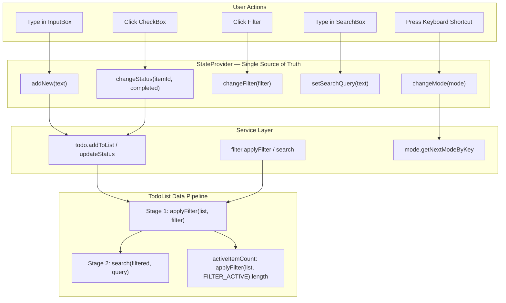

# Technical Specification

# 0. Agent Action Plan

## 0.1 Intent Clarification

### 0.1.1 Core Feature Objective

Based on the prompt, the Blitzy platform understands that the new feature requirement is to establish the definitive purpose, scope, and context layer for the **React Todo App** (`react-todo-app`) — a step-by-step educational single-page application built with React 15.x, designed to teach front-end developers core React patterns through an incremental, workshop-driven curriculum. This feature serves as the comprehensive orientation foundation for all stakeholders by articulating the system's objectives, architectural posture, key capabilities, and explicit boundaries.

The feature requirements are clarified as follows:

- **Stakeholder Orientation Layer**: Create and maintain the authoritative documentation and contextual scaffolding that enables workshop participants, self-paced learners, onboarding developers, and documentation contributors to understand the system's educational objectives, layered SPA architecture, and curriculum progression (16 branches from `step-0` through `step-15`)
- **Architectural Posture Documentation**: Codify the system's five-layer architecture (Entry Point, Component, Service, Utility, Asset) along with the custom state management pattern (`StateProvider` + `wrapChildrenWith` prop injection), unidirectional data flow, and React 15.x constraints into a navigable, living reference integrated directly into the codebase
- **Capability Articulation**: Document all nine features (F-001 through F-009) as defined in the feature catalog — Todo Item Creation, Status Toggling, Filtered Views, Text Search, Keyboard Navigation, Responsive Layout, Localized UI Text, Centralized State Management, and the HOC Pattern — ensuring each capability is traceable to its implementing source files
- **Boundary Enforcement**: Explicitly delineate what the system supports (client-side SPA with in-memory state, Bootstrap 3.4.1 layout, Recompose HOC patterns) and what is excluded (data persistence, authentication, server-side rendering, modern React APIs such as Hooks and Context)

Implicit requirements detected:

- The application's `package.json` declares `"private": true`, requiring all orientation documentation to emphasize the non-distributable, educational nature of the project
- The build toolchain (`react-scripts` 0.9.0) imposes constraints on configuration customization; any new feature must operate within the CRA zero-config boundary without ejecting
- The 16-step workshop branch structure (`step-0` through `step-15` per `README.md`) must be preserved as a first-class navigation and onboarding aid
- Nine existing README files and four Mermaid diagrams form the baseline documentation suite that must remain consistent with any system changes
- The absence of test files (despite `npm test` being configured) means any new feature additions should ideally include corresponding test scaffolding

### 0.1.2 Special Instructions and Constraints

- **Maintain React 15.x Compatibility**: All additions must strictly target React `^15.4.2` — no Hooks (`useState`, `useEffect`), no stable Context API (`React.createContext`), no `createRoot`. State management must use class components and the existing `wrapChildrenWith` / `objectWithOnly` prop injection pattern from `src/util/common.js`
- **Preserve Workshop Branch Structure**: The 16-step curriculum (`step-0` through `step-15`) documented in `README.md` is sacrosanct. No existing branch semantics or step ordering may be altered
- **Follow Repository Conventions**: All new components must follow the existing layered directory structure — wrappers in `src/components/wrappers/`, UI components in `src/components/ui/`, HOCs in `src/components/hoc/`, services in `src/services/`, utilities in `src/util/`, and assets in `src/assets/`
- **Immutable State Updates**: All state mutations must flow through `StateProvider` action methods and use `immutability-helper` or `Array.prototype.concat` for list operations, never direct mutation
- **EditorConfig Compliance**: All new files must conform to `.editorconfig` — 4-space indentation, LF line endings, UTF-8 encoding, trailing whitespace trimming, and mandatory final newline
- **CRA Build Integrity**: The production build (`npm run build`) must continue to pass. The verified baseline is 53.95 KB JS and 19.33 KB CSS (gzipped)
- **User-Specified Rule**: `test rule 09-03` — `1. rsr`

### 0.1.3 Technical Interpretation

These feature requirements translate to the following technical implementation strategy:

- To **establish the system orientation layer**, we will create and maintain comprehensive module-level documentation (README files with Mermaid diagrams) integrated across `src/`, `src/components/`, `src/services/`, `src/util/`, and `src/assets/`, ensuring each folder's README maps to its architectural purpose within the five-layer SPA pattern
- To **articulate capabilities and boundaries**, we will ensure that each of the nine features (F-001 through F-009) is fully traced from its service-layer implementation (`src/services/todo.js`, `src/services/filter.js`, `src/services/mode.js`) through its component-layer rendering (`src/components/ui/*`, `src/components/wrappers/*`) to its asset-layer dependencies (`src/assets/text/en_US.js`, `src/assets/style/index.css`, `src/assets/images/*.svg`)
- To **enforce architectural posture**, we will validate that the `StateProvider` class component (`src/components/wrappers/StateProvider.js`) remains the single source of truth with its four state fields (`query`, `mode`, `filter`, `list`) and five action methods (`addNew`, `changeFilter`, `changeStatus`, `changeMode`, `setSearchQuery`), distributed via `wrapChildrenWith()` using `React.Children.map` and `React.cloneElement`
- To **maintain build integrity**, we will verify that all changes pass `npm run build` within the `react-scripts` 0.9.0 toolchain and that `npm install --legacy-peer-deps` resolves all dependencies correctly against Node 20.x

## 0.2 Repository Scope Discovery

### 0.2.1 Comprehensive File Analysis

The complete repository file inventory has been examined across all directory levels. Every file listed below has been read and analyzed for its role within the five-layer SPA architecture.

**Root-Level Configuration Files**

| File | Status | Purpose |
|------|--------|---------|
| `package.json` | EXISTING — Modify | Dependency manifest declaring 6 runtime dependencies, 1 dev dependency, 4 npm scripts, and the `private: true` guard |
| `.editorconfig` | EXISTING — Preserve | Enforces 4-space indentation, LF line endings, UTF-8, final newline, and trailing whitespace trimming |
| `README.md` | EXISTING — Modify | Root documentation with clone/install/run instructions, 16-step curriculum branches, and module documentation table |
| `yarn.lock` | EXISTING — Preserve | Dependency lock file for reproducible installs |

**Public Directory (Static Shell)**

| File | Status | Purpose |
|------|--------|---------|
| `public/index.html` | EXISTING — Modify | HTML5 shell with `
` mount point, `%PUBLIC_URL%` favicon reference, responsive viewport meta, and `<title>Todo App</title>` |

**Entry Point Layer**

| File | Status | Purpose |
|------|--------|---------|
| `src/index.js` | EXISTING — Modify | Application bootstrap: imports React, ReactDOM, App wrapper, Bootstrap CSS, and custom CSS; calls `ReactDOM.render(<App/>, document.getElementById('root'))` |
| `src/README.md` | EXISTING — Modify | Source tree documentation: maps assets, components, services, util folders with Mermaid data-flow diagram |

**Component Layer — Wrappers**

| File | Status | Purpose |
|------|--------|---------|
| `src/components/wrappers/App.js` | EXISTING — Modify | Composition shell: nests `StateProvider > KeyStrokeHandler > TodoList` in strict order |
| `src/components/wrappers/StateProvider.js` | EXISTING — Modify | Centralized state container: 4 state fields (`query`, `mode`, `filter`, `list`) and 5 action methods; distributes via `wrapChildrenWith()` |
| `src/components/wrappers/KeyStrokeHandler.js` | EXISTING — Modify | Global `window.keydown` listener: delegates mode transitions via `getNextModeByKey()` from `mode.js` |
| `src/components/wrappers/README.md` | EXISTING — Modify | Wrapper layer documentation: describes App, StateProvider, KeyStrokeHandler responsibilities and dependencies |

**Component Layer — UI (12 Presentational Components)**

| File | Status | Purpose |
|------|--------|---------|
| `src/components/ui/TodoList.js` | EXISTING — Modify | Main container: executes two-stage pipeline `search(applyFilter(list, filter), query)`, computes `activeItemCount`, renders Header, FilteredList, Footer, Info |
| `src/components/ui/Header.js` | EXISTING — Preserve | Renders `<h1>Things To Do</h1>` title and passes props to InputWrapper |
| `src/components/ui/InputWrapper.js` | EXISTING — Preserve | Mode-conditional switch: InputBox for `MODE_CREATE`, SearchBox for `MODE_SEARCH`, null for `MODE_NONE` |
| `src/components/ui/InputBox.js` | EXISTING — Preserve | Auto-focused text input with "Add New" placeholder; enhanced by `wrapInputBox` HOC |
| `src/components/ui/SearchBox.js` | EXISTING — Preserve | Auto-focused search input; forwards `onChange` to `setSearchQuery` for real-time filtering |
| `src/components/ui/FilteredList.js` | EXISTING — Preserve | Maps filtered items to TodoItem rows; shows `MSG_NO_ITEMS` alert when empty |
| `src/components/ui/TodoItem.js` | EXISTING — Preserve | Single todo row with `completed`/`pending` CSS classes; nests CheckBox |
| `src/components/ui/CheckBox.js` | EXISTING — Preserve | Stateful class component: local `checked` state synced with DOM; propagates toggle via `props.onChange` |
| `src/components/ui/Footer.js` | EXISTING — Preserve | Layout container: ButtonWrapper, active item count, Filter controls |
| `src/components/ui/ButtonWrapper.js` | EXISTING — Preserve | Add/Search mode toggle buttons with SVG icon backgrounds via CSS |
| `src/components/ui/Filter.js` | EXISTING — Preserve | Three filter anchors (All, Active, Completed) from `getOptions()` with `selected` class highlighting |
| `src/components/ui/Info.js` | EXISTING — Preserve | Contextual keyboard shortcut text: `INFO_SHORTCUT_KEYS` in `MODE_NONE`, `INFO_CANCEL_SHORTCUT_KEY` otherwise |
| `src/components/ui/README.md` | EXISTING — Modify | UI component catalog with prop shapes, responsibilities, and integration documentation |

**Component Layer — HOC**

| File | Status | Purpose |
|------|--------|---------|
| `src/components/hoc/wrapInputBox.js` | EXISTING — Preserve | Recompose-based HOC: `compose(withState, withHandlers)` for controlled input, Enter-key submission, and value clearing |
| `src/components/hoc/README.md` | EXISTING — Modify | HOC documentation: describes wrapInputBox pattern, injected/required props, usage example |
| `src/components/README.md` | EXISTING — Modify | Component layer overview: maps hoc/, ui/, wrappers/ architecture with Mermaid hierarchy |

**Service Layer**

| File | Status | Purpose |
|------|--------|---------|
| `src/services/todo.js` | EXISTING — Modify | Immutable todo CRUD: `getAll()` (3 seeded items), `getItemById()`, `updateStatus()` (via `immutability-helper`), `addToList()` (deterministic ID via `getNextId()`) |
| `src/services/filter.js` | EXISTING — Modify | Filter and search: `FILTER_ALL`/`ACTIVE`/`COMPLETED` constants, `applyFilter()`, `search()` (case-insensitive via `stringInclues`), `getOptions()` |
| `src/services/mode.js` | EXISTING — Preserve | Mode FSM: `MODE_NONE`/`SEARCH`/`CREATE` constants, `getNextModeByKey()` using `keycode-js` constants |
| `src/services/README.md` | EXISTING — Modify | Service layer documentation: API tables, usage examples, Mermaid dependency diagram |

**Utility Layer**

| File | Status | Purpose |
|------|--------|---------|
| `src/util/common.js` | EXISTING — Modify | Three helpers: `objectWithOnly()` (bound method extraction), `wrapChildrenWith()` (React child cloning), `stringInclues()` (legacy substring check) |
| `src/util/README.md` | EXISTING — Modify | Utility documentation: interface details, parameter tables, known consumers |

**Asset Layer**

| File | Status | Purpose |
|------|--------|---------|
| `src/assets/style/index.css` | EXISTING — Modify | Global stylesheet: body theming, `.todolist` panel, footer/filters, `.buttons` with SVG `background-image`, `.alert.alert-info` empty state |
| `src/assets/text/en_US.js` | EXISTING — Modify | English locale: `MSG_NO_ITEMS`, `INFO_SHORTCUT_KEYS`, `INFO_CANCEL_SHORTCUT_KEY` constants |
| `src/assets/images/add.svg` | EXISTING — Preserve | 24×24 SVG plus icon for the add button control |
| `src/assets/images/search.svg` | EXISTING — Preserve | 24×24 SVG magnifying glass for the search button control |
| `src/assets/README.md` | EXISTING — Modify | Asset documentation: describes images, styles, and locale text with import snippets |

**Blitzy Documentation**

| File | Status | Purpose |
|------|--------|---------|
| `blitzy/documentation/Project Guide.md` | EXISTING — Preserve | Sprint status report: 89% completion, 24/27 hours, deliverables, validation commands, prerequisites |
| `blitzy/documentation/Technical Specifications.md` | EXISTING — Preserve | Documentation sprint blueprint: templates, Mermaid conventions, coverage goals, scope boundaries |

### 0.2.2 Integration Point Discovery

- **State Management Hub**: `src/components/wrappers/StateProvider.js` — All five action methods (`addNew`, `changeFilter`, `changeStatus`, `changeMode`, `setSearchQuery`) serve as the sole mutation entry points for the entire application. Any new feature must register its actions here and inject them via `objectWithOnly()` and `wrapChildrenWith()`
- **Component Composition Root**: `src/components/wrappers/App.js` — The strict nesting order `StateProvider > KeyStrokeHandler > TodoList` must be maintained. New wrapper components would be inserted between `StateProvider` and `KeyStrokeHandler` or between `KeyStrokeHandler` and `TodoList`
- **Data Pipeline**: `src/components/ui/TodoList.js` — The two-stage computation `search(applyFilter(list, filter), query)` is the central data transformation point. Any new data manipulation (sorting, priority filtering) integrates here
- **Keyboard Event System**: `src/components/wrappers/KeyStrokeHandler.js` — Global shortcut registration via `window.keydown` and mode transitions through `getNextModeByKey()`. New keyboard shortcuts require extending `src/services/mode.js`
- **Locale System**: `src/assets/text/en_US.js` — All user-facing strings must be centralized here; new UI text requires new exports from this module
- **CSS Theming**: `src/assets/style/index.css` — The single global stylesheet; new visual elements require new selectors here following the existing naming conventions (`.todolist`, `.buttons`, `.filters`)

### 0.2.3 New File Requirements

Based on the feature scope of establishing comprehensive orientation and documentation, the following new files are anticipated:

- **New Test Files** (addressing the gap in test infrastructure):
  - `src/__tests__/services/todo.test.js` — Unit tests for CRUD operations in the todo service
  - `src/__tests__/services/filter.test.js` — Unit tests for filter and search logic
  - `src/__tests__/services/mode.test.js` — Unit tests for mode FSM transitions
  - `src/__tests__/util/common.test.js` — Unit tests for utility helpers

- **New Documentation Files** (as needed for orientation completeness):
  - `src/assets/text/README.md` — Locale catalog documentation
  - `src/assets/images/README.md` — SVG icon asset documentation
  - `src/assets/style/README.md` — Stylesheet architecture documentation

## 0.3 Dependency Inventory

### 0.3.1 Private and Public Packages

All dependencies are sourced from the **npm public registry** as declared in `package.json`. No private packages are used. The project contains no `package-lock.json` but does include a `yarn.lock` for reproducible installs. Installation requires the `--legacy-peer-deps` flag due to dependency age.

| Registry | Package Name | Version | Type | Purpose |
|----------|-------------|---------|------|---------|
| npm | `react` | `^15.4.2` | Runtime | Core UI rendering library — `Component`, `Children.map`, `cloneElement`, `createElement` APIs |
| npm | `react-dom` | `^15.4.2` | Runtime | DOM-specific rendering via `ReactDOM.render()` to mount the component tree into `div#root` |
| npm | `bootstrap` | `^3.4.1` | Runtime | CSS-only responsive grid system, typography, and base panel styling (no JS plugins used) |
| npm | `recompose` | `^0.23.5` | Runtime | HOC composition utilities — `compose`, `withState`, `withHandlers` used in `wrapInputBox.js` |
| npm | `immutability-helper` | `^2.1.1` | Runtime | Declarative immutable state transformations with `$set` command syntax in `todo.js` |
| npm | `keycode-js` | `^0.0.4` | Runtime | Cross-platform keyboard event constants — `KEY_SLASH`, `KEY_N`, `KEY_ESCAPE`, `KEY_RETURN` |
| npm | `react-scripts` | `0.9.0` (pinned) | Dev | CRA build toolchain: Webpack bundling, Babel transpilation, Jest test runner, dev server |

### 0.3.2 Dependency Updates

No dependency version changes are required for the current feature scope. All packages remain at their `package.json`-declared versions. The following notes apply:

- **React 15.4.2**: Four major versions behind the current React 19.x. This is intentional — the project's educational curriculum targets pre-Hooks, pre-Context API patterns
- **Recompose 0.23.5**: Deprecated since October 2018 (author recommends Hooks). Final npm version is 0.30.0. Functional for the project's React 15.x target
- **Bootstrap 3.4.1**: EOL since July 2019 (current: 5.3.x). CSS-only usage mitigates JS vulnerability concerns
- **react-scripts 0.9.0**: Legacy CRA version. CRA itself is now in maintenance mode. The project has not ejected

### 0.3.3 Import Dependency Map

The following table traces the import relationships across every source file:

| Source File | Internal Imports | External Imports |
|-------------|-----------------|------------------|
| `src/index.js` | `./components/wrappers/App`, `./assets/style/index.css` | `react`, `react-dom`, `bootstrap/dist/css/bootstrap.css` |
| `src/components/wrappers/App.js` | `../ui/TodoList`, `./StateProvider`, `./KeyStrokeHandler` | `react` |
| `src/components/wrappers/StateProvider.js` | `../../services/filter`, `../../services/mode`, `../../util/common`, `../../services/todo` | `react` |
| `src/components/wrappers/KeyStrokeHandler.js` | `../../services/mode`, `../../util/common` | `react` |
| `src/components/ui/TodoList.js` | `./Info`, `./Header`, `./Footer`, `./FilteredList`, `../../services/filter` | `react` |
| `src/components/ui/Header.js` | `./InputWrapper` | `react` |
| `src/components/ui/InputWrapper.js` | `./InputBox`, `./SearchBox`, `../../services/mode` | `react` |
| `src/components/ui/InputBox.js` | `../hoc/wrapInputBox` | `react` |
| `src/components/ui/SearchBox.js` | — | `react` |
| `src/components/ui/FilteredList.js` | `./TodoItem`, `../../assets/text/en_US` | `react` |
| `src/components/ui/TodoItem.js` | `./CheckBox` | `react` |
| `src/components/ui/CheckBox.js` | — | `react` |
| `src/components/ui/Footer.js` | `./Filter`, `./ButtonWrapper` | `react` |
| `src/components/ui/ButtonWrapper.js` | `../../services/mode` | `react` |
| `src/components/ui/Filter.js` | `../../services/filter` | `react` |
| `src/components/ui/Info.js` | `../../services/mode`, `../../assets/text/en_US` | `react` |
| `src/components/hoc/wrapInputBox.js` | — | `keycode-js`, `recompose` |
| `src/services/todo.js` | — | `immutability-helper` |
| `src/services/filter.js` | `../util/common` | — |
| `src/services/mode.js` | — | `keycode-js` |
| `src/util/common.js` | — | `react` |
| `src/assets/text/en_US.js` | — | — |

### 0.3.4 External Reference Updates

| Category | Files | Change Needed |
|----------|-------|---------------|
| Configuration | `package.json` | Update if new dependencies are added for test framework or tooling |
| Build | `react-scripts` (internal Webpack/Babel) | No changes — CRA zero-config handles all bundling |
| Documentation | `README.md`, `src/README.md`, all sub-folder README files | Update module documentation tables and Mermaid diagrams if new files are added |
| CSS | `src/assets/style/index.css` | Add new selectors if new UI components require visual styling |
| Locale | `src/assets/text/en_US.js` | Add new string constant exports for any new user-facing text |

## 0.4 Integration Analysis

### 0.4.1 Existing Code Touchpoints

The following integration points represent every location in the codebase where new feature logic would need to connect with existing infrastructure.

**Direct Modification Points — State Management**

- `src/components/wrappers/StateProvider.js` (lines 7–50): The centralized state container where any new state fields must be added to `this.state` in the constructor (line 10), new action methods must be defined as class methods, and the `objectWithOnly` call (line 21) must include any new action names in the method array. Currently exposes five actions: `addNew`, `changeFilter`, `changeStatus`, `changeMode`, `setSearchQuery`
- `src/util/common.js` (lines 11–18, `objectWithOnly`): If new state distribution patterns are needed beyond the existing `objectWithOnly` + `wrapChildrenWith` approach, this file must be extended. Currently the only React-dependent utility (via `React.Children.map` and `React.cloneElement`)

**Direct Modification Points — Component Hierarchy**

- `src/components/wrappers/App.js` (lines 6–16): The strict composition hierarchy `StateProvider > KeyStrokeHandler > TodoList`. New wrapper components (e.g., an error boundary, a persistence provider) must be inserted into this nesting order
- `src/components/ui/TodoList.js` (lines 8–26): The main container that destructures `props.data` and `props.actions`, computes the data pipeline, and renders the four child components. Any new child component or data computation integrates here
- `src/components/ui/Footer.js` (lines 5–20): The footer layout that arranges ButtonWrapper, item count, and Filter. New footer controls (e.g., "Clear Completed" button, bulk actions) integrate here

**Direct Modification Points — Service Layer**

- `src/services/todo.js` (lines 1–66): The immutable todo CRUD service. New operations (e.g., `deleteItem`, `editText`, `toggleAll`, `clearCompleted`) follow the existing pattern of using `immutability-helper.update()` for mutations and returning new arrays
- `src/services/filter.js` (lines 1–33): Filter and search logic. New filter types or sort operations extend the `applyFilter` switch statement and `getOptions` object
- `src/services/mode.js` (lines 1–21): The mode FSM. New interaction modes require adding constants and extending the `getNextModeByKey` switch cases

**Keyboard Event System**

- `src/components/wrappers/KeyStrokeHandler.js` (lines 5–29): The global `window.keydown` listener. The `handleKeyUp` method (line 14) delegates to `getNextModeByKey()` for mode transitions. New global shortcuts that are not mode-related would require a parallel handler or extending this component's `handleKeyUp` logic

**Locale System**

- `src/assets/text/en_US.js` (lines 1–3): All user-facing strings are centralized as named exports. New UI text (empty states, button labels, guidance messages) must be added here as new `export const` declarations. Components that consume new strings must import them by name

**CSS Theming Integration**

- `src/assets/style/index.css` (lines 1–127): The single global stylesheet. New visual elements require new CSS selectors following the existing flat naming conventions (`.todolist`, `.buttons .button`, `.filters li a`, `.alert.alert-info`). SVG icon references use `background-image: url(../images/...)` paths

### 0.4.2 Data Flow Integration Map

```mermaid
flowchart TD
    subgraph UserActions["User Actions"]
        Type["Type in InputBox"]
        Click["Click CheckBox"]
        Filter["Click Filter"]
        Search["Type in SearchBox"]
        Key["Press Keyboard Shortcut"]
    end

    subgraph StateProvider["StateProvider — Single Source of Truth"]
        AddNew["addNew(text)"]
        ChangeStatus["changeStatus(itemId, completed)"]
        ChangeFilter["changeFilter(filter)"]
        SetSearch["setSearchQuery(text)"]
        ChangeMode["changeMode(mode)"]
    end

    subgraph Services["Service Layer"]
        TodoSvc["todo.addToList / updateStatus"]
        FilterSvc["filter.applyFilter / search"]
        ModeSvc["mode.getNextModeByKey"]
    end

    subgraph Pipeline["TodoList Data Pipeline"]
        Stage1["Stage 1: applyFilter(list, filter)"]
        Stage2["Stage 2: search(filtered, query)"]
        Count["activeItemCount: applyFilter(list, FILTER_ACTIVE).length"]
    end

    Type --> AddNew
    Click --> ChangeStatus
    Filter --> ChangeFilter
    Search --> SetSearch
    Key --> ChangeMode

    AddNew --> TodoSvc
    ChangeStatus --> TodoSvc
    ChangeMode --> ModeSvc

    TodoSvc --> Stage1
    FilterSvc --> Stage1
    Stage1 --> Stage2
    Stage1 --> Count
```

### 0.4.3 Prop Injection Chain

The custom state distribution mechanism bypasses React's Context API (unavailable in React 15.x) and relies on explicit prop cloning through the component tree:

- **Step 1**: `StateProvider.render()` calls `objectWithOnly(this, [...actions])` to extract bound action methods
- **Step 2**: `wrapChildrenWith(this.props.children, { data: this.state, actions })` clones `KeyStrokeHandler` with injected `data` and `actions` props
- **Step 3**: `KeyStrokeHandler.render()` re-invokes `wrapChildrenWith(this.props.children, this.props)` to forward all props to `TodoList`
- **Step 4**: `TodoList` destructures `props.data` and `props.actions`, then passes individual props to its four child components (`Header`, `FilteredList`, `Footer`, `Info`)

Any new component that needs access to state or actions must be placed within this injection chain, either as a child of `StateProvider` (receiving full state/actions) or as a child of `TodoList` (receiving selectively passed props).

## 0.5 Technical Implementation

### 0.5.1 File-by-File Execution Plan

Every file listed below MUST be created or modified to implement the feature. Files are grouped by execution priority and architectural layer.

**Group 1 — Core State and Service Layer Modifications**

| Action | File | Purpose |
|--------|------|---------|
| MODIFY | `src/components/wrappers/StateProvider.js` | Extend the centralized state container if new state fields or action methods are needed. The constructor's `this.state` object (currently `{ query, mode, filter, list }`) is the sole mutation target. New actions must be appended to the `objectWithOnly` call's method array |
| MODIFY | `src/services/todo.js` | Extend the immutable CRUD service with any new operations (e.g., delete, edit, toggle-all, clear-completed). Follow the existing pattern: import `update` from `immutability-helper`, locate items via `findIndex`, return new arrays via `update()` or `concat()` |
| MODIFY | `src/services/filter.js` | Extend filter constants, `applyFilter()` switch cases, `search()` function, and `getOptions()` object if new filter types or sort capabilities are introduced |
| PRESERVE | `src/services/mode.js` | Extend `getNextModeByKey()` FSM with new mode constants and key bindings only if new interaction modes are required |

**Group 2 — Component Hierarchy and Wrapper Layer**

| Action | File | Purpose |
|--------|------|---------|
| MODIFY | `src/components/wrappers/App.js` | Adjust the strict nesting order `StateProvider > KeyStrokeHandler > TodoList` only if new wrapper components must be inserted into the provider hierarchy |
| MODIFY | `src/components/wrappers/KeyStrokeHandler.js` | Extend the `handleKeyUp` method if new global keyboard shortcuts are introduced beyond the existing `/`, `N`, `Escape` mappings |
| MODIFY | `src/components/ui/TodoList.js` | The primary integration point for new child components. Add new components to the render tree and pass required props from `props.data` and `props.actions` |
| MODIFY | `src/util/common.js` | Add new shared helper functions if needed. All new utilities should follow the existing pure-function pattern with no side effects |

**Group 3 — Presentational UI Components**

| Action | File | Purpose |
|--------|------|---------|
| PRESERVE | `src/components/ui/Header.js` | No changes needed unless the title or input area structure changes |
| PRESERVE | `src/components/ui/InputWrapper.js` | Mode-conditional switch; extend only if new modes require new input components |
| PRESERVE | `src/components/ui/InputBox.js` | HOC-enhanced create input; modify only if submission behavior changes |
| PRESERVE | `src/components/ui/SearchBox.js` | Search query input; modify only if search UX changes |
| PRESERVE | `src/components/ui/FilteredList.js` | Item list renderer; modify if new per-item UI elements are added |
| PRESERVE | `src/components/ui/TodoItem.js` | Individual row; modify if new item-level controls (delete button, edit mode) are added |
| PRESERVE | `src/components/ui/CheckBox.js` | Stateful checkbox; stable unless checkbox behavior changes |
| PRESERVE | `src/components/ui/Footer.js` | Footer layout; extend if new footer controls are added |
| PRESERVE | `src/components/ui/ButtonWrapper.js` | Add/Search toggle; extend if new mode buttons are added |
| PRESERVE | `src/components/ui/Filter.js` | Filter anchors; auto-updates if new filter constants are added to `getOptions()` |
| PRESERVE | `src/components/ui/Info.js` | Shortcut guidance; extend if new modes require new guidance text |
| PRESERVE | `src/components/hoc/wrapInputBox.js` | Recompose HOC; stable unless input enhancement pattern changes |

**Group 4 — Asset Layer**

| Action | File | Purpose |
|--------|------|---------|
| MODIFY | `src/assets/style/index.css` | Add CSS selectors for any new visual elements following the flat naming convention (`.todolist`, `.buttons`, `.filters`) |
| MODIFY | `src/assets/text/en_US.js` | Add new `export const` string declarations for any new user-facing text |
| PRESERVE | `src/assets/images/add.svg` | Plus icon for create button; stable |
| PRESERVE | `src/assets/images/search.svg` | Magnifying glass for search button; stable |

**Group 5 — Configuration and Documentation**

| Action | File | Purpose |
|--------|------|---------|
| MODIFY | `package.json` | Add new dependencies only if required; update version if warranted |
| MODIFY | `README.md` | Update module documentation table and curriculum notes if new modules are added |
| MODIFY | `public/index.html` | Update `<title>` or metadata if application identity changes |
| MODIFY | `src/README.md` | Update source tree documentation and Mermaid diagrams |
| MODIFY | `src/components/README.md` | Update component architecture documentation |
| MODIFY | `src/components/ui/README.md` | Update UI component catalog |
| MODIFY | `src/components/wrappers/README.md` | Update wrapper layer documentation |
| MODIFY | `src/components/hoc/README.md` | Update HOC documentation if new HOCs are added |
| MODIFY | `src/services/README.md` | Update service API documentation |
| MODIFY | `src/util/README.md` | Update utility documentation if new helpers are added |
| MODIFY | `src/assets/README.md` | Update asset documentation if new assets are added |

### 0.5.2 Implementation Approach per File

The implementation follows a strict bottom-up approach aligned with the layered architecture:

- **Foundation Phase**: Establish feature logic in the service layer (`src/services/`) using pure, React-free functions. This ensures testability and decoupling. All new service functions must accept data as parameters and return new data without side effects, following the pattern established by `todo.addToList()` and `filter.applyFilter()`
- **State Integration Phase**: Wire new service functions into `StateProvider.js` by adding new action methods that call the service functions, update state via `this.setState()`, and register the methods in the `objectWithOnly` method array
- **Component Rendering Phase**: Add or modify UI components to consume the new state and actions. New components must follow the stateless functional pattern used by all 11 existing functional components, unless local state is genuinely required (as with `CheckBox.js`)
- **Asset Enhancement Phase**: Add CSS selectors, locale strings, and SVG icons as needed. CSS must follow the existing specificity patterns (class selectors, no IDs, no `!important`)
- **Documentation Phase**: Update all affected README files and Mermaid diagrams to reflect the changes

### 0.5.3 User Interface Design

The existing UI design follows a minimal, card-based layout with the following visual structure:

- **Panel**: Centered 600px-wide white card (`#FFF`) on a neutral background (`#eee`) with 1px `#ddd` border and 2px border-radius
- **Typography**: `#555` body text, uppercase centered `<h1>` title, `#999` info text, `#aaa` completed item text with `line-through`
- **Footer**: Pale green (`#F4FCE8`) background with top border separator, housing inline-block filter links with `rgba(175, 47, 47)` hover/selected borders
- **Controls**: 18×18 pixel inline-block buttons with SVG `background-image` icons, opacity-based hover feedback (0.5 → 1.0 on hover/selected)
- **Empty State**: Light gray (`#f2f2f2`) alert box with `rgba(229, 229, 229, 0.5)` border and `#888` text

Any new UI elements must maintain visual consistency with this design language — using the same color palette, spacing scale, and interaction patterns (hover opacity transitions, border-based selection indicators).

## 0.6 Scope Boundaries

### 0.6.1 Exhaustively In Scope

The following file patterns and components are definitively within scope for this feature. Trailing wildcards indicate pattern-matched file groups.

**Feature Source Files**

- `src/components/wrappers/StateProvider.js` — Central state container (constructor, action methods, objectWithOnly registration)
- `src/components/wrappers/App.js` — Composition hierarchy (wrapper nesting order)
- `src/components/wrappers/KeyStrokeHandler.js` — Global keyboard listener (handleKeyUp, mode transition logic)
- `src/components/ui/TodoList.js` — Main container (data pipeline, child component rendering)
- `src/components/ui/*.js` — All 12 presentational UI components
- `src/components/hoc/wrapInputBox.js` — HOC for controlled input enhancement
- `src/services/todo.js` — Immutable CRUD operations (getAll, addToList, updateStatus, getNextId)
- `src/services/filter.js` — Filter and search logic (applyFilter, search, getOptions, constants)
- `src/services/mode.js` — Mode FSM (getNextModeByKey, mode constants)
- `src/util/common.js` — Shared utilities (objectWithOnly, wrapChildrenWith, stringInclues)

**Entry Point and Bootstrap**

- `src/index.js` — Application mount point (ReactDOM.render, CSS imports)
- `public/index.html` — HTML5 shell (`
`, `<title>`, viewport meta)

**Asset Files**

- `src/assets/style/index.css` — Global stylesheet (all layout, theming, and control styles)
- `src/assets/text/en_US.js` — English locale constants (MSG_NO_ITEMS, INFO_SHORTCUT_KEYS, INFO_CANCEL_SHORTCUT_KEY)
- `src/assets/images/add.svg` — Add button icon
- `src/assets/images/search.svg` — Search button icon

**Configuration Files**

- `package.json` — Dependency manifest, npm scripts, private flag
- `.editorconfig` — Code formatting rules (indentation, line endings, encoding)
- `yarn.lock` — Dependency version lock

**Documentation Files**

- `README.md` — Root project documentation (instructions, steps, module table)
- `src/README.md` — Source tree overview with Mermaid diagram
- `src/components/README.md` — Component layer architecture documentation
- `src/components/ui/README.md` — UI component catalog with props documentation
- `src/components/wrappers/README.md` — Wrapper layer documentation
- `src/components/hoc/README.md` — HOC pattern documentation
- `src/services/README.md` — Service layer API documentation
- `src/util/README.md` — Utility helpers documentation
- `src/assets/README.md` — Asset layer documentation

**Test Files** (to be created)

- `src/__tests__/services/todo.test.js` — Todo CRUD unit tests
- `src/__tests__/services/filter.test.js` — Filter and search unit tests
- `src/__tests__/services/mode.test.js` — Mode FSM unit tests
- `src/__tests__/util/common.test.js` — Utility helper unit tests

### 0.6.2 Explicitly Out of Scope

The following items are excluded from the current feature scope:

- **React Version Upgrade**: Migration from React 15.x to React 16+/17+/18+/19+ is not addressed. All code must remain compatible with `react@^15.4.2`
- **State Management Library Integration**: No Redux, MobX, Zustand, or other external state management libraries. The custom `StateProvider` + `wrapChildrenWith` pattern is the sole state management approach
- **Data Persistence Layer**: No localStorage, IndexedDB, backend API, or server-side storage. All data remains in-memory and resets on page refresh
- **User Authentication / Authorization**: No login, session management, user identity, or access control features
- **Server-Side Rendering**: No SSR, static site generation, or Node.js server component. The application bootstraps exclusively via `ReactDOM.render()` client-side
- **Todo Item Deletion**: No delete functionality exists in `src/services/todo.js` and none is specified in this feature scope
- **Todo Item Editing**: No inline edit mechanism for existing item text is specified
- **Internationalization Framework**: No i18n library integration or locale-switching mechanism beyond the existing `en_US.js` constants file
- **CI/CD Pipeline Configuration**: No GitHub Actions, Jenkins, Travis CI, or other CI/CD pipeline files are in scope
- **CRA Ejection**: The `react-scripts` configuration must not be ejected; all changes must work within CRA's zero-config boundary
- **Performance Optimization**: No memoization (`shouldComponentUpdate`, `PureComponent`), virtualization, or lazy loading beyond the existing implementation
- **Accessibility Compliance**: No ARIA attributes, screen-reader support, or WCAG compliance additions are specified in this feature scope
- **Mobile/Native Application**: No React Native or hybrid framework code
- **Blitzy Documentation Sprint Artifacts**: Files under `blitzy/documentation/` are reference materials and are not modified

## 0.7 Rules for Feature Addition

### 0.7.1 User-Specified Rules

- **test rule 09-03**: `1. rsr`

### 0.7.2 Architectural Conventions

The following rules derive from the established patterns observed across all 23 source files in the repository and must be followed for any feature additions:

- **Five-Layer Separation**: All code must reside in the correct architectural layer — entry point (`src/index.js`), wrappers (`src/components/wrappers/`), UI components (`src/components/ui/`), HOCs (`src/components/hoc/`), services (`src/services/`), utilities (`src/util/`), or assets (`src/assets/`). No cross-layer responsibility violations are permitted
- **Unidirectional Data Flow**: State originates exclusively in `StateProvider` and flows downward via prop injection. Mutations travel upward through callback invocations to `StateProvider` action methods. No component may maintain authoritative application state except `StateProvider`
- **Immutable State Mutations**: All list operations must use `immutability-helper`'s `update()` with command syntax (`$set`, `$push`, etc.) or `Array.prototype.concat()`. Direct mutation of `this.state` or the list array is prohibited
- **Service Layer Purity**: Service functions (`todo.js`, `filter.js`, `mode.js`) must remain pure — no React imports, no DOM access, no side effects. They accept data parameters and return transformed data
- **Prop Injection Pattern**: State distribution uses `objectWithOnly()` for action method extraction and `wrapChildrenWith()` for prop cloning via `React.Children.map` + `React.cloneElement`. No alternative state distribution mechanism (Context, Redux, event emitters) may be introduced
- **Functional Components by Default**: New UI components should be stateless functional components unless local component state is genuinely required (as with `CheckBox.js`). Class components are reserved for stateful wrappers and specific local-state needs
- **Locale Centralization**: All user-facing strings must be exported as named constants from `src/assets/text/en_US.js`. No hardcoded strings in component JSX (the existing `<h1>Things To Do</h1>` in `Header.js` and `${activeItemCount} items left` in `Footer.js` are legacy exceptions)
- **CSS Naming Conventions**: Selectors follow a flat class-based pattern (`.todolist`, `.buttons .button`, `.filters li a`). No CSS modules, styled-components, or CSS-in-JS. No IDs or `!important` overrides
- **EditorConfig Compliance**: 4-space indentation, LF line endings, UTF-8 encoding, mandatory final newline, trailing whitespace trimming

### 0.7.3 Build and Compatibility Constraints

- **React 15.4.2 API Surface**: Only APIs available in React 15.4.2 may be used — `React.Component`, `React.Children.map`, `React.cloneElement`, `React.createElement`, `ReactDOM.render()`. No Hooks, no `createContext`, no `forwardRef`, no Fragments (use `
` wrappers instead), no `createRoot`
- **CRA Zero-Config**: The build must pass `react-scripts build` without ejection. No custom Webpack, Babel, or ESLint configuration files may be added at the project root
- **Dependency Installation**: All `npm install` commands must use `--legacy-peer-deps` flag due to the age of the dependency tree
- **Build Verification**: The production build must succeed with `npm run build` and should maintain artifact sizes near the baseline (53.95 KB JS, 19.33 KB CSS gzipped)
- **Node.js Runtime**: Development environment targets Node.js 20.x with npm 6.x+ as documented in `blitzy/documentation/Project Guide.md`

## 0.8 References

### 0.8.1 Repository Files and Folders Searched

The following is an exhaustive inventory of every file and folder retrieved and analyzed during the creation of this Agent Action Plan:

**Root-Level Files (read via `read_file`)**

| File Path | Analysis Type |
|-----------|---------------|
| `package.json` | Full content read — dependency manifest, scripts, version, private flag |
| `.editorconfig` | Full content read — formatting rules |
| `README.md` | Full content read — instructions, curriculum steps, module documentation table |

**Public Directory (explored via `get_source_folder_contents`)**

| Path | Analysis Type |
|------|---------------|
| `public/` | Folder contents retrieved |
| `public/index.html` | Summary reviewed — HTML5 shell, mount point, CRA template |

**Source Directory — Entry Point (explored 3+ levels deep)**

| Path | Analysis Type |
|------|---------------|
| `src/` | Folder contents retrieved |
| `src/index.js` | Full content read — application bootstrap |
| `src/README.md` | Summary reviewed — source tree documentation |

**Source Directory — Components (explored 3+ levels deep)**

| Path | Analysis Type |
|------|---------------|
| `src/components/` | Folder contents retrieved |
| `src/components/README.md` | Summary reviewed |
| `src/components/wrappers/` | Folder contents retrieved |
| `src/components/wrappers/App.js` | Full content read |
| `src/components/wrappers/StateProvider.js` | Full content read |
| `src/components/wrappers/KeyStrokeHandler.js` | Full content read |
| `src/components/wrappers/README.md` | Summary reviewed |
| `src/components/ui/` | Folder contents retrieved |
| `src/components/ui/TodoList.js` | Full content read |
| `src/components/ui/Header.js` | Full content read |
| `src/components/ui/InputWrapper.js` | Full content read |
| `src/components/ui/InputBox.js` | Full content read |
| `src/components/ui/SearchBox.js` | Full content read |
| `src/components/ui/FilteredList.js` | Full content read |
| `src/components/ui/TodoItem.js` | Full content read |
| `src/components/ui/CheckBox.js` | Full content read |
| `src/components/ui/Footer.js` | Full content read |
| `src/components/ui/ButtonWrapper.js` | Full content read |
| `src/components/ui/Filter.js` | Full content read |
| `src/components/ui/Info.js` | Full content read |
| `src/components/ui/README.md` | Summary reviewed |
| `src/components/hoc/` | Folder contents retrieved |
| `src/components/hoc/wrapInputBox.js` | Full content read |
| `src/components/hoc/README.md` | Summary reviewed |

**Source Directory — Services (explored 3+ levels deep)**

| Path | Analysis Type |
|------|---------------|
| `src/services/` | Folder contents retrieved |
| `src/services/todo.js` | Full content read |
| `src/services/filter.js` | Full content read |
| `src/services/mode.js` | Full content read |
| `src/services/README.md` | Summary reviewed |

**Source Directory — Utilities (explored 3+ levels deep)**

| Path | Analysis Type |
|------|---------------|
| `src/util/` | Folder contents retrieved |
| `src/util/common.js` | Full content read |
| `src/util/README.md` | Summary reviewed |

**Source Directory — Assets (explored 3+ levels deep)**

| Path | Analysis Type |
|------|---------------|
| `src/assets/` | Folder contents retrieved |
| `src/assets/images/` | Folder contents retrieved |
| `src/assets/images/add.svg` | Summary reviewed |
| `src/assets/images/search.svg` | Summary reviewed |
| `src/assets/style/index.css` | Full content read |
| `src/assets/text/en_US.js` | Full content read |
| `src/assets/README.md` | Summary reviewed |

**Blitzy Documentation (explored 2+ levels deep)**

| Path | Analysis Type |
|------|---------------|
| `blitzy/` | Folder contents retrieved |
| `blitzy/documentation/` | Folder contents retrieved |
| `blitzy/documentation/Project Guide.md` | Summary reviewed |
| `blitzy/documentation/Technical Specifications.md` | Summary reviewed |

### 0.8.2 Technical Specification Sections Retrieved

The following sections of the existing Technical Specification document were retrieved and analyzed via `get_tech_spec_section`:

| Section | Key Information Extracted |
|---------|-------------------------|
| 1.1 Executive Summary | Project context — educational React 15.x todo app, 16-step workshop, stakeholder groups, business value |
| 1.2 System Overview | Five-layer SPA architecture, component hierarchy, data flow, custom state management, success criteria |
| 1.3 Scope | In-scope capabilities (5 CRUD/filter/search features), out-of-scope exclusions (deletion, persistence, auth), boundary definitions |
| 2.1 Feature Catalog | Nine features (F-001 through F-009) with complete details, dependencies, primary source files |
| 2.2 Functional Requirements | Detailed requirements per feature with acceptance criteria, technical specifications, validation rules |
| 2.4 Implementation Considerations | Technical constraints (React 15.x class-only, CRA 0.9.0, in-memory store), performance characteristics, scalability limits, security posture |
| 3.1 Programming Languages | JavaScript ES6+ (sole language), HTML5 (shell), CSS3 (stylesheet) |
| 3.2 Frameworks & Libraries | React 15.4.2, ReactDOM 15.4.2, Bootstrap 3.4.1, Recompose 0.23.5, immutability-helper 2.1.1, keycode-js 0.0.4, react-scripts 0.9.0 |
| 3.3 Open Source Dependencies | Complete dependency manifest (7 packages), currency assessment, risk levels |
| 5.1 High-Level Architecture | Layered SPA pattern, system boundaries, core components, data flow, external integration points |
| 7.2 UI Architecture | Component hierarchy (16 components), layered rendering, complete component inventory |

### 0.8.3 Attachments

No attachments were provided for this project. No Figma URLs or design files are associated with this feature request.

### 0.8.4 External References

| Reference | Source |
|-----------|--------|
| Project Repository | `https://github.com/kabirbaidhya/react-todo-app.git` (per `README.md`) |
| Live Demo | `https://simplest-react-todo-app.herokuapp.com/` (per `README.md`) |
| Workshop Slides | `https://speakerdeck.com/kabirbaidhya/frontend-development-with-react` (per `README.md`) |
| Node.js Runtime | Node 20.x / npm 6.x+ (per `blitzy/documentation/Project Guide.md`) |
| Build Verification | `npm install --legacy-peer-deps` followed by `npm run build` producing 53.95 KB JS + 19.33 KB CSS gzipped |

### 0.8.5 Environment Verification

| Check | Result |
|-------|--------|
| Node.js Version | v20.20.1 (matches recommended 20.x) |
| npm Version | 11.1.0 (exceeds recommended 6.x+) |
| Dependency Installation | `npm install --legacy-peer-deps` — Success (192 vulnerability advisories, all legacy-related) |
| Production Build | `npm run build` — Success ("The build folder is ready to be deployed") |
| Lock File | `yarn.lock` present; no `package-lock.json` |
| `.blitzyignore` Files | None found in repository |

