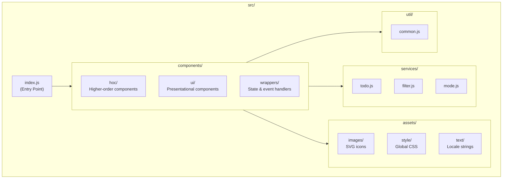

# Source Code (src/)

> ← Back to [Main README](../README.md)

## Overview

This is the client-side application root for the React Todo App. It contains the single runtime entry point (`index.js`) and four organized subfolders that separate concerns: assets for static resources, components for the React UI layer, services for business logic, and utilities for shared helper functions.

## Folder Structure

The following diagram shows the organization of the `src/` directory:



## Entry Point

The file `index.js` is the application entry point. It performs the following tasks:

1. Imports React and ReactDOM for rendering
2. Imports the root `App` component from `./components/wrappers/App`
3. Imports Bootstrap CSS for base styling
4. Imports the custom stylesheet from `./assets/style/index.css`
5. Mounts the application to the DOM element with id `root`

```javascript
import React from 'react';
import ReactDOM from 'react-dom';
import App from './components/wrappers/App';

import 'bootstrap/dist/css/bootstrap.css';
import './assets/style/index.css';

ReactDOM.render(
    <App/>,
    document.getElementById('root')
);
```

The `root` DOM element is defined in `public/index.html`.

## Modules

| Module | Description |
|--------|-------------|
| [assets/](assets/README.md) | Static assets including SVG icons, global CSS styles, and locale text constants |
| [components/](components/README.md) | React UI layer organized into HOCs, presentational components, and state wrappers |
| [services/](services/README.md) | Business logic modules for todo operations, list filtering, and UI mode management |
| [util/](util/README.md) | Shared helper functions for object manipulation, React children handling, and string operations |

## Related

- [Main README](../README.md) — Project overview, setup instructions, and step-by-step branch history
