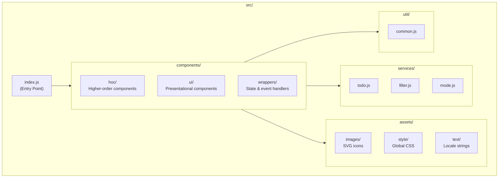

# Source Code (src/)

> ← Back to [Main README](../README.md)

## What You'll Find Here

Welcome to the source code! This is where all the magic happens. Whether you're here to fix a bug, add a feature, or just understand how everything works, we've organized things to make your journey as smooth as possible.

Think of this folder as home base for the React Todo App. Everything the app needs to run lives here, from the visual components you see on screen to the behind-the-scenes logic that makes it all work.

## Overview

This folder is the heart of our Todo application. Here's how we've organized things:

- **assets/** — Pictures, styles, and text that make the app look good and speak your language
- **components/** — All the visual pieces you see on screen, from buttons to the todo list itself
- **services/** — The app's brain—handles your todos, filters, and keeps track of what mode you're in
- **util/** — Handy helper functions that get used all over the app

The entry point (`index.js`) is what kicks everything off when you start the app.

## Folder Structure

The following diagram shows how the `src/` directory is organized:


```mermaid
flowchart TB
    subgraph src["src/"]
        INDEX["index.js<br/>(Entry Point)"]
        
        subgraph assets["assets/"]
            IMAGES["images/<br/>SVG icons"]
            STYLE["style/<br/>Global CSS"]
            TEXT["text/<br/>Locale strings"]
        end
        
        subgraph components["components/"]
            HOC["hoc/<br/>Higher-order components"]
            UI["ui/<br/>Presentational components"]
            WRAPPERS["wrappers/<br/>State & event handlers"]
        end
        
        subgraph services["services/"]
            TODO["todo.js"]
            FILTER["filter.js"]
            MODE["mode.js"]
        end
        
        subgraph util["util/"]
            COMMON["common.js"]
        end
    end
    
    INDEX --> components
    components --> services
    components --> util
    components --> assets
```

## Entry Point

Every app needs a starting point, and for our Todo App, that's `index.js`. Think of it as the front door—it's the first thing that runs when your app starts up.

Here's what happens when the app boots:

1. **Load React** — We bring in React and ReactDOM so we can build and display our UI
2. **Get the main component** — We import `App`, which is the top-level component that contains everything else
3. **Apply styles** — We load Bootstrap for basic styling, plus our custom CSS to make things look just right
4. **Show it on screen** — Finally, we tell React to display our app inside the `root` element

Here's what the code looks like:

```javascript
import React from 'react';
import ReactDOM from 'react-dom';
import App from './components/wrappers/App';

// Load our stylesheets - Bootstrap first for the basics,
// then our custom styles to add the finishing touches
import 'bootstrap/dist/css/bootstrap.css';
import './assets/style/index.css';

// This is where it all comes together!
// We're telling React to put our App component inside the
// <div id="root"> element in public/index.html
ReactDOM.render(
    <App/>,
    document.getElementById('root')
);
```

The `root` element that we're mounting to? You'll find that defined in `public/index.html`—it's just a simple `<div>` that acts as the container for our entire React application.

## Modules

Ready to dive deeper? Here's what each folder contains:

| Module | What's Inside |
|--------|---------------|
| [assets/](assets/README.md) | Pictures, styles, and text that make the app look good and speak your language |
| [components/](components/README.md) | All the visual pieces you see on screen, from buttons to the todo list |
| [services/](services/README.md) | The app's brain—handles your todos, filters, and keeps track of what mode you're in |
| [util/](util/README.md) | Handy helper functions that get used all over the app |

## Related

- [Main README](../README.md) — Project overview, setup instructions, and step-by-step branch history

### Where to Go Next

New to the codebase? Here's a suggested path:

1. **Start with [components/](components/README.md)** — This is where you'll see how the UI is built and how all the pieces fit together
2. **Then check out [services/](services/README.md)** — Understand the logic that powers the app
3. **Explore [assets/](assets/README.md) and [util/](util/README.md)** when you need styles, images, or helper functions

Happy coding! 🎉
