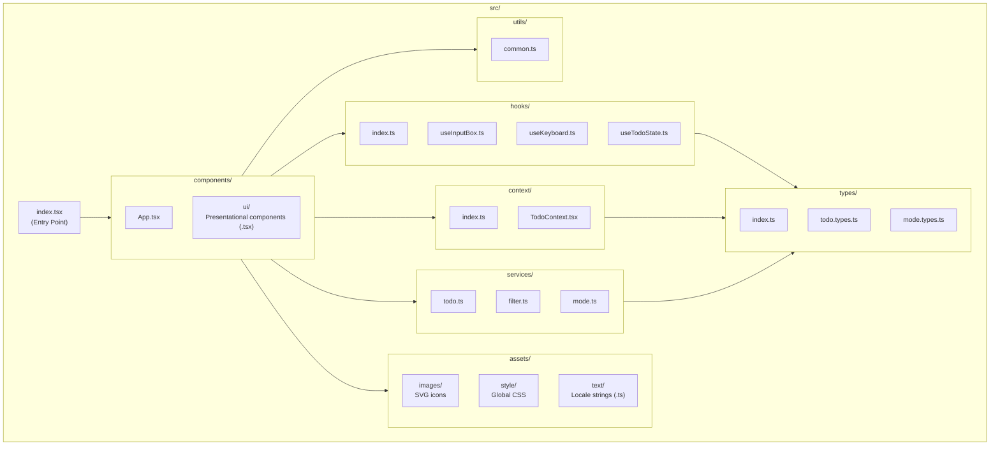

# Source Code (src/)

> ← Back to [Main README](../README.md)

## Overview

This is the client-side application root for the React Todo App, built with **TypeScript** and **React 18**. It contains the single runtime entry point (`index.tsx`) and six organized subfolders that separate concerns: types for TypeScript definitions, hooks for custom React hooks, context for global state management, assets for static resources, components for the React UI layer, services for business logic, and utilities for shared helper functions.

The application follows a **hooks-based architecture**, having migrated from legacy recompose HOCs to native React hooks. This modern approach improves code maintainability, enables better TypeScript integration, and follows current React best practices.

## Folder Structure

The following diagram shows the organization of the `src/` directory:


```mermaid
flowchart TB
    subgraph src["src/"]
        INDEX["index.tsx<br/>(Entry Point)"]
        
        subgraph types["types/"]
            TYPES_INDEX["index.ts"]
            TODO_TYPES["todo.types.ts"]
            MODE_TYPES["mode.types.ts"]
        end
        
        subgraph hooks["hooks/"]
            HOOKS_INDEX["index.ts"]
            USE_INPUT["useInputBox.ts"]
            USE_KEYBOARD["useKeyboard.ts"]
            USE_TODO["useTodoState.ts"]
        end
        
        subgraph context["context/"]
            CTX_INDEX["index.ts"]
            TODO_CTX["TodoContext.tsx"]
        end
        
        subgraph assets["assets/"]
            IMAGES["images/<br/>SVG icons"]
            STYLE["style/<br/>Global CSS"]
            TEXT["text/<br/>Locale strings (.ts)"]
        end
        
        subgraph components["components/"]
            APP["App.tsx"]
            UI["ui/<br/>Presentational components (.tsx)"]
        end
        
        subgraph services["services/"]
            TODO["todo.ts"]
            FILTER["filter.ts"]
            MODE["mode.ts"]
        end
        
        subgraph utils["utils/"]
            COMMON["common.ts"]
        end
    end
    
    INDEX --> components
    components --> hooks
    components --> context
    components --> services
    components --> utils
    components --> assets
    hooks --> types
    context --> types
    services --> types
```

## Entry Point

The file `index.tsx` is the application entry point. It performs the following tasks:

1. Imports React and createRoot from react-dom/client for rendering (React 18 pattern)
2. Imports the root `App` component from `./components/App`
3. Imports Bootstrap CSS for base styling
4. Imports the custom stylesheet from `./assets/style/index.css`
5. Mounts the application to the DOM element with id `root` using createRoot API

```typescript
import React from 'react';
import { createRoot } from 'react-dom/client';
import App from './components/App';

import 'bootstrap/dist/css/bootstrap.css';
import './assets/style/index.css';

const container = document.getElementById('root')!;
const root = createRoot(container);
root.render(<App />);
```

The `root` DOM element is defined in `public/index.html`.

## Architecture

The application follows a modern React architecture with the following key design decisions:

### Hooks-Based State Management
- **Custom Hooks**: Replace the legacy `recompose` HOC pattern with native React hooks
- `useInputBox`: Manages input field state and handlers (replaces `wrapInputBox` HOC)
- `useKeyboard`: Handles global keyboard events with proper cleanup (replaces `KeyStrokeHandler` class)
- `useTodoState`: Manages todo list state and operations (replaces `StateProvider` class)

### Context API for Global State
- **TodoContext**: Provides application-wide state access without prop drilling
- Eliminates the need for wrapper components to pass state through the component tree
- Enables any component to access todo state and actions via `useTodoContext` hook

### TypeScript Type Safety
- **Strict Mode**: Enabled for maximum type safety
- **Interface Definitions**: All component props, state, and service functions are fully typed
- **Type Inference**: Leverages TypeScript's inference capabilities while maintaining explicit types for public APIs

### SOLID Principles
- **Single Responsibility**: Each component handles one concern; logic extracted to hooks
- **Open/Closed**: Components extensible via props without modification
- **Interface Segregation**: Components receive only the props they need
- **Dependency Inversion**: Components depend on Context abstractions, not concrete implementations

## Modules

| Module | Description |
|--------|-------------|
| [types/](types/) | Type definitions for Todo, Mode, and shared interfaces used throughout the application |
| [hooks/](hooks/) | Custom React hooks replacing HOCs and class components for reusable stateful logic |
| [context/](context/) | React Context for global state management, replacing prop drilling patterns |
| [assets/](assets/README.md) | Static assets including SVG icons, global CSS styles, and locale text constants |
| [components/](components/README.md) | Functional React components with TypeScript, using hooks-based state management |
| [services/](services/README.md) | Business logic modules with TypeScript type safety for todo operations, list filtering, and UI mode management |
| [utils/](utils/) | Shared helper functions with TypeScript types for object manipulation, React children handling, and string operations |

## Related

- [Main README](../README.md) — Project overview, setup instructions, and step-by-step branch history
