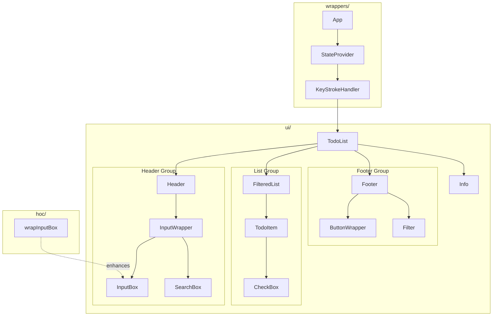

# Components

> ← Back to [src](../README.md) | [Main README](../../README.md)

## Overview

This folder contains the React UI layer for the Todo application. The components are organized into three subfolders that separate concerns: `hoc/` for higher-order components that enhance other components with additional behavior, `ui/` for presentational components that form the visual interface, and `wrappers/` for components that handle application state and global event listening.

## Component Hierarchy

The following diagram shows how components are composed within the application:

## Organization

The components folder contains three subdirectories, each serving a distinct purpose:

### hoc/

Higher-Order Components (HOCs) are functions that take a component and return an enhanced version of that component with additional props or behavior.

| File | Purpose |
|------|---------|
| `wrapInputBox.js` | Enhances input components with controlled value state and keyboard event handlers |

### ui/

Presentational components form the visual interface of the application. These components receive data and callbacks through props and render the UI.

| File | Purpose |
|------|---------|
| `TodoList.js` | Main container that composes all UI sections |
| `Header.js` | Displays the application title and input area |
| `Footer.js` | Contains mode buttons, item count, and filter controls |
| `FilteredList.js` | Renders the list of todo items or an empty state message |
| `TodoItem.js` | Displays a single todo item with completion checkbox |
| `CheckBox.js` | Controlled checkbox input component |
| `InputBox.js` | Text input for adding new todo items |
| `InputWrapper.js` | Routes between InputBox and SearchBox based on mode |
| `SearchBox.js` | Text input for searching todo items |
| `Filter.js` | Buttons to filter by All, Active, or Completed status |
| `ButtonWrapper.js` | Buttons to switch between Create and Search modes |
| `Info.js` | Displays keyboard shortcut hints |

### wrappers/

Wrapper components handle cross-cutting concerns like state management and global event handling. They wrap other components to provide data and behavior.

| File | Purpose |
|------|---------|
| `App.js` | Application root that composes the provider hierarchy |
| `StateProvider.js` | Manages application state and provides action methods to children |
| `KeyStrokeHandler.js` | Listens for global keyboard events and triggers mode changes |

## Data Flow

Data flows through the component hierarchy in a unidirectional pattern:

1. **StateProvider** maintains the application state:
   - `list` — Array of todo items
   - `filter` — Current filter selection (All, Active, Completed)
   - `mode` — Current input mode (Create, Search, None)
   - `query` — Current search query string

2. **StateProvider** passes state as `data` and action methods as `actions` to its children through props.

3. **KeyStrokeHandler** intercepts keyboard events and calls `changeMode()` when mode-switching keys are pressed.

4. **TodoList** receives `data` and `actions`, then distributes relevant portions to child components:
   - Header receives `addNew`, `mode`, `query`, and `setSearchQuery`
   - FilteredList receives the filtered `items` array and `changeStatus`
   - Footer receives `activeItemCount`, `filter`, `changeFilter`, `mode`, and `changeMode`
   - Info receives `mode`

5. **UI components** render based on the props they receive and call action methods when users interact with them.

## Related

### Subfolders

- [hoc/](hoc/README.md) — Higher-order component documentation
- [ui/](ui/README.md) — UI components catalog
- [wrappers/](wrappers/README.md) — State and event wrapper documentation

### Dependencies

- [services/](../services/README.md) — Business logic for todo operations, filtering, and mode management
- [util/](../util/README.md) — Helper functions used by wrapper components
- [assets/](../assets/README.md) — Static resources including locale strings used by UI components
