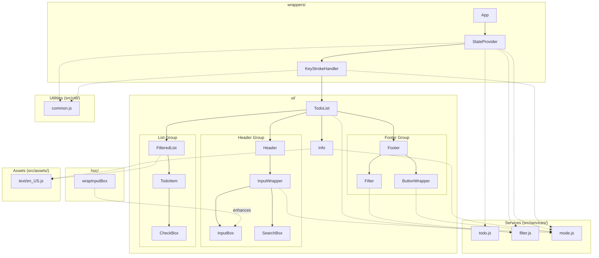
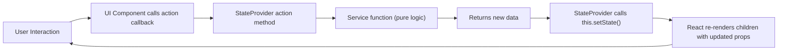

# Components

> ← Back to [src](../README.md) | [Main README](../../README.md)

## Overview

The component layer is the **rendering and interaction** tier within the application's five-layer SPA architecture (Entry Point → Component → Service → Utility → Asset). It sits between the service layer, which contains pure business logic, and the asset layer, which holds static resources such as locale strings, stylesheets, and images.

Components are organized into three subfolders that enforce a strict separation of concerns:

- **`hoc/`** — Higher-order components that enhance other components with additional behavior through composition (e.g., controlled input state, keyboard event handling).
- **`ui/`** — Twelve presentational components that form the visual interface. These receive data and callbacks through props and render the UI. All are stateless functional components except `CheckBox`, which manages local checked state.
- **`wrappers/`** — Three components that handle state management and global event listening. `StateProvider` is the centralized state container, distributing state and action methods to the tree via the custom `objectWithOnly()` + `wrapChildrenWith()` prop injection pattern built on `React.Children.map` and `React.cloneElement`.

> **React 15.x Constraint**: All components target React `^15.4.2`. Modern APIs such as Hooks (`useState`, `useEffect`), the stable Context API (`React.createContext`), Fragments, and `createRoot` are not available. State management relies on class components and explicit prop cloning.

## Component Hierarchy

The following diagram shows how components are composed within the application:

```mermaid
flowchart TB
    subgraph wrappers["wrappers/"]
        APP["App"]
        SP["StateProvider"]
        KSH["KeyStrokeHandler"]
    end

    subgraph ui["ui/"]
        TL["TodoList"]

        subgraph header_group["Header Group"]
            HDR["Header"]
            IW["InputWrapper"]
            IB["InputBox"]
            SB["SearchBox"]
        end

        subgraph list_group["List Group"]
            FL["FilteredList"]
            TI["TodoItem"]
            CB["CheckBox"]
        end

        subgraph footer_group["Footer Group"]
            FTR["Footer"]
            BW["ButtonWrapper"]
            FLT["Filter"]
        end

        INFO["Info"]
    end

    subgraph hoc["hoc/"]
        HOC["wrapInputBox"]
    end

    subgraph services["Services (src/services/)"]
        TODO_SVC["todo.js"]
        FILTER_SVC["filter.js"]
        MODE_SVC["mode.js"]
    end

    subgraph utilities["Utilities (src/util/)"]
        COMMON["common.js"]
    end

    subgraph assets["Assets (src/assets/)"]
        LOCALE["text/en_US.js"]
    end

    APP --> SP
    SP --> KSH
    KSH --> TL

    TL --> HDR
    TL --> FL
    TL --> FTR
    TL --> INFO

    HDR --> IW
    IW --> IB
    IW --> SB

    FL --> TI
    TI --> CB

    FTR --> BW
    FTR --> FLT

    HOC -.->|enhances| IB

    SP -.-> TODO_SVC
    SP -.-> FILTER_SVC
    SP -.-> MODE_SVC
    KSH -.-> MODE_SVC
    TL -.-> FILTER_SVC
    IW -.-> MODE_SVC
    BW -.-> MODE_SVC
    FLT -.-> FILTER_SVC
    INFO -.-> MODE_SVC

    SP -.-> COMMON
    KSH -.-> COMMON

    FL -.-> LOCALE
    INFO -.-> LOCALE
```

## Organization

The components folder contains three subdirectories, each serving a distinct purpose:

### hoc/

Higher-Order Components (HOCs) are functions that take a component and return an enhanced version of that component with additional props or behavior. This sublayer uses the [Recompose](https://github.com/acdlite/recompose) library (`^0.23.5`) to compose behavior through `compose`, `withState`, and `withHandlers` — providing controlled input state, keyboard event handling (Enter-key submission), and value clearing without writing class components.

| File | Purpose |
|------|---------|
| `wrapInputBox.js` | Recompose-based HOC: `compose(withState, withHandlers)` for controlled input value, Enter-key submission via `addNew()`, and automatic value clearing after submission |

### ui/

Twelve presentational components form the visual interface of the application. These components receive data and callbacks through props and render the UI. All are stateless functional components except `CheckBox`, which uses a class component for local `checked` state synchronized with the DOM.

| File | Purpose |
|------|---------|
| `TodoList.js` | Main container: executes the two-stage data pipeline `search(applyFilter(list, filter), query)`, computes `activeItemCount`, and composes Header, FilteredList, Footer, and Info |
| `Header.js` | Renders the `<h1>Things To Do</h1>` title and passes props to InputWrapper |
| `Footer.js` | Layout container for ButtonWrapper, active item count display (`${activeItemCount} items left`), and Filter controls with a pale green background |
| `FilteredList.js` | Maps filtered items to TodoItem rows; shows `MSG_NO_ITEMS` alert from `en_US.js` when the list is empty |
| `TodoItem.js` | Single todo row with `completed`/`pending` CSS classes; nests CheckBox for status toggling |
| `CheckBox.js` | Stateful class component: maintains local `checked` state synced with the DOM; propagates toggle events via `props.onChange` to trigger `changeStatus()` |
| `InputBox.js` | Auto-focused text input with "Add New" placeholder; enhanced by the `wrapInputBox` HOC for controlled state and submission |
| `InputWrapper.js` | Mode-conditional switch: renders InputBox when `MODE_CREATE`, SearchBox when `MODE_SEARCH`, or nothing when `MODE_NONE` |
| `SearchBox.js` | Auto-focused search input; forwards `onChange` events to `setSearchQuery` for real-time list filtering |
| `Filter.js` | Three filter anchors (All, Active, Completed) generated from `getOptions()` with `selected` class highlighting on the active filter |
| `ButtonWrapper.js` | Add/Search mode toggle buttons with SVG icon backgrounds via CSS `background-image` referencing `add.svg` and `search.svg` |
| `Info.js` | Contextual keyboard shortcut text: displays `INFO_SHORTCUT_KEYS` in `MODE_NONE` or `INFO_CANCEL_SHORTCUT_KEY` when in Create/Search mode |

### wrappers/

Three wrapper components handle cross-cutting concerns — centralized state management, prop injection, and global event handling. They compose the provider hierarchy that distributes data and behavior to the UI layer.

| File | Purpose |
|------|---------|
| `App.js` | Composition shell: nests `StateProvider > KeyStrokeHandler > TodoList` in strict order, establishing the provider hierarchy |
| `StateProvider.js` | Centralized state container with four state fields (`query`, `mode`, `filter`, `list`) and five action methods (`addNew`, `changeFilter`, `changeStatus`, `changeMode`, `setSearchQuery`). Extracts bound methods via `objectWithOnly()` and distributes state and actions to children via `wrapChildrenWith()` |
| `KeyStrokeHandler.js` | Global `window.keydown` listener: captures keyboard events and delegates mode transitions via `getNextModeByKey()` from `mode.js`. Re-invokes `wrapChildrenWith()` to forward all received props to its children |

## Data Flow

Data flows through the component hierarchy in a strict unidirectional pattern. State originates exclusively in `StateProvider` and flows downward via prop injection. Mutations travel upward through callback invocations to `StateProvider` action methods.

### State Shape

**StateProvider** maintains the application state as four fields in `this.state`:

| Field | Type | Description |
|-------|------|-------------|
| `list` | `Array<{id, text, completed}>` | Array of todo items, seeded with 3 default items from `todo.getAll()` |
| `filter` | `String` | Current filter selection — `FILTER_ALL`, `FILTER_ACTIVE`, or `FILTER_COMPLETED` |
| `mode` | `String` | Current input mode — `MODE_NONE`, `MODE_CREATE`, or `MODE_SEARCH` |
| `query` | `String` | Current search query string for real-time filtering |

### Prop Injection Mechanism

State distribution bypasses React's Context API (unavailable in React 15.x) and relies on explicit prop cloning:

1. **StateProvider** calls `objectWithOnly(this, ['addNew', 'changeFilter', 'changeStatus', 'changeMode', 'setSearchQuery'])` to extract bound action methods from the component instance.
2. **StateProvider** calls `wrapChildrenWith(this.props.children, { data: this.state, actions })` which uses `React.Children.map` and `React.cloneElement` to clone `KeyStrokeHandler` with injected `data` and `actions` props.
3. **KeyStrokeHandler** intercepts keyboard events and calls `changeMode()` when mode-switching keys are pressed, then re-invokes `wrapChildrenWith(this.props.children, this.props)` to forward all props to `TodoList`.
4. **TodoList** destructures `props.data` and `props.actions`, executes the two-stage data pipeline, and distributes relevant portions to child components:
   - Header receives `addNew`, `mode`, `query`, and `setSearchQuery`
   - FilteredList receives the filtered `items` array and `changeStatus`
   - Footer receives `activeItemCount`, `filter`, `changeFilter`, `mode`, and `changeMode`
   - Info receives `mode`

### TodoList Data Pipeline

`TodoList` computes the displayed items through a two-stage pipeline:

1. **Stage 1 — Filter**: `applyFilter(list, filter)` selects items matching the current filter (All, Active, or Completed).
2. **Stage 2 — Search**: `search(filteredItems, query)` performs case-insensitive substring matching via `stringInclues()`.
3. **Active Count**: `activeItemCount` is computed separately as `applyFilter(list, FILTER_ACTIVE).length`.

### State Mutation Cycle

The following diagram illustrates the complete state mutation cycle from user interaction through re-rendering:

```mermaid
flowchart LR
    A["User Interaction"] --> B["UI Component calls action callback"]
    B --> C["StateProvider action method"]
    C --> D["Service function (pure logic)"]
    D --> E["Returns new data"]
    E --> F["StateProvider calls this.setState()"]
    F --> G["React re-renders children with updated props"]
    G --> A
```

At the leaf level, **UI components** render based on the props they receive and call action methods when users interact with them, completing the unidirectional cycle.

## Integration with Other Layers

The component layer integrates with three other layers in the five-layer SPA architecture:

### Service Layer (`src/services/`)

Components import service functions for business logic. Service functions are **pure and React-free** — they accept data parameters and return transformed data without side effects.

| Service | Consuming Components | Functions Used |
|---------|---------------------|----------------|
| `todo.js` | StateProvider | `getAll()`, `addToList()`, `updateStatus()` |
| `filter.js` | StateProvider, TodoList, Filter | `applyFilter()`, `search()`, `getOptions()`, `FILTER_*` constants |
| `mode.js` | StateProvider, KeyStrokeHandler, InputWrapper, ButtonWrapper, Info | `getNextModeByKey()`, `MODE_NONE`, `MODE_CREATE`, `MODE_SEARCH` |

### Utility Layer (`src/util/`)

Wrapper components import shared helper functions from `src/util/common.js` for the custom prop injection mechanism.

| Utility | Consuming Components | Purpose |
|---------|---------------------|---------|
| `objectWithOnly()` | StateProvider, KeyStrokeHandler | Extracts bound methods from a component instance by name, producing an object of callable action references |
| `wrapChildrenWith()` | StateProvider, KeyStrokeHandler | Clones React children via `React.Children.map` + `React.cloneElement`, injecting additional props into each child |

### Asset Layer (`src/assets/`)

UI components import locale strings for user-facing text and reference visual assets through CSS.

| Asset | Consuming Components | Purpose |
|-------|---------------------|---------|
| `text/en_US.js` | FilteredList, Info | Locale string constants: `MSG_NO_ITEMS`, `INFO_SHORTCUT_KEYS`, `INFO_CANCEL_SHORTCUT_KEY` |
| `style/index.css` | (via `src/index.js`) | Global stylesheet applied to all components — panel layout, footer theming, button SVG backgrounds, alert styling |
| `images/add.svg` | ButtonWrapper (via CSS) | 24×24 SVG plus icon referenced as CSS `background-image` for the create mode button |
| `images/search.svg` | ButtonWrapper (via CSS) | 24×24 SVG magnifying glass referenced as CSS `background-image` for the search mode button |

## Related

### Subfolders

- [hoc/](hoc/README.md) — Higher-order component documentation
- [ui/](ui/README.md) — UI components catalog
- [wrappers/](wrappers/README.md) — State and event wrapper documentation

### Dependencies

- [services/](../services/README.md) — Business logic for todo operations, filtering, and mode management
- [util/](../util/README.md) — Helper functions used by wrapper components
- [assets/](../assets/README.md) — Static resources including locale strings used by UI components
