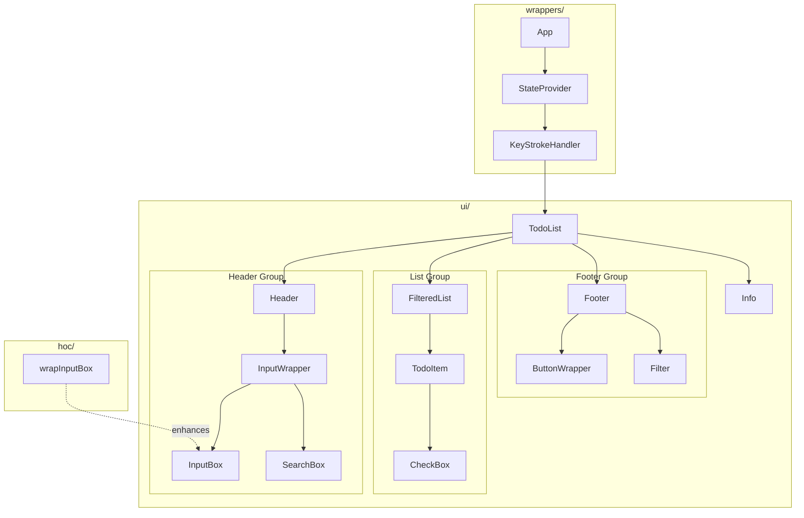

# Components

> ← Back to [src](../README.md) | [Main README](../../README.md)

## How Do the Components Work Together?

Welcome to the heart of the Todo app! 🎉

Think of components like LEGO blocks—small, reusable pieces that snap together to build your app's interface. Each component has a specific job, and together they create your entire Todo application.

Here's a quick tour of what you'll find in the three folders:

- **hoc/** — Helper functions that wrap components to give them extra powers (like handling keyboard input automatically)
- **ui/** — The visual building blocks—everything you actually see on screen, from the header to individual todo items
- **wrappers/** — The brains of the operation—these manage your app's data and respond to events

Don't worry if terms like "higher-order component" sound intimidating. We'll explain everything in simple terms below!

## Overview

This is where all the visual magic happens! The `components/` folder contains the React UI layer for your Todo application.

We've organized things into three folders to keep concerns separate:
- **hoc/** contains helpers that enhance other components with extra behavior
- **ui/** holds all the visual interface pieces
- **wrappers/** manages the application state and listens for events

## Component Hierarchy

The following diagram shows how components fit together in the application. You'll notice that data flows from the top (App) down through nested components:

```mermaid
flowchart TB
    subgraph wrappers["wrappers/"]
        APP["App"]
        SP["StateProvider"]
        KSH["KeyStrokeHandler"]
    end
    
    subgraph ui["ui/"]
        TL["TodoList"]
        
        subgraph header_group["Header Group"]
            HDR["Header"]
            IW["InputWrapper"]
            IB["InputBox"]
            SB["SearchBox"]
        end
        
        subgraph list_group["List Group"]
            FL["FilteredList"]
            TI["TodoItem"]
            CB["CheckBox"]
        end
        
        subgraph footer_group["Footer Group"]
            FTR["Footer"]
            BW["ButtonWrapper"]
            FLT["Filter"]
        end
        
        INFO["Info"]
    end
    
    subgraph hoc["hoc/"]
        HOC["wrapInputBox"]
    end
    
    APP --> SP
    SP --> KSH
    KSH --> TL
    
    TL --> HDR
    TL --> FL
    TL --> FTR
    TL --> INFO
    
    HDR --> IW
    IW --> IB
    IW --> SB
    
    FL --> TI
    TI --> CB
    
    FTR --> BW
    FTR --> FLT
    
    HOC -.->|enhances| IB
```

## Organization

The components folder contains three subdirectories, each with its own special purpose. Let's explore each one:

### hoc/

**What are HOCs?** Higher-Order Components are like gift wrappers for your components. They take a regular component, add some useful features, and hand back an improved version. It's a pattern that lets you reuse behavior across different components.

| File | What It Does |
|------|--------------|
| `wrapInputBox.js` | Wraps input components to handle typing and keyboard events (like pressing Enter) automatically—so you don't have to write that code every time! |

### ui/

**What are UI Components?** These are your visual building blocks—everything the user actually sees and interacts with on screen. They receive information from their parents (we call this "props") and display it nicely.

| File | What It Does |
|------|--------------|
| `TodoList.js` | The main container that brings everything together—header, list, footer, and help info |
| `Header.js` | Shows the "Things To Do" title and the input area |
| `Footer.js` | The bottom bar with mode buttons, item count, and filter options |
| `FilteredList.js` | Shows your todo items, or a friendly message when the list is empty |
| `TodoItem.js` | A single todo item with its checkbox—one of these appears for each task |
| `CheckBox.js` | A clickable checkbox that knows whether it's checked or not |
| `InputBox.js` | Where you type new todo items |
| `InputWrapper.js` | Smart routing—shows InputBox, SearchBox, or nothing depending on what mode you're in |
| `SearchBox.js` | Where you type to search through your todos |
| `Filter.js` | Buttons to show All, Active, or Completed items |
| `ButtonWrapper.js` | Buttons to switch between adding and searching modes |
| `Info.js` | Helpful hints about keyboard shortcuts |

### wrappers/

**What are Wrapper Components?** Think of these as the backstage crew. They don't show up on screen themselves, but they make everything work by managing data and listening for events. They wrap around other components to give them the information and powers they need.

| File | What It Does |
|------|--------------|
| `App.js` | The starting point—sets up the provider hierarchy so everything works together |
| `StateProvider.js` | The memory of your app—keeps track of your todos, filters, and current mode |
| `KeyStrokeHandler.js` | Listens for keyboard shortcuts so you can switch modes without clicking |

## Data Flow

Here's how data moves through your components. Think of it like water flowing downstream—from the top (App) down to the smallest components (buttons, checkboxes).

### Understanding the Basics

- **State** is just data that can change—like your list of todos or which filter is selected
- **Props** are packages of information passed from parent to child components
- **Actions** are functions that change the state—like adding a new todo or checking one off

### How It All Connects

1. **StateProvider keeps track of everything:**
   - `list` — Your todo items
   - `filter` — Which items you're viewing (All, Active, or Completed)
   - `mode` — What you're doing right now (Creating, Searching, or just viewing)
   - `query` — What you've typed in the search box

2. **StateProvider shares this with its children** by passing down two things:
   - `data` — The current state (what to display)
   - `actions` — Methods to change things (what users can do)

3. **KeyStrokeHandler watches for keyboard shortcuts** and calls the right action when you press a mode-switching key.

4. **TodoList distributes information** to each section of the UI:
   - Header gets what it needs to handle input
   - FilteredList gets the items to display
   - Footer gets filter controls and mode buttons
   - Info shows helpful hints

5. **UI components render and respond.** When you click a checkbox or type in a field, they call the action methods to update the state—and the whole cycle starts again!

> 💡 **Don't worry if this seems complex at first!** It'll click once you see it in action. The key idea is simple: data flows down, actions bubble up.

## Related

### Where to Go Next

New to the codebase? Here's a suggested reading order:

1. **[ui/](ui/README.md)** — Start here to see all the visual components
2. **[wrappers/](wrappers/README.md)** — Learn how state management works
3. **[hoc/](hoc/README.md)** — Understand how components get enhanced

### Subfolders

- [hoc/](hoc/README.md) — Higher-order component documentation
- [ui/](ui/README.md) — UI components catalog with props and examples
- [wrappers/](wrappers/README.md) — State management and event handling docs

### Dependencies

These modules work hand-in-hand with components:

- [services/](../services/README.md) — Business logic for todo operations, filtering, and mode changes
- [util/](../util/README.md) — Helper functions used by wrapper components
- [assets/](../assets/README.md) — Static resources like images and text strings used by UI components
