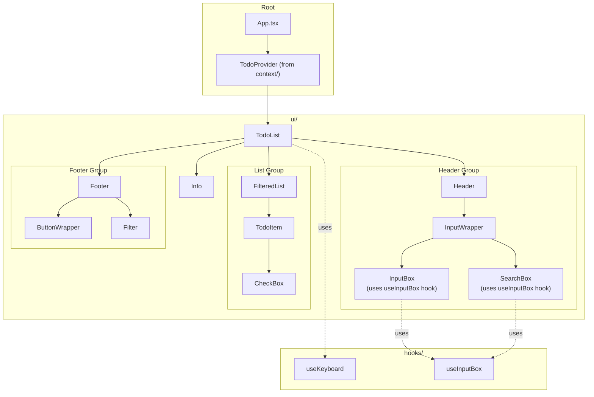

# Components

> ← Back to [src](../README.md) | [Main README](../../README.md)

## Overview

This folder contains the React UI layer for the Todo application. The components are organized with the `App.tsx` root component at the top level and the `ui/` subfolder containing presentational components that form the visual interface. State management is handled through the `context/` folder via `TodoContext`, and reusable stateful logic is encapsulated in custom hooks from the `hooks/` folder (including `useKeyboard` for global keyboard handling and `useInputBox` for input components).

## Component Hierarchy

The following diagram shows how components are composed within the application:

```mermaid
flowchart TB
    subgraph root["Root"]
        APP["App.tsx"]
        TP["TodoProvider (from context/)"]
    end
    
    subgraph ui["ui/"]
        TL["TodoList"]
        
        subgraph header_group["Header Group"]
            HDR["Header"]
            IW["InputWrapper"]
            IB["InputBox<br/>(uses useInputBox hook)"]
            SB["SearchBox<br/>(uses useInputBox hook)"]
        end
        
        subgraph list_group["List Group"]
            FL["FilteredList"]
            TI["TodoItem"]
            CB["CheckBox"]
        end
        
        subgraph footer_group["Footer Group"]
            FTR["Footer"]
            BW["ButtonWrapper"]
            FLT["Filter"]
        end
        
        INFO["Info"]
    end
    
    subgraph hooks["hooks/"]
        UK["useKeyboard"]
        UIB["useInputBox"]
    end
    
    APP --> TP
    TP --> TL
    
    TL -.->|uses| UK
    
    TL --> HDR
    TL --> FL
    TL --> FTR
    TL --> INFO
    
    HDR --> IW
    IW --> IB
    IW --> SB
    
    IB -.->|uses| UIB
    SB -.->|uses| UIB
    
    FL --> TI
    TI --> CB
    
    FTR --> BW
    FTR --> FLT
```

## Organization

The components folder contains the root App component and a ui/ subdirectory for presentational components:

### App.tsx

The root component that serves as the application entry point. It wraps the entire application with the `TodoProvider` context provider, enabling state management throughout the component tree.

| File | Purpose |
|------|---------|
| `App.tsx` | Application root that provides TodoContext and renders the main TodoList component |

**Key Features:**
- Functional component using React hooks
- Integrates `TodoProvider` from `context/TodoContext` for global state management
- Uses `useKeyboard` hook for handling global keyboard shortcuts (mode switching)
- Simplified composition without class-based wrapper components

### ui/

Presentational components form the visual interface of the application. These components receive data and callbacks through props (or via `useTodoContext` hook) and render the UI. All components are TypeScript functional components using the `.tsx` extension.

| File | Purpose |
|------|---------|
| `TodoList.tsx` | Main container that composes all UI sections and integrates useKeyboard hook |
| `Header.tsx` | Displays the application title and input area |
| `Footer.tsx` | Contains mode buttons, item count, and filter controls |
| `FilteredList.tsx` | Renders the list of todo items or an empty state message |
| `TodoItem.tsx` | Displays a single todo item with completion checkbox |
| `CheckBox.tsx` | Controlled checkbox input component |
| `InputBox.tsx` | Text input for adding new todo items (uses useInputBox hook) |
| `InputWrapper.tsx` | Routes between InputBox and SearchBox based on mode |
| `SearchBox.tsx` | Text input for searching todo items (uses useInputBox hook) |
| `Filter.tsx` | Buttons to filter by All, Active, or Completed status |
| `ButtonWrapper.tsx` | Buttons to switch between Create and Search modes |
| `Info.tsx` | Displays keyboard shortcut hints |

## Data Flow

Data flows through the component hierarchy using React Context in a unidirectional pattern:

1. **TodoContext** (via `TodoProvider`) maintains the application state:
   - `todos` — Array of todo items
   - `filter` — Current filter selection (All, Active, Completed)
   - `mode` — Current input mode (Create, Search, None)
   - `query` — Current search query string

2. **TodoProvider** makes state and action methods available to all descendant components via the `useTodoContext` hook, eliminating prop drilling.

3. **useKeyboard hook** (used in TodoList) intercepts keyboard events and calls `changeMode()` when mode-switching keys are pressed. This hook properly manages event listener cleanup to prevent memory leaks.

4. **TodoList** accesses state via `useTodoContext` and distributes relevant portions to child components:
   - Header receives `addNew`, `mode`, `query`, and `setSearchQuery`
   - FilteredList receives the filtered `items` array and `changeStatus`
   - Footer receives `activeItemCount`, `filter`, `changeFilter`, `mode`, and `changeMode`
   - Info receives `mode`

5. **useInputBox hook** provides shared input handling logic to InputBox and SearchBox components, including controlled value state and keyboard event handlers. This eliminates code duplication between these components.

6. **UI components** render based on the props/context they receive and call action methods when users interact with them.

## Related

### Subfolders

- [ui/](ui/README.md) — UI components catalog

### Supporting Modules

- [hooks/](../hooks/README.md) — Custom hooks including useInputBox, useKeyboard, and useTodoState
- [context/](../context/README.md) — React Context providers including TodoContext

### Dependencies

- [services/](../services/README.md) — Business logic for todo operations, filtering, and mode management
- [utils/](../utils/README.md) — Helper functions used by components and hooks
- [assets/](../assets/README.md) — Static resources including locale strings used by UI components
