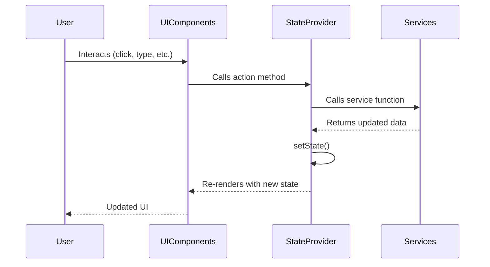

# Wrapper Components

> ← Back to [Components](../README.md) | [Main README](../../../README.md)

## Overview

Wrapper components handle application state and global event listening. They form the outer shell of the application, providing data and action methods to child components. Unlike presentational components in the `ui/` folder, wrappers do not render visible UI elements themselves. Instead, they manage cross-cutting concerns and pass information down to their children.

## Contents

| File | Purpose |
|------|---------|
| `App.js` | Application root that composes the provider hierarchy |
| `StateProvider.js` | Manages application state and provides action methods |
| `KeyStrokeHandler.js` | Listens for global keyboard events and triggers mode changes |

---

## App.js

**Purpose**: Application root composition. This is the main entry component imported by `src/index.js`.

### Nesting Structure

App creates a provider hierarchy by nesting components in this order:

1. **StateProvider** — Holds and manages all application state
2. **KeyStrokeHandler** — Intercepts keyboard events for mode switching
3. **TodoList** — The main UI component that renders the application interface

### Component Hierarchy

```jsx
<StateProvider>
    <KeyStrokeHandler>
        <TodoList/>
    </KeyStrokeHandler>
</StateProvider>
```

This structure ensures that `TodoList` and all its descendants have access to both state data and keyboard event handling.

---

## StateProvider.js

**Purpose**: Centralized state container for the application. This component holds all application state in its React component state and provides action methods that child components can call to update that state.

### State Shape

| Property | Type | Initial Value | Description |
|----------|------|---------------|-------------|
| `query` | string | `''` | Current search query text |
| `mode` | string | `MODE_CREATE` | Current UI mode (create, search, or none) |
| `filter` | string | `FILTER_ALL` | Current filter selection (all, active, or completed) |
| `list` | array | `getAll()` | Array of todo items |

### Action Methods

These methods are exposed to child components through the `actions` prop:

| Method | Parameters | Description |
|--------|------------|-------------|
| `addNew` | `text: string` | Adds a new todo item with the given text |
| `changeFilter` | `filter: string` | Updates the filter selection |
| `changeStatus` | `itemId: number, completed: boolean` | Updates the completion status of a todo item |
| `changeMode` | `mode: string` | Changes the current UI mode |
| `setSearchQuery` | `text: string` | Updates the search query string |

### How It Works

StateProvider uses two helper functions from `util/common.js`:

- **`objectWithOnly()`** — Creates an object containing only the specified action methods, bound to the StateProvider instance
- **`wrapChildrenWith()`** — Clones child components and injects additional props (`data` and `actions`)

Children receive:
- `data` — The current state object
- `actions` — An object containing the action methods listed above

### State Flow

The following diagram shows how state updates flow through the application:



---

## KeyStrokeHandler.js

**Purpose**: Global keyboard event listener that enables keyboard shortcuts for switching between UI modes.

### Events

- Listens to the `keydown` event on the `window` object
- Automatically attaches the listener when the component mounts
- Removes the listener when the component unmounts

### Mode Switching Logic

Uses `getNextModeByKey()` from the mode service to determine if a keypress should change the UI mode. If the new mode differs from the current mode, the component prevents the default key action and calls `changeMode()`.

### Keyboard Shortcuts

| Key | Action | Description |
|-----|--------|-------------|
| `N` | Switch to CREATE mode | Shows the input box for adding new todos |
| `/` | Switch to SEARCH mode | Shows the search box for filtering todos |
| `Escape` | Switch to NONE mode | Hides the input/search box |

**Note**: Shortcuts only work when the current mode allows them. For example, pressing `N` or `/` only works when in NONE mode. Pressing `Escape` works in CREATE or SEARCH mode.

### Props Passthrough

KeyStrokeHandler receives `data` and `actions` from StateProvider and passes them to its children using `wrapChildrenWith()`. This ensures the TodoList component and its descendants have access to state and actions.

---

## Related

### Services

These wrapper components depend on the following services:

- [mode.js](../../services/README.md) — Defines `MODE_CREATE`, `MODE_SEARCH`, `MODE_NONE` constants and `getNextModeByKey()` function
- [filter.js](../../services/README.md) — Defines `FILTER_ALL`, `FILTER_ACTIVE`, `FILTER_COMPLETED` constants
- [todo.js](../../services/README.md) — Provides `getAll()`, `addToList()`, and `updateStatus()` functions

### Utilities

- [common.js](../../util/README.md) — Provides `objectWithOnly()` and `wrapChildrenWith()` helper functions

### Related Components

- [UI Components](../ui/README.md) — Presentational components that receive state and actions from these wrappers
