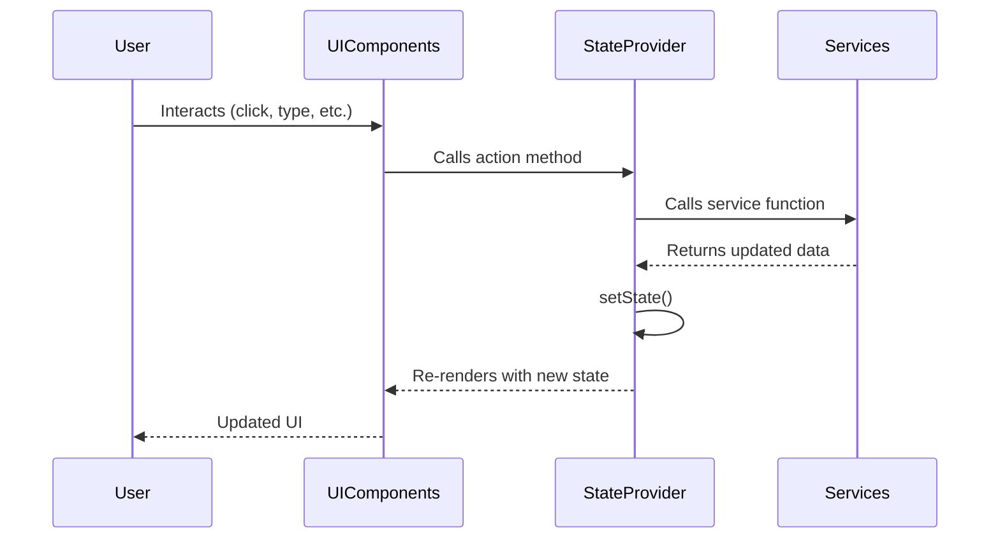

# Wrapper Components

> ← Back to [Components](../README.md) | [Main README](../../../README.md)

## What are Wrapper Components?

Welcome! If you're new here, this is a great place to understand how the app manages its data.

**Think of wrapper components like the backstage crew at a theater** — you don't see them on stage, but they make everything work smoothly behind the scenes. While the [UI components](../ui/README.md) focus on looking good and displaying things to users, wrapper components focus on **remembering things** and **responding to actions**.

Here's what they do in simple terms:

- **Keep track of your app's data** (like your list of todos and the current filter)
- **Provide "buttons"** that child components can press to change that data
- **Listen for keyboard shortcuts** so you can use the app without clicking

Don't worry if this seems complex at first! Once you understand that **data flows down** (from wrappers to UI components) and **actions flow up** (from UI components back to wrappers), everything else makes sense.

---

## Overview

These are the organizers of your app. They keep track of your data and pass it down to the visual components. There are just three files here, and each has a specific job:

## Contents

| File | What It Does |
|------|--------------|
| `App.js` | The entry point — connects all the pieces together like Russian nesting dolls |
| `StateProvider.js` | The app's memory — remembers your todos, current filter, and what mode you're in |
| `KeyStrokeHandler.js` | The keyboard listener — watches for keypresses and switches modes |

---

## App.js

**What it does:** This is where everything comes together. It's the main component that gets loaded when the app starts.

### How It Nests Components

Think of App.js like Russian nesting dolls — it wraps components inside other components in a specific order:

1. **StateProvider** (outermost) — Holds all the app's data
2. **KeyStrokeHandler** (middle) — Listens for keyboard shortcuts
3. **TodoList** (innermost) — The actual UI you see on screen

Here's what that looks like in code:

```jsx
<StateProvider>
    <KeyStrokeHandler>
        <TodoList/>
    </KeyStrokeHandler>
</StateProvider>
```

This nesting ensures that `TodoList` (and everything inside it) can access both the app's data and respond to keyboard shortcuts. Pretty clever, right?

---

## StateProvider.js

**What it does:** This is the memory of your app. It remembers your todos, what filter you've selected, what you're searching for, and what mode you're in. It also provides the "remote control buttons" (we call them actions) that let other components change this data.

### The App's Memory (State)

Think of state as your app's memory — it remembers things that can change. Here's what it keeps track of:

| What | Type | Starts As | What It Means |
|------|------|-----------|---------------|
| `query` | text | `''` (empty) | What you're searching for when in search mode |
| `mode` | text | `MODE_CREATE` | What the app is doing — Create mode, Search mode, or just browsing |
| `filter` | text | `FILTER_ALL` | Which todos to show — All, Active, or Completed |
| `list` | array | sample todos | Your todo items (starts with some examples) |

### The Remote Control (Actions)

Actions are like buttons on a remote control — each one does something specific to change the app's state. Child components call these methods when they need to update something:

| Button (Method) | What You Give It | What It Does |
|-----------------|------------------|--------------|
| `addNew(text)` | The text of your new todo | Adds a new todo to your list |
| `changeFilter(filter)` | Which filter to use | Switches which todos you see (All, Active, or Completed) |
| `changeStatus(id, completed)` | Todo ID and true/false | Marks a todo as done or not done |
| `changeMode(mode)` | Which mode to switch to | Switches between creating, searching, and browsing |
| `setSearchQuery(text)` | What to search for | Updates what you're searching for |

### How It Works Behind the Scenes

StateProvider uses two helper functions from our [utilities](../../util/README.md):

- **`objectWithOnly()`** — Creates a neat package of just the action methods, ready to pass to children
- **`wrapChildrenWith()`** — Hands down the `data` and `actions` to all child components

Every child component receives:
- **`data`** — The current state (todos, filter, mode, search query)
- **`actions`** — The remote control buttons to change things

### How Data Flows Through the App

Here's what happens when you interact with the app — it's like a conversation between you and your components:


```mermaid
sequenceDiagram
    participant User
    participant UIComponents
    participant StateProvider
    participant Services

    User->>UIComponents: Interacts (click, type, etc.)
    UIComponents->>StateProvider: Calls action method
    StateProvider->>Services: Calls service function
    Services-->>StateProvider: Returns updated data
    StateProvider->>StateProvider: setState()
    StateProvider-->>UIComponents: Re-renders with new state
    UIComponents-->>User: Updated UI
```

**In plain English:** You do something → the component calls an action → the state updates → the screen refreshes to show the change. That's it!

---

## KeyStrokeHandler.js

**What it does:** This is the keyboard listener. It watches for specific keypresses and tells the app to switch modes. Press `N` to create a new todo, `/` to search, and `Escape` to cancel.

### What It Listens For

This component attaches itself to the browser window and listens for `keydown` events. When you press a key:

1. It checks if that key should change the mode (using the [mode service](../../services/README.md))
2. If yes, it prevents the normal key behavior and switches modes
3. If no, it lets the keypress do its normal thing

### Keyboard Shortcuts

| Press This | What Happens | When It Works |
|------------|--------------|---------------|
| `N` | Opens the input box to add a new todo | When you're just browsing (not already typing) |
| `/` | Opens the search box to filter by text | When you're just browsing (not already typing) |
| `Escape` | Closes whatever input box is open | When you're in create or search mode |

**Quick tip:** These shortcuts only work when it makes sense. You can't press `N` to create a new todo if you're already in create mode — that wouldn't make sense!

### Passing Data Along

KeyStrokeHandler receives `data` and `actions` from StateProvider and passes them along to its children. This way, TodoList and all its child components can access everything they need.

---

## The Key Insight

If you remember one thing from this page, remember this:

> **Data flows down, actions flow up.**

StateProvider holds the data and passes it down to children. When children need to change something, they call an action method that flows back up to StateProvider. StateProvider updates its state, and the new data flows back down again. It's a beautiful cycle!

---

## Related

### Services

These wrapper components use the following services to do their work:

- [mode.js](../../services/README.md) — Defines the modes (`MODE_CREATE`, `MODE_SEARCH`, `MODE_NONE`) and the `getNextModeByKey()` function
- [filter.js](../../services/README.md) — Defines the filters (`FILTER_ALL`, `FILTER_ACTIVE`, `FILTER_COMPLETED`)
- [todo.js](../../services/README.md) — Handles todo operations like `getAll()`, `addToList()`, and `updateStatus()`

### Utilities

- [common.js](../../util/README.md) — Helper functions `objectWithOnly()` and `wrapChildrenWith()`

### Related Components

- [UI Components](../ui/README.md) — The visual components that receive state and actions from these wrappers
