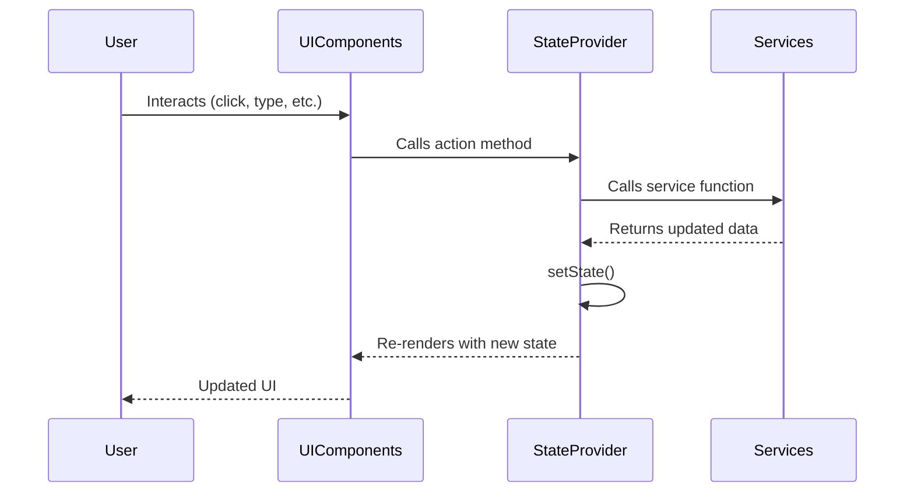
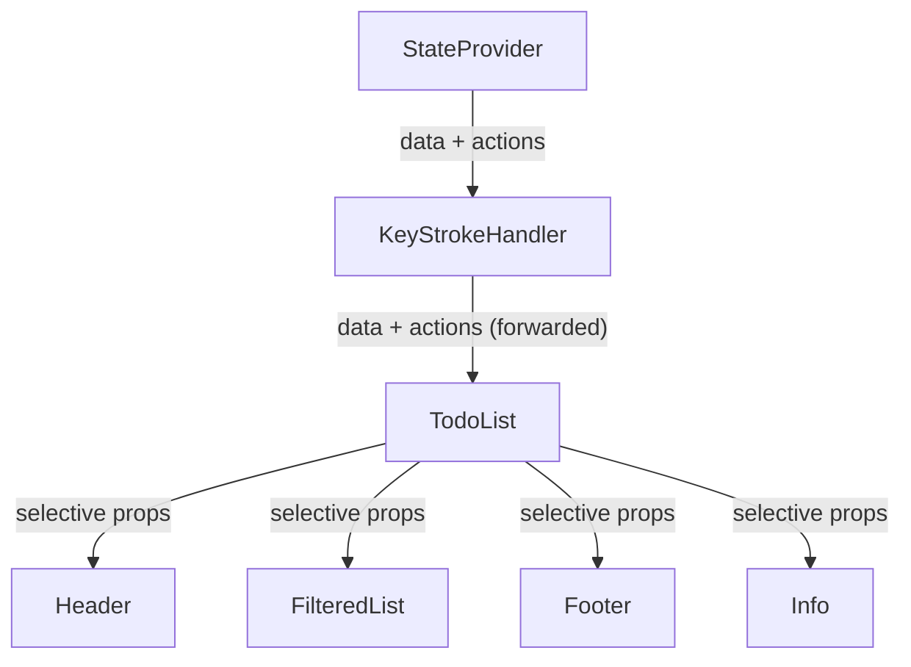

# Wrapper Components

> ← Back to [Components](../README.md) | [Main README](../../../README.md)

## Overview

Wrapper components handle application state and global event listening. They form the outer shell of the application, providing data and action methods to child components. Unlike presentational components in the `ui/` folder, wrappers do not render visible UI elements themselves. Instead, they manage cross-cutting concerns and pass information down to their children.

## Contents

| File | Purpose |
|------|---------|
| `App.js` | Application root that composes the provider hierarchy |
| `StateProvider.js` | Manages application state and provides action methods |
| `KeyStrokeHandler.js` | Listens for global keyboard events and triggers mode changes |

---

## App.js

**Purpose**: Application root composition shell. This is the main entry component imported and rendered by `src/index.js` via `ReactDOM.render(<App/>, document.getElementById('root'))`.

App itself contains **no local state**, **no business logic**, and **no prop manipulation** — it is purely a composition shell that enforces the strict provider ordering required by the prop injection chain.

### Nesting Structure

App creates a provider hierarchy by nesting components in a **strict and immutable** order:

1. **StateProvider** (outermost) — MUST be the outermost wrapper because it initializes and owns all application state (`query`, `mode`, `filter`, `list`) and the five action methods. All descendants need access to this state and these actions.
2. **KeyStrokeHandler** (middle) — MUST wrap TodoList because it intercepts global keyboard events (`window.keydown`) and needs access to both `data.mode` (from StateProvider) and `actions.changeMode` (from StateProvider) to perform mode transitions. It then re-forwards all props to TodoList via `wrapChildrenWith()`.
3. **TodoList** (innermost) — Receives the full `data` and `actions` props through the injection chain and distributes specific props to its sub-components (Header, FilteredList, Footer, Info).

> **Why is this order immutable?** Each layer depends on the props injected by the layer above it. Reordering would break the prop injection chain — for example, placing KeyStrokeHandler above StateProvider would mean it has no `data` or `actions` props to consume or forward.

### Component Hierarchy

```jsx
<StateProvider>
    <KeyStrokeHandler>
        <TodoList/>
    </KeyStrokeHandler>
</StateProvider>
```

This structure ensures that `TodoList` and all its descendants have access to both state data and keyboard event handling through the `wrapChildrenWith()` prop injection mechanism described below.

---

## StateProvider.js

**Purpose**: Centralized state container for the application. This React 15.x class component (`extends React.Component`) holds all application state in its React component state and provides action methods that child components can call to update that state. It is the **single source of truth** — no other component maintains authoritative application state.

### State Shape

| Property | Type | Initial Value | Source | Description |
|----------|------|---------------|--------|-------------|
| `query` | string | `''` | (literal) | Current search query for text filtering via `search()` in `filter.js` |
| `mode` | string | `MODE_CREATE` | `mode.js` | Current input mode: `MODE_NONE`, `MODE_CREATE`, or `MODE_SEARCH` |
| `filter` | string | `FILTER_ALL` | `filter.js` | Current filter: `FILTER_ALL`, `FILTER_ACTIVE`, or `FILTER_COMPLETED` |
| `list` | array | `getAll()` | `todo.js` | Array of todo items seeded with 3 initial items `{id, text, completed}` |

### Action Methods

These five methods are the **sole mutation entry points** for the entire application. They are exposed to child components through the `actions` prop:

| Method | Parameters | Description |
|--------|------------|-------------|
| `addNew` | `text: string` | Creates a new todo via `addToList(this.state.list, {text, completed: false})` from `todo.js`, then calls `setState({list: updatedList})` |
| `changeFilter` | `filter: string` | Sets the active filter via `setState({filter})` |
| `changeStatus` | `itemId: number, completed: boolean` | Updates item status via `updateStatus(this.state.list, itemId, completed)` from `todo.js` (uses `immutability-helper` internally), then calls `setState({list: updatedList})` |
| `changeMode` | `mode: string` (default: `MODE_NONE`) | Sets the UI mode via `setState({mode})`. Defaults to `MODE_NONE` if no argument is provided |
| `setSearchQuery` | `text: string` | Sets the search query via `setState({query: text \|\| ''})`. Normalizes falsy values to an empty string |

### How It Works

StateProvider uses two helper functions from `util/common.js` to implement a custom prop injection pattern that bypasses React's Context API (unavailable in React 15.x):

#### `objectWithOnly()` — Action Extraction

The `render()` method calls `objectWithOnly(this, ['addNew', 'changeFilter', 'changeStatus', 'changeMode', 'setSearchQuery'])` which:

1. Creates a new plain object
2. For each method name in the array, extracts the method from `this` (the StateProvider instance)
3. Binds each method to `this` via `Function.prototype.bind()`
4. Returns the object with only these 5 bound methods — ensuring child components cannot access other StateProvider internals

#### `wrapChildrenWith()` — Prop Injection

The `render()` method then calls `wrapChildrenWith(this.props.children, { data: this.state, actions })` which:

1. Iterates over children using `React.Children.map`
2. Clones each child using `React.cloneElement` with the merged `{data, actions}` props
3. Returns the cloned children, each now having access to the full state and bound action methods

Children receive:
- `data` — The current state object containing `{query, mode, filter, list}`
- `actions` — An object containing the 5 bound action methods listed above

### Service Layer Dependencies

| Service | Imports Used | Purpose |
|---------|-------------|---------|
| `todo.js` | `getAll()`, `addToList()`, `updateStatus()` | Immutable CRUD operations on the todo list |
| `filter.js` | `FILTER_ALL` | Default filter constant for initial state |
| `mode.js` | `MODE_CREATE`, `MODE_NONE` | Mode constants for initial state and default parameter |

### Utility Dependencies

| Utility | Imports Used | Purpose |
|---------|-------------|---------|
| `common.js` | `objectWithOnly()`, `wrapChildrenWith()` | Action extraction and prop injection helpers |

### State Flow

The following diagram shows how state updates flow through the application:


```mermaid
sequenceDiagram
    participant User
    participant UIComponents
    participant StateProvider
    participant Services

    User->>UIComponents: Interacts (click, type, etc.)
    UIComponents->>StateProvider: Calls action method
    StateProvider->>Services: Calls service function
    Services-->>StateProvider: Returns updated data
    StateProvider->>StateProvider: setState()
    StateProvider-->>UIComponents: Re-renders with new state
    UIComponents-->>User: Updated UI
```

---

## KeyStrokeHandler.js

**Purpose**: Global keyboard event listener (React 15.x class component) that enables keyboard shortcuts for switching between UI modes.

### Lifecycle Hooks

KeyStrokeHandler uses React 15.x lifecycle methods to manage the global event listener:

- **`componentWillMount()`** — Binds `handleKeyUp` to `this` and registers it as a `window.keydown` event listener. Note: uses `componentWillMount` which is a React 15.x lifecycle method (deprecated in React 16.3+, removed in React 17+).
- **`componentWillUnmount()`** — Removes the `window.keydown` event listener to prevent memory leaks when the component is removed from the DOM.

### handleKeyUp Delegation

The `handleKeyUp` method processes each keyboard event through the following steps:

1. Receives the keyboard event `e`
2. Destructures `const {mode} = this.props.data` to get the current mode from StateProvider
3. Calls `getNextModeByKey(mode, e.keyCode)` from `mode.js` which returns the next mode based on the FSM transition table
4. If `nextMode !== mode` (a transition is detected):
   - Calls `e.preventDefault()` to suppress default browser behavior
   - Calls `this.props.actions.changeMode(nextMode)` to trigger the state update in StateProvider

### Keyboard Shortcuts

The FSM transition table in `mode.js` defines these mappings:

| Key | From Mode | To Mode | Description |
|-----|-----------|---------|-------------|
| `N` | `MODE_NONE` | `MODE_CREATE` | Shows the input box for adding new todos |
| `/` | `MODE_NONE` | `MODE_SEARCH` | Shows the search box for filtering todos |
| `Escape` | Any mode | `MODE_NONE` | Hides the input/search box |

**Note**: Shortcuts only work when the current mode allows them. For example, pressing `N` or `/` only works when in `MODE_NONE`. Pressing `Escape` works in `MODE_CREATE` or `MODE_SEARCH`.

### Service Dependencies

| Service | Imports Used | Purpose |
|---------|-------------|---------|
| `mode.js` | `getNextModeByKey()` | FSM transition function for keyboard-driven mode changes |

### Utility Dependencies

| Utility | Imports Used | Purpose |
|---------|-------------|---------|
| `common.js` | `wrapChildrenWith()` | Prop forwarding to child components |

### Props Passthrough

The `render()` method calls `wrapChildrenWith(this.props.children, this.props)` which forwards **all** received props (`data` + `actions` from StateProvider) unchanged to child components. The `<div>` wrapper in the render output is necessary because React 15.x does not support Fragments — a single root element is required.

---

## Prop Injection Flow

The wrapper components implement a three-step prop injection chain that distributes state and actions from `StateProvider` down to `TodoList` and its descendants. This pattern replaces React's Context API (unavailable in React 15.x) with explicit prop cloning.

### Step 1 — Action Extraction (StateProvider.render)

```javascript
actions: objectWithOnly(this, ['addNew', 'changeFilter', 'changeStatus', 'changeMode', 'setSearchQuery'])
```

StateProvider extracts its 5 action methods into a plain object with bound references. The `objectWithOnly()` helper ensures that only these specific methods are exposed — child components cannot access any other StateProvider internals.

### Step 2 — State + Actions Injection (StateProvider.render)

```javascript
wrapChildrenWith(this.props.children, { data: this.state, actions })
```

StateProvider clones `KeyStrokeHandler` with merged props:
- `data`: `{query, mode, filter, list}` — the complete application state
- `actions`: `{addNew, changeFilter, changeStatus, changeMode, setSearchQuery}` — the 5 bound action methods

### Step 3 — Prop Forwarding (KeyStrokeHandler.render)

```javascript
wrapChildrenWith(this.props.children, this.props)
```

KeyStrokeHandler receives all props and forwards them unchanged to `TodoList`. TodoList then destructures `props.data` and `props.actions` and selectively passes individual props to its child components (Header, FilteredList, Footer, Info).

### Injection Chain Diagram


```mermaid
flowchart TD
    SP["StateProvider"] -->|"data + actions"| KSH["KeyStrokeHandler"]
    KSH -->|"data + actions (forwarded)"| TL["TodoList"]
    TL -->|"selective props"| H["Header"]
    TL -->|"selective props"| FL["FilteredList"]
    TL -->|"selective props"| F["Footer"]
    TL -->|"selective props"| I["Info"]
```

---

## Related

### Services

These wrapper components depend on the following services:

- [mode.js](../../services/README.md) — Used by **StateProvider** (imports `MODE_CREATE`, `MODE_NONE`) and **KeyStrokeHandler** (imports `getNextModeByKey`). Defines `MODE_CREATE`, `MODE_SEARCH`, `MODE_NONE` constants and the `getNextModeByKey()` FSM transition function.
- [filter.js](../../services/README.md) — Used by **StateProvider** (imports `FILTER_ALL`). Defines `FILTER_ALL`, `FILTER_ACTIVE`, `FILTER_COMPLETED` constants.
- [todo.js](../../services/README.md) — Used by **StateProvider** (imports `getAll`, `addToList`, `updateStatus`). Provides immutable CRUD operations for the todo list.

### Utilities

- [common.js](../../util/README.md) — Used by **StateProvider** (imports `objectWithOnly`, `wrapChildrenWith`) and **KeyStrokeHandler** (imports `wrapChildrenWith`). Provides the core prop injection helpers that power the state distribution mechanism.

### Components Consuming Wrapper Outputs

- [TodoList](../ui/README.md) (from `src/components/ui/`) — Receives `data` and `actions` props from the injection chain as the innermost child of the wrapper hierarchy.
- All UI components nested under TodoList (Header, FilteredList, Footer, Info, and their descendants) indirectly depend on the wrapper-provided props.
