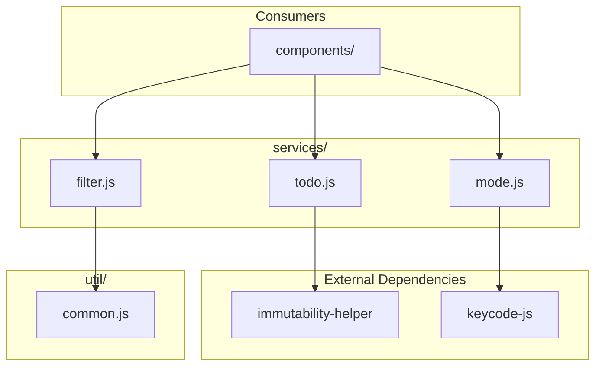
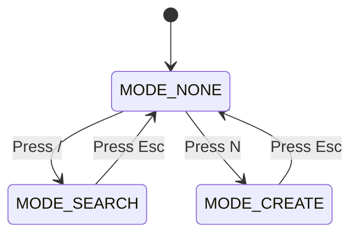

# Services

> ← Back to [src](../README.md) | [Main README](../../README.md)

## Overview

This folder contains three pure business logic modules with no React dependencies. The services handle:

- **Todo data operations** (`todo.js`) — CRUD operations for todo items
- **List filtering and searching** (`filter.js`) — Filter by status and search by text
- **UI mode state management** (`mode.js`) — Keyboard-driven mode transitions

All functions are pure and side-effect free. This makes them safe to call from render methods, reducers, or any other context where predictable behavior is required.

## Service Relationship Diagram

The following diagram shows how the services relate to each other and their consumers:



## Contents

| File | Purpose |
|------|---------|
| `todo.js` | Todo item CRUD operations with immutable data handling |
| `filter.js` | List filtering by status and text search |
| `mode.js` | UI mode state machine with keyboard navigation |

---

## todo.js

Provides todo item CRUD operations with immutable data handling. Uses `immutability-helper` to return new arrays instead of mutating existing data.

### API Reference

| Function | Parameters | Returns | Description |
|----------|------------|---------|-------------|
| `getAll()` | none | `Array` | Returns array of sample todo items `{id, text, completed}` |
| `getItemById(itemId)` | `itemId: number` | `Object` | Finds and returns a todo item by its id |
| `updateStatus(items, itemId, completed)` | `items: Array`, `itemId: number`, `completed: boolean` | `Array` | Returns new list with updated item status (immutable) |
| `addToList(list, data)` | `list: Array`, `data: Object` | `Array` | Returns new list with added item, auto-generates id |

### Data Structure

Each todo item has the following shape:

```javascript
{
    id: number,        // Unique identifier
    text: string,      // Todo item text
    completed: boolean // Completion status
}
```

### Usage Example

```javascript
import { getAll, addToList, updateStatus } from '../services/todo';

// Initialize list with sample data
const list = getAll();
// [
//   { id: 1, text: 'Learn Javascript', completed: false },
//   { id: 2, text: 'Learn React', completed: false },
//   { id: 3, text: 'Build a React App', completed: false }
// ]

// Add a new item (id is auto-generated)
const newList = addToList(list, { text: 'Write tests', completed: false });

// Update item status to completed
const updatedList = updateStatus(list, 1, true);
// Item with id 1 now has completed: true
```

---

## filter.js

Provides list filtering and search functionality. Uses `stringInclues` from `util/common.js` for case-insensitive text matching.

### Constants

| Constant | Value | Description |
|----------|-------|-------------|
| `FILTER_ALL` | `'all'` | Show all items regardless of status |
| `FILTER_ACTIVE` | `'active'` | Show only incomplete items |
| `FILTER_COMPLETED` | `'completed'` | Show only completed items |

### Functions

| Function | Parameters | Returns | Description |
|----------|------------|---------|-------------|
| `applyFilter(list, filter)` | `list: Array`, `filter: string` | `Array` | Filters list by completion status |
| `search(list, query)` | `list: Array`, `query: string` | `Array` | Filters list by text search (case-insensitive) |
| `getOptions()` | none | `Object` | Returns filter options `{all: 'All', active: 'Active', completed: 'Completed'}` |

### Usage Example

```javascript
import { applyFilter, search, getOptions, FILTER_ACTIVE, FILTER_COMPLETED } from '../services/filter';

// Get only active (incomplete) items
const activeItems = applyFilter(list, FILTER_ACTIVE);

// Get only completed items
const completedItems = applyFilter(list, FILTER_COMPLETED);

// Search items by text (case-insensitive)
const searchResults = search(list, 'react');
// Returns items where text includes 'react'

// Get filter options for rendering buttons
const options = getOptions();
// { all: 'All', active: 'Active', completed: 'Completed' }
```

---

## mode.js

Manages UI mode state with keyboard navigation support. Implements a simple state machine that determines mode transitions based on keyboard input.

### Constants

| Constant | Value | Description |
|----------|-------|-------------|
| `MODE_NONE` | `'none'` | Default mode, no input active |
| `MODE_SEARCH` | `'search'` | Search input is active |
| `MODE_CREATE` | `'create'` | Create new todo input is active |

### Functions

| Function | Parameters | Returns | Description |
|----------|------------|---------|-------------|
| `getNextModeByKey(current, keyPressed)` | `current: string`, `keyPressed: number` | `string` | State machine for keyboard-driven mode transitions |

### Keyboard Mapping

The following keyboard shortcuts control mode transitions:

| Key | From Mode | To Mode | Description |
|-----|-----------|---------|-------------|
| `/` (slash) | `MODE_NONE` | `MODE_SEARCH` | Activate search input |
| `N` | `MODE_NONE` | `MODE_CREATE` | Activate create input |
| `Esc` | Any mode | `MODE_NONE` | Return to default mode |

### State Diagram



### Usage Example

```javascript
import { getNextModeByKey, MODE_NONE, MODE_SEARCH, MODE_CREATE } from '../services/mode';
import { KEY_SLASH, KEY_N, KEY_ESCAPE } from 'keycode-js';

// Start in default mode
let currentMode = MODE_NONE;

// User presses "/" key
currentMode = getNextModeByKey(currentMode, KEY_SLASH);
// currentMode is now MODE_SEARCH

// User presses Escape
currentMode = getNextModeByKey(currentMode, KEY_ESCAPE);
// currentMode is now MODE_NONE

// User presses "N" key
currentMode = getNextModeByKey(currentMode, KEY_N);
// currentMode is now MODE_CREATE
```

---

## Related

- [components/wrappers/](../components/wrappers/README.md) — Components that consume these services
- [util/](../util/README.md) — Utility module used by `filter.js`
- [src/](../README.md) — Source code overview
