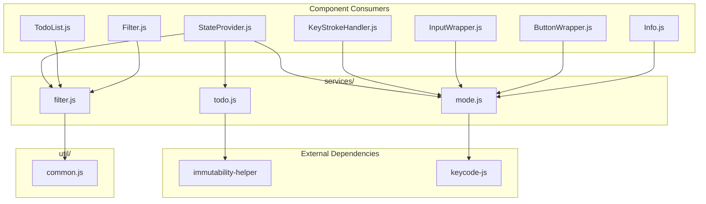
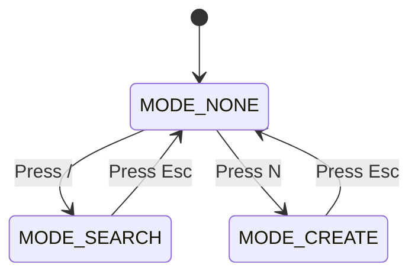

# Services

> ← Back to [src](../README.md) | [Main README](../../README.md)

## Overview

This folder contains three pure business logic modules with no React dependencies. The services handle:

- **Todo data operations** (`todo.js`) — CRUD operations for todo items
- **List filtering and searching** (`filter.js`) — Filter by status and search by text
- **UI mode state management** (`mode.js`) — Keyboard-driven mode transitions

All functions are pure and side-effect free. This makes them safe to call from render methods, reducers, or any other context where predictable behavior is required.

## Service Relationship Diagram

The following diagram shows how the services relate to each other and their consumers:


```mermaid
flowchart TB
    subgraph services["services/"]
        TODO["todo.js"]
        FILTER["filter.js"]
        MODE["mode.js"]
    end

    subgraph deps["External Dependencies"]
        IMM["immutability-helper"]
        KEY["keycode-js"]
    end

    subgraph util["util/"]
        COMMON["common.js"]
    end

    subgraph consumers["Component Consumers"]
        SP["StateProvider.js"]
        KSH["KeyStrokeHandler.js"]
        TL["TodoList.js"]
        IW["InputWrapper.js"]
        BW["ButtonWrapper.js"]
        FLT["Filter.js"]
        INF["Info.js"]
    end

    TODO --> IMM
    FILTER --> COMMON
    MODE --> KEY
    SP --> TODO
    SP --> FILTER
    SP --> MODE
    KSH --> MODE
    TL --> FILTER
    IW --> MODE
    BW --> MODE
    FLT --> FILTER
    INF --> MODE
```

## Contents

| File | Purpose |
|------|---------|
| `todo.js` | Todo item CRUD operations with immutable data handling |
| `filter.js` | List filtering by status and text search |
| `mode.js` | UI mode state machine with keyboard navigation |

---

## todo.js

Provides todo item CRUD operations with immutable data handling. Uses `immutability-helper` to return new arrays instead of mutating existing data.

### API Reference

| Function | Parameters | Returns | Description |
|----------|------------|---------|-------------|
| `getAll()` | none | `Array` | Returns a fresh array of 3 seeded todo items with ids 1–3, each having `{id, text, completed}` shape. All items start with `completed: false` |
| `getItemById(itemId)` | `itemId: number` | `Object\|undefined` | Regenerates the canonical list via `getAll()` and returns the matching item using `Array.prototype.find`. Returns `undefined` if no match is found |
| `updateStatus(items, itemId, completed)` | `items: Array`, `itemId: number`, `completed: boolean` | `Array` | Uses `findIndex` to locate the item, then applies `immutability-helper`'s `update()` with `{$set: completed}` to produce a new array with the toggled status. Immutable — the original array is never modified |
| `addToList(list, data)` | `list: Array`, `data: Object` | `Array` | Auto-generates a unique `id` via the internal `getNextId()` helper, merges it with `data` using `Object.assign()`, and returns `list.concat([item])` for immutable list addition |

### Internal Helpers

These are module-private functions and variables not exported from `todo.js`:

| Name | Type | Description |
|------|------|-------------|
| `todoCounter` | `number` | Module-level counter initialized to `1`. Used for deterministic ID generation. Increments with each call to `getNextId()` |
| `getNextId()` | `function` | Returns `getAll().length + todoCounter++`, combining the seeded list length (`3`) with the incrementing counter to produce unique IDs starting from `4` |

### Data Structure

Each todo item has the following shape:

```javascript
{
    id: number,        // Unique identifier (1-3 for seeded, 4+ for added)
    text: string,      // Todo item text
    completed: boolean // Completion status (false by default)
}
```

### Usage Example

```javascript
import { getAll, addToList, updateStatus } from '../services/todo';

// Initialize list with sample data
const list = getAll();
// [
//   { id: 1, text: 'Learn Javascript', completed: false },
//   { id: 2, text: 'Learn React', completed: false },
//   { id: 3, text: 'Build a React App', completed: false }
// ]

// Add a new item (id is auto-generated)
const newList = addToList(list, { text: 'Write tests', completed: false });

// Update item status to completed
const updatedList = updateStatus(list, 1, true);
// Item with id 1 now has completed: true
```

---

## filter.js

Provides list filtering and search functionality. Uses `stringInclues` from `util/common.js` for case-insensitive text matching.

### Constants

| Constant | Value | Description |
|----------|-------|-------------|
| `FILTER_ALL` | `'all'` | Default filter showing all items regardless of completion status. Used as the `default` case in `applyFilter` |
| `FILTER_ACTIVE` | `'active'` | Filters items where `completed !== true` (pending items only) |
| `FILTER_COMPLETED` | `'completed'` | Filters items where `completed === true` (finished items only) |

### Functions

| Function | Parameters | Returns | Description |
|----------|------------|---------|-------------|
| `applyFilter(list, filter)` | `list: Array`, `filter: string` | `Array` | Uses a `switch` statement: returns `list.filter(item => item.completed === true)` for `FILTER_COMPLETED`, `list.filter(item => item.completed !== true)` for `FILTER_ACTIVE`, and returns the full list as default for `FILTER_ALL` |
| `search(list, query)` | `list: Array`, `query: string` | `Array` | Trims and lowercases the query, then filters items using `stringInclues(text.toLowerCase(), q)` imported from `../util/common`. The helper name is intentionally misspelled (`stringInclues` without the "d") for backward compatibility |
| `getOptions()` | none | `Object` | Returns an object using computed property names: `{ [FILTER_ALL]: 'All', [FILTER_ACTIVE]: 'Active', [FILTER_COMPLETED]: 'Completed' }`. Used by the `Filter` component to render filter anchors |

> **Dependency Note:** `filter.js` imports `stringInclues` from `../util/common` — the sole internal dependency for this service module. All other services have zero internal imports.

### Usage Example

```javascript
import { applyFilter, search, getOptions, FILTER_ACTIVE, FILTER_COMPLETED } from '../services/filter';

// Get only active (incomplete) items
const activeItems = applyFilter(list, FILTER_ACTIVE);

// Get only completed items
const completedItems = applyFilter(list, FILTER_COMPLETED);

// Search items by text (case-insensitive)
const searchResults = search(list, 'react');
// Returns items where text includes 'react'

// Get filter options for rendering buttons
const options = getOptions();
// { all: 'All', active: 'Active', completed: 'Completed' }
```

---

## mode.js

Manages UI mode state with keyboard navigation support. Implements a simple state machine that determines mode transitions based on keyboard input.

### Constants

| Constant | Value | Description |
|----------|-------|-------------|
| `MODE_NONE` | `'none'` | Default mode, no input active |
| `MODE_SEARCH` | `'search'` | Search input is active |
| `MODE_CREATE` | `'create'` | Create new todo input is active |

### Functions

| Function | Parameters | Returns | Description |
|----------|------------|---------|-------------|
| `getNextModeByKey(current, keyPressed)` | `current: string`, `keyPressed: number` | `string` | State machine for keyboard-driven mode transitions |

### Keyboard Mapping

The following keyboard shortcuts control mode transitions:

| Key | From Mode | To Mode | Description |
|-----|-----------|---------|-------------|
| `/` (slash) | `MODE_NONE` | `MODE_SEARCH` | Activate search input |
| `N` | `MODE_NONE` | `MODE_CREATE` | Activate create input |
| `Esc` | Any mode | `MODE_NONE` | Return to default mode |

### State Diagram


```mermaid
stateDiagram-v2
    [*] --> MODE_NONE
    MODE_NONE --> MODE_SEARCH: Press /
    MODE_NONE --> MODE_CREATE: Press N
    MODE_SEARCH --> MODE_NONE: Press Esc
    MODE_CREATE --> MODE_NONE: Press Esc
```

### Usage Example

```javascript
import { getNextModeByKey, MODE_NONE, MODE_SEARCH, MODE_CREATE } from '../services/mode';
import { KEY_SLASH, KEY_N, KEY_ESCAPE } from 'keycode-js';

// Start in default mode
let currentMode = MODE_NONE;

// User presses "/" key
currentMode = getNextModeByKey(currentMode, KEY_SLASH);
// currentMode is now MODE_SEARCH

// User presses Escape
currentMode = getNextModeByKey(currentMode, KEY_ESCAPE);
// currentMode is now MODE_NONE

// User presses "N" key
currentMode = getNextModeByKey(currentMode, KEY_N);
// currentMode is now MODE_CREATE
```

---

## Related

- [components/wrappers/StateProvider.js](../components/wrappers/StateProvider.js) — Consumes `todo.js`, `filter.js`, and `mode.js` for centralized state management
- [components/wrappers/KeyStrokeHandler.js](../components/wrappers/KeyStrokeHandler.js) — Consumes `mode.js` for keyboard-driven mode transitions
- [components/ui/TodoList.js](../components/ui/TodoList.js) — Consumes `filter.js` for the two-stage data pipeline (`applyFilter` → `search`)
- [components/ui/InputWrapper.js](../components/ui/InputWrapper.js) — Consumes `mode.js` constants for conditional input rendering
- [components/ui/ButtonWrapper.js](../components/ui/ButtonWrapper.js) — Consumes `mode.js` constants for mode toggle buttons
- [components/ui/Filter.js](../components/ui/Filter.js) — Consumes `filter.js` for filter options and constants
- [components/ui/Info.js](../components/ui/Info.js) — Consumes `mode.js` constants for contextual keyboard shortcut text
- [util/](../util/README.md) — Utility module providing `stringInclues` to `filter.js`
- [src/](../README.md) — Source code overview
