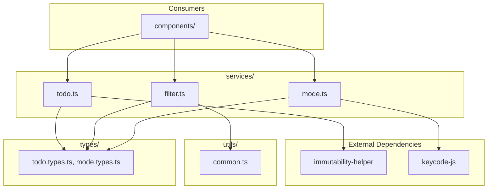
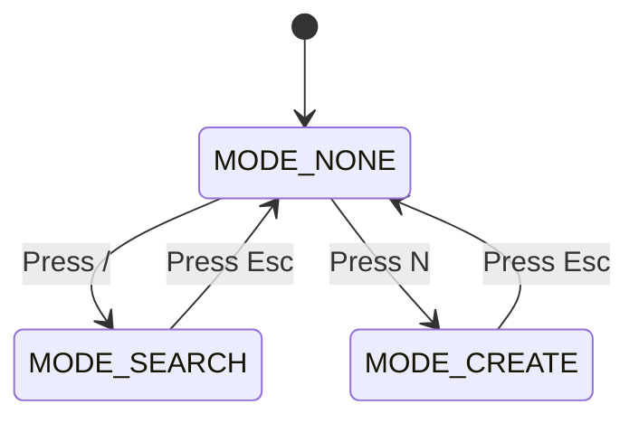

# Services

> ← Back to [src](../README.md) | [Main README](../../README.md)

## Overview

This folder contains three pure business logic modules with no React dependencies. The services handle:

- **Todo data operations** (`todo.ts`) — CRUD operations for todo items
- **List filtering and searching** (`filter.ts`) — Filter by status and search by text
- **UI mode state management** (`mode.ts`) — Keyboard-driven mode transitions

All functions are pure and side-effect free. This makes them safe to call from render methods, reducers, or any other context where predictable behavior is required.

> **Note:** These services are fully typed with TypeScript. Type definitions can be imported from `../types/` for use throughout the application.

## Service Relationship Diagram

The following diagram shows how the services relate to each other and their consumers:


```mermaid
flowchart TB
    subgraph services["services/"]
        TODO["todo.ts"]
        FILTER["filter.ts"]
        MODE["mode.ts"]
    end
    
    subgraph deps["External Dependencies"]
        IMM["immutability-helper"]
        KEY["keycode-js"]
    end
    
    subgraph utils["utils/"]
        COMMON["common.ts"]
    end
    
    subgraph types["types/"]
        TYPES["todo.types.ts, mode.types.ts"]
    end
    
    subgraph consumers["Consumers"]
        COMP["components/"]
    end
    
    TODO --> IMM
    TODO --> TYPES
    FILTER --> COMMON
    FILTER --> TYPES
    MODE --> KEY
    MODE --> TYPES
    COMP --> TODO
    COMP --> FILTER
    COMP --> MODE
```

## Contents

| File | Purpose |
|------|---------|
| `todo.ts` | Todo item CRUD operations with immutable data handling |
| `filter.ts` | List filtering by status and text search |
| `mode.ts` | UI mode state machine with keyboard navigation |

---

## todo.ts

Provides todo item CRUD operations with immutable data handling. Uses `immutability-helper` to return new arrays instead of mutating existing data.

### Type Definitions

The Todo type is imported from the shared types module:

```typescript
import type { Todo } from '../types';

interface Todo {
  id: number;        // Unique identifier
  text: string;      // Todo item text
  completed: boolean; // Completion status
}
```

### API Reference

| Function | Parameters | Returns | Description |
|----------|------------|---------|-------------|
| `getAll()` | none | `Todo[]` | Returns array of sample todo items |
| `getItemById(itemId)` | `itemId: number` | `Todo \| undefined` | Finds and returns a todo item by its id |
| `updateStatus(items, itemId, completed)` | `items: Todo[]`, `itemId: number`, `completed: boolean` | `Todo[]` | Returns new list with updated item status (immutable) |
| `addToList(list, data)` | `list: Todo[]`, `data: Omit<Todo, 'id'>` | `Todo[]` | Returns new list with added item, auto-generates id |

### Usage Example

```typescript
import { getAll, addToList, updateStatus } from '../services/todo';
import type { Todo } from '../types';

// Initialize list with sample data
const list: Todo[] = getAll();
// [
//   { id: 1, text: 'Learn Javascript', completed: false },
//   { id: 2, text: 'Learn React', completed: false },
//   { id: 3, text: 'Build a React App', completed: false }
// ]

// Add a new item (id is auto-generated)
const newList: Todo[] = addToList(list, { text: 'Write tests', completed: false });

// Update item status to completed
const updatedList: Todo[] = updateStatus(list, 1, true);
// Item with id 1 now has completed: true
```

---

## filter.ts

Provides list filtering and search functionality. Uses `stringIncludes` from `utils/common` for case-insensitive text matching.

> **Note:** The function name was corrected from the original `stringInclues` typo to `stringIncludes`.

### Type Definitions

```typescript
import type { Todo } from '../types';
import type { FilterOption } from '../types';

type FilterOption = 'all' | 'active' | 'completed';
```

### Constants

| Constant | Value | Type | Description |
|----------|-------|------|-------------|
| `FILTER_ALL` | `'all'` | `FilterOption` | Show all items regardless of status |
| `FILTER_ACTIVE` | `'active'` | `FilterOption` | Show only incomplete items |
| `FILTER_COMPLETED` | `'completed'` | `FilterOption` | Show only completed items |

### Functions

| Function | Parameters | Returns | Description |
|----------|------------|---------|-------------|
| `applyFilter(list, filter)` | `list: Todo[]`, `filter: FilterOption` | `Todo[]` | Filters list by completion status |
| `search(list, query)` | `list: Todo[]`, `query: string` | `Todo[]` | Filters list by text search (case-insensitive) |
| `getOptions()` | none | `Record<FilterOption, string>` | Returns filter options `{all: 'All', active: 'Active', completed: 'Completed'}` |

### Usage Example

```typescript
import { 
  applyFilter, 
  search, 
  getOptions, 
  FILTER_ACTIVE, 
  FILTER_COMPLETED 
} from '../services/filter';
import type { Todo, FilterOption } from '../types';

// Get only active (incomplete) items
const activeItems: Todo[] = applyFilter(list, FILTER_ACTIVE);

// Get only completed items
const completedItems: Todo[] = applyFilter(list, FILTER_COMPLETED);

// Search items by text (case-insensitive)
const searchResults: Todo[] = search(list, 'react');
// Returns items where text includes 'react'

// Get filter options for rendering buttons
const options: Record<FilterOption, string> = getOptions();
// { all: 'All', active: 'Active', completed: 'Completed' }
```

---

## mode.ts

Manages UI mode state with keyboard navigation support. Implements a simple state machine that determines mode transitions based on keyboard input.

### Type Definitions

```typescript
import type { Mode } from '../types';

type Mode = 'none' | 'search' | 'create';
```

### Constants

| Constant | Value | Type | Description |
|----------|-------|------|-------------|
| `MODE_NONE` | `'none'` | `Mode` | Default mode, no input active |
| `MODE_SEARCH` | `'search'` | `Mode` | Search input is active |
| `MODE_CREATE` | `'create'` | `Mode` | Create new todo input is active |

### Functions

| Function | Parameters | Returns | Description |
|----------|------------|---------|-------------|
| `getNextModeByKey(current, keyPressed)` | `current: Mode`, `keyPressed: number` | `Mode` | State machine for keyboard-driven mode transitions |

### Keyboard Mapping

The following keyboard shortcuts control mode transitions:

| Key | From Mode | To Mode | Description |
|-----|-----------|---------|-------------|
| `/` (slash) | `MODE_NONE` | `MODE_SEARCH` | Activate search input |
| `N` | `MODE_NONE` | `MODE_CREATE` | Activate create input |
| `Esc` | Any mode | `MODE_NONE` | Return to default mode |

### State Diagram


```mermaid
stateDiagram-v2
    [*] --> MODE_NONE
    MODE_NONE --> MODE_SEARCH: Press /
    MODE_NONE --> MODE_CREATE: Press N
    MODE_SEARCH --> MODE_NONE: Press Esc
    MODE_CREATE --> MODE_NONE: Press Esc
```

### Usage Example

```typescript
import { getNextModeByKey, MODE_NONE, MODE_SEARCH, MODE_CREATE } from '../services/mode';
import type { Mode } from '../types';
import { KEY_SLASH, KEY_N, KEY_ESCAPE } from 'keycode-js';

// Start in default mode
let currentMode: Mode = MODE_NONE;

// User presses "/" key
currentMode = getNextModeByKey(currentMode, KEY_SLASH);
// currentMode is now MODE_SEARCH

// User presses Escape
currentMode = getNextModeByKey(currentMode, KEY_ESCAPE);
// currentMode is now MODE_NONE

// User presses "N" key
currentMode = getNextModeByKey(currentMode, KEY_N);
// currentMode is now MODE_CREATE
```

---

## Importing Types

All type definitions used by these services are centralized in the `types/` directory. When using these services in your components or hooks, import types as follows:

```typescript
import type { Todo, Mode, FilterOption } from '../types';
```

This ensures consistent type usage across the application and supports TypeScript's module augmentation.

---

## Related

- [components/](../components/README.md) — Components that consume these services
- [utils/](../utils/README.md) — Utility module used by `filter.ts`
- [types/](../types/index.ts) — Type definitions for services
- [hooks/](../hooks/index.ts) — Custom hooks that wrap service functionality
- [src/](../README.md) — Source code overview
