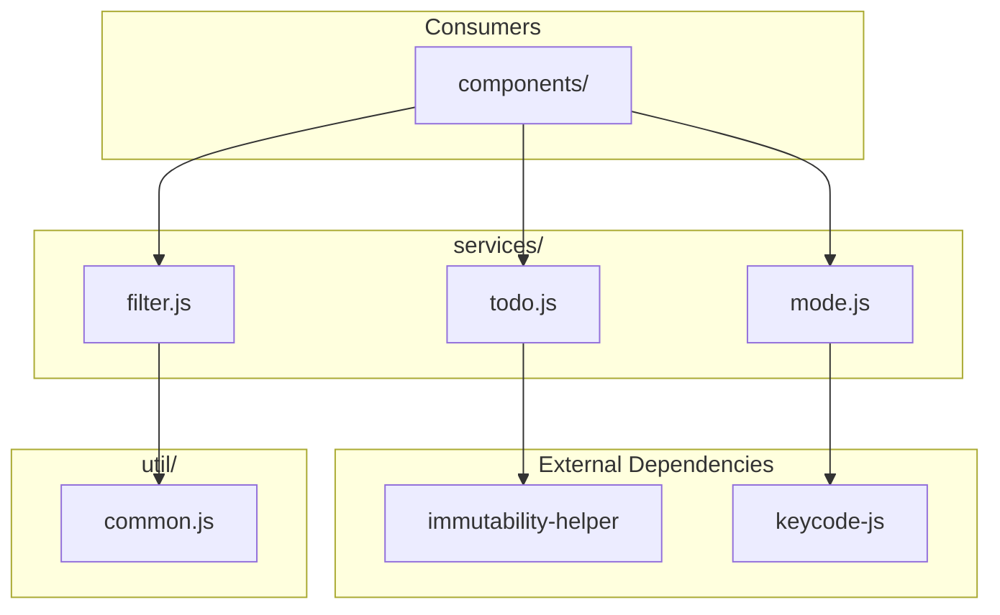
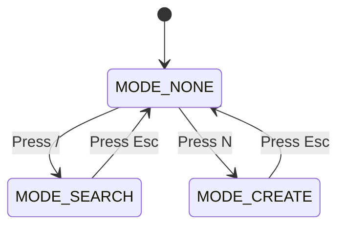

# Services

> ← Back to [src](../README.md) | [Main README](../../README.md)

## What You'll Find Here

This is where the app's brain lives! Services handle all the logic that isn't about how things look on screen. Think of them as helpful assistants that manage your todo items, filter your lists, and remember what mode you're in.

You don't need to know React to understand these files—they're just plain JavaScript doing useful work.

## Overview

You'll find three handy helper modules in this folder, and the best part is they don't depend on React at all:

- **Todo data operations** (`todo.js`) — Manages your todo items—adding, finding, and updating them
- **List filtering and searching** (`filter.js`) — Helps you find specific todos by filtering and searching
- **UI mode state management** (`mode.js`) — Keeps track of which mode you're in (normal, search, or create)

These helpers always give you the same answer for the same input—no surprises! That makes them safe to use anywhere in your code.

## Service Relationship Diagram

The following diagram shows how the services relate to each other and their consumers:


```mermaid
flowchart TB
    subgraph services["services/"]
        TODO["todo.js"]
        FILTER["filter.js"]
        MODE["mode.js"]
    end
    
    subgraph deps["External Dependencies"]
        IMM["immutability-helper"]
        KEY["keycode-js"]
    end
    
    subgraph util["util/"]
        COMMON["common.js"]
    end
    
    subgraph consumers["Consumers"]
        COMP["components/"]
    end
    
    TODO --> IMM
    FILTER --> COMMON
    MODE --> KEY
    COMP --> TODO
    COMP --> FILTER
    COMP --> MODE
```

## Contents

| File | Purpose |
|------|---------|
| `todo.js` | Manages your todo items—adding, finding, and updating them |
| `filter.js` | Helps you find specific todos by filtering and searching |
| `mode.js` | Keeps track of which mode you're in (normal, search, or create) |

---

## todo.js

This service handles everything related to your todo items. It uses `immutability-helper` behind the scenes to make sure we never accidentally change your original data—instead, we always create fresh copies.

### When Would I Use This?

When you click that checkbox to mark something done, or type a new todo and hit Enter, these are the functions making it happen.

### API Reference

| Function | Parameters | Returns | Description |
|----------|------------|---------|-------------|
| `getAll()` | none | `Array` | Gets the starting list of sample todo items to play with |
| `getItemById(itemId)` | `itemId: number` | `Object` | Finds a specific todo by its ID number |
| `updateStatus(items, itemId, completed)` | `items: Array`, `itemId: number`, `completed: boolean` | `Array` | Toggles a todo between done and not done |
| `addToList(list, data)` | `list: Array`, `data: Object` | `Array` | Creates a new todo and adds it to your list |

### Data Structure

Each todo item has this simple shape:

```javascript
{
    id: number,        // A unique number to identify this todo
    text: string,      // What the todo says
    completed: boolean // Is it done? true or false
}
```

### Usage Example

```javascript
import { getAll, addToList, updateStatus } from '../services/todo';

// Start with our sample todos
const list = getAll();
// You get back something like:
// [
//   { id: 1, text: 'Learn Javascript', completed: false },
//   { id: 2, text: 'Learn React', completed: false },
//   { id: 3, text: 'Build a React App', completed: false }
// ]

// Your new item gets added at the end with an auto-generated ID
const newList = addToList(list, { text: 'Write tests', completed: false });

// Now item 1 is marked as done!
const updatedList = updateStatus(list, 1, true);
// Item with id 1 now has completed: true
```

---

## filter.js

This service helps you narrow down your todo list. It uses `stringInclues` from `util/common.js` for case-insensitive text matching (yes, that typo is intentional—it's a quirk of the codebase!).

### When Would I Use This?

When you click those 'All', 'Active', or 'Completed' buttons, or type in the search box, these functions filter your list.

### Constants

| Constant | Value | Description |
|----------|-------|-------------|
| `FILTER_ALL` | `'all'` | Show everything—done or not |
| `FILTER_ACTIVE` | `'active'` | Show only the things you still need to do |
| `FILTER_COMPLETED` | `'completed'` | Show only the things you've finished |

### Functions

| Function | Parameters | Returns | Description |
|----------|------------|---------|-------------|
| `applyFilter(list, filter)` | `list: Array`, `filter: string` | `Array` | Shows only the todos you want to see (all, active, or completed) |
| `search(list, query)` | `list: Array`, `query: string` | `Array` | Finds todos that match your search text |
| `getOptions()` | none | `Object` | Gets the dropdown options for the filter buttons |

### Usage Example

```javascript
import { applyFilter, search, getOptions, FILTER_ACTIVE, FILTER_COMPLETED } from '../services/filter';

// Show me only the things I still need to do
const activeItems = applyFilter(list, FILTER_ACTIVE);

// Show me only the things I've finished
const completedItems = applyFilter(list, FILTER_COMPLETED);

// Looking for something specific? Search is case-insensitive!
const searchResults = search(list, 'react');
// Returns any todo where the text includes 'react' (or 'React', or 'REACT'...)

// Need to build filter buttons? Here are your options:
const options = getOptions();
// { all: 'All', active: 'Active', completed: 'Completed' }
```

---

## mode.js

This service is like a light switch that remembers what mode you're in. It figures out which mode to switch to based on your keyboard presses.

### When Would I Use This?

Ever noticed how pressing '/' activates search, or 'N' lets you create a new todo? This service figures out which mode to switch to based on your keyboard presses.

### Constants

| Constant | Value | Description |
|----------|-------|-------------|
| `MODE_NONE` | `'none'` | Default mode—just browsing your list |
| `MODE_SEARCH` | `'search'` | Search mode is active—type to find todos |
| `MODE_CREATE` | `'create'` | Create mode is active—type to add a new todo |

### Functions

| Function | Parameters | Returns | Description |
|----------|------------|---------|-------------|
| `getNextModeByKey(current, keyPressed)` | `current: string`, `keyPressed: number` | `string` | Figures out which mode to switch to based on which key you pressed |

### Keyboard Mapping

Here's how keyboard shortcuts control mode transitions:

| Key | From Mode | To Mode | Description |
|-----|-----------|---------|-------------|
| `/` (slash) | `MODE_NONE` | `MODE_SEARCH` | Jump into search mode to find todos |
| `N` | `MODE_NONE` | `MODE_CREATE` | Jump into create mode to add a new todo |
| `Esc` | Any mode | `MODE_NONE` | Go back to normal browsing mode |

### State Diagram


```mermaid
stateDiagram-v2
    [*] --> MODE_NONE
    MODE_NONE --> MODE_SEARCH: Press /
    MODE_NONE --> MODE_CREATE: Press N
    MODE_SEARCH --> MODE_NONE: Press Esc
    MODE_CREATE --> MODE_NONE: Press Esc
```

### Usage Example

```javascript
import { getNextModeByKey, MODE_NONE, MODE_SEARCH, MODE_CREATE } from '../services/mode';
import { KEY_SLASH, KEY_N, KEY_ESCAPE } from 'keycode-js';

// You start in default mode—just browsing
let currentMode = MODE_NONE;

// User presses "/" key → we jump into search mode
currentMode = getNextModeByKey(currentMode, KEY_SLASH);
// currentMode is now MODE_SEARCH

// User presses Escape → back to normal browsing
currentMode = getNextModeByKey(currentMode, KEY_ESCAPE);
// currentMode is now MODE_NONE

// User presses "N" key → time to create a new todo!
currentMode = getNextModeByKey(currentMode, KEY_N);
// currentMode is now MODE_CREATE
```

---

## Where to Go Next?

Ready to explore more? Here are some related areas:

- [components/wrappers/](../components/wrappers/README.md) — See how these services get used by the wrapper components
- [util/](../util/README.md) — Check out the utility helpers that `filter.js` uses
- [src/](../README.md) — Head back to the source code overview
